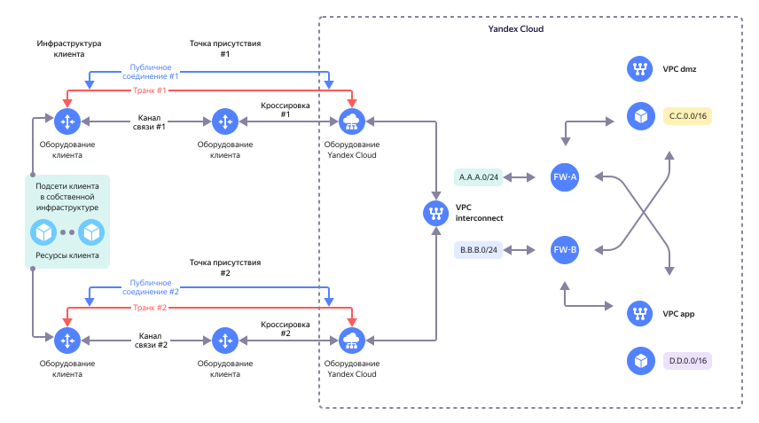

# Организация доступа через {{ interconnect-name }} к облачным сетям, размещенным за NGFW

В {{ yandex-cloud }} можно развернуть защищенную высокодоступную сетевую инфраструктуру на основе Next-Generation Firewall (NGFW) для обеспечения сегментации инфраструктуры на зоны безопасности. Каждый сегмент сети (далее сегмент) содержит ресурсы одного назначения, обособленные от других ресурсов. Например, [DMZ](https://ru.wikipedia.org/wiki/DMZ_(компьютерные_сети)) сегмент предназначен для размещения общедоступных веб-ресурсов (например, фронтенд-приложений), а сегмент Application содержит бэкенд-приложения. В облаке каждому сегменту соответствует свой каталог и своя [облачная сеть](../../vpc/concepts/network#network) {{ vpc-short-name }}. Связь между сегментами организуется через виртуальные машины Next-Generation Firewall, развернутые в двух [зонах доступности](../../overview/concepts/geo-scope.md) для отказоустойчивости.

В практических руководствах {{ yandex-cloud }} есть варианты реализации отказоустойчивой сетевой инфраструктуры с использованием NGFW:

* [UserGate](../../tutorials/routing/high-accessible-dmz-usergate)
* [Check Point](../../tutorials/routing/high-accessible-dmz)

Для организации сетевой IP-связности между ресурсами в собственной инфраструктуре клиента и облачными ресурсами в {{ yandex-cloud }} может использоваться услуга [{{ interconnect-full-name }}](../../interconnect/concepts/).

В данном документе рассмотрены настройки [маршрутизации](../../vpc/concepts/routing) в облачной сети и настройки [приватного соединения](../../interconnect/concepts/priv-con) {{ interconnect-name }}, которые позволяют обеспечить сетевую связность инфраструктуры клиента с сегментами, размещенными за NGFW.

Схема решения представлена ниже.



| Название                            | Описание                                                                                                                                   |
|-------------------------------------|--------------------------------------------------------------------------------------------------------------------------------------------|
| FW-A                                | Основной NGFW в зоне A                                                                                                                     |
| FW-B                                | Резервный NGFW в зоне B                                                                                                                    |
| {{ vpc-short-name }} `interconnect` | {{ vpc-short-name }} для подключения собственной инфраструктуры клиента с помощью {{ interconnect-name }}                                  |
| {{ vpc-short-name }} `dmz`          | {{ vpc-short-name }} для размещения фронтенд-приложений, доступных из интернет                                                             |
| {{ vpc-short-name }} `app`          | {{ vpc-short-name }} для размещения бэкенд-приложений                                                                                      |
| `A.A.A.0/24`                        | подсеть для сетевого интерфейса FW-A в {{ vpc-short-name }} `interconnect`                                                                 |
| `B.B.B.0/24`                        | подсеть для сетевого интерфейса FW-B в {{ vpc-short-name }} `interconnect`                                                                 |
| `C.C.0.0/16`                        | агрегированный префикс подсетей в {{ vpc-short-name }} `dmz`, к которым необходимо обеспечить доступ из собственной инфраструктуры клиента |
| `D.D.0.0/16`                        | агрегированный префикс подсетей в {{ vpc-short-name }} `app`, к которым необходимо обеспечить доступ из собственной инфраструктуры клиента |


## Описание маршрутизации трафика из инфраструктуры клиента к ресурсам в {{ vpc-short-name }} dmz и app { #routing-description }

При выполнении [необходимых условий](#necessary-conditions) и приведенных ниже настроек для облачных таблиц маршрутизации и {{ interconnect-name }}:
* Трафик из инфраструктуры клиента будет приходить в зону с основным NGFW и на нём маршрутизироваться в соответствующий {{ vpc-short-name }} `dmz` или `app`.
* В случае отказа основного NGFW трафик продолжит приходить в зону с основным NGFW и из нее уже маршрутизироваться к резервному NGFW в соседнюю зону (при условии использования [модуля `route-switcher`](https://github.com/yandex-cloud-examples/yc-route-switcher)).
* При отказе зоны с основным NGFW трафик будет приходить в зону с резервным NGFW (при условии использования [модуля `route-switcher`](https://github.com/yandex-cloud-examples/yc-route-switcher)) и на нём маршрутизироваться в соответствующий {{ vpc-short-name }} `dmz` или `app`.

## Необходимые условия { #necessary-conditions }

1. Используйте [модуль `route-switcher`](https://github.com/yandex-cloud-examples/yc-route-switcher) для переключения трафика в {{ vpc-short-name }} `interconnect`, `dmz`, `app` в случае отказа основного NGFW на резервный. Модуль `route-switcher` используется в практических руководствах на основе [UserGate NGFW](../../tutorials/routing/high-accessible-dmz-usergate) или [Check Point NGFW](../../tutorials/routing/high-accessible-dmz).
1. В настроенных таблицах маршрутизации не должно быть пересекающихся префиксов с сетями, используемыми в собственной инфраструктуре клиента.
1. Маршруты, анонсируемые из собственной инфраструктуры клиента через {{ interconnect-name }}, не должны пересекаться с адресным пространством подсетей в {{ vpc-short-name }} `interconnect`, `dmz` и `app`.
1. Префиксы в анонсах приватных соединений {{ interconnect-name }} (в примере это `A.A.A.0/24`, `B.B.B.0/24`, `C.C.0.0/16` и `D.D.0.0/16`) не должны пересекаться.
1. На NGFW должны быть настроены политики безопасности, разрешающие доступ из {{ vpc-short-name }} `interconnect` в {{ vpc-short-name }} `dmz` и `app` с учетом требований службы информационной безопасности клиента.
1. Таблицы маршрутизации для подсетей в {{ vpc-short-name }} `dmz` и `app` должны содержать маршруты к сетям, используемым в on-premise инфраструктуре клиента. Обычно используется маршрут по умолчанию `0.0.0.0/0`. В качестве `Next hop` для этих маршрутов должен использоваться IP-адрес основного NGFW в соответствующем {{ vpc-short-name }} `dmz` или `app`.
1. На NGFW должны быть настроены статические маршруты к сетям, используемым в собственной инфраструктуре клиента. В качестве `Next hop` для этих маршрутов нужно использовать адрес шлюза (первый адрес из диапазона подсети, например, `x.x.x.1` для подсети x.x.x.0/24) из облачной подсети интерфейса NGFW в {{ vpc-short-name }} `interconnect`.
1. Рекомендуется планировать адресные планы в {{ vpc-short-name }} `dmz` и `app` таким образом, чтобы можно было использовать агрегированные префиксы (агрегаты). Использование агрегатов (в примере это `С.С.0.0/16` и `D.D.0.0/16`) позволяет один раз настроить таблицы маршрутизации в {{ vpc-short-name }} `interconnect` и анонсы префиксов в приватных соединениях {{ interconnect-name }}. В дальнейшем при добавлении новых подсетей в {{ vpc-short-name }} `dmz` и `app` не потребуется изменять таблицы маршрутизации в {{ vpc-short-name }} `interconnect` и открывать обращения в техническую поддержку по добавлению анонсов в {{ interconnect-name }}.

## Настройте таблицы маршрутизации в {{ vpc-short-name }} interconnect { #configure-route-tables }

Настройте [таблицы маршрутизации](../../vpc/concepts/routing#rt-vpc) в {{ vpc-short-name }} `interconnect` и примените их к подсетям, в которых находятся сетевые интерфейсы основного и резервного NGFW, в соответствии с таблицами ниже.

К подсети в зоне с основным NGFW (подсеть `A.A.A.0/24` в зоне A) примените таблицу маршрутизации, содержащую более специфичные маршруты (с префиксами `/17` в примере) к подсетям в {{ vpc-short-name }} `dmz` и `app`. Префиксы из этой таблицы должны быть добавлены в [настройки анонсов](#create-private-connections-cic) для приватных соединений зоны доступности с основным NGFW.

| Префикс назначения | Next hop                                            |
|--------------------|-----------------------------------------------------|
| `С.С.0.0/17`       | IP-адрес FW-A в {{ vpc-short-name }} `interconnect` |
| `С.С.128.0/17`     | IP-адрес FW-A в {{ vpc-short-name }} `interconnect` |
| `D.D.0.0/17`       | IP-адрес FW-A в {{ vpc-short-name }} `interconnect` |
| `D.D.128.0/17`     | IP-адрес FW-A в {{ vpc-short-name }} `interconnect` |


К подсети в зоне с резервным NGFW (подсеть `B.B.B.0/24` в зоне B) примените другую таблицу маршрутизации, содержащую менее специфичные маршруты (с префиксами `/16` в примере) к подсетям в {{ vpc-short-name }} `dmz` и `app`. Префиксы из этой таблицы должны быть добавлены в [настройки анонсов](#create-private-connections-cic) для приватных соединений зоны доступности с резервным NGFW.

| Префикс назначения | Next hop                                            |
|--------------------|-----------------------------------------------------|
| `С.С.0.0/16`       | IP-адрес FW-A в {{ vpc-short-name }} `interconnect` |
| `D.D.0.0/16`       | IP-адрес FW-A в {{ vpc-short-name }} `interconnect` |

Благодаря этим настройкам трафик к подсетям в {{ vpc-short-name }} `dmz` и `app` будет направляться на основной NGFW. При условии использования [модуля `route-switcher`](https://github.com/yandex-cloud-examples/yc-route-switcher) в случае отказа основного NGFW трафик будет направляться на резервный NGFW.

Использование более специфичных и менее специфичных префиксов в таблицах маршрутизации позволяет настроить анонсы приватных соединений {{ interconnect-name }} таким образом, чтобы трафик из инфраструктуры клиента к подсетям в {{ vpc-short-name }} `dmz` и `app` направлялся в зону с основным NGFW, а в случае отказа этой зоны перенаправлялся в зону с резервным NGFW.

## Создайте приватные соединения {{ interconnect-name }} { #create-private-connections-cic }

Познакомьтесь с вариантами организации услуги {{ interconnect-name }} в [документации](../../interconnect/concepts/). Для обеспечения отказоустойчивости подключения к услуге рекомендуется организация нескольких транков — по одному в каждой [точке присутствия](../../interconnect/concepts/pops).

Воспользуйтесь [инструкцией](../../interconnect/operations/) для организации приватного соединения в зависимости от Вашего сценария подключения к услуге {{ interconnect-name }}.

При оформлении обращения в поддержку {{ yandex-cloud }} для каждого приватного соединения в анонсах подсетей по зонам доступности необходимо указать:

   1. Для зоны доступности с основным NGFW:
      * Префиксы из таблицы маршрутизации, примененной к подсети основного NGFW в {{ vpc-short-name }} `interconnect`. В примере для зоны `ru-central1-a` это более специфичные префиксы `/17`. Благодаря этим анонсам трафик из инфраструктуры клиента к подсетям в {{ vpc-short-name }} `dmz` и `app` будет приходить в зону с основным NGFW.
      * Префикс подсети для сетевого интерфейса основного NGFW в {{ vpc-short-name }} `interconnect` и другие префиксы подсетей из {{ vpc-short-name }} `interconnect` в этой зоне, которые необходимо анонсировать в собственную инфраструктуру клиента.
   1. Для зоны доступности с резервным NGFW:
      * Префиксы из таблицы маршрутизации, примененной к подсети резервного NGFW в {{ vpc-short-name }} `interconnect`. В примере для зоны `ru-central1-b` это менее специфичные префиксы `/16`. Благодаря этим анонсам в случае отказа зоны с основным NGFW трафик из инфраструктуры клиента к подсетям в {{ vpc-short-name }} `dmz` и `app` будет приходить в зону с резервным NGFW.
      * Префикс подсети для сетевого интерфейса резервного NGFW в {{ vpc-short-name }} `interconnect` и другие префиксы подсетей из {{ vpc-short-name }} `interconnect` в этой зоне, которые необходимо анонсировать в собственную инфраструктуру клиента.

Для приведенного в этом документе примера укажите следующую информацию в разделе `vpc`:

```yaml
vpc: 
  vpc_net_id: <id для {{ vpc-short-name }} interconnect> 
    vpc_subnets:
      ru-central1-a: [A.A.A.0/24, C.C.0.0/17, C.C.128.0/17, D.D.0.0/17, D.D.128.0/17]
      ru-central1-b: [B.B.B.0/24, C.C.0.0/16, D.D.0.0/16]
```