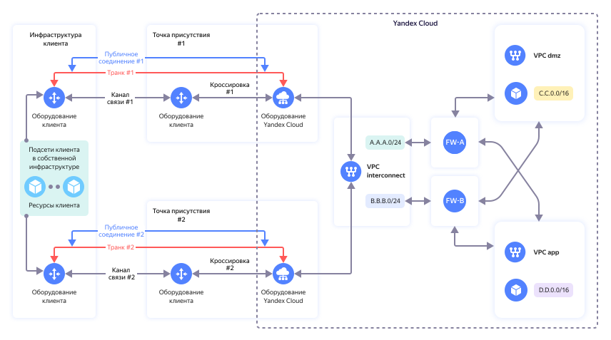

# Организация доступа через {{ interconnect-name }} к облачным сетям, размещенным за NGFW

В {{ yandex-cloud }} можно развернуть защищенную высокодоступную сетевую инфраструктуру на основе Next-Generation Firewall (NGFW) для обеспечения сегментации инфраструктуры на зоны безопасности. Каждый сегмент сети (далее сегмент) содержит ресурсы одного назначения, обособленные от других ресурсов. Например, [DMZ](https://ru.wikipedia.org/wiki/DMZ_(компьютерные_сети)) сегмент предназначен для размещения общедоступных веб-ресурсов (например, фронтенд-приложений), а сегмент Application содержит бэкенд-приложения. В облаке каждому сегменту соответствует свой каталог и своя [облачная сеть](../../vpc/concepts/network.md#network) {{ vpc-short-name }}. Связь между сегментами организуется через виртуальные машины Next-Generation Firewall, развернутые в двух [зонах доступности](../../overview/concepts/geo-scope.md) для отказоустойчивости.

В практических руководствах {{ yandex-cloud }} есть варианты реализации отказоустойчивой сетевой инфраструктуры с использованием NGFW:

* [UserGate](../../tutorials/routing/high-accessible-dmz-usergate.md)
* [Check Point](../../tutorials/routing/high-accessible-dmz.md)

Для организации сетевой IP-связности между ресурсами в вашей инфраструктуре и облачными ресурсами в {{ yandex-cloud }} вы можете использовать услугу [{{ interconnect-full-name }}](../../interconnect/concepts/index.md).

В этом руководстве рассмотрены настройки [маршрутизации](../../vpc/concepts/routing.md) в облачной сети и настройки [приватного соединения](../../interconnect/concepts/priv-con.md) {{ interconnect-name }}, с помощью которых вы обеспечите сетевую связность своей инфраструктуры с сегментами, размещенными за NGFW.

Схема решения представлена ниже.

| Название                            | Описание                                                                                                                                   |
|-------------------------------------|--------------------------------------------------------------------------------------------------------------------------------------------|
| FW-A                                | Основной NGFW в зоне A                                                                                                                     |
| FW-B                                | Резервный NGFW в зоне B                                                                                                                    |
| {{ vpc-short-name }} `interconnect` | {{ vpc-short-name }} для подключения вашей инфраструктуры с помощью {{ interconnect-name }}                                  |
| {{ vpc-short-name }} `dmz`          | {{ vpc-short-name }} для размещения фронтенд-приложений, доступных из интернет                                                             |
| {{ vpc-short-name }} `app`          | {{ vpc-short-name }} для размещения бэкенд-приложений                                                                                      |
| `A.A.A.0/24`                        | подсеть для сетевого интерфейса FW-A в {{ vpc-short-name }} `interconnect`                                                                 |
| `B.B.B.0/24`                        | подсеть для сетевого интерфейса FW-B в {{ vpc-short-name }} `interconnect`                                                                 |
| `C.C.0.0/16`                        | агрегированный префикс подсетей в {{ vpc-short-name }} `dmz`, к которым необходимо обеспечить доступ из вашей инфраструктуры |
| `D.D.0.0/16`                        | агрегированный префикс подсетей в {{ vpc-short-name }} `app`, к которым необходимо обеспечить доступ из вашей инфраструктуры |

## Описание маршрутизации трафика из вашей инфраструктуры к ресурсам в {{ vpc-short-name }} dmz и app {#routing-description}

При выполнении [необходимых условий](#necessary-conditions) и приведенных ниже настроек для облачных таблиц маршрутизации и {{ interconnect-name }}:

* Трафик из вашей инфраструктуры будет приходить в зону с основным NGFW и на нем маршрутизироваться в соответствующий {{ vpc-short-name }} `dmz` или `app`.
* В случае отказа основного NGFW трафик продолжит приходить в зону с основным NGFW и из нее уже маршрутизироваться к резервному NGFW в соседнюю зону (при условии использования [модуля `route-switcher`](https://github.com/yandex-cloud-examples/yc-route-switcher)).
* При отказе зоны с основным NGFW трафик будет приходить в зону с резервным NGFW (при условии использования [модуля `route-switcher`](https://github.com/yandex-cloud-examples/yc-route-switcher)) и на нем маршрутизироваться в соответствующий {{ vpc-short-name }} `dmz` или `app`.

## Необходимые условия {#necessary-conditions}

1. Используйте [модуль `route-switcher`](https://github.com/yandex-cloud-examples/yc-route-switcher) для переключения трафика в {{ vpc-short-name }} `interconnect`, `dmz`, `app` в случае отказа основного NGFW на резервный. Модуль `route-switcher` используется в практических руководствах на основе [UserGate NGFW](../../tutorials/routing/high-accessible-dmz-usergate) или [Check Point NGFW](../../tutorials/routing/high-accessible-dmz).
1. В настроенных таблицах маршрутизации не должно быть пересекающихся префиксов с сетями, используемыми в вашей инфраструктуре.
1. Маршруты, которые вы анонсируете из своей инфраструктуры через {{ interconnect-name }}, не должны пересекаться с адресным пространством подсетей в {{ vpc-short-name }} `interconnect`, `dmz` и `app`.
1. IP-префиксы, добавляемые в виртуальный маршрутизатор (в примере это `A.A.A.0/24`, `B.B.B.0/24`, `C.C.0.0/16` и `D.D.0.0/16`), не должны пересекаться.
1. Настройте на NGFW политики безопасности, разрешающие доступ из {{ vpc-short-name }} `interconnect` в {{ vpc-short-name }} `dmz` и `app`, с учетом требований вашей службы информационной безопасности.
1. Добавьте в таблицы маршрутизации для подсетей в {{ vpc-short-name }} `dmz` и `app` маршруты к сетям, используемым в вашей инфраструктуре on-premises. Обычно используется маршрут по умолчанию `0.0.0.0/0`. В качестве `Next hop` для этих маршрутов укажите IP-адрес основного NGFW в соответствующем {{ vpc-short-name }} `dmz` или `app`.
1. Настройте на NGFW статические маршруты к сетям, используемым в вашей инфраструктуре. В качестве `Next hop` для этих маршрутов укажите адрес шлюза (первый адрес из диапазона подсети, например, `x.x.x.1` для подсети x.x.x.0/24) из облачной подсети интерфейса NGFW в {{ vpc-short-name }} `interconnect`.
1. Рекомендуется планировать адресные планы в {{ vpc-short-name }} `dmz` и `app` таким образом, чтобы можно было использовать агрегированные префиксы (агрегаты). Использование агрегатов (в примере это `C.C.0.0/16` и `D.D.0.0/16`) позволяет один раз настроить таблицы маршрутизации в {{ vpc-short-name }} `interconnect` и анонсы префиксов в виртуальном маршрутизаторе. В дальнейшем при добавлении новых подсетей в {{ vpc-short-name }} `dmz` и `app` изменять эти настройки не потребуется.

## Настройте таблицы маршрутизации в {{ vpc-short-name }} interconnect {#configure-route-tables}

Настройте [таблицы маршрутизации](../../vpc/concepts/routing.md#rt-vpc) в {{ vpc-short-name }} `interconnect` и примените их к подсетям, в которых находятся сетевые интерфейсы основного и резервного NGFW, в соответствии с таблицами ниже.

К подсети в зоне с основным NGFW (подсеть `A.A.A.0/24` в зоне A) примените таблицу маршрутизации, содержащую более специфичные маршруты (с префиксами `/17` в примере) к подсетям в {{ vpc-short-name }} `dmz` и `app`. Префиксы из этой таблицы должны быть добавлены в [настройки анонсов](#create-private-connections-cic) виртуального маршрутизатора для зоны доступности с основным NGFW.

| Префикс назначения | Next hop                                            |
|--------------------|-----------------------------------------------------|
| `C.C.0.0/17`       | IP-адрес FW-A в {{ vpc-short-name }} `interconnect` |
| `C.C.128.0/17`     | IP-адрес FW-A в {{ vpc-short-name }} `interconnect` |
| `D.D.0.0/17`       | IP-адрес FW-A в {{ vpc-short-name }} `interconnect` |
| `D.D.128.0/17`     | IP-адрес FW-A в {{ vpc-short-name }} `interconnect` |

К подсети в зоне с резервным NGFW (подсеть `B.B.B.0/24` в зоне B) примените другую таблицу маршрутизации, содержащую менее специфичные маршруты (с префиксами `/16` в примере) к подсетям в {{ vpc-short-name }} `dmz` и `app`. Префиксы из этой таблицы должны быть добавлены в [настройки анонсов](#create-private-connections-cic) виртуального маршрутизатора для зоны доступности с резервным NGFW.

| Префикс назначения | Next hop                                            |
|--------------------|-----------------------------------------------------|
| `C.C.0.0/16`       | IP-адрес FW-B в {{ vpc-short-name }} `interconnect` |
| `D.D.0.0/16`       | IP-адрес FW-B в {{ vpc-short-name }} `interconnect` |

Благодаря этим настройкам трафик к подсетям в {{ vpc-short-name }} `dmz` и `app` будет направляться на основной NGFW. При условии использования [модуля `route-switcher`](https://github.com/yandex-cloud-examples/yc-route-switcher) в случае отказа основного NGFW трафик будет направляться на резервный NGFW.

Использование более специфичных и менее специфичных префиксов в таблицах маршрутизации позволяет настроить анонсы виртуального маршрутизатора таким образом, чтобы трафик из вашей инфраструктуры к подсетям в {{ vpc-short-name }} `dmz` и `app` направлялся в зону с основным NGFW, а в случае отказа этой зоны перенаправлялся в зону с резервным NGFW.

## Настройте {{ interconnect-name }} и виртуальный маршрутизатор {#create-private-connections-cic}

Познакомьтесь с вариантами организации услуги {{ interconnect-name }} в [документации](../../interconnect/concepts/index.md). Для обеспечения отказоустойчивости подключения к услуге рекомендуется создать несколько транковых подключений — по одному в каждой [точке присутствия](../../interconnect/concepts/pops.md).

1. [Создайте транковые подключения](../../interconnect/operations/trunk-create.md) и организуйте их физическое подключение. Если транковые подключения уже созданы, используйте существующие.
1. В каждом транковом подключении [создайте приватное соединение](../../interconnect/operations/priv-con-create.md).
1. [Создайте виртуальный маршрутизатор](../../cloud-router/operations/ri-create.md) или выберите существующий.
1. [Добавьте приватные соединения](../../cloud-router/operations/ri-priv-con-add.md) в виртуальный маршрутизатор.
1. [Добавьте сеть](../../cloud-router/operations/ri-prefixes-upsert.md#add-network) `interconnect` в виртуальный маршрутизатор и укажите следующие IP-префиксы:

   Зона доступности | IP-префиксы
   --- | ---
   `{{ region-id }}-a` | `A.A.A.0/24`, `C.C.0.0/17`, `C.C.128.0/17`, `D.D.0.0/17`, `D.D.128.0/17`
   `{{ region-id }}-b` | `B.B.B.0/24`, `C.C.0.0/16`, `D.D.0.0/16`

Префиксы `/17` направляют трафик в зону с основным NGFW. Если эта зона становится недоступна, более специфичные префиксы перестают анонсироваться и трафик направляется по префиксам `/16` в зону с резервным NGFW.

Проверьте состояние BGP-сессий приватных соединений с помощью [мониторинга](../../interconnect/concepts/monitoring.md#private-mon).

Если вы создаете новые подсети в уже анонсированном агрегированном префиксе, изменять настройки виртуального маршрутизатора не требуется. Чтобы анонсировать префикс за пределами настроенного агрегата, [обновите IP-префиксы](../../cloud-router/operations/ri-prefixes-upsert.md#update-prefixes) самостоятельно.
