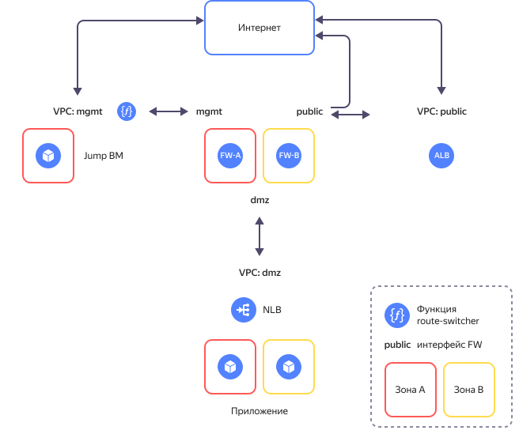

# Реализация защищенной высокодоступной сетевой инфраструктуры с выделением DMZ на основе Смарт-Софт NGFW

С помощью руководства вы развернете защищенную сетевую инфраструктуру на основе [Смарт-Софт Traffic Inspector Next Generation (TING)](https://www.smart-soft.ru/). Инфраструктура состоит из сегментов, каждый из которых содержит ресурсы одного назначения, обособленные от других ресурсов. Например, [DMZ](https://ru.wikipedia.org/wiki/DMZ_(компьютерные_сети)) сегмент предназначен для размещения общедоступных приложений, а сегмент `mgmt` содержит ресурсы для управления инфраструктурой. В облаке каждому сегменту соответствует свой каталог и своя [облачная сеть](../../vpc/concepts/network.md#network) {{ vpc-short-name }}. Связь между сегментами происходит через виртуальную машину [Next-Generation Firewall (NGFW)](https://en.wikipedia.org/wiki/Next-generation_firewall), обеспечивающую комплексную защиту сегментов и контроль трафика между сегментами.

Схема решения представлена ниже.



Решение включает следующие основные сегменты (каталоги):

* Каталог **public** предназначен для размещения ресурсов с доступом из сети интернет.
* Каталог **mgmt** предназначен для управления облачной инфраструктурой и размещения служебных ресурсов. Включает в себя две ВМ для защиты инфраструктуры и сегментации сети на зоны безопасности (`fw-a` и `fw-b`) и ВМ c настроенным [WireGuard VPN](https://www.wireguard.com/) для защищенного доступа к сегменту управления (`jump-vm`).
* Каталог **dmz** предоставляет возможность публикации приложений с открытым доступом из внешней сети интернет.

Более подробное описание приведено в [репозитории проекта](https://github.com/yandex-cloud-examples/yc-dmz-with-high-available-ting-ngfw).

Чтобы развернуть защищенную высокодоступную сетевую инфраструктуру с выделением DMZ на основе Смарт-Софт TING:

1. [Подготовьте облако к работе](#prepare-cloud).
1. [Подготовьте окружение](#prepare-environment).
1. [Разверните ресурсы](#create-resources).
1. [Настройте NGFW](#configure-ngfw).
1. [Включите работу модуля route-switcher](#enable-route-switcher).
1. [Протестируйте работоспособность и отказоустойчивость решения](#test-accessibility).
1. [Требования к развертыванию в продуктивной среде](#deployment-requirements).

Если созданные ресурсы вам больше не нужны, [удалите их](#clear-out).

### Next-Generation Firewall {#next-generation-firewall}

NGFW используется для защиты и сегментации облачной сети с выделением DMZ-зоны для размещения публичных приложений.

В [{{ marketplace-full-name }}]({{ link-cloud-marketplace }}?categories=security) доступно несколько вариантов NGFW. В данном сценарии используется решение Смарт-Софт Traffic Inspector Next Generation (TING), предоставляющее следующие возможности:

* межсетевой экран следующего поколения: защищает виртуальную сеть от несанкционированного доступа извне, обеспечивает NAT, проброс портов, перехват пакетов;
* система обнаружения и предотвращения вторжений: IDS/IPS распознает источники атак и атакуемые устройства по определенным сигнатурам сетевого трафика и эффективно «очищает» его;
* TCP/UDP-прокси-сервер общего назначения: прокси-сервер на базе Nginx обеспечивает балансировку нагрузки, переопределение заголовков веб-сервера, обработку TCP- и UDP-трафика;
* продукт входит в реестр российского ПО и сертифицирован ФСТЭК России на соответствие требованиям к межсетевым экранам типа «Б» 4-го класса защиты, системам обнаружения вторжений уровня сети 4-го класса защиты, требованиям по безопасности информации — по 4-му уровню доверия.

Смарт-Софт TING в данном руководстве настроен с базовыми правилами межсетевого экранирования и NAT-трансляций.

Подробнее познакомиться с возможностями Смарт-Софт TING можно в [Руководстве пользователя TING](https://ting-docs.smart-soft.ru/).

## Подготовьте облако к работе {#prepare-cloud}



### Необходимые платные ресурсы {#paid-resources}

В стоимость поддержки инфраструктуры входит:

* плата за постоянно работающие ВМ (см. [тарифы {{ compute-full-name }}](../../compute/pricing.md));
* плата за использование {{ alb-name }} (см. [тарифы {{ alb-full-name }}](../../application-load-balancer/pricing.md));
* плата за использование {{ network-load-balancer-name }} (см. [тарифы {{ network-load-balancer-full-name }}](../../network-load-balancer/pricing.md));
* плата за использование публичных IP-адресов и исходящий трафик (см. [тарифы {{ vpc-full-name }}](../../vpc/pricing.md));
* плата за использование функций (см. [тарифы {{ sf-full-name }}](../../functions/pricing.md)).

### Необходимые квоты {#required-quotes}



В руководстве предполагается развертывание ресурсоемкой инфраструктуры.



Убедитесь, что в облаке достаточно [квот](../../overview/concepts/quotas-limits.md) и они не заняты ресурсами для других задач.



   | Ресурс                                   | Количество       |
   |------------------------------------------|------------------|
   | Каталоги                                 | 3                |
   | Группы виртуальных машин                 | 1                |
   | Виртуальные машины                       | 5                |
   | vCPU виртуальных машин                   | 14               |
   | RAM виртуальных машин                    | 22 ГБ            |
   | Диски                                    | 5                |
   | Объем SSD-дисков                         | 200 ГБ           |
   | Объем HDD-дисков                         | 30 ГБ            |
   | Облачные сети                            | 3                |
   | Подсети                                  | 6                |
   | Таблицы маршрутизации                    | 2                |
   | Группы безопасности                      | 6                |
   | Статические публичные IP-адреса          | 4                |
   | Публичные IP-адреса                      | 4                |
   | Статические маршруты                     | 5                |
   | Бакеты                                   | 1                |
   | Функции {{ sf-name }}                    | 1                |
   | Триггеры                                 | 1                |
   | Общий объем RAM всех запущенных функций  | 128 МБ           |
   | Балансировщики {{ network-load-balancer-name }} | 2         |
   | Целевые группы для {{ network-load-balancer-name }} | 2     |
   | Балансировщики {{ alb-name }}            | 1                |
   | Группы бэкендов для {{ alb-name }}       | 1                |
   | Целевые группы для {{ alb-name }}        | 1                |



## Подготовьте окружение {#prepare-environment}

### Создайте сервисный аккаунт с правами администратора на облако {#create-account}
   


- Консоль управления {#console}

   1. В [консоли управления]({{ link-console-main }}) выберите [каталог](../../resource-manager/concepts/resources-hierarchy.md#folder), в котором хотите создать сервисный аккаунт.
   1. В списке сервисов выберите **{{ ui-key.yacloud.iam.folder.dashboard.label_iam }}**.
   1. Нажмите кнопку **{{ ui-key.yacloud.iam.folder.service-accounts.button_add }}**.
   1. Введите имя сервисного аккаунта, например, `sa-terraform`.

       Требования к формату имени:

       

       

   1. Нажмите кнопку **{{ ui-key.yacloud.iam.folder.service-account.popup-robot_button_add }}**.

   1. Назначьте сервисному аккаунту [роль](../../iam/concepts/access-control/roles.md) администратора:

       1. На [стартовой странице]({{ link-console-main }}) консоли управления выберите облако.
       1. Перейдите на вкладку **{{ ui-key.yacloud.common.resource-acl.label_access-bindings }}**.
       1. Нажмите кнопку **{{ ui-key.yacloud.common.resource-acl.button_configure-access }}**.
       1. В открывшемся окне выберите раздел **{{ ui-key.yacloud_components.acl.label.service-accounts }}** и выберите сервисный аккаунт `sa-terraform`.
       1. Нажмите кнопку  **{{ ui-key.yacloud_components.acl.button.add-role }}** и выберите роль `admin`.
       1. Нажмите кнопку **{{ ui-key.yacloud_components.acl.action.apply }}**.

- CLI {#cli}

   

   

   1. Создайте сервисный аккаунт:

         ```bash
         yc iam service-account create --name sa-terraform
         ```

         Где `name` — имя сервисного аккаунта. Требования к имени:

         

         Результат:

         ```text
         id: ajehr0to1g8b********
         folder_id: b1gv87ssvu49********
         created_at: "2024-01-04T09:03:11.665153755Z"
         name: sa-terraform
         ```
      
   1. Назначьте аккаунту [роль](../../iam/concepts/access-control/roles.md) администратора:

         ```bash
         yc resource-manager cloud add-access-binding <идентификатор_облака> \
           --role admin \
           --subject serviceAccount:<идентификатор_сервисного_аккаунта>
         ```

         Результат:

         ```text
         done (1s)
         ```

- API {#api}

   Чтобы создать сервисный аккаунт, воспользуйтесь методом REST API [create](../../iam/api-ref/ServiceAccount/create.md) для ресурса [ServiceAccount](../../iam/api-ref/ServiceAccount/index.md) или вызовом gRPC API [ServiceAccountService/Create](../../iam/api-ref/grpc/ServiceAccount/create.md).

   



### Установите необходимые утилиты {#install-utilities}

1. Установите [Git](https://ru.wikipedia.org/wiki/Git) с помощью команды:

   ```bash
   sudo apt install git
   ```

1. Установите {{ TF }}:

   1. Перейдите в корневую папку:

      ```bash
      cd ~
      ```

   1. Создайте папку `terraform` и перейдите в нее:
   
      ```bash
      mkdir terraform
      cd terraform
      ```

   1. [Выберите](../../tutorials/infrastructure-management/terraform-quickstart.md#install-terraform) версию {{ TF }} и дистрибутив для вашей платформы. В данном руководстве используется дистрибутив {{ TF }} версии 1.12.1 для платформы Linux. Скачайте файл:

      ```bash
      curl \
        --location \
        --remote-name \
        https://hashicorp-releases.yandexcloud.net/terraform/1.12.1/terraform_1.12.1_linux_arm64.zip
      ```

   1. Установите утилиту `zip` и распакуйте zip-архив:
      
      ```bash
      apt install zip
      unzip terraform_1.12.1_linux_arm64.zip
      ```

   1. Добавьте путь к папке, в которой находится исполняемый файл, в переменную `PATH`: 
      
      ```bash
      export PATH=$PATH:~/terraform
      ```

   1. Убедитесь, что {{ TF }} установлен, выполнив команду:
   
      ```bash
      terraform -help
      ```

1. Создайте конфигурационный файл с указанием источника провайдеров для {{ TF }}:

   1. Создайте файл `.terraformrc` с помощью встроенного редактора `nano`:

      ```bash
      cd ~
      nano .terraformrc
      ```

   1. Добавьте в него следующий блок:

      ```text
      provider_installation {
        network_mirror {
          url = "https://terraform-mirror.yandexcloud.net/"
          include = ["registry.terraform.io/*/*"]
        }
        direct {
          exclude = ["registry.terraform.io/*/*"]
        }
      }
      ```

      Подробнее о настройках зеркал см. в [документации {{ TF }}](https://www.terraform.io/cli/config/config-file#explicit-installation-method-configuration).

## Разверните ресурсы {#create-resources}

1. Клонируйте [репозиторий](https://github.com/yandex-cloud-examples/yc-dmz-with-high-available-ting-ngfw) из GitHub и перейдите в папку сценария `yc-dmz-with-high-available-ting-ngfw`:
   
   ```bash
   git clone https://github.com/yandex-cloud-examples/yc-dmz-with-high-available-ting-ngfw.git
   cd yc-dmz-with-high-available-ting-ngfw
   ```

1. Настройте профиль CLI для выполнения операций от имени сервисного аккаунта:

   

   - CLI {#cli}

      

      

      1. Создайте [авторизованный ключ](../../iam/concepts/authorization/key.md) для сервисного аккаунта и запишите его в файл:
         
         ```bash
         yc iam key create \
           --service-account-id <идентификатор_сервисного_аккаунта> \
           --folder-id <id_каталога_с_сервисным_аккаунтом> \
           --output key.json
         ```

         Где:
         
         * `service-account-id` — идентификатор сервисного аккаунта;
         * `folder-id` — идентификатор каталога, в котором создан сервисный аккаунт;
         * `output` — имя файла с авторизованным ключом.

         Результат:
         
         ```text
         id: aje8nn871qo4********
         service_account_id: ajehr0to1g8b********
         created_at: "2023-03-04T09:16:43.479156798Z"
         key_algorithm: RSA_2048
         ```

      1. Создайте профиль CLI для выполнения операций от имени сервисного аккаунта:
        
         ```bash
         yc config profile create sa-terraform
         ```

         Результат:
         
         ```text
         Profile 'sa-terraform' created and activated
         ```

      1. Задайте конфигурацию профиля:
         
         ```bash
         yc config set service-account-key key.json
         yc config set cloud-id <идентификатор_облака>
         yc config set folder-id <идентификатор_каталога>
         ```

         Где:

         * `service-account-key` — файл с авторизованным ключом сервисного аккаунта;
         * `cloud-id` — [идентификатор облака](../../resource-manager/operations/cloud/get-id.md);
         * `folder-id` — [идентификатор каталога](../../resource-manager/operations/folder/get-id.md).

      1. Добавьте аутентификационные данные в переменные окружения:
         
         ```bash
         export YC_TOKEN=$(yc iam create-token)
         ```

   

1. Получите IP-адрес вашего ПК:
      
   ```bash
   curl 2ip.ru
   ```

   Результат:
   
   ```text
   192.2**.**.**
   ```

1. Откройте файл `terraform.tfvars` с помощью редактора `nano` и отредактируйте:

   1. Строку, содержащую идентификатор облака:
      
      ```text
      cloud_id = "<идентификатор_облака>"
      ```

   1. Строку, содержащую список разрешенных публичных IP-адресов для доступа к ВМ `jump-vm`:
      
      ```text
      trusted_ip_for_access_jump-vm = ["<внешний_IP_адрес_вашего_ПК>/32"]
      ```

   

   | Название<br>параметра | Нужно<br>изменение | Описание | Тип | Пример |
   | ----------- | ----------- | ----------- | ----------- | ----------- |
   | `cloud_id` | да | Идентификатор вашего облака в {{ yandex-cloud }} | `string` | `b1g8dn6s3v2e********` |
   | `az_name_list` | - | Список из двух <a href="../../overview/concepts/geo-scope">зон доступности</a> {{ yandex-cloud }} для размещения ресурсов | `list(string)` | `["{{ region-id }}-a", "{{ region-id }}-b"]` |
   | `security_segment_names` | - | Список названий сегментов. Первый сегмент для размещения ресурсов управления, второй — с публичным доступом в интернет, третий — для DMZ. Если требуются дополнительные сегменты, то нужно добавлять их в конец списка. При добавлении сегмента обязательно добавьте префиксы для подсетей в списки `zone1_subnet_prefix_list` и `zone2_subnet_prefix_list`. | `list(string)` |  `["mgmt", "public", "dmz"]` |
   | `zone1_subnet_prefix_list` | - | Список сетевых префиксов в первой зоне доступности для подсетей, соответствующих списку названий сегментов `security_segment_names`. По одному префиксу для сегмента. | `list(string)` | `["192.168.1.0/24", "172.16.1.0/24", "10.160.1.0/24"]` |
   | `zone2_subnet_prefix_list` | - | Список сетевых префиксов во второй зоне доступности для подсетей, соответствующих списку названий сегментов `security_segment_names`. По одному префиксу для сегмента. | `list(string)` | `["192.168.2.0/24", "172.16.2.0/24", "10.160.2.0/24"]` |
   | `public_app_port` | - | TCP-порт опубликованного в DMZ приложения для подключения из сети интернет | `number` | `80` |
   | `internal_app_port` | - | Внутренний TCP-порт опубликованного в DMZ приложения, на который NGFW будет направлять трафик. Может отличаться от `public_app_port` или совпадать с ним. | `number` | `8080` |
   | `trusted_ip_for_access_jump-vm` | да | Список публичных IP-адресов и подсетей, с которых разрешено подключение к Jump ВМ. Используется во входящем правиле группы безопасности для Jump ВМ. | `list(string)` | `["A.A.A.A/32", "B.B.B.0/24"]` |
   | `vm_admin_username` | - | Имя пользователя для подключения к Jump ВМ по SSH | `string` | `vm-admin` |
   | `fw_admin_username` | - | Имя пользователя для подключения к FW по HTTPS и SSH | `string` | `admin` |
   | `wg_port` | - | UDP-порт для входящих соединений в настройках WireGuard на Jump ВМ | `number` | `51820` |
   | `wg_client_dns` | - | Список адресов DNS-серверов в облачной сети управления, которые будет использовать рабочая станция администратора после поднятия туннеля WireGuard к Jump ВМ | `string` | `192.168.1.2, 192.168.2.2` |

   

1. Разверните ресурсы в облаке с помощью {{ TF }}:

   1. Выполните инициализацию {{ TF }}:
       
      ```bash
      terraform init
      ```

   1. Проверьте конфигурацию {{ TF }} файлов:
       
      ```bash
      terraform validate
      ```

   1. Проверьте список создаваемых облачных ресурсов:
       
      ```bash
      terraform plan
      ```

   1. Создайте ресурсы:
       
      ```bash
      terraform apply
      ```

1. После завершения процесса `terraform apply` в командной строке будет выведен список информации о развернутых ресурсах. В дальнейшем его можно будет посмотреть с помощью команды `terraform output`:

   

   | Название | Описание | Пример значения |
   | ----------- | ----------- | ----------- |
   | `dmz-web-server-nlb_ip_address` | IP-адрес балансировщика трафика в сегменте `dmz`, за которым находится целевая группа с веб-серверами для тестирования публикации приложения из DMZ. Используется для настройки Destination NAT в FW. | `"10.160.1.100"` |
   | `fw-a_admin_password` | Пароль по умолчанию для доступа к FW-A | `"fv4a3n5eqf2dbddg4t3h"` |
   | `fw-a_ip_address` | IP-адрес в сети управления для FW-A | `"192.168.1.10"` |
   | `fw-alb_public_ip_address` | Публичный IP-адрес балансировщика ALB. Используется для обращения к опубликованному в DMZ приложению из сети интернет. | `"C.C.C.C"` |
   | `fw-b_admin_password` | Пароль по умолчанию для доступа к FW-B | `"epdn4qrm1imbakudbu5c"` |
   | `fw-b_ip_address` | IP-адрес в сети управления для FW-B | `"192.168.2.10"` |
   | `jump-vm_path_for_WireGuard_client_config` | Файл конфигурации для защищенного VPN-подключения с помощью клиента WireGuard к Jump ВМ | `"./jump-vm-wg.conf"` |
   | `jump-vm_public_ip_address_jump-vm` | Публичный IP-адрес Jump ВМ | `"D.D.D.D"` |
   | `path_for_private_ssh_key` | Файл с закрытым ключом для подключения по протоколу SSH к ВМ (`jump-vm`, `fw-a`, `fw-b`, веб-серверам в сегменте `dmz`) | `"./pt_key.pem"` |
   
   

## Настройте NGFW {#configure-ngfw}

В руководстве приводятся шаги настройки FW-A и FW-B с базовыми правилами межсетевого экранирования и NAT-трансляций, необходимыми для проверки работоспособности и тестирования отказоустойчивости в руководстве, но недостаточными для [развертывания инфраструктуры в продуктивной среде](#deployment-requirements).

### Подключитесь к сегменту управления через VPN {#connect-via-vpn}

После развертывания инфраструктуры в каталоге `mgmt` появится ВМ `jump-vm` на основе образа Ubuntu с настроенным [WireGuard VPN](https://www.wireguard.com/) для защищенного подключения. На вашем ПК настройте VPN-туннель к ВМ `jump-vm` для доступа к подсетям сегментов `mgmt`, `dmz`, `public`.

Вы также можете подключиться к Jump ВМ по SSH, используя SSH-ключ из вывода `terraform output` и логин из значения переменной `vm_admin_username`.

Чтобы настроить VPN-туннель:

1. [Установите](https://www.wireguard.com/install/) на ваш ПК приложение WireGuard.
1. Откройте приложение WireGuard и нажмите кнопку **Add Tunnel**.
1. В появившемся диалоге выберите файл `jump-vm-wg.conf` в папке `yc-dmz-with-high-available-ting-ngfw`.
1. Нажмите кнопку **Activate**, чтобы активировать туннель.
1. Проверьте сетевую связность с сервером управления через VPN-туннель WireGuard, в терминале выполнив команду:
   
   ```bash
   ping 192.168.1.101
   ```

   

   Если пакеты не достигают сервера управления, убедитесь, что в [группе безопасности](../../vpc/concepts/security-groups.md) `mgmt-jump-vm-sg` в правилах входящего трафика указан верный внешний IP-адрес вашего ПК.

   

### Настройте межсетевой экран FW-A {#configure-fw-a}

Подключитесь к веб-интерфейсу управления FW-A по адресу `https://192.168.1.10`. Учетная запись администратора: логин из значения переменной `fw_admin_username`, пароль из вывода `terraform output fw-a_admin_password` (без кавычек).

#### Настройте сеть {#configure-fw-a-network}

1. В левом меню в секции **Сводка** выберите **Пароль**. Укажите старый пароль из вывода `terraform output fw-a_admin_password` и задайте новый пароль.

1. В левом меню в секции **Система** выберите **Настройки** -> **Общие**. В поле **Имя хоста** укажите `fw-a`. В поле **Часовой пояс** выберите Ваш часовой пояс. В разделе **DNS-серверы** укажите IP-адрес `192.168.1.2` облачного DNS-сервера в сегменте `mgmt`. Нажмите **Сохранить**.

1. В левом меню в секции **Службы** выберите **Сетевое время** -> **Общие**. В разделе **Серверы времени** укажите адреса NTP-серверов (см. [список рекомендуемых NTP-серверов](../../tutorials/infrastructure-management/ntp.md)). Активируйте чекбокс напротив предпочтительного сервера в столбце **Предпочитать**. Нажмите **Сохранить**.

1. В левом меню в секции **Интерфейсы** выберите **\[WAN\]**. В поле **Описание** укажите `mgmt`. Нажмите **Сохранить**.

1. В левом меню в секции **Система** выберите **Маршруты** -> **Конфигурация**. Нажмите кнопку с символом `+` для добавления маршрута. В поле **Адрес сети** укажите `192.168.2.0/24`. В поле **Шлюз** выберите `MGMT_DHCP - 192.168.1.1`. В поле **Описание** укажите `route to mgmt-zone2`. Нажмите **Сохранить**. Нажмите **Применить**.

1. В левом меню в секции **Интерфейсы** выберите **Назначения портов**. В поле **Новый интерфейс** выберите порт `vtnet1` и в поле **Описание** укажите `public`. Нажмите кнопку с символом `+`. В поле **Новый интерфейс** выберите порт `vtnet2` и в поле **Описание** укажите `dmz`. Нажмите кнопку с символом `+`. Нажмите **Сохранить**.

1. В левом меню в секции **Интерфейсы** выберите **\[public\]**. В поле **Включен** активируйте чекбокс **Включить интерфейс**. В поле **Тип конфигурации IPv4** выберите `DHCP`. Нажмите **Сохранить**.

1. В левом меню в секции **Интерфейсы** выберите **\[dmz\]**. В поле **Включен** активируйте чекбокс **Включить интерфейс**. В поле **Тип конфигурации IPv4** выберите `DHCP`. Нажмите **Сохранить**.

1. Вверху страницы появится сообщение об изменении конфигурации интерфейса. Нажмите **Применить изменения**.

1. В левом меню в секции **Система** выберите **Маршруты** -> **Конфигурация**. Нажмите кнопку с символом `+` для добавления маршрута. Добавьте статические маршруты согласно таблице ниже. После добавления всех маршрутов нажмите **Применить**.

| Адрес сети        | Шлюз                   | Описание                     |
|-------------------|------------------------|-----------------------------|
| `10.160.2.0/24`   | `DMZ_DHCP - 10.160.1.1` | `route to dmz-zone2`        |
| `198.18.235.0/24` | `MGMT_DHCP - 192.168.1.1` | `route to nlb-healthcheck-net1` |
| `198.18.248.0/24` | `MGMT_DHCP - 192.168.1.1` | `route to nlb-healthcheck-net2` |

1. В левом меню в секции **Система** выберите **Шлюзы** -> **Одиночный**. В строке шлюза `PUBLIC_DHCP` нажмите символ с изображением карандаша. В поле **Основной шлюз** активируйте чекбокс и нажмите **Сохранить**. Вверху страницы нажмите **Применить изменения**.

#### Диагностика применения базовых настроек {#diagnostics-base-settings-fw-a}

1. В левом меню в секции **Система** выберите **Маршруты** -> **Статус**. Проверьте, что в выводе маршрутной информации отображаются добавленные статические маршруты и шлюз по умолчанию `172.16.1.1`.

1. В левом меню в секции **Интерфейсы** выберите **Диагностика** -> **Просмотр DNS-записей**. В поле **Имя хоста или IP-адрес** введите доменное имя ресурса в интернете, например, `ya.ru`. Нажмите **Просмотр DNS-записей** и проверьте, что доменное имя разрешается в публичные IP-адреса.

1. В левом меню в секции **Интерфейсы** выберите **Диагностика** -> **Ping**. В поле **Хост** введите доменное имя ресурса в интернете, например, `ya.ru`. Нажмите **Ping** и проверьте, что ping успешно выполняется. В поле **Хост** введите IP-адрес облачного шлюза по умолчанию `192.168.1.1` в сегменте `mgmt`. Нажмите **Ping** и проверьте, что ping успешно выполняется.

   ```
   ---  ping statistics ---
   3 packets transmitted, 3 packets received, 0.0% packet loss
   round-trip min/avg/max/stddev = 0.293/0.471/0.664/0.152 ms
   ```

#### Настройка базовых политик безопасности {#configure-base-security}

1. В левом меню в секции **Межсетевой экран** выберите **Псевдонимы**. С помощью кнопки с символом `+` добавьте псевдонимы в соответствии с таблицей ниже. После добавления всех псевдонимов на странице **Межсетевой экран: Псевдонимы** нажмите **Применить**.

| Имя            | Тип       | Содержание                     |
|----------------|-----------|--------------------------------|
| `mgmt`         | Сеть      | `192.168.1.0/24`<br>`192.168.2.0/24` |
| `dmz`          | Сеть      | `10.160.1.0/24`<br>`10.160.2.0/24` |
| `public`       | Сеть      | `172.16.1.0/24`<br>`172.16.2.0/24` |
| `healthcheck_net` | Сеть     | `198.18.235.0/24`<br>`198.18.248.0/24` |
| `dmz_web_server` | Хост  | `10.160.1.100` |
| `TCP_8080`     | Порт  | `8080` |
| `yandex`       | Хост  | `ya.ru` |

1. В левом меню в секции **Межсетевой экран** выберите **Правила** -> **mgmt**. По умолчанию в TING созданы правила, разрешающие доступ на сетевой интерфейс FW в `mgmt` сегменте по портам `443`, `22`, `80`. Отредактируйте эти правила, нажав последовательно на символ с изображением карандаша напротив каждого правила:
   * Правило для порта `80` используется для проверок состояния FW балансировщиком NLB `route-switcher-lb-...`. В поле **Отправитель** выберите псевдоним `healthcheck_net`. В поле **Описание** укажите `NLB healthcheck`. Нажмите **Сохранить**.
   * Правило для порта `443` используется для управления FW по протоколу HTTPS. В поле **Отправитель** выберите псевдоним `mgmt`. В поле **Описание** укажите `HTTPS FW management`. Опционально в поле **Журналирование** активируйте чекбокс **Журналировать пакеты, соответствующие правилу**. Нажмите **Сохранить**.
   * Правило для порта `22` используется для управления FW по протоколу SSH. В поле **Отправитель** выберите псевдоним `mgmt`. В поле **Описание** укажите `SSH FW management`. Опционально в поле **Журналирование** активируйте чекбокс **Журналировать пакеты, соответствующие правилу**. Нажмите **Сохранить**.

1. В правилах межсетевого экрана для интерфейса `mgmt` добавьте правило для доступа из сегмента `mgmt` к сегменту `dmz` для задач управления. Для добавления правила нажмите кнопку с символом `+`. В поле **Отправитель** выберите псевдоним `mgmt`. В поле **Получатель** выберите псевдоним `dmz`. В поле **Описание** укажите `mgmt to dmz`. Опционально в поле **Журналирование** активируйте чекбокс **Журналировать пакеты, соответствующие правилу**. Нажмите **Сохранить**.

1. В левом меню в секции **Межсетевой экран** выберите **Правила** -> **dmz**. Для проверки работоспособности и тестирования отказоустойчивости добавьте правило для отправки ICMP-пакетов из `dmz` сегмента в интернет к домену `ya.ru`. Чтобы добавить правило, нажмите кнопку с символом `+`. В поле **Протокол** выберите `ICMP`. Тип ICMP оставьте любой. В поле **Отправитель** выберите псевдоним `dmz`. В поле **Получатель** выберите псевдоним `yandex`. В поле **Описание** укажите `ping from dmz to ya.ru`. Опционально в поле **Журналирование** активируйте чекбокс **Журналировать пакеты, соответствующие правилу**. Нажмите **Сохранить**.

1. После добавления всех правил на странице **Межсетевой экран: Правила: dmz** нажмите **Применить**.

   

     Сетевой пакет проверяется на совпадение с критериями правил по порядку, сверху вниз. Порядком правил в списке можно управлять.

     Если сетевой пакет удовлетворяет критериям правила, то к пакету применяется действие, заданное в правиле. Если к пакету применено правило, то обработка пакета межсетевым экраном прекращается — такой пакет далее не будет сверяться с оставшимися правилами в списке.

     Если сетевой пакет не удовлетворяет критериям ни одного правила, то пакет блокируется (т. е. отбрасывается без индикации удаленной стороне).

   

1. В левом меню в секции **Межсетевой экран** выберите **NAT** -> **Переадресация портов**. Добавьте правило для направления запросов пользователей на сетевой балансировщик трафика в сегменте `dmz`, за которым находится группа веб-серверов приложения. Нажмите кнопку с символом `+` для добавления правила. В поле **Интерфейс** выберите только интерфейс `public`. В поле **Отправитель** нажмите **Дополнительно**, затем выберите псевдоним `public`. В поле **Получатель** выберите `public адрес`. В поле **Диапазон портов назначения** выберите `TCP_8080` для полей **от:** и **к:**. В поле **Перенаправление целевого IP-адреса** выберите псевдоним `dmz_web_server`. В поле **Целевой порт перенаправления** выберите `TCP_8080`. Опционально в поле **Журналирование** активируйте чекбокс для журналирования пакетов. В поле **Описание** укажите `DNAT public to dmz-web-server`. В поле **Ассоциация правила фильтрации** выберите `Добавить ассоциированное правило`. Нажмите **Сохранить**.

1. В левом меню в секции **Межсетевой экран** выберите **NAT** -> **Исходящий**. В разделе **Режим** включите настройку `Ручное создание правил исходящего NAT (правила не будут созданы автоматически)`. Нажмите **Сохранить**.

1. На странице **Межсетевой экран: NAT: Исходящий** добавьте правило, которое обеспечивает прохождение ответа от приложения через тот же FW, через который поступил запрос от пользователя:
   * Нажмите кнопку с символом `+` для добавления правила.
   * В поле **Интерфейс** выберите `dmz`.
   * В поле **Протокол** выберите `TCP`.
   * В поле **IP-адрес источника** выберите псевдоним `public`.
   * В поле **IP-адрес назначения** выберите псевдоним `dmz_web_server`.
   * В поле **Порт назначения** выберите `TCP_8080`.
   * В поле **Транслируемый IP-адрес / целевой IP-адрес** оставьте `Адрес интерфейса`.
   * Опционально в поле **Журналирование** активируйте чекбокс **Журналировать пакеты, соответствующие правилу**.
   * В поле **Описание** укажите `SNAT public to dmz-web-server`.
   * Нажмите **Сохранить**.

1. На странице **Межсетевой экран: NAT: Исходящий** добавьте правило для предоставления доступа в интернет из сегмента `dmz`, чтобы заголовки пакетов с запросами из сегмента `dmz` в интернет транслировались в Source IP интерфейса FW-a в сегменте `public`:
   * Нажмите кнопку с символом `+` для добавления правила.
   * В поле **Интерфейс** выберите `public`.
   * В поле **IP-адрес источника** выберите псевдоним `dmz`.
   * В поле **Транслируемый IP-адрес / целевой IP-адрес** оставьте `Адрес интерфейса`.
   * Опционально в поле **Журналирование** активируйте чекбокс **Журналировать пакеты, соответствующие правилу**.
   * В поле **Описание** укажите `SNAT dmz to public`.
   * Нажмите **Сохранить**.

1. После добавления всех правил NAT на странице **Межсетевой экран: NAT: Исходящий** нажмите **Применить изменения**.

   

     После настройки правил межсетевого экрана, правил NAT и проверки доступа к управлению FW можете отключить правило антиблокировки управления. Перед отключением антиблокировки убедитесь, что у вас есть правило межсетевого экрана, которое позволяет вам подключиться к интерфейсу управления FW. Иначе вы заблокируете себе доступ к управлению.

     Чтобы отключить антиблокировку управления, в левом меню в секции **Межсетевой экран** выберите **Настройки** -> **Дополнительно**. В поле **Отключить анти-блокировку** активируйте чекбокс **Отключить правило анти-блокировки управления**. Нажмите **Сохранить**.

   

### Настройте межсетевой экран FW-B {#configure-fw-b}

Подключитесь к веб-интерфейсу управления FW-B по адресу `https://192.168.2.10`. Учетная запись администратора: логин из значения переменной `fw_admin_username`, пароль из вывода `terraform output fw-b_admin_password` (без кавычек).

#### Настройте сеть {#configure-fw-b-network}

1. В левом меню в секции **Сводка** выберите **Пароль**. Укажите старый пароль из вывода `terraform output fw-b_admin_password` и задайте новый пароль.

1. В левом меню в секции **Система** выберите **Настройки** -> **Общие**. В поле **Имя хоста** укажите `fw-b`. В поле **Часовой пояс** выберите Ваш часовой пояс. В разделе **DNS-серверы** укажите IP-адрес `192.168.2.2` облачного DNS-сервера в сегменте `mgmt`. Нажмите **Сохранить**.

1. В левом меню в секции **Службы** выберите **Сетевое время** -> **Общие**. В разделе **Серверы времени** укажите адреса NTP-серверов (см. [список рекомендуемых NTP-серверов](../../tutorials/infrastructure-management/ntp.md)). Активируйте чекбокс напротив предпочтительного сервера в столбце **Предпочитать**. Нажмите **Сохранить**.

1. В левом меню в секции **Интерфейсы** выберите **\[WAN\]**. В поле **Описание** укажите `mgmt`. Нажмите **Сохранить**.

1. В левом меню в секции **Система** выберите **Маршруты** -> **Конфигурация**. Нажмите кнопку с символом `+` для добавления маршрута. В поле **Адрес сети** укажите `192.168.1.0/24`. В поле **Шлюз** выберите `MGMT_DHCP - 192.168.2.1`. В поле **Описание** укажите `route to mgmt-zone1`. Нажмите **Сохранить**. Нажмите **Применить**.

1. В левом меню в секции **Интерфейсы** выберите **Назначения портов**. В поле **Новый интерфейс** выберите порт `vtnet1` и в поле **Описание** укажите `public`. Нажмите кнопку с символом `+`. В поле **Новый интерфейс** выберите порт `vtnet2` и в поле **Описание** укажите `dmz`. Нажмите кнопку с символом `+`. Нажмите **Сохранить**.

1. В левом меню в секции **Интерфейсы** выберите **\[public\]**. В поле **Включен** активируйте чекбокс **Включить интерфейс**. В поле **Тип конфигурации IPv4** выберите `DHCP`. Нажмите **Сохранить**.

1. В левом меню в секции **Интерфейсы** выберите **\[dmz\]**. В поле **Включен** активируйте чекбокс **Включить интерфейс**. В поле **Тип конфигурации IPv4** выберите `DHCP`. Нажмите **Сохранить**.

1. Вверху страницы появится сообщение об изменении конфигурации интерфейса. Нажмите **Применить изменения**.

1. В левом меню в секции **Система** выберите **Маршруты** -> **Конфигурация**. Нажмите кнопку с символом `+` для добавления маршрута. Добавьте статические маршруты согласно таблице ниже. После добавления всех маршрутов нажмите **Применить**.

   | Адрес сети | Шлюз | Описание |
   | --- | --- | --- |
   | `10.160.1.0/24` | `DMZ_DHCP - 10.160.2.1` | `route to dmz-zone1` |
   | `198.18.235.0/24` | `MGMT_DHCP - 192.168.2.1` | `route to nlb-healthcheck-net1` |
   | `198.18.248.0/24` | `MGMT_DHCP - 192.168.2.1` | `route to nlb-healthcheck-net2` |

1. В левом меню в секции **Система** выберите **Шлюзы** -> **Одиночный**. В строке шлюза `PUBLIC_DHCP` нажмите символ с изображением карандаша. В поле **Основной шлюз** активируйте чекбокс и нажмите **Сохранить**. Вверху страницы нажмите **Применить изменения**.

#### Диагностика применения базовых настроек {#diagnostics-base-settings-fw-b}

1. В левом меню в секции **Система** выберите **Маршруты** -> **Статус**. Проверьте, что в выводе маршрутной информации отображаются добавленные статические маршруты и шлюз по умолчанию `172.16.2.1`.

1. В левом меню в секции **Интерфейсы** выберите **Диагностика** -> **Просмотр DNS-записей**. В поле **Имя хоста или IP-адрес** введите доменное имя ресурса в интернете, например, `ya.ru`. Нажмите **Просмотр DNS-записей** и проверьте, что доменное имя разрешается в публичные IP-адреса.

1. В левом меню в секции **Интерфейсы** выберите **Диагностика** -> **Ping**. В поле **Хост** введите доменное имя ресурса в интернете, например, `ya.ru`. Нажмите **Ping** и проверьте, что `ping` успешно выполняется. В поле **Хост** введите IP-адрес облачного шлюза по умолчанию `192.168.2.1` в сегменте `mgmt`. Нажмите **Ping** и проверьте, что `ping` успешно выполняется.

   ```
   ---  ping statistics ---
   3 packets transmitted, 3 packets received, 0.0% packet loss
   round-trip min/avg/max/stddev = 0.371/0.462/0.638/0.125 ms
   ```

#### Настройка базовых политик безопасности {#configure-base-security-fw-b}

[Настройте базовые политики безопасности](#configure-base-security) аналогично FW-A.

## Включите работу модуля route-switcher {#enable-route-switcher}

После завершения настройки NGFW убедитесь, что проверка состояния FW-A и FW-B выдает значение `Healthy`. Для этого в [консоли управления]({{ link-console-main }}) {{ yandex-cloud }} в каталоге `mgmt` выберите сервис **{{ network-load-balancer-name }}** и перейдите на страницу сетевого балансировщика `route-switcher-lb-...`. Раскройте целевую группу и убедитесь, что состояния целевых ресурсов — `Healthy`. Если их состояние — `Unhealthy`, то необходимо проверить, что FW-A и FW-B запущены, функционируют и [настроены](#configure-gateways).

Когда статус FW-A и FW-B изменится на `Healthy`, в файле `route-switcher.tf` измените значение параметра `start_module` модуля `route-switcher` на `true`. Для включения работы модуля выполните команды:

```bash
terraform plan
terraform apply
```

В течение 5 минут модуль `route-switcher` начнет работу по обеспечению отказоустойчивости исходящего трафика в сегментах.

## Протестируйте работоспособность и отказоустойчивость решения {#test-accessibility}

### Проверьте работоспособность системы {#test-accessibility}

1. Чтобы узнать публичный IP-адрес балансировщика, в терминале выполните команду:

   ```bash
   terraform output fw-alb_public_ip_address
   ```

1. Убедитесь, что сетевая инфраструктура доступна извне. Для этого в браузере перейдите по адресу:
    
   ```text
   http://<публичный_IP-адрес_балансировщика_ALB>
   ```
   Убедитесь, что открылась страница `Welcome to nginx!`.

1. Убедитесь, что разрешающие правила политики безопасности межсетевых экранов активны. Для этого на вашем ПК перейдите в папку `yc-dmz-with-high-available-ting-ngfw` и подключитесь по SSH к одной из ВМ в DMZ-сегменте. Используйте для подключения логин из значения переменной `vm_admin_username`:

   ```bash
   cd yc-dmz-with-high-available-ting-ngfw
   ssh -i pt_key.pem <логин>@<внутренний_IP-адрес_ВМ_в_DMZ_сегменте>
   ```

1. Подключитесь к веб-интерфейсу управления FW-A по адресу `https://192.168.1.10`. В меню слева в секции **Межсетевой экран** выберите **Журналы** -> **Живой просмотр**. В фильтре логов выберите `метка`, затем `содержит` и `ping from dmz to ya.ru`. Нажмите кнопку с символом `+`.

1. Чтобы проверить наличие доступа из ВМ в DMZ-сегменте к публичному ресурсу в сети интернет, выполните команду:
   
   ```bash
   ping ya.ru
   ```

   Команда должна выполниться в соответствии с разрешающим правилом `ping from dmz to ya.ru`.

1. На странице **Межсетевой экран: Журналы: Живой просмотр** проверьте, что отображается запись разрешенного трафика к ресурсу `ya.ru`. Остановите ping.

1. Убедитесь, что запрещающие правила политики безопасности выполняются.

   Чтобы проверить отсутствие доступа к ВМ `Jump ВМ` в сегменте `mgmt` из сегмента `dmz`, выполните команду: 

   ```bash
   ping 192.168.1.101
   ```
   Выполнение команды должно завершиться ошибкой в соответствии с запрещающим правилом по умолчанию межсетевого экрана.

### Проверка отказоустойчивости {#fault-tolerance-check}

1. На вашем ПК установите утилиту `httping` для выполнения периодических HTTP-запросов:

   ```bash
   sudo apt-get install httping
   ```

1. Чтобы узнать публичный IP-адрес балансировщика, в терминале выполните команду:

   ```bash
   terraform output fw-alb_public_ip_address
   ```

1. Запустите входящий трафик к опубликованному в DMZ-сегменте приложению с помощью запроса к публичному IP-адресу балансировщика ALB:

   ```bash
   httping http://<публичный_IP-адрес_балансировщика_ALB>
   ```

1. Откройте еще одно окно терминала и подключитесь по SSH к одной из ВМ в DMZ-сегменте. Используйте для подключения логин из значения переменной `vm_admin_username`:
   
   ```bash
   ssh -i pt_key.pem <логин>@<внутренний_IP-адрес_ВМ_в_DMZ_сегменте>
   ```

1. Установите пароль для пользователя, указанного в значении переменной `vm_admin_username`:

   ```bash
   sudo passwd <имя_пользователя>
   ```

1. В [консоли управления]({{ link-console-main }}) {{ yandex-cloud }} измените параметры этой ВМ:

   1. В списке сервисов выберите **{{ ui-key.yacloud.iam.folder.dashboard.label_compute }}**.
   1. На панели слева выберите  **{{ ui-key.yacloud.compute.group.switch_instances }}**.
   1. В строке с нужной ВМ нажмите  и выберите  **{{ ui-key.yacloud.common.edit }}**.
   1. В открывшемся окне в блоке **{{ ui-key.yacloud.compute.instances.create.section_additional }}** включите опцию **{{ ui-key.yacloud.compute.instance.overview.field_serial-port-enable }}**.
   1. Нажмите кнопку **{{ ui-key.yacloud.compute.instance.edit.button_update }}**.

1. Подключитесь к серийной консоли ВМ, введите логин, указанный в значении переменной `vm_admin_username`, и пароль, созданный ранее.

1. С помощью команды `ping` запустите исходящий трафик из ВМ в DMZ-сегменте к ресурсу в сети интернет:

   ```bash
   ping ya.ru
   ```

1. В [консоли управления]({{ link-console-main }}) {{ yandex-cloud }} в каталоге `mgmt` [остановите](../../compute/operations/vm-control/vm-stop-and-start.md#stop) ВМ `fw-a`, эмулируя отказ основного межсетевого экрана.
1. Наблюдайте за пропаданием пакетов, отправляемых `httping` и `ping`. После отказа FW-A может наблюдаться пропадание трафика на протяжении приблизительно одной минуты, после чего трафик должен восстановиться.
1. Убедитесь, что в таблице маршрутизации `dmz-rt` в каталоге `dmz` для `next hop` используется адрес FW-B.
1. В [консоли управления]({{ link-console-main }}) {{ yandex-cloud }} [запустите](../../compute/operations/vm-control/vm-stop-and-start.md#start) ВМ `fw-a`, эмулируя восстановление основного межсетевого экрана. 
1. Наблюдайте за пропаданием пакетов, отправляемых `httping` и `ping`. После восстановления FW-A может наблюдаться пропадание трафика на протяжении приблизительно одной минуты, после чего трафик должен восстановиться.
1. Убедитесь, что в таблице маршрутизации `dmz-rt` в каталоге `dmz` для `next hop` используется адрес FW-A.

## Требования к развертыванию в продуктивной среде {#deployment-requirements}

* Сохраните закрытый SSH-ключ `pt_key.pem` в надежное место либо пересоздайте его отдельно от {{ TF }}.
* Удалите Jump ВМ, если не планируете ей пользоваться.
* Если планируете использовать Jump ВМ для подключения к сегменту управления с помощью VPN WireGuard, то измените ключи для WireGuard на Jump ВМ и рабочей станции администратора.
* Настройте Смарт-Софт TING под ваши задачи в соответствии с корпоративной политикой безопасности.
* Не назначайте публичные IP-адреса на ВМ в сегментах, где используются таблицы маршрутизации с маршрутом по умолчанию `0.0.0.0/0` через Смарт-Софт TING ([подробности](../../vpc/concepts/routing.md#restrictions)). Исключение — сегмент управления `mgmt`, где в таблицах маршрутизации не используется маршрут по умолчанию `0.0.0.0/0`. 

## Как удалить созданные ресурсы {#clear-out}

Чтобы перестать платить за созданные ресурсы, выполните команду:

   ```bash
   terraform destroy
   ```

   

   {{ TF }} удалит все ресурсы **без возможности восстановления**: сети, подсети, виртуальные машины, балансировщики, каталоги и т. д.

   

Так как созданные ресурсы расположены в каталогах, то в качестве более быстрого способа удаления всех ресурсов можно использовать удаление всех каталогов через [консоль управления]({{ link-console-main }}) {{ yandex-cloud }} с последующим удалением файла `terraform.tfstate` из папки `yc-dmz-with-high-available-ting-ngfw` на вашем ПК.
