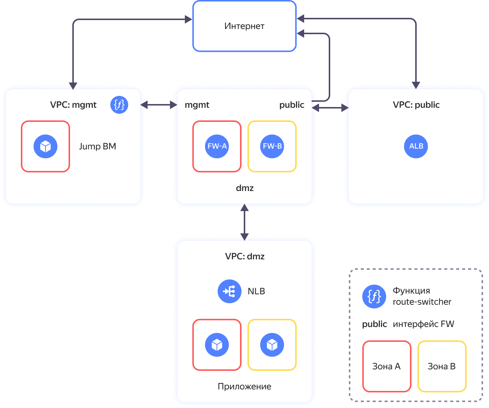

# Реализация защищенной высокодоступной сетевой инфраструктуры с выделением DMZ на основе UserGate NGFW


С помощью руководства вы развернете защищенную сетевую инфраструктуру на основе [UserGate Next-Generation Firewall](https://www.usergate.com/ru/products/next-generation-firewall). Инфраструктура состоит из сегментов, каждый из которых содержит ресурсы одного назначения, обособленные от других ресурсов. Например, [DMZ](https://ru.wikipedia.org/wiki/DMZ_(компьютерные_сети)) сегмент предназначен для размещения общедоступных приложений, а сегмент `mgmt` содержит ресурсы для управления инфраструктурой. В облаке каждому сегменту соответствует свой каталог и своя [облачная сеть](../../vpc/concepts/network.md#network) {{ vpc-short-name }}. Связь между сегментами происходит через виртуальную машину [Next-Generation Firewall (NGFW)](https://en.wikipedia.org/wiki/Next-generation_firewall), обеспечивающую комплексную защиту сегментов и контроль трафика между сегментами.

Схема решения представлена ниже.



Решение включает следующие основные сегменты (каталоги):

* Каталог **public** предназначен для размещения ресурсов с доступом из интернет.
* Каталог **mgmt** предназначен для управления облачной инфраструктурой и размещения служебных ресурсов. Включает в себя две ВМ для защиты инфраструктуры и сегментации сети на зоны безопасности (fw-a и fw-b) и ВМ c настроенным [WireGuard VPN](https://www.wireguard.com/) для защищенного доступа к сегменту управления (jump-vm).
* Каталог **dmz** предоставляет возможность публикации приложений с открытым доступом из внешней сети интернет.

Более подробное описание приведено в [репозитории проекта](https://github.com/yandex-cloud-examples/yc-dmz-with-high-available-usergate-ngfw).

Чтобы развернуть защищенную высокодоступную сетевую инфраструктуру с выделением DMZ на основе UserGate Next-Generation Firewall:

1. [Подготовьте облако к работе](#prepare-cloud).
1. [Подготовьте окружение](#prepare-environment).
1. [Разверните ресурсы](#create-resources).
1. [Настройте NGFW](#configure-ngfw).
1. [Включите работу модуля route-switcher](#enable-route-switcher).
1. [Протестируйте работоспособность и отказоустойчивость решения](#test-accessibility).
1. [Требования к развертыванию в продуктивной среде](#deployment-requirements).

Если созданные ресурсы вам больше не нужны, [удалите их](#clear-out).

### Next-Generation Firewall {#next-generation-firewall}

NGFW используется для защиты и сегментации облачной сети с выделением DMZ зоны для размещения публичных приложений.

В [{{ marketplace-full-name }}]({{ link-cloud-marketplace }}?categories=security) доступно несколько вариантов NGFW. В данном сценарии используется решение [UserGate NGFW]({{ link-cloud-marketplace }}/products/usergate/ngfw), предоставляющее следующие возможности:
* межсетевое экранирование;
* обнаружение и предотвращение вторжений;
* управление трафиком и контроль доступа в интернет;
* контент-фильтрация и контроль приложений;
* VPN-сервер;
* потоковый антивирус;
* защита от DoS-атак и сетевого флуда.

UserGate NGFW в данном руководстве настроен с базовыми правилами межсетевого экранирования и NAT трансляций.

Подробнее познакомиться с возможностями UserGate NGFW можно в [документации](https://www.usergate.com/ru/products/usergate-vm).

## Подготовьте облако к работе {#prepare-cloud}



### Необходимые платные ресурсы {#paid-resources}

В стоимость поддержки инфраструктуры входит:

* плата за постоянно работающие ВМ (см. [тарифы {{ compute-full-name }}](../../compute/pricing.md));
* плата за использование {{ alb-name }} (см. [тарифы {{ alb-full-name }}](../../application-load-balancer/pricing.md));
* плата за использование {{ network-load-balancer-name }} (см. [тарифы {{ network-load-balancer-full-name }}](../../network-load-balancer/pricing.md));
* плата за использование публичных IP-адресов и исходящий трафик (см. [тарифы {{ vpc-full-name }}](../../vpc/pricing.md));
* плата за использование функций (см. [тарифы {{ sf-full-name }}](../../functions/pricing.md));
* плата за использование [UserGate NGFW](/marketplace/products/usergate/ngfw).

### Необходимые квоты {#required-quotes}



В руководстве предполагается развертывание ресурсоемкой инфраструктуры.



Убедитесь, что в облаке достаточно [квот](../../overview/concepts/quotas-limits.md) и они не заняты ресурсами для других задач.



   | Ресурс | Количество |
   | ----------- | ----------- |
   | Каталоги | 3 |
   | Группы виртуальных машин | 1 |
   | Виртуальные машины | 5 |
   | vCPU виртуальных машин | 14 |
   | RAM виртуальных машин | 38 ГБ |
   | Диски | 5 |
   | Объем SSD дисков | 400 ГБ |
   | Объем HDD дисков | 30 ГБ |
   | Облачные сети | 3 |
   | Подсети | 6 |
   | Таблицы маршрутизации | 2 |
   | Группы безопасности | 6 |
   | Статические публичные IP-адреса | 4 |
   | Публичные IP-адреса | 4 |
   | Статические маршруты | 5 |
   | Бакеты | 1 |
   | Cloud функции | 1 |
   | Триггеры для cloud функций | 1 |
   | Общий объем RAM всех запущенных функций | 128 МБ |
   | Балансировщики NLB | 2 |
   | Целевые группы для NLB | 2 |
   | Балансировщики ALB | 1 |
   | Группы бэкендов для ALB | 1 |
   | Целевые группы для ALB | 1 |



## Подготовьте окружение {#prepare-environment}

### Создайте сервисный аккаунт с правами администратора на облако {#create-account}
   


- Консоль управления {#console}

   1. В [консоли управления]({{ link-console-main }}) выберите [каталог](../../resource-manager/concepts/resources-hierarchy.md#folder), в котором хотите создать сервисный аккаунт.
   1. В списке сервисов выберите **{{ ui-key.yacloud.iam.folder.dashboard.label_iam }}**.
   1. Нажмите кнопку **{{ ui-key.yacloud.iam.folder.service-accounts.button_add }}**.
   1. Введите имя сервисного аккаунта, например, `sa-terraform`.

       Требования к формату имени:

       

       

   1. Нажмите кнопку **{{ ui-key.yacloud.iam.folder.service-account.popup-robot_button_add }}**.

   1. Назначьте сервисному аккаунту [роль](../../iam/concepts/access-control/roles.md) администратора:

       1. На [стартовой странице]({{ link-console-main }}) консоли управления выберите облако.
       1. Перейдите на вкладку **{{ ui-key.yacloud.common.resource-acl.label_access-bindings }}**.
       1. Нажмите кнопку **{{ ui-key.yacloud.common.resource-acl.button_configure-access }}**.
       1. В открывшемся окне выберите раздел **{{ ui-key.yacloud_components.acl.label.service-accounts}}** и выберите сервисный аккаунт `sa-terraform`.
       1. Нажмите кнопку  **{{ ui-key.yacloud_components.acl.button.add-role }}** и выберите роль `admin`.
       1. Нажмите кнопку **{{ ui-key.yacloud_components.acl.action.apply }}**.

- CLI {#cli}

   

   

   1. Создайте сервисный аккаунт:

         ```bash
         yc iam service-account create --name sa-terraform
         ```

         Где `name` — имя сервисного аккаунта. Требования к имени:

         

         Результат:

         ```text
         id: ajehr0to1g8b********
         folder_id: b1gv87ssvu49********
         created_at: "2024-01-04T09:03:11.665153755Z"
         name: sa-terraform
         ```
      
   1. Назначьте аккаунту [роль](../../iam/concepts/access-control/roles.md) администратора:

         ```bash
         yc resource-manager cloud add-access-binding <идентификатор_облака> \
           --role admin \
           --subject serviceAccount:<идентификатор_сервисного_аккаунта>
         ```

         Результат:

         ```text
         done (1s)
         ```

- API {#api}

   Чтобы создать сервисный аккаунт, воспользуйтесь методом REST API [create](../../iam/api-ref/ServiceAccount/create.md) для ресурса [ServiceAccount](../../iam/api-ref/ServiceAccount/index.md) или вызовом gRPC API [ServiceAccountService/Create](../../iam/api-ref/grpc/ServiceAccount/create.md).

   



### Установите необходимые утилиты {#install-utilities}

1. Установите [Git](https://ru.wikipedia.org/wiki/Git) с помощью команды:

   ```bash
   sudo apt install git
   ```

1. Установите {{ TF }}:

   1. Перейдите в корневую папку:

      ```bash
      cd ~
      ```

   1. Создайте папку `terraform` и перейдите в нее:
   
      ```bash
      mkdir terraform
      cd terraform
      ```

   1. Скачайте файл `terraform_1.9.5_linux_amd64.zip`:

      ```bash
      curl \
        --location \
        --remote-name \
        https://hashicorp-releases.yandexcloud.net/terraform/1.9.5/terraform_1.9.5_linux_amd64.zip
      ```

   1. Установите утилиту `zip` и распакуйте zip-архив:
      
      ```bash
      apt install zip
      unzip terraform_1.9.5_linux_amd64.zip
      ```

   1. Добавьте путь к папке, в которой находится исполняемый файл, в переменную `PATH`: 
      
      ```bash
      export PATH=$PATH:~/terraform
      ```

   1. Убедитесь, что {{ TF }} установлен, выполнив команду:
   
      ```bash
      terraform -help
      ```

1. Создайте конфигурационный файл с указанием источника провайдеров для {{ TF }}:

   1. Создайте файл `.terraformrc` с помощью встроенного редактора `nano`:

      ```bash
      cd ~
      nano .terraformrc
      ```

   1. Добавьте в него следующий блок:

      ```text
      provider_installation {
        network_mirror {
          url = "https://terraform-mirror.yandexcloud.net/"
          include = ["registry.terraform.io/*/*"]
        }
        direct {
          exclude = ["registry.terraform.io/*/*"]
        }
      }
      ```

      Подробнее о настройках зеркал см. в [документации {{ TF }}](https://www.terraform.io/cli/config/config-file#explicit-installation-method-configuration).

## Разверните ресурсы {#create-resources}

1. Клонируйте [репозиторий](https://github.com/yandex-cloud-examples/yc-dmz-with-high-available-usergate-ngfw) из GitHub и перейдите в папку сценария `yc-dmz-with-high-available-usergate-ngfw`:
   
   ```bash
   git clone https://github.com/yandex-cloud-examples/yc-dmz-with-high-available-usergate-ngfw.git
   cd yc-dmz-with-high-available-usergate-ngfw
   ```

1. Настройте профиль CLI для выполнения операций от имени сервисного аккаунта:

   

   - CLI {#cli}

      

      

      1. Создайте [авторизованный ключ](../../iam/concepts/authorization/key.md) для сервисного аккаунта и запишите его файл:
         
         ```bash
         yc iam key create \
           --service-account-id <идентификатор_сервисного_аккаунта> \
           --folder-id <id_каталога_с_сервисным_аккаунтом> \
           --output key.json
         ```

         Где:
         
         * `service-account-id` — идентификатор сервисного аккаунта;
         * `folder-id` — идентификатор каталога, в котором создан сервисный аккаунт;
         * `output` — имя файла с авторизованным ключом.

         Результат:
         
         ```text
         id: aje8nn871qo4********
         service_account_id: ajehr0to1g8b********
         created_at: "2023-03-04T09:16:43.479156798Z"
         key_algorithm: RSA_2048
         ```

      1. Создайте профиль CLI для выполнения операций от имени сервисного аккаунта:
        
         ```bash
         yc config profile create sa-terraform
         ```

         Результат:
         
         ```text
         Profile 'sa-terraform' created and activated
         ```

      1. Задайте конфигурацию профиля:
         
         ```bash
         yc config set service-account-key key.json
         yc config set cloud-id <идентификатор_облака>
         yc config set folder-id <идентификатор_каталога>
         ```

         Где:

         * `service-account-key` — файл с авторизованным ключом сервисного аккаунта;
         * `cloud-id` — [идентификатор облака](../../resource-manager/operations/cloud/get-id.md);
         * `folder-id` — [идентификатор каталога](../../resource-manager/operations/folder/get-id.md).

      1. Добавьте аутентификационные данные в переменные окружения:
         
         ```bash
         export YC_TOKEN=$(yc iam create-token)
         ```

   

1. Получите IP-адрес вашего ПК:
      
   ```bash
   curl 2ip.ru
   ```

   Результат:
   
   ```text
   192.2**.**.**
   ```

1. Откройте файл `terraform.tfvars` с помощью редактора `nano` и отредактируйте:

   1. Строку, содержащую идентификатор облака:
      
      ```text
      cloud_id = "<идентификатор_облака>"
      ```

   1. Строку, содержащую список разрешенных публичных IP-адресов для доступа к ВМ `jump-vm`:
      
      ```text
      trusted_ip_for_access_jump-vm = ["<внешний_IP_адрес_вашего_ПК>/32"]
      ```

   

   | Название<br>параметра | Нужно<br>изменение | Описание | Тип | Пример |
   | ----------- | ----------- | ----------- | ----------- | ----------- |
   | `cloud_id` | да | Идентификатор вашего облака в Yandex Cloud | `string` | `b1g8dn6s3v2e********` |
   | `az_name_list` | - | Список из двух <a href="../../overview/concepts/geo-scope">зон доступности</a> Yandex Cloud для размещения ресурсов | `list(string)` | `["{{ region-id }}-a", "{{ region-id }}-b"]` |
   | `security_segment_names` | - | Список названий сегментов. Первый сегмент для размещения ресурсов управления, второй с публичным доступом в интернет, третий для DMZ. Если требуются дополнительные сегменты, то нужно добавлять их в конец списка. При добавлении сегмента обязательно добавьте префиксы для подсетей в списки `zone1_subnet_prefix_list` и `zone2_subnet_prefix_list`. | `list(string)` |  `["mgmt", "public", "dmz"]` |
   | `zone1_subnet_prefix_list` | - | Список сетевых префиксов в первой зоне доступности для подсетей, соответствующих списку названия сегментов `security_segment_names`. По одному префиксу для сегмента. | `list(string)` | `["192.168.1.0/24", "172.16.1.0/24", "10.160.1.0/24"]` |
   | `zone2_subnet_prefix_list` | - | Список сетевых префиксов во второй зоне доступности для подсетей, соответствующих списку названия сегментов `security_segment_names`. По одному префиксу для сегмента. | `list(string)` | `["192.168.2.0/24", "172.16.2.0/24", "10.160.2.0/24"]` |
   | `public_app_port` | - | TCP порт для опубликованного в DMZ приложения для подключения из интернет | `number` | `80` |
   | `internal_app_port` | - | Внутренний TCP порт опубликованного в DMZ приложения, на который NGFW будет направлять трафик. Может отличаться от `public_app_port` или совпадать с ним. | `number` | `8080` |
   | `trusted_ip_for_access_jump-vm` | да | Список публичных IP-адресов/подсетей, с которых разрешено подключение к Jump ВМ. Используется во входящем правиле группы безопасности для Jump ВМ. | `list(string)` | `["A.A.A.A/32", "B.B.B.0/24"]` |
   | `jump_vm_admin_username` | - | Имя пользователя для подключения к Jump ВМ по SSH | `string` | `admin` |
   | `wg_port` | - | UDP порт для входящих соединений в настройках WireGuard на Jump ВМ | `number` | `51820` |
   | `wg_client_dns` | - | Список адресов DNS серверов в облачной сети управления, которые будет использовать рабочая станция администратора после поднятия туннеля WireGuard к Jump ВМ | `string` | `192.168.1.2, 192.168.2.2` |

   

1. Разверните ресурсы в облаке с помощью {{ TF }}:

   1. Выполните инициализацию {{ TF }}:
       
      ```bash
      terraform init
      ```

   1. Проверьте конфигурацию {{ TF }} файлов:
       
      ```bash
      terraform validate
      ```

   1. Проверьте список создаваемых облачных ресурсов:
       
      ```bash
      terraform plan
      ```

   1. Создайте ресурсы:
       
      ```bash
      terraform apply
      ```

1. После завершения процесса `terraform apply` в командной строке будет выведен список информации о развернутых ресурсах. В дальнейшем его можно будет посмотреть с помощью команды `terraform output`:

   

   | Название | Описание | Пример значения |
   | ----------- | ----------- | ----------- |
   | `dmz-web-server-nlb_ip_address` | IP-адрес балансировщика трафика в сегменте dmz, за которым находится целевая группа с веб-серверами для тестирования публикации приложения из dmz. Используется для настройки Destination NAT в FW. | `"10.160.1.100"` |
   | `fw-a_ip_address` | IP-адрес в сети управления для FW-A | `"192.168.1.10"` |
   | `fw-alb_public_ip_address` | Публичный IP-адрес балансировщика ALB. Используется для обращения к опубликованному в DMZ приложению из интернет. | `"C.C.C.C"` |
   | `fw-b_ip_address` | IP-адрес в сети управления для FW-B | `"192.168.2.10"` |
   | `jump-vm_path_for_WireGuard_client_config` | Файл конфигурации для защищенного VPN подключения с помощью клиента WireGuard к Jump ВМ | `"./jump-vm-wg.conf"` |
   | `jump-vm_public_ip_address_jump-vm` | Публичный IP-адрес Jump ВМ | `"D.D.D.D"` |
   | `path_for_private_ssh_key` | Файл с private ключом для подключения по протоколу SSH к ВМ (jump-vm, fw-a, fw-b, веб-серверы в сегменте dmz) | `"./pt_key.pem"` |
   
   

## Настройте NGFW {#configure-ngfw}

В руководстве приводятся шаги настройки FW-A и FW-B с базовыми правилами межсетевого экранирования и NAT трансляций, необходимыми для проверки работоспособности и тестирования отказоустойчивости в сценарии, но не являющимися достаточными для [развертывания инфраструктуры в продуктивной среде](#deployment-requirements).

### Подключитесь к сегменту управления через VPN {#connect-via-vpn}

После развертывания инфраструктуры в каталоге `mgmt` появится ВМ `jump-vm` на основе образа Ubuntu с настроенным [WireGuard VPN](https://www.wireguard.com/) для защищенного подключения. На вашем ПК настройте VPN-туннель к ВМ `jump-vm` для доступа к подсетям сегментов `mgmt`, `dmz`, `public`.

Вы также можете подключиться к Jump ВМ по SSH, используя SSH ключ из вывода `terraform output` и логин из значения переменной `jump_vm_admin_username`.

Чтобы настроить VPN-туннель:

1. [Установите](https://www.wireguard.com/install/) на ваш ПК приложение WireGuard.
1. Откройте приложение WireGuard и нажмите кнопку **Add Tunnel**.
1. В появившемся диалоге выберите файл `jump-vm-wg.conf` в папке `yc-dmz-with-high-available-usergate-ngfw`.

1. Нажмите кнопку **Activate**, чтобы активировать туннель.
1. Проверьте сетевую связность с сервером управления через VPN-туннель WireGuard, в терминале выполнив команду:
   
   ```bash
   ping 192.168.1.101
   ```

   

   Если пакеты не достигают сервера управления, убедитесь, что в [группе безопасности](../../vpc/concepts/security-groups.md) `mgmt-jump-vm-sg` в правилах входящего трафика указан верный внешний IP-адрес вашего ПК.

   

### Настройте межсетевой экран FW-A {#configure-fw-a}

Подключитесь к веб-интерфейсу управления FW-A по адресу `https://192.168.1.10:8001`. Учетная запись администратора: логин `Admin`, пароль `utm`. После подключения система предложит сменить пароль.

#### Настройте сеть {#configure-fw-a-network}

1. В меню сверху перейдите в раздел **Настройки**, в меню слева в секции **UserGate** выберите **Настройки**. Нажмите на значение поля **Часовой пояс**. Выберите ваш часовой пояс и нажмите **Сохранить**. В полях **Основной NTP-сервер** и **Запасной NTP-сервер** укажите адреса NTP-серверов (см. [список рекомендуемых NTP-серверов](../../tutorials/infrastructure-management/ntp.md)).

1. В меню слева в секции **Сеть** выберите **Интерфейсы**. Нажмите на `port0`. На вкладке **Сеть** выберите `Режим: Статический`. Убедитесь, что IP-адрес интерфейса `192.168.1.10`. Нажмите **Сохранить**.

1. Нажмите на `port1`. На вкладке **Общие** включите опцию **Включено**. Выберите `Зона: Untrusted`. На вкладке **Сеть** выберите `Режим: DHCP`. Нажмите **Сохранить**. Убедитесь, что интерфейс получил по DHCP IP-адрес `172.16.1.10`. Нажмите еще раз на `port1`. На вкладке **Сеть** выберите `Режим: Статический` и нажмите **Сохранить**.

1. Нажмите на `port2`. На вкладке **Общие** включите опцию **Включено**. Выберите `Зона: DMZ`. На вкладке **Сеть** выберите `Режим: DHCP`. Нажмите **Сохранить**. Убедитесь, что интерфейс получил по DHCP IP-адрес `10.160.1.10`. Нажмите еще раз на `port2`. На вкладке **Сеть** выберите `Режим: Статический` и нажмите **Сохранить**.

1. В меню слева в секции **Сеть** выберите **Виртуальные маршрутизаторы**. Нажмите на символ `—` (широкое тире) в столбце **Статические маршруты** для **Виртуальный маршрутизатор по умолчанию**. С помощью кнопки **Добавить** добавьте статические маршруты согласно таблице: 

   | Название | Включено | Адрес назначения | Шлюз |
   | --- | --- | --- | --- |
   | `route to mgmt-zone2` |  | `192.168.2.0/24` | `192.168.1.1` | 
   | `route to dmz-zone2` |  | `10.160.2.0/24` | `10.160.1.1` |
   | `route to nlb-healthcheck-net1` |  | `198.18.235.0/24` | `192.168.1.1` |
   | `route to nlb-healthcheck-net2` |  | `198.18.248.0/24` | `192.168.1.1` |

1. В меню слева в секции **Сеть** выберите **Шлюзы**. Выберите строку с шлюзом с IP-адресом `192.168.1.1`. Нажмите **Удалить** для удаления шлюза и подтвердите удаление. Нажмите **Добавить**. Заполните поля: 
   * **Название**: `public-gateway`;
   * **Интерфейс**: `port1`;
   * **IP шлюза**: `172.16.1.1`.
  
   Включите опцию **По умолчанию** и нажмите **Сохранить**.

1. В меню слева в секции **Сеть** выберите **DNS**. В разделе **Системные DNS-серверы** добавьте IP-адрес `192.168.1.2` облачного DNS-сервера в сегменте `mgmt`.

#### Диагностика применения базовых настроек {#diagnostics-base-settings}

1. В меню сверху перейдите в раздел **Диагностика и мониторинг**, в меню слева в секции **Мониторинг** выберите **Маршруты**. Убедитесь, что в выводе маршрутной информации отображаются добавленные статические маршруты и шлюз по умолчанию.

   ```text
   VRF default:
   K>* 0.0.0.0/0 [0/0] via 172.16.1.1, port1, 00:03:54
   K>* 10.160.2.0/24 [0/0] via 10.160.1.1, port2, 00:04:57
   K>* 192.168.2.0/24 [0/0] via 192.168.1.1, port0, 00:04:57
   K>* 198.18.235.0/24 [0/0] via 192.168.1.1, port0, 00:04:57
   K>* 198.18.248.0/24 [0/0] via 192.168.1.1, port0, 00:04:57
   ```

1. В меню слева в секции **Сеть** выберите **Запрос DNS**. В поле **DNS-запрос (хост)** введите доменное имя ресурса в интернете, например, `ya.ru`. В поле **IP источника запроса** выберите `192.168.1.10`. Нажмите **Старт** и убедитесь, что доменное имя разрешается в публичные IP-адреса.

1. В меню слева в секции **Сеть** выберите **Ping**. В поле **Ping host** введите доменное имя ресурса в интернете, например, `ya.ru`. Выберите **Интерфейс**: `port1`. Нажмите **Старт** и убедитесь, что ping успешно выполняется. В поле **Ping host** введите IP-адрес другого FW в сегменте `mgmt`. Выберите **Интерфейс**: `port0`. Нажмите **Старт** и убедитесь, что ping успешно выполняется.

   ```
   --- ya.ru ping statistics ---
   6 packets transmitted, 6 received, 0% packet loss, time 5006ms
   rtt min/avg/max/mdev = 3.381/3.468/3.813/0.172 ms
   ```



   По умолчанию для подключения к UserGate по SSH используется порт `2200`:

   ```bash
   ssh -i pt_key.pem Admin@192.168.1.10 -p 2200
   ```

   Подробнее об управлении UserGate с помощью интерфейса командной строки смотрите в [документации](https://docs.usergate.com/interfejs-komandnoj-stroki-(cli)_91.html).



#### Обновление ПО и библиотек {#update-software}

Опционально можно обновить версию ПО UserGate. 

1. В меню сверху перейдите в раздел **Настройки**, в меню слева в секции **UserGate** выберите **Настройки**. В пункте **Расписание скачивания обновлений** нажмите **Проверка обновлений**. В открывшемся окне на вкладке **Обновление ПО** нажмите **Проверить обновления**. При наличии доступных обновлений их можно скачать.

1. На вкладке **Обновление библиотек** нажмите **Проверить обновления**. При наличии доступных обновлений их можно скачать.

1. После завершения скачивания обновлений в меню слева в секции **UserGate** выберите **Управление устройством**. В разделе **Операции с сервером** в пункте **Обновления сервера** нажмите **Установить сейчас**. Подтвердите установку обновлений. Во время обновления FW будет перезагружен.

#### Настройка базовых политик безопасности {#configure-base-security-fw-a}

1. В меню сверху перейдите в раздел **Настройки**, в меню слева в секции **Сеть** выберите **Зоны**. Нажмите на зону **Management** и перейдите на вкладку **Контроль доступа**. Убедитесь, что для сервиса **Консоль администрирования** включена опция . В этой же строке в колонке **Разрешённые адреса** нажмите на **Любой**. Добавьте подсети, с которых разрешен доступ к консоли администрирования UserGate. Нажмите **Добавить**. Укажите `192.168.1.0/24` и нажмите **Сохранить**. Таким же образом добавьте еще подсеть `192.168.2.0/24`. После этого в окне **Выберите IP-адрес/подсеть** нажмите **Сохранить**.

1. Для зоны **Management** в сервис **CLI по SSH** подобным образом добавьте разрешенные адреса `192.168.1.0/24` и `192.168.2.0/24`, с которых разрешен доступ по SSH для управления UserGate.

1. Для зоны **Management** в сервис **Captive-портал и страница блокировки** подобным образом добавьте разрешенные адреса `198.18.235.0/24` и `198.18.248.0/24`, используемые сетевым балансировщиком `route-switcher-lb-...` модуля `route-switcher` для проверки доступности UserGate.

1. В меню слева в секции **Библиотеки** выберите **IP-адреса**. Добавьте группы в разделе **Группы** и для каждой группы добавьте IP-адреса в разделе **Адреса из выбранной группы** в соответствии с таблицей:

   | Название | Уровень угрозы | Адреса из выбранной группы |
   | ----------- | ----------- | ----------- |
   | `mgmt` | средний | `192.168.1.0/24`<br>`192.168.2.0/24` |
   | `dmz` | средний | `10.160.1.0/24`<br>`10.160.2.0/24` |
   | `FW-a-public-IP` | средний | `172.16.1.10` |
   | `dmz-web-server` | средний | `10.160.1.100` |

1. В меню слева в секции **Библиотеки** выберите **Сервисы** и нажмите **Добавить**. В поле **Название** укажите `TCP_8080` и нажмите **Добавить**. Выберите **tcp** для **Сетевой протокол** и укажите в поле **Порты назначения** значение `8080`. Два раза нажмите **Сохранить**.

1. В меню слева в секции **Политики сети** выберите **NAT и маршрутизация**. Добавьте правило NAT трансляции для предоставления доступа в интернет из сегмента `dmz`. Тогда заголовки пакетов с запросами из сегмента `dmz` в интернет будут транслироваться в Source IP интерфейса FW в сегменте `public`. Нажмите **Добавить** и на вкладке **Общие** заполните значения полей:
   * **Название**: `DMZ to internet`
   * **Тип**: выбрать из списка `NAT`
   * **SNAT IP**: `172.16.1.10`
   * **Журналирование**: выбрать из списка `Журналировать начало сессии`

1. Переключитесь на вкладку **Источник**, выберите зону источника `DMZ`. В разделе **Адрес источника** нажмите **Добавить** и выберите **Добавить список IP-адресов**. Выберите IP-список `dmz`.

1. Переключитесь на вкладку **Назначение**, выберите зону назначения **Untrusted**. Раздел **Адрес назначения** оставьте пустым, чтобы в качестве назначения использовать любой IP-адрес в публичном интернет. В окне **Свойства правила** нажмите **Сохранить**, чтобы завершить добавление NAT правила.

1. Добавьте правило Destination NAT трансляции для направления запросов пользователей на сетевой балансировщик трафика в сегменте `dmz`, балансирующий запросы на группу веб-серверов тестового приложения. При настройке этого правила добавьте Source NAT трансляцию, обеспечивающую прохождение ответа от приложения через тот же FW, через который поступил запрос от пользователя. Заголовки пакетов, приходящих от {{ alb-name }}, с запросами от пользователей к опубликованному в `dmz` приложению будут транслироваться в Source IP `dmz` интерфейса FW и в Destination IP балансировщика трафика для веб-серверов. Нажмите **Добавить** и на вкладке **Общие** заполните значения полей:
   * **Название**: `Internet to dmz-web-server`
   * **Тип**: выбрать из списка `DNAT`
   * **SNAT IP**: `10.160.1.10`
   * **Журналирование**: выбрать из списка `Журналировать начало сессии`

1. Переключитесь на вкладку **Источник**, выберите зону источника **Untrusted**. Раздел **Адрес источника** оставьте пустым, чтобы в качестве источника использовать любой IP-адрес.

1. Переключитесь на вкладку **Назначение**. В разделе **Адрес назначения** нажмите **Добавить** и выберите **Добавить список IP-адресов**. Выберите IP-список `FW-a-public-IP`.

1. Переключитесь на вкладку **Сервис** и нажмите **Добавить**. В списке выберите сервис `TCP_8080`, нажмите **Добавить** и **Закрыть**. 

1. Переключитесь на вкладку **DNAT**. В поле **Адрес назначения DNAT** укажите `10.160.1.100`. Включите опцию **Включить SNAT**. В окне **Свойства правила** нажмите **Сохранить**, чтобы завершить добавление DNAT правила.

   

      Правила NAT применяются поочередно сверху вниз в том порядке, в котором они указаны в списке. Выполняется только первое правило, для которого совпали все указанные в нем условия. Это значит, что более специфические правила должны быть выше в списке, чем более общие правила.

   

1. В меню слева в секции **Политики сети** выберите **Межсетевой экран** для добавления правил межсетевого экрана. Нажмите **Добавить** и на вкладке **Общие** заполните значения полей:
   * **Название**: `Web-server port forwarding on FW-a`
   * **Действие**: выбрать из списка `Разрешить`
   * **Журналирование**: выбрать из списка `Журналировать начало сессии`

1. Переключитесь на вкладку **Источник**, выберите зону источника **Untrusted**. Раздел **Адрес источника** оставьте пустым, чтобы в качестве источника использовать любой IP-адрес.

1. Переключитесь на вкладку **Назначение**, выберите зону назначения **DMZ**. В разделе **Адрес назначения** нажмите **Добавить** и выберите **Добавить список IP-адресов**. Выберите IP-список `dmz-web-server`.

1. Переключитесь на вкладку **Сервис** и нажмите **Добавить**. В списке выберите сервис `TCP_8080`, нажмите **Добавить** и **Закрыть**. В окне **Свойства правила межсетевого экрана** нажмите **Сохранить**, чтобы завершить добавление правила.

1. Добавьте остальные правила из таблицы ниже, чтобы настроить пример базовых правил для проверки работы политик FW, публикации тестового приложения из `dmz` сегмента и тестирования отказоустойчивости. Обратите внимание, что правило `Web-server port forwarding on FW-a` повторно создавать не нужно. 

   | # | Название | Действие | Журналирование | Зона источника | Адрес источника | Зона назначения | Адрес назначения | Сервис |
   | ----------- | ----------- | ----------- | ----------- | ----------- | ----------- | ----------- | ----------- | ----------- |
   | 1 | `Web-server port forwarding on FW-a` | Разрешить | Журналировать начало сессии | `Untrusted` | Любой | `DMZ` | `dmz-web-server` | `TCP_8080` |
   | 2 | `Mgmt to DMZ` | Разрешить | Журналировать начало сессии | `Management` | `mgmt` | `DMZ` | `dmz` | Любой |
   | 3 | `Ping from dmz to internet` | Разрешить | Журналировать начало сессии | `DMZ` | `dmz` | `Untrusted` | Любой | `Any ICMP` |
   | 4 | `Block all` | Запретить | Нет | Любая | Любой | Любая | Любой | Любой |

   

      Правила применяются поочередно сверху вниз в том порядке, в котором они указаны в списке. Выполняется только первое правило, для которого совпали все указанные в нем условия. Это значит, что более специфические правила должны быть выше в списке, чем более общие правила. Правило `Block all` необходимо для запрещения любого транзитного трафика через UserGate и находится в конце списка правил. Его необходимо добавить, так как правило по умолчанию `Default block` не блокирует трафик, прошедший через DNAT правило.

   

### Настройте межсетевой экран FW-B {#configure-fw-b}

Подключитесь к веб-интерфейсу управления FW-B по адресу `https://192.168.2.10:8001`. Учетная запись администратора: логин `Admin`, пароль `utm`. После подключения система предложит сменить пароль.

#### Настройте сеть {#configure-fw-b-network}

1. В меню сверху перейдите в раздел **Настройки**, в меню слева в секции **UserGate** выберите **Настройки**. Нажмите на значение поля **Часовой пояс**. Выберите ваш часовой пояс и нажмите **Сохранить**. В полях **Основной NTP-сервер** и **Запасной NTP-сервер** укажите адреса NTP-серверов (см. [список рекомендуемых NTP-серверов](../../tutorials/infrastructure-management/ntp.md)).

1. В меню слева в секции **Сеть** выберите **Интерфейсы**. Нажмите на `port0`. На вкладке **Сеть** выберите `Режим: Статический`. Убедитесь, что IP-адрес интерфейса `192.168.2.10`. Нажмите **Сохранить**.

1. Нажмите на `port1`. На вкладке **Общие** включите опцию **Включено**. Выберите `Зона: Untrusted`. На вкладке **Сеть** выберите `Режим: DHCP`. Нажмите **Сохранить**. Убедитесь, что интерфейс получил по DHCP IP-адрес `172.16.2.10`. Нажмите еще раз на `port1`. На вкладке **Сеть** выберите `Режим: Статический` и нажмите **Сохранить**.

1. Нажмите на `port2`. На вкладке **Общие** включите опцию **Включено**. Выберите `Зона: DMZ`. На вкладке **Сеть** выберите `Режим: DHCP`. Нажмите **Сохранить**. Убедитесь, что интерфейс получил по DHCP IP-адрес `10.160.2.10`. Нажмите еще раз на `port2`. На вкладке **Сеть** выберите `Режим: Статический` и нажмите **Сохранить**.

1. В меню слева в секции **Сеть** выберите **Виртуальные маршрутизаторы**. Нажмите на символ `—` (широкое тире) в столбце **Статические маршруты** для **Виртуальный маршрутизатор по умолчанию**. С помощью кнопки **Добавить** добавьте статические маршруты согласно таблице: 

   | Название | Включено | Адрес назначения | Шлюз |
   | --- | --- | --- | --- |
   | `route to mgmt-zone1` |  | `192.168.1.0/24` | `192.168.2.1` | 
   | `route to dmz-zone1` |  | `10.160.1.0/24` | `10.160.2.1` |
   | `route to nlb-healthcheck-net1` |  | `198.18.235.0/24` | `192.168.2.1` |
   | `route to nlb-healthcheck-net2` |  | `198.18.248.0/24` | `192.168.2.1` |

1. В меню слева в секции **Сеть** выберите **Шлюзы**. Выберите строку с шлюзом с IP-адресом `192.168.2.1`. Нажмите **Удалить** для удаления шлюза и подтвердите удаление. Нажмите **Добавить**. Заполните поля: 
   * **Название**: `public-gateway`;
   * **Интерфейс**: `port1`;
   * **IP шлюза**: `172.16.2.1`.
  
   Включите опцию **По умолчанию** и нажмите **Сохранить**.

1. В меню слева в секции **Сеть** выберите **DNS**. В разделе **Системные DNS-серверы** добавьте IP-адрес `192.168.2.2` облачного DNS-сервера в сегменте `mgmt`.

#### Диагностика применения настроек и обновление ПО { #diagnostics-update-fw-b }

1. [Проверьте корректность применения базовых настроек](#diagnostics-base-settings) аналогично FW-A.

1. Также вы можете [обновить версию ПО](#update-software) UserGate на FW-B. 

#### Настройка базовых политик безопасности {#configure-base-security-fw-b}

1. В меню сверху перейдите в раздел **Настройки**, в меню слева в секции **Сеть** выберите **Зоны**. Нажмите на зону **Management** и перейдите на вкладку **Контроль доступа**. Убедитесь, что для сервиса **Консоль администрирования** включена опция . В этой же строке в колонке **Разрешённые адреса** нажмите на **Любой**. Добавьте подсети, с которых разрешен доступ к консоли администрирования UserGate. Нажмите **Добавить**. Укажите `192.168.1.0/24` и нажмите **Сохранить**. Таким же образом добавьте еще подсеть `192.168.2.0/24`. После этого в окне **Выберите IP-адрес/подсеть** нажмите **Сохранить**.

1. Для зоны **Management** в сервис **CLI по SSH** подобным образом добавьте разрешенные адреса `192.168.1.0/24` и `192.168.2.0/24`, с которых разрешен доступ по SSH для управления UserGate.

1. Для зоны **Management** в сервис **Captive-портал и страница блокировки** подобным образом добавьте разрешенные адреса `198.18.235.0/24` и `198.18.248.0/24`, используемые сетевым балансировщиком `route-switcher-lb-...` модуля `route-switcher` для проверки доступности UserGate.

1. В меню слева в секции **Библиотеки** выберите **IP-адреса**. Добавьте группы в разделе **Группы** и для каждой группы добавьте IP-адреса в разделе **Адреса из выбранной группы** в соответствии с таблицей:

   | Название | Уровень угрозы | Адреса из выбранной группы |
   | ----------- | ----------- | ----------- |
   | `mgmt` | средний | `192.168.1.0/24`<br>`192.168.2.0/24` |
   | `dmz` | средний | `10.160.1.0/24`<br>`10.160.2.0/24` |
   | `FW-b-public-IP` | средний | `172.16.2.10` |
   | `dmz-web-server` | средний | `10.160.1.100` |

1. В меню слева в секции **Библиотеки** выберите **Сервисы** и нажмите **Добавить**. В поле **Название** укажите `TCP_8080` и нажмите **Добавить**. Выберите **tcp** для **Сетевой протокол** и укажите в поле **Порты назначения** значение `8080`. Два раза нажмите **Сохранить**.

1. В меню слева в секции **Политики сети** выберите **NAT и маршрутизация**. Добавьте правило NAT трансляции для предоставления доступа в интернет из сегмента `dmz`. Тогда заголовки пакетов с запросами из сегмента `dmz` в интернет будут транслироваться в Source IP интерфейса FW в сегменте `public`. Нажмите **Добавить** и на вкладке **Общие** заполните значения полей:
   * **Название**: `DMZ to internet`
   * **Тип**: выбрать из списка `NAT`
   * **SNAT IP**: `172.16.2.10`
   * **Журналирование**: выбрать из списка `Журналировать начало сессии`

1. Переключитесь на вкладку **Источник**, выберите зону источника `DMZ`. В разделе **Адрес источника** нажмите **Добавить** и выберите **Добавить список IP-адресов**. Выберите IP-список `dmz`.

1. Переключитесь на вкладку **Назначение**, выберите зону назначения **Untrusted**. Раздел **Адрес назначения** оставьте пустым, чтобы в качестве назначения использовать любой IP-адрес в публичном интернет. В окне **Свойства правила** нажмите **Сохранить**, чтобы завершить добавление NAT правила.

1. Добавьте правило Destination NAT трансляции для направления запросов пользователей на сетевой балансировщик трафика в сегменте `dmz`, балансирующий запросы на группу веб-серверов тестового приложения. Нажмите **Добавить** и на вкладке **Общие** заполните значения полей:
   * **Название**: `Internet to dmz-web-server`
   * **Тип**: выбрать из списка `DNAT`
   * **SNAT IP**: `10.160.2.10`
   * **Журналирование**: выбрать из списка `Журналировать начало сессии`

1. Переключитесь на вкладку **Источник**, выберите зону источника **Untrusted**. Раздел **Адрес источника** оставьте пустым, чтобы в качестве источника использовать любой IP-адрес.

1. Переключитесь на вкладку **Назначение**. В разделе **Адрес назначения** нажмите **Добавить** и выберите **Добавить список IP-адресов**. Выберите IP-список `FW-b-public-IP`.

1. Переключитесь на вкладку **Сервис** и нажмите **Добавить**. В списке выберите сервис `TCP_8080`, нажмите **Добавить** и **Закрыть**. 

1. Переключитесь на вкладку **DNAT**. В поле **Адрес назначения DNAT** укажите `10.160.1.100`. Включите опцию **Включить SNAT**. В окне **Свойства правила** нажмите **Сохранить**, чтобы завершить добавление DNAT правила.

1. В меню слева в секции **Политики сети** выберите **Межсетевой экран** для добавления правил межсетевого экрана. Нажмите **Добавить** и на вкладке **Общие** заполните значения полей:
   * **Название**: `Web-server port forwarding on FW-b`
   * **Действие**: выбрать из списка `Разрешить`
   * **Журналирование**: выбрать из списка `Журналировать начало сессии`

1. Переключитесь на вкладку **Источник**, выберите зону источника **Untrusted**. Раздел **Адрес источника** оставьте пустым, чтобы в качестве источника использовать любой IP-адрес.

1. Переключитесь на вкладку **Назначение**, выберите зону назначения **DMZ**. В разделе **Адрес назначения** нажмите **Добавить** и выберите **Добавить список IP-адресов**. Выберите IP-список `dmz-web-server`.

1. Переключитесь на вкладку **Сервис** и нажмите **Добавить**. В списке выберите сервис `TCP_8080`, нажмите **Добавить** и **Закрыть**. В окне **Свойства правила межсетевого экрана** нажмите **Сохранить**, чтобы завершить добавление правила.

1. Добавьте остальные правила из таблицы ниже, чтобы настроить пример базовых правил для проверки работы политик FW, публикации тестового приложения из `dmz` сегмента и тестирования отказоустойчивости. Обратите внимание, что правило `Web-server port forwarding on FW-b` повторно создавать не нужно. 

   | # | Название | Действие | Журналирование | Зона источника | Адрес источника | Зона назначения | Адрес назначения | Сервис |
   | ----------- | ----------- | ----------- | ----------- | ----------- | ----------- | ----------- | ----------- | ----------- |
   | 1 | `Web-server port forwarding on FW-b` | Разрешить | Журналировать начало сессии | `Untrusted` | Любой | `DMZ` | `dmz-web-server` | `TCP_8080` |
   | 2 | `Mgmt to DMZ` | Разрешить | Журналировать начало сессии | `Management` | `mgmt` | `DMZ` | `dmz` | Любой |
   | 3 | `Ping from dmz to internet` | Разрешить | Журналировать начало сессии | `DMZ` | `dmz` | `Untrusted` | Любой | `Any ICMP` |
   | 4 | `Block all` | Запретить | Нет | Любая | Любой | Любая | Любой | Любой |

## Включите работу модуля route-switcher {#enable-route-switcher}

После завершения настройки NGFW убедитесь, что проверка состояния FW-A и FW-B выдает значение `Healthy`. Для этого в [консоли управления]({{ link-console-main }}) {{ yandex-cloud }} в каталоге `mgmt` выберите сервис **{{ network-load-balancer-name }}** и перейдите на страницу сетевого балансировщика `route-switcher-lb-...`. Раскройте целевую группу и убедитесь, что состояния целевых ресурсов — `Healthy`. Если их состояние — `Unhealthy`, то необходимо проверить, что FW-A и FW-B запущены, функционируют и [настроены](#configure-gateways).

Когда статус FW-A и FW-B изменится на `Healthy`, в файле `route-switcher.tf` измените значение параметра `start_module` модуля `route-switcher` на `true`. Для включения работы модуля и выполните команды:

```bash
terraform plan
terraform apply
```

В течение 5 минут модуль `route-switcher` начнет работу по обеспечению отказоустойчивости исходящего трафика в сегментах.

## Протестируйте работоспособность и отказоустойчивость решения {#test-accessibility}

### Проверьте работоспособность системы {#test-accessibility}

1. Чтобы узнать публичный IP-адрес балансировщика, в терминале выполните команду:

   ```bash
   terraform output fw-alb_public_ip_address
   ```

1. Убедитесь, что сетевая инфраструктура доступна извне. Для этого в браузере перейдите по адресу:
    
   ```text
   http://<публичный_IP-адрес_балансировщика_ALB>
   ```
   Убедитесь, что открылась страница `Welcome to nginx!`.

1. Убедитесь, что разрешающие правила политики безопасности межсетевых экранов активны. Для этого на вашем ПК перейдите в папку `yc-dmz-with-high-available-usergate-ngfw` и подключитесь по SSH к одной из ВМ в DMZ-сегменте:

   ```bash
   cd yc-dmz-with-high-available-usergate-ngfw
   ssh -i pt_key.pem admin@<внутренний_IP-адрес_ВМ_в_DMZ_сегменте>
   ```

1. Чтобы проверить наличие доступа из ВМ в DMZ сегменте к публичному ресурсу в сети интернет, выполните команду:
   
   ```bash
   ping ya.ru
   ```

   Команда должна выполниться в соответствии с разрешающим правилом `ping from dmz to internet`.

1. Подключитесь к веб-интерфейсу управления FW-A по адресу `https://192.168.1.10:8001`. В меню сверху перейдите в раздел **Настройки**, в меню слева в секции **Политики сети** выберите **Межсетевой экран**. Для правила `Block all` настройте журналирование: `Журналировать начало сессии`. 

1. Убедитесь, что запрещающие правила политики безопасности выполняются.

   Чтобы проверить отсутствие доступа к ВМ `Jump ВМ` в сегменте `mgmt` из сегмента `dmz`, выполните команду: 

   ```bash
   ping 192.168.1.101
   ```
   Выполнение команды должно завершиться ошибкой в соответствии с запрещающим правилом `Block all`.

1. Подключитесь к веб-интерфейсу управления FW-A по адресу `https://192.168.1.10:8001`. В меню сверху перейдите в раздел **Журналы и отчеты**, в меню слева в секции **Журналы** выберите **Журнал трафика**. В фильтре `Правила:` выберите правила `Block all` и `ping from dmz to internet`. Убедитесь, что для проведенных тестов отображаются записи разрешенного и запрещенного трафика. После этого для правила `Block all` отключите журналирование. 

### Проверка отказоустойчивости {#fault-tolerance-check}

1. На вашем ПК установите утилиту `httping` для выполнения периодических http-запросов:

   ```bash
   sudo apt-get install httping
   ```

1. Чтобы узнать публичный IP-адрес балансировщика, в терминале выполните команду:

   ```bash
   terraform output fw-alb_public_ip_address
   ```

1. Запустите входящий трафик к опубликованному в DMZ-сегменте приложению с помощью запроса к публичному IP-адресу балансировщика ALB:

   ```bash
   httping http://<публичный_IP-адрес_балансировщика_ALB>
   ```

1. Откройте еще одно окно терминала и подключитесь по SSH к одной из ВМ в DMZ-сегменте:
   
   ```bash
   ssh -i pt_key.pem admin@<внутренний_IP-адрес_ВМ_в_DMZ_сегменте>
   ```

1. Установите пароль для пользователя `admin`:

   ```bash
   sudo passwd admin
   ```

1. В [консоли управления]({{ link-console-main }}) {{ yandex-cloud }} измените параметры этой ВМ:

   1. В списке сервисов выберите **{{ ui-key.yacloud.iam.folder.dashboard.label_compute }}**.
   1. На панели слева выберите  **{{ ui-key.yacloud.compute.instances_jsoza }}**.
   1. В строке с нужной ВМ нажмите  и выберите  **{{ ui-key.yacloud.common.edit }}**.
   1. В открывшемся окне в блоке **{{ ui-key.yacloud.compute.instances.create.section_additional }}** включите опцию **{{ ui-key.yacloud.compute.instance.overview.field_serial-port-enable }}**.
   1. Нажмите кнопку **{{ ui-key.yacloud.compute.instance.edit.button_update }}**.
   
1. Подключитесь к серийной консоли ВМ, введите логин `admin` и пароль, созданный ранее.

1. С помощью команды `ping` запустите исходящий трафик из ВМ в DMZ-сегменте к ресурсу в сети интернет:

   ```bash
   ping ya.ru
   ```

1. В [консоли управления]({{ link-console-main }}) {{ yandex-cloud }} в каталоге `mgmt` [остановите](../../compute/operations/vm-control/vm-stop-and-start.md#stop) ВМ `fw-a`, эмулируя отказ основного межсетевого экрана.
1. Наблюдайте за пропаданием пакетов, отправляемых `httping` и `ping`. После отказа FW-A может наблюдаться пропадание трафика на протяжении приблизительно 1 мин, после чего трафик должен восстановиться.
1. Убедитесь, что в таблице маршрутизации `dmz-rt` в каталоге `dmz` для `next hop` используется адрес FW-B.
1. В [консоли управления]({{ link-console-main }}) {{ yandex-cloud }} [запустите](../../compute/operations/vm-control/vm-stop-and-start.md#start) ВМ `fw-a`, эмулируя восстановление основного межсетевого экрана. 
1. Наблюдайте за пропаданием пакетов, отправляемых `httping` и `ping`. После восстановления FW-A может наблюдаться пропадание трафика на протяжении приблизительно 1 мин, после чего трафик должен восстановиться.
1. Убедитесь, что в таблице маршрутизации `dmz-rt` в каталоге `dmz` для `next hop` используется адрес FW-A.

## Требования к развертыванию в продуктивной среде {#deployment-requirements}

* Сохраните private SSH ключ `pt_key.pem` в надежное место либо пересоздайте его отдельно от {{ TF }}.
* Удалите Jump ВМ, если не планируете ей пользоваться.
* Если планируете использовать Jump ВМ для подключения к сегменту управления с помощью VPN WireGuard, то измените ключи для WireGuard на Jump ВМ и рабочей станции администратора.
* Настройте UserGate NGFW под ваши задачи в соответствии с корпоративной политикой безопасности.
* Не назначайте публичные IP-адреса на ВМ в сегментах, где используются таблицы маршрутизации с маршрутом по умолчанию `0.0.0.0/0` через UserGate NGFW ([подробности](../../vpc/concepts/routing.md#restrictions)). Исключением является сегмент управления `mgmt`, где в таблицах маршрутизации не используется маршрут по умолчанию `0.0.0.0/0`. 

## Как удалить созданные ресурсы {#clear-out}

Чтобы перестать платить за созданные ресурсы, выполните команду:

   ```bash
   terraform destroy
   ```

   

   {{ TF }} удалит все ресурсы **без возможности восстановления**: сети, подсети, виртуальные машины, балансировщики, каталоги и т.д.

   

Так как созданные ресурсы расположены в каталогах, то в качестве более быстрого способа удаления всех ресурсов можно использовать удаление всех каталогов через [консоль управления]({{ link-console-main }}) {{ yandex-cloud }} с последующим удалением файла `terraform.tfstate` из папки `yc-dmz-with-high-available-usergate-ngfw` на вашем ПК.