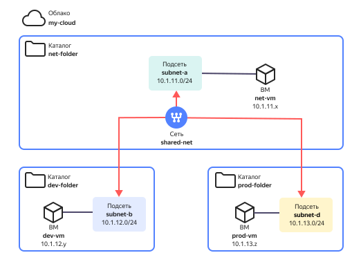

# Настройка сетевого взаимодействия ресурсов из разных каталогов

В {{ yandex-cloud }} сетевые ресурсы, например, облачные сети и подсети, обычно создаются в одном облачном каталоге ресурсов, а связь с ресурсами в других каталогах облака отсутствует. При развёртывании ресурсов в {{ yandex-cloud }} часто возникает необходимость обеспечить сетевое взаимодействие между ресурсами из разных каталогов. Один из способов решения этой задачи – метод `Multi-folder VPC`, расширяющий область действия отдельно взятой сети {{ vpc-short-name }} с одного каталога на несколько. Расширение области действия достигается за счет перемещения ее подсетей в другие каталоги облака.

После перемещения подсетей в целевые каталоги, к ним можно подключать виртуальные машины, кластеры {{ managed-k8s-name }}, хосты БД, балансировщики нагрузки, агенты нагрузочного тестирования или другие ресурсы, находящиеся в этих каталогах. Таким образом можно получить сеть, которая обеспечит связность между ресурсами из разных каталогов.

В данном руководстве описан пример создания инфраструктуры, состоящей из трех виртуальных машин, расположенных в трех разных каталогах и объединённых в одну общую внутреннюю сеть. Сетевое объединение облачных ресурсов в разных каталогах заключается в создании в одном из этих каталогов облачной сети и подсетей и последующего перемещения отдельных подсетей в другие каталоги. Таким образом, сеть из одного каталога, как бы растягивается на несколько каталогов, а перемещенная подсеть даёт возможность подключать к ней ресурсы в этом каталоге.



Перемещение подсетей возможно только между каталогами одного облака.



Например, в составе среды разработки есть модуль CI/CD, компоненты которого размещаются в каталоге `network-folder`. Им необходимо обеспечить сетевое взаимодействие с компонентами **dev**-, **stage**- и **prod**-окружений, которые находятся в соответствующих каталогах. 

Схема такого решения показана на рисунке ниже.



В результате данного развертывания будет настроена сетевая связность между виртуальными машинами в разных окружениях (каталогах), которые подключены к разным подсетям одной сети. Кроме того, все ВМ смогут общаться друг с другом не только по IP-адресам, но и через доменные имена FQDN службы DNS.


Чтобы создать тестовую инфраструктуру и организовать связь ресурсов:

1. [Подготовьте облако к работе](#prepare-cloud).
1. [Создайте каталоги без сети {{ vpc-short-name }}](#create-folders).
1. [Создайте облачную сеть {{ vpc-short-name }} с подсетями](#create-vpc).
1. [Переместите подсети](#move-subnets).
1. [Создайте виртуальные машины](#create-vms).
1. [Проверьте сетевую связность ресурсов](#check-connectivity).

Если созданные ресурсы вам больше не нужны, [удалите их](#clear-out).

## Подготовьте облако к работе {#prepare-cloud}




### Необходимые платные ресурсы {#paid-resources}

В стоимость поддержки инфраструктуры входят:

* плата за постоянно работающие ВМ (см. [тарифы {{ compute-full-name }}](../../compute/pricing.md));
* плата за использование публичных IP-адресов и исходящий трафик (см. [тарифы {{ vpc-full-name }}](../../vpc/pricing.md));


### Настройте права доступа {#roles}

Настройте [права доступа к каталогу](../../resource-manager/operations/folder/set-access-bindings.md):

* Чтобы создавать сети и управлять подсетями, назначьте сервисному аккаунту или пользователю сервисную роль `vpc.admin` либо сервисные роли `vpc.privateAdmin`, `vpc.publicAdmin`, `vpc.securityGroups.admin`.
* Чтобы создавать и управлять ВМ в каталоге, назначьте сервисные роли `vpc.user` и `compute.admin`.

Разграничение сетевого доступа обеспечивается [группами безопасности](../../vpc/concepts/security-groups.md).

## Создайте каталоги без сети {{ vpc-short-name }} {#create-folders}

1. Создайте каталог `network-folder`:

   

   - Консоль управления

      1. В [консоли управления]({{ link-console-main }}) выберите [облако](../../resource-manager/concepts/resources-hierarchy.md#cloud) и нажмите кнопку  **{{ ui-key.yacloud.component.console-dashboard.button_action-create-folder }}**.
      1. Введите имя [каталога](../../resource-manager/concepts/resources-hierarchy.md#folder) `network-folder`.
      1. При желании, введите описание каталога.
      1. Отключите опцию **{{ ui-key.yacloud.iam.cloud.folders-create.field_default-net }}**, чтобы создать сеть и подсети вручную.
      1. Нажмите кнопку **{{ ui-key.yacloud.iam.cloud.folders-create.button_create }}**.


   - CLI

      

      

      Для создания ресурсов с помощью CLI необходимо [аутентифицироваться](../../cli/operations/authentication/service-account.md#auth-as-sa) от имени [сервисного аккаунта](../../iam/concepts/users/service-accounts.md) с [ролью](../../iam/concepts/access-control/roles.md) `admin` на [облако](../../resource-manager/concepts/resources-hierarchy.md#cloud). 

      

      1. Посмотрите описание команды создания каталога:

         ```bash
         yc resource-manager folder create --help
         ```

      1. Создайте новый каталог `network-folder`:

         ```bash
         yc resource-manager folder create \
         --name network-folder
         ```
 
   

1. Аналогично создайте еще два каталога без сети {{ vpc-short-name }} с именами `dev-folder` и `prod-folder`.

## Создайте облачную сеть {{ vpc-short-name }} с подсетями {#create-vpc}

В каталоге `network-folder` создайте сеть `shared-net` с тремя подсетями:

1. Создайте сеть:

   

   - Консоль управления

     Чтобы создать [облачную сеть](../../vpc/concepts/network.md):
     1. В [консоли управления]({{ link-console-main }}) перейдите в каталог `network-folder`.
     1. В списке сервисов выберите **{{ vpc-name }}**.
     1. Нажмите кнопку **{{ ui-key.yacloud.vpc.networks.button_create }}**.
     1. Задайте имя сети `shared-net`.
     1. При желании, добавьте описание сети.
     1. Отключите опцию [Создать подсети](../../vpc/operations/subnet-create.md), чтобы создать подсети вручную.
     1. Нажмите кнопку **{{ ui-key.yacloud.vpc.networks.button_create }}**.

   - CLI

     Чтобы создать [облачную сеть](../../vpc/concepts/network.md):
     1. Посмотрите описание команды CLI для создания облачной сети:

         ```
         yc vpc network create --help
         ```

     1. Создайте облачную сеть `shared-net` в каталоге `network-folder`:

         ```
         yc vpc network create \
            --folder-name network-folder \
            --name shared-net
         ```

   

1. Создайте подсеть `subnet-a` в [зоне доступности](../../overview/concepts/geo-scope.md) `{{ region-id }}-a`: 

   

   - Консоль управления

     Чтобы создать [подсеть](../../vpc/concepts/network.md#subnet):
     1. В [консоли управления]({{ link-console-main }}) перейдите в каталог `network-folder`.
     1. В списке сервисов выберите **{{ vpc-name }}**.
     1. Нажмите на имя облачной сети `shared-net`.
     1. Нажмите кнопку **{{ ui-key.yacloud.vpc.network.overview.button_create_subnetwork }}**.
     1. Укажите название подсети `subnet-a`.
     1. При желании, добавьте описание.
     1. Выберите зону доступности `{{ region-id }}-a` из выпадающего списка.
     1. Введите CIDR подсети: IP-адрес `10.1.11.11/24` и маску подсети `24`. Подробнее про диапазоны IP-адресов в подсетях читайте в разделе [Облачные сети и подсети](../../vpc/concepts/network.md). 
     1. Нажмите кнопку **Создать подсеть**.

   - CLI

     Чтобы создать [подсеть](../../vpc/concepts/network.md#subnet):

     1. Посмотрите описание команды CLI для создания подсети:

         ```
         yc vpc subnet create --help
         ```

     1. Создайте подсеть в каталоге `network-folder`:

         ```
         yc vpc subnet create \
           --folder-id network-folder \
           --name subnet-a \
           --network-name shared-net \
           --zone {{ region-id }}-a \
           --range 10.1.11.11/24
         ```
      
   

1. Аналогично создайте подсеть `subnet-b` с IP-адресом `10.1.12.0` и маской `24` в зоне доступности `{{ region-id }}-b` и подсеть `subnet-с` с IP-адресом `10.1.13.0` и маской `24` в зоне доступности `{{ region-id }}-c`.

## Переместите подсети {#move-subnets}

1. Переместите подсеть `subnet-b` в каталог `dev-folder`.

   

   - Консоль управления

     Чтобы переместить подсеть в другой каталог:

     1. В [консоли управления]({{ link-console-main }}) перейдите в каталог `network-folder`.
     1. В списке сервисов выберите **{{ vpc-name }}**.
     1. Нажмите на имя облачной сети `shared-net`.
     1. Нажмите значок  в строке подсети `subnet-b`, и выберите **{{ ui-key.yacloud.vpc.button_move-vpc-object }}**.
     1. В выпадающем списке выберите каталог `dev-folder`.
     1. Нажмите кнопку **Переместить**.

   - CLI

     Чтобы переместить подсеть в другой каталог:

     1. Посмотрите описание команды CLI для перемещения подсети:

         ```bash
         yc vpc subnet move --help
         ```

     1. Переместите подсеть, указав имя каталога назначения `dev-folder`:

        ```bash
        yc vpc subnet move subnet-b \
          --folder-name network-folder \
          --destination-folder-name dev-folder \
        ```

   

1. Аналогично переместите подсеть `subnet-с` в каталог `prod-folder`.

## Создайте виртуальные машины {#create-vms}

1. Создайте ВМ `network-vm` с ОС Linux в каталоге `network-folder`:

   1. В [консоли управления]({{ link-console-main }}) выберите каталог `network-folder`.
   1. В списке сервисов выберите **{{ compute-name }}**.
   1. Нажмите кнопку **{{ ui-key.yacloud.compute.instances.button_create }}**.
   1. В блоке **{{ ui-key.yacloud.compute.instances.create.section_base }}**:
      * Введите имя `network-vm`. 
      * Выберите зону доступности `{{ region-id }}-a`.
   1. В блоке **{{ ui-key.yacloud.compute.instances.create.section_image }}** выберите Ubuntu 22.04.   
   1. В блоке **{{ ui-key.yacloud.compute.instances.create.section_network }}** выберите подсеть `subnet-a`.
   1. В блоке **{{ ui-key.yacloud.compute.instances.create.section_access }}** укажите данные для доступа на ВМ:
      * В поле **{{ ui-key.yacloud.compute.instances.create.field_user }}** введите имя пользователя `ycuser`.
      * В поле **{{ ui-key.yacloud.compute.instances.create.field_key }}** вставьте содержимое файла [открытого ключа](../../compute/operations/vm-connect/ssh.md#creating-ssh-keys). Пару ключей для подключения по [SSH](../../glossary/ssh-keygen.md) необходимо [создать](../../compute/operations/vm-connect/ssh.md#creating-ssh-keys) самостоятельно.
   1. Остальные настройки оставьте без изменения и нажмите кнопку **{{ ui-key.yacloud.compute.instances.create.button_create }}**.

1. Аналагично создайте ВМ `dev-vm`  в каталоге `dev-folder` в зоне `{{ region-id }}-b` с подсетью `subnet-b` и ВМ `prod-vm`  в каталоге `prod-folder` в зоне `{{ region-id }}-c` с подсетью `subnet-c`.



При создании ВМ назначаются публичный и внутренний IP-адреса. Запишите их, они понадобятся для доступа к ВМ и проверки сетевого взаимодействия с другими ВМ.



## Проверьте сетевую связность ресурсов {#check-connectivity}

1. Подключитесь к  ВМ `network-vm` по SSH:

   ```bash
   ssh ycuser@<публичный_IP-адрес_ВМ_network-vm>
   ```

1. Проверьте, что ВМ `dev-vm` доступна по внутренней сети:

   ```bash
   ping -с3 <внутренний_IP-адрес_ВМ_dev-vm>
   ```

   Результат:
    
   ```
   PING 10.127.20.4 (10.127.20.4) 56(84) bytes of data.
   64 bytes from 10.127.20.4: icmp_seq=1 ttl=61 time=7.45 ms
   64 bytes from 10.127.20.4: icmp_seq=2 ttl=61 time=5.61 ms
   64 bytes from 10.127.20.4: icmp_seq=3 ttl=61 time=5.65 ms
   --- 10.127.20.4 ping statistics ---
   3 packets transmitted, 3 received, 0% packet loss, time 2003ms
   rtt min/avg/max/mdev = 5.613/6.235/7.446/0.855 ms
   ```

1. Аналогично проверьте, что ВМ `prod-vm` доступна по внутренней сети.

1. Подключитесь к  ВМ `dev-vm` по SSH и проверьте доступность ВМ `network-vm` и `prod-vm`. 

1. Подключитесь к  ВМ `prod-vm` по SSH и проверьте доступность ВМ `network-vm` и `dev-vm`. 

## Как удалить созданные ресурсы {#clear-out}

Чтобы перестать платить за созданные ресурсы, [удалите ВМ](../../compute/operations/vm-control/vm-delete.md) `network-vm`, `dev-vm` и `prod-vm`.
