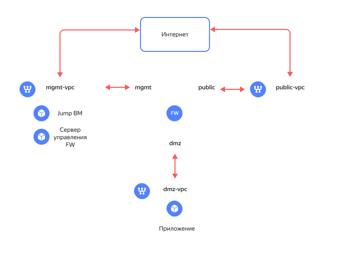

# Сегментация облачной инфраструктуры с помощью решения Check Point Next-Generation Firewall

С помощью руководства вы развернете защищенную сетевую инфраструктуру на основе Check Point Next-Generation Firewall. Инфраструктура состоит из трех сегментов, каждый из которых содержит ресурсы одного назначения, обособленные от других ресурсов. Например, выделенный [DMZ](https://ru.wikipedia.org/wiki/DMZ_(компьютерные_сети)) сегмент предназначен для размещения общедоступных приложений, а сегмент mgmt содержит ресурсы, используемые для управления облачной сетевой инфраструктурой. Связь между сегментами происходит через виртуальную машину [Check Point](https://www.checkpoint.com/quantum/next-generation-firewall/) [Next-Generation Firewall](https://en.wikipedia.org/wiki/Next-generation_firewall), обеспечивающую комплексную защиту сегментов и контроль трафика между сегментами.

Если необходимо обеспечить отказоустойчивость NGFW и высокую доступность развернутых приложений, то используйте [рекомендуемое решение](../../tutorials/routing/high-accessible-dmz.md).

Схема решения представлена ниже.



Решение включает следующие основные сегменты (каталоги):

* Каталог **public** предназначен для размещения ресурсов с доступом из интернет;
* Каталог **mgmt** предназначен для управления облачной инфраструктурой и размещения служебных ресурсов. Включает в себя ВМ для защиты инфраструктуры и сегментации сети на зоны безопасности (fw), ВМ сервера централизованного управления межсетевыми экранами (mgmt-server) и ВМ c настроенным [WireGuard VPN](https://www.wireguard.com/) для защищенного доступа к сегменту управления по VPN (jump-vm);
* Каталог **dmz** предоставляет возможность публикации приложений с открытым доступом из внешней сети интернет.

Более подробное описание приведено в [репозитории проекта](https://github.com/yandex-cloud-examples/yc-network-segmentation-with-checkpoint). 

Чтобы развернуть защищенную сетевую инфраструктуру на основе Check Point Next-Generation Firewall:

1. [Подготовьте облако к работе](#prepare-cloud).
1. [Подготовьте окружение](#prepare-environment).
1. [Разверните ресурсы](#create-resources).
1. [Настройте шлюз межсетевого экрана](#configure-gateway).
1. [Протестируйте работоспособность решения](#test-functionality).
1. [Требования к развертыванию в продуктивной среде](#deployment-requirements)

Если созданные ресурсы вам больше не нужны, [удалите их](#clear-out).

### Next-Generation Firewall {#next-generation-firewall}

В [{{ marketplace-full-name }}](/marketplace?categories=security) доступно несколько вариантов NGFW. В данном сценарии используется решение [Check Point CloudGuard IaaS](/marketplace?publishers=f2evobrhpbdrcue7s9l5&tab=software), предоставляющее следующие возможности:
* Межсетевой экран, NAT, предотвращение вторжений, антивирус и защита от ботов;
* Гранулярный контроль трафика на уровне приложений, логирование сессий;
* Централизованное управление с помощью решения Check Point Security Management;
* Решение Check Point в данном примере настроено с базовыми политиками доступа (Access Control) и NAT.

Решение Check Point CloudGuard IaaS доступно в Yandex Cloud Marketplace в вариантах Pay as you go и BYOL. В этом примере используется BYOL вариант с Trial периодом 15 дней:
* ВМ NGFW Check Point CloudGuard IaaS: Firewall & Threat Prevention BYOL;
* ВМ сервера управления Check Point CloudGuard IaaS: Security Management BYOL для задач управления NGFW.

Для использования в продуктивной среде рекомендуется рассматривать варианты:
* NGFW [Check Point CloudGuard IaaS - Firewall & Threat Prevention PAYG](/marketplace/products/checkpoint/cloudguard-iaas-firewall-tp-payg-m);
* Для сервера управления Check Point CloudGuard IaaS - Security Management необходимо приобрести отдельную лицензию либо использовать свою on-prem инсталляцию сервера управления.

## Подготовьте облако к работе {#prepare-cloud}



### Необходимые платные ресурсы {#paid-resources}

В стоимость поддержки инфраструктуры входит:

* плата за постоянно работающие ВМ (см. [тарифы {{ compute-full-name }}](../../compute/pricing.md));
* плата за использование публичных IP-адресов и исходящий трафик (см. [тарифы {{ vpc-full-name }}](../../vpc/pricing.md)).

### Необходимые квоты {#required-quotes}



В руководстве предполагается развертывание ресурсоемкой инфраструктуры.



Убедитесь, что в облаке достаточно [квот](../../overview/concepts/quotas-limits.md) и они не заняты ресурсами для других задач.



| Ресурс | Количество |
| ----------- | ----------- |
| Каталоги | 3 |
| Виртуальные машины | 4 |
| vCPU виртуальных машин | 12 |
| RAM виртуальных машин | 20 ГБ |
| Диски | 4 |
| Объем SSD дисков | 240 ГБ |
| Объем HDD дисков | 20 ГБ |
| Облачные сети | 3 |
| Подсети | 3 |
| Таблицы маршрутизации | 2 |
| Группы безопасности | 5 |
| Статические публичные IP-адреса | 2 |
| Статические маршруты | 3 |



## Подготовьте окружение {#prepare-environment}

В руководстве используется программное обеспечение для ОС Windows и подсистема [Windows Subsystem for Linux](https://ru.wikipedia.org/wiki/Windows_Subsystem_for_Linux).
Инфраструктура разворачивается с помощью [{{ TF }}](https://www.terraform.io/). 

### Настройте WSL {#setup-wsl}

1. Проверьте, установлена ли подсистема WSL на вашем компьютере. Для этого выполните в терминале интерфейса командной строки команду:
  
   ```bash
   wsl -l
   ```

   При установленной WSL терминал выведет список доступных дистрибутивов, например:
   
   ```bash
   Windows Subsystem for Linux Distributions:
   docker-desktop (Default)
   docker-desktop-data
   Ubuntu
   ```

1. Если WSL не установлена, [установите](https://learn.microsoft.com/en-us/windows/wsl/install) ее и повторите предыдущий шаг.
1. Дополнительно можно установить на подсистему WSL привычный вам дистрибутив ОС Linux, например, [Ubuntu](https://ubuntu.com/tutorials/install-ubuntu-on-wsl2-on-windows-11-with-gui-support#1-overview).

1. Чтобы сделать установленный дистрибутив системой по умолчанию, выполните:
   
   ```bash
   wsl --setdefault ubuntu
   ```

1. Переведите терминал в режим работы в подсистеме Linux, выполнив команду:

   ```bash
   wsl ~
   ```



Все описанные далее действия в терминале выполняются в ОС Linux.



### Создайте сервисный аккаунт с правами администратора на облако {#create-account}
   


- Консоль управления {#console}

   1. В [консоли управления]({{ link-console-main }}) выберите каталог, в котором хотите создать сервисный аккаунт.
   1. В списке сервисов выберите **{{ ui-key.yacloud.iam.folder.dashboard.label_iam }}**.
   1. Нажмите кнопку **{{ ui-key.yacloud.iam.folder.service-accounts.button_add }}**.
   1. Введите имя сервисного аккаунта, например, `sa-terraform`.

      Требования к формату имени:

      

   1. Нажмите кнопку **Создать**.

   1. Назначьте аккаунту [роль](../../iam/concepts/access-control/roles.md) администратора:

         1. На [стартовой странице]({{ link-console-main }}) консоли управления выберите облако.
         1. Перейдите на вкладку **Права доступа**.
         1. Найдите аккаунт `sa-terraform` в списке и нажмите значок .
         1. Нажмите кнопку **Изменить роли**.
         1. В открывшемся диалоге нажмите кнопку **Добавить роль** и выберите роль `admin`. 

- CLI {#cli}

   

   

   1. Создайте сервисный аккаунт:

         ```bash
         yc iam service-account create --name sa-terraform
         ```

         Где `name` — имя сервисного аккаунта. Требования к имени:

         

         Результат:

         ```text
         id: ajehr0to1g8b********
         folder_id: b1gv87ssvu49********
         created_at: "2024-01-04T09:03:11.665153755Z"
         name: sa-terraform
         ```
      
   1. Назначьте аккаунту [роль](../../iam/concepts/access-control/roles.md) администратора:

         ```bash
         yc resource-manager cloud add-access-binding <идентификатор_облака> \
           --role admin \
           --subject serviceAccount:<идентификатор_сервисного_аккаунта>
         ```

         Результат:

         ```text
         done (1s)
         ```

- API {#api}

   Чтобы создать сервисный аккаунт, воспользуйтесь методом REST API [create](../../iam/api-ref/ServiceAccount/create.md) для ресурса [ServiceAccount](../../iam/api-ref/ServiceAccount/index.md) или вызовом gRPC API [ServiceAccountService/Create](../../iam/api-ref/grpc/ServiceAccount/create.md).

   



### Установите необходимые утилиты {#install-utilities}

1. Установите [Git](https://ru.wikipedia.org/wiki/Git) с помощью команды:

   ```bash
   sudo apt install git
   ```

1. Установите {{ TF }}:

   1. Перейдите в корневую папку:

      ```bash
      cd ~
      ```

   1. Создайте папку `terraform` и перейдите в нее:
   
      ```bash
      mkdir terraform
      cd terraform
      ```

   1. Скачайте файл `terraform_1.3.9_linux_amd64.zip` с официального сайта, выполнив команду:

      ```bash
      curl --location --remote-name https://hashicorp-releases.yandexcloud.net/terraform/1.3.9/terraform_1.3.9_linux_amd64.zip
      ```

   1. Установите утилиту `zip` и распакуйте zip-архив:
      
      ```bash
      apt install zip
      unzip terraform_1.3.9_linux_amd64.zip
      ```

   1. Добавьте путь к папке, в которой находится исполняемый файл, в переменную `PATH`: 
      
      ```bash
      export PATH=$PATH:~/terraform
      ```

   1. Проверьте, что {{ TF }} установлен, выполнив команду:
   
      ```bash
      terraform -help
      ```

1. Создайте конфигурационный файл с указанием источника провайдеров для {{ TF }}:

   1. Создайте файл `.terraformrc` с помощью встроенного редактора `nano`:

      ```bash
      cd ~
      nano .terraformrc
      ```

   1. Добавьте в него следующий блок:

      ```text
      provider_installation {
        network_mirror {
          url = "https://terraform-mirror.yandexcloud.net/"
          include = ["registry.terraform.io/*/*"]
        }
        direct {
          exclude = ["registry.terraform.io/*/*"]
        }
      }
      ```

      Подробнее о настройках зеркал см. в [документации {{ TF }}](https://www.terraform.io/cli/config/config-file#explicit-installation-method-configuration).

## Разверните ресурсы {#create-resources}

1. Клонируйте [репозиторий](https://github.com/yandex-cloud-examples/yc-network-segmentation-with-checkpoint) из GitHub и перейдите в папку сценария `yc-network-segmentation-with-checkpoint`:
   
   ```bash
   git clone https://github.com/yandex-cloud-examples/yc-network-segmentation-with-checkpoint.git
   cd yc-network-segmentation-with-checkpoint
   ```

1. Настройте профиль CLI для выполнения операций от имени сервисного аккаунта:

   

   - CLI {#cli}

      

      

      1. Создайте [авторизованный ключ](../../iam/concepts/authorization/key.md) для сервисного аккаунта и запишите его файл:
         
         ```bash
         yc iam key create \
           --service-account-id <идентификатор_сервисного_аккаунта> \
           --folder-id <id_каталога_с_сервисным_аккаунтом> \
           --output key.json
         ```

         Где:
         
         * `service-account-id` — идентификатор сервисного аккаунта;
         * `folder-id` — идентификатор каталога, в котором создан сервисный аккаунт;
         * `output` — имя файла с авторизованным ключом.

         Результат:
         
         ```text
         id: aje8nn871qo4********
         service_account_id: ajehr0to1g8b********
         created_at: "2023-03-04T09:16:43.479156798Z"
         key_algorithm: RSA_2048
         ```

      1. Создайте профиль CLI для выполнения операций от имени сервисного аккаунта:
        
         ```bash
         yc config profile create sa-terraform
         ```

         Результат:
         
         ```text
         Profile 'sa-terraform' created and activated
         ```

      1. Задайте конфигурацию профиля:
         
         ```bash
         yc config set service-account-key key.json
         yc config set cloud-id <идентификатор_облака>
         yc config set folder-id <идентификатор_каталога>  
         ```

         Где:

         * `service-account-key` — файл с авторизованным ключом сервисного аккаунта;
         * `cloud-id` — [идентификатор облака](../../resource-manager/operations/cloud/get-id.md);
         * `folder-id` — [идентификатор каталога](../../resource-manager/operations/folder/get-id.md).

      1. Добавьте аутентификационные данные в переменные окружения:
         
         ```bash
         export YC_TOKEN=$(yc iam create-token)
         export YC_CLOUD_ID=$(yc config get cloud-id)
         export YC_FOLDER_ID=$(yc config get folder-id)
         ```

   

1. Получите IP вашего ПК:
      
      ```bash
      curl 2ip.ru
      ```

      Результат:
      
      ```text
      192.240.24.87
      ```

1. Откройте файл `terraform.tfvars` с помощью редактора `nano` и отредактируйте:

   1. Строку, содержащую идентификатор облака:
      
      ```text
      cloud_id = "<идентификатор_облака>"
      ```

   1. Строку, содержащую список разрешенных публичных IP-адресов для доступа к ВМ `jump-vm`:
      
      ```text
      trusted_ip_for_access_jump-vm = ["<внешний_IP_ПК>/32"]
      ```

   

   | Название<br>параметра | Нужно<br>изменение | Описание | Тип | Пример |
   | ----------- | ----------- | ----------- | ----------- | ----------- |
   | `cloud_id` | да | Идентификатор вашего облака в Yandex Cloud | `string` | `b1g8dn6s3v2e********` |
   | `az_name` | - | <a href="https://yandex.cloud/ru/docs/overview/concepts/geo-scope">Зона доступности</a> Yandex Cloud для размещения ресурсов | `string` | `{{ region-id }}-d` |
   | `security_segment_names` | - | Список названий сегментов. Первый сегмент для размещения ресурсов управления, второй с публичным доступом в интернет, третий для DMZ. Если требуются дополнительные сегменты, то нужно добавлять их в конец списка. При добавлении сегмента обязательно добавьте префикс для подсети в список `subnet_prefix_list`. | `list(string)` |  `["mgmt", "public", "dmz"]` |
   | `subnet_prefix_list` | - | Список сетевых префиксов для подсетей, соответствующих списку названия сегментов `security_segment_names`. По одному префиксу для сегмента. | `list(string)` | `["192.168.1.0/24", "172.16.1.0/24", "10.160.1.0/24"]` |
   | `public_app_port` | - | TCP порт для опубликованного в DMZ приложения для подключения из внешнего интернета | `number` | `80` |
   | `internal_app_port` | - | Внутренний TCP порт опубликованного в DMZ приложения, на который NGFW будет направлять трафик. Может отличаться от public_app_port или совпадать с ним. | `number` | `8080` |
   | `trusted_ip_for_access_jump-vm` | да | Список публичных IP адресов/подсетей, с которых разрешено подключение к Jump ВМ. Используется во входящем правиле группы безопасности для Jump ВМ. | `list(string)` | `["A.A.A.A/32", "B.B.B.0/24"]` |
   | `jump_vm_admin_username` | - | Имя пользователя для подключения к Jump ВМ по SSH | `string` | `admin` |
   | `wg_port` | - | UDP порт для входящих соединений в настройках WireGuard на Jump ВМ | `number` | `51820` |

   

   

   Рекомендуется заранее указать дополнительные сегменты, если они могут потребоваться в будущем, т.к. ВМ с образом NGFW в облаке не поддерживает добавление новых сетевых интерфейсов после её создания. 

   

1. Разверните ресурсы в облаке с помощью {{ TF }}:

   1. Выполните инициализацию {{ TF }}:
       
      ```bash
      terraform init
      ```

   1. Проверьте конфигурацию {{ TF }} файлов:
       
      ```bash
      terraform validate
      ```

   1. Проверьте список создаваемых облачных ресурсов:
       
      ```bash
      terraform plan
      ```

   1. Создайте ресурсы:
       
      ```bash
      terraform apply
      ```

1. После завершения процесса `terraform apply` в командной строке будет выведен список информации о развернутых ресурсах. В дальнейшем его можно будет посмотреть с помощью команды `terraform output`:

   

   | Название | Описание | Пример значения |
   | ----------- | ----------- | ----------- |
   | `dmz-web-server_ip_address` | IP адрес веб-сервера в сегменте dmz для тестирования публикации приложения из dmz. Используется для настройки Destination NAT в FW. | `10.160.1.100` |
   | `fw-mgmt-server_ip_address` | IP адрес сервера управления FW | `192.168.1.100` |
   | `fw_gaia_portal_mgmt-server_password` | Пароль по умолчанию для первоначального подключения по https к IP адресу сервера управления FW | `admin` |
   | `fw_mgmt_ip_address` | IP адрес FW в сети управления | `192.168.1.10` |
   | `fw_public_ip_address` | Публичный IP адрес для FW | `D.D.D.D` |
   | `fw_sic-password` | Однократный пароль для добавления FW в сервер управления FW | Не показывается в общем выводе `terraform output`. Для отображения значения используйте `terraform output fw_sic-password`. |
   | `fw_smartconsole_mgmt-server_password` | Пароль для подключения к серверу управления FW с помощью графического приложения Check Point SmartConsole | Не показывается в общем выводе `terraform output`. Для отображения значения используйте `terraform output fw_smartconsole_mgmt-server_password`. |
   | `jump-vm_path_for_WireGuard_client_config` | Файл конфигурации для защищенного VPN подключения с помощью клиента WireGuard к Jump ВМ | `./jump-vm-wg.conf` |
   | `jump-vm_public_ip_address_jump-vm` | Публичный IP адрес Jump ВМ | `E.E.E.E` |
   | `path_for_private_ssh_key` | Файл с private ключом для подключения по протоколу SSH к ВМ (jump-vm, fw, mgmt-server, веб-сервер в сегменте dmz) | `./pt_key.pem` |
   
   

## Настройте шлюз межсетевого экрана {#configure-gateway}

В руководстве приводятся шаги настройки FW с базовыми политиками доступа (Access Control) и NAT, необходимыми для проверки работоспособности, но не являющимися достаточными для [развертывания инфраструктуры в продуктивной среде](#deployment-requirements).

Подробнее с возможностями Check Point и его настройкой можно познакомиться в бесплатном курсе [Погружение в сетевую безопасность](https://yandex.cloud/ru/training/network-security).

### Подключитесь к сегменту управления через VPN {#connect-via-vpn}

После развертывания инфраструктуры в каталоге `mgmt` появится ВМ `jump-vm` на основе образа Ubuntu с настроенным [WireGuard VPN](https://www.wireguard.com/) для защищенного подключения. Настройте VPN туннель к ВМ `jump-vm` на вашем ПК для доступа к подсетям сегментов `mgmt`, `dmz`, `public`.

Чтобы настроить VPN туннель:

1. Получите имя пользователя в подсистеме Linux:

   ```bash
   whoami
   ```

1. [Установите](https://download.wireguard.com/windows-client/wireguard-installer.exe) на ваш ПК приложение WireGuard.
1. Откройте приложение WireGuard и нажмите кнопку **Add Tunnel**.
1. В появившемся диалоге выберите файл `jump-vm-wg.conf` в папке `yc-network-segmentation-with-checkpoint`.
   Чтобы найти папку, созданную в подсистеме Linux, например, Ubuntu, введите в адресной строке диалога путь к файлу:

   ```bash
   \\wsl$\Ubuntu\home\<имя_пользователя_Ubuntu>\yc-network-segmentation-with-checkpoint
   ```
   
   Где `<имя_пользователя_Ubuntu>` — имя пользователя текущего дистрибутива ОС Linux.

1. Активируйте туннель нажатием на кнопку **Activate**.
1. Проверьте сетевую связность с сервером управления через VPN туннель WireGuard, выполнив в терминале команду:
   
   ```bash
   ping 192.168.1.100
   ```

   

   Если пакеты не достигают сервера управления, проверьте, что в [группе безопасности](../../vpc/concepts/security-groups.md) `mgmt-jump-vm-sg` в правилах входящего трафика прописан верный внешний IP-адрес ПК.

   

### Запустите консоль управления SmartConsole {#setup-smartconsole}

Для управления и настройки решения [Check Point](https://ru.wikipedia.org/wiki/Check_Point) установите и запустите графическое приложение SmartConsole: 

1. Подключитесь к серверу управления NGFW, перейдя в браузере по адресу `https://192.168.1.100`. 
1. Авторизуйтесь используя логин `admin` и пароль `admin`. 
1. В открывшемся интерфейсе Gaia Portal скачайте графическое приложение SmartConsole. Для этого нажмите **Manage Software Blades using SmartConsole. Download Now!**.
1. Установите приложение SmartConsole на ПК.
1. Получите пароль доступа к SmartConsole:
   
   ```bash
   terraform output fw_smartconsole_mgmt-server_password
   ```

1. Откройте SmartConsole и авторизуйтесь, указав логин `admin`, IP-адрес сервера управления `192.168.1.100` и пароль доступа к SmartConsole.

### Добавьте шлюз межсетевого экрана {#add-gateway}

Добавьте шлюз межсетевого экрана FW в сервер управления, используя Wizard:

1. Слева сверху в выпадающем списке **Objects** выберите **More object types → Network Object → Gateways and Servers → New Gateway...**.
1. Нажмите **Wizard Mode**.
1. В открывшемся диалоге введите:
   * **Gateway name:** `FW`
   * **Gateway platform:** `CloudGuard IaaS`
   * **IPv4:** `192.168.1.10`
1. Нажмите **Next**.
1. Получите пароль доступа к межсетевому экрану:
   
   ```bash
   terraform output fw_sic-password
   ```

1. В поле **One-time password** введите пароль, полученный ранее.
1. Нажмите **Next** и **Finish**.

### Настройте сетевые интерфейсы шлюза FW {#setup-gateways-fw}

Настройте сетевой интерфейс `eth0`:

1. На вкладке **Gateways & Servers** откройте диалог настроек шлюза FW. Для этого в списке кликните дважды на добавленный FW.
1. На вкладке **Network Management** в таблице **Topology** выберите интерфейс `eth0`, нажмите **Edit** и в появившемся окне нажмите **Modify...**.
1. В разделе **Security Zone** активируйте **Specify Security Zone** и выберите **InternalZone**.

Аналогично настройте сетевые интерфейсы `eth1`, `eth2`:

1. Для интерфейса `eth1` укажите в разделе **Security Zone** зону **ExternalZone**.
1. Для интерфейса `eth2` в разделе **Leads To** выберите **Override** и активируйте **Interface leads to DMZ**. В разделе **Security Zone** укажите зону **DMZZone**.

| Interface | IPv4 address/mask | Leads To | Security Zone | Anti Spoofing |
| ----------- | ----------- | ----------- | ----------- | ----------- |
| eth0 | 192.168.1.10/24 | This network (Internal) | InternalZone | Prevent and Log |
| eth1 | 172.16.1.10/24 | Internet (External) | ExternalZone | Prevent and Log |
| eth2 | 10.160.1.10/24 | This network, DMZ (Internal) | DMZZone | Prevent and Log |

### Создайте сетевые объекты {#create-network-objects}

1. Слева сверху в выпадающем списке **Objects** выберите **New Network...** и создайте сети `mgmt`, `public` и `dmz` со следующими данными:

   | Name | Network address | Net mask |
   | ----------- | ----------- | ----------- |
   | mgmt | 192.168.1.0 | 255.255.255.0 |
   | public | 172.16.1.0 | 255.255.255.0 |
   | dmz | 10.160.1.0 | 255.255.255.0 |

   Для сети dmz настройте Automatic Hide NAT, чтобы скрыть адреса ВМ, которые находятся в DMZ сегменте и выходят в интернет, за IP адресом FW в сегменте public. Для этого:
      1. В диалоге редактирования сети `dmz` перейдите на вкладку **NAT**.
      1. Активируйте **Add automatic address translation rules**, выберите **Hide** из выпадающего списка и опцию **Hide behind the gateway**.

1. Слева сверху в выпадающем списке **Objects** выберите **New Host...** и создайте хосты `dmz-web-server` и `FW-public-IP` со следующими данными:

   | Name | IPv4 address |
   | ----------- | ----------- |
   | dmz-web-server | 10.160.1.100 |
   | FW-public-IP | 172.16.1.10 |

1. Выберите **More object types → Service → New TCP...** и создайте TCP-сервис для развернутого приложения в DMZ-сегменте, указав имя `TCP_8080` и порт `8080`.

### Определите правила политики безопасности {#define-policies}

Чтобы добавить правило безопасности:

1. На вкладке **Security policies** в разделе **Access Control** выберите подраздел **Policy**.
1. В таблице правил нажмите правую кнопку мыши и напротив опции **New Rule** контекстного меню выберите **Above** или **Below**.
1. В новой строке:
   * в колонке **Name** впишите `Web-server port forwarding on FW`;
   * в колонке **Destination** выберите объект `FW-public-IP`;
   * в колонке **Services & Applications** выберите объект `http`;
   * в колонке **Action** выберите опцию `Accept`;
   * в колонке **Track** выберите опцию `Log`.

Аналогично внесите остальные правила из ниже приведенной таблицы базовых правил для проверки работы политик FW, публикации тестового приложения из DMZ сегмента и тестирования отказоустойчивости.

| No | Name | Source | Destination | VPN | Services & Applications | Action | Track | Install On |
| ----------- | ----------- | ----------- | ----------- | ----------- | ----------- | ----------- | ----------- | ----------- |
| 1 | Web-server port forwarding on FW | Any | FW-public-IP | Any | http | Accept | Log | Policy Targets (All gateways) |
| 2 | FW management | mgmt | FW, mgmt-server | Any | https, ssh | Accept | Log | Policy Targets (All gateways)  |
| 3 | Stealth | Any | FW, mgmt-server | Any | Any | Drop | Log | Policy Targets (All gateways) |
| 4 | mgmt to DMZ | mgmt | dmz | Any | Any | Accept | Log | Policy Targets (All gateways) |
| 5 | mgmt to public | mgmt | public | Any | Any | Accept | Log | Policy Targets (All gateways) |
| 6 | ping from dmz to internet | dmz | ExternalZone | Any | icmp-reguests (Group) | Accept | Log | Policy Targets (All gateways) |
| 7 | Cleanup rule | Any | Any | Any | Any | Drop | Log | Policy Targets (All gateways) |



| Номер | Имя | Описание |
| ----------- | ----------- | ----------- |
| 1 | Web-server port forwarding on FW | Разрешение доступа из внешнего интернета к IP адресу FW в public сегменте по порту TCP 80 | 
| 2 | FW management | Разрешение доступа к FW, серверу управления FW из mgmt сегмента для задач управления |
| 3 | Stealth | Запрет доступа к FW, серверу управления FW из других сегментов |
| 4 | mgmt to DMZ | Разрешение доступа из mgmt сегмента к dmz сегменту для задач управления |
| 5 | mgmt to public | Разрешение доступа из mgmt сегмента к public сегменту для задач управления |
| 6 | ping from dmz to internet | Разрешение ICMP пакетов из dmz сегмента в интернет для проверки работоспособности |
| 7 | Cleanup rule | Запрет доступа для остального трафика |



### Настройте статическую таблицу трансляции NAT {#setup-static-nat}

Destination NAT трансляции направляют запросы пользователей на веб-сервер приложения в dmz сегменте.

В заголовках пакетов с запросами от пользователей к опубликованному в DMZ приложению будет происходить трансляция Destination IP в IP адрес веб-сервера и Destination port в TCP порт 8080.

Чтобы настроить таблицы трансляции NAT шлюза FW:

1. Перейдите в подраздел **NAT** раздела **Access Control**;
1. В таблице правил в меню выберите **Add rule to top**.
1. В новой строке:
   * в колонке **Original Destination** выберите объект `FW-public-IP`;
   * в колонке **Original Services** выберите объект `http`;
   * в колонке **Translated Destination** выберите объект `dmz-web-server`;
   * в колонке **Translated Services** выберите объект `TCP_8080`.

   В таблице NAT появится правило:

   | No | Original Source | Original Destination | Original Services | Translated Source | Translated Destination | Translated Services | Install On |
   | ----------- | ----------- | ----------- | ----------- | ----------- | ----------- | ----------- | ----------- | 
   | 1 | Any | FW-public-IP | http | Original | dmz-web-server | TCP_8080 | Policy Targets (All gateways) |

###  Примените правила политик безопасности {#apply-policies}

1. Вверху слева нажмите **Install Policy**.
1. В открывшемся диалоге нажмите **Publish & Install**.
1. В следующем диалоге нажмите **Install** и дождитесь завершения процесса.

## Протестируйте работоспособность решения {#test-functionality}

1. Чтобы узнать публичный IP-адрес FW, выполните в терминале команду:

   ```bash
   terraform output fw_public_ip_address
   ```

1. Проверьте, что сетевая инфраструктура доступна извне, перейдя в браузере по адресу:

   ```bash
   http://<Публичный_ip_адрес_FW>
   ```
   Если система доступна извне, должна открыться страница `Welcome to nginx!`.

1. Проверьте, что активны разрешающие правила политики безопасности FW. Для этого на вашем ПК перейдите в папку `yc-network-segmentation-with-checkpoint` и подключитесь к ВМ в DMZ-сегменте по SSH:

   ```bash
   cd ~/yc-network-segmentation-with-checkpoint
   ssh -i pt_key.pem admin@<Внутренний_ip_адрес_ВМ_в_DMZ_сегменте>
   ```

1. Чтобы проверить наличие доступа из ВМ в DMZ сегменте к публичному ресурсу в сети интернет, выполните команду:    

   ```bash
   ping ya.ru
   ```

   Команда должна выполниться в соответствие с разрешающим правилом `ping from dmz to internet`.

1. Проверьте, что выполняются запрещающие правила политики безопасности.
   Чтобы проверить отсутствие доступа к ВМ `Jump ВМ` в сегменте `mgmt` из сегмента `dmz`, выполните команду: 

   ```bash
   ping 192.168.1.101
   ```

   Команда должна выполниться с ошибкой в соответствие с запрещающим правилом `Cleanup rule`.

1. В SmartConsole в разделе `LOGS & MONITOR` на вкладке `Logs` найдите записи в моменты проведения тестов и проверьте, какие правила политики безопасности и действия были применены к трафику.

## Требования к развертыванию в продуктивной среде {#deployment-requirements}

* Если необходимо обеспечить отказоустойчивость NGFW и высокую доступность развернутых приложений, то используйте [рекомендуемое решение](../../tutorials/routing/high-accessible-dmz.md);
* Обязательно смените пароли, которые были переданы через сервис metadata в файлах `check-init...yaml`:
   * Пароль SIC для связи FW и сервера управления FW;
   * Пароль от графической консоли Check Point SmartConsole;
   * Пароль пользователя admin в сервере управления FW (можно изменить через Gaia Portal).
* Сохраните private SSH ключ `pt_key.pem` в надежное место либо пересоздайте его отдельно от {{ TF }};
* Удалите публичный IP адрес у Jump ВМ, если не планируете ей пользоваться;
* Если планируете использовать Jump ВМ для подключения к сегменту управления с помощью VPN WireGuard, то измените ключи для WireGuard на Jump ВМ и рабочей станции администратора;
* Настройте Access Control политики и NAT в Check Point NGFW для вашей инсталляции;
* Настройте правила в группах безопасности в сегментах, необходимые для работы развернутых приложений;
* Не назначайте публичные IP адреса на ВМ в сегментах, где используются таблицы маршрутизации через Check Point NGFW. Исключением является mgmt сегмент управления, где в таблицах маршрутизации не используется default route `0.0.0.0/0`; 
* Выберите подходящую лицензию и образ для Check Point CloudGuard IaaS (смотрите раздел [Next-Generation Firewall](#next-generation-firewall)).

## Как удалить созданные ресурсы {#clear-out}

Чтобы перестать платить за созданные ресурсы, выполните команду:

   ```bash
   terraform destroy
   ```
   {{ TF }} удалит все ресурсы **без возможности восстановления**: сети, подсети, виртуальные машины, каталоги и т.д.

Так как созданные ресурсы расположены в каталогах, то в качестве более быстрого способа удаления всех ресурсов можно использовать удаление всех каталогов через консоль {{ yandex-cloud }} с дальнейшим удалением файла `terraform.tfstate` из папки `yc-network-segmentation-with-checkpoint` на вашем ПК.