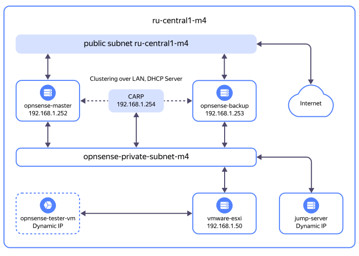

# Настройка межсетевого экрана OPNsense в режиме кластера высокой доступности на серверах {{ baremetal-full-name }}

Предлагаемое решение позволяет настроить на [серверах](../../baremetal/concepts/servers.md) {{ baremetal-name }} периметральный межсетевой экран [OPNsense](https://opnsense.org/), который будет выступать не только основным шлюзом и [Stateful Firewall](https://en.wikipedia.org/wiki/Stateful_firewall), но и [DHCP](https://ru.wikipedia.org/wiki/DHCP)-сервером в высокодоступной конфигурации.

Смысл предлагаемого решения заключается в том, чтобы к интернету были подключены только серверы [межсетевого экрана](https://ru.wikipedia.org/wiki/Межсетевой_экран) OPNsense, что позволит сформировать за ними защищенный сегмент сети.

Решение должно быть отказоустойчивым, поэтому предлагаемая конфигурация – это [кластер высокой доступности](https://ru.wikipedia.org/wiki/Отказоустойчивый_кластер). Для обеспечения отказоустойчивости шлюза в предлагаемом решении используется протокол [CARP](https://docs.freebsd.org/en/books/handbook/advanced-networking/#carp).

Для того чтобы клиенты в защищенном сегменте сети могли автоматически получать IP-адреса и корректный адрес шлюза, в решении применяется сервер ISC DHCPv4 в высокодоступной конфигурации: реализация OPNsense позволяет реплицировать список DHCP-адресов между серверами с ролями Master и Backup в кластере.

Схема решения:



* [Публичная сеть](../../baremetal/concepts/network.md#public-network) {{ baremetal-name }} [пула серверов](../../baremetal/concepts/servers.md#server-pools) `{{ region-id }}-m4`.
* [Приватная подсеть](../../baremetal/concepts/network.md#private-subnet) {{ baremetal-name }} `opnsense-private-subnet-m4`.
* Два сервера {{ baremetal-name }} в составе кластера OPNsense: `opnsense-master` и `opnsense-backup`. При написании настоящего руководства использовался межсетевой экран OPNsense версии `25.1`.
* Один сервер {{ baremetal-name }} `vmware-esxi` с запущенной платформой [виртуализации](../../glossary/virtualization.md) VMware [ESXi](https://ru.wikipedia.org/wiki/VMware_ESXi). При написании настоящего руководства использовался гипервизор ESXi версии `7.0U3g`.
* На сервере `vmware-esxi` запущена [виртуальная машина](../../glossary/vm.md): `opnsense-tester-vm`. При написании настоящего руководства виртуальная машина создавались под управлением ОС [Linux Ubuntu 24.04](https://releases.ubuntu.com/24.04/) без графического пользовательского интерфейса.
* [Инсталляционный сервер](https://ru.wikipedia.org/wiki/Инсталляционный_сервер) `jump-server`, необходимый для настройки серверов OPNsense и ESXi, при помощи которого можно обращаться к приватным IP-адресам серверов OPNsense и ESXi.

    Инсталляционный сервер должен иметь [графический пользовательский интерфейс](https://ru.wikipedia.org/wiki/Графический_интерфейс_пользователя) и [браузер](https://ru.wikipedia.org/wiki/Браузер). Для упрощения настроек в настоящем руководстве в роли инсталляционного сервера будет выступать сервер {{ baremetal-name }}, загруженный в режиме восстановления и диагностики с [Rescue-CD](../../baremetal/operations/servers/rescue-boot.md).

    

    В качестве альтернативы Rescue-CD вы можете использовать [VPN-подключение](../../glossary/vpn.md), при помощи которого можно будет обращаться к приватным IP-адресам серверов извне приватной подсети. При использовании VPN-соединения на серверах OPNsense потребуется настройка статического маршрута в сегмент сети за пределами текущей приватной подсети.

    

Чтобы настроить межсетевой экран OPNsense в режиме кластера высокой доступности на серверах {{ baremetal-full-name }}:

1. [Подготовьте облако к работе](#before-you-begin).
1. [Создайте загрузочные образы в {{ baremetal-name }}](#create-images).
1. [Создайте приватную подсеть {{ baremetal-name }}](#create-subnet).
1. [Арендуйте серверы {{ baremetal-name }}](#rent-servers).
1. [Настройте кластер высокой доступности OPNsense](#setup-opnsense).
1. [Установите гипервизор и создайте виртуальную машину](#setup-esxi).
1. [Убедитесь в работоспособности решения](#test-solution).

Если созданные ресурсы вам больше не нужны, [удалите их](#clear-out).


## Перед началом работы {#before-you-begin}



### Необходимые платные ресурсы {#paid-resources}

В стоимость предлагаемого решения входят: 
* плата за аренду серверов {{ baremetal-name }} (см. [тарифы {{ baremetal-full-name }}](../../baremetal/pricing.md));
* плата за [хранение данных](../../storage/concepts/bucket.md) в {{ objstorage-name }} и [операции](../../storage/operations/index.md) с ними (см. [тарифы {{ objstorage-full-name }}](../../storage/pricing.md)).

## Создайте загрузочные образы в {{ baremetal-name }} {#create-images}

Установка межсетевого экрана OPNsense и гипервизора ESXi на серверы {{ baremetal-name }} будет выполняться из пользовательских загрузочных образов {{ baremetal-name }}, которые вы подготовите перед тем, как приступать к развертыванию инфраструктуры.

### Загрузите ISO-образы программных продуктов в {{ objstorage-full-name }} {#upload-isos}

Для создания инфраструктуры, предусмотренной предлагаемым решением, вам потребуются [ISO-образы](https://ru.wikipedia.org/wiki/ISO-образ) с дистрибутивами для установки OPNsense и VMware ESXi на серверы.



{{ yandex-cloud }} не предоставляет дистрибутивы этих программных продуктов, вам следует приобрести их самостоятельно.



Загрузите образы с дистрибутивами OPNsense и ESXi в бакет [{{ objstorage-name }}](../../storage/index.yaml):

1. Если у вас еще нет [бакета](../../storage/concepts/bucket.md) в {{ objstorage-name }}, [создайте](../../storage/operations/buckets/create.md) его с ограниченным доступом.
1. Загрузите образы в ваш бакет, например, [через консоль управления](../../storage/operations/objects/upload.md), с помощью [AWS CLI](../../storage/tools/aws-cli.md) или [WinSCP](../../storage/tools/winscp.md). В терминах {{ objstorage-name }} загруженные файлы образов будут называться _объектами_.
1. [Получите ссылки](../../storage/operations/objects/link-for-download.md) на загруженные образы. Используйте эти ссылки при создании загрузочных образов в {{ baremetal-name }}.

### Создайте загрузочные образы в {{ baremetal-name }} {#create-image}



- Консоль управления {#console}

  1. В [консоли управления]({{ link-console-main }}) выберите каталог, в котором вы планируете создавать инфраструктуру.
  1. В списке сервисов выберите **{{ ui-key.yacloud.iam.folder.dashboard.label_baremetal }}**.
  1. На панели слева выберите  **{{ ui-key.yacloud.baremetal.label_images }}**.
  1. Нажмите кнопку **{{ ui-key.yacloud.baremetal.label_load-image }}**.
  1. Введите имя для образа OPNsense. Требования к имени:

       

  1. (Опционально) Добавьте описание образа.
  1. Вставьте ссылку на образ OPNsense, полученную в {{ objstorage-name }}.
  1. Нажмите кнопку **{{ ui-key.yacloud.baremetal.label_create-image }}**.
  1. Аналогичным образом создайте загрузочный образ ESXi.



## Создайте приватную подсеть {{ baremetal-name }} {#create-subnet}



- Консоль управления {#console}

  1. В [консоли управления]({{ link-console-main }}) выберите каталог, в котором вы создаете инфраструктуру.
  1. В списке сервисов выберите **{{ ui-key.yacloud.iam.folder.dashboard.label_baremetal }}**.
  1. На панели слева выберите  **{{ ui-key.yacloud.baremetal.label_subnetworks }}** и нажмите кнопку **{{ ui-key.yacloud.baremetal.label_create-subnetwork }}**.
  1. В поле **{{ ui-key.yacloud.baremetal.field_server-pool }}** выберите пул серверов `{{ region-id }}-m4`.
  1. В поле **{{ ui-key.yacloud.baremetal.field_name }}** задайте имя подсети: `opnsense-private-subnet-m4`.
  1. Не включая опцию **{{ ui-key.yacloud.baremetal.title_routing-settings }}**, нажмите кнопку **{{ ui-key.yacloud.baremetal.label_create-subnetwork }}**.



## Арендуйте серверы {{ baremetal-name }} {#rent-servers}



- Консоль управления {#console}

  1. В [консоли управления]({{ link-console-main }}) выберите каталог, в котором вы создаете инфраструктуру.
  1. 
  1. В поле **{{ ui-key.yacloud.baremetal.field_server-pool }}** выберите выберите пул серверов `{{ region-id }}-m4`.
  1. 
  
      Для тестирования предлагаемого решения будет достаточно конфигурации с минимальными аппаратными характеристиками.
  1. В блоке **{{ ui-key.yacloud.baremetal.title_section-server-product }}** выберите `{{ ui-key.yacloud.baremetal.field_choose-no-os }}`.
  1. 
  1. В блоке **{{ ui-key.yacloud.baremetal.title_section-server-network-settings }}**:

      1. В поле **{{ ui-key.yacloud.baremetal.field_subnet-id }}** выберите созданную ранее подсеть `opnsense-private-subnet-m4`.
      1. В поле **{{ ui-key.yacloud.baremetal.field_needed-public-ip }}** выберите `{{ ui-key.yacloud.baremetal.label_public-ip-ephemeral }}`.
  1. В блоке **{{ ui-key.yacloud.baremetal.title_section-server-info }}** в поле **{{ ui-key.yacloud.baremetal.field_name }}** задайте имя сервера: `opnsense-master`.
  1. 
  1. Аналогичным способом арендуйте еще один сервер с именем `opnsense-backup` в пуле серверов `{{ region-id }}-m4`.
  1. Аналогичным способом арендуйте еще два сервера в пуле серверов `{{ region-id }}-m4` – с именами `vmware-esxi` и `jump-server`. Но при заполнении формы аренды этих серверов в блоке **{{ ui-key.yacloud.baremetal.title_section-server-network-settings }}** в поле **{{ ui-key.yacloud.baremetal.field_needed-public-ip }}** выберите `{{ ui-key.yacloud.baremetal.label_public-ip-no }}`.





Подготовка серверов может занять до 20 минут — в это время серверы будут находиться в статусе `Provisioning`, после чего они перейдут в статус `Ready`.




## Настройте кластер высокой доступности OPNsense {#setup-opnsense}

Настройка кластера высокой доступности включает в себя установку межсетевого экрана OPNsense на два сервера {{ baremetal-name }}, последующее создание из этих серверов кластера OPNsense и его настройку.

### Установите межсетевой экран OPNsense на серверы {#opnsense-server-installation}



Чтобы сэкономить время, вы можете запустить установку OPNsense на серверах `opnsense-master` и `opnsense-backup` одновременно в разных окнах браузера: установка на двух этих серверах выполняется одинаково.



1. [Подключитесь](../../baremetal/operations/servers/server-kvm.md) к KVM-консоли сервера `opnsense-master`.

    

1. В окне KVM-консоли в верхнем меню выберите **Media** → **Virtual Media Wizard...** или нажмите значок с изображением CD-диска. В открывшемся окне:

      1. В секции **CD/DVD Media1** нажмите кнопку **Browse** и в директории `user-iso` выберите сохраненный ранее образ с OPNsense.
      1. Нажмите кнопку **Connect CD/DVD**.
      1. Убедитесь, что в секции **Status** для устройства **Virtual CD 1** значение поля **Connected To** изменилось на путь к выбранному образу, и нажмите кнопку **Close**.
1. Чтобы запустить сервер с выбранного образа, в правом верхнем углу KVM-консоли нажмите кнопку **Reboot to cdrom**.
1. Дождитесь запуска сервера и инициализации интерактивной оболочки OPNsense – этот процесс может занять до десяти минут.

    По завершении инициализации в экране терминала в KVM-консоли вы увидите предложение аутентифицироваться:

    ```
    login:
    ```
1. Аутентифицируйтесь, используя следующие учетные данные:

    * имя пользователя: `installer`;
    * пароль: `opnsense`.

    
1. В окне **Keymap Selection** оставьте значение по умолчанию `Continue with default keymap` и нажмите **Enter**.
1. В окне выбора действия выберите `Install (ZFS)` и нажмите **Enter**.
1. В окне **ZFS Configuration** выберите `mirror` и нажмите **Enter**.
1. В следующем окне с выбором блочных устройств для создания виртуального RAID-массива с помощью **стрелок вверх и вниз** и **пробела** выберите HDD или SSD диски сервера, например: `sda0` и `sda1`. Затем нажмите **Enter**.
1. В окне с предупреждением о возможной потере данных подтвердите согласие на внесение изменений в таблицу разделов. Для этого с помощью **стрелок вправо и влево** выберите `YES` и нажмите **Enter**.

    Будет запущен процесс установки межсетевого экрана OPNsense на сервер.

    

    В процессе установки не закрывайте и не обновляйте окно KVM-консоли. В противном случае установочный образ окажется отмонтирован от сервера {{ baremetal-name }} и установку придется начинать заново.

    Процесс установки может занять до часа.

    
1. После завершения установки в окне **Final Configuration** выберите `Root Password`, чтобы задать пароль для пользователя `root`, и нажмите **Enter**. Введите и подтвердите введенный пароль.
1. После установки пароля в окне **Final Configuration** выберите `Complete Install` и нажмите **Enter**.
1. В окне **Installation Complete** выберите `Reboot now` и нажмите **Enter**.
1. В окне KVM-консоли в верхнем меню выберите **Media** → **Virtual Media Wizard...** или нажмите значок с изображением CD-диска. В открывшемся окне:

      1. В секции **CD/DVD Media1** нажмите кнопку **Disconnect** и убедитесь, что в секции **Status** для устройства **Virtual CD 1** значение поля **Connected To** изменилось на `Not connected`.
      1. Нажмите кнопку **Close**.
1. Аналогичным образом установите OPNsense на сервер `opnsense-backup`.

### Выполните предварительную настройку серверов OPNsense {#opnsense-basic-config}

Прежде чем приступать к настройке кластера OPNsense, выполните базовую настройку сетевых интерфейсов обоих серверов OPNsense:

1. [Подключитесь](../../baremetal/operations/servers/server-kvm.md) к KVM-консоли сервера OPNsense.

    

1. Аутентифицируйтесь, используя имя пользователя `root` и пароль, заданный при установке сервера. Если вы не задавали пароль пользователя `root`, значение пароля по умолчанию – `opnsense`.

    В результате успешной аутентификации вы увидите текстовое меню базовых настроек сервера со списком возможных действий.
1. Убедитесь, что в системе настроены сетевые интерфейсы:

    

    В зависимости от конфигурации сервера {{ baremetal-name }} он может быть оснащен сетевыми картами `Intel` или `Mellanox`. Сетевые интерфейсы на картах `Intel` ядро ОС настраивает автоматически, а для настройки сетевых интерфейсов на картах `Mellanox` могут потребоваться дополнительные действия.

    

    1. Введите `8` (вариант `Shell`) и нажмите **Enter**, чтобы открыть терминал операционной системы.
    1. Проверьте наличие сетевых интерфейсов:

        ```bash
        ifconfig
        ```

        Если в выводе команды присутствуют сетевые интерфейсы с описаниями (`description`) `LAN` и `WAN`, значит, дополнительных действий не требуется. 

        Пример:

        ```text
        igb0: flags=1008843<UP,BROADCAST,RUNNING,SIMPLEX,MULTICAST,LOWER_UP> metric 0 mt
            description: LAN (lan)
            options=4802028<VLAN_MTU,JUMBO_MTU,WOL_MAGIC,HWSTATS,MEXTPG>
            ether 00:25:90:3:a1:fe
            inet 192.168.1.1 netmask Oxffffff00 broadcast 192.168.1.255
            inet6 fe80::225:90ff:fee3:a1fe%igb0 prefixlen 64 scopeid 0x1
            media: Ethernet autoselect (1000baseT ‹full-duplex>)
            status: active
            nd6 options=21<PERFORMNUD,AUTO_LINKLOCAL>

        igb1: flags=1008843<UP,BROADCAST,RUNNING,SIMPLEX,MULTICAST,LOWER_UP> metric 0 mt
            description: WAN (wan)
            options=4800028<VLAN_MTU,JUMBO_MTU,HWSTATS,MEXTPG>
            ether 00:25:90:3:a1:ff
            inet 94.126.204.143 netmask Oxfffffffe broadcast 94.126.204.143
            inet6 fe80::225:90ff:fee3:a1ff%igb1 prefixlen 64 scopeid 0x2
            media: Ethernet autoselect (1000baseT <full-duplex>)
            status: active
            nd6 options=23<PERFORMNUD,ACCEPT_RTADV,AUTO_LINKLOCAL>
        ```

        В приведенном примере сетевые интерфейсы `igb0` и `igb1` имеют соответственно описания `LAN` и `WAN`, а также назначенные IP-адреса. В этом случае вы можете переходить к следующему шагу.

        

        1. Создайте и откройте дополнительный файл конфигурации `loader.conf.local`:

            ```bash
            ee /boot/loader.conf.local
            ```
        1. Добавьте в созданный файл конфигурации строку:

            ```text
            mlx4en_load="YES"
            ```
        1. Закройте файл, сохранив изменения. Для этого нажмите сочетание клавиш **Esc + Enter** и в открывшемся окне введите `a`.
        1. Перезапустите систему:

            ```bash
            reboot
            ```
        1. Дождитесь перезапуска системы, аутентифицируйтесь и перейдите в терминал ОС.
        1. Повторно выполните команду `ifconfig`, чтобы убедиться, что необходимые сетевые интерфейсы появились в системе. Интерфейсы `Mellanox` будут иметь идентификаторы `mlxen0` и `mlxen1`.

        

    1. Закройте терминал операционной системы:

        ```bash
        exit
        ```
1. Настройте LAN-интерфейс сервера:

    1. Введите `2` (вариант `Set interface IP address`) и нажмите **Enter**:

        ```text
        1 - LAN (igb0 - static, track6)
        2 - WAN (igb1 - dhcp, dhep6)
        ```
    1. Введите номер интерфейса LAN и нажмите **Enter**.
    1. `Configure IPv4 address LAN interface via DHCP? [y/N]`:

        Введите `n`, чтобы задать для интерфейса статический IPv4-адрес.
    1. `Enter the new LAN IPv4 address. Press <ENTER> for none`:

        

        - Master {#master}

          Введите адрес `192.168.1.252`.

        - Backup {#backup}

          Введите адрес `192.168.1.253`.

        

    1. `Enter the new LAN IPv4 subnet bit count (1 to 32)`:

        Введите префикс [CIDR](https://ru.wikipedia.org/wiki/Бесклассовая_адресация) подсети. Например: `24`.
    1. `For a WAN, enter the new LAN IPv4 upstream gateway address. For a LAN, press <ENTER> for none`:

        Нажмите **Enter**, чтобы не задавать адрес шлюза.
    1. `Configure IPv6 address LAN interface via WAN tracking? [Y/n]`:

        Введите `n`, чтобы не настраивать IPv6-адрес с помощью функции Track Interface.
    1. `Configure IPv6 address LAN interface via DHCP6? [y/N]`:

        Введите `n`, чтобы не настраивать получение IPv6-адреса по DHCP6.
    1. `Enter the new LAN IPv6 address. Press <ENTER> for none`:

        Нажмите **Enter**, чтобы не задавать IPv6-адрес.
    1. `Do you want to enable the DHCP server on LAN? [y/N]`:

        Введите `n`, чтобы не настраивать DHCP-сервер. Вы настроите DHCP-сервер через веб-интерфейс позднее.
    1. `Do you want to change the web GUI protocol from HTTPS to HTTP? [y/N]`:

        Введите `y`, чтобы использовать протокол HTTP для доступа к веб-интерфейсу конфигурации сервера.
    1. `Restore web GUI access defaults? [y/N]`:

        Введите `y`, чтобы для доступа к веб-интерфейсу конфигурации сервера использовать настройки по умолчанию.

    Настройки серверов OPNsense обновятся, и вы сможете продолжить конфигурирование серверов и кластера OPNsense через веб-интерфейс по указанным адресам:

    

    - Master {#master}

      ```text
      You can now access the web GUI by opening the following URL in your web browser:

      http://192.168.1.252
      ```

    - Backup {#backup}

      ```text
      You can now access the web GUI by opening the following URL in your web browser:

      http://192.168.1.253
      ```

    

    

    1. Введите `8` (вариант `Shell`) и нажмите **Enter**, чтобы открыть терминал операционной системы.
    1. Настройте статический маршрут в VPN-сегмент сети:

        

        - Master {#master}

          ```bash
          route add <CIDR-VPN-сегмента> 192.168.1.252
          ```

        - Backup {#backup}

          ```bash
          route add <CIDR-VPN-сегмента> 192.168.1.253
          ```

        

        Где `<CIDR-VPN-сегмента>` – CIDR подсети в VPN-сегменте. Например: `172.28.1.0/24`.
    1. Убедитесь, что маршрут добавлен:

        ```bash
        netstat -rn4
        ```

        Вывод команды должен содержать маршрутную запись вида:

        

        - Master {#master}

          ```text
          172.28.2.0/24  192.168.1.252. UGS. mlxen1
          ```

        - Backup {#backup}

          ```text
          172.28.2.0/24  192.168.1.253. UGS. mlxen1
          ```

        

    

На этом базовые настройки серверов OPNsense выполнены. Дальнейшее конфигурирование серверов и кластера вы будете выполнять через веб-интерфейс.

### Настройте кластер серверов OPNsense {#opnsense-cluster-config}

Для настройки кластера серверов OPNsense необходим инсталляционный сервер (Jump server), имеющий графический пользовательский интерфейс и доступ в приватную подсеть, к которой подключены хосты кластера. 

Для упрощения необходимых настроек в настоящем руководстве в роли такого инсталляционного сервера будет использоваться арендованный ранее сервер `jump-server`, загруженный в режиме восстановления и диагностики с [Rescue-CD](../../baremetal/operations/servers/rescue-boot.md).



1. [Запустите](../../baremetal/operations/servers/rescue-boot.md#boot-up) сервер `jump-server` с Rescue-CD, выбрав в основном меню SystemRescue вариант загрузки по умолчанию – `Boot SystemRescue using default options`.

    После запуска SystemRescue в KVM-консоли будет запущен терминал ОС SystemRescue.

1. Чтобы запустить графическую оболочку SystemRescue, в терминале ОС SystemRescue выполните команду `startx`.
1. Поскольку в приватной подсети `opnsense-private-subnet-m4` пока нет DHCP-сервера, настройте сетевой интерфейс вручную:

    1. В правом нижнем углу экрана графической оболочки SystemRescue правой кнопкой мыши нажмите значок сети и выберите `Edit Connections...`.
    1. В открывшемся окне в блоке **Ethernet** выберите `Wired connection 1` и нажмите значок шестеренки.
    1. В открывшемся окне настроек перейдите на вкладку **IPv4 Settings** и в поле **Method** выберите `Manual`.
    1. В блоке **Addresses** нажмите кнопку **Add**, затем в поле **Address** введите `192.168.1.20`, а в поле **Netmask** – `24`.
    1. Нажмите кнопку **Save**.
1. Убедитесь, что появился сетевой доступ к серверам OPNsense. Для этого в левом нижнем углу экрана нажмите значок терминала и в открывшемся окне введите команду:

    ```bash
    ping 192.168.1.252 -c3
    ```

    Результат:

    ```bash
    PING 192.168.1.252 (192.168.1.252) 56(84) bytes of data.
    64 bytes from 192.168.1.252: icmp_seq=1 ttl=64 time=0.110 ms
    64 bytes from 192.168.1.252: icmp_seq=2 ttl=64 time=0.127 ms
    64 bytes from 192.168.1.252: icmp_seq=3 ttl=64 time=0.115 ms

    --- 192.168.1.252 ping statistics ---
    3 packets transmitted, 3 received, 0% packet loss, time 2024ms
    tt min/avg/max/mdev = 0.110/0.117/0.127/0.007 ms
    ```

    Сетевая связность с сервером OPNsense установлена.

    

    Если команда `ping` не возвращает пакеты от сервера, попробуйте отключить сетевой интерфейс `Wired connection 1` и вместо него настроить интерфейс `Wired connection 2`. 

    

1. В правом нижнем углу экрана нажмите значок **Firefox**, чтобы открыть браузер.
1. В окне браузера настройте оба сервера OPNsense:

    1. В адресной строке браузера введите адрес сервера:

        

        - Master {#master}

          `http://192.168.1.252`

        - Backup {#backup}

          `http://192.168.1.253`

        

    1. На странице аутентификации введите имя пользователя `root` и пароль, заданный при установке сервера. Если вы не задавали пароль пользователя `root`, значение пароля по умолчанию – `opnsense`.
    1. Задайте настройки кластера высокой доступности:

        1. В главном меню перейдите в настройки кластера высокой доступности: `System` → `High Availability` → `Settings`.
        1. В поле **Synchronize all states via** выберите интерфейс `LAN`.
        1. В поле **Sync compatibility** выберите `OPNsense 24.7 or above`.
        1. В полях **Synchronize Peer IP** и **Synchronize Config**:

            

            - Master {#master}

              Укажите IP-адрес сервера с ролью Backup: `192.168.1.253`.

            - Backup {#backup}

              Укажите IP-адрес сервера с ролью Master: `192.168.1.252`.

            

        1. В поле **Remote System Username** укажите имя пользователя `root`.

            

            На серверах OPNsense для целей синхронизации вы можете создать дополнительных пользователей в разделе главного меню `System` → `Access`.

            

        1. В поле **Remote System Password** укажите пароль от заданной выше учетной записи.
        1. В поле **Services** выберите сервисы, состояние которых требуется синхронизировать. Нажмите `Select All`, чтобы выбрать все сервисы – этот вариант подходит для демонстрации возможностей предлагаемого решения.
        1. Нажмите кнопку **Apply**, чтобы сохранить и применить изменения.
    1. Задайте настройки виртуального IP-адреса CARP:

        1. В главном меню перейдите в настройки виртуальных IP-адресов: `Interfaces` → `Virtual IPs` → `Settings`.
        1. Нажмите значок , чтобы добавить новый виртуальный IP-адрес, и в открывшемся окне:

            * В поле **Mode** выберите `CARP`.
            * В поле **Interface** выберите `LAN`.
            * В поле **Network / Address** укажите `192.168.1.254/24`.
            * В поле **Peer (ipv4)**:

                

                - Master {#master}

                  Укажите IP-адрес сервера с ролью Backup: `192.168.1.253`.

                - Backup {#backup}

                  Укажите IP-адрес сервера с ролью Master: `192.168.1.252`.

                

            * В поле **Password** задайте пароль, который будет использован для защиты CARP-группы.
            
                Используйте один и тот же пароль для настройки обоих серверов.
            * В поле **VHID Group** задайте идентификатор группы. Например: `101`.

                Используйте один и тот же идентификатор группы для настройки обоих серверов.
            * Нажмите кнопку **Save**, чтобы сохранить настройки виртуального IP-адреса.
        1. Нажмите кнопку **Apply**, чтобы применить изменения.
    1. Настройте DHCP-сервер в приватной подсети:

        1. В главном меню перейдите в настройки DHCP: `Services` → `ISC DHCPv4` → `LAN`.
        1. Включите опцию **Enable DHCP server on the LAN interface**.
        1. В поле **Range** задайте диапазон IP-адресов приватной подсети, доступных для выдачи клиентам DHCP-сервером. Например: **from** `192.168.1.100` **to** `192.168.1.199`.
        1. В поле **DNS servers** укажите адреса серверов доменных имен, которые будут выданы клиентам. Например: `77.88.8.8`.
        1. В поле **Gateway** укажите IP-адрес CARP-интерфейса, который был настроен ранее: `192.168.1.254`.
        1. В поле **Default lease time (seconds)** задайте срок аренды предоставляемого IP-адреса в секундах. Например: `3600`.
        1. В поле **Failover peer IP**:

            

            - Master {#master}

              Укажите IP-адрес сервера с ролью Backup: `192.168.1.253`.

            - Backup {#backup}

              Укажите IP-адрес сервера с ролью Master: `192.168.1.252`.

            

        1. Нажмите кнопку **Save**, чтобы сохранить настройки DHCP-сервера.
1. На сервере с ролью `Master` выполните синхронизацию настроек хостов кластера:

    

    Когда OPNsense работает в режиме кластера, изменение настроек в работе межсетевого экрана следует производить в первую очередь на хосте с ролью `Master`. Хост с ролью `Backup` получит обновленные параметры в процессе синхронизации изменений.

    

    1. В адресной строке браузера введите адрес сервера `http://192.168.1.252`.
    1. В главном меню перейдите в настройки кластера высокой доступности: `System` → `High Availability` → `Status`.
    1. Пролистайте вниз страницу со списком сервисов и в строке **Synchronize and reconfigure all** нажмите кнопку  (`Restart all services`).

    

    В процессе синхронизации изменений также выполняется перезапуск сервисов.

    

1. Проверьте состояние CARP-группы на обоих хостах:

    

    - Master {#master}

      1. В адресной строке браузера введите адрес сервера с ролью Master: `http://192.168.1.252`.
      1. В главном меню перейдите в настройки виртуальных IP-адресов: `Interfaces` → `Virtual IPs` → `Status`.
      1. На вкладке **Addresses** убедитесь, что в столбце **Status** серверу назначена роль `Master`.

          

      1. Перейдите на вкладку **pfSync nodes** и убедитесь, что в списке присутствуют два хоста.

    - Backup {#backup}

      1. В адресной строке браузера введите адрес сервера с ролью Backup: `http://192.168.1.253`.
      1. В главном меню перейдите в настройки виртуальных IP-адресов: `Interfaces` → `Virtual IPs` → `Status`.
      1. На вкладке **Addresses** убедитесь, что в столбце **Status** серверу назначена роль `Backup`.

          

      1. Перейдите на вкладку **pfSync nodes** и убедитесь, что в списке присутствуют два хоста.

    

На этом основная часть настройки кластера высокой доступности завершена.

Для дальнейшей настройки может потребоваться создание правил межсетевого экранирования. Но в рамках настоящего руководства достаточно базового набора правил, а также автоматически созданных правил NAT-трансляции, которые позволят клиентам получать доступ к интернету, то есть обеспечат движение трафика через межсетевой экран между интерфейсами LAN и WAN.


## Установите гипервизор и создайте виртуальную машину {#setup-esxi}

### Установите гипервизор {#install-esxi}

1. [Подключитесь](../../baremetal/operations/servers/server-kvm.md) к KVM-консоли сервера `vmware-esxi`.

    

1. В окне KVM-консоли в верхнем меню выберите **Media** → **Virtual Media Wizard...** или нажмите значок с изображением CD-диска. В открывшемся окне:

      1. В секции **CD/DVD Media1** нажмите кнопку **Browse** и в директории `user-iso` выберите сохраненный ранее образ с VMware ESXi.
      1. Нажмите кнопку **Connect CD/DVD**.
      1. Убедитесь, что в секции **Status** для устройства **Virtual CD 1** значение поля **Connected To** изменилось на путь к выбранному образу, и нажмите кнопку **Close**.
1. Чтобы запустить сервер с выбранного образа, в правом верхнем углу KVM-консоли нажмите кнопку **Reboot to cdrom**.
1. Дождитесь запуска сервера и инициализации интерактивной оболочки установщика ESXi, запустите процесс установки и примите условия лицензионного соглашения (EULA).
1. Выберите диск сервера, на который будет установлен гипервизор и используемую раскладку клавиатуры.
1. Задайте пароль пользователя `root` для доступа к настройкам гипервизора.
1. Подтвердите согласие на внесение изменений в таблицу разделов, чтобы начать установку ESXi.
1. Дождитесь завершения процесса установки и нажмите **Enter**, чтобы перезапустить сервер.
1. В окне KVM-консоли в верхнем меню выберите **Media** → **Virtual Media Wizard...** или нажмите значок с изображением CD-диска. В открывшемся окне:

      1. В секции **CD/DVD Media1** нажмите кнопку **Disconnect** и убедитесь, что в секции **Status** для устройства **Virtual CD 1** значение поля **Connected To** изменилось на `Not connected`.
      1. Нажмите кнопку **Close**.
1. Дождитесь запуска гипервизора и задайте сетевые настройки:

    1. Нажмите **F2** и введите заданный при установке пароль пользователя `root`, чтобы перейти в настройки.

        Если пароль не был задан при установке, по умолчанию вход в учетную запись пользователя `root` осуществляется без пароля.
    1. В главном меню настроек выберите `Configure Management Network`.
    1. В открывшемся меню выберите `IPv4 Configuration`.
    1. С помощью клавиши **пробел** выберите `Set static IPv4 address and network configuration` и задайте:

        * **IPv4 Address** – любой свободный IP-адрес, входящий в приватную подсеть `opnsense-private-subnet-m4` и не входящий в диапазон адресов, доступных для выдачи клиентам DHCP-сервером OPNsense. Например: `192.168.1.50`.
        * **Subnet Mask** – [маску подсети](https://ru.wikipedia.org/wiki/Маска_подсети) `255.255.255.0`.
        * **Default Gateway** – созданный ранее в кластере OPNsense виртуальный IP-адрес CARP `192.168.1.254`.
    1. Нажмите **Enter**, чтобы сохранить изменения.
    1. Нажмите **Esc**, чтобы выйти из меню настроек и применить изменения.
    1. В открывшемся окне подтвердите применение обновленных настроек и перезапуск сетевого интерфейса.

### Создайте виртуальную машину {#create-vm}

Для создания и настройки виртуальных машин необходим инсталляционный сервер (Jump server), имеющий графический пользовательский интерфейс и доступ в приватную подсеть, к которой подключен гипервизор. 

Для упрощения необходимых настроек в настоящем руководстве в роли такого инсталляционного сервера будет использоваться арендованный ранее сервер `jump-server`, загруженный в режиме восстановления и диагностики с [Rescue-CD](../../baremetal/operations/servers/rescue-boot.md).



1. [Запустите](../../baremetal/operations/servers/rescue-boot.md#boot-up) сервер `jump-server` с Rescue-CD, выбрав в основном меню SystemRescue вариант загрузки по умолчанию – `Boot SystemRescue using default options`.
1. Чтобы запустить графическую оболочку SystemRescue, в терминале ОС SystemRescue выполните команду `startx`.
1. В правом нижнем углу экрана нажмите значок **Firefox**, чтобы открыть браузер.
1. Скачайте на сервер ISO-образ операционной системы, которую вы будете устанавливать на виртуальную машину.

    

    В настоящем руководстве на ВМ будет установлена ОС [Linux Ubuntu 24.04](https://releases.ubuntu.com/24.04/) без графического пользовательского интерфейса (`Server install image`).

    

1. В адресной строке введите адрес гипервизора, например: `https://192.168.1.50/`.
1. На странице аутентификации введите имя пользователя `root` и пароль, заданный при установке ESXi.
1. Загрузите в файловое хранилище гипервизора образ операционной системы, который вы будете устанавливать на виртуальную машину:

    1. В главном меню слева выберите **Storage**.
    1. В открывшемся окне выберите хранилище `datastore1`.
    1. В меню сверху нажмите кнопку **Datastore browser** и в открывшемся окне:

        1. Нажмите кнопку **Create directory** и создайте директорию `ISO`.
        1. Выберите созданную директорию `ISO` и нажмите кнопку **Upload**.
        1. В открывшемся окне выберите скачанный ранее ISO-образ.

            По умолчанию скачанные файлы сохраняются в директорию `/Home/Downloads/`
        1. Дождитесь загрузки образа в хранилище и нажмите кнопку **Close** в правом нижнем углу окна.
1. Создайте виртуальную машину:

    1. В главном меню слева выберите **Virtual Machines** и нажмите кнопку **Create / Register VM**.
    1. В окне **Select creation type** выберите `Create a new virtual machine` и нажмите кнопку **Next**.
    1. В окне **Select a name and guest OS**:

        1. В поле **Name** введите имя создаваемой машины. Например: `opnsense-tester-vm`.
        1. В поле **Guest OS family** выберите `Linux`.
        1. В поле **Guest OS version** выберите `Ubuntu Linux (64-bit)`.
        1. Нажмите кнопку **Next**.
    1. В окне **Select storage** выберите хранилище `datastore1` и нажмите **Next**.
    1. В окне **Customize setting** на вкладе **Virtual Hardware**:

        1. В поле **CPU** выберите количество vCPU, выделяемое виртуальной машине. Например: `4`.
        1. В поле **Memory** выберите объем оперативной памяти, выделяемый виртуальной машине. Например: `8 GB`.
        1. В поле **Hard disk 1** выберите объем жесткого диска, выделяемый виртуальной машине. Например: `50 GB`.
        1. В поле **CD/DVD Drive 1** выберите `Datastore ISO file` и в открывшемся окне выберите загруженный ранее образ.
        1. Остальные параметры оставьте без изменений и нажмите **Next**.
    1. В окне **Ready to complete** проверьте параметры создаваемой виртуальной машины и нажмите кнопку **Finish**, чтобы создать ВМ.
    1. В главном меню слева выберите **Virtual Machines** и выберите виртуальную машину `opnsense-tester-vm`.
    1. В открывшемся окне нажмите кнопку  **Power on** или значок  в окне с превью виртуальной машины.
    1. Нажмите на окно с превью виртуальной машины и разверните его на весь экран.
    1. Выполните процедуру установки операционной системы, выбрав нужные параметры языка, раскладки клавиатуры, типа установки и т.д. Вы можете оставлять все настройки по умолчанию – этого будет достаточно для тестирования предлагаемого решения в рамках настоящего руководства.

        На экране с сетевыми настройками убедитесь, что виртуальная машина получила приватный IP-адрес в подсети `opnsense-private-subnet-m4` из диапазона, заданного в настройках DHCP-сервера OPNsense.
        
        На экране **Profile configuration** задайте имя и пароль пользователя, который будет иметь доступ к ВМ.
    1. После завершения установки нажмите **Reboot Now**.

## Убедитесь в работоспособности решения {#test-solution}

Для проверки работоспособности решения будет использована виртуальная машина, созданная ранее на сервере под управлением VMware ESXi.

Проверку работоспособности можно считать успешно пройденной, если:
* виртуальная машина получит IP-адрес в локальной сети от DHCP-сервера, созданного в кластере OPNsense;
* виртуальная машина сможет получить доступ в интернет через межсетевой экран OPNsense.

### Проверьте получение IP-адреса клиентом от DHCP-сервера {#check-dhcp-lease}

1. [Подключитесь](../../baremetal/operations/servers/server-kvm.md) к KVM-консоли сервера `opnsense-master`.
1. Аутентифицируйтесь на сервере OPNsense, используя имя пользователя `root` и пароль, заданный при установке сервера.
1. Введите `8` (вариант `Shell`) и нажмите **Enter**, чтобы открыть терминал операционной системы.
1. Выполните команду:

    ```bash
    tcpdump -i <идентификатор_интерфейса> -pvn port 67 and port 68
    ```

    Где `<идентификатор_интерфейса>` – идентификатор сетевого интерфейса сервера, подключенный к приватной подсети `opnsense-private-subnet-m4`. Например: `igb0`.

    Команда `tcpdump` позволяет прослушать сетевой интерфейс, чтобы наглядно продемонстрировать работу протокола DHCP.

    Результат:

    ```text
    10:45:50.180979 IP (tos 0x0, ttl 64, id 0, offset 0, flags [none], proto UDP (17), length 328)
        0.0.0.0.68 > 255.255.255.255.67: BOOTP/DHCP, Request from 00:0c:29:7a:bf:5c, length 300, xid 0x6094a655, Flags [none]
        Client-Ethernet-Address 00:0c:29:7a:bf:5c
        Vendor-rfc1048 Extensions
            Magic Cookie 0x63825363
            DHCP-Message (53), length 1: Discover
            MSZ (57), length 2: 576
            Parameter-Request (55), length 7:
            Subnet-Mask (1), Default-Gateway (3), Domain-Name-Server (6), Hostname (12)
            Domain-Name (15), BR (28), NTP (42)
            Hostname (12), length 8: "alp-vm-1"
            Vendor-Class (60), length 12: "udhcp 1.37.0"
            Client-ID (61), length 7: ether 00:0c:29:7a:bf:5c
    10:45:51.229540 IP (tos 0x10, ttl 128, id 0, offset 0, flags [none], proto UDP (17), length 328)
        192.168.1.252.67 > 192.168.1.153.68: BOOTP/DHCP, Reply, length 300, xid 0x6094a655, Flags [none]
        Your-IP 192.168.1.153
        Client-Ethernet-Address 00:0c:29:7a:bf:5c
        Vendor-rfc1048 Extensions
            Magic Cookie 0x63825363
            DHCP-Message (53), length 1: Offer
            Server-ID (54), length 4: 192.168.1.252
            Lease-Time (51), length 4: 600
            Subnet-Mask (1), length 4: 255.255.255.0
            Default-Gateway (3), length 4: 192.168.1.254
            Domain-Name-Server (6), length 4: 77.88.8.8
            Domain-Name (15), length 11: "localdomain"
    10:45:51.280876 IP (tos 0x0, ttl 64, id 0, offset 0, flags [none], proto UDP (17), length 330)
        0.0.0.0.68 > 255.255.255.255.67: BOOTP/DHCP, Request from 00:0c:29:7a:bf:5c, length 302, xid 0x6094a655, secs 1, Flags [none]
        Client-Ethernet-Address 00:0c:29:7a:bf:5c
        Vendor-rfc1048 Extensions
            Magic Cookie 0x63825363
            DHCP-Message (53), length 1: Request
            Requested-IP (50), length 4: 192.168.1.153
            Server-ID (54), length 4: 192.168.1.252
            MSZ (57), length 2: 576
            Parameter-Request (55), length 7:
            Subnet-Mask (1), Default-Gateway (3), Domain-Name-Server (6), Hostname (12)
            Domain-Name (15), BR (28), NTP (42)
            Hostname (12), length 8: "alp-vm-1"
            Vendor-Class (60), length 12: "udhcp 1.37.0"
            Client-ID (61), length 7: ether 00:0c:29:7a:bf:5c
    10:45:51.281467 IP (tos 0x10, ttl 128, id 0, offset 0, flags [none], proto UDP (17), length 328)
        192.168.1.252.67 > 192.168.1.153.68: BOOTP/DHCP, Reply, length 300, xid 0x6094a655, secs 1, Flags [none]
        Your-IP 192.168.1.153
        Client-Ethernet-Address 00:0c:29:7a:bf:5c
        Vendor-rfc1048 Extensions
            Magic Cookie 0x63825363
            DHCP-Message (53), length 1: ACK
            Server-ID (54), length 4: 192.168.1.252
            Lease-Time (51), length 4: 600
            Subnet-Mask (1), length 4: 255.255.255.0
            Default-Gateway (3), length 4: 192.168.1.254
            Domain-Name-Server (6), length 4: 77.88.8.8
            Domain-Name (15), length 11: "localdomain"
    ```

    **Анализ результата:**

    Результат содержит два основных этапа:

    

    - Запрос IP-адреса клиентом

      ```text
      0.0.0.0.68 > 255.255.255.255.67:     BOOTP/DHCP, Request
      DHCP-Message (53), length 1:         Discover
      Client-ID (61), length 7:            00:0c:29:7a:bf:5c
      ```

    - Предложение IP-адреса DHCP-сервером

      ```text
      192.168.1.252.67 > 192.168.1.153.68:   BOOTP/DHCP, Reply
      Client-Ethernet-Address:               00:0c:29:7a:bf:5c
      DHCP-Message (53), length 1:           Offer
      Server-ID (54), length 4:              192.168.1.252
      Your-IP:                               192.168.1.153
      Subnet-Mask (1), length 4:             255.255.255.0
      Default-Gateway (3), length 4:         192.168.1.254
      Domain-Name-Server (6), length 4:      77.88.8.8
      ```

    

### Проверьте наличие доступа в интернет с виртуальной машины {#check-internet}

1. [Запустите](../../baremetal/operations/servers/rescue-boot.md#boot-up) сервер `jump-server` с Rescue-CD, выбрав в основном меню SystemRescue вариант загрузки по умолчанию – `Boot SystemRescue using default options`.
1. Запустите графическую оболочку SystemRescue, выполнив команду `startx`.
1. В графическом интерфейсе пользователя в правом нижнем углу экрана нажмите значок **Firefox**, чтобы открыть браузер.
1. В адресной строке введите адрес гипервизора, например: `https://192.168.1.50/`.
1. На странице аутентификации введите имя пользователя `root` и пароль, заданный при установке ESXi.
1. В главном меню слева выберите **Virtual Machines** и выберите виртуальную машину `opnsense-tester-vm`.
1. В открывшемся окне нажмите кнопку  в экране с превью виртуальной машины и разверните его на весь экран. В окне терминала виртуальной машины:

    1. Введите имя пользователя и пароль, заданные при создании ВМ, чтобы аутентифицироваться.
    1. Убедитесь, что виртуальной машине присвоен IP-адрес:

        ```bash
        ip a
        ```

        Результат:

        ```text
        1: 1o: «LOOPBACK,UP,LOWER_UP> mtu 65536 qdisc noqueue state UNKNOWN group default qlen 1000
            link/loopback 00:00:00:00:00:00 brd 00:00:00:00:00:00
            inet 127.0.0.1/8 scope host lo
                valid_lft forever preferred_lft forever
            inet6 ::1/128 scope host noprefixroute
                valid_lft forever preferred_lft forever
        2: ens160: <BROADCAST,MULTICAST,UP,LOWER_UP> mtu 1500 qdisc fa_codel state UP group default glen 1000
            link/ether 00:0c:29:86:04:10 brd ffiff:ff:ff:ff:ff
            altname enp3s0
            inet 192.168.1.153/24 metric 100 brd 192.168.1.255 scope global dynamic ens160
                valid_lft 459sec preferred_lft 459sec
            inet6 fe80::20c:29ff:fe86:d410/64 scope link
                valid_lft forever preferred_lft forever
        ```

        Сетевой интерфейс `ens160` получил от DHCP-сервера IP-адрес `192.168.1.153`.
    1. Установите пакеты `net-tools` и `traceroute`:

        ```bash
        sudo apt install net-tools traceroute
        ```
    1. Проверьте таблицу маршрутов:

        ```bash
        netstat -rn
        ```

        Результат:

        ```text
        Kernel IP routing table
        Destination     Gateway         Genmask         Flags   MSS Window  irtt Iface
        0.0.0.0         192.168.1.254   0.0.0.0         UG        0 0          0 ens160
        77.88.8.8       192.168.1.254   255.255.255.255 UGH       0 0          0 ens160
        192.168.1.0     0.0.0.0         255.255.255.0   U         0 0          0 ens160
        192.168.1.254   0.0.0.0         255.255.255.255 UH        0 0          0 ens160        
        ```
    1. Проверьте доступность любого внешнего адреса, например, `1.1.1.1`:

        ```bash
        ping -c 3 1.1.1.1
        ```

        Результат:

        ```text
        PING 1.1.1.1 (1.1.1.1): 56 data bytes
        64 bytes from 1.1.1.1: seq=0 ttl=55 time=2.252 ms
        64 bytes from 1.1.1.1: seq=1 ttl=55 time=2.354 ms
        64 bytes from 1.1.1.1: seq=2 ttl=55 time=2.363 ms

        --- 1.1.1.1 ping statistics ---
        3 packets transmitted, 3 packets received, 0% packet loss
        round-trip min/avg/max = 2.252/2.323/2.363 ms
        ```
    1. Проверьте маршрут до любого внешнего адреса, например, `1.1.1.1`:

        ```bash
        traceroute -n 1.1.1.1
        ```

        Результат:

        ```bash
        traceroute to 1.1.1.1 (1.1.1.1), 30 hops max, 60 byte packets
         1  192.168.1.253  0.223 ms  0.176 ms  0.147 ms
         2  94.126.204.142  2.914 ms  3.193 ms  *
         3  *  *  *
         4  *  *  *
         5  *  *  *
         6  *  *  *
         7  *  *  *
         8  195.208.209.7  2.697 ms  *  *
         9  *  62.115.139.123  12.950 ms  *
        10  *  *  *
        11  *  *  *
        12  *  *  *
        13  *  *  *
        14  1.1.1.1  1.725 ms  *  *
        ```

Результаты тестирования показывают, что виртуальная машина имеет доступ в интернет.

## Как удалить созданные ресурсы {#clear-out}

1. [Удалите](../../storage/operations/objects/delete.md) созданные в бакете объекты, затем [удалите](../../storage/operations/buckets/delete.md) сам бакет.
1. Удалить серверы {{ baremetal-name }} нельзя. Вместо этого [откажитесь](../../baremetal/operations/servers/server-lease-cancel.md) от продления их аренды.