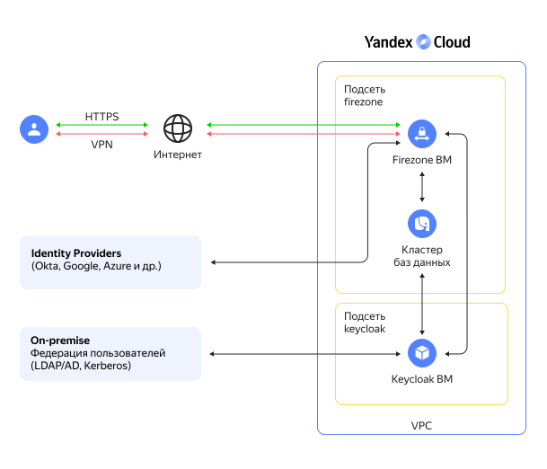

# Защищенный доступ пользователей к облачным ресурсам на основе WireGuard VPN

Для организации защищенного удаленного доступа пользователей через [VPN](https://ru.wikipedia.org/wiki/VPN) к вашим облачным ресурсам по протоколу [WireGuard VPN](https://www.wireguard.com/) воспользуйтесь решением [Firezone](https://www.firezone.dev/) на основе открытого кода. Для реализации сценариев [единого входа](https://ru.wikipedia.org/wiki/Технология_единого_входа) пользователей, решение поддерживает несколько сервисов аутентификации ([Identity Providers](https://www.firezone.dev/docs/authenticate)). В примере ниже используется решение по аутентификации [Keycloak](https://www.keycloak.org/).

В данном сценарии вы развернете в {{ yandex-cloud }} облачную инфраструктуру для организации Remote access VPN на основе WireGuard VPN по следующей схеме:



Описание основных элементов схемы:

| Название | Описание |
| ---- | ---- |
| Firezone ВМ | Виртуальная машина с установленным ПО Firezone на основе WireGuard VPN для организации VPN доступа |
| Кластер баз данных | Сервис [Managed Service for PostgreSQL](../../managed-postgresql/) для работы Firezone ВМ и Keycloak ВМ | 
| Keycloak ВМ | Open-source ПО [Keycloak](https://www.keycloak.org/) для Single Sign-On аутентификации пользователей в корпоративной федерации пользователей, например Active Directory |


Более подробное описание приведено в [репозитории проекта](https://github.com/yandex-cloud/yc-solution-library-for-security/blob/master/network-sec/remote-access-vpn/README.md).

Чтобы настроить Firezone и проверить его работу:

1. [Подготовьте облако к работе](#prepare-cloud).
1. [Подготовьте среду для развертывания ресурсов](#setup-environment).
1. [Подготовьте домен](#prepare-domain).
1. [Разверните Firezone и Keycloak](#deploy-firezone).
1. [Настройте Keycloak для интеграции с Firezone](#configure-keycloak).
1. [Настройте Firezone](#configure-firezone). 
1. [Протестируйте работу](#test-firezone).

Если созданные ресурсы вам больше не нужны, [удалите их](#clear-out).

## Подготовьте облако к работе {#prepare-cloud}




### Необходимые платные ресурсы {#paid-resources}

В стоимость поддержки инфраструктуры входят:

* плата за постоянно работающие ВМ (см. [тарифы {{ compute-full-name }}](../../compute/pricing.md));
* плата за использование публичных IP-адресов и исходящий трафик (см. [тарифы {{ vpc-full-name }}](../../vpc/pricing.md));
* плата за использование сервиса {{ mpg-name }} (см. [тарифы {{ mpg-full-name }}](../../managed-postgresql/pricing.md));
* плата за публичные [DNS-запросы](../../glossary/dns.md) и [зоны DNS](../../dns/concepts/dns-zone.md) (см. [тарифы {{ dns-name }}](../../dns/pricing.md)).


## Подготовьте среду для развертывания ресурсов {#setup-environment}

1. [Установите {{ TF }}](../../tutorials/infrastructure-management/terraform-quickstart.md#install-terraform).
1. Если у вас еще нет интерфейса командной строки {{ yandex-cloud }}, [установите](../../cli/quickstart.md) его и авторизируйтесь от имени пользователя.
1. Создайте сервисный аккаунт:

   

   - Консоль управления

      1. В [консоли управления]({{ link-console-main }}) выберите каталог, в котором хотите создать сервисный аккаунт.
      1. На вкладке **{{ ui-key.yacloud.iam.folder.switch_service-accounts }}** нажмите кнопку **{{ ui-key.yacloud.iam.folder.service-accounts.button_add }}**.
      1. Введите имя сервисного аккаунта, например, `sa-firezone`.
      1. Нажмите кнопку **{{ ui-key.yacloud.iam.folder.service-account.popup-robot_button_add }}**.

   - CLI

      

      Выполните команду для создания сервисного аккаунта, указав имя `sa-firezone`:

      ```bash
      yc iam service-account create --name sa-firezone
      ```

      Где `name` — имя сервисного аккаунта.

      Результат:
      ```yaml
      id: ajehr0to1g8b********
      folder_id: b1gv87ssvu49********
      created_at: "2023-07-06T09:00:00.665153755Z"
      name: sa-firezone
      ```

   

1. Назначьте сервисному аккаунту [роль](../../iam/concepts/access-control/roles.md) администратора на каталог: 

   

   - Консоль управления

      1. На [стартовой странице]({{ link-console-main }}) консоли управления выберите каталог.
      1. Перейдите на вкладку **{{ ui-key.yacloud.common.resource-acl.label_access-bindings }}**.
      1. Найдите аккаунт `sa-firezone` в списке и нажмите значок .
      1. Нажмите кнопку **{{ ui-key.yacloud.common.resource-acl.button_assign-binding }}**.
      1. В открывшемся диалоге нажмите кнопку **Добавить роль** и выберите роль `admin`.

   - CLI

      Выполните команду:
      ```
      yc resource-manager folder add-access-binding <идентификатор_каталога> \
         --role admin \
         --subject serviceAccount:<идентификатор_сервисного_аккаунта>
      ```

   

1. Настройте профиль CLI для выполнения операций от имени сервисного аккаунта:

   

   - CLI

      1. Создайте [авторизованный ключ](../../iam/concepts/authorization/key.md) для сервисного аккаунта и запишите его в файл:
         ```
         yc iam key create \
         --service-account-id <идентификатор_сервисного_аккаунта> \
         --folder-id <id_каталога_с_сервисным_аккаунтом> \
         --output key.json
         ```
         Где:
         * `service-account-id` — идентификатор сервисного аккаунта.
         * `folder-id` — идентификатор каталога, в котором создан сервисный аккаунт.
         * `output` — имя файла с авторизованным ключом.

         Результат:
         ```
         id: aje8nn871qo4********
         service_account_id: ajehr0to1g8b********
         created_at: "2023-07-06T09:03:00.479156798Z"
         key_algorithm: RSA_2048
         ```

      1. Создайте профиль CLI для выполнения операций от имени сервисного аккаунта:
         ```
         yc config profile create sa-firezone
         ```

         Результат:
         ```
         Profile 'sa-firezone' created and activated
         ```

      1. Задайте конфигурацию профиля:
         ```
         yc config set service-account-key key.json
         ```

         Где `service-account-key` — файл с авторизованным ключом сервисного аккаунта.

      1.  Сохраните ключ доступа в переменную окружения:
         ```
         export YC_TOKEN=$(yc iam create-token)
         ```

   

## Подготовьте домен {#prepare-domain}

Вам понадобится домен, который будет использоваться для виртуальных машин Firezone и Keycloak. Этот домен должен быть предварительно делегирован в Yandex Cloud со стороны регистратора домена. Для этого укажите адреса серверов `ns1.yandexcloud.net` и `ns2.yandexcloud.net` в личном кабинете вашего регистратора.

## Разверните Firezone и Keycloak {#deploy-firezone}

1. На вашей рабочей станции склонируйте [репозиторий](https://github.com/yandex-cloud/yc-solution-library-for-security/) `yandex-cloud/yc-solution-library-for-security` из GitHub и перейдите в папку сценария `remote-access-vpn`:
   ```bash
   git clone https://github.com/yandex-cloud/yc-solution-library-for-security.git

   cd yc-solution-library-for-security/network-sec/remote-access-vpn
   ```

1. Отредактируйте файл `output.tf` в папке `settings`, указав параметры разворачиваемых ресурсов:

   * В секции `domain` укажите ваше доменное имя (второго и первого уровня, разделенное точкой) для виртуальных машин Firezone и Keycloak. В этом примере используется домен `example.com`.
   * В секции `folder_id` укажите ID каталога для размещения ресурсов, например `b1grj7grr1kn********`.
   * В секции `vpc_id` укажите ID облачной сети для размещения ресурсов, например `enp48c1ndilt********`.
   * В секции `trusted_ip_for_mgmt` укажите список публичных IP адресов/подсетей, с которых разрешено подключение по SSH к Firezone и Keycloak ВМ, например `["A.A.A.A/32", "B.B.B.0/24"]`.
   * В секции `admin_email` почтовый адрес администратора (логин) для доступа к веб-интерфейсу администратора Firezone, например `admin@example.com`.
   * В секции `email` почтовый адрес тестового пользователя, который будет добавлен в Firezone после успешной аутентификации в Keycloak, например `user@example.com`.
   * Остальные параметры можете оставить по умолчанию или изменить на свои значения кроме параметров `image_folder_id` и `image_name`.

   

      Заданные в файле значения предусматривают разворачивание ресурсоемкой инфраструктуры.
      Проверьте квоты в облаке, чтобы была возможность развернуть ресурсы.

   

   

      | Ресурс                                      | Количество |
      | ------------------------------------------- | ---------- |
      | Виртуальные машины                          | 2          |
      | vCPU виртуальных машин                      | 4          |
      | RAM виртуальных машин                       | 12 ГБ      |
      | Диски                                       | 2          |
      | Объем SSD дисков                            | 110 ГБ     |
      | Подсети                                     | 2          |
      | Статические публичные IP-адреса             | 2          |
      | Группы безопасности                         | 2          |
      | Сертификат Certificate Manager              | 1          |
      | Зона DNS                                    | 1          |
      | Кластер Managed Service for PostgreSQL      | 1          |
      | Объём SSD-хранилища для кластера PostgreSQL | 10 ГБ      |
      | Количество vCPU для кластера PostgreSQL     | 2          |
      | Объём памяти для кластера PostgreSQL        | 8          |

   

   

   - {{ TF }}

      1. Перейдите в папку `main`
         ```bash
         cd main
         ```

      1. Выполните инициализацию Terraform:
         ```bash
         terraform init
         ```

      1. Проверьте список создаваемых облачных ресурсов:
         ```bash
         terraform plan
         ```

      1. Создайте ресурсы:
         ```bash
         terraform apply
         ```
         Дождитесь завершения процесса. Обработка запроса на выдачу сертификата в сервисе Let's Encrypt может выполняться до 30 минут. 

      1. По завершению в командной строке будут выведены URL-адреса для подключения к веб-интерфейсам Firezone и Keycloak, а также учетные записи администраторов Firezone и Keycloak. В дальнейшем эту информацию можно будет посмотреть с помощью команды `terraform output`.

         ```bash
         Outputs:

         firezone_admin_credentials = <sensitive>
         firezone_url = "https://vpn.example.com"
         keycloak_admin_credentials = <sensitive>
         keycloak_url = "https://kc.example.com:8443/admin"
         ```

         Для получения `sensitive` значения укажите имя параметра в команде `terraform output`, например:

         ```bash
         terraform output firezone_admin_credentials
         ```

         Результат:
         ```bash
         {
            "admin_email" = "admin@example.com"
            "admin_password" = "7fVN********"
         }      
         ```

   

## Настройте Keycloak для интеграции с Firezone {#configure-keycloak}



- {{ TF }}

   1. После завершения развертывания виртуальных машин для Firezone и Keycloak перейдите в папку `keycloak-config`, чтобы выполнить настройку Keycloak для сценария интеграции Keycloak с Firezone и Single Sign-On.
      ```bash
      cd ../keycloak-config
      ```

   1. Выполните инициализацию Terraform:
      ```bash
      terraform init
      ```

   1. Проверьте список создаваемых облачных ресурсов:
      ```bash
      terraform plan
      ```

   1. Создайте ресурсы:
      ```bash
      terraform apply
      ```

   1. После завершения процесса terraform apply в командной строке будет выведена информация для настройки интеграции Firezone и Keycloak, а также учетная запись тестового пользователя для проверки SSO в Keycloak и подключения к VPN. В дальнейшем эту информацию можно будет посмотреть с помощью команды `terraform output`.

      ```bash
      Outputs:

      keycloak_config_for_firezone = <sensitive>
      test_user_credentials = <sensitive>
      ```

      Для вывода `sensitive` значения укажите его в команде `terraform output`.



## Настройте Firezone {#configure-firezone}

1. Перейдите в браузере по адресу `https://firezone_url`, где `firezone_url` — вывод команды `terraform output firezone_url` в папке `main`, в данном примере `https://vpn.example.com`
1. Войдите в интерфейс администратора Firezone с учетной записью администратора из вывода команды `terraform output firezone_admin_credentials` в папке `main`.
1. Перейдите в раздел **SETTINGS / Defaults** для изменения настроек по умолчанию.
1. В поле **Allowed IPs** укажите, для каких облачных IP подсетей (укажите через запятую адреса подсетей/маски) VPN клиенты будут направлять трафик в VPN туннель. Пример: `192.168.1.0/24, 192.168.2.0/24`.
1. В поле **DNS Servers** укажите адреса DNS серверов, которые будут использоваться VPN клиентами. 
   Пример: `192.168.1.2, 192.168.2.2`.
   Если переназначение на стороне клиента этих DNS адресов не планируется, удалите информацию в этом поле. 
1. Также можно изменить параметры по умолчанию для интервала `keepalive`, размера `MTU` для VPN клиентов. По умолчанию указан `MTU` 1280 байт, его можно увеличить до 1440 байт.
1. Нажмите **Save** для применения настроек.
1. Перейдите в раздел **SETTINGS / Security** для изменения настроек безопасности.
1. Выключите настройку **Allow unprivileged device configuration**, чтобы пользователь не мог изменить через пользовательский веб-интерфейс Firezone сетевые настройки для VPN клиента.
1. Включите настройку **Auto disable VPN**. Это позволит при удалении пользователя в Identity Provider (Keycloak в данном примере) отключить его VPN подключения.
1. Нажмите **Add OpenID Connect Provider** для добавления Keycloak.
1. В разделе **OIDC Configuration** заполните поля:
   - **Config ID**: `keycloak`;
   - **Label**: `Keycloak`;
   - **OIDC scopes**: `openid email profile offline_access`;
   - **Client ID**: `firezone`;
   - **Client secret**: `client_secret` из вывода `terraform output keycloak_config_for_firezone` в папке `keycloak-config` (значение укажите без кавычек);
   - **Discovery Document URI**: `discovery_document_uri` из вывода `terraform output keycloak_config_for_firezone` в папке `keycloak-config` (значение укажите без кавычек);
   - **Redirect URI**: оставьте пустым;
   - Включить **Auto-create users** для автоматического добавления пользователей в Firezone после их успешной аутентификации в Keycloak.
1. Нажмите **Save** в разделе **OIDC Configuration** для применения настроек.

## Протестируйте работу {#test-firezone}

1. Установите на своё устройство [клиент WireGuard](https://www.wireguard.com/install/) с сайта WireGuard. Дальнейшие шаги по настройке клиента WireGuard приведены на примере ОС Windows. Для других ОС название элементов интерфейса клиента может отличаться.
1. Перейдите в браузере по адресу `https://firezone_url`, где `firezone_url` — вывод команды `terraform output firezone_url` в папке `main`. Если у вас активна сессия администратора в веб-интерфейсе Firezone, то предварительно выполните **Log Out**. Нажмите **Sign in with Keycloak**. Произойдет редирект на веб-страницу Keycloak для Single Sign-On.
1. Войдите с учетной записью тестового пользователя из вывода команды `terraform output test_user_credentials` в папке `keycloak-config`.
1. После успешной аутентификации в веб-интерфейсе Firezone с тестовым пользователем добавьте устройство, с которого будет устанавливаться VPN подключение. Для этого нажмите **Add Device**.
1. В открывшемся окне можете изменить название устройства и добавить его описание. Нажмите **Generate Configuration**.
1. Появится окно с VPN конфигурацией для устройства. Нажмите **Download WireGuard Configuration** для скачивания файла конфигурации. В приложении WireGuard для Android или iOS можно также отсканировать QR-код с этой страницы для добавления VPN туннеля.

   

      Не закрывайте это окно, пока не скачаете конфигурационный файл или не отсканируете QR-код. После закрытия окна VPN конфигурацию для устройства больше не получится посмотреть в веб-интерфейсе Firezone.

   

1. Добавьте новый VPN туннель (**Import tunnel(s) from file**) в приложении WireGuard, используя скачанный конфигурационный файл.
1. Активируйте туннель нажатием на **Activate**.  
1. Проверьте на своём устройстве в командной строке с помощью `ping 192.168.1.1` доступность шлюза из облачной подсети `firezone`. Вы подключились с помощью VPN туннеля к облачной инфраструктуре.

   ```bash
   Pinging 192.168.1.1 with 32 bytes of data:
   Reply from 192.168.1.1: bytes=32 time=67ms TTL=53
   ```

## Как удалить созданные ресурсы {#clear-out}

Чтобы перестать платить за созданные ресурсы:



- {{ TF }}

   1. Перейдите на вашей рабочей станции в папку `keycloak-config` и выполните команду `terraform destroy`.
   1. После этого перейдите в папку `main` и выполните команду `terraform destroy`.

