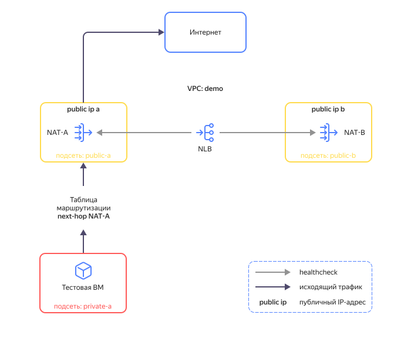
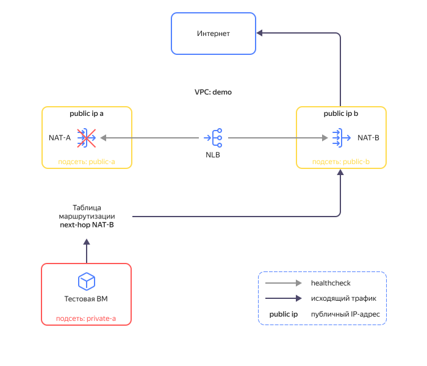

# Реализация отказоустойчивых сценариев для сетевых виртуальных машин


В {{ yandex-cloud }} можно развернуть облачную инфраструктуру с использованием виртуальных машин (далее сетевых ВМ), выполняющих функции межсетевого экранирования, сетевой безопасности и маршрутизации трафика. С помощью [статической маршрутизации](../../vpc/concepts/static-routes.md) трафик из подсетей направляется на сетевые ВМ. 

Для обеспечения высокой доступности можно развернуть несколько сетевых ВМ в разных [зонах доступности](../../overview/concepts/geo-scope.md) и настроить автоматическое переключение исходящего из подсетей трафика с одной сетевой ВМ на другую с помощью [модуля route-switcher](https://github.com/yandex-cloud-examples/yc-route-switcher/tree/main).

В этом практическом руководстве показан пример использования модуля route-switcher для обеспечения отказоустойчивости [NAT-инстанса](/marketplace/products/yc/nat-instance-ubuntu-18-04-lts) — сетевой ВМ с преднастроенными правилами маршрутизации и трансляции IP-адресов. NAT-инстансы используются для организации доступа в интернет виртуальных машин и других облачных ресурсов, размещенных в {{ yandex-cloud }}.

В примере на схеме NAT-инстанс `NAT-A` является основным для исходящего в интернет трафика, а `NAT-B` — резервным.





   | Название элемента | Описание |
   | ----------- | ----------- |
   | NAT-A, NAT-B | NAT-инстансы, обеспечивающие доступ облачных ресурсов в интернет с помощью трансляции внутренних IP-адресов ресурсов в публичные IP-адреса NAT-инстансов |
   | VPC: demo | Сеть {{vpc-name }} |
   | private-a | Подсеть в зоне `{{ region-id }}-a` для размещения ресурсов, которым требуется доступ в интернет |
   | public-a, public-b | Подсети в зонах `{{ region-id }}-a` и `{{ region-id }}-b`, в которых располагаются NAT-инстансы |
   | public ip a, public ip b | Публичные IP-адреса NAT-инстансов |
   | NLB | Внутренний сетевой балансировщик для работы модуля route-switcher, осуществляет проверку доступности NAT-инстансов с помощью проверок состояния на порт TCP 22 |



В случае отказа `NAT-A` модуль route-switcher переключит исходящий трафик на `NAT-B`, изменив в таблице маршрутизации для подсети значение `Next hop` на внутренний IP-адрес `NAT-B`. После чего доступ в интернет будет обеспечен через `NAT-B`.



После восстановления `NAT-A` модуль route-switcher перенаправит исходящий трафик через `NAT-A`, поменяв в таблице маршрутизации значение `Next hop` на внутренний IP-адрес ВМ `NAT-A`.

С помощью данного практического руководства вы создадите тестовую инфраструктуру, демонстрирующую работу модуля route-switcher. Решение включает следующие основные элементы:

* **nat-a** — основной NAT-инстанс;
* **nat-b** — резервный NAT-инстанс;
* **test-vm** — ВМ внутреннего периметра инфраструктуры, для которой организуется доступ в интернет через NAT-инстанс; 
* **route-switcher-lb-...** — [сетевой балансировщик](../../network-load-balancer/concepts/index.md) для работы модуля route-switcher и проверки доступности NAT-инстансов;
* **route-switcher-...** —  [облачная функция](../../functions/concepts/function.md), обеспечивающая переключение исходящего трафика в случае отказа основного NAT-инстанса.

Чтобы развернуть тестовую инфраструктуру и проверить работу модуля route-switcher:

1. [Подготовьте облако к работе](#prepare-cloud).
1. [Подготовьте окружение](#prepare-environment).
1. [Разверните ресурсы](#create-resources).
1. [Включите работу модуля route-switcher](#enable-route-switcher).
1. [Протестируйте работоспособность и отказоустойчивость решения](#test-solution).

Если созданные ресурсы вам больше не нужны, [удалите их](#clear-out).
 
## Подготовьте облако к работе {#prepare-cloud}




### Необходимые платные ресурсы {#paid-resources}

В стоимость поддержки инфраструктуры входит:

* плата за постоянно работающие ВМ (см. [тарифы {{ compute-full-name }}](../../compute/pricing.md));
* плата за использование {{ network-load-balancer-name }} (см. [тарифы {{ network-load-balancer-full-name }}](../../network-load-balancer/pricing.md));
* плата за использование публичных IP-адресов и исходящий трафик (см. [тарифы {{ vpc-full-name }}](../../vpc/pricing.md));
* плата за использование функции (см. [тарифы {{ sf-full-name }}](../../functions/pricing.md));


## Настройте профиль CLI {#setup-profile}

1. Если у вас еще нет интерфейса командной строки {{ yandex-cloud }}, [установите](../../cli/quickstart.md) его и авторизируйтесь от имени пользователя.
1. Создайте сервисный аккаунт:

   

   - Консоль управления {#console}

      1. В [консоли управления]({{ link-console-main }}) выберите каталог, в котором хотите создать сервисный аккаунт.
      1. На вкладке **{{ ui-key.yacloud.iam.folder.switch_service-accounts }}** нажмите кнопку **{{ ui-key.yacloud.iam.folder.service-accounts.button_add }}**.
      1. Введите имя сервисного аккаунта, например, `sa-terraform`.
      1. Нажмите кнопку **{{ ui-key.yacloud.iam.folder.service-account.popup-robot_button_add }}**.

   - CLI {#cli}

      

      Выполните команду для создания сервисного аккаунта, указав имя `sa-terraform`:

      ```bash
      yc iam service-account create --name sa-terraform
      ```

      Где `name` — имя сервисного аккаунта.

      Результат:

      ```yaml
      id: ajehr0to1g8b********
      folder_id: b1gv87ssvu49********
      created_at: "2023-06-20T09:03:11.665153755Z"
      name: sa-terraform
      ```

   - API {#api}

      Чтобы создать сервисный аккаунт, воспользуйтесь методом [ServiceAccountService/Create](../../iam/api-ref/grpc/service_account_service.md#Create) gRPC API или методом [create](../../iam/api-ref/ServiceAccount/create.md) для ресурса `ServiceAccount` REST API.

   

1. Назначьте сервисному аккаунту [роль](../../iam/concepts/access-control/roles.md) администратора на каталог: 

   

   - Консоль управления {#console}

      1. На [стартовой странице]({{ link-console-main }}) консоли управления выберите каталог.
      1. Перейдите на вкладку **{{ ui-key.yacloud.common.resource-acl.label_access-bindings }}**.
      1. Найдите аккаунт `sa-terraform` в списке и нажмите значок .
      1. Нажмите кнопку **{{ ui-key.yacloud.common.resource-acl.button_assign-binding }}**.
      1. В открывшемся диалоге нажмите кнопку **Добавить роль** и выберите роль `admin`.

   - CLI {#cli}

      Выполните команду:

      ```
      yc resource-manager folder add-access-binding <идентификатор_каталога> \
         --role admin \
         --subject serviceAccount:<идентификатор_сервисного_аккаунта>
      ```

   - API {#api}

      Чтобы назначить сервисному аккаунту роль на каталог, воспользуйтесь методом REST API [setAccessBindings](../../iam/api-ref/ServiceAccount/setAccessBindings.md) для ресурса [ServiceAccount](../../iam/api-ref/ServiceAccount/index.md) или вызовом gRPC API [ServiceAccountService/SetAccessBindings](../../iam/api-ref/grpc/service_account_service.md#SetAccessBindings).

   

1. Настройте профиль CLI для выполнения операций от имени сервисного аккаунта:

   

   - CLI {#cli}

      1. Создайте [авторизованный ключ](../../iam/concepts/authorization/key.md) для сервисного аккаунта и запишите его в файл:

         ```bash
         yc iam key create \
         --service-account-id <идентификатор_сервисного_аккаунта> \
         --folder-id <id_каталога_с_сервисным_аккаунтом> \
         --output key.json
         ```

         Где:
         * `service-account-id` — идентификатор сервисного аккаунта.
         * `folder-id` — идентификатор каталога, в котором создан сервисный аккаунт.
         * `output` — имя файла с авторизованным ключом.

         Результат:

         ```bash
         id: aje8nn871qo4********
         service_account_id: ajehr0to1g8b********
         created_at: "2023-06-20T09:16:43.479156798Z"
         key_algorithm: RSA_2048
         ```

      1. Создайте профиль CLI для выполнения операций от имени сервисного аккаунта:
         ```bash
         yc config profile create sa-terraform
         ```

         Результат:

         ```bash
         Profile 'sa-terraform' created and activated
         ```

      1. Задайте конфигурацию профиля:

         ```bash
         yc config set service-account-key key.json
         ```

         Где:

         `service-account-key` — файл с авторизованным ключом сервисного аккаунта.

      1. Добавьте аутентификационные данные в переменные окружения:

         ```bash
         export YC_TOKEN=$(yc iam create-token)
         ```

    

## Подготовьте среду для развертывания ресурсов {#setup-environment}

1. [Установите {{ TF }}](../../tutorials/infrastructure-management/terraform-quickstart.md#install-terraform).
1. Установите [Git](https://ru.wikipedia.org/wiki/Git) с помощью команды:

   ```bash
   sudo apt install git
   ```

1. Клонируйте репозиторий `yandex-cloud-examples/yc-route-switcher` из GitHub и перейдите в папку сценария:

    ```bash
    git clone https://github.com/yandex-cloud-examples/yc-route-switcher.git
    cd yc-route-switcher/examples
    ```

1. Откройте файл `terraform.tfvars`, например, с помощью редактора `nano`:

    ```bash
    nano terraform.tfvars
    ```

1. Отредактируйте:

   1. Строку, содержащую идентификатор каталога:   

      ```text
      folder_id = "<идентификатор_каталога>"
      ```

   1. Строку, содержащую список разрешенных публичных IP-адресов для доступа к ВМ `test-vm`:

      ```text
      trusted_ip_for_mgmt = ["<внешний_IP_рабочей_станции>/32"]
      ```

      Где:
      `<внешний_IP_рабочей_станции>` — публичный IP-адрес вашей рабочей станции. 

      Чтобы узнать внешний IP рабочей станции, выполните:

      ```bash
      curl 2ip.ru
      ```

      Результат:

      ```bash
      192.240.24.87
      ```

## Разверните ресурсы {#create-resources}

1. Выполните инициализацию {{ TF }}: 

   ```bash
   terraform init
   ```

1. Проверьте конфигурацию {{ TF }}-файлов:

   ```bash
   terraform validate
   ```

1. Проверьте список создаваемых облачных ресурсов:

   ```bash
   terraform plan
   ```

1. Создайте ресурсы:

   ```bash
   terraform apply 
   ```

1. Дождитесь окончания развертывания ресурсов и сохраните итоговую выдачу команды: {#final-output}

   ```bash
   Outputs:
   nat-a_public_ip_address = "***.***.129.139"
   nat-b_public_ip_address = "***.***.105.234"
   path_for_private_ssh_key = "./pt_key.pem"
   test_vm_password = <sensitive>
   vm_username = "admin"
   ```

## Включите работу модуля route-switcher {#enable-route-switcher}

1. Убедитесь, что NAT-инстансы перешли в рабочее состояние и доступны внутри сети:

   

   - Консоль управления {#console}

      1. В [консоли управления]({{ link-console-main }}) выберите нужный в каталог.
      1. Выберите сервис **{{ network-load-balancer-name }}** и перейдите на страницу сетевого балансировщика `route-switcher-lb-...`.
      1. Раскройте целевую группу и убедитесь, что состояния целевых ресурсов имеет статус `Healthy`. 

   

1. Откройте файл `route-switcher.tf`, например, с помощью редактора `nano`:

    ```bash
    nano route-switcher.tf
    ```

1. Измените значение параметра `start_module` модуля `route-switcher` на `true`. 
1. Запустите модуль, выполнив команду:

   ```bash
   terraform apply 
   ```

   В течение 5 минут после развертывания ресурсов модуль route-switcher начнет работу по обеспечению отказоустойчивости исходящего трафика в интернет через NAT-инстанс.

## Протестируйте работоспособность и отказоустойчивость решения {#test-solution}

### Тестирование работоспособности системы {#accessibility-test}

1. Подключитесь к серийной консоли ВМ `test-vm`:

   

   - Консоль управления {#console}
  
      1. В [консоли управления]({{ link-console-main }}) выберите нужный в каталог.
      1. Выберите сервис **{{ ui-key.yacloud.iam.folder.dashboard.label_compute }}**.
      1. В списке ВМ выберите `test-vm`.
      1. Перейдите на вкладку **{{ ui-key.yacloud.compute.instance.switch_console }}**.
      1. Дождитесь полной загрузки операционной системы.

   

1. Введите логин `admin` и пароль. 
   Чтобы узнать пароль, на рабочей станции в папке с terraform-сценарием выполните команду:

    ```bash
    terraform output test_vm_password
    ```

1. Убедитесь, что доступ в интернет ВМ `test-vm` получает через публичный IP-адрес NAT-инстанса `nat-a`. Для этого в серийной консоли выполните команду:

   ```bash
   curl ifconfig.co
   ```

   Сравните IP-адрес со значением `nat-a_public_ip_address` из [итоговой выдачи](#final-output).

1. Запустите исходящий трафик с помощью команды `ping` на тестовой ВМ к ресурсу в интернете:

   ```bash
   ping ya.ru
   ```

   Убедитесь, что пакеты возвращаются:

   ```bash
   PING ya.ru (77.88.55.242) 56(84) bytes of data.
   64 bytes from ya.ru (77.88.55.242): icmp_seq=1 ttl=56 time=4.67 ms
   64 bytes from ya.ru (77.88.55.242): icmp_seq=2 ttl=56 time=3.83 ms
   64 bytes from ya.ru (77.88.55.242): icmp_seq=3 ttl=56 time=3.80 ms
   64 bytes from ya.ru (77.88.55.242): icmp_seq=4 ttl=56 time=3.78 ms
   ```

1. Убедитесь, что значение `Next hop` в таблице маршрутизации для сети `demo` соответствует внутреннему IP-адресу ВМ `nat-a`.

### Тестирование отказоустойчивости системы {#fault-tolerance-test}

1. Отключите основной NAT-инстанс, эмулируя отказ системы:

   

   - Консоль управления {#console}

      1. В [консоли управления]({{ link-console-main }}) выберите нужный в каталог.
      1. Выберите сервис **{{ ui-key.yacloud.iam.folder.dashboard.label_compute }}**.
      1. Выберите ВМ `nat-a` в списке, нажмите значок  и выберите **{{ ui-key.yacloud.common.stop }}**.
      1. В открывшемся окне нажмите кнопку **{{ ui-key.yacloud.compute.instances.popup-confirm_button_stop }}**.

   - CLI {#cli}

      1. Посмотрите описание команды CLI для остановки ВМ:

         ```bash
         yc compute instance stop --help
         ```

      1. Остановите ВМ:

         ```bash
         yc compute instance stop nat-a
         ```

   - API {#api}

      Воспользуйтесь методом REST API [stop](../../compute/api-ref/Instance/stop.md) для ресурса [Instance](../../compute/api-ref/Instance/) или вызовом gRPC API [InstanceService/Stop](../../compute/api-ref/grpc/instance_service.md#Stop).

   

1. Наблюдайте за пропаданием пакетов, отправляемых `ping`. 
   После отключения основного NAT-инстанса может наблюдаться пропадание трафика в среднем в течение 1 минуты, после чего трафик должен восстановиться.
1. Убедитесь, что доступ в интернет теперь осуществляется через публичный IP-адрес NAT-инстанса `nat-b`. Для этого в серийной консоли остановите `ping` и выполните команду:

   ```bash
   curl ifconfig.co
   ```

   Сравните IP-адрес со значением `nat-b_public_ip_address` из [итоговой выдачи](#final-output).
1. Убедитесь, что route-switcher изменил значение `Next hop` в таблице маршрутизации для сети `demo`, и теперь оно соответствует внутреннему IP-адресу ВМ `nat-b`.
1. Запустите исходящий трафик с помощью команды `ping` на тестовой ВМ.
1. Запустите основной NAT-инстанс, эмулируя восстановление системы:

   

   - Консоль управления {#console}

      1. В [консоли управления]({{ link-console-main }}) выберите нужный в каталог.
      1. Выберите сервис **{{ ui-key.yacloud.iam.folder.dashboard.label_compute }}**.
      1. Выберите ВМ `nat-a` в списке, нажмите значок  и выберите **{{ ui-key.yacloud.common.stop }}**.
      1. В открывшемся окне нажмите кнопку **{{ ui-key.yacloud.compute.instances.popup-confirm_button_start }}**.

   - CLI {#cli}

      1. Посмотрите описание команды CLI для остановки ВМ:

         ```bash
         yc compute instance start --help
         ```

      1. Остановите ВМ:

         ```bash
         yc compute instance start nat-a
         ```

   - API {#api}

      Воспользуйтесь методом REST API [start](../../compute/api-ref/Instance/start.md) для ресурса [Instance](../../compute/api-ref/Instance/) или вызовом gRPC API [InstanceService/Start](../../compute/api-ref/grpc/instance_service.md#Start).

   

1. Наблюдайте за выдачей утилиты `ping`. В процессе восстановления NAT-A может не наблюдаться потери отправляемых пакетов. 
1. Убедитесь, что доступ в интернет опять осуществляется через публичный IP-адрес NAT-инстанса `nat-a`. Для этого в серийной консоли остановите `ping` и выполните команду:

   ```bash
   curl ifconfig.co
   ```

   Сравните IP-адрес со значением `nat-a_public_ip_address` из [итоговой выдачи](#final-output).
1. Убедитесь, что route-switcher изменил значение `Next hop` в таблице маршрутизации для сети `demo`, и оно опять соответствует внутреннему IP-адресу ВМ `nat-a`.

## Как удалить созданные ресурсы {#clear-out}

Чтобы перестать платить за созданные ресурсы выполните команду:

  ```bash
  terraform destroy
  ```
  
  

  {{ TF }} удалит все ресурсы **без возможности восстановления**: сети, подсети, виртуальные машины, балансировщик и т.д.

  
