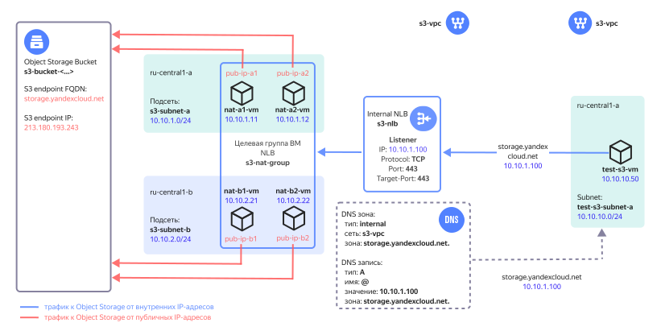

# Подключение к {{ objstorage-name }} из {{ vpc-name }}

Подключиться к [{{ objstorage-full-name }}](../../storage/) в {{ yandex-cloud }} можно через соответствующий [API Endpoint](../../api-design-guide/concepts/endpoints.md), FQDN которого потом преобразуется в публичный IP-адрес с помощью службы DNS. 

В статье описано, как развернуть в {{ yandex-cloud }} облачную инфраструктуру для организации доступа к {{ objstorage-name }} для ресурсов, которые размещены в [облачной сети](../../vpc/concepts/network.md#network) {{ vpc-short-name }} и не имеют публичных IP-адресов или выхода в интернет через [NAT-шлюз](../../vpc/concepts/gateways.md).



После развертывания решения в {{ yandex-cloud }} будут созданы следующие ресурсы:

| Название | Описание |
| ---- | ---- |
| `s3-vpc` | Облачная сеть с ресурсами, для которых организуется доступ к {{ objstorage-name }}. При развертывании можно также указать уже существующую облачную сеть. |
| `s3-nlb` | [Внутренний сетевой балансировщик](../../network-load-balancer/concepts/nlb-types.md), который обеспечивает прием трафика к {{ objstorage-name}}. Балансировщик принимает TCP-трафик с портом назначения 443 и распределяет его по ресурсам (ВМ) в целевой группе. |
| `s3-nat-group` | [Целевая группа](../../network-load-balancer/concepts/target-resources.md) балансировщика с ВМ, на которых включена функция NAT. |
| `nat-a1-vm`, `nat-a2-vm`, `nat-b1-vm`, `nat-b2-vm` | ВМ с NAT в [зонах доступности](../../overview/concepts/geo-scope.md) `{{ region-id }}-a` и `{{ region-id }}-b` для передачи трафика к {{ objstorage-name }} и обратно с трансляцией IP-адресов источников и получателей трафика. | 
| `pub-ip-a1`, `pub-ip-a2`, `pub-ip-b1`, `pub-ip-b2` | Публичные IP-адреса ВМ, в которые облачная сеть {{ vpc-short-name }} транслирует их внутренние IP-адреса. | 
| `DNS зона и A-запись` | Внутренняя [DNS-зона](../../dns/concepts/dns-zone.md) `{{ s3-storage-host }}.` в сети `s3-vpc` с [ресурсной записью](../../dns/concepts/resource-record.md) типа `A` , сопоставляющей доменное имя `{{ s3-storage-host }}` c IP-адресом внутреннего сетевого балансировщика. |
| `s3-bucket-<...>` | [Бакет](../../storage/concepts/bucket.md) в {{ objstorage-name }}. |
| `s3-subnet-a`, `s3-subnet-b` | Облачные [подсети](../../vpc/concepts/network.md#subnet) для размещения ВМ с NAT в зонах доступности `{{ region-id }}-a` и `{{ region-id }}-b`. |
| `test-s3-vm` | Тестовая ВМ для проверки доступа к {{ objstorage-name }}. |
| `test-s3-subnet-a` | Облачная подсеть для размещения тестовой ВМ. |

Для облачной сети с размещаемыми ресурсами в сервисе [{{ dns-name }}](../../dns/concepts/) создается внутренняя DNS-зона `{{ s3-storage-host }}.` и ресурсная запись типа `A`, сопоставляющая доменное имя `{{ s3-storage-host }}` сервиса {{ objstorage-name }} c IP-адресом [внутреннего сетевого балансировщика](../../network-load-balancer/concepts/nlb-types.md). Благодаря этой записи трафик от облачных ресурсов к {{ objstorage-name }} будет направляться на внутренний балансировщик, который будет распределять нагрузку по виртуальным машинам с NAT. 

Для развертывания ВМ с NAT используется образ [NAT-инстанс на основе Ubuntu 22.04 LTS](/marketplace/products/yc/nat-instance-ubuntu-22-04-lts) из {{ marketplace-name }}, который обеспечивает трансляции IP-адресов источника и назначения, чтобы обеспечить маршрутизацию трафика до публичного IP-адреса {{ objstorage-name }}.

Разместив ВМ с NAT в нескольких [зонах доступности](../../overview/concepts/geo-scope.md), можно получить отказоустойчивость доступа к {{ objstorage-name }}. Увеличивая количество ВМ с NAT, можно масштабировать решение при возрастании нагрузки. При расчете количества ВМ с NAT следует учитывать [локальность при обработке трафика внутренним балансировщиком](../../network-load-balancer/concepts/specifics#nlb-int-locality).

[Политика доступа {{ objstorage-name }}](../../storage/concepts/policy.md) разрешает действия с бакетом только с публичных IP-адресов ВМ с NAT. Доступ к бакету открыт только для облачных ресурсов, использующих данное решение. Подключиться к бакету в {{ objstorage-name }} через публичный API Endpoint не получится. При необходимости это ограничение можно отключить с помощью параметра в конфигурационном файле {{ TF }}.

## Рекомендации по развертыванию решения в продуктивной среде {#recommendations}

* При развертывании ВМ с NAT в нескольких зонах доступности указывайте четное число ВМ для их равномерного распределения по зонам доступности.
* Выбирая количество ВМ с NAT, учитывайте [локальность при обработке трафика внутренним балансировщиком](../../network-load-balancer/concepts/specifics.md#nlb-int-locality).
* После ввода решения в эксплуатацию уменьшайте количество ВМ с NAT или изменяйте список зон доступности в параметре `yc_availability_zones` только в заранее запланированный период времени. В процессе применения изменений возможны прерывания в обработке трафика.
* По умолчанию доступ к бакету в {{ objstorage-name }} разрешен через [консоль управления]({{ link-console-main }}) {{ yandex-cloud }}. Вы можете отменить это разрешение с помощью параметра `bucket_console_access = false`.
* Если не указать параметр `mgmt_ip` при `bucket_private_access = true`, то развертывание решения с помощью {{ TF }} на рабочей станции будет завершаться с ошибкой доступа к бакету.
* Если вы используете собственный DNS-сервер, в его настройках создайте ресурсные записи типа `A` следующего вида:

  | Имя | Тип | Значение |
  | ----------- | ----------- | ----------- |
  | `{{ s3-storage-host }}` | `A` | `<IP-адрес_внутреннего_балансировщика>` |
  | `<имя_бакета>.{{ s3-storage-host }}` | `A` | `<IP-адрес_внутреннего_балансировщика>` |

* Сохраните приватный SSH-ключ `pt_key.pem`, используемый для подключения к ВМ с NAT, в надежное место либо пересоздайте его отдельно от {{ TF }}.
* После развертывания решения доступ по SSH к ВМ c NAT будет закрыт. Для разрешения доступа к ВМ с NAT по протоколу SSH добавьте входящее правило для SSH-трафика (`TCP/22`) в [группе безопасности](../../vpc/concepts/security-groups.md) `s3-nat-sg`, чтобы разрешить доступ только с определенных IP-адресов рабочих мест администраторов.

## План развертывания {#deploy-plan}

Чтобы развернуть решение и проверить его работу:

1. [Подготовьте облако к работе](#prepare-cloud).
1. [Подготовьте среду для развертывания ресурсов](#setup-environment).
1. [Разверните решение](#deploy).
1. [Проверьте работоспособность решения](#check).

Если созданные ресурсы вам больше не нужны, [удалите их](#clear-out).

## Подготовьте облако к работе {#prepare-cloud}




### Необходимые платные ресурсы {#paid-resources}

В стоимость поддержки инфраструктуры входят:

* плата за использование {{ objstorage-name }} (см. [тарифы {{ objstorage-full-name }}](../../storage/pricing.md)).
* плата за использование сетевого балансировщика (см. [тарифы {{ network-load-balancer-name }}](../../network-load-balancer/pricing.md)).
* плата за постоянно работающие ВМ (см. [тарифы {{ compute-full-name }}](../../compute/pricing.md)).
* плата за использование публичных IP-адресов и исходящий трафик (см. [тарифы {{ vpc-full-name }}](../../vpc/pricing.md)).


## Подготовьте среду для развертывания ресурсов {#setup-environment}

1. [Установите {{ TF }}](../../tutorials/infrastructure-management/terraform-quickstart.md#install-terraform).
1. Если у вас еще нет интерфейса командной строки {{ yandex-cloud }}, [установите](../../cli/quickstart.md) его и аутентифицируйтесь от имени пользователя.
1. Проверьте наличие учетной записи в облаке {{ yandex-cloud }} с правами `admin` на каталог, в котором выполняете развертывание.
1. [Установите Git](https://github.com/git-guides/install-git).
1. Проверьте квоты в облаке, чтобы была возможность развернуть ресурсы в сценарии:

    

    | Ресурс | Количество |
    | ----------- | ----------- |
    | Виртуальные машины | 5 |
    | vCPU виртуальных машин | 10 |
    | RAM виртуальных машин | 10 ГБ |
    | Диски | 5 |
    | Объем HDD дисков | 30 ГБ |
    | Объем SSD дисков | 40 ГБ |
    | Сетевой балансировщик | 1 |
    | Целевая группа для балансировщика | 1 |
    | Сети | 1^1^ |
    | Подсети | 3 |
    | Статические публичные IP-адреса | 4 |
    | Группы безопасности | 1 |
    | Зона DNS | 1 |
    | Бакет | 1 |  
    | Сервисный аккаунт | 2 |
    | Статический ключ для сервисного аккаунта | 1 |

    ^1^ Если пользователь в `terraform.tfvars` не указал идентификатор существующей сети.

    

## Разверните решение с помощью Terraform {#deploy}

1. Склонируйте на вашу рабочую станцию [репозиторий](https://github.com/yandex-cloud/yc-architect-solution-library/) `yandex-cloud/yc-architect-solution-library` и перейдите в папку `yc-s3-private-endpoint`:

    ```bash
    git clone https://github.com/yandex-cloud/yc-architect-solution-library.git
    
    cd yc-architect-solution-library/yc-s3-private-endpoint
    ```

1. Настройте окружение для аутентификации в {{ TF }} (подробнее см. [Начало работы с {{ TF }}](../../tutorials/infrastructure-management/terraform-quickstart.md#get-credentials)):

    ```bash
    export YC_TOKEN=$(yc iam create-token)
    ```

1. Заполните файл `variables.tf` вашими значениями. Обязательные параметры для изменения отмечены в таблице.

    

    | Название<br>параметра | Замена на<br>пользовательское<br>значение | Описание | Тип | Пример |
    | --- | --- | --- | --- | --- |
    | `folder_id` | да | Идентификатор каталога для размещения компонентов решения. | `string` | `"b1gentmqf1ve********"` |
    | `vpc_id` | — | Идентификатор облачной сети, для которой организуется доступ к {{ objstorage-name }}. Если не указан, то сеть будет создана. | `string` | `"enp48c1ndilt********"` |
    | `yc_availability_zones` | — | [Список зон доступности](../../overview/concepts/geo-scope.md) для развертывания ВМ с NAT. | `list(string)` | `["{{ region-id }}-a", "{{ region-id }}-b"]` |
    | `subnet_prefix_list` | — | Список префиксов облачных подсетей для размещения ВМ с NAT (по одной подсети в каждой зоне доступности из списка `yc_availability_zones`, перечисленных в порядке: {{ region-id }}-a, {{ region-id }}-b и т.д.). | `list(string)` | `["10.10.1.0/24", "10.10.2.0/24"]` |
    | `nat_instances_count` | — | Количество разворачиваемых ВМ с NAT. Рекомендуется указывать четное число для равномерного распределения ВМ по зонам доступности. | `number` | `4` |
    | `bucket_private_access` | — | Ограничить доступ к бакету только с публичных IP-адресов ВМ с NAT. Используется значение `true` для ограничения, `false` для отмены ограничения. | `bool` | `true` |
    | `bucket_console_access` | — | Разрешить доступ к бакету через консоль управления {{ yandex-cloud }}. Используется значение `true` для разрешения, `false` для запрета. Требует указания, когда параметр `bucket_private_access` имеет значение `true`. | `bool` | `true` |
    | `mgmt_ip` | да | Публичный IP-адрес вашей рабочей станции, на которой происходит развертывание инфраструктуры с помощью {{ TF }}. Используется для разрешения рабочей станции выполнять действия с бакетом в процессе развертывания {{ TF }}. Требует указания, когда параметр `bucket_private_access` имеет значение `true`. | `string` | `"A.A.A.A"` |
    | `trusted_cloud_nets` | да | Список агрегированных префиксов облачных подсетей, для которых разрешен доступ к {{ objstorage-name }}. Используется в правиле для входящего трафика групп безопасности для ВМ с NAT.  | `list(string)` | `["10.0.0.0/8", "192.168.0.0/16"]` |
    | `vm_username` | — | Имя пользователя для ВМ с NAT и тестовой ВМ. | `string` | `"admin"` |
    | `s3_ip` | нет | Публичный IP-адрес сервиса {{ objstorage-name }}. | `string` | `213.180.193.243` |
    | `s3_fqdn` | нет | Доменное имя сервиса {{ objstorage-name }}. | `string` | `{{ s3-storage-host }}` |  

    

1. Выполните инициализацию {{ TF }}:

    ```bash
    terraform init
    ```

1. Проверьте список создаваемых облачных ресурсов:

    ```bash
    terraform plan
    ```

1. Создайте ресурсы:

    ```bash
    terraform apply
    ```

1. После завершения процесса `terraform apply` в командной строке будет выведена информация для подключения к тестовой ВМ и тестирования работы с {{ objstorage-name }}. В дальнейшем его можно будет посмотреть с помощью команды `terraform output`:

    

    | Название | Описание | Пример значения |
    | ----------- | ----------- | ----------- |
    | `path_for_private_ssh_key` | Файл с закрытым ключом для подключения по протоколу SSH к ВМ с NAT и тестовой ВМ. | `./pt_key.pem` |
    | `vm_username` | Имя пользователя для ВМ с NAT и тестовой ВМ. | `admin` |
    | `test_vm_password` | Пароль пользователя `admin` для тестовой ВМ. | `v3RСqU****` |
    | `s3_bucket_name` | Имя бакета в {{ objstorage-name }}. | `s3-bucket-<...>` |
    | `s3_nlb_ip_address` | IP-адрес внутреннего балансировщика. | `10.10.1.100` |

    

## Проверьте работоспособность решения {#check}

1. В [консоли управления]({{ link-console-main }}) перейдите в каталог, в котором ранее были созданы ресурсы.
1. Выберите сервис **{{ compute-name }}** и в списке виртуальных машин выберите ВМ `test-s3-vm`. 
1. Подключитесь к серийной консоли ВМ, введите логин `admin` и пароль из вывода команды `terraform output test_vm_password` (укажите значение без кавычек).

1. Выполните команду:

    ```bash
    dig {{ s3-storage-host }}
    ``` 

1.  Убедитесь, что в ответе от DNS-сервера доменному имени сервиса {{ objstorage-name }} соответствует IP-адрес внутреннего балансировщика. Результат вывода ресурсной записи типа `A`:

    ```text
    ;; ANSWER SECTION:
    {{ s3-storage-host }}. 300    IN      A       10.10.1.100
    ```

1. Получите объект из бакета в {{ objstorage-name }} с помощью инструмента [AWS CLI](../../storage/tools/aws-cli.md). Имя бакета будет получено из переменной среды на тестовой ВМ.

    ```bash
    aws --endpoint-url=https://{{ s3-storage-host }} \
    s3 cp s3://$BUCKET/s3_test_file.txt s3_test_file.txt
    ```

    Результат:

    ```bash
    download: s3://<имя-бакета>/s3_test_file.txt to ./s3_test_file.txt
    ```

1. Дополнительно можете выполнить несколько команд для проверки работы {{ objstorage-name }}. Имя бакета будет получено из переменной среды на тестовой ВМ.
   
    Загрузите скачанный тестовый файл в бакет под другим именем:

    ```bash
    aws --endpoint-url=https://{{ s3-storage-host }} \
    s3 cp s3_test_file.txt s3://$BUCKET/textfile.txt
    ```
    
    Результат:

    ```text
    upload: ./s3_test_file.txt to s3://<имя-бакета>/textfile.txt
    ```

    Получите список объектов в бакете:

    ```bash
    aws --endpoint-url=https://{{ s3-storage-host }} \
    s3 ls --recursive s3://$BUCKET
    ```

    Результат:

    ```text
    2023-08-16 18:24:05         53 s3_test_file.txt \
    2023-08-16 18:41:39         53 textfile.txt
    ```

    Удалите загруженный в бакет объект:

    ```bash
    aws --endpoint-url=https://{{ s3-storage-host }} \
    s3 rm s3://$BUCKET/textfile.txt
    ```

    Результат:

    ```text
    delete: s3://<имя-бакета>/textfile.txt
    ```

## Удалите созданные ресурсы {#clear-out}

Чтобы удалить ресурсы, созданные с помощью {{ TF }}, выполните команду `terraform destroy`.



{{ TF }} удалит все ресурсы, которые были созданы при развертывании решения, без возможности восстановления.


