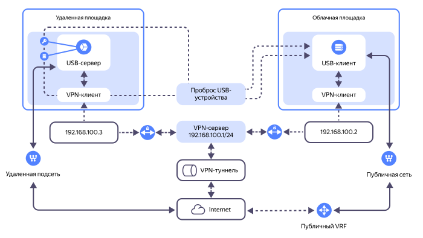

В данном руководстве вы настроите доставку USB-устройств на [сервер](../../baremetal/concepts/servers.md) {{ baremetal-full-name }} через [VPN-подключение](../../glossary/vpn.md) поверх публичного сегмента сети интернет. Для этого вы используете технологию _USB over IP_ и свободно распространяемое программное обеспечение в составе дистрибутивов [Linux](https://ru.wikipedia.org/wiki/Linux).



Аналогичным образом USB-устройства можно доставить на [виртуальную машину](../../compute/concepts/vm.md) {{ compute-full-name }}.



Технология USB over IP позволяет передавать данные USB-устройств по сети (локальной или интернет) так, как если бы они были подключены к компьютеру-клиенту напрямую. Это особенно важно в ситуациях, когда физическое подключение USB-устройств к компьютеру затруднено или невозможно.

С помощью технологии USB over IP:
* USB-устройства можно доставлять в облачные сервисы, а клиентами в отношении удаленных USB-устройств могут выступать виртуальные машины {{ compute-name }} или серверы {{ baremetal-name }}.
* К ВМ и серверам можно подключать удаленные принтеры, сканеры, камеры, аппаратные токены, флеш-накопители и другие периферийные USB-устройства.
* Для доставки USB-устройств можно использовать как специализированные [ПАК решения](https://ru.wikipedia.org/wiki/Программно-аппаратный_комплекс), так и свободно распространяемое программное обеспечение.
* Ключи, токены, смарт-карты, доставляемые на серверы и ВМ, могут размещаться в контролируемом периметре с ограниченным доступом.
* Подключение к удаленным USB-устройствам может быть ограничено стандартными средствами сетевой безопасности.



Если на удаленное USB-устройство будут выполняться операции записи, то использование технологии USB over IP требует высокой степени надежности сети. Кроме того, эта технология не подходит для подключения USB-устройств, для которых необходима высокая скорость передачи данных.



Схема решения:



* **USB-клиент** на облачной площадке – виртуальная машина или физический сервер под управлением ОС Windows или Linux. В данном руководстве в качестве клиента будет использован физический сервер под управлением ОС Linux Ubuntu 24.04 LTS, арендованный в сервисе {{ baremetal-full-name }}.
* **USB-сервер** на удаленной площадке – устройство под управлением ОС Linux с подключением к локальной сети и VPN-доступом (если доставка данных USB-устройства осуществляется через интернет). В USB-порты USB-сервера будут физически вставляться USB-устройства. В качестве сервера могут использоваться микро-компьютеры, например [Raspberry Pi](https://ru.wikipedia.org/wiki/Raspberry_Pi). В данном руководстве в качестве сервера будет использован компьютер под управлением ОС Linux Ubuntu 22.04 LTS, оснащенный несколькими USB-портами.
* **Программное обеспечение**. В данном руководстве доставка USB-устройства на клиент будет осуществлена с помощью программы `usbip` с использованием стандартного набора системных утилит и модулей ядра, входящих в пакет `linux-tools`.
* **Подключаемое USB-оборудование**:
    * USB-накопитель с данными.
    * USB-токен.
* **Способ доставки по сети**. Доставка удаленных USB-устройств будет выполняться через VPN-подключение поверх публичного сегмента сети интернет с использованием решения [WireGuard](https://www.wireguard.com/). 

    Предлагаемая схема с использованием WireGuard носит демонстрационный характер, вы можете использовать любую другую технологию для связи удаленных серверов.

Чтобы доставить USB-устройства на сервер {{ baremetal-name }} с помощью технологии USB over IP:

1. [Подготовьте облако к работе](#before-you-begin).
1. [Настройте облачную сеть](#setup-vpc).
1. [Создайте виртуальную машину для VPN-сервера](#create-vpn-server).
1. [Создайте приватную подсеть {{ baremetal-name }}](#create-subnet).
1. [Арендуйте сервер {{ baremetal-name }}](#rent-server).
1. [Настройте VPN](#setup-vpn).
1. [Настройте USB over IP](#setup-usbip).
1. [Убедитесь в работоспособности решения](#test-solution).

Если созданные ресурсы вам больше не нужны, [удалите их](#clear-out).

## Перед началом работы {#before-you-begin}



### Необходимые платные ресурсы {#paid-resources}

В стоимость предлагаемого решения входят:

* плата за использование [публичного IP-адреса](../../vpc/concepts/address.md#public-addresses) виртуальной машины (см. [тарифы {{ vpc-full-name }}](../../vpc/pricing.md));
* плата за вычислительные ресурсы и диски [ВМ](../../compute/concepts/vm.md) (см. [тарифы {{ compute-full-name }}](../../compute/pricing.md));
* плата за аренду сервера {{ baremetal-name }} (см. [тарифы {{ baremetal-full-name }}](../../baremetal/pricing.md)).


## Настройте облачную сеть {#setup-vpc}

### Создайте облачную сеть и подсеть {#setup-network-and-subnet}

Создайте облачную сеть и подсеть, к которым будет подключена виртуальная машина {{ compute-name }} – сервер VPN.



- Консоль управления {#console} 

  1. В [консоли управления]({{ link-console-main }}) выберите каталог, в котором вы будете создавать облачную инфраструктуру.
  1. В списке сервисов выберите **{{ ui-key.yacloud.iam.folder.dashboard.label_vpc }}**.
  1. Создайте облачную сеть:

      1. Справа сверху нажмите **{{ ui-key.yacloud.vpc.networks.button_create }}**.
      1. В поле **{{ ui-key.yacloud.vpc.networks.create.field_name }}** укажите `sample-network`.
      1. В поле **{{ ui-key.yacloud.vpc.networks.create.field_advanced }}** отключите опцию **{{ ui-key.yacloud.vpc.networks.create.field_is-default }}**.
      1. Нажмите **{{ ui-key.yacloud.vpc.networks.button_create }}**.
  1. Создайте подсеть:

      1. На панели слева выберите  **{{ ui-key.yacloud.vpc.switch_networks }}**.
      1. Справа сверху нажмите **{{ ui-key.yacloud.vpc.subnetworks.button_action-create }}**.
      1. В поле **{{ ui-key.yacloud.vpc.subnetworks.create.field_name }}** укажите `subnet-{{ region-id }}-b`.
      1. В поле **{{ ui-key.yacloud.vpc.subnetworks.create.field_zone }}** выберите зону доступности `{{ region-id }}-b`.
      1. В поле **{{ ui-key.yacloud.vpc.subnetworks.create.field_network }}** выберите облачную сеть `sample-network`.
      1. В поле **{{ ui-key.yacloud.vpc.subnetworks.create.field_ip }}** укажите `192.168.11.0/24`.
      1. Нажмите **{{ ui-key.yacloud.vpc.subnetworks.create.button_create }}**.



### Создайте группу безопасности {#crete-sg}

Создайте [группу безопасности](../../vpc/concepts/security-groups.md) `vpn-sg` для виртуальной машины – сервера VPN.



- Консоль управления {#console}

  1. В [консоли управления]({{ link-console-main }}) выберите каталог, в котором вы создаете облачную инфраструктуру.
  1. В списке сервисов выберите **{{ ui-key.yacloud.iam.folder.dashboard.label_vpc }}**.
  1. На панели слева выберите  **{{ ui-key.yacloud.vpc.label_security-groups }}** и нажмите кнопку **{{ ui-key.yacloud.vpc.network.security-groups.button_create }}**.
  1. В поле **{{ ui-key.yacloud.vpc.network.security-groups.forms.field_sg-name }}** задайте имя `vpn-sg`.
  1. В поле **{{ ui-key.yacloud.vpc.network.security-groups.forms.field_sg-network }}** выберите созданную ранее сеть `sample-network`.
  1. В блоке **{{ ui-key.yacloud.vpc.network.security-groups.forms.label_section-rules }}** [создайте](../../vpc/operations/security-group-add-rule.md) следующие правила для управления трафиком:

      | Направление<br/>трафика | {{ ui-key.yacloud.vpc.network.security-groups.forms.field_sg-rule-description }} | {{ ui-key.yacloud.vpc.network.security-groups.forms.field_sg-rule-port-range }} | {{ ui-key.yacloud.vpc.network.security-groups.forms.field_sg-rule-protocol }} | {{ ui-key.yacloud.vpc.network.security-groups.forms.field_sg-rule-source }} /<br/>{{ ui-key.yacloud.vpc.network.security-groups.forms.field_sg-rule-destination }} | {{ ui-key.yacloud.vpc.network.security-groups.forms.field_sg-rule-cidr-blocks }} /<br/>{{ ui-key.yacloud.vpc.network.security-groups.forms.field_sg-rule-sg-type }} |
      | --- | --- | --- | --- | --- | --- |
      | Входящий | `ssh`            | `22`   | `TCP`  | `{{ ui-key.yacloud.vpc.network.security-groups.forms.value_sg-rule-destination-cidr }}` | `0.0.0.0/0` |
      | Входящий | `vpn`            | `63665`   | `UDP`  | `{{ ui-key.yacloud.vpc.network.security-groups.forms.value_sg-rule-destination-cidr }}` | `0.0.0.0/0` |
      | Исходящий | `any`           | `Весь` | `{{ ui-key.yacloud.vpc.network.security-groups.forms.value_any }}` | `{{ ui-key.yacloud.vpc.network.security-groups.forms.value_sg-rule-destination-cidr }}` | `0.0.0.0/0` |
  1. Нажмите **{{ ui-key.yacloud.common.create }}**.



## Создайте виртуальную машину для VPN-сервера {#create-vpn-server}



- Консоль управления {#console}

  1. В [консоли управления]({{ link-console-main }}) выберите каталог, в котором вы создаете инфраструктуру.
  1. В списке сервисов выберите **{{ ui-key.yacloud.iam.folder.dashboard.label_compute }}**.
  1. На панели слева выберите  **{{ ui-key.yacloud.compute.switch_instances }}** и нажмите кнопку **{{ ui-key.yacloud.compute.instances.button_create }}**.
  1. В блоке **{{ ui-key.yacloud.compute.instances.create.section_image }}** выберите образ [Ubuntu 24.04](/marketplace/products/yc/ubuntu-2404-lts-oslogin).
  1. В блоке **{{ ui-key.yacloud.k8s.node-groups.create.section_allocation-policy }}** выберите [зону доступности](../../overview/concepts/geo-scope.md) `{{ region-id }}-b`.
  1. В блоке **{{ ui-key.yacloud.compute.instances.create.section_network }}**:

      * В поле **{{ ui-key.yacloud.component.compute.network-select.field_subnetwork }}** выберите созданную ранее подсеть `subnet-{{ region-id }}-b`.
      * В поле **{{ ui-key.yacloud.component.compute.network-select.field_external }}** выберите `{{ ui-key.yacloud.component.compute.network-select.switch_auto }}`.
      * В поле **{{ ui-key.yacloud.component.compute.network-select.field_security-groups }}** выберите созданную ранее группу безопасности `vpn-sg`.

  1. В блоке **{{ ui-key.yacloud.compute.instances.create.section_access }}** выберите вариант **{{ ui-key.yacloud.compute.instance.access-method.label_oslogin-control-ssh-option-title }}** и укажите данные для доступа на ВМ:

      * В поле **{{ ui-key.yacloud.compute.instances.create.field_user }}** введите имя пользователя: `yc-user`.
      * 

  1. В блоке **{{ ui-key.yacloud.compute.instances.create.section_base }}** задайте имя ВМ: `wireguard-vpn-server`.
  1. Нажмите кнопку **{{ ui-key.yacloud.compute.instances.create.button_create }}**.





Чтобы VPN-соединение не перестало работать в случае остановки и повторного запуска VPN-сервера, [сделайте](../../vpc/operations/set-static-ip.md) IP-адрес вашего VPN-сервера статическим.




## Создайте приватную подсеть {{ baremetal-name }} {#create-subnet}



- Консоль управления {#console}

  1. В [консоли управления]({{ link-console-main }}) выберите каталог, в котором вы создаете облачную инфраструктуру.
  1. В списке сервисов выберите **{{ ui-key.yacloud.iam.folder.dashboard.label_baremetal }}**.
  1. На панели слева выберите  **{{ ui-key.yacloud.baremetal.label_subnetworks }}** и нажмите кнопку **{{ ui-key.yacloud.baremetal.label_create-subnetwork }}**.
  1. В поле **{{ ui-key.yacloud.baremetal.field_server-pool }}** выберите пул серверов `{{ region-id }}-m3`.
  1. В поле **{{ ui-key.yacloud.baremetal.field_name }}** задайте имя подсети: `subnet-m3`.
  1. Не включая опцию **{{ ui-key.yacloud.baremetal.title_routing-settings }}**, нажмите кнопку **{{ ui-key.yacloud.baremetal.label_create-subnetwork }}**.




## Арендуйте сервер {{ baremetal-name }} {#rent-server}



- Консоль управления {#console}

  1. В [консоли управления]({{ link-console-main }}) выберите каталог, в котором вы создаете облачную инфраструктуру.
  1. 
  1. В поле **{{ ui-key.yacloud.baremetal.field_server-pool }}** выберите пул серверов `{{ region-id }}-m3`.
  1. 
  1. 
  1. В блоке **{{ ui-key.yacloud.baremetal.title_section-server-product }}** выберите образ `Ubuntu 24.04`.  
  1. 
  1. В блоке **{{ ui-key.yacloud.baremetal.title_section-server-network-settings }}**:

     1. В поле **{{ ui-key.yacloud.baremetal.field_subnet-id }}** выберите созданную ранее подсеть `subnet-m3`.
     1. В поле **{{ ui-key.yacloud.baremetal.field_needed-public-ip }}** выберите `{{ ui-key.yacloud.baremetal.label_public-ip-ephemeral }}`.

  1. В блоке **{{ ui-key.yacloud.baremetal.title_server-access }}**:

      

  1. В блоке **{{ ui-key.yacloud.baremetal.title_section-server-info }}** в поле **{{ ui-key.yacloud.baremetal.field_name }}** задайте имя сервера: `my-usbip-client`.
  1. 





Подготовка сервера и установка на него операционной системы может занять до 45 минут — в это время сервер будет находиться в статусе `Provisioning`. После завершения установки ОС сервер перейдет в статус `Ready`.




## Настройте VPN {#setup-vpn}

Чтобы настроить доставку USB-устройств на сервер {{ baremetal-name }} с компьютера на удаленной площадке, организуйте VPN-подключение в составе VPN-сервера, развернутого на виртуальной машине {{ compute-name }}, и двух VPN-клиентов – на сервере {{ baremetal-name }} и на компьютере на удаленной площадке.

Для настройки VPN-подключения в данном руководстве будет использоваться решение с открытым исходным кодом [WireGuard](https://www.wireguard.com/). При этом вы можете организовать VPN-подключение с использованием других средств.



На стороне сервера должен быть открыт порт `TCP 3240`, трафик на который должен быть разрешен VPN-соединением.



### Настройте VPN-сервер {#vpn-server-setup}

1. [Подключитесь по SSH](../../compute/operations/vm-connect/ssh.md) к созданной ранее виртуальной машине `wireguard-vpn-server`.
1. 
1. 
1. Сгенерируйте ключи для шифрования VPN-трафика:

    ```bash
    wg genkey | sudo tee server_private.key | wg pubkey | sudo tee server_public.key > /dev/null
    wg genkey | sudo tee bms_private.key | wg pubkey | sudo tee bms_public.key > /dev/null
    wg genkey | sudo tee remote_private.key | wg pubkey | sudo tee remote_public.key > /dev/null
    ```

    В текущей директории созданы шесть файлов:

    * `server_private.key` – содержит закрытый ключ шифрования VPN-сервера.
    * `server_public.key` – содержит открытый ключ шифрования VPN-сервера.
    * `bms_private.key` – содержит закрытый ключ шифрования VPN-клиента – сервера {{ baremetal-name }}.
    * `bms_public.key` – содержит открытый ключ шифрования VPN-клиента – сервера {{ baremetal-name }}.
    * `remote_private.key` – содержит закрытый ключ шифрования VPN-клиента на удаленной площадке.
    * `remote_public.key` – содержит открытый ключ шифрования VPN-клиента на удаленной площадке.

    Сохраните значения всех ключей шифрования, они понадобятся при создании файлов конфигурации WireGuard на соответствующих машинах.
1. Создайте файл конфигурации WireGuard VPN-сервера:

    1. 
    1. Добавьте в файл следующую конфигурацию, указав содержимое полученных на предыдущем шаге ключей шифрования:

        ```text
        [Interface]
        Address = 192.168.100.1/24
        ListenPort = 63665
        PrivateKey = <содержимое_файла_server_private.key>

        [Peer]
        PublicKey = <содержимое_файла_bms_public.key>
        AllowedIPs = 192.168.100.2/32

        [Peer]
        PublicKey = <содержимое_файла_remote_public.key>
        AllowedIPs = 192.168.100.3/32
        ```
1. 

### Настройте VPN-клиенты {#vpn-client-setup}

1. [Подключитесь по SSH](../../compute/operations/vm-connect/ssh.md) к арендованному ранее серверу {{ baremetal-name }} `my-usbip-client`.
1. 
1. 
1. Создайте файл конфигурации WireGuard VPN-клиента:

    1. 
    1. Добавьте в файл следующую конфигурацию:

        ```text
        [Interface]
        PrivateKey = <содержимое_файла_bms_private.key>
        Address = 192.168.100.2/32

        [Peer]
        PublicKey = <содержимое_файла_server_public.key>
        Endpoint = <публичный_IP-адрес_ВМ>:63665
        AllowedIPs = 192.168.100.0/24
        PersistentKeepalive = 15
        ```

        Где:

        * `PrivateKey` – содержимое созданного при настройке VPN-сервера файла `bms_private.key` с закрытым ключом шифрования этого VPN-клиента.
        * `PublicKey` – содержимое созданного при настройке VPN-сервера файла `server_public.key` с открытым ключом шифрования VPN-сервера.
        * `<публичный_IP-адрес_ВМ>` – публичный IP-адрес виртуальной машины с развернутым VPN-сервером. Публичный IP-адрес ВМ можно узнать в [консоли управления]({{ link-console-main }}), в поле **{{ ui-key.yacloud.compute.instance.overview.label_public-ipv4 }}** блока **{{ ui-key.yacloud.compute.instance.overview.section_network }}** на странице с информацией о ВМ.
1. Запустите WireGuard:

    ```bash
    sudo wg-quick up wg0
    ```

    Результат:

    ```text
    [#] ip link add wg0 type wireguard
    [#] wg setconf wg0 /dev/fd/63
    [#] ip -4 address add 192.168.100.2/32 dev wg0
    [#] ip link set mtu 1420 up dev wg0
    [#] ip -4 route add 192.168.100.0/24 dev wg0
    ```
1. Аналогичным образом настройте VPN-клиент WireGuard на компьютере на удаленной площадке, при этом в файле конфигурации WireGuard `wg0.conf` в поле `PrivateKey` укажите содержимое созданного при настройке VPN-сервера файла `remote_private.key` с закрытым ключом шифрования VPN-клиента на удаленной площадке.

### Проверьте работу VPN-соединения {#check-vpn}

На этом этапе VPN-соединение установлено. Чтобы проверить его работу:

1. [Подключитесь по SSH](../../compute/operations/vm-connect/ssh.md) к серверу {{ baremetal-name }} `my-usbip-client` и выполните команду:

    ```bash
    ping 192.168.100.3 -c 5
    ```

    Результат:

    ```text
    PING 192.168.100.3 (192.168.100.3) 56(84) bytes of data.
    64 bytes from 192.168.100.3: icmp_seq=1 ttl=63 time=29.9 ms
    64 bytes from 192.168.100.3: icmp_seq=2 ttl=63 time=30.9 ms
    64 bytes from 192.168.100.3: icmp_seq=3 ttl=63 time=35.5 ms
    64 bytes from 192.168.100.3: icmp_seq=4 ttl=63 time=30.5 ms
    64 bytes from 192.168.100.3: icmp_seq=5 ttl=63 time=28.2 ms

    --- 192.168.100.3 ping statistics ---
    5 packets transmitted, 5 received, 0% packet loss, time 4005ms
    rtt min/avg/max/mdev = 28.249/30.987/35.453/2.405 ms
    ```

    Сетевая связность между VPN-клиентами установлена, пакеты проходят без потерь.
1. В терминале компьютера на удаленной площадке выполните команду:

    ```bash
    ping 192.168.100.2 -c 5
    ```

    Результат:

    ```text
    PING 192.168.100.2 (192.168.100.2) 56(84) bytes of data.
    64 bytes from 192.168.100.2: icmp_seq=1 ttl=63 time=30.2 ms
    64 bytes from 192.168.100.2: icmp_seq=2 ttl=63 time=28.4 ms
    64 bytes from 192.168.100.2: icmp_seq=3 ttl=63 time=31.6 ms
    64 bytes from 192.168.100.2: icmp_seq=4 ttl=63 time=27.4 ms
    64 bytes from 192.168.100.2: icmp_seq=5 ttl=63 time=27.6 ms

    --- 192.168.100.2 ping statistics ---
    5 packets transmitted, 5 received, 0% packet loss, time 4007ms
    rtt min/avg/max/mdev = 27.381/29.041/31.600/1.608 ms
    ```

    Сетевая связность между VPN-клиентами установлена, пакеты проходят без потерь.


## Настройте USB over IP {#setup-usbip}

Доставка USB-устройства на сервер {{ baremetal-name }} будет осуществлена с помощью программы `usbip`.

### Настройте usbip-сервер {#setup-usbip-server}

В качестве usbip-сервера будет выступать компьютер на удаленной площадке, оснащенный несколькими USB-портами. В терминале этого компьютера:

1. 
1. 

    

    Чтобы настроить автоматическую загрузку этих модулей при запуске системы, откройте файл `/etc/modules-load.d/modules.conf` в любом текстовом редакторе и добавьте в него строки:

    ```
    usbip-core
    usbip-host
    vhci-hcd
    ```

    

1. Вставьте USB-устройства в порты компьютера.

    В данном руководстве в качестве примера будут использоваться [USB-флеш-накопитель](https://ru.wikipedia.org/wiki/USB-флеш-накопитель) и USB-устройство [YubiKey](https://developers.yubico.com/Passkeys/).
1. Запросите список доступных для публикации USB-устройств:

    ```bash
    sudo usbip list -l
    ```

    Результат:

    ```text
    - busid 1-1.2 (0951:1666)
      Kingston Technology : DataTraveler 100 G3/G4/SE9 G2/50 (0951:1666)

    - busid 1-1.3 (058f:a001)
      Alcor Micro Corp. : unknown product (058f:a001)

    - busid 1-1.4 (0cf3:3005)
      Qualcomm Atheros Communications : AR3011 Bluetooth (0cf3:3005)

    - busid 1-1.5 (1050:0407)
      Yubico.com : Yubikey 4/5 OTP+U2F+CCID (1050:0407)

    - busid 2-1.1 (0458:6001)
      KYE Systems Corp. (Mouse Systems) : GF3000F Ethernet Adapter (0458:6001)
    ```
1. Опубликуйте устройства с `busid 1-1.2` и `busid 1-1.5`:

    ```bash
    sudo usbip bind -b 1-1.2
    sudo usbip bind -b 1-1.5
    ```

    Результат:

    ```text
    usbip: info: bind device on busid 1-1.2: complete
    usbip: info: bind device on busid 1-1.5: complete
    ```
1. Запустите демон `usbipd`:

    ```bash
    sudo usbipd -4 -D
    ```

На этом этапе выбранные USB-устройства опубликованы и доступны для импорта по сети на стороне usbip-клиента.

### Настройте usbip-клиент {#setup-usbip-client}

В качестве usbip-клиента будет выступать сервер {{ baremetal-name }} `my-usbip-client`.

1. [Подключитесь по SSH](../../compute/operations/vm-connect/ssh.md) к серверу {{ baremetal-name }} `my-usbip-client`.
1. 

    

    Если в качестве usbip-клиента вы используете виртуальную машину {{ compute-full-name }}, дополнительно установите пакет `linux-image-extra-virtual`:

    ```bash
    sudo apt install linux-image-extra-virtual
    ```

    

1. 
1. Запросите список доступных для импорта с usbip-сервера USB-устройств:

    ```bash
    usbip list -r 192.168.100.3
    ```

    Результат:

    ```text
    Exportable USB devices
    ======================
    - 192.168.100.3
          1-1.5: Yubico.com : Yubikey 4/5 OTP+U2F+CCID (1050:0407)
              : /sys/devices/platform/vhci_hcd.0/usb1/1-1/1-1.5
              : (Defined at Interface level) (00/00/00)

          1-1.2: Kingston Technology : DataTraveler 100 G3/G4/SE9 G2/50 (0951:1666)
              : /sys/devices/pci0000:00/0000:00:1a.0/usb1/1-1/1-1.2
              : (Defined at Interface level) (00/00/00)
    ```
1. Импортируйте устройства с usbip-клиента:

    ```bash
    usbip attach -r 192.168.100.3 -b 1-1.2
    usbip attach -r 192.168.100.3 -b 1-1.5
    ```

На этом этапе выбранные USB-устройства импортированы по сети на сервер {{ baremetal-name }}.

## Убедитесь в работоспособности решения {#test-solution}

Чтобы проверить подключение к удаленным USB-устройствам, подключитесь по SSH к серверу {{ baremetal-name }} `my-usbip-client` и выполните в терминале несколько проверочных действий:

1. Выполните команду, чтобы посмотреть журнал `dmesg`:

    ```bash
    dmesg
    ```

    Результат:

    

    - Флеш-накопитель {#flash-drive}

      ```text
      ...
      [522540.280156] vhci_hcd vhci_hcd.0: pdev(0) rhport(0) sockfd(3)
      [522540.280165] vhci_hcd vhci_hcd.0: devid(65539) speed(3) speed_str(high-speed)
      [522540.280177] vhci_hcd vhci_hcd.0: Device attached
      [522540.500110] usb 3-1: new high-speed USB device number 2 using vhci_hcd
      [522540.618122] usb 3-1: SetAddress Request (2) to port 0
      [522540.671557] usb 3-1: New USB device found, idVendor=0951, idProduct=1666, bcdDevice= 0.01
      [522540.671571] usb 3-1: New USB device strings: Mfr=1, Product=2, SerialNumber=3
      [522540.671577] usb 3-1: Product: DataTraveler 3.0
      [522540.671581] usb 3-1: Manufacturer: Kingston
      [522540.671585] usb 3-1: SerialNumber: D067E5162216F1B14605943F
      [522540.690082] usb-storage 3-1:1.0: USB Mass Storage device detected
      [522540.690801] scsi host7: usb-storage 3-1:1.0
      [522540.691020] usbcore: registered new interface driver usb-storage
      [522540.694262] usbcore: registered new interface driver uas
      [522541.728481] scsi 7:0:0:0: Direct-Access     Kingston DataTraveler 3.0      PQ: 0 ANSI: 6
      [522541.729122] sd 7:0:0:0: Attached scsi generic sg2 type 0
      [522541.763235] sd 7:0:0:0: [sdc] 15109516 512-byte logical blocks: (7.74 GB/7.20 GiB)
      [522541.775808] sd 7:0:0:0: [sdc] Write Protect is off
      [522541.775829] sd 7:0:0:0: [sdc] Mode Sense: 4f 00 00 00
      [522541.788402] sd 7:0:0:0: [sdc] Write cache: disabled, read cache: enabled, doesn't support DPO or FUA
      [522541.890019]  sdc: sdc1
      [522541.890454] sd 7:0:0:0: [sdc] Attached SCSI removable disk
      ...
      ```

      На стороне сервера было смонтировано и отдано в удаленный доступ USB-устройство производителя `Kingston`, которое является блочным флеш-накопителем. Устройство было распознано как `/dev/sdc`.

    - Устройство YubiKey {#yubikey}

      ```text
      ...
      [1039400.471187] vhci_hcd vhci_hcd.0: pdev(0) rhport(1) sockfd(3)
      [1039400.471211] vhci_hcd vhci_hcd.0: devid(65540) speed(2) speed_str(full-speed)
      [1039400.471223] vhci_hcd vhci_hcd.0: Device attached
      [1039400.640976] vhci_hcd: vhci_device speed not set
      [1039400.697969] usb 3-2: new full-speed USB device number 4 using vhci_hcd
      [1039400.763979] vhci_hcd: vhci_device speed not set
      [1039400.820985] usb 3-2: SetAddress Request (4) to port 1
      [1039400.872797] usb 3-2: New USB device found, idVendor=1050, idProduct=0407, bcdDevice= 5.43
      [1039400.872812] usb 3-2: New USB device strings: Mfr=1, Product=2, SerialNumber=0
      [1039400.872818] usb 3-2: Product: YubiKey OTP+FIDO+CCID
      [1039400.872822] usb 3-2: Manufacturer: Yubico
      [1039400.894510] input: Yubico YubiKey OTP+FIDO+CCID as /devices/platform/vhci_hcd.0/usb3/3-2/3-2:1.0/0003:1050:0407.0003/input/input7
      [1039400.977251] hid-generic 0003:1050:0407.0003: input,hidraw2: USB HID v1.10 Keyboard [Yubico YubiKey OTP+FIDO+CCID] on usb-vhci_hcd.0-2/input0
      [1039400.987196] hid-generic 0003:1050:0407.0004: hiddev0,hidraw3: USB HID v1.10 Device [Yubico YubiKey OTP+FIDO+CCID] on usb-vhci_hcd.0-2/input1
      ...
      ```

      На стороне сервера было смонтировано и отдано в удаленный доступ USB-устройство производителя `Yubico`.

    

1. Убедитесь в наличии доступа к данным на удаленных USB-устройствах:

    

    - Флеш-накопитель {#flash-drive}

      1. Получите информацию о блочных устройствах сервера {{ baremetal-name }}:

          ```bash
          lsblk /dev/sdc
          ```

          Результат:

          ```text
          NAME   MAJ:MIN RM  SIZE RO TYPE MOUNTPOINTS
          ...
          sdc      8:32   1  7.2G  0 disk 
          └─sdc1   8:33   1  7.2G  0 part
          ```
      1. Смонтируйте раздел флеш-накопителя `/dev/sdc1` в директорию `/mnt/sdc1`:

          ```bash
          mkdir -p /mnt/sdc1
          mount /dev/sdc1 /mnt/sdc1
          ```
      1. Посмотрите список смонтированных устройств и доступное для записи дисковое пространство:

          ```bash
          df -h
          ```

          Результат:

          ```text
          Filesystem      Size  Used Avail Use% Mounted on
          ...
          /dev/sdc1       7.2G   16K  7.2G   1% /mnt/sdc1
          ```
      1. Скопируйте файл конфигурации WireGuard на удаленный USB-накопитель:

          ```bash
          cp -r /etc/wireguard /mnt/sdc1
          ```
      1. Просмотрите список файлов на удаленном USB-накопителе:

          ```bash
          ls -la /mnt/sdc1/wireguard/
          ```

          Результат:

          ```text
          total 48
          drwxr-xr-x 2 root root 16384 Apr 20 19:46 .
          drwxr-xr-x 4 root root 16384 Jan  1  1970 ..
          -rwxr-xr-x 1 root root   247 Apr 20 19:46 wg0.conf
          ```

      Проверка завершена: файл успешно скопирован на удаленный USB-накопитель.

    - Устройство YubiKey {#yubikey}

      1. Установите набор утилит, необходимых для работы с аппаратным токеном YubiKey:

          ```bash
          apt install yubico-piv-tool
          ```
      1. Выполните запрос статуса оборудования Yubico:

          ```bash
          yubico-piv-tool -a status
          ```

          Результат:

          ```text
          Version:        5.4.3
          Serial Number:  ********
          CHUID:  No data available
          CCC:    No data available
          Slot 9c:
                  Algorithm:      RSA2048
                  Subject DN:     CN=5-ay-yubi
                  Issuer DN:      CN=ChangeMe
                  Fingerprint:    15e4ec25********************************************************
                  Not Before:     Feb 19 08:29:13 2025 GMT
                  Not After:      Feb 16 08:29:13 2035 GMT
          PIN tries left: 3
          ```
      1. Получите открытый сертификат клиента из хранилища аппаратного токена Yubico, указав в параметре `-s` значение поля `Slot` из вывода предыдущей команды:

          ```bash
          yubico-piv-tool -a read-cert -s 9c
          ```

          Результат:

          ```text
          -----BEGIN CERTIFICATE-----
          MIIDUjCCA*******************************************************
          ****************************************************************
          ****************************************************************
          ****************************************************************
          ****************************************************************
          ****************************************************************
          ****************************************************************
          ****************************************************************
          ****************************************************************
          ****************************************************************
          ****************************************************************
          ****************************************************************
          ****************************************************************
          ****************************************************************
          ****************************************************************
          ****************************************************************
          ****************************************************************
          ***************************************t7Ts9P8CTUsyw=
          -----END CERTIFICATE-----
          ```

      Проверка завершена: оборудование Yubico возвращает корректный статус, данные сертификата из хранилища токена считываются без ошибок.

    


## Как удалить созданные ресурсы {#clear-out}

Чтобы перестать платить за созданные ресурсы:

1. [Удалите](../../compute/operations/vm-control/vm-delete.md) виртуальную машину.
1. Удалить сервер {{ baremetal-name }} нельзя. Вместо этого [откажитесь](../../baremetal/operations/servers/server-lease-cancel.md) от продления аренды сервера.