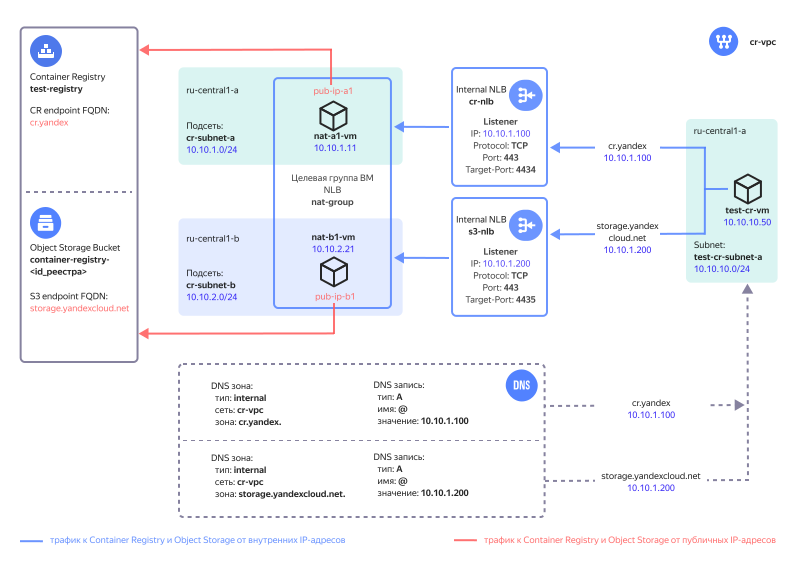

# Подключение к {{ container-registry-name }} из {{ vpc-name }}


Для работы с [{{ container-registry-name }}](../../container-registry/) облачным ресурсам требуется доступ в интернет. С помощью руководства вы развернете в {{ yandex-cloud }} облачную инфраструктуру для организации доступа к {{ container-registry-name }} для ресурсов, которые размещены в облачной сети [{{ vpc-name }}](../../vpc/concepts/) и не имеют публичных IP-адресов или выхода в интернет через [NAT-шлюз](../../vpc/concepts/gateways).

{{ container-registry-short-name }} для хранения Docker-образов в реестре использует [{{ objstorage-name }}](../../storage/). В этом решении также организован доступ к {{ objstorage-name }} для ресурсов в {{ vpc-name }}.

Схема решения представлена ниже.



После развертывания решения в {{ yandex-cloud }} будут созданы следующие ресурсы:

| Название | Описание |
| ---- | ---- |
| `cr-vpc` `*` | Облачная сеть с ресурсами, для которых организуется доступ к {{ container-registry-name }}. |
| `cr-nlb` | Внутренний сетевой балансировщик обеспечивает прием трафика к {{ container-registry-name }}. Балансировщик принимает TCP трафик с портом назначения 443 и распределяет его по ресурсам (ВМ) в целевой группе. |
| `nat-group` | Целевая группа балансировщиков с виртуальными машинами, на которых включена функция NAT. |
| `s3-nlb` | Внутренний сетевой балансировщик обеспечивает прием трафика к {{ objstorage-name }}. Балансировщик принимает TCP трафик с портом назначения 443 и распределяет его по ресурсам (ВМ) в целевой группе. |
| `nat-a1-vm`, `nat-b1-vm` | Виртуальные машины с NAT в зонах `{{ region-id }}-a` и `{{ region-id }}-b` для передачи трафика к {{ container-registry-name }} и {{ objstorage-name }} с трансляцией IP-адресов источников и получателей трафика, а также для передачи обратного трафика. | 
| `pub-ip-a1`, `pub-ip-b1` | Публичные IP-адреса ВМ, в которые облачная сеть VPC транслирует их внутренние IP-адреса. | 
| `DNS зоны и A-записи` | Внутренние DNS зоны `{{ s3-storage-host }}.` и `{{ registry }}.` в сети `cr-vpc` с ресурсными `A` записями, сопоставляющими доменные имена с IP-адресами внутренних сетевых балансировщиков. |
| `test-registry` | Реестр в {{ container-registry-name }}. |
| `container-registry-<id_реестра>` | Имя бакета в {{ objstorage-name }} для хранения Docker-образов, где `<id_реестра>` – идентификатор реестра. Сервис {{ container-registry-name }} автоматически создает в {{ objstorage-name }} бакет для реестра. |
| `cr-subnet-a`, `cr-subnet-b` | Облачные подсети для размещения ВМ с NAT в зонах `{{ region-id }}-a` и `{{ region-id }}-b`. |
| `test-cr-vm` | Тестовая ВМ для проверки доступа к {{ container-registry-name }}. |
| `test-cr-subnet-a` | Облачная подсеть для размещения тестовой ВМ. |

`*` *При развертывании можно также указать существующую облачную сеть*

Для облачной сети с размещаемыми ресурсами в сервисе [{{ dns-name }}](../../dns/concepts/) создаются внутренние DNS-зоны:
* `{{registry}}.` и ресурсная запись типа A, сопоставляющая доменное имя `{{ registry }}` сервиса {{ container-registry-name }} с IP-адресом [внутреннего сетевого балансировщика](../../network-load-balancer/concepts/nlb-types) `cr-nlb`. 
* `{{ s3-storage-host }}.` и ресурсная запись типа A, сопоставляющая доменное имя `{{ s3-storage-host }}` сервиса {{ objstorage-short-name }} с IP-адресом внутреннего сетевого балансировщика `s3-nlb`. 

Благодаря этим записям трафик от облачных ресурсов к {{ container-registry-short-name }} и {{ objstorage-short-name }} будет направляться на внутренние балансировщики, которые будут распределять нагрузку по виртуальным машинам с NAT.

Для развертывания ВМ с NAT используется [образ из Marketplace](/marketplace/products/yc/nat-instance-ubuntu-22-04-lts), который транслирует IP-адреса источника и назначения, чтобы обеспечить маршрутизацию трафика до публичных IP-адресов {{ container-registry-short-name }} и {{ objstorage-short-name }}.

Разместив ВМ с NAT в нескольких [зонах доступности](../../overview/concepts/geo-scope), можно получить отказоустойчивость доступа к {{ container-registry-short-name }}. Увеличивая количество ВМ с NAT, можно масштабировать решение при возрастании нагрузки. При расчете количества ВМ с NAT следует учитывать [локальность при обработке трафика внутренним балансировщиком](../../network-load-balancer/concepts/specifics#nlb-int-locality). 

Доступ к реестру открыт только для облачных ресурсов, использующих данное решение. [Политика доступа для реестра](../../container-registry/operations/registry/registry-access) разрешает действия с реестром только с публичных IP-адресов ВМ с NAT. Доступ к реестру с других IP-адресов запрещен. При необходимости это ограничение можно отключить с помощью параметра в {{ TF }}.

Более подробное описание приведено в [репозитории проекта](https://github.com/yandex-cloud-examples/yc-cr-private-endpoint). 

Чтобы развернуть облачную инфраструктуру для организации доступа к {{ container-registry-short-name }} для ресурсов, которые размещены в облачной сети {{ vpc-short-name }}:

1. [Подготовьте облако к работе](#prepare-cloud).
1. [Настройте профиль CLI](#setup-profile).
1. [Подготовьте окружение](#prepare-environment).
1. [Разверните ресурсы](#create-resources).
1. [Протестируйте работоспособность решения](#test-functionality).
1. [Рекомендации по развертыванию решения в продуктивной среде](#deployment-requirements)

Если созданные ресурсы вам больше не нужны, [удалите их](#clear-out).

## Подготовьте облако к работе {#prepare-cloud}




### Необходимые платные ресурсы {#paid-resources}

В стоимость поддержки инфраструктуры входит:

* плата за постоянно работающие ВМ (см. [тарифы {{ compute-full-name }}](../../compute/pricing.md));
* плата за использование {{ network-load-balancer-name }} (см. [тарифы {{ network-load-balancer-full-name }}](../../network-load-balancer/pricing.md));
* плата за хранение загруженных Docker-образов (см. [тарифы {{ container-registry-name }}](../../container-registry/pricing.md));
* плата за использование публичных IP-адресов и исходящий трафик (см. [тарифы {{ vpc-full-name }}](../../vpc/pricing.md)).


### Необходимые квоты {#required-quotes}

Убедитесь, что в облаке достаточно [квот](../../overview/concepts/quotas-limits.md) и они не заняты ресурсами для других задач.



| Ресурс | Количество |
| ----------- | ----------- |
| Виртуальные машины | 3 |
| vCPU виртуальных машин | 6 |
| RAM виртуальных машин | 6 ГБ |
| Диски | 3 |
| Объем HDD дисков | 30 ГБ |
| Объем SSD дисков | 20 ГБ |
| Сетевой балансировщик | 2 |
| Целевая группа для балансировщика | 1 |
| Сети | 1`*` |
| Подсети | 3 |
| Статические публичные IP-адреса | 2 |
| Группы безопасности | 1 |
| Зона DNS | 2 |
| Реестр | 1 |  
| Сервисный аккаунт | 1 |

`*` *Если в `terraform.tfvars` не указать идентификатор существующей сети.*



## Настройте профиль CLI {#setup-profile}

1. Если у вас еще нет интерфейса командной строки {{ yandex-cloud }}, [установите](../../cli/quickstart.md) его и авторизуйтесь от имени пользователя.
1. Создайте сервисный аккаунт:
   
   

   - Консоль управления {#console}

      1. В [консоли управления]({{ link-console-main }}) выберите каталог, в котором хотите создать сервисный аккаунт.
      1. На вкладке **{{ ui-key.yacloud.iam.folder.switch_service-accounts }}** нажмите кнопку **{{ ui-key.yacloud.iam.folder.service-accounts.button_add }}**.
      1. Введите имя сервисного аккаунта, например, `sa-terraform`.
      1. Нажмите кнопку **{{ ui-key.yacloud.iam.folder.service-account.popup-robot_button_add }}**.

   - CLI {#cli}

      

      Выполните команду для создания сервисного аккаунта, указав имя `sa-terraform`:

      ```bash
      yc iam service-account create --name sa-terraform
      ```

      Где `name` — имя сервисного аккаунта.

      Результат:
      ```yaml
      id: ajehr0to1g8b********
      folder_id: b1gv87ssvu49********
      created_at: "2023-06-20T09:03:11.665153755Z"
      name: sa-terraform
      ```

   - API {#api}

      Чтобы создать сервисный аккаунт, воспользуйтесь методом [ServiceAccountService/Create](../../iam/api-ref/grpc/service_account_service.md#Create) gRPC API или методом [create](../../iam/api-ref/ServiceAccount/create.md) для ресурса `ServiceAccount` REST API.

   

1. Назначьте сервисному аккаунту [роль](../../iam/concepts/access-control/roles.md) администратора на каталог: 

   

   - Консоль управления {#console}

      1. На [стартовой странице]({{ link-console-main }}) консоли управления выберите каталог.
      1. Перейдите на вкладку **{{ ui-key.yacloud.common.resource-acl.label_access-bindings }}**.
      1. Найдите аккаунт `sa-terraform` в списке и нажмите значок .
      1. Нажмите кнопку **{{ ui-key.yacloud.common.resource-acl.button_assign-binding }}**.
      1. В открывшемся диалоге нажмите кнопку **{{ ui-key.yacloud_components.acl.button.add-role }}** и выберите роль `admin`.

   - CLI {#cli}

      Выполните команду:
      ```
      yc resource-manager folder add-access-binding <идентификатор_каталога> \
         --role admin \
         --subject serviceAccount:<идентификатор_сервисного_аккаунта>
      ```

   - API {#api}

      Чтобы назначить сервисному аккаунту роль на каталог, воспользуйтесь методом REST API [setAccessBindings](../../iam/api-ref/ServiceAccount/setAccessBindings.md) для ресурса [ServiceAccount](../../iam/api-ref/ServiceAccount/index.md) или вызовом gRPC API [ServiceAccountService/SetAccessBindings](../../iam/api-ref/grpc/service_account_service.md#SetAccessBindings).

   

1. Настройте профиль CLI для выполнения операций от имени сервисного аккаунта:

   

   - CLI {#cli}

      1. Создайте [авторизованный ключ](../../iam/concepts/authorization/key.md) для сервисного аккаунта и запишите его в файл:
         ```
         yc iam key create \
         --service-account-id <идентификатор_сервисного_аккаунта> \
         --folder-id <id_каталога_с_сервисным_аккаунтом> \
         --output key.json
         ```
         Где:
         * `service-account-id` — идентификатор сервисного аккаунта.
         * `folder-id` — идентификатор каталога, в котором создан сервисный аккаунт.
         * `output` — имя файла с авторизованным ключом.

         Результат:
         ```
         id: aje8nn871qo4********
         service_account_id: ajehr0to1g8b********
         created_at: "2023-06-20T09:16:43.479156798Z"
         key_algorithm: RSA_2048
         ```

      1. Создайте профиль CLI для выполнения операций от имени сервисного аккаунта:
         ```
         yc config profile create sa-terraform
         ```

         Результат:
         ```
         Profile 'sa-terraform' created and activated
         ```

      1. Задайте конфигурацию профиля:
         ```
         yc config set service-account-key key.json
         yc config set cloud-id <идентификатор_облака>
         yc config set folder-id <идентификатор_каталога>  
         ```

         Где:
         * `service-account-key` — файл с авторизованным ключом сервисного аккаунта.
         * `cloud-id` — [идентификатор облака](../../resource-manager/operations/cloud/get-id.md).
         * `folder-id` — [идентификатор каталога](../../resource-manager/operations/folder/get-id.md).

      1. Добавьте аутентификационные данные в переменные окружения:
         ```
         export YC_TOKEN=$(yc iam create-token)
         ```

   

## Подготовьте окружение {#prepare-environment}

### Установите необходимые утилиты {#install-utilities}

1. Установите [Git](https://ru.wikipedia.org/wiki/Git) с помощью команды:

   ```bash
   sudo apt install git
   ```

1. [Установите {{ TF }}](../../tutorials/infrastructure-management/terraform-quickstart.md#install-terraform).

## Разверните ресурсы {#create-resources}

1. Клонируйте [репозиторий](https://github.com/yandex-cloud-examples/yc-cr-private-endpoint/) из GitHub и перейдите в папку сценария `yc-cr-private-endpoint`:
   
   ```bash
   git clone https://github.com/yandex-cloud-examples/yc-cr-private-endpoint.git
   cd yc-cr-private-endpoint
   ```

1. Откройте файл `terraform.tfvars` и отредактируйте:

   1. Строку, содержащую идентификатор каталога:
      
      ```text
      folder_id = "<идентификатор_каталога>"
      ```

   1. Строку, содержащую список агрегированных префиксов облачных подсетей, для которых разрешен доступ к {{ container-registry-short-name }}:
      
      ```text
      trusted_cloud_nets = ["10.0.0.0/8", "192.168.0.0/16"]
      ```

   

   | Название<br>параметра | Нужно<br>изменение | Описание | Тип | Пример |
   | --- | --- | --- | --- | --- |
   | `folder_id` | да | ID каталога для размещения компонентов решения. | `string` | `b1gentmqf1ve9uc54nfh` |
   | `vpc_id` | - | ID облачной сети, для которой организуется доступ к {{container-registry-short-name}}. Если не указано, то сеть будет создана. | `string` | `enp48c1ndilt42veuw4x` |
   | `yc_availability_zones` | - | Список [зон доступности](../../overview/concepts/geo-scope) для развертывания ВМ с NAT.  | `list(string)` | `["{{ region-id }}-a", "{{ region-id }}-b"]` |
   | `subnet_prefix_list` | - | Список префиксов облачных подсетей для размещения ВМ с NAT (по одной подсети в каждой зоне доступности из списка `yc_availability_zones`, перечисленных в том же порядке). | `list(string)` | `["10.10.1.0/24", "10.10.2.0/24"]` |
   | `nat_instances_count` | - | Количество разворачиваемых ВМ с NAT. Рекомендуется указывать четное число для равномерного распределения ВМ по зонам доступности. | `number` | `2` |
   | `registry_private_access` | - | Ограничить доступ к реестру только с публичных IP-адресов ВМ с NAT. Используется значение `true` для ограничения, `false` для отмены ограничения. | `bool` | `true` |
   | `trusted_cloud_nets` | да | Список агрегированных префиксов облачных подсетей, для которых разрешен доступ к {{ container-registry-short-name }}. Используется во входящем правиле групп безопасности для ВМ с NAT.  | `list(string)` | `["10.0.0.0/8", "192.168.0.0/16"]` |
   | `vm_username` | - | Имя пользователя для ВМ с NAT и тестовой ВМ. | `string` | `admin` |
   | `cr_ip` | - | Публичный IP-адрес сервиса {{ container-registry-short-name }}. | `string` | `84.201.171.239` |
   | `cr_fqdn` | - | Доменное имя сервиса {{ container-registry-short-name }}. | `string` | `{{registry}}` | 
   | `s3_ip` | - | Публичный IP-адрес сервиса {{ objstorage-short-name }}. | `string` | `213.180.193.243` |
   | `s3_fqdn` | - | Доменное имя сервиса {{ objstorage-short-name }}. | `string` | `{{ s3-storage-host }}` |

   

1. Разверните ресурсы в облаке с помощью {{ TF }}:

   1. Выполните инициализацию {{ TF }}:
       
      ```bash
      terraform init
      ```

   1. Проверьте конфигурацию {{ TF }} файлов:
       
      ```bash
      terraform validate
      ```

   1. Проверьте список создаваемых облачных ресурсов:
       
      ```bash
      terraform plan
      ```

   1. Создайте ресурсы:
       
      ```bash
      terraform apply
      ```

1. После завершения процесса `terraform apply` в командной строке будет выведена информация для подключения к тестовой ВМ и тестирования работы с {{ container-registry-short-name }}. В дальнейшем его можно будет посмотреть с помощью команды `terraform output`:

   

   | Название | Описание | Пример значения |
   | ----------- | ----------- | ----------- |
   | `cr_nlb_ip_address` | IP-адрес внутреннего балансировщика для {{ container-registry-short-name }}. | `10.10.1.100` |
   | `cr_registry_id` | Идентификатор реестра в {{ container-registry-short-name }}. | `crp1r4h00mj*********` |
   | `path_for_private_ssh_key` | Файл с приватным ключом для подключения по протоколу SSH к ВМ с NAT и тестовой ВМ. | `./pt_key.pem` |
   | `s3_nlb_ip_address` | IP-адрес внутреннего балансировщика для {{ objstorage-short-name }}. | `10.10.1.200` |
   | `test_vm_password` | Пароль пользователя `admin` для тестовой ВМ. | `v3RСqUrQN?x)` |
   | `vm_username` | Имя пользователя для ВМ с NAT и тестовой ВМ. | `admin` |
   
   

## Протестируйте работоспособность решения {#test-functionality}

1. В [консоли управления]({{ link-console-main }}) перейдите в каталог, в котором ранее были созданы ресурсы.

1. Выберите сервис **{{ compute-name }}**.

1. В списке виртуальных машин выберите ВМ `test-cr-vm`.

1. Перейдите на вкладку **{{ ui-key.yacloud.compute.instance.switch_console }}**.

1. Нажмите кнопку **{{ ui-key.yacloud.compute.instance.console.connect }}**.

1. Введите логин `admin` и пароль из вывода команды `terraform output test_vm_password` (укажите значение без кавычек).

1. Выполните команду:

   ```bash
   dig {{registry}} {{ s3-storage-host }}
   ```

1. Убедитесь, что в ответе от DNS-сервера доменному имени сервиса {{ objstorage-name }} и {{ container-registry-name }} соответствуют IP-адреса внутренних балансировщиков. Результат вывода ресурсных записей типа `A`:

   ```text
   ;; ANSWER SECTION:
   {{registry}}.               300    IN      A       10.10.1.100
   
   ;; ANSWER SECTION:
   {{ s3-storage-host }}. 300    IN      A       10.10.1.200
   ```

1. Посмотрите список доступных для загрузки Docker-образов: 

   ```bash
   docker image list
   ```

   Результат:
   ```text
   REPOSITORY    TAG       IMAGE ID       CREATED        SIZE
   golang        1.20.5    342*********   8 months ago   777MB
   hello-world   latest    9c7*********   9 months ago   13.3kB
   ```

1. Присвойте Docker-образу URL вида `{{registry}}/<идентификатор_реестра>/<имя_Docker-образа>:<тег>`. Идентификатор реестра будет получен из переменной среды на тестовой ВМ:
   
   ```bash
   docker tag hello-world {{registry}}/$REGISTRY_ID/hello-world:demo

   docker image list
   ```
   
   Результат:
   ```text
   REPOSITORY                                   TAG       IMAGE ID       CREATED        SIZE
   golang                                       1.20.5    342*********   8 months ago   777MB
   {{registry}}/crp1r4h00mj*********/hello-world   demo      9c7*********   9 months ago   13.3kB
   hello-world                                  latest    9c7*********   9 months ago   13.3kB
   ```

   

   Загрузить в {{ container-registry-short-name }} можно только Docker-образы с URL вида `{{registry}}/<идентификатор_реестра>/<имя_Docker-образа>:<тег>`.

   
   

1. Загрузите необходимый Docker-образ в реестр:

   ```bash
   docker push {{registry}}/$REGISTRY_ID/hello-world:demo
   ```

   Результат:
   ```text
   The push refers to repository [{{registry}}/crp1r4h00mj*********/hello-world]
   01bb4*******: Pushed 
   demo: digest: sha256:7e9b6e7ba284****************** size: 525
   ```

1. В [консоли управления]({{ link-console-main }}) перейдите в каталог, в котором ранее были созданы ресурсы.

1. Выберите сервис **{{ container-registry-name }}**.

1. Выберите реестр `test-registry`.

1. Убедитесь, что в реестре появился репозиторий `hello-world` с Docker-образом.

## Рекомендации по развертыванию решения в продуктивной среде {#deployment-requirements}

* При развертывании ВМ с NAT в нескольких зонах доступности указывайте четное число ВМ для их равномерного распределения по зонам доступности;
* Выбирая количество ВМ с NAT, учитывайте [локальность при обработке трафика внутренним балансировщиком](../../network-load-balancer/concepts/specifics.md#nlb-int-locality);
* После ввода решения в эксплуатацию уменьшайте количество ВМ с NAT или изменяйте список зон доступности в параметре `yc_availability_zones` только в заранее запланированный период времени. В процессе применения изменений возможны прерывания в обработке трафика;
* Если при возрастании нагрузки к {{ container-registry-name }} внутри ВМ с NAT наблюдается большое значение метрики `CPU steal time`, то для ВМ с NAT рекомендуется включить [программно-ускоренную сеть](../..//vpc/concepts/software-accelerated-network.md);
* Если вы используете собственный DNS-сервер, в его настройках создайте ресурсные записи типа `A` следующего вида:

   | Имя | Тип | Значение |
   | ----------- | ----------- | ----------- |
   | `{{registry}}.` | `A` | `<IP-адрес внутреннего балансировщика для {{ container-registry-name }} из вывода команды terraform output cr_nlb_ip_address>` |
   | `{{ s3-storage-host }}.` | `A` | `<IP-адрес внутреннего балансировщика для {{ objstorage-name }} из вывода команды terraform output s3_nlb_ip_address>` |
    
* Сохраните приватный SSH-ключ `pt_key.pem`, используемый для подключения к ВМ с NAT, в надежное место либо пересоздайте его отдельно от {{ TF }};
* После развертывания решения доступ по SSH к ВМ с NAT будет закрыт. Чтобы разрешить доступ к ВМ с NAT по протоколу SSH, добавьте входящее правило для SSH-трафика (`TCP/22`) в [группе безопасности](../../vpc/concepts/security-groups.md) `cr-nat-sg`, чтобы разрешить доступ только с определенных IP-адресов рабочих мест администраторов;
* После проверки работоспособности удалите тестовую ВМ и её подсеть.

## Удалите созданные ресурсы {#clear-out}

1. В [консоли управления]({{ link-console-main }}) перейдите в каталог, в котором ранее были созданы ресурсы.
1. Выберите сервис **{{ container-registry-name }}**.
1. Выберите реестр `test-registry`.
1. Выберите репозиторий `hello-world`.
1. Для каждого Docker-образа в репозитории нажмите значок .
1. В открывшемся меню нажмите кнопку **{{ ui-key.yacloud.common.delete }}**.
1. В открывшемся окне нажмите кнопку **{{ ui-key.yacloud.cr.image.popup-confirm_button_delete }}**.
1. Чтобы удалить ресурсы, созданные с помощью {{ TF }}, выполните команду `terraform destroy`.

   

   {{ TF }} удалит все ресурсы, которые были созданы при развертывании решения, без возможности восстановления.

   