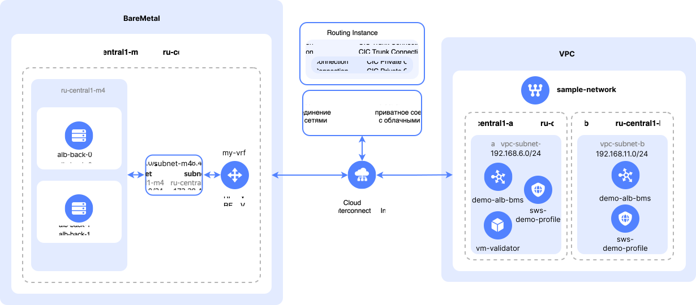

# Развертывание веб-приложения на серверах {{ baremetal-full-name }} с L7-балансировщиком и защитой {{ sws-full-name }}

В этом руководстве вы развернете веб-приложение на [серверах](../../baremetal/concepts/servers.md) {{ baremetal-full-name }}. Для обеспечения равномерного распределения нагрузки на хосты с приложением вы настроите [L7-балансировщик](../../application-load-balancer/concepts/application-load-balancer.md) {{ alb-full-name }}. Создаваемое веб-приложение будет защищено от ботов, [DDoS](../../glossary/ddos.md)- и веб-атак в помощью [профиля безопасности](../../smartwebsecurity/concepts/profiles.md) {{ sws-full-name }}. [Приватное соединение](../../interconnect/concepts/priv-con.md) между [облачной сетью](../../vpc/concepts/network.md#network) {{ vpc-full-name }} и [приватной сетью](../../baremetal/concepts/network.md#private-network) {{ baremetal-full-name }} обеспечивается с помощью [Routing Instance](../../cloud-router/concepts/routing-instance.md) {{ interconnect-full-name }}.

Схема решения:



Где:
* Инфраструктура на стороне {{ baremetal-name }}, которая включает в себя:

    * приватную подсеть `subnet-m4` в [пуле](../../baremetal/concepts/servers.md#server-pools) серверов `{{ region-id }}-m4`;
    * [виртуальный сегмент сети](../../baremetal/concepts/network.md#vrf-segment) (VRF) `my-vrf`;
    * два сервера {{ baremetal-name }} в пуле серверов `{{ region-id }}-m4` с развернутым веб-приложением — `alb-back-0` и `alb-back-1`.
* `Routing Instance` {{ interconnect-name }}, который обеспечивает сетевую связность между сетями {{ vpc-name }} и {{ baremetal-name }}.
* Инфраструктура на стороне [{{ vpc-name }}](../../vpc/index.yaml), которая включает в себя:

    * облачную сеть `sample-network`;
    * [подсети](../../vpc/concepts/network.md#subnet) `vpc-subnet-a` и `vpc-subnet-b` в [зонах доступности](../../overview/concepts/geo-scope.md) `{{ region-id }}-a` и `{{ region-id }}-b`;
    * L7-балансировщик {{ alb-name }} `demo-alb-bms`;
    * профиль безопасности {{ sws-name }} `sws-demo-profile`;
    * [виртуальную машину](../../compute/concepts/vm.md) `vm-validator`, используемую для проверки сетевой связности между сетями {{ vpc-name }} и {{ baremetal-name }}.

Чтобы развернуть веб-приложение на серверах {{ baremetal-full-name }} с L7-балансировщиком и защитой {{ sws-full-name }}:

1. [Подготовьте облако к работе](#before-you-begin).
1. [Подготовьте окружение {{ vpc-short-name }}](#setup-vpc).
1. [Создайте Routing Instance](#create-routing-instance).
1. [Подготовьте окружение {{ baremetal-name }}](#setup-baremetal).
1. [Настройте L7-балансировщик](#setup-balancer).
1. [Настройте защиту от ботов, DDoS- и веб-атак](#setup-sws).

Если созданные ресурсы вам больше не нужны, [удалите их](#clear-out).

## Перед началом работы {#before-you-begin}



### Необходимые платные ресурсы {#paid-resources}

В стоимость поддержки инфраструктуры для развертывания веб-приложения на серверах {{ baremetal-name }} с L7-балансировщиком и защитой {{ sws-name }} входят:

* плата за использование [публичного IP-адреса](../../vpc/concepts/address.md#public-addresses) виртуальной машины (см. [тарифы {{ vpc-full-name }}](../../vpc/pricing.md));
* плата за вычислительные ресурсы и диски [ВМ](../../compute/concepts/vm.md) (см. [тарифы {{ compute-full-name }}](../../compute/pricing.md));
* плата за аренду серверов {{ baremetal-name }} (см. [тарифы {{ baremetal-full-name }}](../../baremetal/pricing.md));
* плата за использование вычислительных ресурсов L7-балансировщика (см. [тарифы {{ alb-full-name }}](../../application-load-balancer/pricing.md));
* плата за запросы, обработанные правилами профиля безопасности (см. [тарифы {{ sws-full-name }}](../../smartwebsecurity/pricing.md));
* при использовании [лог-группы](../../logging/concepts/log-group.md) для записи логов балансировщика плата за запись и хранение данных (см. [тарифы {{ cloud-logging-full-name }}](../../logging/pricing.md)).



## Подготовьте окружение {{ vpc-short-name }} {#setup-vpc}

Настройте инфраструктуру на стороне {{ vpc-name }}. На этом этапе вы создадите [облачную сеть](../../vpc/concepts/network.md#network), [подсети](../../vpc/concepts/network.md#subnet), необходимые [группы безопасности](../../vpc/concepts/security-groups.md) и [виртуальную машину](../../compute/concepts/vm.md).

### Создайте облачную сеть {#create-network}



- Консоль управления {#console} 

  1. В [консоли управления]({{ link-console-main }}) выберите [каталог](../../resource-manager/concepts/resources-hierarchy.md#folder), в котором вы будете создавать инфраструктуру.
  1. В списке сервисов выберите **{{ ui-key.yacloud.iam.folder.dashboard.label_vpc }}**.
  1. Справа сверху нажмите **{{ ui-key.yacloud.vpc.networks.button_create }}**.
  1. В поле **{{ ui-key.yacloud.vpc.networks.create.field_name }}** укажите `sample-network`.
  1. В поле **{{ ui-key.yacloud.vpc.networks.create.field_advanced }}** отключите опцию **{{ ui-key.yacloud.vpc.networks.create.field_is-default }}**.
  1. Нажмите кнопку **{{ ui-key.yacloud.vpc.networks.button_create }}**.



### Создайте подсети {#create-subnets}



- Консоль управления {#console} 

  1. В [консоли управления]({{ link-console-main }}) выберите каталог, в котором вы создаете облачную инфраструктуру.
  1. В списке сервисов выберите **{{ ui-key.yacloud.iam.folder.dashboard.label_vpc }}**.
  1. На панели слева выберите  **{{ ui-key.yacloud.vpc.switch_networks }}**.
  1. Справа сверху нажмите **{{ ui-key.yacloud.vpc.subnetworks.button_action-create }}**.
  1. В поле **{{ ui-key.yacloud.vpc.subnetworks.create.field_name }}** укажите `vpc-subnet-a`.
  1. В поле **{{ ui-key.yacloud.vpc.subnetworks.create.field_zone }}** выберите зону доступности `{{ region-id }}-a`.
  1. В поле **{{ ui-key.yacloud.vpc.subnetworks.create.field_network }}** выберите облачную сеть `sample-network`.
  1. В поле **{{ ui-key.yacloud.vpc.subnetworks.create.field_ip }}** укажите `192.168.6.0/24`.
  
      

  1. Нажмите **{{ ui-key.yacloud.vpc.subnetworks.create.button_create }}**.
  1. Аналогичным способом создайте в сети `sample-network` подсеть `vpc-subnet-b` в зоне доступности `{{ region-id }}-b` с CIDR `192.168.11.0/24`.



### Создайте группы безопасности {#create-sg}



- Консоль управления {#console}

  1. В [консоли управления]({{ link-console-main }}) выберите каталог, в котором вы создаете облачную инфраструктуру.
  1. В списке сервисов выберите **{{ ui-key.yacloud.iam.folder.dashboard.label_vpc }}**.
  1. На панели слева выберите  **{{ ui-key.yacloud.vpc.label_security-groups }}** и нажмите кнопку **{{ ui-key.yacloud.vpc.network.security-groups.button_create }}**.
  1. В поле **{{ ui-key.yacloud.vpc.network.security-groups.forms.field_sg-name }}** задайте имя `vpc-ingress-sg`.
  1. В поле **{{ ui-key.yacloud.vpc.network.security-groups.forms.field_sg-network }}** выберите созданную ранее сеть `sample-network`.
  1. В блоке **{{ ui-key.yacloud.vpc.network.security-groups.forms.label_section-rules }}** [создайте](../../vpc/operations/security-group-add-rule.md) следующие правила для управления трафиком:

      | Направление<br/>трафика | {{ ui-key.yacloud.vpc.network.security-groups.forms.field_sg-rule-description }} | {{ ui-key.yacloud.vpc.network.security-groups.forms.field_sg-rule-port-range }} | {{ ui-key.yacloud.vpc.network.security-groups.forms.field_sg-rule-protocol }} | {{ ui-key.yacloud.vpc.network.security-groups.forms.field_sg-rule-source }} /<br/>{{ ui-key.yacloud.vpc.network.security-groups.forms.field_sg-rule-destination }} | {{ ui-key.yacloud.vpc.network.security-groups.forms.field_sg-rule-cidr-blocks }} /<br/>{{ ui-key.yacloud.vpc.network.security-groups.forms.field_sg-rule-sg-type }} |
      | --- | --- | --- | --- | --- | --- |
      | Входящий | `http`            | `80`   | `TCP`  | `{{ ui-key.yacloud.vpc.network.security-groups.forms.value_sg-rule-destination-cidr }}` | `0.0.0.0/0` |
      | Входящий | `https`            | `443`   | `TCP`  | `{{ ui-key.yacloud.vpc.network.security-groups.forms.value_sg-rule-destination-cidr }}` | `0.0.0.0/0` |
      | Входящий | `ssh`            | `22`   | `TCP`  | `{{ ui-key.yacloud.vpc.network.security-groups.forms.value_sg-rule-destination-cidr }}` | `0.0.0.0/0` |
      | Исходящий | `any`           | `Весь` | `{{ ui-key.yacloud.vpc.network.security-groups.forms.value_any }}` | `{{ ui-key.yacloud.vpc.network.security-groups.forms.value_sg-rule-destination-cidr }}` | `0.0.0.0/0` |
  1. Нажмите **{{ ui-key.yacloud.common.create }}**.
  1. Аналогичным способом создайте в сети `sample-network` [группу безопасности](../../vpc/concepts/security-groups.md) `alb-sg` со следующими правилами:

      | Направление<br/>трафика | {{ ui-key.yacloud.vpc.network.security-groups.forms.field_sg-rule-description }} | {{ ui-key.yacloud.vpc.network.security-groups.forms.field_sg-rule-port-range }} | {{ ui-key.yacloud.vpc.network.security-groups.forms.field_sg-rule-protocol }} | {{ ui-key.yacloud.vpc.network.security-groups.forms.field_sg-rule-source }} /<br/>{{ ui-key.yacloud.vpc.network.security-groups.forms.field_sg-rule-destination }} | {{ ui-key.yacloud.vpc.network.security-groups.forms.field_sg-rule-cidr-blocks }} /<br/>{{ ui-key.yacloud.vpc.network.security-groups.forms.field_sg-rule-sg-type }} |
      | --- | --- | --- | --- | --- | --- |
      | Входящий | `http`            | `80`   | `TCP`  | `{{ ui-key.yacloud.vpc.network.security-groups.forms.value_sg-rule-destination-cidr }}` | `0.0.0.0/0` |
      | Входящий | `healthchecks`            | `30080`   | `TCP`  | `{{ ui-key.yacloud.vpc.network.security-groups.forms.value_sg-rule-sg-type-balancer }}` | — |
      | Исходящий | `any`           | `Весь` | `{{ ui-key.yacloud.vpc.network.security-groups.forms.value_any }}` | `{{ ui-key.yacloud.vpc.network.security-groups.forms.value_sg-rule-destination-cidr }}` | `0.0.0.0/0` |



### Создайте виртуальную машину {#create-vm}



- Консоль управления {#console}

  1. В [консоли управления]({{ link-console-main }}) выберите каталог, в котором вы создаете инфраструктуру.
  1. В списке сервисов выберите **{{ ui-key.yacloud.iam.folder.dashboard.label_compute }}**.
  1. На панели слева выберите  **{{ ui-key.yacloud.compute.instances_jsoza }}** и нажмите кнопку **{{ ui-key.yacloud.compute.instances.button_create }}**.
  1. В блоке **{{ ui-key.yacloud.compute.instances.create.section_image }}** выберите образ [Ubuntu 24.04](/marketplace/products/yc/ubuntu-2404-lts-oslogin).
  1. В блоке **{{ ui-key.yacloud.k8s.node-groups.create.section_allocation-policy }}** выберите [зону доступности](../../overview/concepts/geo-scope.md) `{{ region-id }}-a`.
  1. В блоке **{{ ui-key.yacloud.compute.instances.create.section_network }}**:

      * В поле **{{ ui-key.yacloud.component.compute.network-select.field_subnetwork }}** выберите созданную ранее подсеть `vpc-subnet-a`.
      * В поле **{{ ui-key.yacloud.component.compute.network-select.field_external }}** выберите `{{ ui-key.yacloud.component.compute.network-select.switch_auto }}`.
      * В поле **{{ ui-key.yacloud.component.compute.network-select.field_security-groups }}** выберите созданную ранее группу безопасности `vpc-ingress-sg`.

  1. В блоке **{{ ui-key.yacloud.compute.instances.create.section_access }}** выберите вариант **{{ ui-key.yacloud.compute.instance.access-method.label_oslogin-control-ssh-option-title }}** и укажите данные для доступа на ВМ:

      * В поле **{{ ui-key.yacloud.compute.instances.create.field_user }}** введите имя пользователя: `yc-user`.
      * 

  1. В блоке **{{ ui-key.yacloud.compute.instances.create.section_base }}** задайте имя ВМ: `vm-validator`.
  1. Нажмите кнопку **{{ ui-key.yacloud.compute.instances.create.button_create }}**.



## Создайте Routing Instance {#create-routing-instance}

Для организации сетевой связности между подсетями {{ baremetal-name }} и подсетями {{ vpc-name }} необходимо создать ресурс [Routing Instance](../../cloud-router/concepts/routing-instance.md). `Routing Instance` можно создать через [обращение]({{ link-console-support }}/tickets/create) в службу технической поддержки.

Если в вашем каталоге уже есть настроенная сетевая связность с использованием [{{ interconnect-name }}](../../interconnect/index.yaml) (VPC-to-On-Prem), то вы можете как использовать уже существующий `Routing Instance`, так и запросить создание нового, дополнительного `Routing Instance` для организации обособленной сетевой связности.

### Проверьте наличие Routing Instance в вашем каталоге {#check-for-ri}

1. 

    

1. 

1. Если у вас уже есть `Routing Instance`, вы можете пропустить следующий шаг и [переходить](#setup-baremetal) к подготовке окружения {{ baremetal-name }}.

    Если у вас нет `Routing Instance` или вы хотите построить дополнительную, обособленную сетевую связность, [запросите](#request-ri) создание нового `Routing Instance`.

### Запросите создание Routing Instance {#request-ri}



## Подготовьте окружение {{ baremetal-name }} {#setup-baremetal}

Настройте инфраструктуру на стороне {{ baremetal-name }}. На этом этапе вы создадите [виртуальный сегмент сети (VRF)](../../baremetal/concepts/network.md#vrf-segment), [приватную подсеть](../../baremetal/concepts/network.md#private-subnet) и настроите [приватное соединение](../../baremetal/concepts/network.md#private-connection-to-vpc) с облачной сетью, а также арендуете два [сервера](../../baremetal/concepts/servers.md) {{ baremetal-name }}.

### Создайте виртуальный сегмент сети и приватную подсеть {#setup-vrf}

Создайте VRF и приватную подсеть в [пуле серверов](../../baremetal/concepts/servers.md#server-pools) `{{ region-id }}-m4`:



- Консоль управления {#console}

  1. В [консоли управления]({{ link-console-main }}) выберите каталог, в котором вы создаете инфраструктуру.
  1. В списке сервисов выберите **{{ ui-key.yacloud.iam.folder.dashboard.label_baremetal }}**.
  1. Создайте виртуальный сегмент сети:
        1. На панели слева выберите  **{{ ui-key.yacloud.baremetal.label_networks }}** и нажмите кнопку **{{ ui-key.yacloud.baremetal.label_create-network }}**.
        1. В поле **{{ ui-key.yacloud.baremetal.field_name }}** задайте имя VRF: `my-vrf`.
        1. Нажмите кнопку **{{ ui-key.yacloud.baremetal.label_create-network }}**.
  1. Создайте приватную подсеть:
        1. На панели слева выберите  **{{ ui-key.yacloud.baremetal.label_subnetworks }}** и нажмите кнопку **{{ ui-key.yacloud.baremetal.label_create-subnetwork }}**.
        1. В поле **{{ ui-key.yacloud.baremetal.field_server-pool }}** выберите пул серверов `{{ region-id }}-m4`.
        1. В поле **{{ ui-key.yacloud.baremetal.field_name }}** задайте имя подсети: `subnet-m4`.
        1. Включите опцию **{{ ui-key.yacloud.baremetal.title_routing-settings }}**.
        1. В поле **{{ ui-key.yacloud.baremetal.field_network-id }}** выберите созданный ранее сегмент `my-vrf`.
        1. В поле **{{ ui-key.yacloud.baremetal.field_CIDR }}** укажите `172.28.4.0/24`.
        1. В поле **{{ ui-key.yacloud.baremetal.field_gateway }}** оставьте значение по умолчанию `172.28.4.1`.
        1. Включите опцию **{{ ui-key.yacloud.baremetal.field_dhcp-settings }}** и в появившемся поле **{{ ui-key.yacloud.baremetal.field_dhcp-ip-range }}** оставьте значения по умолчанию: `172.28.4.1` — `172.28.4.254`.
        1. Нажмите кнопку **{{ ui-key.yacloud.baremetal.label_create-subnetwork }}**.



### Настройте приватное соединение с облачной сетью {#connect-to-vpc}

Создайте [приватное соединение](../../baremetal/concepts/network.md#private-connection-to-vpc) {{ interconnect-name }} в сервисе {{ baremetal-name }}:



### Арендуйте серверы {{ baremetal-name }} {#rent-servers}



- Консоль управления {#console}

  1. В [консоли управления]({{ link-console-main }}) выберите каталог, в котором вы создаете инфраструктуру.
  1. 
  1. В блоке **{{ ui-key.yacloud.baremetal.title_section-server-config }}** нажмите фильтр `{{ ui-key.yacloud.baremetal.servers.ConfigurationField.poolFilter_frWLA }}` и выберите пул серверов `{{ region-id }}-m4`.
  1. 
  1. 
  1. В блоке **{{ ui-key.yacloud.baremetal.title_section-server-product }}** выберите образ `Debian 11`.
  1. В поле **{{ ui-key.yacloud.baremetal.field_server-lease-duration }}** выберите период, на который вы заказываете аренду — `1 день`.
  
      По окончании указанного периода аренда сервера будет автоматически продлена на такой же период. Прервать аренду в течение указанного периода аренды нельзя, но можно [отказаться](../../baremetal/operations/servers/server-lease-cancel.md) от дальнейшего продления аренды сервера.
  1. В блоке **Сетевые настройки**:

     1. В поле **{{ ui-key.yacloud.baremetal.field_subnet-id }}** выберите созданную ранее подсеть `subnet-m4`.
     1. В поле **{{ ui-key.yacloud.baremetal.field_needed-public-ip }}** выберите `{{ ui-key.yacloud.baremetal.label_public-ip-ephemeral }}`.

  1. В блоке **{{ ui-key.yacloud.baremetal.title_server-access }}**:

      

  1. В блоке **{{ ui-key.yacloud.baremetal.title_section-server-info }}** в поле **{{ ui-key.yacloud.baremetal.field_name }}** задайте имя сервера: `alb-back-0`.
  1. 
  1. Аналогичным способом арендуйте в пуле серверов `{{ region-id }}-m4` еще один сервер `alb-back-1`.





Подготовка сервера и установка на него операционной системы может занять до 45 минут — в это время сервер будет находиться в статусе `Provisioning`. После завершения установки ОС сервер перейдет в статус `Ready`.



### Разверните веб-приложение {#deploy-web-service}

На этом этапе вы развернете веб-приложение на серверах {{ baremetal-name }}. Веб-приложением на серверах будут использованы следующие ресурсы:
* `/opt/mygoapp` — рабочая директория веб-сервера.
* `/opt/mygoapp/server` — исполняемый файл веб-сервера.
* `/etc/systemd/system/mygoapp.service` — файл конфигурации сервиса для управления веб-сервером через [systemd](https://ru.wikipedia.org/wiki/Systemd).

Чтобы развернуть веб-приложение на сервере:

1. [Подключитесь по SSH](../../compute/operations/vm-connect/ssh.md) к серверу {{ baremetal-name }} `alb-back-0`:

    ```bash
    ssh root@<публичный_IP-адрес_сервера>
    ```

    Публичный IP-адрес сервера можно узнать в [консоли управления]({{ link-console-main }}) на странице **{{ ui-key.yacloud.common.overview }}** с информацией о сервере {{ baremetal-name }}. Нужный адрес указан в блоке **{{ ui-key.yacloud.baremetal.title_section-server-public-network }}** в поле **{{ ui-key.yacloud.baremetal.field_needed-public-ip }}**.

    Все последующие действия этого шага выполняются в терминале сервера.
1. Подготовьте рабочую директорию:

    ```bash
    mkdir -p /opt/mygoapp && cd /opt/mygoapp
    ```
1. Загрузите исполняемый файл веб-сервера:

    ```bash
    wget https://{{ s3-storage-host-ru }}/yc-public-share/server
    ```
1. Установите для скачанного файла разрешение на исполнение:

    ```bash
    chmod +x server
    ```
1. Создайте в `systemd` новый сервис:

    1. Откройте файл конфигурации создаваемого сервиса:

        ```bash
        nano /etc/systemd/system/mygoapp.service
        ```
    1. Вставьте в открытый файл следующее содержимое:

        ```
        [Unit]
        Description=Simple Web Server on Go
        After=network.target
        [Service]
        Type=simple
        WorkingDirectory=/opt/mygoapp
        ExecStart=/opt/mygoapp/server
        Restart=always
        RestartSec=5
        [Install]
        WantedBy=multi-user.target
        ```
    1. Закройте файл, сохранив изменения.
1. Инициализируйте созданный сервис:

    ```bash
    systemctl daemon-reload
    ```
1. Запустите сервис:

    ```bash
    systemctl start mygoapp.service
    ```
1. Проверьте работу веб-приложения. Для этого на вашем локальном компьютере вставьте публичный IP-адрес сервера `alb-back-0` в адресную строку браузера. 

    В результате в окне браузера откроется страница с именем хоста и информацией о продолжительности работы веб-сервера с момента его запуска.

    

    ```go
    package main

    import (
      "context"
      "fmt"
      "net/http"
      "os"
      "os/signal"
      "syscall"
      "time"
      "github.com/gorilla/handlers"
    )

    var (
      hostname    string
      htmlContent []byte
    )

    const (
      serverTimeout  = 5 * time.Second
      cacheDuration  = 86400 * 30 // 30 дней в секундах
      htmlTemplate = `
    <!DOCTYPE html>
    <html lang="en">
    <head>
        <!-- Минифицированный CSS -->
        <style>*{margin:0;padding:0;box-sizing:border-box;font-family:'Segoe UI',system-ui,sans-serif}body{min-height:100vh;display:flex;justify-content:center;align-items:center;background:linear-gradient(135deg,#1a1a1a,#2d2d2d);color:#fff;padding:20px}.container{background:rgba(255,255,255,0.1);backdrop-filter:blur(10px);border-radius:20px;padding:40px;box-shadow:0 8px 32px rgba(0,0,0,0.3);text-align:center;max-width:600px;width:100%%;transition:transform .3s ease}.server-name{font-size:1.8rem;margin-bottom:30px;color:#0f0;font-weight:600;text-shadow:0 0 10px rgba(0,255,136,0.3)}.datetime{font-size:2.5rem;letter-spacing:2px;margin-bottom:20px}.date{font-size:1.5rem;opacity:.8}@media (max-width:768px){.container{padding:25px;border-radius:15px}.server-name{font-size:1.4rem}.datetime{font-size:2rem}.date{font-size:1.2rem}}@media (max-width:480px){.datetime{font-size:1.6rem}}</style>
        <meta name="viewport" content="width=device-width,initial-scale=1">
        <title>Server Info & Time</title>
    </head>
    <body>
        <div class="container">
            <div class="server-name">Server Hostname: %s</div>
            <div class="datetime" id="datetime"></div>
            <div class="date" id="date"></div>
        </div>
        <script>
            // Минифицированный JavaScript
            const e=()=>{const e=new Date;document.getElementById("datetime").textContent=e.toLocaleTimeString("en-US",{timeZone:"Europe/Moscow",hour12:!1,hour:"2-digit",minute:"2-digit",second:"2-digit"}),document.getElementById("date").textContent=e.toLocaleDateString("en-US",{timeZone:"Europe/Moscow",weekday:"long",year:"numeric",month:"long",day:"numeric"})};e(),setInterval(e,1e3);
        </script>
    </body>
    </html>`
    )

    func init() {
      // Инициализация хоста при старте
      var err error
      if hostname, err = os.Hostname(); err != nil {
        hostname = "Unavailable"
      }
      
      // Предварительная генерация HTML
      htmlContent = []byte(fmt.Sprintf(htmlTemplate, hostname))
    }

    func main() {
      // Настройка обработчиков
      mux := http.NewServeMux()
      mux.HandleFunc("/", func(w http.ResponseWriter, r *http.Request) {
        w.Header().Set("Content-Type", "text/html; charset=utf-8")
        w.Header().Set("Cache-Control", fmt.Sprintf("public, max-age=%d", cacheDuration))
        w.Write(htmlContent)
      })

      // Middleware
      chain := handlers.CompressHandler(
        handlers.CombinedLoggingHandler(os.Stdout, mux),
      )

      // Конфигурация сервера
      server := &http.Server{
        Addr:         ":80",
        Handler:      chain,
        ReadTimeout:  serverTimeout,
        WriteTimeout: serverTimeout,
        IdleTimeout:  serverTimeout * 2,
      }

      // Graceful shutdown
      ctx, stop := signal.NotifyContext(context.Background(), 
        os.Interrupt, syscall.SIGTERM)
      defer stop()

      go func() {
        <-ctx.Done()
        shutdownCtx, cancel := context.WithTimeout(
          context.Background(), 5*time.Second)
        defer cancel()
        server.Shutdown(shutdownCtx)
      }()

      fmt.Println("Server started")
      if err := server.ListenAndServe(); err != http.ErrServerClosed {
        fmt.Printf("Server error: %v\n", err)
      }
    }
    ```

    

1. Аналогичным способом разверните веб-приложение на сервере `alb-back-1`.

### Проверьте сетевую связность {#check-connectivity}

Убедитесь, что [созданное ранее](#connect-to-vpc) приватное соединение с облачной сетью готово к работе (статус `Ready`), затем проверьте наличие сетевой связности между виртуальной машиной `vm-validator` в сети {{ vpc-name }} и серверами в приватной подсети {{ baremetal-name }}:

1. [Подключитесь по SSH](../../compute/operations/vm-connect/ssh.md) к виртуальной машине `vm-validator`:

    ```bash
    ssh yc-user@<публичный_IP-адрес_ВМ>
    ```

    Публичный IP-адрес ВМ можно узнать в [консоли управления]({{ link-console-main }}), в поле **{{ ui-key.yacloud.compute.instance.overview.label_public-ipv4 }}** блока **{{ ui-key.yacloud.compute.instance.overview.section_network }}** на странице с информацией о ВМ.

    Все последующие действия этого шага выполняются в терминале виртуальной машины.
1. Выполните проверку сетевого доступа к серверу `alb-back-0`, указав его приватный IP-адрес:

    ```bash
    ping <приватный_IP-адрес_сервера> -s 1024 -c 3
    ```

    Приватный IP-адрес сервера можно узнать в [консоли управления]({{ link-console-main }}) на странице **{{ ui-key.yacloud.common.overview }}** с информацией о сервере {{ baremetal-name }}. Нужный адрес указан в блоке **{{ ui-key.yacloud.baremetal.title_section-server-private-network }}** в поле **{{ ui-key.yacloud.baremetal.field_server-private-ip }}**.

    Результат:

    ```text
    PING 172.28.4.11 (172.28.4.11) 1024(1052) bytes of data.
    1032 bytes from 172.28.4.11: icmp_seq=1 ttl=58 time=3.77 ms
    1032 bytes from 172.28.4.11: icmp_seq=2 ttl=58 time=3.83 ms
    1032 bytes from 172.28.4.11: icmp_seq=3 ttl=58 time=3.80 ms

    --- 172.28.4.11 ping statistics ---
    3 packets transmitted, 3 received, 0% packet loss, time 2004ms
    rtt min/avg/max/mdev = 3.767/3.800/3.830/0.025 ms
    ```
1. Аналогичным способом убедитесь в наличии сетевого доступа к серверу `alb-back-1`, указав в команде `ping` его приватный IP-адрес.

Сохраните полученные приватные IP-адреса серверов {{ baremetal-name }} — они понадобятся при настройке L7-балансировщика.

## Настройте L7-балансировщик {#setup-balancer}

Создав сегменты инфраструктуры на стороне {{ vpc-name }} и на стороне {{ baremetal-name }}, а также убедившись в наличии сетевой связности между этими сегментами, настройте балансировку трафика от пользователей к веб-приложению при помощи L7-балансировщика.

### Создайте целевую группу L7-балансировщика {#create-tg}



- Консоль управления {#console}

  1. В [консоли управления]({{ link-console-main }}) выберите каталог, в котором вы создаете инфраструктуру.
  1. В списке сервисов выберите **{{ ui-key.yacloud.iam.folder.dashboard.label_application-load-balancer }}**.
  1. На панели слева выберите  **{{ ui-key.yacloud.alb.label_target-groups }}** и нажмите кнопку **{{ ui-key.yacloud.alb.button_target-group-create }}**.
  1. В поле **{{ ui-key.yacloud.common.name }}** укажите имя [целевой группы](../../application-load-balancer/concepts/target-group.md) `bms-target-group`.
  1. В блоке **{{ ui-key.yacloud.alb.label_targets }}**:
  
      1. В поле **{{ ui-key.yacloud.alb.column_target }}** введите сохраненный ранее приватный IP-адрес сервера `alb-back-0`.
      1. В строке с введенным IP-адресом включите опцию **{{ ui-key.yacloud.alb.label_target-private-ip }}** и нажмите кнопку **{{ ui-key.yacloud.alb.button_add-target }}**.
      1. Повторите два предыдущих действия, чтобы добавить в целевую группу приватный IP-адрес сервера `alb-back-1`.
  1. Нажмите кнопку **{{ ui-key.yacloud.common.create }}**.



### Создайте группу бэкендов {#create-backend-group}



- Консоль управления {#console}

  1. В [консоли управления]({{ link-console-main }}) выберите каталог, в котором вы создаете инфраструктуру.
  1. В списке сервисов выберите **{{ ui-key.yacloud.iam.folder.dashboard.label_application-load-balancer }}**.
  1. На панели слева выберите  **{{ ui-key.yacloud.alb.label_backend-groups }}** и нажмите кнопку **{{ ui-key.yacloud.alb.button_backend-group-create }}**.
  1. В поле **{{ ui-key.yacloud.common.name }}** укажите имя [группы бэкендов](../../application-load-balancer/concepts/backend-group.md) `bms-backend-group`.
  1. В поле **{{ ui-key.yacloud.alb.label_backend-type }}** выберите `{{ ui-key.yacloud.alb.label_proto-http }}`.
  1. В блоке **{{ ui-key.yacloud.alb.label_backends }}** нажмите кнопку **{{ ui-key.yacloud.common.add }}** и в появившейся форме **{{ ui-key.yacloud.alb.label_new-backend }}**:

      1. В поле **{{ ui-key.yacloud.common.name }}** задайте имя [бэкенда](../../application-load-balancer/concepts/backend-group.md#types) `bms-backend`.
      1. В поле **{{ ui-key.yacloud.alb.label_target-groups }}** выберите созданную ранее целевую группу `bms-target-group`.
      1. В секции **HTTP проверка состояния**:

          1. В поле **{{ ui-key.yacloud.alb.label_timeout }}** задайте значение `3`.
          1. В поле **{{ ui-key.yacloud.alb.label_interval }}** задайте значение `10`.
          1. В поле **{{ ui-key.yacloud.alb.label_path }}** укажите корневой путь `/`.
          1. В поле **{{ ui-key.yacloud.alb.label_expected-statuses }}** выберите код ответа `200`.

      Значения остальных параметров оставьте без изменений.
  1. Нажмите кнопку **{{ ui-key.yacloud.common.create }}**.



### Создайте HTTP-роутер {#create-http-router}



- Консоль управления {#console}

  1. В [консоли управления]({{ link-console-main }}) выберите каталог, в котором вы создаете инфраструктуру.
  1. В списке сервисов выберите **{{ ui-key.yacloud.iam.folder.dashboard.label_application-load-balancer }}**.
  1. На панели слева выберите  **{{ ui-key.yacloud.alb.label_http-routers }}** и нажмите кнопку **{{ ui-key.yacloud.alb.button_http-router-create }}**.
  1. В поле **{{ ui-key.yacloud.common.name }}** укажите имя [HTTP-роутера](../../application-load-balancer/concepts/http-router.md) `http-80`.
  1. В блоке **{{ ui-key.yacloud.alb.label_virtual-hosts }}** нажмите кнопку **{{ ui-key.yacloud.alb.button_virtual-host-add }}** и в открывшейся форме **{{ ui-key.yacloud.alb.label_new-virtual-host }}**:

      1. В поле **{{ ui-key.yacloud.common.name }}** укажите имя [виртуального хоста](../../application-load-balancer/concepts/http-router.md#virtual-host) `http-vh` и нажмите кнопку **{{ ui-key.yacloud.alb.button_add-route }}**.
      1. В открывшейся форме **{{ ui-key.yacloud.alb.label_new-route }}** в поле **{{ ui-key.yacloud.common.name }}** задайте имя [маршрута](../../application-load-balancer/concepts/http-router.md#routes) `main-route-80`.
      1. В поле **{{ ui-key.yacloud.alb.label_http-methods }}** выберите `GET`.
      1. В поле **{{ ui-key.yacloud.alb.label_backend-group }}** выберите созданную на предыдущем шаге группу бэкендов `bms-backend-group`.
      1. Значения остальных параметров оставьте без изменений и внизу страницы нажмите кнопку **{{ ui-key.yacloud.common.create }}**.



### Создайте L7-балансировщик {#create-alb}



- Консоль управления {#console}

  1. В [консоли управления]({{ link-console-main }}) выберите каталог, в котором вы создаете инфраструктуру.
  1. В списке сервисов выберите **{{ ui-key.yacloud.iam.folder.dashboard.label_application-load-balancer }}**.
  1. Нажмите кнопку **{{ ui-key.yacloud.alb.button_load-balancer-create }}** и выберите **{{ ui-key.yacloud.alb.label_alb-create-form }}**.
  1. В поле **{{ ui-key.yacloud.common.name }}** укажите имя балансировщика `demo-alb-bms`.
  1. В поле **{{ ui-key.yacloud.mdb.forms.label_network }}** выберите сеть `sample-network`.
  1. В поле **{{ ui-key.yacloud.mdb.forms.field_security-group }}** выберите `{{ ui-key.yacloud.component.security-group-field.label_sg-from-list }}` и в появившемся списке выберите группу безопасности `alb-sg`.
  1. В блоке **{{ ui-key.yacloud.alb.section_allocation-settings }}** оставьте только зоны доступности `{{ region-id }}-a` и `{{ region-id }}-b` с подсетями `vpc-subnet-a` и `vpc-subnet-b` соответственно.
  1. Если вы не хотите сохранять логи работы балансировщика в [лог-группу](../../logging/concepts/log-group.md), отключите опцию **{{ ui-key.yacloud.alb.label_log-requests }}**.
  1. В секции **{{ ui-key.yacloud.alb.label_listeners }}** нажмите кнопку **{{ ui-key.yacloud.alb.button_add-listener }}** и в открывшейся форме:

      1. В поле **{{ ui-key.yacloud.common.name }}** укажите имя [обработчика](../../application-load-balancer/concepts/application-load-balancer.md#listener) `alb-bms-listener`.
      1. В поле **{{ ui-key.yacloud.alb.label_http-router }}** выберите созданный ранее HTTP-роутер `http-80`.
  1. Значения остальных параметров оставьте без изменений и внизу страницы нажмите кнопку **{{ ui-key.yacloud.common.create }}**.
  1. Дождитесь, когда статус балансировщика изменится на `Active`, и в поле **{{ ui-key.yacloud.alb.column_addresses }}** скопируйте его публичный IP-адрес.
  1. На вашем локальном компьютере вставьте IP-адрес балансировщика в адресную строку браузера. Если все настроено корректно, в окне браузера откроется развернутое на серверах {{ baremetal-name }} веб-приложение.



## Настройте защиту от ботов, DDoS- и веб-атак {#setup-sws}

Убедившись в корректной работе L7-балансировщика, настройте для вашего веб-приложения защиту от ботов, DDoS- и веб-атак с помощью профиля безопасности {{ sws-name }}.

### Создайте профиль ARL {#create-arl-profile}



- Консоль управления {#console}

  1. В [консоли управления]({{ link-console-main }}) выберите каталог, в котором вы создаете инфраструктуру.
  1. В списке сервисов выберите **{{ ui-key.yacloud.iam.folder.dashboard.label_smartwebsecurity }}**.
  1. На панели слева выберите  **{{ ui-key.yacloud.smart-web-security.arl.label_profiles }}** и нажмите кнопку **{{ ui-key.yacloud.smart-web-security.arl.label_create-profile }}**.
  1. В поле **{{ ui-key.yacloud.common.name }}** задайте имя [профиля ARL](../../smartwebsecurity/concepts/arl.md) `arl-profile-demo`.
  1. Нажмите кнопку  **{{ ui-key.yacloud.smart-web-security.arl.label_add-rule }}** и в открывшемся окне:

      1. В поле **{{ ui-key.yacloud.common.name }}** задайте имя правила `permit-50-rps-in`.
      1. В поле **Приоритет** укажите `10`.
      1. В поле **Лимит запросов** задайте лимит в `50` запросов за `1 секунду`.
      1. Значения остальных параметров оставьте без изменений и нажмите кнопку **{{ ui-key.yacloud.smart-web-security.arl.label_save-rule }}**.
  1. Нажмите кнопку **{{ ui-key.yacloud.common.create }}**.



### Создайте профиль WAF {#create-waf-profile}



- Консоль управления {#console}

  1. В [консоли управления]({{ link-console-main }}) выберите каталог, в котором вы создаете инфраструктуру.
  1. В списке сервисов выберите **{{ ui-key.yacloud.iam.folder.dashboard.label_smartwebsecurity }}**.
  1. На панели слева выберите  **{{ ui-key.yacloud.smart-web-security.waf.label_profiles }}** и нажмите кнопку **{{ ui-key.yacloud.smart-web-security.waf.label_create-profile }}**.
  1. В поле **{{ ui-key.yacloud.common.name }}** задайте имя [профиля WAF](../../smartwebsecurity/concepts/waf.md) `waf-profile-demo`.
  1. По умолчанию в профиле WAF включен набор базовых правил [OWASP Core Rule Set](https://coreruleset.org/). Нажмите на строку с набором правил, чтобы посмотреть правила, которые в него входят.
  1. Нажмите кнопку **{{ ui-key.yacloud.common.create }}**.



### Создайте профиль безопасности {#create-security-profile}



- Консоль управления {#console}

  1. В [консоли управления]({{ link-console-main }}) выберите каталог, в котором вы создаете инфраструктуру.
  1. В списке сервисов выберите **{{ ui-key.yacloud.iam.folder.dashboard.label_smartwebsecurity }}**.
  1. На панели слева выберите  **{{ ui-key.yacloud.smart-web-security.title_profiles }}**.
  1. Нажмите кнопку **{{ ui-key.yacloud.smart-web-security.action_empty }}** и выберите вариант `{{ ui-key.yacloud.smart-web-security.title_no-template }}`.
  1. В поле **{{ ui-key.yacloud.common.name }}** задайте имя [профиля безопасности](../../smartwebsecurity/concepts/profiles.md) `sws-demo-profile`.
  1. В поле **{{ ui-key.yacloud.smart-web-security.form.label_arl-profile }}** выберите созданный ранее профиль `arl-profile-demo`.
  1. Создайте новое [правило](../../smartwebsecurity/concepts/rules.md) `Web Application Firewall`:
  
      1. Нажмите кнопку  **{{ ui-key.yacloud.smart-web-security.form.button_add-rule }}**.
      1. В поле **{{ ui-key.yacloud.common.name }}** задайте имя правила `waf-rule`.
      1. В поле **Приоритет** укажите значение `200`.
      1. В блоке **Тип правила** выберите `{{ ui-key.yacloud.smart-web-security.overview.label_waf-rule }}` и в появившемся списке выберите созданное ранее правило `waf-profile-demo`.

          К создаваемому правилу будет применен набор правил из профиля WAF. Подозрительные запросы будут направляться в [{{ captcha-full-name }}](../../smartcaptcha/index.yaml).
      1. Нажмите кнопку **{{ ui-key.yacloud.common.add }}**.

      Добавленное правило появится в списке правил в блоке **{{ ui-key.yacloud.smart-web-security.form.section_security-rules }}**.
  1. Создайте новое правило `Smart Protection`:

      1. Повторно нажмите кнопку  **{{ ui-key.yacloud.smart-web-security.form.button_add-rule }}**.
      1. В поле **{{ ui-key.yacloud.common.name }}** задайте имя правила `smart-rule`.
      1. В поле **Приоритет** укажите значение `300`.
      1. В блоке **Тип правила** выберите `{{ ui-key.yacloud.smart-web-security.overview.label_smart-protection-rule }}`.

          Создаваемое правило будет направлять трафик на автоматический анализ с помощью алгоритмов машинного обучения и поведенческого анализа. Подозрительные запросы будут направляться в {{ captcha-full-name }} для дополнительной верификации.
      1. Нажмите кнопку **{{ ui-key.yacloud.common.add }}**.
  
      Добавленное правило появится в списке правил в блоке **{{ ui-key.yacloud.smart-web-security.form.section_security-rules }}**.
  1. Нажмите кнопку **{{ ui-key.yacloud.smart-web-security.action_empty }}**.



### Включите защиту на хостах {#apply-protection-to-hosts}



- Консоль управления {#console}

  1. В [консоли управления]({{ link-console-main }}) выберите каталог, в котором вы создаете инфраструктуру.
  1. В списке сервисов выберите **{{ ui-key.yacloud.iam.folder.dashboard.label_smartwebsecurity }}**.
  1. На панели слева выберите  **{{ ui-key.yacloud.smart-web-security.title_profiles }}** и выберите созданный ранее профиль `sws-demo-profile`.
  1. На панели сверху нажмите кнопку  **{{ ui-key.yacloud.smart-web-security.overview.action_attach-to-host }}** и в открывшемся окне:

      1. Выберите балансировщик `demo-alb-bms`.
      1. Выберите HTTP-роутер `http-80`.
      1. Выберите виртуальный хост `http-vh`.
      1. Нажмите кнопку **{{ ui-key.yacloud.smart-web-security.attach-dialog.action_connect }}**.

      Информация о подключенном виртуальном хосте появится на вкладке **{{ ui-key.yacloud.smart-web-security.overview.title_connected-to-the-hosts }}** на странице с обзором профиля безопасности {{ sws-name }}.



Вы настроили веб-приложение, развернув его на двух серверах {{ baremetal-name }}, организовав балансировку пользовательского трафика с помощью L7-балансировщика {{ alb-name }} и обеспечив защиту с помощью профиля безопасности {{ sws-name }}.

## Как удалить созданные ресурсы {#clear-out}

Чтобы перестать платить за созданные ресурсы:

1. [Удалите](../../compute/operations/vm-control/vm-delete.md) виртуальную машину.
1. [Удалите](../../application-load-balancer/operations/application-load-balancer-delete.md) L7-балансировщик, затем последовательно удалите [HTTP-роутер](../../application-load-balancer/operations/http-router-delete.md), [группу бэкендов](../../application-load-balancer/operations/backend-group-delete.md) и [целевую группу](../../application-load-balancer/operations/target-group-delete.md) балансировщика.
1. [Удалите](../../smartwebsecurity/operations/profile-delete.md) профиль безопасности {{ sws-name }}, затем удалите [профиль WAF](../../smartwebsecurity/operations/waf-profile-delete.md) и [профиль ARL](../../smartwebsecurity/operations/arl-profile-delete.md).
1. Удалить серверы {{ baremetal-name }} нельзя. Вместо этого [откажитесь](../../baremetal/operations/servers/server-lease-cancel.md) от продления их аренды.
1. Если вы оставляли включенной опцию записи логов L7-балансировщика, [удалите](../../logging/operations/delete-group.md) лог-группу.
1. При необходимости последовательно удалите [группы безопасности](../../vpc/operations/security-group-delete.md), [подсети](../../vpc/operations/subnet-delete.md) и [облачную сеть](../../vpc/operations/network-delete.md).
1. При необходимости удалите приватное соединение:

    

    - Консоль управления {#console} 
    
      1. В [консоли управления]({{ link-console-main }}) выберите каталог, в котором вы создали инфраструктуру.
      1. В списке сервисов выберите **{{ ui-key.yacloud.iam.folder.dashboard.label_baremetal }}**.
      1. На панели слева выберите  **{{ ui-key.yacloud.baremetal.label_networks }}** и выберите виртуальный сегмент сети `my-vrf`.
      1. В блоке **{{ ui-key.yacloud.baremetal.title_vrf-interconnect-section }}** нажмите  и выберите  **{{ ui-key.yacloud.baremetal.action_delete-external-connection }}**.
      1. В открывшемся окне подтвердите удаление.

      В результате статус соединения сменится на `Deleting`. После того как все связи будут удалены, соединение пропадет из списка.

    