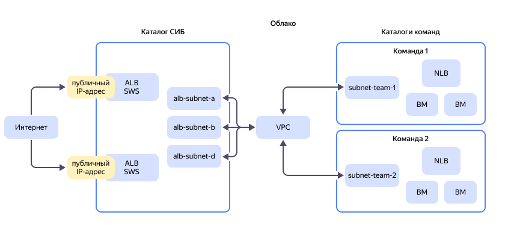
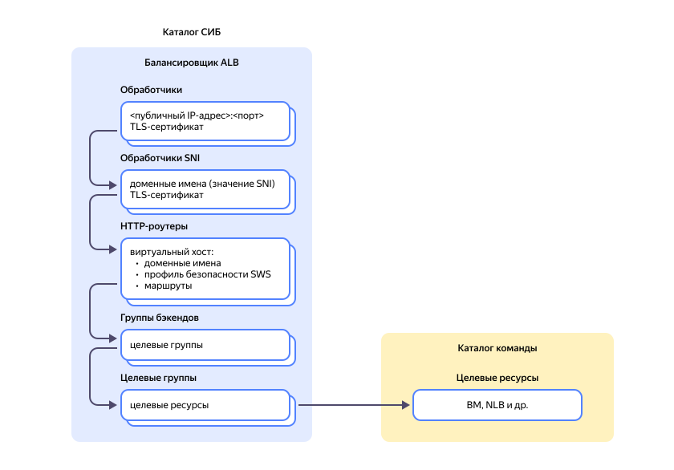

# Централизованная публикация в интернете и защита от DDoS-атак приложений, размещенных в разных каталогах 

В этом руководстве рассматривается сценарий, в котором с облачными ресурсами {{ yandex-cloud }} работает несколько независимых команд. Сервисы и приложения, которые разрабатывают команды, публикуются в интернете. Для разделения ресурсов используются каталоги {{ yandex-cloud }}, и каждая команда имеет доступ только к своему каталогу. Также по требованию службы информационной безопасности (СИБ) командам не разрешено напрямую публиковать ресурсы из своих каталогов в интернете.

С реализацией такой схемы помогут сервисы {{ yandex-cloud }} — [{{ alb-full-name }}](../../application-load-balancer/) (ALB) и [{{ sws-full-name }}](../../smartwebsecurity/concepts/) (SWS).

Сервис {{ alb-name }} позволяет создавать балансировщики на уровне L7 модели [OSI](https://ru.wikipedia.org/wiki/Сетевая_модель_OSI) и равномерно распределять трафик по вашим сервисам и приложениям. А также публиковать их в интернете.

Сервис {{ sws-name }} позволяет защитить ваши ресурсы от [DDoS-атак](../../glossary/ddos.md) и ботов на уровне L7. Дополнительно можно подключить [WAF](../../smartwebsecurity/concepts/waf.md) и ограничить нагрузку на ваш ресурс с помощью модуля [Advanced Rate Limiter](../../smartwebsecurity/concepts/arl.md) (ARL). Параметры защиты ваших ресурсов настраиваются в профиле безопасности {{ sws-name }}. Профиль безопасности подключается к L7-балансировщику.

Чтобы настроить такую схему работы, надо решить несколько задач:

* Централизованная публикация сервисов в интернете — это позволяет сделать L7-балансировщик.
* Проверка входящего трафика на наличие информационных угроз — для этого используется сервис {{ sws-name }}.
* Ограничение доступа команд к L7-балансировщикам и профилю безопасности — для этого надо разместить L7-балансировщики в отдельном каталоге. Доступ к этому каталогу должны иметь только избранные сотрудники. Например, сотрудники СИБ.
* Организация сетевого взаимодействия между L7-балансировщиками и целевыми ресурсами команд в разных каталогах — для этого можно использовать [Multi-folder VPC](../../vpc/tutorials/multi-folder-vpc.md). При этом L7-балансировщики и ресурсы команд должны находиться в разных подсетях одной сети VPC.

## Схема размещения ресурсов в {{ yandex-cloud }} {#resource-allocation-scheme}

На схеме обозначены следующие ресурсы:

* **ALB** — L7-балансировщики {{ alb-name }}, через которые сервисы публикуются в интернете.
* **SWS** — сервис {{ sws-name }} для защиты на уровне приложений (L7).
* **Каталог СИБ** — каталог L7-балансировщиков ALB, доступ к которому имеют только сотрудники службы информационной безопасности.
* **VPC** — облачная сеть, в которой находятся подсети ALB и команд.
  * **alb-subnet-a**, **alb-subnet-b**, **alb-subnet-d** — подсети с узлами ALB.
  * **subnet-team-1**, **subnet-team-2** — подсети с ресурсами команд.
* **Каталоги команд** — каталоги, в которых размещены целевые ресурсы команд. Например, виртуальные машины (ВМ), базы данных, балансировщики L3-L4 [{{ network-load-balancer-name }}](../../network-load-balancer/) (NLB) и другие.

В этом руководстве предполагается, что целевые ресурсы ваших сервисов уже созданы и находятся в разных каталогах.
Поэтому будут рассмотрены:

* [Требования и рекомендации по дополнительной настройке ресурсов](#requirements-recommendations).
* [Настройка защиты и публикация сервисов в интернете](#publish-services).

## Требования и рекомендации по настройке ресурсов {#requirements-recommendations}

### Сеть {#network-requirements}

* Для организации сетевой связности между L7-балансировщиками и целевыми ресурсами команд используйте Multi-folder VPC, расширяющий область действия сети VPC с одного каталога на несколько.
* Для разграничения сетевого доступа между ресурсами разных команд используйте [группы безопасности](../../vpc/concepts/security-groups.md):
  
    * Группы безопасности целевых ресурсов должны разрешать входящий трафик от подсетей L7-балансировщика.
    * Группы безопасности L7-балансировщика должны разрешать входящий трафик на подсети целевых ресурсов.

      Рекомендации по настройке групп безопасности см. в разделе [{#T}](../../application-load-balancer/concepts/application-load-balancer.md#security-groups).

### L7-балансировщики {#l7-balancer-requirements}

* Разместите все L7-балансировщики в одном каталоге, доступ к которому имеют только сотрудники СИБ.
* (Опционально) [Подключите защиту](../../vpc/ddos-protection/) от DDoS-атак на уровне L3-L4. Для этого:
    * [Зарезервируйте](../../vpc/operations/get-static-ip.md) статический публичный IP-адрес с защитой от DDoS-атак и используйте его для обработчика L7-балансировщика.
    * [Настройте порог]({{ link-console-support }}) для срабатывания механизмов защиты на уровне L3-L4, который будет соответствовать объему легитимного трафика на ваши сервисы.
    * На целевых ресурсах [задайте MTU](../../vpc/operations/adjust-mtu-ddos-protection.md) — `1450`.
* Для [обработчиков](../../application-load-balancer/concepts/application-load-balancer.md#listener) одного L7-балансировщика нельзя использовать разные публичные IP-адреса.
* Для обработчиков одного L7-балансировщика используйте разные порты.

    Для HTTPS-протокола можно использовать [обработчики SNI](../../application-load-balancer/concepts/application-load-balancer.md#listener) с одинаковым портом. Допустимое количество обработчиков SNI см. в [лимитах](../../application-load-balancer/concepts/limits.md).

* (Опционально) Для отказоустойчивости разместите L7-балансировщики в разных зонах доступности.
* Для узлов L7-балансировщика учитывайте [размеры подсетей](../../application-load-balancer/concepts/application-load-balancer.md#lcu-scaling-subnet-sizes).
* Настройте для L7-балансировщика минимальное количество [ресурсных единиц](../../application-load-balancer/concepts/application-load-balancer.md#lcu-scaling-settings) в каждой зоне согласно правилам [автомасштабирования](../../application-load-balancer/concepts/application-load-balancer.md#lcu-scaling). Количество ресурсных единиц определяется ожидаемой нагрузкой на ваши сервисы по следующим параметрам:
  * количество запросов в секунду (RPS);
  * количество одновременных активных соединений;
  * количество новых соединений в секунду;
  * объем трафика в секунду.
* При большой нагрузке на L7-балансировщик, учитывайте его [лимиты](../../application-load-balancer/concepts/limits.md). Если не получается масштабировать сервис за счет ресурсов внутри одного балансировщика, распределите его на несколько L7-балансировщиков.
* Для высоконагруженных сервисов выделите для каждого сервиса свой L7-балансировщик.
* При публикации нескольких сервисов через один L7-балансировщик ALB учитывайте [SLA](https://yandex.ru/legal/cloud_sla_apploadbalancer).
* Учитывайте, что внешние запросы к веб-серверам будут приходить от IP-адресов из диапазона внутренних IP-адресов подсетей L7-балансировщика. IP-адреса источников запросов (пользователей) будут сохраняться в HTTP-заголовке [X-Forwarded-For](https://en.wikipedia.org/wiki/X-Forwarded-For) (XFF). Поэтому для логирования IP-адреса пользователей из XFF на веб-серверах целевых ресурсов может потребоваться [изменение конфигурации](../../troubleshooting/application-load-balancer/how-to/getting-external-src-ip-in-x-forwarded-for-headers.md).

### Целевые ресурсы {#target-resources-requirements}

* В целевой группе L7-балансировщика укажите IP-адреса ваших сервисов из каталогов команд, которые должны быть доступны в интернете.
* Эти адреса должны входить в [частные диапазоны по RFC 1918](https://datatracker.ietf.org/doc/html/rfc1918#section-3).
* При изменении внутреннего IP-адреса у целевого ресурса вручную обновите настройки целевой группы L7-балансировщика.

## Настройка безопасной публикации сервисов в интернете {#publish-services}

Чтобы настроить безопасную публикацию ваших сервисов в интернете:

1. Создайте [каталог](../../resource-manager/concepts/resources-hierarchy.md#folder) СИБ.
1. [Предоставьте доступ](../../iam/concepts/access-control/index.md#how-do-i-perform-access-management) к каталогу только сотрудникам СИБ.
1. [Настройте сетевое взаимодействие](../../vpc/tutorials/multi-folder-vpc.md) ресурсов из разных каталогов.
1. [Настройте группы безопасности](../../vpc/operations/security-group-create.md) согласно [рекомендациям](#network-requirements).
1. [Зарезервируйте публичный IP-адрес](../../vpc/operations/get-static-ip.md), включите защиту от DDoS-атак на уровнях L3-L4.
1. [Создайте профиль безопасности](#create-sws-profile).
1. При использовании HTTPS [добавьте TLS-сертификат](../../certificate-manager/quickstart/) в {{ certificate-manager-name }}.
1. [Создайте L7-балансировщик](#create-alb).
1. [Проверьте работу L7-балансировщика](#check-alb).

На схеме представлены ресурсы L7-балансировщика, которые будут созданы и настроены в этом сценарии.

### Создание профиля безопасности {#create-sws-profile}



- Консоль управления {#console}

  1. В [консоли управления]({{ link-console-main }}) выберите [каталог СИБ](../../resource-manager/concepts/resources-hierarchy.md#folder).
  1. В списке сервисов выберите **{{ ui-key.yacloud.iam.folder.dashboard.label_smartwebsecurity }}**.
  1. Нажмите кнопку **{{ ui-key.yacloud.smart-web-security.action_empty }}**.
  1. Выберите **{{ ui-key.yacloud.smart-web-security.title_default-template }}**.
  1. Введите имя профиля — `sws-ddos`.
  1. В поле **{{ ui-key.yacloud.smart-web-security.form.label_default-action }}** выберите `{{ ui-key.yacloud.smart-web-security.form.label_action-allow }}`.
  1. В блоке **{{ ui-key.yacloud.smart-web-security.form.section_security-rules }}** напротив правила `sp-rule-1` нажмите значок  и выберите **{{ ui-key.yacloud.common.edit }}**.
  1. Включите опцию **{{ ui-key.yacloud.smart-web-security.overview.column_dry-run-rule }} (dry run)**.

     Эта опция используется для тестирования работы профиля. В режиме логирования трафик не блокируется и пользователи не будут отключены от вашего сервиса из-за неправильно настроенного профиля. Проанализируйте работу профиля и настройте [правила](../../smartwebsecurity/concepts/rules.md) в соответствии с потребностями вашего сервиса.

  1. Нажмите кнопку **{{ ui-key.yacloud.common.save-changes }}**.
  1. Нажмите кнопку **{{ ui-key.yacloud.common.create }}**.



Другие способы создания профиля безопасности см. в разделе [{#T}](../../smartwebsecurity/operations/profile-create.md).

### Создание L7-балансировщика {#create-alb}



- Консоль управления {#console}

  1. В [консоли управления]({{ link-console-main }}) выберите каталог СИБ.
  1. В списке сервисов выберите **{{ ui-key.yacloud.iam.folder.dashboard.label_application-load-balancer }}**.
  1. Нажмите кнопку **{{ ui-key.yacloud.alb.button_load-balancer-create }}** и выберите **{{ ui-key.yacloud.alb.label_alb-create-wizard }}**.



#### Настройка целевой группы {#settings-target-group}

На ВМ из [целевой группы](../../application-load-balancer/concepts/target-group.md) развертываются бэкенды вашего приложения. Целевая группа будет подключена к балансировщику, чтобы на эндпоинты бэкендов вашего приложения можно было направлять запросы.



- Консоль управления {#console}

  1. Введите имя целевой группы: `test-target-group`.
  1. Укажите внутренний IP-адрес вашего целевого ресурса: адрес обработчика внутреннего NLB вашего сервиса или адрес ВМ.
  1. Выберите подсеть, в которой размещены ресурсы вашего сервиса.

     Для выбора подсети пользователь должен иметь роль `vpc.user` на каталог, в котором находится подсеть.

  1. Задайте настройки других целевых ресурсов: нажмите кнопку **{{ ui-key.yacloud.alb.button_add-target }}** и укажите адреса и подсети.
  1. Нажмите кнопку **{{ ui-key.yacloud.alb.button_wizard-create-tg }}**.



#### Настройка группы бэкендов {#settings-backend-group}

[Группы бэкендов](../../application-load-balancer/concepts/backend-group.md) содержат настройки балансировки трафика и проверок состояния целевых ресурсов. Визард автоматически создает один бэкенд и одну группу проверки состояния. В качестве целевой группы будет выбрана группа, созданная на предыдущем шаге.



- Консоль управления {#console}

  1. Включите **{{ ui-key.yacloud.alb.label_detailed-settings }}**.
  1. Введите имя группы бэкендов: `test-backend-group`.
  1. Тип группы оставьте `HTTP`.
  1. Чтобы запросы одной пользовательской сессии обрабатывал один и тот же ресурс бэкенда, включите **{{ ui-key.yacloud.alb.label_session-affinity }}** (session affinity). Если в качестве целевого ресурса используется внутренний балансировщик NLB, привязку сессий можно не включать.
   
  1. В блоке **{{ ui-key.yacloud_billing.alb.label_backends }}**:

     * Введите имя бэкенда: `backend-1`.
     * Оставьте тип бэкенда — `Целевая группа`.
     * Оставьте созданную ранее целевую группу: `test-target-group`.
     * Укажите TCP-порт вашего сервиса. Обычно `80` для HTTP и `443` для HTTPS.
     * Если в качестве целевого ресурса используется ВМ, настройте [проверку состояния](../../application-load-balancer/concepts/best-practices.md).
     * Если в качестве целевого ресурса используется внутренний балансировщик NLB, удалите проверку состояния.
  
  1. Нажмите кнопку **{{ ui-key.yacloud.alb.button_wizard-create-tg }}**.



#### Настройка HTTP-роутера {#settings-http-router}

[HTTP-роутеры](../../application-load-balancer/concepts/http-router.md) определяют правила маршрутизации запросов к бэкендам и позволяют модифицировать запросы прямо на балансировщике. Визард автоматически создает виртуальный хост и правило маршрутизации. В качестве группы бэкендов будет выбрана группа, созданная на предыдущем шаге.



- Консоль управления {#console}

  1. Введите имя роутера: `test-http-router`.
  1. Включите **{{ ui-key.yacloud.alb.label_detailed-settings }}**.
  1. В блоке **{{ ui-key.yacloud.alb.label_virtual-hosts }}** задайте:
     * Имя хоста: `test-virtual-host`.
     * **{{ ui-key.yacloud.alb.label_authority }}** — имя домена вашего сервиса.
     * **{{ ui-key.yacloud.alb.label_security-profile-id }}** — профиль, созданный ранее.

        Если профиль не выбран, защита {{ sws-name }} работать не будет.

  1. Задайте параметры маршрута:
     * Имя маршрута: `test-route`.
     * **{{ ui-key.yacloud.alb.label_path }}** — **{{ ui-key.yacloud.alb.label_match-prefix }}** и далее `\`.
     * **{{ ui-key.yacloud.alb.label_route-action }}** — **{{ ui-key.yacloud.alb.label_route-action-route }}**.
     * **{{ ui-key.yacloud.alb.label_backend-group }}** — оставьте созданную ранее группу.
  1. Нажмите кнопку **{{ ui-key.yacloud.alb.button_wizard-create-tg }}**.



#### Настройка L7-балансировщика {#create-load-balancer}

[Балансировщик](../../application-load-balancer/concepts/application-load-balancer.md) принимает запросы и распределяет их по ВМ из целевой группы в соответствии с правилами, указанным в HTTP-роутере. Для приема трафика балансировщик использует [обработчики](../../application-load-balancer/concepts/application-load-balancer.md#listener). Визард создает обработчик автоматически. В качестве HTTP-роутера будет выбран роутер, созданный на предыдущем шаге.



- Консоль управления {#console}

  1. Введите имя балансировщика: `test-load-balancer`.
  1. Включите **{{ ui-key.yacloud.alb.label_detailed-settings }}**.
  1. В блоке **{{ ui-key.yacloud.mdb.forms.section_network-settings }}** выберите созданную ранее сеть VPC.
  1. Для **{{ ui-key.yacloud.alb.label_security-groups }}** выберите **{{ ui-key.yacloud.component.security-group-field.label_sg-from-list }}** и далее группу безопасности, созданную ранее.
  1. В блоке **{{ ui-key.yacloud.alb.section_allocation-settings }}** выберите подсети в нужных [зонах доступности](../../overview/concepts/geo-scope.md) и включите прием трафика в этих подсетях.
  1. Настройте обработчик:
     * Введите имя обработчика: `test-listener`.
     * В блоке **{{ ui-key.yacloud.alb.section_external-address-specs }}** включите публичный IP-адрес и укажите:
        * **Порт** — TCP-порт вашего сервиса. Обычно `443` для HTTPS и `80` для HTTP.
        * **Тип** — `список` и выберите публичный IP-адрес, зарезервированный ранее.
     * В блоке **{{ ui-key.yacloud.alb.section_common-address-specs }}** укажите:
        * **Тип обработчика** — `HTTP`.
        * **Протокол** — `HTTP` или `HTTPS`.
        * Для протокола HTTPS выберите TLS-сертификат вашего сервиса, добавленный ранее в {{ certificate-manager-name }}.
        * **HTTP-роутер** — оставьте созданный ранее роутер. 
  
  1. Нажмите кнопку **{{ ui-key.yacloud.common.create }}**.

  Если в вашей инфраструктуре уже используется L7-балансировщик и настроен обработчик с публичным IP-адресом:

  1. В [консоли управления]({{ link-console-main }}) выберите сервис **{{ ui-key.yacloud.iam.folder.dashboard.label_application-load-balancer }}**.
  1. Выберите L7-балансировщик.
  1. В блоке **Обработчики** напротив обработчика с публичным IP-адресом нажмите значок  и выберите **{{ ui-key.yacloud.common.edit }}**.
  1. В блоке **Приём и обработка трафика** нажмите **Добавить обработчик SNI** и укажите:
     * **Имена серверов** — доменное имя вашего сервиса. В этом поле задаются значения расширения SNI, при получении которых от клиента будет задействован обработчик для установки TLS-соединения.

        
        
        Некоторые браузеры переиспользуют TLS-соединения с одним IP-адресом, если в сертификате соединения есть нужное доменное имя. При этом обработчик SNI не выбирается заново, а значит трафик может направляться на неправильный HTTP-роутер. Чтобы избежать этого, используйте разные сертификаты для разных обработчиков SNI и основного обработчика. Для управления трафиком между доменными именами в одном сертификате настройте виртуальные хосты в HTTP-роутере.

        

     * **Сертификаты** — TLS-сертификат вашего сервиса, добавленный ранее в {{ certificate-manager-name }}.
     * **HTTP-роутер** — созданный ранее HTTP-роутер.



Другие способы создания L7-балансировщика и дополнительные настройки см. в разделе [Пошаговые инструкции](../../application-load-balancer/operations/).

### Проверка работы L7-балансировщика {#check-alb}



- Консоль управления {#console}

  1. В [консоли управления]({{ link-console-main }}) выберите каталог СИБ.
  1. В списке сервисов выберите **{{ ui-key.yacloud.iam.folder.dashboard.label_application-load-balancer }}**.
  1. Выберите созданный L7-балансировщик.
  1. Слева выберите **{{ ui-key.yacloud.alb.label_healthchecks }}**. 
   
     Убедитесь, что все проверки состояния L7-балансировщика для вашей группы бэкендов находятся в состоянии `HEALTHY`.

  1. Слева выберите **{{ ui-key.yacloud.alb.label_map }}**.
   
     Проверьте корректность настройки по схеме: **Обработчик** > **HTTP-роутер** > **Группа бэкендов** > **Целевая группа**.

