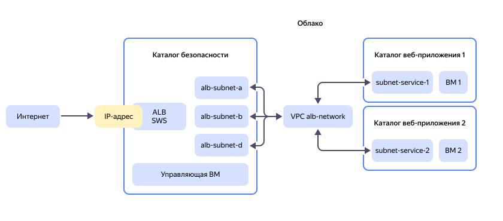

# Создание распределенной инфраструктуры с защищенным доступом

В этом руководстве вы создадите инфраструктуру для организации защищенного доступа к веб-приложениям, размещенным в разных каталогах {{ yandex-cloud }}. Для контроля трафика все запросы к веб-приложениям будут приниматься на общий IP-адрес и проверяться правилами профиля безопасности [{{ sws-full-name }}](https://yandex.cloud/ru/services/smartwebsecurity).

Такой подход позволяет изолировать ресурсы, с которыми работают разные команды, и обеспечить общую политику безопасности для входящего трафика.

Это руководство — частный сценарий руководства [Централизованная публикация в интернете и защита от DDoS-атак приложений в разных каталогах](../../smartwebsecurity/tutorials/different-folders-services.md). В руководстве приведен пример сценария создания всей инфраструктуры с нуля.

Минимальные [роли](../../iam/roles-reference.md), необходимые для выполнения руководства:

* На облако:
    * `{{ roles-resource-manager-admin }}` — для создания каталогов и назначения ролей.

* На каталоги:
    * `{{ roles-vpc-admin }}` — для создания ресурсов в {{ vpc-full-name }}.
    * `smart-web-security.editor` — для создания профиля безопасности.
    * `compute.editor` — для создания виртуальных машин.
    * `{{ roles-alb-editor }}` — для создания ресурсов в {{ alb-full-name }}


## Схема размещения ресурсов в {{ yandex-cloud }} {#resource-allocation-scheme}



На схеме обозначены следующие ресурсы:

* **IP-адрес** — публичный IP-адрес или домен, на который поступают запросы к веб-приложениям.
* **Каталог безопасности** `secured-entry-point` — [каталог](../../resource-manager/concepts/resources-hierarchy.md#folder), доступ к которому должны иметь только администраторы ресурсов компании и сотрудники службы информационной безопасности (СИБ). В этом каталоге будут располагаться:

    * **ALB** `app-load-balancer` — [L7-балансировщик](../../application-load-balancer/concepts/application-load-balancer.md) {{ alb-full-name }}, через который веб-приложения публикуются в интернете.
    * **SWS** `sws-profile` — [профиль безопасности](../../smartwebsecurity/concepts/profiles.md) {{ sws-full-name }} для защиты трафика на уровне приложений (L7).
    * **Управляющая ВМ** `work-station` — [виртуальная машина](../../compute/concepts/vm.md) {{ compute-full-name }}, с которой происходит подключение к ВМ в каталогах веб-приложений.

* **VPC** `alb-network` — [облачная сеть](../../vpc/concepts/network.md) {{ vpc-full-name }}, которая объединяет [подсети](../../vpc/concepts/network.md#subnet) в разных каталогах:

    * **alb-subnet-a**, **alb-subnet-b**, **alb-subnet-d** — подсети с узлами ALB в трех зонах доступности.
    * **subnet-service-1**, **subnet-service-2** — подсети с ресурсами веб-приложений.

* **Каталоги веб-приложений** `service-1` и `service-2` с целевыми ресурсами веб-приложений — ВМ `vm-service-1` и `vm-service-2`. Доступ к этим каталогам будут иметь команды, разрабатывающие веб-сервисы.

Чтобы создать инфраструктуру и организовать защищенный доступ к веб-приложениям:

1. [Подготовьте облако к работе](#prepare-cloud).
1. [Создайте каталог безопасности](#create-alb-folder).
1. [Создайте виртуальную сеть и подсети](#create-vpc).
1. [Создайте каталоги для веб-приложений](#create-web-folders).
1. [Подключите каталоги веб-приложений к внутренним подсетям балансировщика](#connect-folders).
1. [Настройте группы безопасности](#setup-security-groups).
1. [Настройте профиль безопасности](#setup-sws).
1. [Создайте ресурсы](#create-resources).
1. [Настройте балансировщик](#setup-alb).
1. [Проверьте инфраструктуру](#check-infrastructure).

Если созданные ресурсы вам больше не нужны, [удалите их](#clear-out).


## Подготовьте облако к работе {#prepare-cloud}




### Необходимые платные ресурсы {#paid-resources}

В стоимость поддержки инфраструктуры входит:

* плата за постоянно работающие ВМ (см. [тарифы {{ compute-full-name }}](../../compute/pricing.md));
* плата за использование {{ alb-name }} (см. [тарифы {{ alb-full-name }}](../../application-load-balancer/pricing.md));
* плата за использование публичных IP-адресов и исходящий трафик (см. [тарифы {{ vpc-full-name }}](../../vpc/pricing.md));
* плата за количество запросов в сервис {{ sws-name }} (см. [тарифы {{ sws-full-name }}](../../smartwebsecurity/pricing.md)).


## Создайте каталог безопасности {#create-alb-folder}

В каталоге безопасности будут располагаться балансировщик нагрузки, облачная сеть, подсети и профиль безопасности.


### Создайте каталог без сети {#folder-without-net}



- Консоль управления {#console}

  1. В [консоли управления]({{ link-console-main }}) выберите облако и нажмите  **{{ ui-key.yacloud.component.console-dashboard.button_action-create-folder }}**.
  1. Введите имя каталога, например, `secured-entry-point`.
  1. В поле **{{ ui-key.yacloud.iam.cloud.folders-create.field_optionally }}** отключите опцию **{{ ui-key.yacloud.iam.cloud.folders-create.field_default-net }}**. Сеть и подсети будут созданы на следующем шаге.
  1. Нажмите **{{ ui-key.yacloud.iam.cloud.folders-create.button_create }}**.




### Назначьте роли на каталог {#set-access-binding}

Предоставьте администраторам инфраструктуры и СИБ доступ к каталогу для управления сетью, балансировщиком и профилем безопасности.



- Консоль управления {#console}

  1. В [консоли управления]({{ link-console-main }}) перейдите в каталог `secured-entry-point`.
  1. Перейдите на вкладку **{{ ui-key.yacloud.common.resource-acl.label_access-bindings }}**.
  1. Нажмите **{{ ui-key.yacloud.common.resource-acl.button_configure-access }}**.
  1. В открывшемся окне выберите раздел **{{ ui-key.yacloud_components.acl.label.user-accounts }}**.
  1. Выберите пользователя из списка или воспользуйтесь поиском по пользователям.
  1. Нажмите  **{{ ui-key.yacloud_components.acl.button.add-role }}** и выберите [роль](../../iam/roles-reference.md) из списка или воспользуйтесь поиском. Минимально необходимые роли:

      * `{{ roles-alb-editor }}` — управление ресурсами сервиса [{{ alb-name }}](../../application-load-balancer/).
      * `{{ roles-vpc-user }}` — подключение к сетевым ресурсам [{{ vpc-name }}](../../vpc/) и их использование.
      * `smart-web-security.editor` — использование профилей безопасности [{{ sws-name }}](../../smartwebsecurity/) и управление ими.
      * `compute.editor` — возможность создавать, обновлять и удалять ВМ [{{ compute-name }}](../../compute/).

  1. Нажмите **{{ ui-key.yacloud_components.acl.action.apply }}**.




## Создайте виртуальную сеть и подсети {#create-vpc}

В каталоге безопасности создайте сеть с подсетями для L7-балансировщика и каталогов веб-приложений. Это обеспечит сетевую связность между L7-балансировщиком и ресурсами веб-приложений.



- Консоль управления {#console}

  1. Перейдите в созданный каталог `secured-entry-point`.
  1. В списке сервисов выберите **{{ ui-key.yacloud.iam.folder.dashboard.label_vpc }}**.
  1. Справа сверху нажмите **{{ ui-key.yacloud.vpc.networks.button_create }}**.
  1. В поле **{{ ui-key.yacloud.vpc.networks.create.field_name }}** введите `alb-network`.
  1. В поле **{{ ui-key.yacloud.vpc.networks.create.field_advanced }}** отключите опцию **{{ ui-key.yacloud.vpc.networks.create.field_is-default }}**.
  1. Нажмите **{{ ui-key.yacloud.vpc.networks.button_create }}**.
  1. На панели слева выберите  **{{ ui-key.yacloud.vpc.switch_networks }}**.
  1. Справа сверху нажмите **{{ ui-key.yacloud.vpc.subnetworks.button_action-create }}** и введите параметры подсети для каталога веб-приложений:

      1. **{{ ui-key.yacloud.vpc.subnetworks.create.field_name }}** — `subnet-service-1`.
      1. **{{ ui-key.yacloud.vpc.subnetworks.create.field_zone }}** — `{{ region-id }}-a`.
      1. **{{ ui-key.yacloud.vpc.subnetworks.create.field_network }}** — `alb-network`.
      1. **{{ ui-key.yacloud.vpc.subnetworks.create.field_ip }}** — `10.121.0.0/24`.
      1. Нажмите **{{ ui-key.yacloud.vpc.subnetworks.create.button_create }}**.

  1. Аналогично создайте подсеть с именем `subnet-service-2` в зоне доступности `{{ region-id }}-b` с диапазоном IP-адресов `10.122.0.0/24`.
  1. Создайте подсети для L7-балансировщика в разных зонах доступности и с разными диапазонами адресов:

      * `subnet-alb-a` — `{{ region-id }}-a`, `10.131.0.0/24`.
      * `subnet-alb-b` — `{{ region-id }}-b`, `10.132.0.0/24`.
      * `subnet-alb-d` — `{{ region-id }}-d`, `10.133.0.0/24`.

   


## Создайте каталоги для веб-приложений {#create-web-folders}

В каталогах будут размещаться ресурсы веб-приложений. В этом руководстве — виртуальные машины с тестовыми веб-сервисами. Создайте каталоги и предоставьте пользователям доступ для подключения к сетевым ресурсам и управления ВМ.



- Консоль управления {#console}

  1. Выберите облако и нажмите  **{{ ui-key.yacloud.component.console-dashboard.button_action-create-folder }}**.
  1. Введите имя каталога, например, `service-1`.
  1. В поле **{{ ui-key.yacloud.iam.cloud.folders-create.field_optionally }}** отключите опцию **{{ ui-key.yacloud.iam.cloud.folders-create.field_default-net }}**.
  1. Нажмите **{{ ui-key.yacloud.iam.cloud.folders-create.button_create }}**.
  1. Аналогично создайте каталог `service-2`.
  1. Для ограничения доступа к каталогам [назначьте роли](#set-access-binding) пользователям в зависимости от ресурсов, которые будут размещены в каталоге. Минимально необходимые роли на каталоги `service-1` и `service-2`:

      * `vpc.user` — подключение к сетевым ресурсам [{{ vpc-name }}](../../vpc/) и их использование.
      * `compute.editor` — возможность создавать, обновлять и удалять ВМ.




## Подключите каталоги веб-приложений к внутренним подсетям балансировщика {#connect-folders}

Чтобы объединить ресурсы каталогов в общую сеть, [переместите](../../vpc/operations/subnet-move.md) подсети виртуальной сети в каталоги веб-приложений.



- Консоль управления {#console}

  1. В [консоли управления]({{ link-console-main }}) перейдите в каталог `secured-entry-point`.
  1. В списке сервисов выберите **{{ ui-key.yacloud.iam.folder.dashboard.label_vpc }}**.
  1. Выберите облачную сеть `alb-network`.
  1. Нажмите  в строке подсети `subnet-service-1` и выберите **{{ ui-key.yacloud.vpc.button_move-vpc-object }}**.
  1. В выпадающем списке выберите каталог `service-1`.
  1. Нажмите **{{ ui-key.yacloud.vpc.button_move-vpc-object }}**.
  1. Аналогично переместите подсеть `subnet-service-2` в каталог `service-2`.




## Настройте группы безопасности {#setup-security-groups}

[Группы безопасности](../../vpc/concepts/security-groups.md) позволяют настроить правила для входящего и исходящего трафика. В этом руководстве входящий трафик из интернета принимается L7-балансировщиком и маршрутизируется по внутренней сети на ВМ веб-приложений. Настройте группы безопасности в каждом из каталогов в соответствии с [рекомендациями](../../application-load-balancer/concepts/application-load-balancer.md#security-groups).


### Создайте группы безопасности для ВМ веб-приложений {#sg-vm-apps}

Правила должны разрешать исходящий и входящий трафик от подсети балансировщика.



- Консоль управления {#console}

  1. В [консоли управления]({{ link-console-main }}) выберите каталог `service-1`.
  1. В списке сервисов выберите **{{ ui-key.yacloud.iam.folder.dashboard.label_vpc }}**.
  1. На панели слева выберите  **{{ ui-key.yacloud.vpc.label_security-groups }}**.
  1. Справа сверху нажмите **{{ ui-key.yacloud.vpc.network.security-groups.button_create }}**.
  1. В поле **{{ ui-key.yacloud.vpc.network.security-groups.forms.field_sg-name }}** укажите `service-1-security-group`.
  1. В поле **{{ ui-key.yacloud.vpc.network.security-groups.forms.field_sg-network }}** выберите сеть `alb-network` из каталога `secured-entry-point`.
  1. В блоке **{{ ui-key.yacloud.vpc.network.security-groups.forms.label_section-rules }}** создайте следующие правила по инструкции под таблицей:

      | Направление<br/>трафика | {{ ui-key.yacloud.vpc.network.security-groups.forms.field_sg-rule-description }} | {{ ui-key.yacloud.vpc.network.security-groups.forms.field_sg-rule-port-range }} | {{ ui-key.yacloud.vpc.network.security-groups.forms.field_sg-rule-protocol }} | Источник /<br/>назначение | {{ ui-key.yacloud.vpc.network.security-groups.forms.field_sg-rule-cidr-blocks }} |
      | --- | --- | --- | --- | --- | --- |
      | `Входящий` | `http` | `8000` | `{{ ui-key.yacloud.common.label_tcp }}` | `{{ ui-key.yacloud.vpc.network.security-groups.forms.value_sg-rule-destination-cidr }}` | `10.131.0.0/24`<br/>`10.132.0.0/24`<br/>`10.133.0.0/24` |
      | `Входящий` | `ssh` | `22` | `{{ ui-key.yacloud.common.label_tcp }}` | `{{ ui-key.yacloud.vpc.network.security-groups.forms.value_sg-rule-destination-cidr }}` | `10.133.0.0/24` |
      | `Исходящий` | `any` | `0-65535` | `{{ ui-key.yacloud.vpc.network.security-groups.forms.value_any }}` | `{{ ui-key.yacloud.vpc.network.security-groups.forms.value_sg-rule-destination-cidr }}` | `10.131.0.0/24`<br/>`10.132.0.0/24`<br/>`10.133.0.0/24` |

      

  1. Нажмите **{{ ui-key.yacloud.common.create }}**.
  1. Аналогично создайте группу безопасности `service-2-security-group` в каталоге `service-2`.




### Создайте группу безопасности для L7-балансировщика {#sg-balancer}

Правила должны разрешать входящий трафик из интернета на порт `80` и трафик для проверки состояния узлов балансировщика на порт `30080` с источником `{{ ui-key.yacloud.vpc.network.security-groups.forms.value_sg-rule-sg-type-balancer }}`.



- Консоль управления {#console}

  1. В [консоли управления]({{ link-console-main }}) выберите каталог `secured-entry-point`.
  1. В списке сервисов выберите **{{ ui-key.yacloud.iam.folder.dashboard.label_vpc }}**.
  1. На панели слева выберите  **{{ ui-key.yacloud.vpc.label_security-groups }}**.
  1. Справа сверху нажмите **{{ ui-key.yacloud.vpc.network.security-groups.button_create }}**.
  1. В поле **{{ ui-key.yacloud.vpc.network.security-groups.forms.field_sg-name }}** укажите `alb-security-group`.
  1. В поле **{{ ui-key.yacloud.vpc.network.security-groups.forms.field_sg-network }}** выберите сеть `alb-network`.
  1. В блоке **{{ ui-key.yacloud.vpc.network.security-groups.forms.label_section-rules }}** создайте следующие правила по инструкции под таблицей:

      | Направление<br/>трафика | {{ ui-key.yacloud.vpc.network.security-groups.forms.field_sg-rule-description }} | {{ ui-key.yacloud.vpc.network.security-groups.forms.field_sg-rule-port-range }} | {{ ui-key.yacloud.vpc.network.security-groups.forms.field_sg-rule-protocol }} | Источник /<br/>назначение | {{ ui-key.yacloud.vpc.network.security-groups.forms.field_sg-rule-cidr-blocks }} |
      | --- | --- | --- | --- | --- | --- |
      | `Входящий` | `http` | `80` | `{{ ui-key.yacloud.common.label_tcp }}` | `{{ ui-key.yacloud.vpc.network.security-groups.forms.value_sg-rule-destination-cidr }}` | `0.0.0.0/0` |
      | `Входящий` | `healthchecks` | `30080` | `{{ ui-key.yacloud.common.label_tcp }}` | `{{ ui-key.yacloud.vpc.network.security-groups.forms.value_sg-rule-sg-type-balancer }}` | — |
      | `Исходящий` | `http` | `8000` | `{{ ui-key.yacloud.vpc.network.security-groups.forms.value_any }}` | `{{ ui-key.yacloud.vpc.network.security-groups.forms.value_sg-rule-destination-cidr }}` | `10.121.0.0/24`<br/>`10.122.0.0/24` |

      

  1. Нажмите **{{ ui-key.yacloud.common.create }}**.




### Создайте группы безопасности для управляющей ВМ {#sg-vm}

Правила должны разрешать исходящий трафик от управляющей ВМ к порту `22` ВМ веб-приложений.



- Консоль управления {#console}

  1. В [консоли управления]({{ link-console-main }}) выберите каталог `secured-entry-point`.
  1. В списке сервисов выберите **{{ ui-key.yacloud.iam.folder.dashboard.label_vpc }}**.
  1. На панели слева выберите  **{{ ui-key.yacloud.vpc.label_security-groups }}**.
  1. Справа сверху нажмите **{{ ui-key.yacloud.vpc.network.security-groups.button_create }}**.
  1. В поле **{{ ui-key.yacloud.vpc.network.security-groups.forms.field_sg-name }}** укажите `vm-security-group`.
  1. В поле **{{ ui-key.yacloud.vpc.network.security-groups.forms.field_sg-network }}** выберите сеть `alb-network`.
  1. В блоке **{{ ui-key.yacloud.vpc.network.security-groups.forms.label_section-rules }}** создайте следующие правила по инструкции под таблицей:

      | Направление<br/>трафика | {{ ui-key.yacloud.vpc.network.security-groups.forms.field_sg-rule-description }} | {{ ui-key.yacloud.vpc.network.security-groups.forms.field_sg-rule-port-range }} | {{ ui-key.yacloud.vpc.network.security-groups.forms.field_sg-rule-protocol }} | Источник /<br/>назначение | {{ ui-key.yacloud.vpc.network.security-groups.forms.field_sg-rule-cidr-blocks }} |
      | --- | --- | --- | --- | --- | --- |
      | `Входящий` | `ssh` | `22` | `{{ ui-key.yacloud.common.label_tcp }}` | `{{ ui-key.yacloud.vpc.network.security-groups.forms.value_sg-rule-destination-cidr }}` | `0.0.0.0/0` ^*^ |
      | `Исходящий` | `ssh` | `22` | `{{ ui-key.yacloud.common.label_tcp }}` | `{{ ui-key.yacloud.vpc.network.security-groups.forms.value_sg-rule-destination-cidr }}` | `10.121.0.0/24`<br/>`10.122.0.0/24` |

      ^*^ Рекомендуется вместо `0.0.0.0/0` указать CIDR блоки публичных IP-адресов, с которых вы хотите разрешить подключение к управляющей ВМ.

      

  1. Нажмите **{{ ui-key.yacloud.common.create }}**.




## Настройте профиль безопасности {#setup-sws}

Профиль безопасности содержит [правила](../../smartwebsecurity/concepts/rules.md) фильтрации трафика для защиты от информационных угроз на прикладном уровне L7 модели OSI.

Создайте профиль безопасности по преднастроенному шаблону:



- Консоль управления {#console}

  1. В [консоли управления]({{ link-console-main }}) выберите каталог `secured-entry-point`.
  1. В списке сервисов выберите **{{ ui-key.yacloud.iam.folder.dashboard.label_smartwebsecurity }}**.
  1. На панели слева выберите  **{{ ui-key.yacloud.smart-web-security.title_profiles }}** и нажмите **{{ ui-key.yacloud.smart-web-security.action_empty }}**.
  1. Выберите **{{ ui-key.yacloud.smart-web-security.title_default-template }}**.
  1. Введите имя профиля — `sws-profile`.
  1. В поле **{{ ui-key.yacloud.smart-web-security.form.label_default-action }}** выберите `{{ ui-key.yacloud.smart-web-security.form.label_action-allow }}`.
  1. Нажмите **{{ ui-key.yacloud.smart-web-security.action_empty }}**.




## Создайте ресурсы {#create-resources}

В качестве ресурсов будут использоваться виртуальные машины, по одной в каждом каталоге. ВМ в каталоге безопасности `secured-entry-point` необходима для доступа к виртуальным машинам веб-приложений по внутренней сети. В этом руководстве она называется _управляющей ВМ_.

Для ограничения внешнего трафика виртуальные машины веб-приложений не будут иметь внешний IP-адрес.


### Создайте ВМ для управления веб-приложениями {#vm-secured-entry-point}



- Консоль управления {#console}

  1. В [консоли управления]({{ link-console-main }}) выберите каталог `secured-entry-point`.
  1. В списке сервисов выберите **{{ ui-key.yacloud.iam.folder.dashboard.label_compute }}**.
  1. На панели слева выберите  **{{ ui-key.yacloud.compute.group.switch_instances }}**.
  1. Нажмите **{{ ui-key.yacloud.compute.instances.button_create }}**.
  1. В блоке **{{ ui-key.yacloud.compute.instances.create.section_image }}** выберите операционную систему [Ubuntu 24.04](/marketplace/products/yc/ubuntu-2404-lts-oslogin).
  1. В блоке **{{ ui-key.yacloud.k8s.node-groups.create.section_allocation-policy }}** выберите зону доступности `{{ region-id }}-d`.
  1. В блоке **{{ ui-key.yacloud.compute.instances.create.section_network }}**:

      * В поле **{{ ui-key.yacloud.component.compute.network-select.field_subnetwork }}** убедитесь, что выбрана подсеть `subnet-alb-d`.
      * В поле **{{ ui-key.yacloud.component.compute.network-select.field_external }}** оставьте значение `{{ ui-key.yacloud.component.compute.network-select.switch_auto }}`.
      * В поле **{{ ui-key.yacloud.compute.instances.create.field_security-groups }}** выберите группу безопасности `vm-security-group`.

  1. В блоке **{{ ui-key.yacloud.compute.instances.create.section_access }}** выберите вариант **{{ ui-key.yacloud.compute.instance.access-method.label_oslogin-control-ssh-option-title }}**.
  1. В поле **{{ ui-key.yacloud.compute.instances.create.field_user }}** введите имя пользователя ВМ. Не используйте имена `root`, `admin` или другие, зарезервированные ОС.
  1. В поле **{{ ui-key.yacloud.compute.instances.create.field_key }}** выберите SSH-ключ, сохраненный в вашем профиле [пользователя организации](../../organization/concepts/membership.md).

      Чтобы добавить новый ключ:

      1. Нажмите **{{ ui-key.yacloud.compute.instances.create.button_add-ssh-key }}**.
      1. Задайте имя SSH-ключа.
      1. Выберите вариант:

          * `{{ ui-key.yacloud_components.ssh-key-add-dialog.value_radio-manual }}` — вставьте содержимое открытого [SSH](../../glossary/ssh-keygen.md)-ключа. Пару SSH-ключей необходимо [создать](../../compute/operations/vm-connect/ssh.md#creating-ssh-keys) самостоятельно.
          * `{{ ui-key.yacloud_components.ssh-key-add-dialog.value_radio-upload }}` — загрузите открытую часть SSH-ключа. Пару SSH-ключей необходимо создать самостоятельно.
          * `{{ ui-key.yacloud_components.ssh-key-add-dialog.value_radio-generate }}` — автоматическое создание пары SSH-ключей.

      1. Нажмите **{{ ui-key.yacloud.common.add }}**.

  1. В блоке **{{ ui-key.yacloud.compute.instances.create.section_base }}** задайте имя ВМ `work-station`.
  1. Нажмите **{{ ui-key.yacloud.compute.instances.create.button_create }}**.




### Создайте ВМ для веб-приложений {#vm-web-app}

Аналогично создайте ВМ в каталогах `service-1` и `service-2`, при этом:

* Выберите зоны доступности `{{ region-id }}-a` и `{{ region-id }}-b` соответственно.
* Убедитесь, что для ВМ выбраны подсети `subnet-service-1` и `subnet-service-2` соответственно.
* В поле **{{ ui-key.yacloud.component.compute.network-select.field_external }}** выберите опцию `{{ ui-key.yacloud.component.compute.network-select.switch_none }}`.
* В поле **{{ ui-key.yacloud.compute.instances.create.field_security-groups }}** выберите группы безопасности `service-1-security-group` и `service-2-security-group`.
* Укажите имена ВМ `vm-service-1` и `vm-service-2`.


## Настройте балансировщик {#setup-alb}

Создайте и настройте балансировщик с помощью [визарда](../../application-load-balancer/concepts/index.md#alb-wizard).



Визард позволяет создать и подключить только одну [целевую группу](../../application-load-balancer/concepts/target-group.md) и только одну [группу бэкендов](../../application-load-balancer/concepts/backend-group.md), то есть ресурсы из одного каталога. Ресурсы второго каталога нужно подключить вручную.




### Запустите визард {#start-wizard}



- Консоль управления {#console}

  1. В [консоли управления]({{ link-console-main }}) выберите каталог `secured-entry-point`.
  1. В списке сервисов выберите **{{ ui-key.yacloud.iam.folder.dashboard.label_application-load-balancer }}**.
  1. Нажмите **{{ ui-key.yacloud.alb.button_load-balancer-create }}** и выберите **{{ ui-key.yacloud.alb.label_alb-create-wizard }}**. Визард перейдет на страницу создания целевых групп.




### Настройте целевую группу {#setup-target-group}

В целевые группы входят ВМ, созданные в каталогах веб-приложений. Целевые группы будут подключены к балансировщику через внутренние подсети.

Создайте целевую группу для каталога `service-1`:



- Консоль управления {#console}

  1. Введите имя целевой группы: `target-group-1`.
  1. В списке целевых ресурсов будет указан только IP-адрес управляющей ВМ. Добавьте в список ресурсов новый целевой ресурс:

      1. Под списком ресурсов в блоке с кнопкой **{{ ui-key.yacloud.alb.button_add-target }}** укажите внутренний IP-адрес ВМ `vm-service-1`.
      1. Там же выберите подсеть `subnet-service-1` в выпадающем списке с плейсхолдером `Не выбрано`. Чтобы найти нужную подсеть, включите опцию `Во всех каталогах`.
      1. Нажмите **{{ ui-key.yacloud.alb.button_add-target }}**.
      1. Активируйте новый целевой ресурс в списке ресурсов.
      1. Убедитесь, что ресурс управляющей ВМ деактивирован.

  1. Нажмите **{{ ui-key.yacloud.alb.button_wizard-create-tg }}**. Визард перейдет на страницу создания группы бэкендов.




### Настройте группы бэкендов {#settings-backend-group}

Группы бэкендов содержат настройки балансировки трафика и [проверок состояния](../../application-load-balancer/concepts/best-practices.md) целевых ресурсов. Визард автоматически создает один бэкенд и одну группу проверки состояния. В качестве целевой группы будет выбрана группа, созданная на предыдущем шаге.



- Консоль управления {#console}

  1. Включите **{{ ui-key.yacloud.alb.label_detailed-settings }}**.
  1. Введите имя группы бэкендов: `backend-group-1`.
  1. Тип группы оставьте `HTTP`.
  1. Чтобы запросы одной пользовательской сессии обрабатывал один и тот же ресурс бэкенда, активируйте опцию **{{ ui-key.yacloud.alb.label_session-affinity }}**.
  1. В блоке **{{ ui-key.yacloud_billing.alb.label_backends }}**:

      * Введите имя бэкенда: `backend-1`.
      * Оставьте тип бэкенда — `Целевая группа`.
      * Оставьте созданную ранее целевую группу: `target-group-1`.
      * Укажите TCP-порт вашего сервиса, который вы открыли в группе безопасности `service-1-security-group`. В этом руководстве это порт `8000`.

  1. В блоке **HTTP проверка состояния**:

      * Укажите тот же порт, который вы указали выше — `8000`.
      * В поле **{{ ui-key.yacloud_billing.alb.label_path }}** оставьте значение без изменений, поскольку тестовый сервис не имеет специально выделенного эндпоинта для проверки состояния.

  1. Нажмите **{{ ui-key.yacloud.alb.button_wizard-create-tg }}**. Визард перейдет на страницу настройки HTTP-роутера.




### Настройте HTTP-роутер {#settings-http-router}

[HTTP-роутер](../../application-load-balancer/concepts/http-router.md) определяет правила маршрутизации запросов к бэкендам и позволяет модифицировать запросы прямо на балансировщике. Визард автоматически создает виртуальный хост и правило маршрутизации. В качестве группы бэкендов будет выбрана группа, созданная на предыдущем шаге.



- Консоль управления {#console}

  1. Введите имя роутера: `alb-http-router`.
  1. Включите **{{ ui-key.yacloud.alb.label_detailed-settings }}**.
  1. В блоке **{{ ui-key.yacloud.alb.label_virtual-hosts }}**:

      * В поле **{{ ui-key.yacloud.common.name }}** введите имя хоста: `alb-virtual-host`.
      * Поле **{{ ui-key.yacloud.alb.label_authority }}** оставьте пустым.
      * В поле **{{ ui-key.yacloud.alb.label_security-profile-id }}** выберите профиль `sws-profile`, созданный ранее.

  1. Задайте параметры маршрута:

      * Имя маршрута — `app-1`.
      * **{{ ui-key.yacloud.alb.label_path }}** — **{{ ui-key.yacloud.alb.label_match-prefix }}** и далее `/app1`.
      * **{{ ui-key.yacloud.alb.label_route-action }}** — `{{ ui-key.yacloud.alb.label_route-action-route }}`.
      * **{{ ui-key.yacloud.alb.label_backend-group }}** — оставьте созданную ранее группу.
      * **{{ ui-key.yacloud.alb.label_prefix-rewrite }}** — укажите путь `/`.

  1. Нажмите **{{ ui-key.yacloud.alb.button_wizard-create-tg }}**. Визард перейдет на страницу настройки балансировщика.




### Настройте L7-балансировщик {#create-load-balancer}

Балансировщик нагрузки принимает запросы и распределяет их по ВМ из целевой группы в соответствии с правилами, указанными в HTTP-роутере. Для приема трафика балансировщик использует [обработчики](../../application-load-balancer/concepts/application-load-balancer.md#listener). Визард создаст обработчик автоматически. В качестве HTTP-роутера будет выбран роутер, созданный на предыдущем шаге.



- Консоль управления {#console}

  1. Введите имя балансировщика: `app-load-balancer`.
  1. Включите **{{ ui-key.yacloud.alb.label_detailed-settings }}**.
  1. В блоке **{{ ui-key.yacloud.mdb.forms.section_network-settings }}** выберите созданную ранее сеть `alb-network`.
  1. Для **{{ ui-key.yacloud.alb.label_security-groups }}** выберите **{{ ui-key.yacloud.component.security-group-field.label_sg-from-list }}** и далее группу безопасности балансировщика `alb-security-group`.
  1. В блоке **{{ ui-key.yacloud.alb.section_allocation-settings }}** выберите ранее созданные подсети `subnet-alb-a`, `subnet-alb-b` и `subnet-alb-d` в соответствующих [зонах доступности](../../overview/concepts/geo-scope.md) и включите прием трафика в этих подсетях.
  1. Настройте обработчик:

      * Введите имя обработчика: `alb-listener`.
      * В блоке **{{ ui-key.yacloud.alb.section_common-address-specs }}** укажите:

          * **{{ ui-key.yacloud_billing.alb.label_listener-type }}** — `HTTP`.
          * **{{ ui-key.yacloud.alb.label_protocol }}** — `HTTP`.
          * **{{ ui-key.yacloud.alb.label_http-router }}** — выберите созданный ранее роутер.

  1. Нажмите **{{ ui-key.yacloud.common.create }}**.




### Подключите ресурсы второго каталога {#add-second-folder}

При создании балансировщика с помощью визарда возможно подключить ресурсы только одного каталога. Поэтому целевую группу и группу бэкендов каталога `service-2` необходимо создать и подключить вручную.



- Консоль управления {#console}

  1. В [консоли управления]({{ link-console-main }}) выберите каталог `secured-entry-point`.
  1. В списке сервисов выберите **{{ ui-key.yacloud.iam.folder.dashboard.label_application-load-balancer }}**.
  1. На панели слева выберите  **{{ ui-key.yacloud.alb.label_target-groups }}**.
  1. Нажмите **{{ ui-key.yacloud.alb.button_target-group-create }}**.
  1. Создайте целевую группу для каталога `service-2` по образцу [целевой группы для каталога `service-1`](#setup-target-group). В качестве параметров целевого ресурса используйте:

      * Имя — `target-group-2`.
      * Внутренний IP-адрес ВМ — `vm-service-2`.
      * Подсеть — `subnet-service-2`.

  1. На панели слева выберите  **{{ ui-key.yacloud.alb.label_backend-groups }}**.
  1. Нажмите **{{ ui-key.yacloud.alb.button_backend-group-create }}**.
  1. Создайте группу бэкендов по образцу [группы бэкендов для каталога `service-1`](#settings-backend-group). В качестве параметров бэкенда используйте:

      * Имя группы бэкендов — `backend-group-2`.
      * Имя бэкенда — `backend-2`.
      * Целевая группа — `target-group-2`.
      * Путь — такой же, как у группы бэкендов `backend-group-1`.
      * Порт — TCP-порт вашего сервиса, который вы открыли в группе безопасности `service-2-security-group`. В этом руководстве — `8000`.

  1. На панели слева выберите  **{{ ui-key.yacloud.alb.label_http-routers }}**.
  1. Выберите HTTP-роутер `alb-http-router`.
  1. В блоке **{{ ui-key.yacloud.alb.label_virtual-hosts }}** справа от `alb-virtual-host` нажмите  →  **{{ ui-key.yacloud.common.edit }}**.
  1. Внизу открывшегося окна нажмите **{{ ui-key.yacloud.alb.button_add-route }}**.
  1. Задайте параметры маршрута:

      * Имя маршрута — `app-2`.
      * **{{ ui-key.yacloud.alb.label_path }}** — **{{ ui-key.yacloud.alb.label_match-prefix }}** и далее `/app2`.
      * **{{ ui-key.yacloud.alb.label_route-action }}** — `{{ ui-key.yacloud.alb.label_route-action-route }}`.
      * **{{ ui-key.yacloud.alb.label_backend-group }}** — `backend-group-2`.
      * **{{ ui-key.yacloud.alb.label_prefix-rewrite }}** — укажите путь `/`.
      * В поле **{{ ui-key.yacloud.alb.label_timeout }}** удалите значение и оставьте поле пустым.

  1. Нажмите **{{ ui-key.yacloud.common.save }}**.



## Проверьте инфраструктуру {#check-infrastructure}

1. [Запустите тестовые веб-сервисы на ВМ веб-приложений](#run-web-services).
1. [Посмотрите проверки состояний](#check-healthchecking).
1. [Проверьте доступность веб-приложений](#check-accessibility).
1. [Проверьте работу профиля безопасности](#check-security-profile).

### Запустите тестовые веб-сервисы на ВМ веб-приложений {#run-web-services}

1. Подключитесь к управляющей ВМ `work-station` в каталоге безопасности:

    ```bash
    ssh -l <имя_пользователя> <публичный_IP-адрес_ВМ>
    ```

    Если вы используете разные ключи для разных ВМ, укажите путь к нужному ключу в команде подключения, например:

    ```bash
    ssh -i ~/.ssh/<имя_ключа> -l <имя_пользователя> <публичный_IP-адрес_ВМ>
    ```

    Где:

    * `<имя_ключа>` — имя файла приватного SSH-ключа, использованного при создании ВМ.
    * `<имя_пользователя>` — логин, указанный при создании ВМ.
    * `<публичный_IP-адрес_ВМ>` — IP-адрес ВМ.

    

    Команду подключения к ВМ можно скопировать на странице описания ВМ в блоке **{{ ui-key.yacloud.compute.instances.create.section_access }}**.

    

1. С управляющей ВМ подключитесь к ВМ `vm-service-1`:

    1. Поместите файл с приватным SSH-ключом ВМ `vm-service-1` в папку `~/.ssh` управляющей ВМ.
    1. Подключитесь к ВМ `vm-service-1`:

        ```bash
        ssh -i ~/.ssh/<имя_ключа> -l <имя_пользователя> <внутренний_IP-адрес_ВМ>
        ```

        Где:

        * `<имя_ключа>` — имя файла приватного SSH-ключа, использованного при создании ВМ.
        * `<имя_пользователя>` — логин, указанный при создании ВМ.
        * `<внутренний_IP-адрес_ВМ>` — внутренний IP-адрес ВМ `vm-service-1`.

1. Запустите тестовый веб-сервис с помощью команды:

    ```bash
    mkdir test-server; \
    echo 'HELLO!' > test-server/hello_3.txt; \
    echo 'TEST SERVER 1' > test-server/test_3.txt; \
    python3 -m http.server -d test-server 8000
    ```

    При запуске команды:

    * Будет создана папка `test-server` с двумя файлами: `hello_1.txt` и `test_1.txt`.
    * Запустится встроенный в Python тестовый веб-сервис на порту `8000`.

    Результат:

    ```text
    Serving HTTP on 0.0.0.0 port 8000 (http://0.0.0.0:8000/) ...
    10.133.0.10 - - [30/May/2025 09:55:41] "GET / HTTP/1.1" 200 -
    10.133.0.15 - - [30/May/2025 09:55:41] "GET / HTTP/1.1" 200 -
    10.133.0.10 - - [30/May/2025 09:55:42] "GET / HTTP/1.1" 200 -
    10.133.0.15 - - [30/May/2025 09:55:42] "GET / HTTP/1.1" 200 -
    10.133.0.10 - - [30/May/2025 09:55:43] "GET / HTTP/1.1" 200 -
    10.133.0.15 - - [30/May/2025 09:55:43] "GET / HTTP/1.1" 200 -
    ...
    ```

1. Откройте новое окно терминала и аналогично запустите тестовый сервис на ВМ `vm-service-2`. В команде запуска используйте другие имена файлов, чтобы ответы от веб-приложений отличались.


### Посмотрите проверки состояний {#check-healthchecking}

1. Перейдите на страницу балансировщика `app-load-balancer`.
1. Слева выберите  **{{ ui-key.yacloud.alb.label_healthchecks }}**.
1. Убедитесь, что целевые ресурсы имеют во всех подсетях балансировщика статусы `HEALTHY`.


### Проверьте доступность веб-приложений {#check-accessibility}

Чтобы проверить доступность веб-приложений, в браузере перейдите по адресу:

```text
http://<публичный_IP-адрес_балансировщика>/<префикс_маршрута>
```

Где:

* `<публичный_IP-адрес_балансировщика>` — IP-адрес балансировщика `app-load-balancer`.
* `<префикс_маршрута>` — префикс, указанный в поле **{{ ui-key.yacloud.alb.label_match-prefix }}** при настройке HTTP-роутера. В этом руководстве — `app1` и `app2`.

Откроется страница со списком файлов в корневой папке соответствующего сервиса, например:

  ```text
  Directory listing for /
    hello_1.txt
    test_1.txt
  ```


### Проверьте работу профиля безопасности {#check-security-profile}

1. Проверьте разрешение трафика правилом `Smart Protection`:

    1. В браузере перейдите по адресу:

        ```text
        http://<публичный_IP-адрес_балансировщика>/<префикс_маршрута>
        ```

    1. На другой вкладке браузера перейдите на страницу балансировщика `app-load-balancer`.
    1. Слева выберите  **{{ ui-key.yacloud.common.logs }}**.
    1. В поле **{{ ui-key.yacloud.logging.label_filter-query }}** укажите [фильтрующее выражение](../../logging/concepts/filter.md):

        ```text
        json_payload.smartwebsecurity.matched_rule.rule_type = SMART_PROTECTION
        and json_payload.smartwebsecurity.matched_rule.verdict = ALLOW
        ```

    1. Нажмите **{{ ui-key.yacloud.logging.button_execute }}**.

        В списке логов останутся записи об успешных GET-запросах.

1. Добавьте запрещающее базовое правило:

    1. Перейдите на страницу профиля безопасности `sws-profile`.
    1. В блоке **{{ ui-key.yacloud.smart-web-security.form.section_security-rules }}** нажмите  **{{ ui-key.yacloud.smart-web-security.arl.label_add-rule }}**.
    1. Введите имя правила: `deny-rule`.
    1. В поле **{{ ui-key.yacloud.smart-web-security.overview.column_priority }}** установите значение `1000`.
    1. В блоке **{{ ui-key.yacloud.smart-web-security.label_search-rule-type }}** оставьте значение **{{ ui-key.yacloud.smart-web-security.overview.label_base-rule }}**.
    1. Параметр **{{ ui-key.yacloud.smart-web-security.overview.column_action-type }}** оставьте в положении **{{ ui-key.yacloud.smart-web-security.overview.cell_sec-action-deny }}**.
    1. Параметр **Трафик** установите в положение `При условии`.
    1. Далее выберите:

        * **{{ ui-key.yacloud.smart-web-security.overview.column_rule-conditions }}** — `IP`.
        * **Условия на IP** — `Совпадает или принадлежит диапазону`.
        * **IP совпадает или принадлежит диапазону** — укажите IP-адрес устройства, с которого проводится тестирование веб-сервиса.

    1. Нажмите **{{ ui-key.yacloud.common.add }}**.

1. Проверьте работу базового правила:

    1. В браузере перейдите по адресу:

        ```text
        http://<публичный_IP-адрес_балансировщика>/<префикс_маршрута>
        ```

    1. На другой вкладке браузера перейдите на страницу балансировщика `app-load-balancer`.
    1. Слева выберите  **{{ ui-key.yacloud.common.logs }}**.
    1. В поле **{{ ui-key.yacloud.logging.label_filter-query }}** укажите фильтрующее выражение:

        ```text
        json_payload.smartwebsecurity.matched_rule.rule_type = RULE_CONDITION
        and json_payload.smartwebsecurity.matched_rule.verdict = DENY
        ```

    1. Нажмите **{{ ui-key.yacloud.logging.button_execute }}**.

        В списке логов останутся записи о заблокированных правилом GET-запросах.


## Как удалить созданные ресурсы {#clear-out}

Чтобы перестать платить за ресурсы, [удалите](../../resource-manager/operations/folder/delete.md) каталоги, в которых была развернута инфраструктура.

Если вы разворачивали инфраструктуру в существующих каталогах:

1. [Удалите](../../application-load-balancer/operations/application-load-balancer-delete.md) L7-балансировщик `app-load-balancer`.
1. [Удалите](../../application-load-balancer/operations/http-router-delete.md) HTTP-роутер `alb-http-router`.
1. [Удалите](../../application-load-balancer/operations/backend-group-delete.md) группы бэкендов `backend-group-1` и `backend-group-2`.
1. [Удалите](../../application-load-balancer/operations/target-group-delete.md) целевые группы `target-group-1` и `target-group-2`.
1. [Удалите](../../compute/operations/vm-control/vm-delete.md) ВМ:

    * `work-station`
    * `vm-service-1`
    * `vm-service-2`

1. [Удалите](../../smartwebsecurity/operations/profile-delete.md) профиль безопасности `sws-profile`.
1. [Удалите](../../vpc/operations/security-group-delete.md) группы безопасности:

    * `alb-security-group`
    * `vm-security-group`
    * `service-1-security-group`
    * `service-2-security-group`

1. [Удалите](../../vpc/operations/subnet-delete.md) подсети:

    * `subnet-service-1`
    * `subnet-service-2`
    * `subnet-alb-a`
    * `subnet-alb-b`
    * `subnet-alb-d`

1. [Удалите](../../vpc/operations/network-delete.md) облачную сеть `alb-network`.