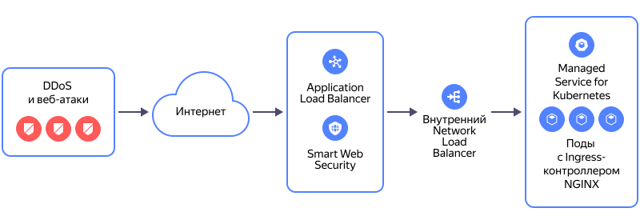

# Миграция сервисов с внешнего балансировщика NLB на L7-балансировщик ALB с целевым ресурсом — внутренним сетевым балансировщиком NLB

Сетевой балансировщик [{{ network-load-balancer-full-name }}](../../network-load-balancer/) может распределять трафик на поды вашего балансировщика, развернутые в кластере [{{ managed-k8s-full-name }}](../../managed-kubernetes/). Если функциональность, настроенная в вашем балансировщике, не поддерживается в [{{ alb-full-name }}](../../application-load-balancer/), то вы можете добавить [внутренний сетевой балансировщик](../../network-load-balancer/concepts/nlb-types.md) для распределения трафика на поды вашего балансировщика и подключить внутренний сетевой балансировщик в качестве целевого ресурса для L7-балансировщика {{ alb-name }} с профилем безопасности [{{ sws-full-name }}](../../smartwebsecurity/).

В этом практическом руководстве рассмотрен вариант, при котором создается внутренний сетевой балансировщик для балансировки трафика на поды [Ingress-контроллера NGINX](../../managed-kubernetes/operations/applications/ingress-nginx.md), развернутые в кластере {{ managed-k8s-name }}, и в целевой группе L7-балансировщика указывается IP-адрес внутреннего сетевого балансировщика.

Схема работы L7-балансировщика с подключенным профилем безопасности {{ sws-name }}:

Вы можете создать инфраструктуру для миграции сервисов с помощью следующих инструментов:
