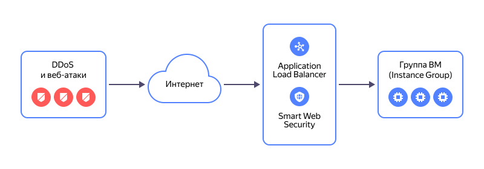

# Миграция сервисов с балансировщика NLB с целевыми ресурсами из группы виртуальных машин (Instance Groups) на L7-балансировщик ALB

В этом практическом руководстве рассмотрен вариант, когда используется интеграция балансировщика [{{ network-load-balancer-full-name }}](../../network-load-balancer/) с группой виртуальных машин (ВМ). Эта группа ВМ отслеживает количество ВМ в группе и при необходимости изменяет состав целевой группы балансировщика. Группа ВМ может интегрироваться только с одним из балансировщиков — сетевым или L7-балансировщиком [{{ alb-full-name }}](../../application-load-balancer/). Поэтому при миграции необходимо изменить для группы ВМ интеграцию с целевой группой: целевую группу сетевого балансировщика заменить на целевую группу L7-балансировщика.

Схема работы L7-балансировщика с подключенным профилем безопасности [{{ sws-full-name }}](../../smartwebsecurity/):

Вы можете создать инфраструктуру для миграции сервисов с помощью следующих инструментов:
