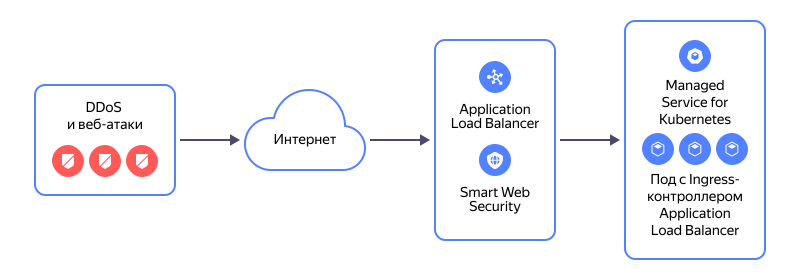

# Миграция сервисов с балансировщика NLB с целевыми ресурсами из кластера {{ managed-k8s-full-name }} на L7-балансировщик ALB


Сетевой балансировщик [{{ network-load-balancer-full-name }}](../../network-load-balancer/) [может использоваться](../../network-load-balancer/concepts/scenarios.md#nlb-mk8s) в составе сервисов внутри кластера [{{ managed-k8s-full-name }}](../../managed-kubernetes/). Кластер самостоятельно создает объекты сетевого балансировщика в соответствии с предоставленными манифестами и следит за составом целевой группы балансировщика, куда попадают виртуальные машины (ВМ) из групп узлов этого кластера.

Одним из вариантов применения сетевого балансировщика в кластере {{ managed-k8s-name }} является его использование в составе [Ingress-контроллера NGINX](../../managed-kubernetes/operations/applications/ingress-nginx.md).

В этом практическом руководстве рассмотрен переход с сетевого балансировщика на L7-балансировщик [{{ alb-full-name }}](../../application-load-balancer/), который создается [Ingress-контроллером {{ alb-name }}](../../application-load-balancer/tools/k8s-ingress-controller/index.md), с подключенным профилем безопасности [{{ sws-full-name }}](../../smartwebsecurity/).

Схема работы L7-балансировщика с подключенным профилем безопасности {{ sws-name }}:



Чтобы мигрировать сервис с сетевого балансировщика на L7-балансировщик:

1. [Ознакомьтесь с рекомендациями по миграции сервисов](#recommendations).
1. [Выполните подготовительные действия](#before-you-begin).
1. [Создайте профиль безопасности {{ sws-name }}](#create-profile-sws).
1. [Установите Ingress-контроллер {{ alb-name }} и создайте ресурсы в кластере {{ managed-k8s-name }}](#install-ingress-nginx). На этом этапе вы подключите профиль безопасности {{ sws-name }} к L7-балансировщику.
1. [Мигрируйте пользовательскую нагрузку с сетевого балансировщика на L7-балансировщик](#migration-nlb-to-alb).

## Рекомендации по миграции сервисов {#recommendations}

1. Дополнительно к защите от DDoS-атак на уровне L7 модели OSI с помощью [{{ sws-full-name }}](../../smartwebsecurity/) рекомендуется подключить защиту от DDoS-атак на уровне L3-L4. Для этого заранее [зарезервируйте статический публичный IP-адрес с защитой от DDoS-атак](../../vpc/operations/enable-ddos-protection.md#enable-on-reservation) и используйте этот адрес для обработчика L7-балансировщика.

    Если у обработчика сетевого балансировщика уже используется публичный IP-адрес с защитой от DDoS, то вы сможете сохранить его и перенести в L7-балансировщик.

    Если у обработчика сетевого балансировщика используется публичный IP-адрес без защиты от DDoS, то для защиты от DDoS-атак на уровне L3-L4 миграция на L7-балансировщик возможна только со сменой публичного IP-адреса для вашего сервиса.

    При использовании защиты от DDoS-атак на уровне L3-L4 настройте порог для срабатывания механизмов защиты на уровне L3-L4, который будет соответствовать объему легитимного трафика на защищаемый ресурс. Для настройки такого порога обратитесь в [техническую поддержку]({{ link-console-support }}).

    Также задайте значение MTU равным `1450` на целевых ресурсах за балансировщиком. Подробнее см. в разделе [Настроить MTU при включении защиты от DDoS-атак](../../vpc/operations/adjust-mtu-ddos-protection.md).

1. Работы по миграции рекомендуется проводить в часы наименьшей пользовательской нагрузки. Если вы планируете сохранить публичный IP-адрес, то учитывайте, что при миграции этот IP-адрес будет переноситься с сетевого балансировщика на L7-балансировщик. В это время ваш сервис будет недоступен. Время недоступности сервиса в штатном режиме может занимать несколько минут. После переноса пользовательской нагрузки с сетевого балансировщика на L7-балансировщик может потребоваться время на автоматическое масштабирование группы ресурсных единиц L7-балансировщика в зависимости от внешней нагрузки на узлы балансировщика.

1. При использовании L7-балансировщика запросы на бэкенды приходят с IP-адресом источника из диапазона внутренних IP-адресов подсетей, указанных при создании L7-балансировщика. Исходный IP-адрес источника запроса (пользователя) фигурирует в заголовке `X-Forwarded-For`. Если необходимо журналировать публичные IP-адреса пользователей на веб-сервере, [измените его конфигурацию](../../troubleshooting/application-load-balancer/how-to/getting-external-src-ip-in-x-forwarded-for-headers.md).

1. Для L7-балансировщика будут созданы по две [ресурсные единицы](../../application-load-balancer/concepts/application-load-balancer.md#lcu-scaling) в каждой из подсетей, которые будут указаны при создании ресурса `Ingress`. В аннотациях `Ingress`-ресурса не поддерживается указание минимального количества ресурсных единиц L7-балансировщика. Группа ресурсных единиц автоматически масштабируется в зависимости от внешней нагрузки на узлы балансировщика.

1. Функциональные возможности балансировщика {{ alb-name }} могут отличаться от возможностей, используемых в вашем балансировщике, развернутом в кластере {{ managed-k8s-name }}. Ознакомьтесь с описанием [Ingress-контроллера {{ alb-name }}](../../application-load-balancer/tools/k8s-ingress-controller/index.md) и [принципами его работы](../../application-load-balancer/tools/k8s-ingress-controller/principles.md).

## Перед началом работы {#before-you-begin}

1. [Создайте подсети](../../vpc/operations/subnet-create.md) в трех зонах доступности. Эти подсети будут использоваться для L7-балансировщика.

1. Создайте [группы безопасности](../../application-load-balancer/tools/k8s-ingress-controller/security-groups.md), которые разрешают L7-балансировщику получать входящий трафик и отправлять его на целевые ресурсы, а также разрешают целевым ресурсам получать входящий трафик от балансировщика.

1. При использовании протокола HTTPS [добавьте TLS-сертификат](../../certificate-manager/operations/import/cert-create.md#create-certificate) вашего сервиса в [{{ certificate-manager-full-name }}](../../certificate-manager/).

1. [Зарезервируйте публичный статический IP-адрес с защитой от DDoS](../../vpc/operations/get-static-ip.md) на уровне L3-L4 для L7-балансировщика. См. [рекомендации по миграции сервисов](#recommendations).

1. Сервисы {{ managed-k8s-name }}, используемые в качестве бэкендов, должны иметь тип `NodePort`. Если ваши сервисы используют другой тип, измените его на `NodePort`. Подробнее об этом типе см. в документации [{{ k8s }}](https://kubernetes.io/docs/concepts/services-networking/service/#type-nodeport).

## Создайте профиль безопасности {{ sws-name }} {#create-profile-sws}

[Создайте профиль безопасности](../../smartwebsecurity/operations/profile-create.md) {{ sws-name }}, выбрав вариант создания **{{ ui-key.yacloud.smart-web-security.title_default-template }}**.

При создании профиля задайте настройки:

* В поле **{{ ui-key.yacloud.smart-web-security.form.label_default-action }}** выберите `{{ ui-key.yacloud.smart-web-security.form.label_action-allow }}`.
* Для правила **{{ ui-key.yacloud.smart-web-security.overview.label_smart-protection-rule }}** включите опцию **{{ ui-key.yacloud.smart-web-security.overview.column_dry-run-rule }} (dry run)**.

С этими настройками будет выполняться только логирование информации о трафике без применения к нему каких-либо действий. Это позволит снизить риск отключения пользователей из-за проблем в настройке профиля. Постепенно вы сможете отключить опцию **{{ ui-key.yacloud.smart-web-security.overview.column_dry-run-rule }} (dry run)** и настроить правила с запрещающими действиями в профиле безопасности для вашего сценария.

## Установите Ingress-контроллер {{ alb-name }} и создайте ресурсы в кластере {{ managed-k8s-name }} {#install-ingress-nginx}

1. [Установите Ingress-контроллер {{ alb-full-name }}](../../managed-kubernetes/operations/applications/alb-ingress-controller.md).

1. Создайте ресурс [IngressClass](../../application-load-balancer/k8s-ref/ingress-class.md) для Ingress-контроллера L7-балансировщика:

    1. Создайте YAML-файл, в котором опишите ресурс `IngressClass`.

        

        ```yaml
        apiVersion: networking.k8s.io/v1
        kind: IngressClass
        metadata:
          labels:
            app.kubernetes.io/component: controller
          name: ingress-alb
        spec:
          controller: ingress.alb.yc.io/yc-alb-ingress-controller
        ```

        

    1. Создайте ресурс `IngressClass` с помощью команды:

        ```bash
        kubectl apply -f <файл_с_ресурсом_IngressClass>
        ```

1. Создайте ресурс `Ingress`:

    1. Ознакомьтесь с описанием [полей и аннотаций ресурса `Ingress`](../../managed-kubernetes/alb-ref/ingress.md) и [примером](../../managed-kubernetes/tutorials/alb-ingress-controller.md#create-ingress-and-apps).

    1. Создайте YAML-файл, в котором опишите ресурс `Ingress`:

        * Заполните раздел [annotations](../../managed-kubernetes/alb-ref/ingress.md#annotations) для настроек L7-балансировщика:

            * `ingress.alb.yc.io/subnets` — идентификаторы подсетей в трех зонах доступности для узлов L7-балансировщика. Идентификаторы перечисляются через запятую без пробелов.
            * `ingress.alb.yc.io/security-groups` — идентификатор одной или нескольких групп безопасности для L7-балансировщика. Идентификаторы нескольких групп перечисляются через запятую без пробелов.
            * `ingress.alb.yc.io/external-ipv4-address` — зарезервированный ранее статический публичный IP-адрес.
            * `ingress.alb.yc.io/group-name` — имя группы ресурсов `Ingress`. Ресурсы `Ingress` объединяются в группы, каждая из которых обслуживается отдельным экземпляром {{ alb-name }} с отдельным публичным IP-адресом.
            * `ingress.alb.yc.io/security-profile-id` — идентификатор созданного ранее профиля безопасности {{ sws-name }}.

                

                Профиль безопасности будет привязан к виртуальному хосту L7-балансировщика. Указание профиля безопасности является ключевым шагом для подключения сервиса {{ sws-name }}.

                

        * Для поля `ingressClassName` укажите имя созданного ранее ресурса `IngressClass`.

        * При использовании протокола HTTPS заполните раздел [tls](../../managed-kubernetes/alb-ref/ingress#tls):

            * `hosts` — доменное имя вашего сервиса, которому соответствует TLS-сертификат.
            * `secretName` — TLS-сертификат вашего сервиса в {{ certificate-manager-full-name }} в формате `yc-certmgr-cert-id-<идентификатор_сертификата>`.

        * Заполните раздел [rules](../../managed-kubernetes/alb-ref/ingress.md#rule) в соответствии с правилами распределения входящего трафика по бэкендам в зависимости от доменного имени (поле `host`) и запрашиваемого ресурса (поле `http.paths`):

            * `host` — имя домена вашего сервиса.
            * `pathType` — тип указания на запрашиваемый ресурс:

                * `Exact` — путь в URI запроса должен совпадать со значением поля `path`.
                * `Prefix` — путь в URI запроса должен начинаться со значения поля `path`.

            * `path` — путь в URI входящего запроса (если тип `Exact`) или его начало (если тип `Prefix`).
            * `backend` — указание на [бэкенд или группу бэкендов](../../managed-kubernetes/alb-ref/ingress.md#backend), которые должны обрабатывать запросы с указанным доменным именем и путем в URI. Укажите либо сервис-бэкенд (`service`), либо группу бэкендов (`resource`), но не оба одновременно:

                * `service` —  сервис {{ managed-k8s-name }}, который должен обрабатывать запросы в качестве бэкенда:

                    * `name` — имя сервиса {{ managed-k8s-name }}. Ресурс `Service`, на который указывает это поле, должен быть описан по [конфигурации](../../application-load-balancer/k8s-ref/service-for-ingress.md).
                    * `port` — порт сервиса, к которому будет обращаться `Ingress`. Для порта сервиса укажите либо номер (`number`), либо имя (`name`), но не оба одновременно.

                    

                    Сервисы {{ managed-k8s-name }}, используемые в качестве бэкендов, должны иметь тип `NodePort`.

                    

                * `resource` — указание на группу бэкендов `HttpBackendGroup`, которые должны обрабатывать запросы. Бэкендами в такой группе могут быть сервисы {{ managed-k8s-name }} и [бакеты {{ objstorage-full-name }}](../../storage/concepts/bucket.md). При использовании группы бэкендов доступна расширенная функциональность {{ alb-name }}. Также можно указывать относительные веса бэкендов для пропорционального распределения трафика между ними.

                    * `kind` — `HttpBackendGroup`.
                    * `name` — имя группы бэкендов. Оно должно совпадать с именем, указанным в поле `metadata.name` ресурса `HttpBackendGroup`. Ресурс `HttpBackendGroup`, на который указывает это поле, должен быть описан по [конфигурации](../../application-load-balancer/k8s-ref/http-backend-group.md).
                    * `apiGroup` — `alb.yc.io`.

        

        ```yaml
        apiVersion: networking.k8s.io/v1
        kind: Ingress
        metadata:
          name: <имя_ресурса>
          annotations:
            ingress.alb.yc.io/subnets: <идентификатор_подсети_ru-central1-a,идентификатор_подсети_ru-central1-b,идентификатор_подсети_ru-central1-d>
            ingress.alb.yc.io/security-groups: <идентификатор_группы_безопасности_L7-балансировщика>
            ingress.alb.yc.io/external-ipv4-address: <статический_публичный_IP-адрес>
            ingress.alb.yc.io/group-name: <имя_группы_ресурсов>
            ingress.alb.yc.io/security-profile-id: <идентификатор_профиля_безопасности_Smart_Web_Security>
        spec:
          ingressClassName: <имя_ресурса_IngressClass>
          tls:
            - hosts:
                - <имя_домена_сервиса>
              secretName: yc-certmgr-cert-id-<идентификатор_сертификата>
          rules:
            - host: <имя_домена_сервиса>
              http:
                paths:
                - path: /
                  pathType: Prefix
                  backend:
                    service:
                      name: <имя_сервиса_Kubernetes>
                      port:
                        number: <номер_порта,_например_443>
        ```

        

    1. Создайте ресурс `Ingress` с помощью команды:

        ```bash
        kubectl apply -f <файл_с_ресурсом_Ingress>
        ```

1. По конфигурации ресурса `Ingress` будет развернут L7-балансировщик. Дождитесь завершения его создания и привязки к `Ingress` публичного IP-адреса. Этот IP-адрес понадобится для проверки запросов. Посмотреть информацию о ресурсе вы можете с помощью команды:

    ```bash
    kubectl get ingress <имя_ресурса_Ingress> -w
    ```

1. Протестируйте запрос к сервису через L7-балансировщик. Например, одним из способов:

    * В файле `hosts` на рабочей станции добавьте запись `<публичный_IP-адрес_L7-балансировщика> <имя_домена_сервиса>`. Удалите запись после тестирования.
    * Выполните запрос с помощью {{ api-examples.rest.tool }} в зависимости от типа протокола:

        ```bash
        curl http://<имя_домена_сервиса> \
            --resolve <имя_домена_сервиса>:80:<публичный_IP_адрес_L7-балансировщика>
        ```

        ```bash
        curl https://<имя_домена_сервиса> \
            --resolve <имя_домена_сервиса>:443:<публичный_IP_адрес_L7-балансировщика>
        ```

## Мигрируйте пользовательскую нагрузку с сетевого балансировщика на L7-балансировщик {#migration-nlb-to-alb}

Выберите один из вариантов миграции:

* [Сохранить публичный IP-адрес для вашего сервиса](#save-public-ip).
* [Не сохранять публичный IP-адрес для вашего сервиса](#not-save-public-ip).

### Сохранить публичный IP-адрес для вашего сервиса {#save-public-ip}

1. Если у сетевого балансировщика используется динамический публичный IP-адрес, [сделайте его статическим](../../vpc/operations/set-static-ip.md).

1. В сетевом балансировщике [удалите все обработчики](../../network-load-balancer/operations/listener-remove.md) для освобождения статического публичного IP-адреса. После этого ваш сервис не будет доступен через сетевой балансировщик.

1. В L7-балансировщике назначьте обработчику публичный IP-адрес, который ранее был у сетевого балансировщика:

    1. Откройте YAML-файл с описанием ресурса `Ingress`.
    1. В разделе `annotations` для поля `ingress.alb.yc.io/external-ipv4-address` укажите публичный IP-адрес, который ранее был у сетевого балансировщика.
    1. Примените изменения с помощью команды:

        ```bash
        kubectl apply -f <файл_с_ресурсом_Ingress>
        ```

1. Дождитесь завершения изменения публичного IP-адреса у ресурса `Ingress`. Посмотреть информацию о ресурсе вы можете с помощью команды:

    ```bash
    kubectl get ingress <имя_ресурса_Ingress> -w
    ```

    После изменения IP-адреса восстановится доступность вашего сервиса через L7-балансировщик.

1. Перейдите в L7-балансировщик:

    1. В [консоли управления]({{ link-console-main }}) перейдите в каталог, в котором находится кластер {{ managed-k8s-name }}.
    1. Выберите сервис **{{ ui-key.yacloud.iam.folder.dashboard.label_managed-kubernetes }}**.
    1. Выберите нужный кластер.
    1. Слева выберите  **{{ ui-key.yacloud.k8s.cluster.switch_network }}**, а в правой части — вкладку **{{ ui-key.yacloud.k8s.network.label_ingress }}**. Для вашего `Ingress`-ресурса в столбце **Балансировщик** перейдите по ссылке на L7-балансировщик.
    1. Наблюдайте за пользовательской нагрузкой, поступающей на L7-балансировщик, на графиках [статистики работы балансировщика](../../application-load-balancer/operations/application-load-balancer-get-stats.md).

1. Удалите освободившийся статический публичный IP-адрес, который был зарезервирован для L7-балансировщика.

1. (Опционально) После переноса пользовательской нагрузки на L7-балансировщик [удалите сетевой балансировщик](../../network-load-balancer/operations/load-balancer-delete.md).

### Не сохранять публичный IP-адрес для вашего сервиса {#not-save-public-ip}

1. Чтобы мигрировать пользовательскую нагрузку с сетевого балансировщика на L7-балансировщик, в DNS-сервисе, обслуживающем публичную зону вашего домена, измените значение А-записи для доменного имени сервиса на публичный IP-адрес L7-балансировщика. Если публичная зона домена была создана в [{{ dns-full-name }}](../../dns/), то измените запись [по инструкции](../../dns/operations/resource-record-update.md).

    

    Распространение изменений в записи DNS зависит от значения времени жизни записи (TTL) и количества звеньев цепочки DNS-запросов. Это может занять продолжительное время.

    

1. По мере распространения изменений в записи DNS наблюдайте за ростом запросов, поступающих на L7-балансировщик:

    1. В [консоли управления]({{ link-console-main }}) перейдите в каталог, в котором находится кластер {{ managed-k8s-name }}.
    1. Выберите сервис **{{ ui-key.yacloud.iam.folder.dashboard.label_managed-kubernetes }}**.
    1. Выберите нужный кластер.
    1. Слева выберите  **{{ ui-key.yacloud.k8s.cluster.switch_network }}**, а в правой части — вкладку **{{ ui-key.yacloud.k8s.network.label_ingress }}**. Для вашего `Ingress`-ресурса в столбце **Балансировщик** перейдите по ссылке на L7-балансировщик.
    1. Наблюдайте за пользовательской нагрузкой, поступающей на L7-балансировщик, на графиках [статистики работы балансировщика](../../application-load-balancer/operations/application-load-balancer-get-stats.md).

1. Наблюдайте за снижением нагрузки на сетевой балансировщик с помощью [метрик балансировщика](../../monitoring/metrics-ref/network-load-balancer-ref.md) `processed_bytes` и `processed_packets`. Для визуализации этих метрик можно [создать дашборд](../../monitoring/operations/dashboard/create.md). Отсутствие нагрузки на сетевом балансировщике в течение продолжительного времени свидетельствует о том, что перенос пользовательской нагрузки на L7-балансировщик завершен.

1. (Опционально) После переноса пользовательской нагрузки на L7-балансировщик [удалите сетевой балансировщик](../../network-load-balancer/operations/load-balancer-delete.md).
