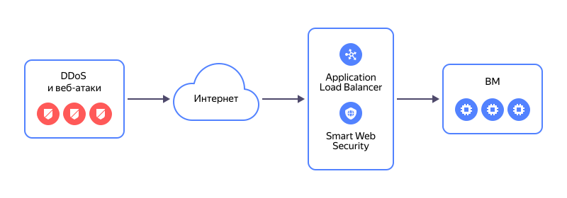

# Миграция сервисов с балансировщика NLB с целевыми ресурсами из виртуальных машин на L7-балансировщик ALB

В этом практическом руководстве рассмотрен вариант, когда трафик, поступающий на балансировщик [{{ network-load-balancer-full-name }}](../../network-load-balancer/), распределяется по виртуальным машинам, которые расположены в целевых группах за ним.

Схема работы L7-балансировщика [{{ alb-full-name }}](../../application-load-balancer/) с подключенным профилем безопасности [{{ sws-full-name }}](../../smartwebsecurity/):

Вы можете создать инфраструктуру для миграции сервисов с помощью следующих инструментов:
