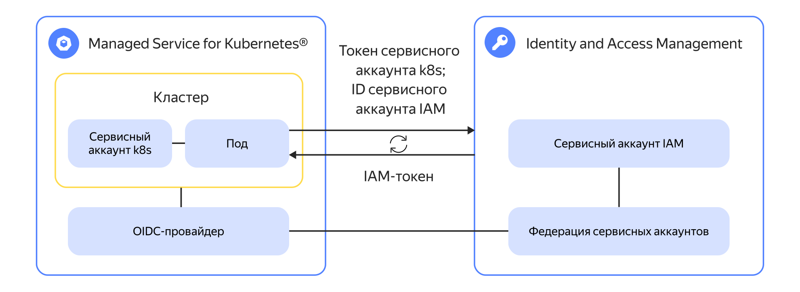

# Доступ к API {{ yandex-cloud }} из кластера {{ managed-k8s-name }} с помощью федерации сервисных аккаунтов {{ iam-name }}





В этом руководстве для примера показано, как получить значение [секрета](../../lockbox/concepts/secret.md) {{ lockbox-full-name }} со стороны кластера {{ managed-k8s-name }} от имени [сервисного аккаунта](../../iam/concepts/users/service-accounts.md) {{ iam-name }}. 

Аналогичным образом можно выполнить любое действие через [{{ yandex-cloud }} CLI](../../cli/quickstart.md), [{{ TF }}](../../terraform/quickstart.md), [SDK](../../overview/sdk/overview.md) или [API](../../api-design-guide/).



В руководстве представлен пример интеграции кластера {{ managed-k8s-name }} с федерацией сервисных аккаунтов. Руководство по интеграции пользовательской инсталляции {{ k8s }} см. на странице [Получение значения секрета {{ lockbox-full-name }} на стороне пользовательской инсталляции {{ k8s }}](../../tutorials/security/wlif-k8s-integration.md).



Чтобы с помощью федерации сервисных аккаунтов настроить доступ к секрету {{ lockbox-name }} из кластера {{ managed-k8s-name }} через API {{ yandex-cloud }}:

1. [Подготовьте облако к работе](#prepare-cloud).
1. [Настройте кластер {{ managed-k8s-name }}](#prepare-cluster).
1. [Создайте федерацию сервисных аккаунтов](#create-wlif).
1. [Подготовьте сервисный аккаунт {{ iam-short-name }}](#prepare-sa).
1. [Привяжите сервисный аккаунт {{ iam-short-name }} к федерации](#connect-sa).
1. [Создайте секрет {{ lockbox-name }}](#create-secret).
1. [Проверьте работу интеграции](#check-integration).

Если созданные ресурсы вам больше не нужны, [удалите их](#clear-out).

## Подготовьте облако к работе {#prepare-cloud}



### Необходимые платные ресурсы {#paid-resources}

В стоимость поддержки инфраструктуры входят:
* Плата за вычислительные ресурсы и диски [узлов](../../managed-kubernetes/concepts/index.md#node-group) кластера {{ managed-k8s-name }} (см. [тарифы {{ compute-full-name }}](../../compute/pricing.md)).
* Плата за использование [мастера](../../managed-kubernetes/concepts/index.md#master) {{ managed-k8s-name }} и исходящий трафик (см. [тарифы {{ managed-k8s-name }}](../../managed-kubernetes/pricing.md)).
* Плата за [публичные IP-адреса](../../vpc/concepts/address.md#public-addresses) кластера {{ managed-k8s-name }} (см. [тарифы {{ vpc-full-name }}](../../vpc/pricing.md)).
* Плата за хранение [секрета](../../lockbox/concepts/secret.md) и запросы к нему (см. [тарифы {{ lockbox-name }}](../../lockbox/pricing.md)).

## Настройте кластер {{ managed-k8s-name }} {#prepare-cluster}



Интеграция с федерацией сервисных аккаунтов доступна только для кластеров {{ managed-k8s-name }} версии 1.30 и выше в [релизном канале](../../managed-kubernetes/concepts/release-channels-and-updates.md) `rapid`.

Для доступа к API {{ yandex-cloud }} у узлов кластера должен быть доступ в интернет.



1. Если у вас еще нет кластера {{ managed-k8s-name }}:
    1. [Создайте](../../managed-kubernetes/operations/kubernetes-cluster/kubernetes-cluster-create.md) кластер. 
    1. [Создайте](../../managed-kubernetes/operations/node-group/node-group-create.md) группу узлов.
    1. [Настройте](../../managed-kubernetes/operations/connect/security-groups.md) группы безопасности для кластера и группы узлов.
1. Для доступа к API {{ yandex-cloud }} у узлов кластера должен быть доступ в интернет. Убедитесь, что узлам кластера назначены публичные IP-адреса, или в подсети, где размещаются узлы, настроен [NAT-шлюз](../../vpc/concepts/gateways.md#nat-gateway). Также убедитесь, что правилами группы безопасности разрешен весь исходящий трафик для узлов кластера.
1. Настройте интеграцию с федерацией сервисных аккаунтов:

    

    - Консоль управления {#console}

      1. В [консоли управления]({{ link-console-main }}) выберите каталог, в котором размещен кластер.
      1. В списке сервисов выберите **{{ managed-k8s-name }}**.
      1. Напротив кластера нажмите  и выберите **Редактировать**.
      1. В поле **Управление идентификацией и доступом** включите федерацию сервисных аккаунтов.
      1. Нажмите **Сохранить**.
      1. На обзорной странице кластера в блоке **Управление идентификацией и доступом** скопируйте значения параметров **URL эмитента** и **URL набора ключей JWKS**. Они понадобятся в дальнейшем.

    

1. Создайте сервисный аккаунт {{ k8s }}:
    1. [Подключитесь](../../managed-kubernetes/operations/connect/index.md#kubectl-connect) к кластеру {{ managed-k8s-name }} с помощью `kubectl`.
    1. Создайте манифест сервисного аккаунта {{ k8s }} `service-account.yaml` со следующим содержимым:

        ```yaml
        apiVersion: v1
        kind: ServiceAccount
        metadata:
          name: wlif
        ```

    1. Примените манифест:

        ```bash
        kubectl apply -f service-account.yaml
        ```

    1. Чтобы проверить созданный ресурс `ServiceAccount`, выполните команду:

        ```bash
        kubectl describe serviceaccount wlif
        ```

        Результат:

        ```text
        Name:                wlif
        Namespace:           default
        ...
        ```

    1. Сохраните значения полей `Name` и `Namespace`, они понадобятся в дальнейшем.

## Создайте федерацию сервисных аккаунтов {#create-wlif}



- Консоль управления {#console}

  1. В [консоли управления]({{ link-console-main }}) выберите каталог, к которому вы хотите получить доступ через API {{ yandex-cloud }}.
  1. В списке сервисов выберите **{{ ui-key.yacloud.iam.folder.dashboard.label_iam }}**.
  1. На панели слева выберите  **{{ ui-key.yacloud.iam.label_federations }}**.
  1. Нажмите **{{ ui-key.yacloud.iam.label_create-wli-federation }}**.
  1. В поле **{{ ui-key.yacloud.iam.federations.field_issuer }}** введите значение **URL эмитента**, полученное ранее, например `https://{{ s3-storage-host }}/mk8s-oidc/v1/clusters/c49i54tk66ob********`.
  1. В поле **{{ ui-key.yacloud.iam.federations.field_audiences }}** также введите значение **URL эмитента**.
  1. В поле **{{ ui-key.yacloud.iam.federations.field_jwks }}** введите значение **URL набора ключей JWKS**, полученное ранее, например `https://{{ s3-storage-host }}/mk8s-oidc/v1/clusters/c49i54tk66ob********/jwks.json`.
  1. В поле **{{ ui-key.yacloud.iam.federations.field_name }}** введите имя федерации, например `test-iam-federation`.
  1. Нажмите **{{ ui-key.yacloud_billing.iam.cloud.create.popup-create-cloud_button_add }}**.



## Подготовьте сервисный аккаунт {{ iam-short-name }} {#prepare-sa}

1. Создайте сервисный аккаунт {{ iam-short-name }}:

    

    - Консоль управления {#console}

      1. В [консоли управления]({{ link-console-main }}) выберите каталог, в котором размещен секрет {{ lockbox-name }}.
      1. В списке сервисов выберите **{{ ui-key.yacloud.iam.folder.dashboard.label_iam }}**.
      1. Нажмите **{{ ui-key.yacloud.iam.folder.service-accounts.button_add }}**.
      1. Введите имя сервисного аккаунта, например `sa-lockbox`.
      1. Нажмите **{{ ui-key.yacloud.iam.folder.service-account.popup-robot_button_add }}**.
      1. Выберите созданный сервисный аккаунт и сохраните его идентификатор, он понадобится в дальнейшем.

    

1. Назначьте сервисному аккаунту [роль](../../iam/concepts/access-control/roles.md) `{{ roles-lockbox-payloadviewer }}` на каталог: 

    

    - Консоль управления {#console}

      1. В [консоли управления]({{ link-console-main }}) выберите каталог, в котором создан сервисный аккаунт.
      1. Перейдите на вкладку **{{ ui-key.yacloud.common.resource-acl.label_access-bindings }}**.
      1. Нажмите **{{ ui-key.yacloud.common.resource-acl.button_configure-access }}**.
      1. В открывшемся окне выберите раздел **{{ ui-key.yacloud_components.acl.label.service-accounts}}**.
      1. Выберите сервисный аккаунт, созданный ранее.
      1. Нажмите  **{{ ui-key.yacloud_components.acl.button.add-role }}** и выберите [роль](../../lockbox/security/index.md#lockbox-payloadViewer) `{{ roles-lockbox-payloadviewer }}`.
      1. Нажмите **{{ ui-key.yacloud_components.acl.action.apply }}**.

    

## Привяжите сервисный аккаунт {{ iam-short-name }} к федерации {#connect-sa}



- Консоль управления {#console}

  1. В [консоли управления]({{ link-console-main }}) выберите каталог, в котором был создан сервисный аккаунт.
  1. В списке сервисов выберите **{{ ui-key.yacloud.iam.folder.dashboard.label_iam }}**.
  1. В списке выберите сервисный аккаунт `sa-lockbox`.
  1. Перейдите на вкладку **{{ ui-key.yacloud.iam.label_federations }}**.
  1. Нажмите **{{ ui-key.yacloud.iam.connected-federation.action_connect-federation }}**.
  1. В поле **{{ ui-key.yacloud.iam.connected-federation.field_federation }}** выберите ранее созданную федерацию.
  1. В поле **{{ ui-key.yacloud.iam.connected-federation.field_subject }}** укажите идентификатор сервисного аккаунта {{ k8s }}, созданного ранее, в формате `system:serviceaccount:<пространство_имен>:<имя_аккаунта>`, где:
      * `пространство_имен` — значение поля `Namespace` сервисного аккаунта {{ k8s }}, например `default`.
      * `имя_аккаунта` — значение поля `Name` сервисного аккаунта {{ k8s }}, например `wlif`.

  1. Нажмите **{{ ui-key.yacloud.iam.connected-federation.action_connect }}**.



## Создайте секрет {{ lockbox-name }} {#create-secret}



- Консоль управления {#console}

  1. В [консоли управления]({{ link-console-main }}) выберите каталог, в котором будет создан секрет.
  1. В списке сервисов выберите **{{ ui-key.yacloud.iam.folder.dashboard.label_lockbox }}**.
  1. Нажмите **{{ ui-key.yacloud.lockbox.button_create-secret }}**.
  1. В поле **{{ ui-key.yacloud.common.name }}** введите имя секрета `MY_SECRET`.
  1. Выберите **{{ ui-key.yacloud.lockbox.forms.title_secret-type }}** `{{ ui-key.yacloud.lockbox.forms.title_secret-type-custom }}`.
  1. В поле **{{ ui-key.yacloud.lockbox.forms.label_key }}** введите неконфиденциальный идентификатор, например `test-secret`.
  1. В поле **{{ ui-key.yacloud.lockbox.forms.label_value }}** введите конфиденциальные данные для хранения, например `hello-world`.
  1. Нажмите **{{ ui-key.yacloud.common.create }}**.
  1. Сохраните идентификатор секрета, он понадобится в дальнейшем.



## Проверьте работу интеграции {#check-integration}

1. [Подключитесь](../../managed-kubernetes/operations/connect/index.md#kubectl-connect) к кластеру {{ managed-k8s-name }} с помощью `kubectl`.
1. Создайте манифест тестового пода `pod.yaml` со следующим содержимым:

    ```yaml
    apiVersion: v1
    kind: Pod
    metadata:
      name: test-wlif
    spec:
      containers:
      - image: nginx
        name: nginx
        volumeMounts:
        - mountPath: /var/run/secrets/tokens
          name: sa-token
      serviceAccountName: wlif
      volumes:
      - name: sa-token
        projected:
          sources:
          - serviceAccountToken:
              path: sa-token
              expirationSeconds: 7200
              audience: https://{{ s3-storage-host }}/mk8s-oidc/v1/clusters/c49i54tk66ob********
    ```

    Где:
    * `spec:serviceAccountName` — имя сервисного аккаунта {{ k8s }}, созданного ранее.
    * `spec:volumes:projected:sources:serviceAccountToken:audience` — значение **{{ ui-key.yacloud.iam.federations.field_audiences }}**, заданное при создании федерации.

1. Примените манифест:

    ```bash
    kubectl apply -f pod.yaml
    ```

1. Убедитесь, что созданный под перешел в статус `Running`:

    ```bash
    kubectl get pod test-wlif
    ```

    Результат:

    ```
    NAME        READY   STATUS    RESTARTS   AGE
    test-wlif   1/1     Running   0          1m
    ```

1. Войдите в контейнер:

    ```bash
    kubectl exec test-wlif -it -- bash
    ```

1. Задайте необходимые переменные:

    ```bash
    SA_ID="<идентификатор_сервисного_аккаунта_{{ iam-short-name }}>" && \
    SECRET_ID="<идентификатор_секрета_{{ lockbox-short-name }}>" && \
    SA_TOKEN="$(cat /var/run/secrets/tokens/sa-token)"
    ```

    Где:
    * `SA_ID` — идентификатор сервисного аккаунта {{ iam-short-name }}, полученный ранее.
    * `SECRET_ID` — идентификатор секрета {{ lockbox-name }}, полученный ранее.
    * `SA_TOKEN` — токен сервисного аккаунта {{ k8s }}.

1. Установите вспомогательную утилиту `jq`:

    ```bash
    apt-get update >/dev/null 2>&1 && apt-get install -y jq >/dev/null 2>&1
    ```

1. Получите [IAM-токен](../../iam/concepts/authorization/iam-token.md):

    ```bash
    IAMTOKEN=$(curl -sH "Content-Type: application/x-www-form-urlencoded" \
      -d "grant_type=urn:ietf:params:oauth:grant-type:token-exchange&requested_token_type=urn:ietf:params:oauth:token-type:access_token&audience=${SA_ID}&subject_token=${SA_TOKEN}&subject_token_type=urn:ietf:params:oauth:token-type:id_token" \
      -X POST https://{{ auth-main-host }}/oauth/token | jq -r '.access_token')
    ```

1. Получите секрет {{ lockbox-name }}:

    ```bash
    curl -sH "Authorization: Bearer ${IAMTOKEN}" \
      "https://{{ api-host-lockbox-payload }}/lockbox/v1/secrets/${SECRET_ID}/payload"
    ```

    Результат:

    ```json
    {
     "entries": [
      {
       "key": "test-secret",
       "textValue": "hello-world"
      }
     ],
     "versionId": "e6qsqiadrsnhduubgijb"
    }
    ```

## Как удалить созданные ресурсы {#clear-out}

Чтобы перестать платить за созданные ресурсы:
* [Удалите](../../lockbox/operations/secret-delete.md) секрет {{ lockbox-name }}.
* [Удалите](../../managed-kubernetes/operations/node-group/node-group-delete.md) группу узлов {{ managed-k8s-name }}.
* [Удалите](../../managed-kubernetes/operations/kubernetes-cluster/kubernetes-cluster-delete.md) кластер {{ managed-k8s-name }}.

## Смотрите также {#see-also}

* [{#T}](../../iam/concepts/workload-identity.md)
* [Получение значения секрета {{ lockbox-full-name }} на стороне пользовательской инсталляции {{ k8s }}](../../tutorials/security/wlif-k8s-integration.md)