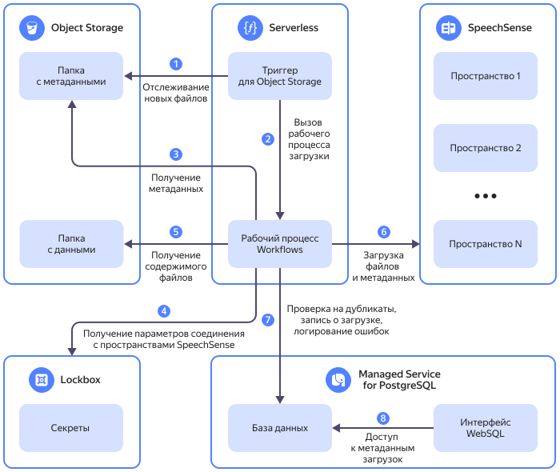

# Автоматическая загрузка данных в {{ speechsense-full-name }} с помощью {{ sw-full-name }}





Вы можете настроить автоматическую загрузку файлов с диалогами и их метаданными из бакета {{ objstorage-name }} в [пространство {{ speechsense-name }}](../../speechsense/concepts/resources-hierarchy.md#space). Поддерживаемые форматы:

  * `MP3`, `WAV`, `OggOpus` — для аудиозаписей;
  * `JSON` — для переписки из чата.



На схеме:

1. [Триггер](../../functions/concepts/trigger/os-trigger.md) для {{ objstorage-name }} отслеживает появление новых JSON-файлов с метаданными в выделенной папке [бакета](../../storage/concepts/bucket.md) или любой из ее подпапок.
1. Когда в папке появляются новые файлы, триггер вызывает [функцию](../../functions/concepts/function.md) `workflow-call`, которая запускает [рабочий процесс {{ sw-name }}](../../serverless-integrations/concepts/workflows/workflow.md).
1. Рабочий процесс получает содержимое JSON-файлов с метаданными и проверяет их синтаксис с помощью функции `verify-file`.
1. Рабочий процесс получает параметры подключения {{ speechsense-name }} из [секрета {{ lockbox-name }}](../../lockbox/concepts/secret.md).
1. Путь к аудиозаписи или текстовому файлу, а также их метаданные передаются в функцию загрузки `speechsense-upload`.
1. Функция `speechsense-upload` загружает файлы и их метаданные в пространство {{ speechsense-name }}.
1. Во время выполнения рабочий процесс обращается к БД с метаданными:
    1. Логируются ошибки синтаксиса в файлах с метаданными.
    1. Логируются ошибки синтаксиса записей в файлах с метаданными.
    1. Проводится проверка на дубликаты: перед вызовом функции `speechsense-upload` проверяется, загружен ли уже файл в это пространство {{ speechsense-name }}.
    1. Логируются ошибки функции `speechsense-upload`.
    1. При успешной загрузке файла логируются его метаданные и уникальный идентификатор в пространстве {{ speechsense-name }}.
1. Сервис {{ websql-name }} позволяет получить доступ к БД с метаданными. Для просмотра используется один пользователь БД, а для загрузки файлов — другой.

Настроить автоматическую загрузку данных можно сразу для нескольких [подключений {{ speechsense-name }}](../../speechsense/concepts/resources-hierarchy.md#connection).

Чтобы автоматизировать загрузку данных в {{ speechsense-name }}:

1. [Подготовьте облако к работе](#before-you-begin).
1. [Создайте инфраструктуру для загрузки файлов](#infra).
1. [Создайте секрет {{ lockbox-name }}](#create-secret).
1. [Создайте модель данных в кластере {{ mpg-name }}](#create-table).
1. [Создайте в бакете {{ objstorage-name }} папки для хранения файлов и их метаданных](#create-folder).
1. [Подготовьте метаданные](#prepare-metadata).
1. [Загрузите файлы в бакет {{ objstorage-name }}](#upload-files).
1. [Проверьте результат](#check-result).

Если созданные ресурсы вам больше не нужны, [удалите их](#clear-out).


## Подготовьте облако к работе {#before-you-begin}



### Необходимые платные ресурсы {#paid-resources}

В стоимость ресурсов входят:

* плата за хранение данных в бакете и операции с ними (см. [тарифы {{ objstorage-full-name }}](../../storage/pricing.md));
* плата за использование кластера (см. [тарифы {{ mpg-full-name }}](../../managed-postgresql/pricing.md));
* плата за вызовы функций (см. [тарифы {{ sf-full-name }}](../../functions/pricing.md));
* плата за хранение секрета и запросы к нему (см. [тарифы {{ lockbox-full-name }}](../../lockbox/pricing.md)).

### Создайте сервисные аккаунты {#create-sa}

Создайте два сервисных аккаунта:

  * `deploy-sa` — от его имени будет создаваться инфраструктура.

  * `speechsense-sa` — от его имени будут вызываться функции и запускаться рабочий процесс.



- Консоль управления {#console}

  1. В [консоли управления]({{ link-console-main }}) выберите нужный каталог.
  1. В списке сервисов выберите **{{ ui-key.yacloud.iam.folder.dashboard.label_iam }}**.
  1. Нажмите кнопку **{{ ui-key.yacloud.iam.folder.service-accounts.button_add }}**.
  1. Введите имя [сервисного аккаунта](../../iam/concepts/users/service-accounts.md): `deploy-sa`.
  1. Нажмите кнопку  **{{ ui-key.yacloud.iam.folder.service-account.label_add-role }}** и выберите роли: [functions.admin](../../functions/security/index.md#functions-admin), [storage.editor](../../storage/security/index.md#storage-editor), [iam.editor](../../iam/roles-reference.md#iam-editor), [mdb.admin](../../iam/roles-reference.md#mdb-admin), `serverless.workflows.admin`.
  1. Нажмите кнопку **{{ ui-key.yacloud.iam.folder.service-account.popup-robot_button_add }}**.
  1. Повторите предыдущие шаги и создайте сервисный аккаунт `speechsense-sa` c ролями [storage.viewer](../../storage/security/index.md#storage-viewer), [functions.functionInvoker](../../functions/security/index.md#functions-functionInvoker), [functions.mdbProxiesUser](../../functions/security/index.md#functions-mdbProxiesUser), [lockbox.payloadViewer](../../lockbox/security/index.md#lockbox-payloadviewer), `serverless.workflows.executor`.

- {{ yandex-cloud }} CLI {#cli}

  

  

  1. Создайте сервисный аккаунт `deploy-sa`:

      ```bash
      yc iam service-account create deploy-sa
      ```

      Результат:

      ```
      id: nfersamh4sjq********
      folder_id: b1gc1t4cb638********
      created_at: "2023-09-21T10:36:29.726397755Z"
      name: deploy-sa
      ```

      Сохраните идентификатор сервисного аккаунта `deploy-sa` (`id`) и каталога, в котором его создали (`folder_id`).

      Подробнее о команде `yc iam service-account create` читайте в [справочнике CLI](../../cli/cli-ref/iam/cli-ref/service-account/create.md).

  1. Назначьте сервисному аккаунту `deploy-sa` роли [functions.admin](../../functions/security/index.md#functions-admin), [storage.editor](../../storage/security/index.md#storage-editor), [iam.editor](../../iam/roles-reference.md#iam-editor), [mdb.admin](../../iam/roles-reference.md#mdb-admin), `serverless.workflows.admin` на каталог, указав сохраненные ранее идентификаторы каталога и сервисного аккаунта:

      ```bash
      yc resource-manager folder add-access-binding <идентификатор_каталога> \
        --role <роль> \
        --subject serviceAccount:<идентификатор_сервисного_аккаунта>
      ```
  
      Команда принимает только одну роль за раз.

      Подробнее о команде `yc resource-manager folder add-access-binding` читайте в [справочнике CLI](../../cli/cli-ref/resource-manager/cli-ref/folder/add-access-binding.md).

      Если вы будете создавать секрет {{ lockbox-name }} через {{ yandex-cloud }} CLI  от имени сервисного аккаунта `deploy-sa`, также назначьте ему роль [lockbox.editor](../../lockbox/security/index.md#lockbox-editor).

  1. Повторите предыдущие шаги и создайте сервисный аккаунт `speechsense-sa` c ролями [storage.viewer](../../storage/security/index.md#storage-viewer), [functions.functionInvoker](../../functions/security/index.md#functions-functionInvoker), [functions.mdbProxiesUser](../../functions/security/index.md#functions-mdbProxiesUser), [lockbox.payloadViewer](../../lockbox/security/index.md#lockbox-payloadviewer), `serverless.workflows.executor`.

- API {#api}

  Чтобы создать сервисный аккаунт, воспользуйтесь методом [create](../../iam/api-ref/ServiceAccount/create.md) для ресурса [ServiceAccount](../../iam/api-ref/ServiceAccount/index.md) или вызовом gRPC API [ServiceAccountService.Create](../../iam/api-ref/grpc/ServiceAccount/create.md).

  Чтобы назначить сервисному аккаунту `deploy-sa` роли [functions.admin](../../functions/security/index.md#functions-admin), [storage.editor](../../storage/security/index.md#storage-editor), [iam.editor](../../iam/roles-reference.md#iam-editor), [mdb.admin](../../iam/roles-reference.md#mdb-admin) и `serverless.workflows.admin`, воспользуйтесь методом [setAccessBindings](../../iam/api-ref/ServiceAccount/setAccessBindings.md) для ресурса [ServiceAccount](../../iam/api-ref/ServiceAccount/index.md) или вызовом gRPC API [ServiceAccountService.SetAccessBindings](../../iam/api-ref/grpc/ServiceAccount/setAccessBindings.md).

  Таким же способом назначьте сервисному аккаунту `speechsense-sa` роли [storage.viewer](../../storage/security/index.md#storage-viewer), [functions.functionInvoker](../../functions/security/index.md#functions-functionInvoker), [functions.mdbProxiesUser](../../functions/security/index.md#functions-mdbProxiesUser), [lockbox.payloadViewer](../../lockbox/security/index.md#lockbox-payloadviewer), `serverless.workflows.executor`.



### Создайте API-ключ для сервисного аккаунта {#create-key}

Создайте API-ключ для сервисного аккаунта `speechsense-sa`.



- Консоль управления {#console}

  1. В [консоли управления]({{ link-console-main }}) перейдите в каталог, в котором находится сервисный аккаунт.
  1. В списке сервисов выберите **{{ ui-key.yacloud.iam.folder.dashboard.label_iam }}**.
  1. На панели слева выберите  **{{ ui-key.yacloud.iam.label_service-accounts }}**.
  1. Выберите сервисный аккаунт `speechsense-sa`.
  1. На панели сверху нажмите кнопку  **{{ ui-key.yacloud.iam.folder.service-account.overview.button_create-key-popup }}** и выберите пункт **{{ ui-key.yacloud.iam.folder.service-account.overview.button_create_api_key }}**.
  1. Нажмите кнопку **{{ ui-key.yacloud.iam.folder.service-account.overview.popup-key_button_create }}**.
  1. Сохраните идентификатор и секретный ключ.

      

      После закрытия диалога значение ключа будет недоступно.

      

- {{ yandex-cloud }} CLI {#cli}

  Создайте API-ключ для сервисного аккаунта `speechsense-sa` и запишите ответ в файл `api_key.yaml`:

  ```bash
  yc iam api-key create \
    --service-account-name speechsense-sa \
    > api_key.yaml
  ```
  
  В результате вы получите файл `api_key.yaml`, который содержит значение API-ключа в поле `secret`:

  ```yaml
  api_key:
    id: ajeke74kbp5b********
    service_account_id: ajepg0mjt06s********
    created_at: "2019-04-09T08:41:27Z"
  secret: AQVN1HHJReSrfo9jU3aopsXrJyfq_UHs********
  ```

- API {#api}

  Создайте API-ключ с помощью метода REST API [create](../../iam/api-ref/ApiKey/create.md) для ресурса [ApiKey](../../iam/api-ref/ApiKey/index.md):

  ```bash
  export SERVICEACCOUNT_ID=<идентификатор_сервисного_аккаунта>
  export IAM_TOKEN=<токен>
  curl \
    --request POST \
    --header "Content-Type: application/json" \
    --header "Authorization: Bearer $IAM_TOKEN" \
    --data "{ \"serviceAccountId\": \"$SERVICEACCOUNT_ID\" }" \
    https://iam.{{ api-host }}/iam/v1/apiKeys
  ```

  Где:

  * `SERVICEACCOUNT_ID` — [идентификатор](../../iam/operations/sa/get-id.md) сервисного аккаунта.
  * `IAM_TOKEN` — [IAM-токен](../../iam/concepts/authorization/iam-token.md).

  Также API-ключ можно создать с помощью вызова gRPC API [ApiKeyService.Create](../../iam/api-ref/grpc/ApiKey/create.md).

      

### Создайте пространство {#create-space}



- Интерфейс {{ speechsense-name }} {#speechsense}

  1. Откройте [главную страницу]({{ link-speechsense-main }}) {{ speechsense-name }}.
  1. Нажмите кнопку **{{ ui-key.yc-ui-talkanalytics.spaces.create-space }}**.
  1. Введите название пространства.
  1. Нажмите кнопку **{{ ui-key.yc-ui-talkanalytics.common.create }}**.



### Добавьте сервисный аккаунт в пространство {#add-sa-to-space}

Добавьте сервисный аккаунт `speechsense-sa` в пространство {{ speechsense-name }}.



- Интерфейс {{ speechsense-name }} {#speechsense}

  1. Откройте [главную страницу]({{ link-speechsense-main }}) {{ speechsense-name }}.
  1. Перейдите в [новое пространство](#create-space).
  1. Нажмите кнопку  **{{ ui-key.yc-ui-talkanalytics.projects.add-participant }}** →  **{{ ui-key.yc-ui-talkanalytics.team.add-from-organization-key-value }}**.
  1. Cкопируйте идентификатор [созданного ранее сервисного аккаунта](#create-sa) `speechsense-sa` и вставьте в строку поиска.
  1. Выберите сервисный аккаунт `speechsense-sa` и укажите роль [{{ roles-speechsense-data-editor }}](../../speechsense/security/index.md#speechsense-data-editor). Эта роль позволит сервисному аккаунту `speechsense-sa` загружать данные в {{ speechsense-name }}.
  1. Нажмите кнопку **{{ ui-key.yc-ui-talkanalytics.common.add }}**.



### Создайте подключение {#create-connection}

В зависимости от типа файлов, которые будут загружаться в {{ speechsense-name }}, создайте подключение для аудио или для чата.

#### Создайте подключение для аудио {#create-audio-connection}



- Интерфейс {{ speechsense-name }} {#speechsense}

  1. Откройте [главную страницу]({{ link-speechsense-main }}) {{ speechsense-name }}.
  1. Перейдите в нужное пространство.
  1. В правом верхнем углу нажмите **{{ ui-key.yc-ui-talkanalytics.common.more }}** →  **{{ ui-key.yc-ui-talkanalytics.connections.create-connection-key-value }}**.
  1. Укажите название подключения.
  1. Выберите тип данных **{{ ui-key.yc-ui-talkanalytics.connections.type.two-channel-key-value }}**.
  1. В блоках **{{ ui-key.yc-ui-talkanalytics.dialogs.operator }}**, **{{ ui-key.yc-ui-talkanalytics.dialogs.client }}**:

      1. Укажите каналы, в которых записаны голос оператора и голос клиента.
      1. Укажите для оператора и клиента ключи из файла метаданных. Этот файл содержит информацию о звонке, полученную из CRM-систем, АТС или других источников.

        По умолчанию в подключение добавлены ключи с именем и идентификатором оператора и клиента. В поле **{{ ui-key.yc-ui-talkanalytics.connections.column.name }}** введите название, под которым ключ будет отображаться в {{ speechsense-name }}.

        Чтобы указать дополнительные метаданные для оператора и клиента, нажмите кнопку **{{ ui-key.yc-ui-talkanalytics.connections.add-key }}**.

  1. В блоке **{{ ui-key.yc-ui-talkanalytics.connections.fields.metadata }}** укажите не связанные с оператором и клиентом ключи из файла метаданных.

      По умолчанию в подключение добавлены ключи с датой, направлением звонка и языком диалога. В поле **{{ ui-key.yc-ui-talkanalytics.connections.column.name }}** введите название, под которым ключ будет отображаться в {{ speechsense-name }}.

      Чтобы указать дополнительные метаданные, нажмите кнопку **{{ ui-key.yc-ui-talkanalytics.connections.add-key }}**.

  1. Нажмите кнопку **{{ ui-key.yc-ui-talkanalytics.connections.create-connection-key-value }}**.



#### Создайте подключение для чата {#create-chat-connection}



- Интерфейс {{ speechsense-name }} {#speechsense}

  1. Откройте [главную страницу]({{ link-speechsense-main }}) {{ speechsense-name }}.
  1. Перейдите в нужное пространство.
  1. В правом верхнем углу нажмите **{{ ui-key.yc-ui-talkanalytics.common.more }}** →  **{{ ui-key.yc-ui-talkanalytics.connections.create-connection-key-value }}**.
  1. Укажите название подключения.
  1. Выберите тип данных **{{ ui-key.yc-ui-talkanalytics.connections.type.chat-key-value }}**.
  1. В блоках **{{ ui-key.yc-ui-talkanalytics.dialogs.operator }}**, **{{ ui-key.yc-ui-talkanalytics.dialogs.client }}**, **{{ ui-key.yc-ui-talkanalytics.dialogs.bot }}** укажите ключи из файла метаданных. Этот файл содержит информацию о диалоге, полученную из чатов, CRM-систем или других источников.

      По умолчанию в подключение добавлены ключи с именем и идентификатором оператора, клиента и бота. В поле **{{ ui-key.yc-ui-talkanalytics.connections.column.name }}** введите название, под которым ключ будет отображаться в {{ speechsense-name }}.

      Чтобы указать дополнительные метаданные для оператора, клиента и бота, нажмите кнопку **{{ ui-key.yc-ui-talkanalytics.connections.add-key }}**.

  1. В блоке **{{ ui-key.yc-ui-talkanalytics.connections.fields.metadata }}** укажите не связанные с оператором, клиентом и ботом ключи из файла метаданных.

      По умолчанию в подключение добавлены ключи с датой, направлением и языком диалога. В поле **{{ ui-key.yc-ui-talkanalytics.connections.column.name }}** введите название, под которым ключ будет отображаться в {{ speechsense-name }}.

      Чтобы указать дополнительные метаданные, нажмите кнопку **{{ ui-key.yc-ui-talkanalytics.connections.add-key }}**.

  1. Нажмите кнопку **{{ ui-key.yc-ui-talkanalytics.connections.create-connection-key-value }}**.



### Создайте проект {#create-project}



- Интерфейс {{ speechsense-name }} {#speechsense}

  1. Откройте [главную страницу]({{ link-speechsense-main }}) {{ speechsense-name }}.
  1. Перейдите в нужное пространство.
  1. Нажмите кнопку  **{{ ui-key.yc-ui-talkanalytics.projects.create-project }}**.
  1. Введите имя проекта.
  1. В блоке **{{ ui-key.yc-ui-talkanalytics.connections.connection }}** нажмите **{{ ui-key.yc-ui-talkanalytics.projects.add-connection }}** и выберите подключение, созданное [ранее](#create-connection).
  1. Нажмите кнопку **{{ ui-key.yc-ui-talkanalytics.projects.create-project }}**.



## Создайте инфраструктуру {#infra}

1. Склонируйте репозиторий [yc-serverless-speechsense-workflows](https://github.com/yandex-cloud-examples/yc-serverless-speechsense-workflows):

    ```bash
    git clone https://github.com/yandex-cloud-examples/yc-serverless-speechsense-workflows.git
    ```

    В репозитории находится скрипт, который создаст в облаке инфраструктуру, необходимую для загрузки файлов в {{ speechsense-name }}:

      * бакет {{ objstorage-name }};
      * кластер {{ mpg-name }};
      * функции {{ sf-name }};
      * триггер для вызова функции {{ sf-name }};
      * рабочий процесс {{ sw-name }};
      * подключения к базе данных кластера {{ mpg-name }}.

1. Для успешной работы скрипта настройте аутентификацию {{ yandex-cloud }} CLI от имени сервисного аккаунта `deploy-sa`:

    

    - {{ yandex-cloud }} CLI {#cli}

      1. Создайте [авторизованный ключ](../../iam/concepts/authorization/key.md) для сервисного аккаунта `deploy-sa` и запишите его в файл:
      
          ```bash
          yc iam key create --output <путь_к_файлу_ключа> --service-account-name deploy-sa
          ```
      
          Где `--output` — путь к файлу для записи авторизованного ключа в формате JSON.

          Результат:
      
          ```bash
          id: aje4lue48687********
          service_account_id: ajeb9l33h6m********
          created_at: "2024-08-01T11:58:52.313177213Z"
          key_algorithm: RSA_2048
          ```
      
          Подробнее о команде `yc iam key create` см. в [справочнике CLI](../../cli/cli-ref/iam/cli-ref/service-account/create.md).

       1. Создайте профиль, который будет использоваться для выполнения операций от имени сервисного аккаунта `deploy-sa`:

          ```bash
          yc config profile create <имя_профиля>
          ```

       1. Укажите в конфигурации профиля авторизованный ключ сервисного аккаунта `deploy-sa`:

          ```bash
          yc config set service-account-key <путь_к_файлу_ключа>
          ```   

    

1. Перейдите в папку с репозиторием и запустите скрипт:

    

    - Bash {#bash}

        ```bash
        cd deploy && bash deploy.sh
        ```

    

    В командной строке введите [идентификатор каталога](../../resource-manager/operations/folder/get-id.md), имя сервисного аккаунта `speechsense-sa`, от которого будут вызываться функции и запускаться рабочий процесс, и [имя бакета](../../storage/concepts/bucket.md#naming).

    Примерное время выполнения скрипта — 10-15 минут.

## Создайте секрет {#create-secret}



- Консоль управления {#console}

  1. В [консоли управления]({{ link-console-main }}) выберите каталог, в котором хотите создать секрет.
  1. В списке сервисов выберите **{{ ui-key.yacloud.iam.folder.dashboard.label_lockbox }}**.
  1. Нажмите кнопку **{{ ui-key.yacloud.lockbox.button_create-secret }}**.
  1. В поле **{{ ui-key.yacloud.common.name }}** укажите имя секрета: `speechsense-secret`.

  1. В блоке **{{ ui-key.yacloud.lockbox.forms.title_secret-data-section }}**:

        1. Выберите тип секрета **{{ ui-key.yacloud.lockbox.forms.title_secret-type-custom }}**.
        
        1. Добавьте API-ключ сервисного аккаунта:

            * В поле **{{ ui-key.yacloud.lockbox.forms.label_key }}** укажите: `speechsense_api_key`.
            * В поле **{{ ui-key.yacloud.lockbox.forms.label_value }}** укажите значение [созданного ранее](#create-key) API-ключа сервисного аккаунта `speechsense-sa`.

        1. Нажмите кнопку **{{ ui-key.yacloud.lockbox.forms.button_add-pair }}** и добавьте идентификатор подключения {{ speechsense-name }}:

            * В поле **{{ ui-key.yacloud.lockbox.forms.label_key }}** укажите: `speechsense_connection_id`.
            * В поле **{{ ui-key.yacloud.lockbox.forms.label_value }}** укажите идентификатор подключения, [созданного ранее](#create-connection).

        1. Нажмите кнопку **{{ ui-key.yacloud.lockbox.forms.button_add-pair }}** и добавьте формат файлов с диалогами, которые будут загружены в {{ speechsense-name }}:

            * В поле **{{ ui-key.yacloud.lockbox.forms.label_key }}** укажите: `speechsense_file_format`.
            * В поле **{{ ui-key.yacloud.lockbox.forms.label_value }}** укажите формат файла. Допустимые значения: `mp3`,`wav`,`ogg`, `text`.

  1. Нажмите кнопку **{{ ui-key.yacloud.common.create }}**.

- {{ yandex-cloud }} CLI {#cli}

  Чтобы создать секрет, выполните команду:

  ```bash
  yc lockbox secret create --name speechsense-secret \
    --payload "[{'key': 'speechsense_api_key', 'text_value': '<API-ключ>'},{'key': 'speechsense_connection_id', 'text_value': '<идентификатор_подключения>'}, {'key': 'speechsense_file_format', 'text_value': '<формат_файлов>'}]"
  ```

  Результат:

  ```text
  id: e6q2ad0j9b55********
  folder_id: b1gktjk2rg49********
  created_at: "2021-11-08T19:23:00.383Z"
  name: speechsense-secret
  status: ACTIVE
  current_version:
    id: g6q4fn3b6okj********
    secret_id: e6e2ei4u9b55********
    created_at: "2023-03-21T19:23:00.383Z"
    status: ACTIVE
    payload_entry_keys:
      - speechsense_api_key
      - speechsense_connection_id
      - speechsense_file_format
  ```

- API {#api}

  Чтобы создать секрет, воспользуйтесь методом REST API [create](../../lockbox/api-ref/Secret/create.md) для ресурса [Secret](../../lockbox/api-ref/Secret/index.md) или вызовом gRPC API [SecretService.Create](../../lockbox/api-ref/grpc/Secret/create.md).




## Создайте модель данных {#create-table}

1. В папке с репозиторием откройте файл `pg_metadata.sql`.

1. В блоке, отвечающем за вставку данных в таблицу `public.source_system`, укажите значения параметров:

    ```sql
    insert into public.source_system(source_system_id, lockbox_secret_id, source_system_desc)
    values ('<идентификатор_источника>', '<идентификатор_секрета>', '<описание_источника>');
    ```

    Где:  

    * `source_system_id` — идентификатор источника данных, который будет использоваться в метаданных. Укажите любое уникальное строковое значение. Например: `000001`.
    * `lockbox_secret_id` — идентификатор секрета {{ lockbox-name }}, созданного [ранее](#create-secret). Например: `e6qigo0vbci2********`.
    * `source_system_desc` — описание источника данных. Например: `Загрузка данных телефонии`.

1. Скопируйте содержимое файла `pg_metadata.sql` и выполните получившийся запрос c помощью сервиса {{ websql-name }}:

    

    - Консоль управления {#console}

        1. Перейдите на страницу каталога и выберите сервис **{{ ui-key.yacloud.iam.folder.dashboard.label_managed-postgresql }}**.
        1. Нажмите на имя кластера, [созданного ранее](#infra). По умолчанию это `speechsense-upload-metadata`.
        1. Выберите вкладку **{{ ui-key.yacloud.postgresql.cluster.switch_explore-websql }}**.
        1. Нажмите на имя подключения, которое заканчивается на `-uploader`.
        1. На странице сервиса {{ websql-name }} нажмите на имя БД — `uploader`.
        1. Вставьте запрос в редактор и нажмите кнопку **Выполнить**.

    

## Создайте папки для хранения файлов и их метаданных {#create-folder}

В [созданном ранее](#infra) бакете {{ objstorage-name }} создайте две папки:

  * `client_data` — для файлов с диалогами.
  * `client_metadata` — для файлов с метаданными.

Папки не должны быть вложены одна в другую.



- Консоль управления {#console}

  Чтобы создать папку:

    1. В [консоли управления]({{ link-console-main }}) выберите каталог, в котором находится бакет.
    1. В списке сервисов выберите **{{ ui-key.yacloud.iam.folder.dashboard.label_storage }}**.
    1. Выберите нужный бакет.
    1. Нажмите **{{ ui-key.yacloud.storage.bucket.button_create }}** и укажите имя папки.
    1. Нажмите на кнопку **{{ ui-key.yacloud.storage.bucket.popup-create-folder_button_create }}**.

- {{ yandex-cloud }} CLI {#cli}

  Чтобы создать папку, выполните команду:

    ```bash
    yc storage s3api put-object \
      --bucket <имя_бакета> \
      --key <имя_папки>/
    ```

  Результат:

    ```bash
    etag: '"d41d8cd98f00b204e9800998********"'
    request_id: ba96231*********
    ```        

- AWS CLI {#aws-cli}

  Если у вас еще нет интерфейса командной строки AWS CLI, [установите и сконфигурируйте его](../../storage/tools/aws-cli.md).

  Чтобы создать папку, выполните команду:

    ```bash
    aws s3api put-object \
      --endpoint-url=https://{{ s3-storage-host }} \
      --bucket <имя_бакета>
      --key <имя_папки>/
    ```

  Результат:

    ```bash
    {
    "ETag": "\"d41d8cd98f00b204e9800998********\""
    }
    ```

- API {#api}

  Чтобы создать папку, воспользуйтесь методом S3 API [upload](../../storage/s3/api-ref/object/upload.md).




## Подготовьте метаданные {#prepare-metadata}







Чтобы загрузить файл в {{ speechsense-name }}, подготовьте его метаданные в формате `JSON`. Например:

```json
{
  "source_system_id": "000001",
  "bucket_folder": "bucket://client_data",
  "metadata": [
    {
      "id": "my_audio.ogg",
      "operator_id": "42",
      "operator_name": "Иван Петров",
      "client_id": "327142",
      "client_name": "Петр Иванов",
      "date": "2024-08-30T19:32:11Z",
      "direction_outgoing": "0",
      "language": "RU",
      "file_name": "my_audio.ogg"
    }
  ]
}
```

Где:

  * Параметры, которые используются функцией `speechsense-upload` для загрузки файлов:

    * `source_system_id` — идентификатор источника данных, указанный в [таблице `public.source_system`](#create-table).

    * `bucket_folder` — путь к [созданной ранее](#create-folder) папке для аудиозаписей или текстовых файлов.

    * `file_name` — имя файла, который будет загружен.

  * Параметры, обязательные для передачи в {{ speechsense-name }}:
  
    * `id` — идентификатор файла, уникальный для пространства {{ speechsense-name }}.

    * `operator_id` — идентификатор оператора.

    * `operator_name` — имя оператора.

    * `client_id` — идентификатор клиента 

    * `client_name` — имя клиента.

    * `date` — дата и время звонка в формате `YYYY-MM-DDTHH:MM:SSZ`.

    * `direction_outgoing` — направление звонка. `0` — для исходящего звонка, `1` — для входящего.

    * `language` — язык диалога. `RU` — для русского языка.

  * Дополнительные параметры для аналитики в {{ speechsense-name }}:

      * `cpn_region_id` — идентификатор региона.

      * `cpn_region_name` — название региона.

      `cpn_region_id` и `cpn_region_name` использованы в качестве примера. Дополнительные параметры могут быть другими.

Метаданные могут содержать одну запись или массив из нескольких записей. 



Не передавайте больше 100 записей одновременно: это может привести к потере данных, так как время выполнения функции {{ sf-name }} ограничено таймаутом.

Если файлов для загрузки больше 100, разделите их метаданные на отдельные JSON-файлы по 100 записей.




## Загрузите файлы {#upload-files}

Загрузите файлы с диалогами в папку `client_data`, а JSON-файлы с метаданными — в папку `client_metadata`.



Не загружайте файлы с диалогами в папку `client_metadata` или вложенные в нее папки. Появление новых файлов в папке запустит рабочий процесс, но файлы с диалогами не пройдут проверку синтаксиса, которую проходят файлы с метаданными, и процесс завершится ошибкой.



Если файлов больше 1000, не используйте для загрузки консоль управления.



- Консоль управления {#console}

  Чтобы загрузить файлы:

    1. В [консоли управления]({{ link-console-main }}) в списке сервисов выберите **{{ ui-key.yacloud.iam.folder.dashboard.label_storage }}** и перейдите в бакет, в который нужно загрузить файлы.
    1. На панели слева выберите  **{{ ui-key.yacloud.storage.bucket.switch_files }}**.
    1. Перейдите в нужную папку, нажав на ее имя.
    1. Оказавшись в нужной папке, на верхней панели нажмите  **{{ ui-key.yacloud.storage.bucket.button_upload }}**.
    1. В появившемся окне выберите необходимые файлы и нажмите **Открыть**.
    1. Консоль управления отобразит все файлы, выбранные для загрузки, и предложит для каждого из них выбрать [класс хранилища](../../storage/concepts/storage-class.md). Класс хранилища по умолчанию определяется [настройкой бакета](../../storage/concepts/bucket.md#bucket-settings).
    1. Нажмите **{{ ui-key.yacloud.storage.button_upload }}**.
    1. Обновите страницу.

    В консоли управления информация о количестве объектов в бакете и занятом месте обновляется с задержкой в несколько минут. 

- {{ yandex-cloud }} CLI {#cli}

  Чтобы загрузить файл в папку, выполните команду:

    ```bash
    yc storage s3api put-object \
      --body <путь_к_загружаемому_файлу> \
      --bucket <имя_бакета> \
      --key <имя_папки>/<имя_файла>
    ```

    Где:

    * `--body` — путь к файлу, который нужно загрузить.
    * `--bucket` — имя бакета.
    * `--key` — путь к файлу в папке.

  Результат:

    ```bash
    etag: '"d41d8cd98f00b204e980099********"'
    request_id: 3f2705f********
    ```    

- AWS CLI {#aws-cli}

  Чтобы загрузить один файл, выполните команду:

    ```bash
    aws --endpoint-url=https://{{ s3-storage-host }}/ \
      s3 cp <путь_к_загружаемому_файлу> s3://<имя_бакета>/<имя_папки>/<имя_файла>
    ```

  Чтобы загрузить все файлы из локальной директории и вложенных в нее директорий, используйте команду:
   
    ```bash
    aws --endpoint-url=https://{{ s3-storage-host }}/ \
      s3 cp --recursive <путь_к_директории_с_загружаемыми_файлами>/ s3://<имя_бакета>/<имя_папки>/
    ```

  Результат:

    ```bash
    upload: <имя_файла> to <путь_к_файлу_в_бакете>
    ```

- API {#api}

  Чтобы загрузить файл, воспользуйтесь методом S3 API [upload](../../storage/s3/api-ref/object/upload.md).     





Чтобы ускорить обработку аудиозаписей, используйте файлы формата `OggOpus`. Файлы других форматов можно сконвертировать в `OggOpus` с помощью утилит [FFmpeg](https://www.ffmpeg.org) или [SoX](https://sourceforge.net/projects/sox/).



## Проверьте результат {#check-result}

Чтобы проверить выполнение рабочего процесса:



- Консоль управления {#console}

  1. В [консоли управления]({{ link-console-main }}) в списке сервисов выберите **{{ ui-key.yacloud.iam.folder.dashboard.label_serverless-integrations }}**.
  1. На панели слева выберите  **{{ ui-key.yacloud.serverless-workflows.label_service }}**.
  1. Нажмите на имя рабочего процесса. По умолчанию это `wf-speechsense-upload`.
  1. Перейдите на вкладку **{{ ui-key.yacloud.serverless-workflows.label_workflow-executions }}**.
  1. Убедитесь, что рабочий процесс находится в статусе `Выполнен`.



Чтобы проверить, что файлы загрузились в {{ speechsense-name }}:



- Консоль управления {#console}

  1. Откройте страницу [сервиса {{ websql-name }}](https://websql.yandex.cloud).
  1. В разделе  **Подключения** выберите подключение `speechsense-upload-metadata` и БД `uploader`.
  1. Выберите схему `public`.
  1. В группе **Таблицы** выберите таблицу:

      * `talk` — для просмотра загруженных в {{ speechsense-name }} метаданных. Если файл с диалогом загружен, в его метаданных должен быть указан идентификатор `talk_id`.
      * `errors` — для просмотра ошибок, если загрузить файлы не удалось.



## Удалите ресурсы {#clear-out}

Некоторые ресурсы платные. Чтобы за них не списывалась плата, удалите ресурсы, которые вы больше не будете использовать.

1. [Удалите](../../storage/operations/buckets/delete.md) объекты в бакете {{ objstorage-name }} и сам бакет.
1. [Удалите](../../managed-postgresql/operations/cluster-delete.md) кластер {{ mpg-name }}.
1. [Удалите](../../functions/operations/trigger/trigger-delete.md) триггер для вызова функции {{ sf-name }}.
1. [Удалите](../../functions/operations/function/function-delete.md) функции {{ sf-name }}.
1. Удалите подключениe к базе данных кластера {{ mpg-name }}:

    1. В [консоли управления]({{ link-console-main }}) перейдите в каталог, в котором хотите удалить подключение.
    1. Выберите сервис **{{ ui-key.yacloud.iam.folder.dashboard.label_serverless-functions }}**.
    1. На панели слева выберите  **{{ ui-key.yacloud.serverless-functions.switch_list-mdb-proxy }}**.
    1. В строке с подключением `speechsense-upload-metadata-connection` нажмите  и выберите  **{{ ui-key.yacloud.common.delete }}**.
    1. В открывшемся окне нажмите **{{ ui-key.yacloud.common.delete }}**.

1. Удалите рабочий процесс {{ sw-name }}:

    1. В [консоли управления]({{ link-console-main }}) перейдите в каталог, в котором хотите удалить рабочий процесс.
    1. Выберите сервис **{{ ui-key.yacloud.iam.folder.dashboard.label_serverless-integrations }}**.
    1. На панели слева выберите  **{{ ui-key.yacloud.serverless-workflows.label_service }}**.
    1. В строке с рабочим процессом `wf-speechsense-upload` нажмите  и выберите  **{{ ui-key.yacloud.common.delete }}**.
    1. В открывшемся окне нажмите **{{ ui-key.yacloud.common.delete }}**.