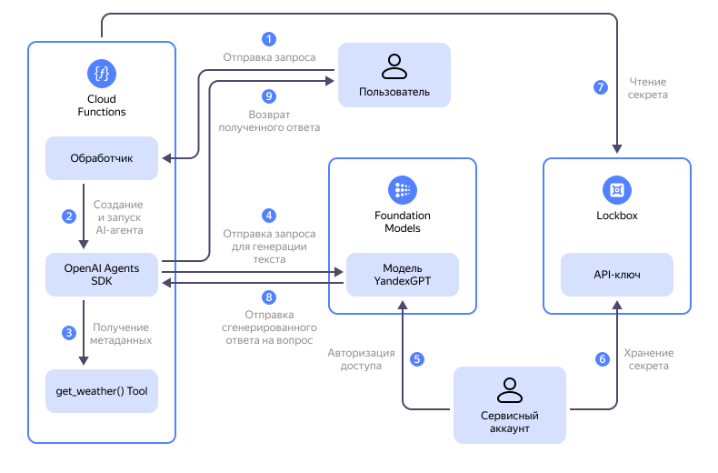

Узнайте, как с помощью [функции](../../functions/concepts/function.md) {{ sf-name }} с использованием [OpenAI Agents SDK](https://openai.github.io/openai-agents-python/) создать [AI-агента](https://cdn.openai.com/business-guides-and-resources/a-practical-guide-to-building-agents.pdf) — персонализированного помощника, реализующего сценарий генеративного ответа на основе [моделей генерации текста](../../foundation-models/concepts/generation/models.md) {{ foundation-models-full-name }}.

В данном руководстве вы создадите простого AI-агента, который через функцию {{ sf-name }} будет получать информацию о погоде, взаимодействовать с [языковой моделью](../../foundation-models/concepts/generation/models.md) {{ foundation-models-full-name }} и, чтобы было интереснее, отвечать пользователю в форме [хайку](https://ru.wikipedia.org/wiki/Хайку).



На схеме:

1. Пользователь отправляет запрос к AI-агенту. Запрос поступает в обработчик функции {{ sf-name }}.
1. Обработчик функции {{ sf-name }} создает и запускает AI-агента.
1. AI-агент запрашивает дополнительные данные о погоде в нужном городе в пользовательской функции `get_weather()`.
1. AI-агент отправляет расширенный дополнительным контекстом запрос пользователя в модель генерации текста {{ foundation-models-name }}.
1. [Сервисный аккаунт](../../iam/concepts/users/service-accounts.md) с помощью [API-ключа](../../iam/concepts/authorization/api-key.md) авторизует для AI-агента доступ к [Text Generation API](../../foundation-models/text-generation/api-ref/index.md) {{ foundation-models-name }}.
1. Сервисный аккаунт предоставляет функции {{ sf-name }} доступ к секрету [{{ lockbox-name }}](../../lockbox/index.yaml), в котором хранится API-ключ сервисного аккаунта.
1. Функция {{ sf-name }} получает из секрета {{ lockbox-name }} API-ключ сервисного аккаунта.
1. Модель {{ foundation-models-name }} передает AI-агенту сгенерированный ответ.
1. AI-агент возвращает полученный ответ пользователю.

Созданный в этом руководстве AI-агент будет развернут в {{ yandex-cloud }} с помощью {{ sf-full-name }}. При этом вы создадите необходимые для доступа к модели {{ foundation-models-name }} ресурсы: [сервисный аккаунт](../../iam/concepts/users/service-accounts.md), [API-ключ](../../iam/concepts/authorization/api-key.md) сервисного аккаунта, [секрет](../../lockbox/concepts/secret.md) {{ lockbox-full-name }} и [функцию](../../functions/concepts/function.md) {{ sf-name }}.

Вы можете создать эти ресурсы [автоматически](#automatic-setup) или [вручную](#manual-setup).

## Что такое AI-агент и зачем он нужен {#ai-agent-definition}

AI-агент — это программный помощник на базе искусственного интеллекта, который может выполнять инструкции, отвечать на вопросы и взаимодействовать с пользователями или другими системами в заданном контексте. В отличие от обычных моделей генеративного искусственного интеллекта, AI-агенты могут:

* обладать персонализированными инструкциями и «личностью»;
* использовать внешние источники информации и сторонние инструменты, позволяющие получить дополнительную информацию;
* поддерживать контекст диалога;
* выполнять последовательности действий для решения комплексных задач.

### Почему бессерверные функции подходят для работы с AI-агентами {#why-serverless}

Функции {{ sf-name }} при развертывании AI-агентов предоставляют несколько преимуществ:

* Масштабируемость — автоматическое масштабирование в зависимости от нагрузки.
* Экономичность — плата только за фактическое время выполнения.
* Отсутствие необходимости управлять инфраструктурой — не нужно настраивать и поддерживать серверы.
* Быстрое развертывание — простота создания и обновления AI-агента.
* Интеграция с другими сервисами — простота подключения к API и другим сервисам {{ yandex-cloud }}.

## Подготовьте облако к работе {#before-begin}



### Необходимые платные ресурсы {#paid-resources}

В стоимость поддержки инфраструктуры для этого практического руководства входят:
* Плата за использование функции (см. [тарифы {{ sf-full-name }}](../../functions/pricing.md)).
* Плата за генерацию текста (см. [тарифы {{ foundation-models-full-name }}](../../foundation-models/pricing.md)).
* Плата за хранение секрета и операции с ним (см. [тарифы {{ lockbox-full-name }}](../../lockbox/pricing.md)).
* Плата за запись и хранение данных в [лог-группе](../../logging/concepts/log-group.md) (см. [тарифы {{ cloud-logging-full-name }}](../../logging/pricing.md)), если вы используете сервис [{{ cloud-logging-name }}](../../logging/).

## Автоматизированное создание AI-агента {#automatic-setup}

Запустите скрипт, который автоматически создаст в выбранном вами каталоге все необходимые ресурсы и развернет готового AI-агента, с которым вы сможете поэкспериментировать.

Чтобы создать AI-агента в автоматическом режиме:

1. [Установите](../../cli/operations/install-cli.md) {{ yandex-cloud }} CLI и [аутентифицируйтесь](../../cli/operations/index.md#auth).
1. [Скачайте и установите Python](https://www.python.org/downloads/).
1. Склонируйте [репозиторий](https://github.com/yandex-cloud-examples/yc-serverless-ai-agent) со скриптами для создания AI-агента:

    ```bash
    git clone https://github.com/yandex-cloud-examples/yc-serverless-ai-agent
    ```

    Репозиторий содержит скрипты для создания трех вариантов AI-агента:

    

    - Простой AI-агент {#simple}

      Скрипт `create-simple-ai-agent.py` создаст простого AI-агента, который при запуске возвращает информацию о погоде в Токио в форме хайку.

    - Продвинутый AI-агент {#advanced}

      Скрипт `create-advanced-ai-agent.py` создаст продвинутого AI-агента, который отвечает на пользовательские запросы в форме хайку. При отсутствии пользовательского запроса агент возвращает ответ на запрос по умолчанию.

    - Агент-переводчик {#complex}

      Скрипт `create-complex-ai-agent.py` создаст Агента-переводчика, которому можно передавать пользовательские запросы на перевод текста на нужный язык в нужном стиле.

    

1. Сделайте файл скрипта исполняемым, например:

    ```bash
    chmod +x create-simple-ai-agent.py
    ```
1. Выполните скрипт, например:

    ```bash
    ./create-simple-ai-agent.py
    ```

    В процессе выполнения скрипта укажите данные вашего облака и каталога, после чего дождитесь создания ресурсов.
1. Протестируйте работу AI-агента.

    

    - Простой AI-агент {#simple}

      [Протестируйте](#test-function) работу функции в консоли управления.

    - Продвинутый AI-агент {#advanced}

      [Протестируйте](#test-function) работу функции в консоли управления.

      Дополнительно вы можете протестировать работу функции, передав AI-агенту пользовательский запрос с помощью {{ yandex-cloud }} CLI. Для этого выполните команду, указав полученный при создании AI-агента идентификатор функции:

      ```bash
      echo '{"query": "What's the weather in Paris?"}' > request.json \
        yc serverless function invoke <идентификатор_функции> --data-file request.json
      ```

    - Агент-переводчик {#complex}

      [Протестируйте](#test-function) работу функции в консоли управления.

      Дополнительно вы можете протестировать работу функции, передав AI-агенту пользовательский запрос с помощью {{ yandex-cloud }} CLI. Для этого выполните команду, указав полученный при создании AI-агента идентификатор функции:

      ```bash
      echo '{"text": "Hello, world!", "target_language": "русский", "tone": "дружеский"}' > translate.json \
        yc serverless function invoke <идентификатор_функции> --data-file translate.json
      ```

    

1. Если созданные ресурсы вам больше не нужны, [удалите их](#clear-out).


## Создание AI-агента вручную {#manual-setup}

Чтобы вручную создать AI-агента с помощью функции {{ sf-name }}:

1. [Создайте сервисный аккаунт](#create-sa).
1. [Создайте API-ключ сервисного аккаунта](#create-api-key).
1. [Создайте секрет {{ lockbox-full-name }}](#create-secret).
1. [Подготовьте ZIP-архив с кодом функции](#zip-archive).
1. [Создайте функцию](#create-function).
1. [Протестируйте работу функции](#test-function).

Если созданные ресурсы вам больше не нужны, [удалите их](#clear-out).

## Создайте сервисный аккаунт {#create-sa}



- Консоль управления {#console}

  1. В [консоли управления]({{ link-console-main }}) выберите [каталог](../../resource-manager/concepts/resources-hierarchy.md#folder), в котором вы будете создавать инфраструктуру.
  1. В списке сервисов выберите **{{ ui-key.yacloud.iam.folder.dashboard.label_iam }}**.
  1. Нажмите кнопку **{{ ui-key.yacloud.iam.folder.service-accounts.button_add }}**.
  1. Введите имя сервисного аккаунта: `function-sa`.
  1. Нажмите  **{{ ui-key.yacloud.iam.folder.service-account.label_add-role }}** и выберите [роль](../../foundation-models/security/index.md#languageModels-user) `ai.languageModels.user`.
  1. Нажмите кнопку **{{ ui-key.yacloud.iam.folder.service-account.popup-robot_button_add }}**.

- CLI {#cli}

  

  

  1. Создайте сервисный аккаунт `function-sa` в каталоге по умолчанию:

      ```bash
      yc iam service-account create \
        --name function-sa
      ```

      Результат:

      ```text
      done (1s)
      id: aje23dgspcpi********
      folder_id: b1gt6g8ht345********
      created_at: "2025-06-04T19:34:58.145514099Z"
      name: function-sa
      ```

      Сохраните идентификаторы сервисного аккаунта (значение поля `id`) и каталога (значение поля `folder_id`) — они понадобятся позднее.

      Подробнее о команде `yc iam service-account create` читайте в [справочнике CLI](../../cli/cli-ref/iam/cli-ref/service-account/create.md).

  1. Назначьте созданному сервисному аккаунту [роль](../../foundation-models/security/index.md#languageModels-user) `ai.languageModels.user` на каталог, указав сохраненные на предыдущем шаге идентификаторы каталога и сервисного аккаунта:

      ```bash
      yc resource-manager folder add-access-binding <идентификатор_каталога> \
        --role ai.languageModels.user \
        --subject serviceAccount:<идентификатор_сервисного_аккаунта>
      ```

      Результат:

      ```text
      done (2s)
      effective_deltas:
        - action: ADD
          access_binding:
            role_id: ai.languageModels.user
            subject:
              id: aje23dgspcpi********
              type: serviceAccount
      ```

      Подробнее о команде `yc resource-manager folder add-access-binding` читайте в [справочнике CLI](../../cli/cli-ref/resource-manager/cli-ref/folder/add-access-binding.md).

- API {#api}

  Чтобы создать сервисный аккаунт, воспользуйтесь методом REST API [create](../../iam/api-ref/ServiceAccount/create.md) для ресурса [ServiceAccount](../../iam/api-ref/ServiceAccount/index.md) или вызовом gRPC API [ServiceAccountService/Create](../../iam/api-ref/grpc/ServiceAccount/create.md).

  Чтобы назначить сервисному аккаунту роль `ai.languageModels.user` на каталог, воспользуйтесь методом REST API [updateAccessBindings](../../resource-manager/api-ref/Folder/updateAccessBindings.md) для ресурса [Folder](../../resource-manager/api-ref/Folder/index.md) или вызовом gRPC API [FolderService/UpdateAccessBindings](../../resource-manager/api-ref/grpc/Folder/updateAccessBindings.md).




## Создайте API-ключ сервисного аккаунта {#create-api-key}



- Консоль управления {#console}

  1. В [консоли управления]({{ link-console-main }}) выберите каталог, в котором вы создаете инфраструктуру.
  1. В списке сервисов выберите **{{ ui-key.yacloud.iam.folder.dashboard.label_iam }}** и выберите созданный ранее сервисный аккаунт `function-sa`.
  1. На панели сверху нажмите кнопку  **{{ ui-key.yacloud.iam.folder.service-account.overview.button_create-key-popup }}** и выберите пункт **{{ ui-key.yacloud.iam.folder.service-account.overview.button_create_api_key }}**.
  1. В поле **{{ ui-key.yacloud.iam.folder.service-account.overview.field_key-scope }}** выберите [область действия](../../iam/concepts/authorization/api-key.md#scoped-api-keys) `yc.ai.languageModels.execute`.
  1. (Опционально) Укажите **{{ ui-key.yacloud.iam.folder.service-account.overview.field_key-expires-at }}** API-ключа.
  1. Нажмите кнопку **{{ ui-key.yacloud.iam.folder.service-account.overview.popup-key_button_create }}**.
  1. Сохраните полученный секретный ключ — он понадобится при создании функции.

      

      После закрытия диалога значение ключа будет недоступно.

      

- CLI {#cli}

  1. Создайте API-ключ для сервисного аккаунта `function-sa`:

      ```bash
      yc iam api-key create \
        --service-account-name function-sa \
        --scopes yc.ai.languageModels.execute
      ```

      Результат:

      ```yaml
      api_key:
        id: ajemcpt92i9j********
        service_account_id: aje23dgspcpi********
        created_at: "2025-06-04T19:41:28.960624728Z"
        scope: yc.ai.languageModels.execute
        scopes:
          - yc.ai.languageModels.execute
      secret: AQVN1mZ6kUkzDCjhNJxmjDX6WeJdOlJv********
      ```

      Сохраните полученное значение ключа — получить его повторно будет невозможно.

      Подробнее о команде `yc iam api-key create` читайте в [справочнике CLI](../../cli/cli-ref/iam/cli-ref/api-key/create.md).

- API {#api}

  Чтобы создать API-ключ, воспользуйтесь методом REST API [create](../../iam/api-ref/ApiKey/create.md) для ресурса [ApiKey](../../iam/api-ref/ApiKey/index.md) или вызовом gRPC API [ApiKeyService/Create](../../iam/api-ref/grpc/ApiKey/create.md).




## Создайте секрет {{ lockbox-full-name }} {#create-secret}



- Консоль управления {#console}

  1. В [консоли управления]({{ link-console-main }}) выберите каталог, в котором вы создаете инфраструктуру.
  1. В списке сервисов выберите **{{ ui-key.yacloud.iam.folder.dashboard.label_lockbox }}** и нажмите кнопку **{{ ui-key.yacloud.lockbox.button_create-secret }}**.
  1. В поле **{{ ui-key.yacloud.common.name }}** укажите имя секрета `api-key-secret`.
  1. В поле **{{ ui-key.yacloud.lockbox.forms.title_secret-type }}** выберите `{{ ui-key.yacloud.lockbox.forms.title_secret-type-custom }}`.
  1. В поле **{{ ui-key.yacloud.lockbox.forms.label_key }}** введите ключ секрета `api-key`.
  1. В поле **{{ ui-key.yacloud.lockbox.forms.label_value }}** вставьте полученный на предыдущем шаге секретный ключ.
  1. Нажмите кнопку **{{ ui-key.yacloud.common.create }}**.

- CLI {#cli}

  1. Создайте секрет {{ lockbox-name }} `api-key-secret` в каталоге по умолчанию, указав полученный на предыдущем шаге секретный ключ:

      ```bash
      yc lockbox secret create \
        --name api-key-secret \
        --payload "[{'key': 'api-key', 'text_value': '<секретный_ключ>'}]"
      ```

      Результат:

      ```bash
      done (1s)
      id: e6q7c0n0n7ji********
      folder_id: b1gt6g8ht345********
      created_at: "2025-06-04T19:50:38.690Z"
      name: api-key-secret
      status: ACTIVE
      current_version:
        id: e6qhmal099ki********
        secret_id: e6q7c0n0n7ji********
        created_at: "2025-06-04T19:50:38.690Z"
        status: ACTIVE
        payload_entry_keys:
          - api-key
      ```

      Подробнее о команде `yc lockbox secret create` читайте в [справочнике CLI](../../cli/cli-ref/lockbox/cli-ref/secret/create.md).

- API {#api}

  Чтобы создать секрет, воспользуйтесь методом REST API [create](../../lockbox/api-ref/Secret/create.md) для ресурса [Secret](../../lockbox/api-ref/Secret/index.md) или вызовом gRPC API [SecretService/Create](../../lockbox/api-ref/grpc/Secret/create.md).



### Назначьте сервисному аккаунту права на чтение содержимого секрета {#grant-secret-access}



- Консоль управления {#console}

  1. В [консоли управления]({{ link-console-main }}) выберите каталог, в котором вы создаете инфраструктуру.
  1. В списке сервисов выберите **{{ ui-key.yacloud.iam.folder.dashboard.label_lockbox }}** и выберите созданный ранее секрет `api-key-secret`.
  1. На панели слева выберите раздел  **{{ ui-key.yacloud.common.resource-acl.label_access-bindings }}** и нажмите кнопку **{{ ui-key.yacloud.common.resource-acl.button_new-bindings }}**. В открывшемся окне:

      1. В строке поиска введите имя созданного ранее сервисного аккаунта `function-sa` и выберите этот сервисный аккаунт.
      1. Нажмите кнопку  **{{ ui-key.yacloud_components.acl.button.add-role }}** и выберите [роль](../../lockbox/security/index.md#lockbox-payloadViewer) `lockbox.payloadViewer`.
      1. Нажмите **{{ ui-key.yacloud.common.save }}**.

- CLI {#cli}

  1. Назначьте сервисному аккаунту `function-sa` [роль](../../lockbox/security/index.md#lockbox-payloadViewer) `lockbox.payloadViewer` на секрет `api-key-secret`:

      ```bash
      yc lockbox secret add-access-binding \
          --name api-key-secret \
          --service-account-name function-sa \
          --role lockbox.payloadViewer
      ```

      Подробнее о команде `yc lockbox secret add-access-binding` читайте в [справочнике CLI](../../cli/cli-ref/lockbox/cli-ref/secret/add-access-binding.md).

- API {#api}

  Чтобы назначить сервисному аккаунту роль на секрет, воспользуйтесь методом REST API [setAccessBindings](../../lockbox/api-ref/Secret/setAccessBindings.md) для ресурса [Secret](../../lockbox/api-ref/Secret/index.md) или вызовом gRPC API [SecretService/SetAccessBindings](../../lockbox/api-ref/grpc/Secret/setAccessBindings.md).



## Подготовьте ZIP-архив с кодом функции {#zip-archive}

1. Сохраните следующий код в файл с названием `index.py`:

    ```python
    import os

    from openai import AsyncOpenAI

    from agents import (
        Agent,
        OpenAIChatCompletionsModel,
        Runner,
        function_tool,
        set_tracing_disabled,
    )

    BASE_URL = os.getenv("BASE_URL")
    API_KEY = os.getenv("API_KEY")
    MODEL_NAME = os.getenv("MODEL_NAME")

    client = AsyncOpenAI(base_url=BASE_URL, api_key=API_KEY)
    set_tracing_disabled(disabled=True)


    @function_tool
    def get_weather(city: str):
        print(f"[debug] getting weather for {city}")
        return f"The weather in {city} is sunny."


    async def handler(event, context):
        agent = Agent(
            name="Assistant",
            instructions="You only respond in haikus.",
            model=OpenAIChatCompletionsModel(model=MODEL_NAME, openai_client=client),
            tools=[get_weather],
        )

        result = await Runner.run(agent, "What's the weather in Tokyo?")

        return {
            "statusCode": 200,
            "body": result.final_output,
        }
    ```
1. Сохраните следующий код в файл с названием `requirements.txt`:

    ```text
    openai-agents
    ```
1. Добавьте файлы `index.py` и `requirements.txt` в ZIP-архив `openai-function.zip`.

## Создайте функцию {#create-function}



- Консоль управления {#console}

  1. В [консоли управления]({{ link-console-main }}) выберите каталог, в котором вы создаете инфраструктуру.
  1. В списке сервисов выберите **{{ ui-key.yacloud.iam.folder.dashboard.label_serverless-functions }}**.
  1. Создайте функцию:
     1. Нажмите кнопку **{{ ui-key.yacloud.serverless-functions.list.button_create }}**.
     1. В открывшемся окне введите имя функции `ai-agent-function`.
     1. Нажмите кнопку **{{ ui-key.yacloud.common.create }}**.
  1. Создайте [версию функции](../../functions/concepts/function.md#version):
     1. Выберите среду выполнения `{{ python-full-ver }}`, отключите опцию **{{ ui-key.yacloud.serverless-functions.item.editor.label_with-template }}** и нажмите кнопку **{{ ui-key.yacloud.serverless-functions.item.editor.button_action-continue }}**.
     1. В поле **{{ ui-key.yacloud.serverless-functions.item.editor.field_method }}** выберите `{{ ui-key.yacloud.serverless-functions.item.editor.value_method-zip-file }}` и прикрепите созданный ранее файл `openai-function.zip`.
     1. Укажите точку входа `index.handler`.
     1. В блоке **{{ ui-key.yacloud.serverless-functions.item.editor.label_title-params }}** укажите:
         * **{{ ui-key.yacloud.serverless-functions.item.editor.field_timeout }}** — `5 минут`.
         * **{{ ui-key.yacloud.serverless-functions.item.editor.field_resources-memory }}** — `128 {{ ui-key.yacloud.common.units.label_megabyte }}`.
         * **{{ ui-key.yacloud.forms.label_service-account-select }}** — выберите сервисный аккаунт `function-sa`.
         * **{{ ui-key.yacloud.serverless-functions.item.editor.field_environment-variables }}**:
             * `MODEL_NAME` — [URI модели](../../foundation-models/concepts/generation/models.md#generation) генерации текста {{ foundation-models-full-name }}.

                 Например: `gpt://<идентификатор_каталога>/yandexgpt/latest`.
                
                 Где `<идентификатор_каталога>` — [идентификатор каталога](../../resource-manager/operations/folder/get-id.md), в котором вы создаете инфраструктуру.
             * `BASE_URL` — URL сервиса {{ foundation-models-full-name }}: `https://{{ api-host-llm }}/v1`.
         * **{{ ui-key.yacloud.serverless-functions.item.editor.label_lockbox-secret }}**:
             * В поле **{{ ui-key.yacloud.serverless-functions.item.editor.label_lockbox-env-key }}** укажите `API_KEY` и выберите созданный ранее секрет `api-key-secret`, его версию и ключ `api-key`.
        * Если вы не хотите сохранять логи и платить за использование сервиса {{ cloud-logging-name }}, отключите опцию **{{ ui-key.yacloud.logging.field_logging }}**, чтобы отключить логирование.
     1. Нажмите кнопку **{{ ui-key.yacloud.serverless-functions.item.editor.button_deploy-version }}**.

- CLI {#cli}

  1. Создайте функцию `ai-agent-function` в каталоге по умолчанию:

      ```bash
      yc serverless function create \
       --name ai-agent-function
      ```

      Результат:

      ```text
      id: d4edhic2qf3i********
      folder_id: b1gt6g8ht345********
      created_at: "2025-06-04T20:02:14.741Z"
      name: ai-agent-function
      http_invoke_url: https://{{ sf-url }}/d4edhic2qf3i********
      status: ACTIVE
      ```

      Подробнее о команде `yc serverless function create` читайте в [справочнике CLI](../../cli/cli-ref/serverless/cli-ref/function/create.md).

  1. Создайте [версию функции](../../functions/concepts/function.md#version) `ai-agent-function`:

      ```bash
      yc serverless function version create \
        --function-name ai-agent-function \
        --memory=128m \
        --execution-timeout=5m \
        --runtime={{ python-cli-ver }} \
        --entrypoint=index.handler \
        --service-account-id=<идентификатор_сервисного_аккаунта> \
        --environment MODEL_NAME="gpt://<идентификатор_каталога>/yandexgpt/latest",BASE_URL="https://{{ api-host-llm }}/v1" \
        --secret name=api-key-secret,key=api-key,environment-variable=API_KEY \
        --source-path=./openai-function.zip \
        --no-logging
      ```

      Где:

      * `--service-account-id` — [идентификатор](../../iam/operations/sa/get-id.md) сервисного аккаунта `function-sa`, сохраненный ранее при его создании.
      * `<идентификатор_каталога>` — [идентификатор](../../resource-manager/operations/folder/get-id.md) каталога, сохраненный ранее при создании сервисного аккаунта.

      Результат:

      ```text
      done (16s)
      id: d4e1vnnvhk5p********
      function_id: d4edhic2qf3i********
      created_at: "2025-06-04T20:09:59.675Z"
      runtime: {{ python-cli-ver }}
      entrypoint: index.handler
      resources:
        memory: "134217728"
      execution_timeout: 300s
      service_account_id: aje23dgspcpi********
      image_size: "14958592"
      status: ACTIVE
      tags:
        - $latest
      environment:
        BASE_URL: https://{{ api-host-llm }}/v1
        MODEL_NAME: gpt://b1gt6g8ht345********/yandexgpt/latest
      secrets:
        - id: e6q7c0n0n7ji********
          version_id: e6qhmal099ki********
          key: api-key
          environment_variable: API_KEY
      log_options:
        disabled: true
        folder_id: b1gt6g8ht345********
      concurrency: "1"
      ```

      Подробнее о команде `yc serverless function version create` читайте в [справочнике CLI](../../cli/cli-ref/serverless/cli-ref/function/version/create.md).

- API {#api}

  Чтобы создать функцию, воспользуйтесь методом REST API [create](../../functions/functions/api-ref/Function/create.md) для ресурса [Function](../../functions/functions/api-ref/Function/index.md) или вызовом gRPC API [FunctionService/Create](../../functions/functions/api-ref/grpc/Function/create.md).

  Чтобы создать версию функции, воспользуйтесь методом REST API [createVersion](../../functions/functions/api-ref/Function/createVersion.md) для ресурса [Function](../../functions/functions/api-ref/Function/index.md) или вызовом gRPC API [FunctionService/CreateVersion](../../functions/functions/api-ref/grpc/Function/createVersion.md).




## Протестируйте работу функции {#test-function}



- Консоль управления {#console}

  1. В [консоли управления]({{ link-console-main }}) выберите каталог, в котором вы создали инфраструктуру.
  1. В списке сервисов выберите **{{ ui-key.yacloud.iam.folder.dashboard.label_serverless-functions }}** и выберите созданную функцию.
  1. Перейдите на вкладку  **{{ ui-key.yacloud.serverless-functions.item.switch_testing }}**.
  1. Нажмите кнопку  **{{ ui-key.yacloud.serverless-functions.item.testing.button_run-test }}** и посмотрите результат тестирования.

      При успешном выполнении запроса состояние функции изменится на `Выполнена`, а ответ функции будет содержать код статуса `200` и ответ модели. Например:

      ```json
      {
          "statusCode": 200,
          "body": "In Tokyo's sky,\nSunshine beams so bright and clear,\nWarmth fills the air."
      }
      ```



## Как удалить созданные ресурсы {#clear-out}

Чтобы перестать платить за созданные ресурсы:
1. [Удалите функцию](../../functions/operations/function/function-delete.md).
1. [Удалите секрет](../../lockbox/operations/secret-delete.md).
1. Если вы записывали логи в лог-группу, [удалите ее](../../logging/operations/delete-group.md).