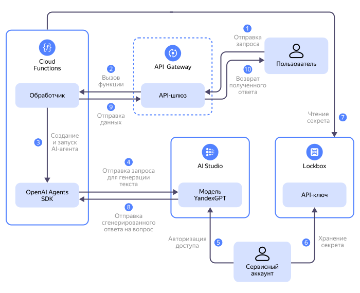

В этом руководстве вы создадите агент со стримингом ответа через [веб-сокеты](https://{{ lang }}.wikipedia.org/wiki/WebSocket) на [{{ sf-full-name }}](../../functions/) и [{{ api-gw-full-name }}](../../api-gateway/). Функция будет использовать [OpenAI Agents SDK](https://openai.github.io/openai-agents-python/) для работы с моделями [{{ foundation-models-full-name }}](../../ai-studio/quickstart/yandexgpt.md).

Когда агент обрабатывает сложные запросы, ему может потребоваться продолжительное время на ответ. Например, при генерации больших текстов с рассуждениями, поиске и индексации. В таких случаях важно видеть прогресс и получать частичные результаты по мере готовности. Стриминг ответа позволяет сразу выводить токены или фразы, промежуточные сообщения и статусы шагов, отображать логи, а затем — финальный ответ, не дожидаясь завершения всего сценария. Это повышает воспринимаемую скорость, обеспечивает более интерактивный UI/UX, дает возможность отмены, повтора и динамического обновления интерфейса. Стриминг поддерживается большинством фреймворков. В OpenAI Agents SDK также предусмотрен [стриминг](https://openai.github.io/openai-agents-python/streaming/).



На схеме:

1. Пользователь устанавливает веб-сокетное соединение с [API-шлюзом](../../api-gateway/concepts/index.md) и отправляет по нему запрос к AI-агенту.
1. API-шлюз перенаправляет запрос в обработчик [функции](../../functions/concepts/function.md).
1. Обработчик функции создает и запускает AI-агента с помощью OpenAI Agent SDK в режиме стриминга. В этом режиме агент будет передавать данные от модели по мере их поступления, не дожидаясь полного ответа.
1. AI-агент расширяет запрос пользователя дополнительным контекстом и отправляет его в [модель генерации текста](../../ai-studio/concepts/generation/index.md).
1. [Сервисный аккаунт](../../iam/concepts/users/service-accounts.md) с помощью [API-ключа](../../iam/concepts/authorization/api-key.md) предоставляет AI-агенту доступ к [Text Generation API](../../ai-studio/text-generation/api-ref/index.md).
1. Сервисный аккаунт предоставляет функции доступ к [секрету](../../lockbox/concepts/secret.md), в котором хранится API-ключ сервисного аккаунта.
1. Функция получает из секрета API-ключ сервисного аккаунта.
1. Модель передает AI-агенту сгенерированный ответ.
1. AI-агент передает данные от модели по мере их поступления. Данные сразу перенаправляются в открытое пользователем веб-сокетное соединение с помощью [{{ api-gw-name }} WebSocket Connection Service](../../api-gateway/apigateway/websocket/api-ref/Connection/send.md). Завершается выполнение функции.
1. API-шлюз перенаправляет ответ пользователю.

Чтобы создать агент:

1. [Подготовьте облако к работе](#before-begin).
1. [Настройте окружение](#setup-environment).
1. [Подготовьте файлы проекта](#prepare-files).
1. [Создайте сервисный аккаунт](#create-sa).
1. [Создайте API-ключ](#create-api-key).
1. [Создайте секрет для API-ключа](#create-secret).
1. [Создайте функцию](#create-function).
1. [Создайте API-шлюз](#create-gateway).
1. [Проверьте результат](#check-result).

Если созданные ресурсы вам больше не нужны, [удалите их](#clear-out).



Если вы не хотите привязывать AI-агент к вендору, разверните функцию в {{ serverless-containers-full-name }}, как описано в руководстве [{#T}](../../tutorials/serverless/functions-framework-to-container.md).







## Подготовьте облако к работе {#before-begin}




### Необходимые платные ресурсы {#paid-resources}

В стоимость поддержки инфраструктуры для этого практического руководства входят:

* Плата за количество запросов к API-шлюзу и исходящий трафик (см. [тарифы {{ api-gw-name }}](../../api-gateway/pricing.md)).
* Плата за генерацию текста (см. [тарифы {{ foundation-models-full-name }}](../../ai-studio/pricing.md)).
* Плата за количество вызовов функции, вычислительные ресурсы, выделенные для выполнения функции, и исходящий трафик (см. [тарифы {{ sf-name }}](../../functions/pricing.md)).
* Плата за хранение секрета и операции с ним (см. [тарифы {{ lockbox-full-name }}](../../lockbox/pricing.md)).
* Плата за получение и хранение логов (см. [тарифы {{ cloud-logging-full-name }}](../../logging/pricing.md)).


## Настройте окружение {#setup-environment}

1. Установите утилиту [jq](https://jqlang.org/manual/) для работы с [JSON](https://{{ lang }}.wikipedia.org/wiki/JSON):

    

      - Linux {#linux}

        ```bash
        apt-get install jq
        ```

      - macOS {#macos}

        ```bash
        brew install jq
        ```

    

1. Установите утилиту [wscat](https://www.npmjs.com/package/wscat) для проверки работы агента:

    ```bash
    npm install -g wscat
    ```


## Подготовьте файлы проекта {#prepare-files}

Для выполнения руководства вам понадобятся файлы с кодом функции и спецификация API-шлюза.



- Репозиторий

  Склонируйте репозиторий:

  ```bash
  git clone https://github.com/yandex-cloud-examples/yc-serverless-streaming-openai-agent
  ```

  В репозитории вы увидите:

  * архив `function.zip` с кодом функции `function.py` и описанием зависимостей `requirements.txt`;
  * спецификацию API-шлюза `gateway-spec.yaml`.

- Вручную

  1. Создайте папку `yc-serverless-streaming-openai-agent` и перейдите в нее.
  1. Создайте файл `function.py` и вставьте в него код:

      ```python
      import asyncio
      import json
      import os
      import random
      from typing import Dict, Any

      from agents import Agent, OpenAIProvider, Runner, RunConfig, function_tool, set_tracing_disabled
      from openai import AsyncOpenAI
      from openai.types.responses import ResponseTextDeltaEvent
      from yandex.cloud.serverless.apigateway.websocket.v1.connection_service_pb2 import SendToConnectionRequest
      from yandex.cloud.serverless.apigateway.websocket.v1.connection_service_pb2_grpc import ConnectionServiceStub
      from yandexcloud import SDK

      BASE_URL = os.getenv("BASE_URL")
      API_KEY = os.getenv("API_KEY")
      MODEL_NAME = os.getenv("MODEL_NAME")
      FOLDER_ID = os.environ.get('FOLDER_ID')

      client = AsyncOpenAI(base_url=BASE_URL, api_key=API_KEY)
      set_tracing_disabled(disabled=True)

      @function_tool
      def how_many_jokes() -> int:
          return random.randint(1, 10)

      # Инициализация SDK {{ yandex-cloud }}
      sdk = SDK()

      def get_websocket_service():
          return sdk.client(ConnectionServiceStub)

      def stream_to_websocket(connection_id: str, message: str):
          """Отправка сообщения в WebSocket соединение"""
          websocket_service = get_websocket_service()
          request = SendToConnectionRequest(
              connection_id=connection_id,
              type=SendToConnectionRequest.TEXT,
              data=message.encode('utf-8')
          )
          websocket_service.Send(request)

      async def process_stream(agent: Agent, run_config: RunConfig, connection_id: str, input_text: str):
          """Обработка стрима от агента и отправка в WebSocket"""
          result = Runner.run_streamed(
              agent,
              input=input_text,
              run_config=run_config
          )

          print("=== Run starting ===")

          async for event in result.stream_events():
              if event.type == "raw_response_event" and isinstance(event.data, ResponseTextDeltaEvent):
                  stream_to_websocket(connection_id, event.data.delta)

          print("=== Run complete ===")

      def handler(event: Dict[str, Any], context):
          """Основной обработчик Cloud Function"""
          try:
              # Получаем параметры из события
              input_text = event['body']
              request_context = event.get('requestContext')
              connection_id = request_context.get('connectionId')

              if not connection_id or not input_text:
                  return {
                      'statusCode': 400,
                      'body': json.dumps({'error': 'Missing required parameters'})
                  }

              # Создаем агента
              agent = Agent(
                  name="Joker",
                  instructions="First call the `how_many_jokes` tool, then tell that many jokes about topic from input.",
                  tools=[how_many_jokes],
                  model=f"gpt://{FOLDER_ID}/yandexgpt/latest",
              )

              run_config = RunConfig(
                  model_provider=OpenAIProvider(
                      api_key=API_KEY,
                      project=FOLDER_ID,
                      base_url="https://rest-assistant.api.cloud.yandex.net/v1",
                      use_responses=True
                  )
              )

              # Запускаем асинхронную обработку
              asyncio.run(process_stream(agent, run_config, connection_id, input_text))

              return {
                  'statusCode': 200
              }

          except Exception as e:
              return {
                  'statusCode': 500,
                  'body': json.dumps({'error': str(e)})
              }
      ```

  1. Создайте файл `requirements.txt` и вставьте в него код:

      ```text
      openai-agents>=0.0.17
      yandexcloud>=0.227.0
      grpcio>=1.60.0
      protobuf>=4.25.1
      openai~=1.86.0
      ```

  1. Создайте архив `function.zip` и добавьте в него файлы `function.py` и `requirements.txt`.
  1. Создайте файл `gateway-spec.yaml` и вставьте в него код:

      ```yaml
      openapi: 3.0.0
      info:
        title: Sample API
        version: 1.0.0
      paths:
        /:
          x-yc-apigateway-websocket-message:
            x-yc-apigateway-integration:
              payload_format_version: '0.1'
              function_id: <идентификатор_функции>
              tag: $latest
              type: cloud_functions
              service_account_id: <идентификатор_сервисного_аккаунта>
      ```

      После создания сервисного аккаунта и функции потребуется указать их идентификаторы.




## Создайте сервисный аккаунт {#create-sa}

С помощью сервисного аккаунта функция получит доступ к секрету и модели {{ foundation-models-name }}, а API-шлюз получит доступ к функции.



- Консоль управления {#console}

  1. В [консоли управления]({{ link-console-main }}) выберите [каталог](../../resource-manager/concepts/resources-hierarchy.md#folder), в котором вы будете создавать инфраструктуру.
  1. В списке сервисов выберите **{{ ui-key.yacloud.iam.folder.dashboard.label_iam }}**.
  1. Нажмите **{{ ui-key.yacloud.iam.folder.service-accounts.button_add }}**.
  1. Введите имя сервисного аккаунта: `agent-streamer-sa`.
  1. Нажмите  **{{ ui-key.yacloud.iam.folder.service-account.label_add-role }}** и выберите [роли](../../iam/roles-reference.md):
      * `serverless.functions.invoker`
      * `lockbox.payloadViewer`
      * `api-gateway.websocketWriter`
      * `ai.languageModels.user`

  1. Нажмите **{{ ui-key.yacloud.iam.folder.service-account.popup-robot_button_add }}**.

- {{ yandex-cloud }} CLI {#cli}

  

  

  1. Создайте сервисный аккаунт:

      ```bash
      yc iam service-account create --name agent-streamer-sa
      ```

      Результат:

      ```text
      id: ajehqs5gee2e********
      folder_id: b1g681qpemb4********
      created_at: "2025-07-12T17:53:28.180991864Z"
      name: agent-streamer-sa
      ```

  1. Назначьте [роли](../../iam/roles-reference.md) сервисному аккаунту:

      ```bash
      yc resource-manager folder add-access-binding <имя_или_идентификатор_каталога> \
        --role serverless.functions.invoker \
        --subject serviceAccount:<идентификатор_сервисного_аккаунта>

      yc resource-manager folder add-access-binding <имя_или_идентификатор_каталога> \
        --role lockbox.payloadViewer \
        --subject serviceAccount:<идентификатор_сервисного_аккаунта>

      yc resource-manager folder add-access-binding <имя_или_идентификатор_каталога> \
        --role api-gateway.websocketWriter \
        --subject serviceAccount:<идентификатор_сервисного_аккаунта>

      yc resource-manager folder add-access-binding <имя_или_идентификатор_каталога> \
        --role ai.languageModels.user \
        --subject serviceAccount:<идентификатор_сервисного_аккаунта>
      ```

      Результат:

      ```text
      effective_deltas:
        - action: ADD
          access_binding:
            role_id: serverless.functions.invoker
            subject:
              id: ajehqs5gee2e********
              type: serviceAccount

      effective_deltas:
        - action: ADD
          access_binding:
            role_id: lockbox.payloadViewer
            subject:
              id: ajehqs5gee2e********
              type: serviceAccount

      effective_deltas:
        - action: ADD
          access_binding:
            role_id: api-gateway.websocketWriter
            subject:
              id: ajehqs5gee2e********
              type: serviceAccount

      effective_deltas:
        - action: ADD
          access_binding:
            role_id: ai.languageModels.user
            subject:
              id: ajehqs5gee2e********
              type: serviceAccount
      ```

- API {#api}

  Чтобы создать сервисный аккаунт, воспользуйтесь методом REST API [create](../../iam/api-ref/ServiceAccount/create.md) для ресурса [ServiceAccount](../../iam/api-ref/ServiceAccount/index.md) или вызовом gRPC API [ServiceAccountService/Create](../../iam/api-ref/grpc/ServiceAccount/create.md).

  Чтобы назначить сервисному аккаунту [роли](../../iam/roles-reference.md) `serverless.functions.invoker`, `lockbox.payloadViewer`, `api-gateway.websocketWriter` и `ai.languageModels.user` на каталог, воспользуйтесь методом REST API [updateAccessBindings](../../resource-manager/api-ref/Folder/updateAccessBindings.md) для ресурса [Folder](../../resource-manager/api-ref/Folder/index.md) или вызовом gRPC API [FolderService/UpdateAccessBindings](../../resource-manager/api-ref/grpc/Folder/updateAccessBindings.md).




## Создайте API-ключ {#create-api-key}

С помощью API-ключа функция получит доступ к модели {{ foundation-models-name }}.



- Консоль управления {#console}

  1. В [консоли управления]({{ link-console-main }}) выберите сервис **{{ ui-key.yacloud.iam.folder.dashboard.label_iam }}**
  1. Выберите созданный ранее сервисный аккаунт `agent-streamer-sa`.
  1. На панели сверху нажмите  **{{ ui-key.yacloud.iam.folder.service-account.overview.button_create-key-popup }}** и выберите **{{ ui-key.yacloud.iam.folder.service-account.overview.button_create_api_key }}**.
  1. В поле **{{ ui-key.yacloud.iam.folder.service-account.overview.field_key-scope }}** выберите [область действия](../../iam/concepts/authorization/api-key.md#scoped-api-keys) `yc.ai.languageModels.execute`.
  1. Нажмите **{{ ui-key.yacloud.iam.folder.service-account.overview.popup-key_button_create }}**.
  1. Сохраните полученный идентификатор и секретный ключ — они понадобятся при создании функции.

      

      После закрытия диалога значение ключа будет недоступно.

      

- {{ yandex-cloud }} CLI {#cli}

  

  Выполните команду:

  ```bash
  yc iam api-key create \
    --service-account-id <идентификатор_сервисного_аккаунта> \
    --scopes yc.ai.languageModels.execute
  ```

  Где:

  * `--service-account-id` — идентификатор сервисного аккаунта `agent-streamer-sa`.
  * `--scopes` — [области действия](../../iam/concepts/authorization/api-key.md#scoped-api-keys) ключа.

  Результат:

  ```text
  api_key:
    id: aje3dkdmq2qn********
    service_account_id: ajehqs5gee2e********
    created_at: "2025-07-12T18:00:46.418035313Z"
    scope: yc.ai.languageModels.execute
    scopes:
      - yc.ai.languageModels.execute
  secret: AQVNw20bbQtXhfpblT04zJs8Z1wUT5rD********
  ```

  Сохраните значение поля `secret`.

- API {#api}

  Чтобы создать API-ключ, воспользуйтесь методом REST API [create](../../iam/api-ref/ApiKey/create.md) для ресурса [ApiKey](../../iam/api-ref/ApiKey/index.md) или вызовом gRPC API [ApiKeyService/Create](../../iam/api-ref/grpc/ApiKey/create.md).




## Создайте секрет {{ lockbox-name }} {#create-secret}

В секрете [{{ lockbox-name }}](../../lockbox/) будет храниться секретный ключ.



- Консоль управления {#console}

  1. В [консоли управления]({{ link-console-main }}) выберите сервис **{{ ui-key.yacloud.iam.folder.dashboard.label_lockbox }}**.
  1. Нажмите **{{ ui-key.yacloud.lockbox.button_create-secret }}**.
  1. В поле **{{ ui-key.yacloud.common.name }}** введите имя секрета: `api-key-secret`.
  1. В поле **{{ ui-key.yacloud.lockbox.forms.title_secret-type }}** выберите `{{ ui-key.yacloud.lockbox.forms.title_secret-type-custom }}`.
  1. В поле **{{ ui-key.yacloud.lockbox.forms.label_key }}** введите `api-key`.
  1. В поле **{{ ui-key.yacloud.lockbox.forms.label_value }}** вставьте полученный на предыдущем шаге секретный ключ.
  1. Нажмите **{{ ui-key.yacloud.common.create }}**.

- {{ yandex-cloud }} CLI {#cli}

  

  Выполните команду:

  ```bash
  yc lockbox secret create \
    --name api-key-secret \
    --payload "[{'key': 'api-key', 'text_value': '<секретный_ключ>'}]"
  ```

  Где `text_value` — секретный ключ API-ключа, полученный на предыдущем шаге.

  Результат:

  ```text
  id: e6q0rdjdggjp********
  folder_id: b1g681qpemb4********
  created_at: "2025-07-12T18:23:49.844Z"
  name: api-key-secret
  status: ACTIVE
  current_version:
    id: e6qbp772i014********
    secret_id: e6q0rdjdggjp********
    created_at: "2025-07-12T18:23:49.844Z"
    status: ACTIVE
    payload_entry_keys:
      - api-key
  ```

- API {#api}

  Чтобы создать секрет, воспользуйтесь методом REST API [create](../../lockbox/api-ref/Secret/create.md) для ресурса [Secret](../../lockbox/api-ref/Secret/index.md) или вызовом gRPC API [SecretService/Create](../../lockbox/api-ref/grpc/Secret/create.md).




## Создайте функцию {#create-function}

Функция будет создана на основании архива с кодом и описанием зависимостей.



- Консоль управления {#console}

  1. В [консоли управления]({{ link-console-main }}) выберите сервис **{{ ui-key.yacloud.iam.folder.dashboard.label_serverless-functions }}**.
  1. Создайте функцию:

     1. Нажмите **{{ ui-key.yacloud.serverless-functions.list.button_create }}**.
     1. В открывшемся окне введите имя функции: `agent-streamer`.
     1. Нажмите **{{ ui-key.yacloud.common.create }}**.

  1. Создайте [версию функции](../../functions/concepts/function.md#version):

     1. Выберите среду выполнения `{{ python-full-ver }}`, отключите опцию **{{ ui-key.yacloud.serverless-functions.item.editor.label_with-template }}** и нажмите **{{ ui-key.yacloud.serverless-functions.item.editor.button_action-continue }}**.
     1. В поле **{{ ui-key.yacloud.serverless-functions.item.editor.field_method }}** выберите `{{ ui-key.yacloud.serverless-functions.item.editor.value_method-zip-file }}` и прикрепите созданный ранее архив `function.zip`.
     1. Укажите точку входа `function.handler`.
     1. В блоке **{{ ui-key.yacloud.serverless-functions.item.editor.label_title-params }}** укажите:

         * **{{ ui-key.yacloud.serverless-functions.item.editor.field_timeout }}** — `30 секунд`.
         * **{{ ui-key.yacloud.serverless-functions.item.editor.field_resources-memory }}** — `512 {{ ui-key.yacloud.common.units.label_megabyte }}`.
         * **{{ ui-key.yacloud.forms.label_service-account-select }}** — выберите сервисный аккаунт `agent-streamer-sa`.
         * **{{ ui-key.yacloud.serverless-functions.item.editor.field_environment-variables }}**:

             * `BASE_URL` — URL сервиса {{ foundation-models-full-name }}: `https://{{ api-host-llm }}/v1`.
             * `MODEL_NAME` — [URI модели](../../ai-studio/concepts/generation/models.md#generation) генерации текста {{ foundation-models-full-name }}.

                 Например: `gpt://<идентификатор_каталога>/yandexgpt/latest`, где `<идентификатор_каталога>` — [идентификатор каталога](../../resource-manager/operations/folder/get-id.md), в котором вы создаете инфраструктуру.

             * `FOLDER_ID` — [идентификатор каталога](../../resource-manager/operations/folder/get-id.md), в котором вы создаете инфраструктуру.

         * **{{ ui-key.yacloud.serverless-functions.item.editor.label_lockbox-secret }}**:

             * В поле **{{ ui-key.yacloud.serverless-functions.item.editor.label_lockbox-env-key }}** укажите `API_KEY` и выберите созданный ранее секрет `api-key-secret`, его версию и ключ `api-key`.

        * Если вы не хотите сохранять логи и [платить](../../logging/pricing.md) за использование сервиса [{{ cloud-logging-name }}](../../logging/), отключите опцию **{{ ui-key.yacloud.logging.field_logging }}**.

     1. Нажмите **{{ ui-key.yacloud.serverless-functions.item.editor.button_deploy-version }}**.

- {{ yandex-cloud }} CLI {#cli}

  

  1. Создайте функцию:

      ```bash
      yc serverless function create --name agent-streamer
      ```

      Результат:

      ```text
      id: d4eem33cun2k********
      folder_id: b1g681qpemb4********
      created_at: "2025-07-12T18:15:59.854Z"
      name: agent-streamer
      http_invoke_url: https://{{ sf-url }}/d4eem33cun2k********
      status: ACTIVE
      ```

  1. Создайте версию функции:

      ```bash
      yc serverless function version create \
        --function-name agent-streamer \
        --runtime python312 \
        --entrypoint function.handler \
        --memory 512m \
        --execution-timeout 30s \
        --source-path <путь_к_архиву> \
        --service-account-id <идентификатор_сервисного_аккаунта> \
        --environment BASE_URL=https://{{ api-host-llm }}/v1 \
        --environment MODEL_NAME=gpt://<идентификатор_каталога>/yandexgpt/latest \
        --environment FOLDER_ID=<идентификатор_каталога> \
        --secret name=api-key-secret,key=api-key,environment-variable=API_KEY
      ```

      Где:

      * `--source-path` — путь к архиву `function.zip`.
      * `--service-account-id` — идентификатор сервисного аккаунта `agent-streamer-sa`.
      * `--environment` — переменные окружения:

          * `BASE_URL` — URL сервиса {{ foundation-models-full-name }}: `https://{{ api-host-llm }}/v1`.
          * `MODEL_NAME` — [URI модели](../../ai-studio/concepts/generation/models.md#generation) генерации текста {{ foundation-models-full-name }}.

              Например: `gpt://<идентификатор_каталога>/yandexgpt/latest`, где `<идентификатор_каталога>` — [идентификатор каталога](../../resource-manager/operations/folder/get-id.md), в котором вы создаете инфраструктуру.

          * `FOLDER_ID` — [идентификатор каталога](../../resource-manager/operations/folder/get-id.md), в котором вы создаете инфраструктуру.

      * `--secret` — секрет `api-key-secret`.

      Результат:

      ```text
      id: d4e6d89oi342********
      function_id: d4eem33cun2k********
      created_at: "2025-07-12T18:27:29.887Z"
      runtime: python312
      entrypoint: function.handler
      resources:
        memory: "536870912"
      execution_timeout: 30s
      service_account_id: ajehqs5gee2e********
      image_size: "59891712"
      status: ACTIVE
      tags:
        - $latest
      environment:
        BASE_URL: https://{{ api-host-llm }}/foundationModels/v1
        FOLDER_ID: b1g681qpemb4********
        MODEL_NAME: gpt://b1g681qpemb4********/yandexgpt/latest
      secrets:
        - id: e6q0rdjdggjp********
          version_id: e6qbp772i014********
          key: api-key
          environment_variable: API_KEY
      log_options:
        folder_id: b1g681qpemb4********
      concurrency: "1"
      ```

- API {#api}

  Чтобы создать функцию, воспользуйтесь методом REST API [create](../../functions/functions/api-ref/Function/create.md) для ресурса [Function](../../functions/functions/api-ref/Function/index.md) или вызовом gRPC API [FunctionService/Create](../../functions/functions/api-ref/grpc/Function/create.md).

  Чтобы создать версию функции, воспользуйтесь методом REST API [createVersion](../../functions/functions/api-ref/Function/createVersion.md) для ресурса [Function](../../functions/functions/api-ref/Function/index.md) или вызовом gRPC API [FunctionService/CreateVersion](../../functions/functions/api-ref/grpc/Function/createVersion.md).




## Создайте API-шлюз {#create-gateway}

Создайте API-шлюз для доступа к функции.

1. Откройте файл `gateway-spec.yaml` и укажите в нем данные:

    * `function_id` — идентификатор функции `agent-streamer`;
    * `service_account_id` — идентификатор сервисного аккаунта `agent-streamer-sa`.

1. Создайте API-шлюз:

    

    - Консоль управления {#console}

      1. В [консоли управления]({{ link-console-main }}) выберите сервис **{{ ui-key.yacloud.iam.folder.dashboard.label_api-gateway }}**.
      1. Нажмите **{{ ui-key.yacloud.serverless-functions.gateways.list.button_create }}**.
      1. В поле **{{ ui-key.yacloud.common.name }}** введите имя API-шлюза: `agent-streamer-gateway`.
      1. В блок **{{ ui-key.yacloud.serverless-functions.gateways.form.field_spec }}** вставьте содержимое файла `gateway-spec.yaml`.
      1. Если вы не хотите сохранять логи и платить за использование сервиса {{ cloud-logging-name }}, отключите опцию **{{ ui-key.yacloud.logging.field_logging }}**.
      1. Нажмите **{{ ui-key.yacloud.serverless-functions.gateways.form.button_create-gateway }}**.
      1. Выберите созданный API-шлюз. Сохраните значение поля **{{ ui-key.yacloud.serverless-functions.gateways.overview.label_wss_domain }}** — оно потребуется на следующем шаге.

    - {{ yandex-cloud }} CLI {#cli}

      

      Выполните команду:

      ```bash
      yc serverless api-gateway create \
      --name agent-streamer-gateway \
      --spec <путь_к_спецификации>
      ```

      Где `--spec` — путь к файлу `gateway-spec.yaml`.

      Результат:

      ```text
      id: d5dgs4pn5iil********
      folder_id: b1g681qpemb4********
      created_at: "2025-07-12T18:34:29.535Z"
      name: agent-streamer-gateway
      status: ACTIVE
      domain: d5dgs4pn5iil********.********.apigw.yandexcloud.net
      connectivity: {}
      log_options:
        folder_id: b1g681qpemb4********
      execution_timeout: 300s
      ```

      Сохраните значение поля `domain` — оно потребуется на следующем шаге.

    - API {#api}

      Чтобы создать API-шлюз, воспользуйтесь методом REST API [create](../../api-gateway/apigateway/api-ref/ApiGateway/create.md) для ресурса [ApiGateway](../../api-gateway/apigateway/api-ref/ApiGateway/index.md) или вызовом gRPC API [ApiGatewayService/Create](../../api-gateway/apigateway/api-ref/grpc/ApiGateway/create.md).

    


## Проверьте работу агента {#check-result}

1. Подключитесь к WebSocket:

    ```bash
    wscat -c wss://<домен_API-шлюза>
    ```


1. Отправьте сообщение:

    ```text
    Tell me a joke about programming
    ```

    Результат:

    ```text
    < Here
    <  are 5 jokes about
    <  programming:
    ...
    ```

    Текст ответа может отличаться.


## Как удалить созданные ресурсы {#clear-out}

Чтобы не [платить](#paid-resources) за ресурсы, которые вам больше не нужны, удалите их:

1. [Удалите](../../api-gateway/operations/api-gw-delete.md) API-шлюз.
1. [Удалите](../../functions/operations/function/function-delete.md) функцию.
1. [Удалите](../../lockbox/operations/secret-delete.md) секрет.
1. Если вы оставляли включенной опцию записи логов функции, [удалите](../../logging/operations/delete-group.md) лог-группу.