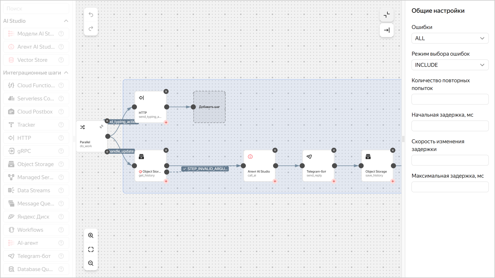

# Как создать бота в Telegram с поддержкой AI-агента с помощью {{ sw-full-name }}


С помощью serverless-технологий можно создать [бота](../../glossary/chat-bot.md) для Telegram с поддержкой [модели генерации текста]({{ link-docs-ai }}ai-studio/concepts/generation/models) на базе сервиса [{{ ai-studio-full-name }}]({{ link-docs-ai }}ai-studio/concepts/index).

В этом руководстве вы создадите бота для подбора фильмов на основании предпочтений пользователя. Для этого вы создадите AI-агента, организуете хранение данных в [{{ objstorage-full-name }}](../../storage/) и [{{ lockbox-full-name }}](../../lockbox/), настроите логику бота в [{{ sw-full-name }}](../../serverless-integrations/) и вебхук для запуска по ссылке.

Чтобы создать бота:

1. [Подготовьте облако к работе](#before-you-begin).
1. [Зарегистрируйте Telegram-бота](#create-bot).
1. [Создайте секрет](#create-secret).
1. [Создайте бакет](#create-bucket).
1. [Создайте сервисный аккаунт](#create-sa).
1. [Создайте AI-агента](#create-ai-agent).
1. [Настройте рабочий процесс](#config-workflow).
1. [Настройте вебхук для бота](#config-webhook).
1. [Проверьте работу бота](#check-result).
1. [Настройте агент под вашу задачу](#what-is-next).

Если созданные ресурсы вам больше не нужны, [удалите их](#clear-out).


## Перед началом работы {#before-you-begin}




## Необходимые платные ресурсы {#paid-resources}

В стоимость поддержки Telegram-бота входят:

* плата за генерацию текста (см. [тарифы {{ ai-studio-full-name }}]({{ link-docs-ai }}ai-studio/pricing));
* плата за хранение секрета и запросы к нему (см. [тарифы {{ lockbox-full-name }}](../../lockbox/pricing.md));
* плата за объем хранилища, занятый данными, количество операций с данными и исходящий трафик (см. [тарифы {{ objstorage-full-name }}](../../storage/pricing.md));
* плата за получение и хранение логов (см. [тарифы {{ cloud-logging-full-name }}](../../logging/pricing.md)).


## Зарегистрируйте Telegram-бота {#create-bot}

Зарегистрируйте вашего бота в Telegram и получите токен.

1. Для регистрации нового бота запустите бота [BotFather](https://t.me/BotFather) и отправьте команду:

    ```text
    /newbot
    ```

1. Укажите имя создаваемого бота, например `Serverless AI Telegram Bot`. Это имя увидят пользователи при общении с ботом.
1. Укажите имя пользователя создаваемого бота, например `ServerlessAITelegramBot`. По имени пользователя можно будет найти бота в Telegram. Имя пользователя должно оканчиваться на `...Bot` или `..._bot`.

    В результате вы получите токен. Сохраните его, он потребуется в дальнейшем.


## Создайте секрет {#create-secret}

Создайте [секрет](../../lockbox/concepts/secret.md), в котором будет храниться токен для доступа к API Telegram.



- Консоль управления {#console}

  1. В [консоли управления]({{ link-console-main }}) выберите [каталог](../../resource-manager/concepts/resources-hierarchy.md#folder), в котором вы будете создавать инфраструктуру.
  1. [Перейдите](../../console/operations/select-service.md#select-service) в сервис **{{ ui-key.yacloud.iam.folder.dashboard.label_lockbox }}**.
  1. Нажмите **{{ ui-key.yacloud.lockbox.button_create-secret }}**.
  1. В поле **{{ ui-key.yacloud.common.name }}** введите имя секрета.
  1. Выберите тип секрета `{{ ui-key.yacloud.lockbox.forms.title_secret-type-custom }}`.
  1. В поле **{{ ui-key.yacloud.lockbox.forms.label_key }}** введите `token`.
  1. В поле **{{ ui-key.yacloud.lockbox.forms.label_value }}** укажите токен бота, полученный при его [создании](#create-bot).
  1. Нажмите **{{ ui-key.yacloud.common.create }}**.

- {{ yandex-cloud }} CLI {#cli}

  

  

  1. Посмотрите описание команды CLI для создания секрета:

      ```bash
      yc lockbox secret create --help
      ```

  1. Создайте секрет:

      ```bash
      yc lockbox secret create \
        --name tg-bot-token \
        --payload '[{"key":"token","text_value":"<токен_бота>"}]'
      ```

      Где:

      * `--name` — имя секрета.
      * `--payload` — содержимое секрета в виде массива формата YAML или JSON:

          * `key` — ключ секрета.
          * `text_value` — значение секрета. Укажите токен, полученный при [создании бота](#create-bot).

      Результат:

      ```text
      id: e6qf05v4ftms********
      folder_id: b1g681qpemb4********
      created_at: "2025-08-20T12:26:02.961Z"
      name: tg-bot-token
      status: ACTIVE
      current_version:
        id: e6q768pl3vrf********
        secret_id: e6qf05v4ftms********
        created_at: "2025-08-20T12:26:02.961Z"
        status: ACTIVE
        payload_entry_keys:
          - token
      ```

- API {#api}

  Чтобы создать секрет, воспользуйтесь методом REST API [Create](../../lockbox/api-ref/Secret/create.md) для ресурса [Secret](../../lockbox/api-ref/Secret/index.md) или вызовом gRPC API [SecretService/Create](../../lockbox/api-ref/grpc/Secret/create.md).




## Создайте бакет {#create-bucket}

Создайте [бакет](../../storage/concepts/bucket.md) для хранения истории чата с ботом.



- Консоль управления {#console}

  1. Откройте [консоль управления]({{ link-console-main }}).
  1. [Перейдите](../../console/operations/select-service.md#select-service) в сервис **{{ ui-key.yacloud.iam.folder.dashboard.label_storage }}**.
  1. На панели сверху нажмите **{{ ui-key.yacloud.storage.buckets.button_create }}**.
  1. Введите имя бакета в соответствии с [правилами именования](../../storage/concepts/bucket.md#naming).
  1. Укажите максимальный размер бакета `5 {{ ui-key.yacloud.common.units.label_gigabyte }}`.
  1. Нажмите **{{ ui-key.yacloud.storage.buckets.create.button_create }}**.

- {{ yandex-cloud }} CLI {#cli}

  1. Посмотрите описание команды CLI для создания бакета:

      ```bash
      yc storage bucket create --help
      ```

  1. Создайте бакет в [каталоге](../../resource-manager/concepts/resources-hierarchy.md#folder) по умолчанию:

      ```bash
      yc storage bucket create \
        --name <имя_бакета> \
        --default-storage-class standard \
        --max-size 5368709120
      ```

      Где:

      * `--name` — имя бакета в соответствии с [правилами именования](../../storage/concepts/bucket.md#naming).
      * `--default-storage-class` — [класс хранилища](../../storage/concepts/storage-class.md).
      * `--max-size` — максимальный размер бакета в байтах.

      Результат:

      ```text
      name: bot-history-storage
      folder_id: b1g681qpemb4********
      anonymous_access_flags: {}
      default_storage_class: STANDARD
      versioning: VERSIONING_DISABLED
      max_size: "5368709120"
      created_at: "2025-08-20T12:23:21.361186Z"
      resource_id: e3erbgk1qmih********
      ```

- AWS CLI {#aws-cli}

  

  Чтобы создать бакет, [назначьте](../../iam/operations/sa/assign-role-for-sa.md) сервисному аккаунту, через который работает AWS CLI, [роль](../../storage/security/index.md#storage-editor) `storage.editor`.

  В терминале выполните команду:

  ```bash
  aws s3api create-bucket \
    --endpoint-url=https://{{ s3-storage-host }} \
    --bucket <имя_бакета>
  ```

  Где:

  * `--endpoint-url` — эндпоинт {{ objstorage-name }}.
  * `--bucket` — имя бакета в соответствии с [правилами именования](../../storage/concepts/bucket.md#naming).

- API {#api}

  Чтобы создать бакет, воспользуйтесь методом REST API [Create](../../storage/api-ref/Bucket/create.md) для ресурса [Bucket](../../storage/api-ref/Bucket/index.md), вызовом gRPC API [BucketService/Create](../../storage/api-ref/grpc/Bucket/create.md) или методом S3 API [create](../../storage/s3/api-ref/bucket/create.md).




## Создайте сервисный аккаунт {#create-sa}

Создайте [сервисный аккаунт](../../iam/concepts/users/service-accounts.md) `sa-workflows` — от его имени будут выполняться шаги рабочего процесса.



- Консоль управления {#console}

  1. Откройте [консоль управления]({{ link-console-main }}).
  1. [Перейдите](../../console/operations/select-service.md#select-service) в сервис **{{ ui-key.yacloud.iam.folder.dashboard.label_iam }}**.
  1. Нажмите **{{ ui-key.yacloud.iam.folder.service-accounts.button_add }}**.
  1. Введите имя сервисного аккаунта `sa-workflows`.
  1. Нажмите  **{{ ui-key.yacloud.iam.folder.service-account.label_add-role }}** и назначьте [роли](../../iam/roles-reference.md):

      * `storage.uploader`
      * `storage.viewer`
      * `{{ roles-lockbox-payloadviewer }}`
      * `{{ roles-yagpt-user }}`
      * `ai.assistants.editor`

  1. Нажмите **{{ ui-key.yacloud.iam.folder.service-account.popup-robot_button_add }}**.

- {{ yandex-cloud }} CLI {#cli}

  1. Если у вас еще нет [jq](https://stedolan.github.io/jq/download/), установите его.

  1. Посмотрите описание команды CLI для создания сервисного аккаунта:

      ```bash
      yc iam service-account create --help
      ```

  1. Создайте сервисный аккаунт:

      ```bash
      yc iam service-account create --name sa-workflows
      ```

      Где `--name` — имя сервисного аккаунта.

      Результат:

      ```text
      id: ajersnus6rb2********
      folder_id: b1g681qpemb4********
      created_at: "2025-08-20T12:18:41.869376672Z"
      name: sa-workflows
      ```

  1. Сохраните идентификатор сервисного аккаунта и идентификатор каталога в переменные:

      ```bash
      WF_SA=$(yc iam service-account get --name sa-workflows --format json | jq -r .id)
      FOLDER_ID=$(yc config get folder-id)
      ```

  1. Посмотрите описание команды CLI для назначения [роли](../../iam/roles-reference.md) на каталог:

      ```bash
      yc resource-manager folder add-access-binding --help
      ```

  1. Назначьте сервисному аккаунту роли на каталог:

      ```bash
      yc resource-manager folder add-access-binding \
        --id $FOLDER_ID \
        --role storage.uploader \
        --subject serviceAccount:$WF_SA

      yc resource-manager folder add-access-binding \
        --id $FOLDER_ID \
        --role storage.viewer \
        --subject serviceAccount:$WF_SA

      yc resource-manager folder add-access-binding \
        --id $FOLDER_ID \
        --role {{ roles-lockbox-payloadviewer }} \
        --subject serviceAccount:$WF_SA

      yc resource-manager folder add-access-binding \
        --id $FOLDER_ID \
        --role {{ roles-yagpt-user }} \
        --subject serviceAccount:$WF_SA

      yc resource-manager folder add-access-binding \
        --id $FOLDER_ID \
        --role ai.assistants.editor \
        --subject serviceAccount:$WF_SA
      ```

      Где:

      * `--id` — идентификатор каталога.
      * `--role` — роль.
      * `--subject` — идентификатор сервисного аккаунта.

      Результат:

      ```text
      effective_deltas:
        - action: ADD
          access_binding:
            role_id: {{ roles-yagpt-user }}
            subject:
              id: ajersnus6rb2********
              type: serviceAccount
      ```

- API {#api}

  Создайте сервисный аккаунт `sa-workflows` с ролями:

  * `storage.uploader`
  * `storage.viewer`
  * `{{ roles-lockbox-payloadviewer }}`
  * `{{ roles-yagpt-user }}`
  * `ai.assistants.editor`

  Чтобы создать сервисный аккаунт, воспользуйтесь методом REST API [Create](../../iam/api-ref/ServiceAccount/create.md) для ресурса [ServiceAccount](../../iam/api-ref/ServiceAccount/index.md) или вызовом gRPC API [ServiceAccountService/Create](../../iam/api-ref/grpc/ServiceAccount/create.md).

  Чтобы назначить роль сервисному аккаунту, воспользуйтесь методом REST API [updateAccessBindings](../../iam/api-ref/ServiceAccount/updateAccessBindings.md) для ресурса [ServiceAccount](../../iam/api-ref/ServiceAccount/index.md) или вызовом gRPC API [ServiceAccountService/UpdateAccessBindings](../../iam/api-ref/grpc/ServiceAccount/updateAccessBindings.md).




## Создайте AI-агента {#create-ai-agent}

Создайте [текстового агента]({{ link-docs-ai }}ai-studio/concepts/agents/text-agents) в {{ ai-studio-name }} для обработки запросов пользователей.



- Консоль управления {#console}

  1. Откройте [интерфейс {{ ai-studio-name }}]({{ link-console-ai }}).
  1. Нажмите **{{ ui-key.yacloud.yagpt.YaGPT.Overview3.action-card_create-ai-agent_ahZQH }}** → **{{ ui-key.yacloud.yagpt.YaGPT.CreateAgentCard.create-agent_button-text_n2qCs }}**.
  1. В поле **{{ ui-key.yacloud.yagpt.YaGPT.name_hTzhB }}** введите имя агента, например `Агент-киноман`.
  1. В поле **{{ ui-key.yacloud.yagpt.YaGPT.agent_instruction_9oe6q }}** введите инструкцию агента:

      ```
      Ты — консультант по подбору фильмов
      
      Цель — помочь пользователю выбрать фильм по его предпочтениям.
      При первом обращении попроси несколько любимых фильмов (по одному в строке).
      Дальше используй их для рекомендаций и задавай уточняющие вопросы.
      
      Предыдущая история общения: not_var{{backstory}}
      ```

      

      Переменная `not_var{{backstory}}` используется для передачи истории диалога в агента. Это позволяет агенту учитывать предыдущие сообщения пользователя при формировании ответа.

      

  1. Нажмите **{{ ui-key.yacloud.common.create }}**.
  1. Скопируйте идентификатор созданного агента — слева вверху нажмите **ID** . Сохраните его. Идентификатор потребуется при настройке рабочего процесса.




## Настройте рабочий процесс {#config-workflow}

Настройте рабочий процесс, который обеспечит чтение и сохранение истории чата, вызов AI-агента и отправку ответов в Telegram.






### Подготовьте YaWL-спецификацию {#prepare-spec-wf}

Сохраните [YaWL-спецификацию](../../serverless-integrations/concepts/workflows/yawl/index.md) рабочего процесса в YAML-файле, например `yawl-spec.yaml`:

```yaml
yawl: '0.1'
start: do_work
steps:
  do_work:
    parallel:
      branches:

        # Ветка, отправляющая «typing», чтобы чат ожил быстрее
        send_typing_action:
          start: send_typing_action
          steps:
            send_typing_action:
              httpCall:
                url: >-
                  https://api.telegram.org/bot\(lockboxPayload("<идентификатор_секрета>"; "token"))/sendChatAction
                method: POST
                headers:
                  Content-Type: application/json
                body: |
                  \({
                    chat_id: .input.message.chat.id,
                    action: "typing"
                  })

        # Основная логика
        handle_update:
          start: get_history
          steps:
            get_history:
              objectStorage:
                bucket: <имя_бакета>
                object: history/\(.input.message.chat.id).json
                get:
                  contentType: JSON
                output: '\({history: .Content})'
                next: call_ai
                catch:
                  - errorList:
                      - STEP_INVALID_ARGUMENT # файла нет или не JSON -> инициализируем
                    errorListMode: INCLUDE
                    output: '\({history: []})'
                    next: call_ai

            call_ai:
              aiStudioAgent:
                promptTemplateId: <идентификатор_агента>
                message: \(.input.message.text)
                variables:
                  backstory: >-
                    История предыдущего общения (формат: JSON-массив объектов)
                    {role,message}): "\(.history)"
                output: '\({reply: .Result})'
                next: send_reply

            send_reply:
              telegramBot:
                token: \(lockboxPayload("<идентификатор_секрета>"; "token"))
                sendMessage:
                  chatId: \(.input.message.chat.id)
                  text: \(.reply)
                  replyTo: \(.input.message.message_id)
                  parseMode: MARKDOWN
                next: save_history

            save_history:
              objectStorage:
                bucket: <имя_бакета>
                object: history/\(.input.message.chat.id).json
                put:
                  contentType: JSON
                  content: >-
                    \(
                      .history +
                      [
                        {role:"user", message:.input.message.text},
                        {role:"assistant", message:.reply}
                      ]
                    )
```

Где:

* `<имя_бакета>` — имя бакета, [созданного ранее](#create-bucket).
* `<идентификатор_секрета>` — идентификатор секрета, [созданного ранее](#create-secret).
* `<идентификатор_агента>` — идентификатор агента, [созданного ранее](#create-ai-agent).


### Создайте рабочий процесс {#create-workflow}



- Консоль управления {#console}

  1. Откройте [консоль управления]({{ link-console-main }}).
  1. [Перейдите](../../console/operations/select-service.md#select-service) в сервис **{{ ui-key.yacloud.iam.folder.dashboard.label_serverless-integrations }}**.
  1. На панели слева нажмите  **{{ ui-key.yacloud.serverless-workflows.label_service }}**.
  1. В правом верхнем углу нажмите **{{ ui-key.yacloud.serverless-workflows.button_create-workflow }}**.
  1. Выберите способ `{{ ui-key.yacloud.serverless-workflows.spec-editor-type_label_text-editor }}`.
  1. В редакторе кода вставьте текст подготовленной ранее YaWL-спецификации рабочего процесса.
  1. Раскройте блок **{{ ui-key.yacloud.serverless-workflows.label_additional-parameters }}**:

      1. Введите имя рабочего процесса. Требования к имени:

          

      1. Выберите сервисный аккаунт `sa-workflows`.
      1. В блоке **{{ ui-key.yacloud.logging.label_title }}** отключите опцию **{{ ui-key.yacloud.logging.field_logging }}**, если не хотите платить за хранение логов.

  1. Нажмите **{{ ui-key.yacloud.common.create }}**.

- {{ yandex-cloud }} CLI {#cli}

  1. Посмотрите описание команды CLI для создания рабочего процесса:

      ```bash
      yc serverless workflow create --help
      ```

  1. Создайте рабочий процесс:

      ```bash
      yc serverless workflow create \
        --yaml-spec <файл_спецификации> \
        --name <имя_рабочего_процесса> \
        --service-account-id $WF_SA
      ```

      Где:

      * `--yaml-spec` — путь к файлу с YaWL-спецификацией рабочего процесса, подготовленной ранее. Например: `./yawl-spec.yaml`.
      * `--name` — имя рабочего процесса. Требования к имени:

          

      * `--service-account-id` — идентификатор сервисного аккаунта `sa-workflows`.

      Результат:

      ```text
      id: dfqjl5hh5p90********
      folder_id: b1g681qpemb4********
      specification:
        spec_yaml: "yawl: ..."
      created_at: "2025-03-11T09:27:51.691990Z"
      name: my-workflow
      status: ACTIVE
      log_options: {}
      service_account_id: aje4tpd9coa********
      execution_url: https://serverless-workflows.{{ api-host }}/workflows/v1/execution/dfq0eod50iol********/start
      ```

- API {#api}

  Чтобы создать рабочий процесс, воспользуйтесь методом REST API [Create](../../serverless-integrations/workflows/api-ref/Workflow/create.md) для ресурса [Workflows](../../serverless-integrations/workflows/api-ref/Workflow/index.md) или вызовом gRPC API [Workflow/Create](../../serverless-integrations/workflows/api-ref/grpc/Workflow/create.md).




### Сделайте рабочий процесс публичным {#make-public}

Сделайте рабочий процесс публичным, чтобы его можно было запустить по ссылке без аутентификации.



- Консоль управления {#console}

  1. В [консоли управления]({{ link-console-main }}) перейдите в каталог, в котором находится [рабочий процесс](../../serverless-integrations/concepts/workflows/workflow.md).
  1. [Перейдите](../../console/operations/select-service.md#select-service) в сервис **{{ ui-key.yacloud.iam.folder.dashboard.label_serverless-integrations }}**.
  1. На панели слева нажмите  **{{ ui-key.yacloud.serverless-workflows.label_service }}**.
  1. Выберите нужный рабочий процесс.
  1. Включите опцию **{{ ui-key.yacloud.serverless-workflows.label_public-access }}**.
  1. Нажмите **{{ ui-key.yacloud.common.save }}**.

- {{ yandex-cloud }} CLI {#cli}

  1. Посмотрите описание команды CLI для изменения [рабочего процесса](../../serverless-integrations/concepts/workflows/workflow.md):

      ```bash
      yc serverless workflow update --help
      ```

  1. Сделайте рабочий процесс публичным:

      ```bash
      yc serverless workflow update \
        --name <имя_рабочего_процесса> \
        --set-is-public
      ```

      Результат:

      ```text
      id: dfqjl5hh5p90********
      ...
      is_public: true
      execution_url: https://serverless-workflows.{{ api-host }}/workflows/v1/execution/dfq0eod50iol********/start
      ```

- API {#api}

  Чтобы сделать [рабочий процесс](../../serverless-integrations/concepts/workflows/workflow.md) публичным, воспользуйтесь методом REST API [Update](../../serverless-integrations/workflows/api-ref/Workflow/update.md) для ресурса [Workflows](../../serverless-integrations/workflows/api-ref/Workflow/index.md) или вызовом gRPC API [workflow/Update](../../serverless-integrations/workflows/api-ref/grpc/Workflow/update.md), установив параметр `isPublic: true`.





Публичный рабочий процесс может быть запущен любым пользователем без IAM-токена. Это необходимо для настройки вебхука Telegram, который будет отправлять запросы на запуск рабочего процесса по ссылке.




## Настройте вебхук для бота {#config-webhook}

Настройте вебхук для бота, чтобы он отправлял запросы на запуск рабочего процесса по ссылке.


### Получите ссылку для запуска рабочего процесса {#get-execution-url}



- Консоль управления {#console}

  1. В [консоли управления]({{ link-console-main }}) перейдите в каталог, в котором находится рабочий процесс.
  1. [Перейдите](../../console/operations/select-service.md#select-service) в сервис **{{ ui-key.yacloud.iam.folder.dashboard.label_serverless-integrations }}**.
  1. На панели слева нажмите  **{{ ui-key.yacloud.serverless-workflows.label_service }}**.
  1. Выберите рабочий процесс. Ссылка для запуска будет в поле **{{ ui-key.yacloud.serverless-workflows.label_execution-url }}**.

- {{ yandex-cloud }} CLI {#cli}

  Чтобы получить ссылку для запуска, выполните команду:

  ```bash
  yc serverless workflow get <имя_рабочего_процесса>
  ```

  Результат:

  ```text
  id: dfqjl5hh5p90********
  ...
  is_public: true
  execution_url: https://serverless-workflows.{{ api-host }}/workflows/v1/execution/dfq0eod50iol********/start
  ```

  Сохраните значение поля `execution_url`.

- API {#api}

  Чтобы получить ссылку для запуска рабочего процесса, воспользуйтесь методом REST API [get](../../serverless-integrations/workflows/api-ref/Workflow/get.md) для ресурса [Workflow](../../serverless-integrations/workflows/api-ref/Workflow/index.md) или вызовом gRPC API [WorkflowsService/Get](../../serverless-integrations/workflows/api-ref/grpc/Workflow/get.md). Ссылка для запуска будет в поле `execution_url`.




### Настройте вебхук {#setup-webhook}

Если у вас еще нет [cURL](https://curl.haxx.se), установите его.



Настройте вебхук для бота:



- Bash {#bash}

  Выполните команду:

  ```bash
  curl -s "https://api.telegram.org/bot<токен_бота>/setWebhook" \
    -d "url=<execution_url>"
  ```

  Где:

  * `<токен_бота>` — токен, полученный при [создании бота](#create-bot).
  * `<execution_url>` — ссылка для запуска рабочего процесса, полученная на [предыдущем шаге](#get-execution-url).

  Например:

  ```bash
  curl -s "https://api.telegram.org/bot1357246809:AAFhSteLniAw71g8jx6K5kTErO3********/setWebhook" \
    -d "url=https://serverless-workflows.{{ api-host }}/workflows/v1/execution/fd2g4pu20roc********/start"
  ```

  Результат:

  ```text
  {"ok":true,"result":true,"description":"Webhook was set"}
  ```




## Проверьте работу бота {#check-result}

1. Найдите бота в Telegram по имени пользователя бота, созданного [ранее](#create-bot).
1. Нажмите **СТАРТ**, чтобы начать чат.
1. Отправьте боту список из нескольких фильмов — по одному названию в строке.

    Например:

    ```text
    Фильм 1
    Фильм 2
    Фильм 3
    ```

    Ответ бота:

    ```text
    Здравствуйте! Спасибо за ваши предпочтения. На основе ваших любимых фильмов я могу предложить вам следующие кинокартины:
    ...
    Какой из предложенных фильмов вас заинтересовал? Или, может быть, у вас есть ещё какие-то предпочтения, которые вы хотели бы учесть?
    ```


#### Что дальше {#what-is-next}

Попробуйте изменить инструкцию агента в {{ ai-studio-name }} под вашу задачу. Например, измените инструкцию агента для подбора музыкальных исполнителей:

```
Ты — консультант по подбору музыкальных исполнителей

Цель — помочь пользователю выбрать музыку по его предпочтениям.
При первом обращении попроси несколько любимых групп, музыкантов,
композиторов, жанров (по одному в строке).
Дальше используй их для рекомендаций и задавай уточняющие вопросы.

Предыдущая история общения: not_var{{backstory}}
```

Также вы можете:
* Добавить текст или файлы в качестве источников информации для агента. Подробнее см. [Текстовые агенты в {{ ai-studio-name }}]({{ link-docs-ai }}ai-studio/concepts/agents/text-agents).
* Настроить управление контекстом диалога. Подробнее см. [Управление контекстом диалога]({{ link-docs-ai }}ai-studio/operations/agents/manage-context).
* Использовать другие инструменты агента, такие как поиск по файлам или веб-поиск.


## Как удалить созданные ресурсы {#clear-out}

Чтобы не [платить](#paid-resources) за ресурсы, которые вам больше не нужны, удалите их:

1. [Удалите](../../serverless-integrations/operations/workflows/workflow/delete.md) рабочий процесс.
1. [Удалите](../../storage/operations/buckets/delete.md) бакет.
1. [Удалите](../../lockbox/operations/secret-delete.md) секрет.
1. Удалите AI-агента в {{ ai-studio-name }}.
1. Если вы оставляли включенной опцию записи логов рабочего процесса, [удалите](../../logging/operations/delete-group.md) лог-группу.