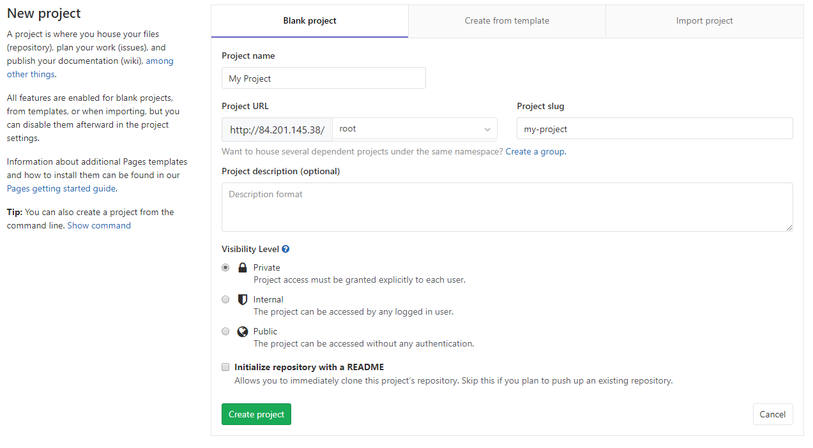
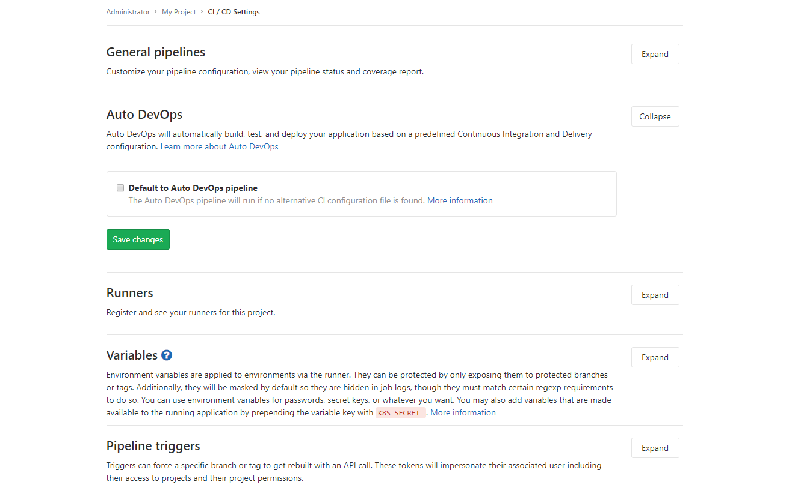
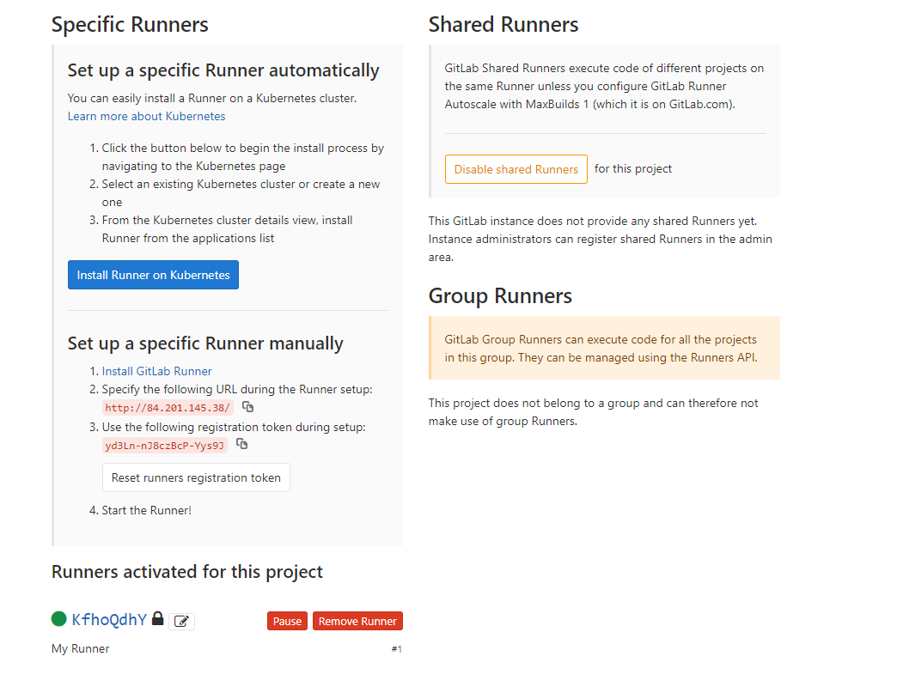

# Тестирование приложений с помощью GitLab

[GitLab](https://ru.wikipedia.org/wiki/GitLab) — это сайт и система управления репозиториями кода для Git. Также GitLab позволяет разработчикам вести непрерывный процесс развертывания для создания, тестирования и развертывания кода.

По этой инструкции вы настроите GitLab на виртуальной машине, создадите простой проект на языке программирования C++, настроите сценарий тестирования проекта и проверите его выполнение.

Чтобы создать и протестировать проект в среде GitLab:

1. [Подготовьте облако к работе](#before-you-begin).
1. [Необходимые платные ресурсы](#paid-resources).
1. [Создайте виртуальную машину c GitLab](#create-vm).
1. [Настройте GitLab](#confgure-gitlab).
1. [Задайте настройки приватности](#disable-signup).
1. [Создайте проект](#create-project).
1. [Настройте и запустите тестирование для проекта](#ci-cd).
1. [Настройте и зарегистрируйте runner](#configure-runner).
1. [Создайте сценарий тестирования](#create-test-case).
1. [Создайте ошибку в проекте](#create).
1. [Как удалить созданные ресурсы](#clear-out).

## Подготовьте облако к работе {#before-you-begin}





### Необходимые платные ресурсы {#paid-resources}

В стоимость поддержки сервера для GitLab входит:

* плата за диск и постоянно запущенную виртуальную машину (см. [тарифы {{ compute-full-name }}](../../compute/pricing.md));
* плата за использование динамического или статического публичного IP-адреса (см. [тарифы {{ vpc-full-name }}](../../vpc/pricing.md)).



## Создайте виртуальную машину c GitLab {#create-vm}

1. На странице каталога в [консоли управления]({{ link-console-main }}) нажмите кнопку **Создать ресурс** и выберите пункт **Виртуальная машина**.
1. В поле **Имя** введите имя виртуальной машины: `gitlab`.
1. Выберите [зону доступности](../../overview/concepts/geo-scope.md), в которой должна находиться виртуальная машина.
1. В блоке **Выбор образа/загрузочного диска** перейдите на вкладку **{{ marketplace-name }}** и выберите публичный образ [GitLab](/marketplace/products/yc/gitlab).
1. В блоке **Диски** выберите жесткий диск SSD размером 20 Гб.
1. В блоке **Вычислительные ресурсы**:
   * Выберите [платформу](../../compute/concepts/vm-platforms.md) виртуальной машины.
   * Укажите необходимое количество vCPU и объем RAM.

     Для корректной работы системы GitLab укажите конфигурацию:
      * **Платформа** - Intel Ice Lake.
      * **Гарантированная доля vCPU** — 100%.
      * **vCPU** — 2.
      * **RAM** — 4 ГБ.

1. В блоке **Сетевые настройки**:
   - Выберите **Сеть** и **Подсеть**, к которым нужно подключить виртуальную машину. Если нужной сети или подсети еще нет, вы можете создать их прямо на странице создания ВМ.
   - В поле **Публичный адрес** оставьте значение **Автоматически**, чтобы назначить виртуальной машине случайный внешний IP-адрес из пула {{ yandex-cloud }}, или выберите статический адрес из списка, если вы зарезервировали его заранее.

1. В блоке **Доступ** укажите данные для доступа к виртуальной машине:
   - В поле **Логин** введите предпочтительное имя пользователя, который будет создан на виртуальной машине.
   - В поле **SSH-ключ** скопируйте ваш открытый SSH-ключ. Пару ключей для подключения по SSH необходимо создать самостоятельно, см. [раздел о подключении к виртуальным машинам по SSH](../../compute/operations/vm-connect/ssh.md).

1. Нажмите кнопку **Создать ВМ**.

1. Подождите примерно пять минут, пока не будет создана виртуальная машина и на ней не запустятся все сервисы. После полного запуска всех сервисов, GitLab станет доступен через веб-интерфейс в браузере.


## Настройте GitLab {#confgure-gitlab}

1. В [консоли управления]({{ link-console-main }}) откройте страницу сервиса {{ compute-name }}. Выберите виртуальную машину `gitlab` и скопируйте ее публичный IP-адрес в отдельный файл.
1. [Подключитесь](../../compute/operations/vm-connect/ssh.md) к виртуальной машине по протоколу SSH.
1. Получите пароль администратора GitLab с помощью команды ВМ:
   ```bash
   sudo cat etc/gitlab/initial_root_password
   ```
1. Скопируйте пароль в буфер обмена или отдельный файл.
1. Откройте браузер и перейдите по адресу `http://<публичный IP адрес ВМ>`. Откроется веб-интерфейс GitLab.
1. Зайдите в систему с учетной записью администратора:
   * **Username or email** — `root`.
   * **Password** — пароль, скопированный ранее.


### Задайте настройки приватности {#disable-signup}

Отключите возможность регистрации других пользователей через страницу авторизации:

1. Нажмите на раздел **Configure GitLab**
1. В панели слева перейдите в раздел **Settings** и выберите вкладку **General**.
1. В блоке **Sign-up restrictions** нажмите кнопку **Expand**.
1. Отключите опцию **Sign-up enabled**.
1. Нажмите кнопку **Save changes**.

Теперь зарегистрировать новых пользователь может только администратор, через вкладку **Users** в разделе **Overview**.


## Создайте проект {#create-project}

Для того, чтобы создать проект:

1. На главной странице GitLab выберите **Create a project**.
1. На открывшейся странице укажите:
   * Имя проекта: `My Project`.
   * Группу и идентификатор проекта: `root` и `my-project`.
   * При необходимости задайте описание и область видимости проекта.
1. Нажмите кнопку **Create project**.
   
1. После создания проекта в панели слева перейдите в раздел **Settings** и выберите вкладку **CI/CD**.
1. В блоке **Auto DevOps** нажмите кнопку **Expand**, отключите опцию **Default to Auto DevOps pipeline** и сохраните изменения кнопкой **Save changes**.
   
1. Добавьте файл проекта.

   1. В панели слева перейдите в раздел **Project** и выберите вкладку **Details**.
   1. На странице проекта нажмите кнопку **New file**.
   1. Назовите файл `test.cpp`. Добавьте в него код программы, которая проверяет результат умножения 2 × 2 и выводит `Hello World`, если результат равен 4:

      ```cpp
      #include <iostream>
      #include <cassert>

      int main() {
        assert(2 * 2 == 4);
        std::cout << "Hello world!" << std::endl;
        return 0;
      }
      ```

      

   2. Укажите название коммита в поле **Commit message**.
   3. Нажмите кнопку **Commit changes**.


## Настройте и запустите тестирование для проекта {#ci-cd}

Runner - это специальная программа, которая осуществляет процесс тестирования и сборки проекта в среде GitLab по заданной вами инструкции.


### Настройте и зарегистрируйте runner {#configure-runner}

1. [Зайдите по SSH](../../compute/operations/vm-connect/ssh.md) на виртуальную машину и перейдите в режим администратора в консоли:
   ```bash
   sudo -i
   ```

1. Загрузите runner:
   ```bash
   # curl -L --output /usr/local/bin/gitlab-runner https://gitlab-runner-downloads.s3.amazonaws.com/latest/binaries/gitlab-runner-linux-amd64
   ```

1. Сделайте runner исполняемым:
   ```bash
   # chmod +x /usr/local/bin/gitlab-runner
   ```

1. Создайте отдельного пользователя для запуска runner:
   ```bash
   # useradd --comment 'GitLab Runner' --create-home gitlab-runner --shell /bin/bash
   ```

1. Установите и запустите runner:
   ```bash
   # gitlab-runner install --user=gitlab-runner --working-directory=/home/gitlab-runner
   # gitlab-runner start
   ```

1. Зарегистрируйте runner в GitLab:

   1. Запустите интерактивную регистрацию командой `gitlab-runner register`.
   1. Введите адрес вашего GitLab-сервера. При запросе:
      ```
      Please enter the gitlab-ci coordinator URL (e.g. https://gitlab.com)
      ```
      введите `http://<публичный-IP-адрес-вашей-ВМ>`
   1. Введите регистрационный токен для runner. Чтобы его найти, нужно перейти в GitLab на страницу проекта, затем в панели слева выбрать **Settings** и открыть вкладку **CI/CD**. После этого нажмите кнопку **Expand** в блоке **Runners**. В разделе **Set up a specific Runner manually** скопируйте токен из третьего пункта и введите его в ответ на запрос:
      ```
      Please enter the gitlab-ci token for this runner
      <токен>
      ```

      

   1. На запрос:
      ```
      Please enter the gitlab-ci description for this runner
      ```
      введите описание runner: `My runner`.

   1. В поле ввода тегов не указывайте ничего, нажмите **Enter**. Иначе по умолчанию runner не будет выполнять работу без указания соответствующих тегов для проекта.

   1. Укажите среду выполнения. В нашем случае, на запрос:
      ```
      Please enter the executor: ssh, docker+machine, docker-ssh+machine, kubernetes, docker, parallels, virtualbox, docker-ssh, shell:
      ```
      введите: `shell`

На этом установка и настойка runner выполнена. Если все сделано правильно, то на странице, где вы копировали регистрационный токен, должен появиться раздел **Runners activated for this project**, в котором будет отображаться зарегистрированный runner.



### Создайте сценарий тестирования {#create-test-case}

Создайте сценарий тестирования, который будет выполнять runner. Сценарий описывается в специальном файле `.gitlab-ci.yml`, который должен находиться в корневой директории проекта. По сценарию runner будет компилировать исходный файл проекта в исполняемый файл, а затем запускать его.

Так как тестирование будет выполняться в операционной системе ВМ, установите приложения, которые необходимы для тестирования: `git` для клонирования проекта из репозитория и `g++` для компиляции проекта.

Чтобы создать сценарий тестирования:

1. Подключитесь к ВМ по SSH и установите необходимые приложения:
   ```bash
   sudo apt update
   sudo apt install -y git g++
   ```

1. Добавьте сценарий тестирования:

   1. В веб-интерфейсе GitLab в панели слева перейдите выберите раздел **Project** и выберите вкладку **Details**.
   1. На открывшейся странице нажмите кнопку **Set up CI&CD**.
   1. Откроется страница с предложением добавить новый файл `.gitlab-ci.yml`, в котором в формате [YAML](https://en.wikipedia.org/wiki/YAML) нужно описать сценарий. Добавьте текст сценария:

      ```
      stages:
        - build
        - test
        - pack

      cache:
        paths:
          - hello

      build:
        stage: build
        script: g++ test.cpp -o hello

      test:
        stage: test
        script: ./hello

      pack:
        stage: pack
        script: gzip -c hello > hello.gz
        artifacts:
          paths:
            - hello.gz
      ```

      В сценарии указано, что работа разделена на три этапа, которые выполняются последовательно:
         * `build` — на первом этапе выполняется компиляция проекта в исполняемый файл `hello`.
         * `test` — на втором исполняемый файл запускается.
         * `pack` — на третьем этапе создается архив с исполняемым файлом, который можно будет загрузить через веб-интерфейс GitLab после успешного завершения сценария. В блоке `artifacts` указаны файлы, доступные для загрузки.

      В блоке `cache` указываются файлы и директории, которые необходимо передавать между этапами. Если его не указать, то на этапе `test` файл `hello` не будет доступен и произойдет ошибка.

      

   2. Нажмите **Commit changes**

После коммита система автоматически начнет тестировать последний коммит. Процесс тестирования и результаты можно посмотреть, в разделе **CI/CD** на панели слева. В результате должна появиться строчка с первым тестом и статусом `passed`. Нажав на значок с облаком вы можете загрузить артефакты сборки.

### Создайте ошибку в проекте {#create}

Теперь сделайте так, чтобы в проекте произошла ошибка, которую runner должен помочь найти в процессе выполнения тестирования. Для этого:

1. Зайдите в репозиторий проекта и откройте файл `test.cpp`.
1. Нажмите **Edit**.
1. Укажите в проверке (assert), что результат выполнения умножения 2 на 2 должен быть равен 5. В этом случае при выполнении программы произойдет ошибка и она завершится некорректно.
   ```cpp
   ...
   assert(2 * 2 == 5);
   ...
   ```
1. Назовите коммит `Wrong assert in test.cpp`.
1. Нажмите **Commit Changes**.

Откройте раздел **CI/CD**. В столбце **Stages** видно, что в результате выполнения теста был успешно пройден первый этап `build`, а на втором этапе `test` произошла ошибка. Третий этап `pack` был пропущен и итоговые артефакты не были сформированы.

Если нажать на статус выполнения `failed` и перейти на вкладку **Failed Jobs**, можно увидеть текст ошибки, где указано, что не выполнился `assert`:


## Как удалить созданные ресурсы {#clear-out}

Чтобы перестать платить за развернутый сервер, достаточно удалить созданную виртуальную машину `gitlab`.

Если вы зарезервировали статический публичный IP-адрес специально для этой ВМ:

1. Откройте сервис **Virtual Private Cloud** в вашем каталоге.
1. Перейдите на вкладку **IP-адреса**.
1. Найдите нужный адрес, нажмите значок  и выберите пункт **Удалить**.
