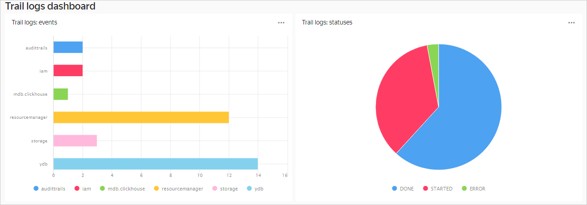

# Загрузка аудитных логов в {{ mch-name }} и визуализация данных в {{ datalens-name }}

Загрузите [аудитные логи](../audit-trails/concepts/format.md) уровня конфигурации каталога в [{{ mch-full-name }}](../managed-clickhouse/) и проанализируйте использование ресурсов в [{{ datalens-full-name }}]({{ link-datalens-main }}).
1. [Подготовьте облако к работе](#before-begin).
1. [Подготовьте окружение](#environment-preparing).
1. [Создайте трейл](#create-trail).
1. [Создайте эндпоинт-источник для потока данных {{ yds-full-name }}](#create-source-endpoint).
1. [Создайте эндпоинт-приемник для БД {{ CH }}](#create-target-endpoint).
1. [Создайте трансфер](#create-datatransfer).
1. [Визуализируйте данные в {{ datalens-name }}](#datalens-visualization).

Если созданные ресурсы вам больше не нужны, [удалите их](#clear-out).

## Перед началом работы {#before-begin}



### Необходимые платные ресурсы {#paid-resources}

В стоимость поддержки инфраструктуры входит:
* Плата за использование [потока данных](../data-streams/concepts/glossary.md#stream-concepts) (см. [тарифы {{ yds-name }}](../data-streams/pricing.md)).
* Плата за постоянно запущенный [кластер {{ mch-name }}](../managed-clickhouse/concepts/index.md) (см. [тарифы {{ mch-name }}](../managed-clickhouse/pricing.md)).

## Подготовьте окружение {#environment-preparing}

### Создайте сервисный аккаунт и назначьте ему роли {#create-sa}



- Консоль управления {#console}

  1. В [консоли управления]({{ link-console-main }}) выберите [каталог](../resource-manager/concepts/resources-hierarchy.md#folder), в котором хотите создать [сервисный аккаунт](../iam/concepts/users/service-accounts.md).
  1. В верхней части экрана перейдите на вкладку **{{ ui-key.yacloud.iam.folder.switch_service-accounts }}**.
  1. Нажмите кнопку **{{ ui-key.yacloud.iam.folder.service-accounts.button_add }}**.
  1. Введите имя сервисного аккаунта: `sa-trail-logs`.
  1. Нажмите  **{{ ui-key.yacloud.iam.folder.service-account.label_add-role }}** и выберите [роли](../iam/concepts/access-control/roles.md) `audit-trails.viewer` и `yds.editor`.
  1. Нажмите кнопку **{{ ui-key.yacloud.iam.folder.service-account.popup-robot_button_add }}**.

- CLI {#cli}

  

  

  1. [Создайте сервисный аккаунт](../iam/operations/sa/create.md) с именем `sa-trail-logs`:

     ```bash
     yc iam service-account create --name sa-trail-logs
     ```

     Результат:

     ```text
     id: aje6o61*****h6g9a33s
     folder_id: b1gvmob*****aplct532
     created_at: "2022-07-25T18:01:25Z"
     name: sa-trail-logs
     ```

     Подробнее о команде `yc iam service-account create` см. в [справочнике CLI](../cli/cli-ref/managed-services/iam/service-account/create.md).
  1. [Назначьте сервисному аккаунту роль](../iam/operations/sa/assign-role-for-sa.md) `audit-trails.viewer`:

     ```bash
     yc resource-manager folder add-access-binding <имя_каталога> \
       --role audit-trails.viewer \
       --subject serviceAccount:<идентификатор_сервисного_аккаунта>
     ```

      Где:

      * `--role` — назначаемая роль.
      * `--subject` — идентификатор сервисного аккаунта `sa-trail-logs`.

     Подробнее о команде `yc resource-manager folder add-access-binding` см. в [справочнике CLI](../cli/cli-ref/managed-services/resource-manager/folder/add-access-binding.md).
  1. Назначьте сервисному аккаунту роль `yds.editor`:

     ```bash
     yc resource-manager folder add-access-binding <имя_каталога> \
       --role yds.editor \
       --subject serviceAccount:<идентификатор_сервисного_аккаунта>
     ```

      Где:

      * `--role` — назначаемая роль.
      * `--subject` — идентификатор сервисного аккаунта `sa-trail-logs`.

- {{ TF }} {#tf}

  

  1. Опишите в конфигурационном файле параметры сервисного аккаунта:

     ```hcl
     resource "yandex_iam_service_account" "sa" {
       name = "sa-trail-logs"
     }

     resource "yandex_resourcemanager_folder_iam_member" "sa-role-audit-viewer" {
       folder_id   = "<идентификатор_каталога>"
       role        = "audit-trails.viewer"
       member      = "serviceAccount:<идентификатор_сервисного_аккаунта>"
     }

     resource "yandex_resourcemanager_folder_iam_member" "sa-role-yds-editor" {
       folder_id   = "<идентификатор_каталога>"
       role        = "yds.editor"
       member      = "serviceAccount:<идентификатор_сервисного_аккаунта>"
     }
     ```

      Где:

      * `role` — назначаемая роль.
      * `member` — идентификатор сервисного аккаунта `sa-trail-logs`.

     Более подробную информацию о ресурсах, которые вы можете создать с помощью {{ TF }}, см. в [документации провайдера]({{ tf-provider-resources-link }}/iam_service_account).
  1. Проверьте корректность конфигурационных файлов.
     1. В командной строке перейдите в папку, где вы создали конфигурационный файл.
     1. Выполните проверку с помощью команды:

        ```bash
        terraform plan
        ```

     Если конфигурация описана верно, в терминале отобразится список создаваемых ресурсов и их параметров. Если в конфигурации есть ошибки, {{ TF }} на них укажет.
  1. Разверните облачные ресурсы.
     1. Если в конфигурации нет ошибок, выполните команду:

        ```bash
        terraform apply
        ```

     1. Подтвердите создание ресурсов: введите в терминал слово `yes` и нажмите **Enter**.

- API {#api}

  1. Создайте сервисный аккаунт с помощью метода [create](../iam/api-ref/ServiceAccount/create.md) для ресурса [ServiceAccount](../iam/api-ref/ServiceAccount/index.md).
  1. Узнайте идентификатор сервисного аккаунта:

     ```bash
     export FOLDER_ID=<идентификатор_каталога>
     export IAM_TOKEN=<IAM-токен>
     curl -H "Authorization: Bearer ${IAM_TOKEN}" \
       "https://iam.{{ api-host }}/iam/v1/serviceAccounts?folderId=${FOLDER_ID}"
     ```

     Результат:

     ```json
     {
       "serviceAccounts": [
        {
          "id": "aje6o61*****h6g9a33s",
          "folderId": "b1gvmob*****aplct532",
          "createdAt": "2022-07-25T18:01:25Z",
          "name": "sa-trail-logs"
        }
       ]
     }
     ```

  1. Сформируйте тело запроса в файле `body.json`. В свойстве `action` укажите `ADD`, а в свойстве `subject` — тип `serviceAccount` и идентификатор сервисного аккаунта `sa-trail-logs`:

     **body.json:**

     ```json
     {
       "accessBindingDeltas": [
         {
           "action": "ADD",
           "accessBinding": {
             "roleId": "audit-trails.viewer",
             "subject": {
               "id": "<идентификатор_сервисного_аккаунта>",
               "type": "serviceAccount"
             }
           }
         },
         {
           "action": "ADD",
           "accessBinding": {
             "roleId": "yds.writer",
             "subject": {
               "id": "<идентификатор_сервисного_аккаунта>",
               "type": "serviceAccount"
             }
           }
        }
      ]
     }
     ```

      Где:

      * `roleId` — назначаемая роль.
      * `id` — идентификатор сервисного аккаунта `sa-trail-logs`.

  1. Назначьте роли сервисному аккаунту:

     ```bash
     export FOLDER_ID=<идентификатор_каталога>
     export IAM_TOKEN=<IAM-токен>
     curl -X POST \
       -H "Content-Type: application/json" \
       -H "Authorization: Bearer ${IAM_TOKEN}" \
       -d '@body.json' \
       "https://resource-manager.{{ api-host }}/resource-manager/v1/folders/${FOLDER_ID}:updateAccessBindings"
     ```



### Создайте кластер {{ CH }} {#create-ch-cluster}



- Консоль управления {#console}

  1. На странице каталога в [консоли управления]({{ link-console-main }}) нажмите кнопку **{{ ui-key.yacloud.iam.folder.dashboard.button_add }}** и выберите пункт **{{ ui-key.yacloud.iam.folder.dashboard.value_managed-clickhouse }}**.
  1. Укажите настройки кластера {{ CH }}:
     1. В блоке **{{ ui-key.yacloud.mdb.forms.section_base }}** укажите имя кластера `trail-logs`.
     1. В блоке **{{ ui-key.yacloud.mdb.forms.new_section_resource }}** выберите тип [виртуальной машины](../compute/concepts/vm.md) `burstable` и [тип хоста](../managed-clickhouse/concepts/instance-types.md) `b2.medium`.
     1. В блоке **{{ ui-key.yacloud.mdb.forms.section_settings }}** укажите имя БД `trail_data`, имя пользователя `user` и пароль. Запомните имя БД.
     1. В блоке **{{ ui-key.yacloud.mdb.forms.section_host }}** нажмите значок . Включите опцию **{{ ui-key.yacloud.mdb.hosts.dialog.field_public_ip }}** и нажмите кнопку **{{ ui-key.yacloud.mdb.hosts.dialog.button_choose }}**.
     1. В блоке **{{ ui-key.yacloud.mdb.forms.section_service-settings }}** включите опции:
        * Доступ из {{ datalens-name }}.
        * Доступ из консоли управления.
        * Доступ из [{{ data-transfer-full-name }}](../data-transfer/).
  1. После всех настроек нажмите кнопку **{{ ui-key.yacloud.mdb.forms.button_create }}**.

- CLI {#cli}

  1. Проверьте, есть ли в каталоге [подсети](../vpc/concepts/network.md#subnet) для хостов кластера:

     ```bash
     yc vpc subnet list
     ```

     Если ни одной подсети в каталоге нет, [создайте нужные подсети](../vpc/operations/subnet-create.md) в сервисе {{ vpc-full-name }}.
  1. Укажите параметры кластера в команде создания:

     ```bash
     {{ yc-mdb-ch }} cluster create \
       --name trail-logs \
       --environment production \
       --network-name <имя_сети> \
       --host type=clickhouse,zone-id=<зона_доступности>,subnet-id=<идентификатор_подсети> \
       --clickhouse-resource-preset b2.medium \
       --clickhouse-disk-type network-hdd \
       --clickhouse-disk-size 10 \
       --user name=user,password=<пароль_пользователя> \
       --database name=trail_data \
       --datalens-access=true \
       --datatransfer-access=true \
       --websql-access=true
     ```

     Подробнее о команде `yc managed-clickhouse cluster create` см. в [справочнике CLI](../cli/cli-ref/managed-services/managed-clickhouse/cluster/create.md).

- {{ TF }} {#tf}

  1. Добавьте в конфигурационный файл описание кластера и его хостов:

     ```hcl
     resource "yandex_mdb_clickhouse_cluster" "trail-logs" {
       name                = "trail-logs"
       environment         = "PRODUCTION"
       network_id          = yandex_vpc_network.<имя_сети_в_{{ TF }}>.id

       clickhouse {
         resources {
           resource_preset_id = "b2.medium"
           disk_type_id       = "network-hdd"
           disk_size          = 10
         }
       }

       database {
         name = "trail_data"
       }

       user {
         name     = "user"
         password = "<пароль>"
         permission {
           database_name = "trail_data"
         }
       }

       host {
         type      = "CLICKHOUSE"
         zone      = "<зона_доступности>"
         subnet_id = yandex_vpc_subnet.<имя_подсети_в_{{ TF }}>.id
       }

       access {
         data_lens     = true
         data_transfer = true
       }
     }
     ```

     Более подробную информацию о ресурсах, которые вы можете создать с помощью {{ TF }}, см. в [документации провайдера]({{ tf-provider-mch }}).
  1. Проверьте корректность конфигурационных файлов.
     1. В командной строке перейдите в папку, где вы создали конфигурационный файл.
     1. Выполните проверку с помощью команды:

        ```bash
        terraform plan
        ```

     Если конфигурация описана верно, в терминале отобразится список создаваемых ресурсов и их параметров. Если в конфигурации есть ошибки, {{ TF }} на них укажет.
  1. Разверните облачные ресурсы.
     1. Если в конфигурации нет ошибок, выполните команду:

        ```bash
        terraform apply
        ```

     1. Подтвердите создание ресурсов: введите в терминал слово `yes` и нажмите **Enter**.

- API {#api}

  Используйте метод REST API [create](../managed-clickhouse/api-ref/Cluster/create.md).



### Создайте поток данных {#create-stream}

Поток данных будет использоваться для загрузки в него аудитных логов.



- Консоль управления {#console}

  1. На странице каталога в [консоли управления]({{ link-console-main }}) нажмите кнопку **{{ ui-key.yacloud.iam.folder.dashboard.button_add }}** и выберите пункт **{{ ui-key.yacloud.iam.folder.dashboard.value_data-streams }}**.
  1. В поле **{{ ui-key.yacloud.data-streams.label_database }}** нажмите **{{ ui-key.yacloud.common.label_create-new_female }}**. Откроется страница создания новой БД {{ ydb-name }}.
  1. Введите **{{ ui-key.yacloud.ydb.forms.label_field_name }}** БД: `stream-db`.
  1. В поле **{{ ui-key.yacloud.ydb.forms.label_field_database-type }}** выберите `{{ ui-key.yacloud.ydb.forms.label_serverless-type }}`.
  1. Нажмите кнопку **{{ ui-key.yacloud.ydb.forms.button_create-database }}**.
  1. Вернитесь на страницу создания потока. Нажмите значок  и выберите из списка созданную БД.
  1. Введите имя потока данных: `trail-logs-stream`.
  1. Нажмите кнопку **{{ ui-key.yacloud.common.create }}**.

  Дождитесь запуска потока данных. Когда поток станет готов к использованию, его статус изменится с `CREATING` на `ACTIVE`.



## Создайте трейл {#create-trail}

[Трейл](../audit-trails/concepts/trail.md) будет загружать [аудитные логи](../audit-trails/concepts/format.md) уровня конфигурации всех ресурсов вашего каталога в поток данных {{ yds-name }}.



- Консоль управления {#console}

  1. На странице каталога в [консоли управления]({{ link-console-main }}) нажмите кнопку **{{ ui-key.yacloud.iam.folder.dashboard.button_add }}** и выберите пункт **{{ ui-key.yacloud.iam.folder.dashboard.value_audit-trails }}**.
  1. Введите имя создаваемого трейла: `folder-trail`.
  1. В блоке **{{ ui-key.yacloud.audit-trails.label_destination }}** задайте параметры объекта назначения:
     * **{{ ui-key.yacloud.audit-trails.label_destination }}** — `{{ ui-key.yacloud.audit-trails.label_dataStream }}`.
     * **{{ ui-key.yacloud.audit-trails.label_stream-name }}** — выберите поток данных `trail-logs-stream`.
  1. В блоке **{{ ui-key.yacloud.audit-trails.label_service-account }}** выберите сервисный аккаунт `sa-trail-logs`.
  1. В блоке **{{ ui-key.yacloud.audit-trails.label_path-filter-section }}** задайте параметры сбора аудитных логов уровня конфигурации:
     * **{{ ui-key.yacloud.audit-trails.label_collecting-logs }}** — выберите `{{ ui-key.yacloud.common.enabled }}`.
     * **{{ ui-key.yacloud.audit-trails.label_resource-type }}** — выберите `{{ ui-key.yacloud.audit-trails.label_resource-manager.folder }}`.
     * **{{ ui-key.yacloud.audit-trails.label_resource-manager.folder }}** — не требует заполнения (содержит имя каталога, в котором будет находиться трейл).
  1. В блоке **{{ ui-key.yacloud.audit-trails.label_event-filter-section }}** в поле **{{ ui-key.yacloud.audit-trails.label_collecting-logs }}** выберите `{{ ui-key.yacloud.common.disabled }}`.
  1. Нажмите кнопку **{{ ui-key.yacloud.common.create }}**.



## Создайте эндпоинт-источник для потока данных {{ yds-name }} {#create-source-endpoint}

Для создания [трансфера](../data-transfer/concepts/index.md#transfer) нужно указать [эндпоинт](../data-transfer/concepts/index.md#endpoint)-источник, ведущий на поток {{ yds-name }}.



- Консоль управления {#console}

  1. Перейдите на [страницу каталога]({{ link-console-main }}) и выберите сервис **{{ ui-key.yacloud.iam.folder.dashboard.label_data-transfer }}**.
  1. На панели слева выберите  **{{ ui-key.yacloud.data-transfer.label_endpoints }}**.
  1. Нажмите кнопку **{{ ui-key.yacloud.data-transfer.button_create-endpoint }}**.
  1. В поле **{{ ui-key.yacloud.data-transfer.forms.label-is_source }}** выберите `{{ ui-key.yacloud.data-transfer.forms.label_source-type }}`.
  1. Укажите имя эндпоинта: `source-logs-stream`.
  1. В поле **{{ ui-key.yacloud.data-transfer.forms.label-database_type }}** выберите `{{ yds-full-name }}`.
  1. Настройте параметры эндпоинта:
     * **{{ ui-key.yc-data-transfer.data-transfer.console.form.yds.console.form.yds.YDSConnection.database.title }}** — выберите БД, зарегистрированную для потока `trail-logs-stream`.
     * **{{ ui-key.yc-data-transfer.data-transfer.console.form.yds.console.form.yds.YDSConnection.stream.title }}** — `trail-logs-stream`.
     * **{{ ui-key.yc-data-transfer.data-transfer.console.form.yds.console.form.yds.YDSConnection.service_account_id.title }}** — `sa-trail-logs`.
  1. Настройте правила конвертации:
     * **{{ ui-key.yc-data-transfer.data-transfer.console.form.common.console.form.common.ConvertRecordOptions.format.title }}** — `{{ ui-key.yc-data-transfer.data-transfer.console.form.object_storage.console.form.object_storage.ObjectStorageSerializationFormatUI.OBJECT_STORAGE_SERIALIZATION_FORMAT_JSON.title }}`.
     * **{{ ui-key.yc-data-transfer.data-transfer.console.form.common.console.form.common.ConvertRecordOptions.data_schema.title }}** — `{{ ui-key.yc-data-transfer.data-transfer.console.form.common.console.form.common.DataSchema.fields.title }}`.

       Укажите список полей как в таблице ниже:

       Name | Type | Key | Required | Path
       --- | --- | --- | --- | ---
       event_id | STRING | - | - | event_id
       event_source | STRING | - | - | event_source
       event_type | STRING | - | - | event_type
       event_time | DATETIME | - | - | event_time
       authenticated | ANY | - | - | authentication.authenticated
       subject_type | STRING | - | - | authentication.subject_type
       subject_id | STRING | - | - | authentication.subject_id
       subject_name | STRING | - | - | authentication.subject_name
       authorized | ANY | - | - | authorization.authorized
       resource_metadata | ANY | - | - | resource_metadata
       remote_address | STRING | - | - | request_metadata.remote_address
       user_agent | STRING | - | - | request_metadata.user_agent
       request_id | STRING | - | - | request_metadata.request_id
       event_status | STRING | - | - | event_status
       details | ANY | - | - | details

     * Включите опцию **{{ ui-key.yc-data-transfer.data-transfer.console.form.common.console.form.common.ConvertRecordOptions.add_rest_column.title }}**.
  1. Нажмите кнопку **{{ ui-key.yacloud.common.create }}**.



## Создайте эндпоинт-приемник для БД {{ CH }} {#create-target-endpoint}

Для создания трансфера нужно указать эндпоинт-приемник с настройками БД {{ CH }}.



- Консоль управления {#console}

  1. Перейдите на [страницу каталога]({{ link-console-main }}) и выберите сервис **{{ ui-key.yacloud.iam.folder.dashboard.label_data-transfer }}**.
  1. На панели слева выберите  **{{ ui-key.yacloud.data-transfer.label_endpoints }}**.
  1. Нажмите кнопку **{{ ui-key.yacloud.data-transfer.button_create-endpoint }}**.
  1. В поле **{{ ui-key.yacloud.data-transfer.forms.label-is_source }}** выберите `{{ ui-key.yacloud.data-transfer.forms.label_target-type }}`.
  1. Укажите имя эндпоинта: `target-logs-ch`.
  1. В поле **{{ ui-key.yacloud.data-transfer.forms.label-database_type }}** выберите `{{ CH }}`.
  1. В блоке **{{ ui-key.yc-data-transfer.data-transfer.console.form.clickhouse.console.form.clickhouse.ClickHouseTarget.title }}** укажите:
     1. **{{ ui-key.yc-data-transfer.data-transfer.console.form.clickhouse.console.form.clickhouse.ClickHouseConnection.connection_type.title }}** — **{{ ui-key.yc-data-transfer.data-transfer.console.form.clickhouse.console.form.clickhouse.ClickHouseManaged.mdb_cluster_id.title }}**. Выберите кластер `trail-logs`.
     1. **{{ ui-key.yc-data-transfer.data-transfer.console.form.clickhouse.console.form.clickhouse.ClickHouseCredentials.user.title }}** — `user`.
     1. **{{ ui-key.yc-data-transfer.data-transfer.console.form.clickhouse.console.form.clickhouse.ClickHouseCredentials.password.title }}** — укажите пароль пользователя БД.
     1. **{{ ui-key.yc-data-transfer.data-transfer.console.form.clickhouse.console.form.clickhouse.ClickHouseConnection.database.title }}** — `trail_data`
  1. Нажмите кнопку **{{ ui-key.yacloud.common.create }}**.



## Создайте трансфер {#create-datatransfer}

С помощью трансфера будет выполняться перенос данных между сервисом-источником (потоком данных) и сервисом-приемником (БД {{ CH }}).



- Консоль управления {#console}

  1. Перейдите на [страницу каталога]({{ link-console-main }}) и выберите сервис **{{ ui-key.yacloud.iam.folder.dashboard.label_data-transfer }}**.
  1. На панели слева выберите  **{{ ui-key.yacloud.data-transfer.label_connectors }}**.
  1. Нажмите кнопку **{{ ui-key.yacloud.data-transfer.button_create-transfer }}**.
  1. Укажите имя трансфера: `logs-transfer`.
  1. Выберите эндпоинт для источника: `source-logs-stream`.
  1. Выберите эндпоинт для приемника: `target-logs-ch`.
  1. Нажмите кнопку **{{ ui-key.yacloud.common.create }}**.
  1. Нажмите значок  рядом с именем трансфера и выберите пункт **{{ ui-key.yacloud.data-transfer.label_connector-operation-ACTIVATE }}**.
  1. Дождитесь, когда трансфер перейдет в статус `{{ ui-key.yacloud.data-transfer.label_connector-status-RUNNING }}`.

- CLI {#cli}

  Создайте трансфер с именем `logs-transfer`:

  ```bash
  yc datatransfer transfer create --name logs-transfer
    --source-id <идентификатор_эндпоинта-источника>
    --target-id <идентификатор_эндпоинта-приемника>
    --type increment-only
  ```

  Где:

  * `--source-id` — идентификатор эндпоинта-источника `source-logs-stream`.
  * `--target-id` — идентификатор эндпоинта-приемника `target-logs-ch`.

  Подробнее о команде `yc datatransfer transfer create` см. в [справочнике CLI](../cli/cli-ref/managed-services/datatransfer/transfer/create.md).

- {{ TF }} {#tf}

  1. Добавьте в конфигурационный файл описание трансфера.

     ```hcl
     resource "yandex_datatransfer_transfer" "transfer" {
       folder_id   = "<идентификатор_каталога>"
       name        = "logs-transfer"
       source_id   = "<идентификатор_эндпоинта-источника>"
       target_id   = "<идентификатор_эндпоинта-приемника>"
       type        = "INCREMENT_ONLY"
     }
     ```

     Где:

     * `source_id` — идентификатор эндпоинта-источника `source-logs-stream`.
     * `target_id` — идентификатор эндпоинта-приемника `target-logs-ch`.

     Более подробную информацию о ресурсах, которые вы можете создать с помощью {{ TF }}, см. в [документации провайдера]({{ tf-provider-dt-transfer }}).
  1. Проверьте корректность конфигурационных файлов.
     1. В командной строке перейдите в папку, где вы создали конфигурационный файл.
     1. Выполните проверку с помощью команды:

        ```bash
        terraform plan
        ```

     Если конфигурация описана верно, в терминале отобразится список создаваемых ресурсов и их параметров. Если в конфигурации есть ошибки, {{ TF }} на них укажет.
  1. Разверните облачные ресурсы.
     1. Если в конфигурации нет ошибок, выполните команду:

        ```bash
        terraform apply
        ```

     1. Подтвердите создание ресурсов: введите в терминал слово `yes` и нажмите **Enter**.



После активации трансфера перейдите в {{ mch-name }} и убедитесь, что в БД `trail_data` появилась таблица `trail_logs_stream` с событиями {{ at-full-name }}.

Вы можете выполнять запросы к БД `trail_data` для поиска интересных событий с точки зрения безопасности.



* Найти, кто удалил каталог:

  ```sql
  select * from trail_data.trail_logs_stream
  where event_type = '{{ at-event-prefix }}.audit.resourcemanager.DeleteFolder' and  JSONExtractString(details, 'folder_name') = '<имя_каталога>'
  ```

* Какие действия совершал конкретный пользователь за период времени (требуется указать Name ID пользователя и дату):

  ```sql
  select * from trail_data.trail_logs_stream
  where subject_name = '<Name_ID_пользователя>' and  event_time >= 2022-06-26
  ```

* Срабатывание при создании [ключей](../iam/concepts/index.md#keys) для сервисных аккаунтов:

  ```sql
  select * from trail_data.trail_logs_stream
  where event_type = '{{ at-event-prefix }}.audit.iam.CreateAccessKey' or event_type = '{{ at-event-prefix }}.audit.iam.CreateKey' or event_type = '{{ at-event-prefix }}.audit.iam.CreateApiKey'
  ```

Все интересные события собраны в [решении](https://github.com/yandex-cloud/yc-solution-library-for-security/blob/master/auditlogs/_use_cases_and_searches/Use-casesANDsearches_RU.pdf).



## Визуализируйте данные в {{ datalens-name }} {#datalens-visualization}

Чтобы построить визуализации, нужно [подключиться](../datalens/concepts/connection.md) к БД {{ CH }}, в которую были перенесены логи, и создать [датасет](../datalens/concepts/dataset/index.md) на основе ее данных.

### Создайте подключение {#create-connection}

1. Перейдите на [главную страницу]({{ link-datalens-main }}) сервиса **{{ datalens-name }}**.
1. В открывшемся окне нажмите кнопку **Создать подключение**.
1. Выберите подключение **{{ CH }}**.
1. Выберите тип подключения **Выбрать в каталоге** и заполните настройки подключения:
   1. В поле **Кластер** выберите `trail-logs`.
   1. В поле **Имя хоста** выберите хост {{ CH }} из выпадающего списка.
   1. Введите имя пользователя БД и пароль.
1. Нажмите **Проверить подключение**.
1. После проверки подключения нажмите кнопку **Создать подключение**.
1. Введите название подключения `trail-logs-con` и нажмите кнопку **Создать**.
1. После сохранения подключения в правом верхнем углу нажмите кнопку **Создать датасет**.

### Создайте датасет {#create-dataset}

1. Перетащите таблицу `trail_data.trail_logs_stream` из блока **Таблицы** в левой части экрана на рабочую область.
1. В правом верхнем углу нажмите кнопку **Сохранить**.
1. Введите имя датасета `trail-logs-dataset` и нажмите **Создать**.
1. После сохранения датасета в правом верхнем углу нажмите **Создать чарт**.

### Создайте линейчатую диаграмму {#create-bar-chart}

Чтобы показать количество событий для каждого источника, создайте [чарт](../datalens/concepts/chart/index.md) — линейчатую диаграмму:
1. Выберите тип визуализации **Линейчатая диаграмма**.
1. Перетащите поле `event_source` из раздела **Измерения** в секцию **Y**.
1. Перетащите поле `event_id` из раздела **Измерения** в секцию **X**.
1. Перетащите поле `event_source` из раздела **Измерения** в секцию **Цвета**.
1. В правом верхнем углу нажмите **Сохранить**.
1. В открывшемся окне введите название чарта `Trail logs: events` и нажмите **Сохранить**.

### Создайте круговую диаграмму {#create-pir-chart}

Чтобы показать соотношение количества событий по статусу, создайте чарт — круговую диаграмму:
1. Скопируйте чарт, получившийся на предыдущем шаге:
   1. В правом верхнем углу нажмите значок галочки рядом с кнопкой **Сохранить**.
   1. Нажмите **Сохранить как**.
   1. В открывшемся окне введите название нового чарта `Trail logs: statuses` и нажмите кнопку **Сохранить**.
1. Выберите тип визуализации **Круговая диаграмма**. Поля `event_source` и `event_id` автоматически попадут в секции **Цвет** и **Показатели** соответственно.
1. Удалите поле `event_source` из секции **Цвет** и перетащите туда поле `event_status`.
1. В правом верхнем углу нажмите **Сохранить**.

### Создайте дашборд и добавьте на него чарты {#create-dashboard}

Создайте [дашборд](../datalens/concepts/dashboard.md), на котором будут размещены чарты:
1. Перейдите на [главную страницу]({{ link-datalens-main }}) сервиса **{{ datalens-name }}**.
1. Нажмите кнопку **Создать дашборд**.
1. Введите название дашборда `Trail logs dashboard` и нажмите кнопку **Создать**.
1. В правом верхнем углу нажмите кнопку **Добавить** и выберите **Чарт**.
1. В поле **Чарт** нажмите **Выбрать** и выберите из списка чарт `Trail logs: events`.
1. Нажмите кнопку **Добавить**. Чарт появится на дашборде.
1. Повторите предыдущие шаги для чарта `Trail logs: statuses`.
1. В правом верхнем углу нажмите кнопку **Сохранить**.

Пример дашборда:



## Как удалить созданные ресурсы {#clear-out}

Некоторые ресурсы платные. Чтобы за них не списывалась плата, удалите ресурсы, которые вы больше не будете использовать:
* [Удалите кластер](../managed-postgresql/operations/cluster-delete.md) `trail-logs`.
* [Удалите поток данных](../data-streams/operations/manage-streams.md#delete-data-stream) `trail-logs-stream`.
* [Удалите эндпоинты](../data-transfer/operations/endpoint/index.md#delete) источника и приемника.
* [Удалите трансфер](../data-transfer/operations/transfer.md#delete) `logs-transfer`.