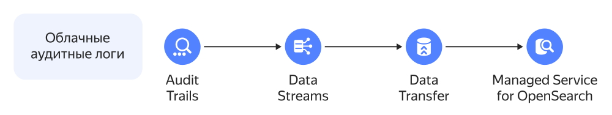
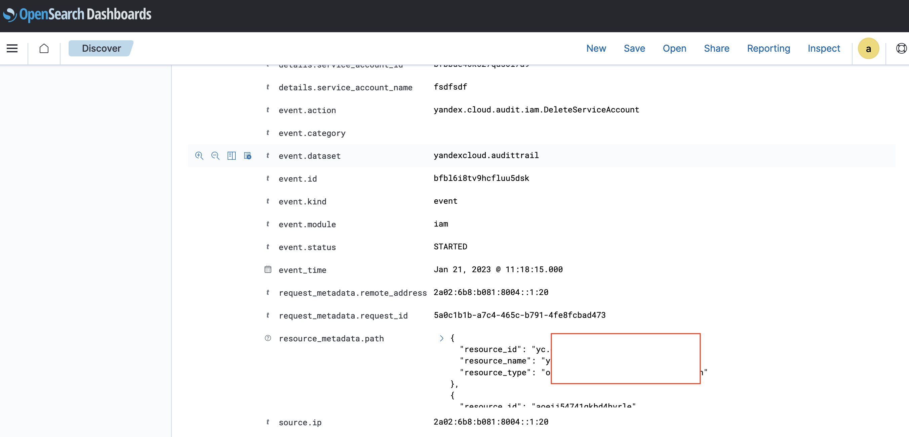
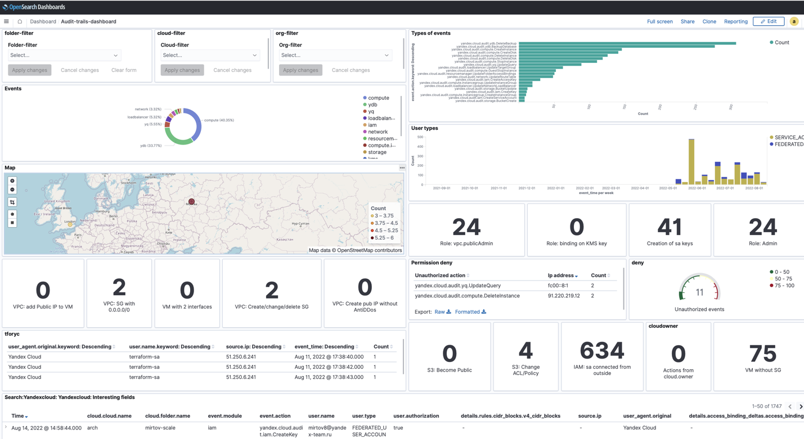
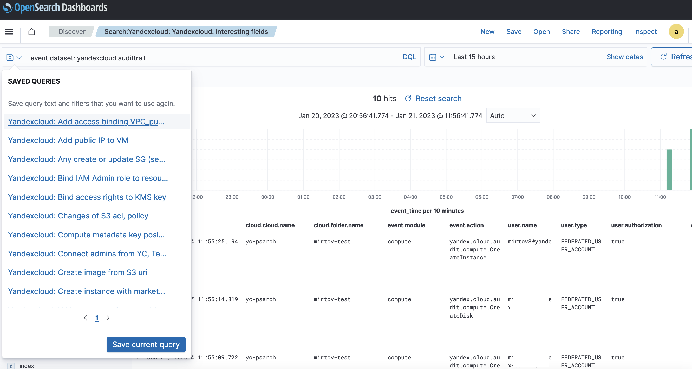

# Загрузка аудитных логов в {{ mos-full-name }}

Создайте трейл, который будет загружать [аудитные логи](../audit-trails/concepts/format.md) ресурсов {{ yandex-cloud }} в поток данных [{{ yds-full-name }}](../data-streams/). Затем настройте непрерывную доставку логов в кластер {{ mos-full-name }} с помощью {{ data-transfer-full-name }}.



Вы можете выгружать логи организации, облака или каталога.

Чтобы экспортировать аудитные логи:

1. [Подготовьте облако к работе](#before-begin).
1. [Создайте трейл, который отправляет логи в поток данных {{ yds-name }}](#create-trail).
1. [Создайте кластер {{ mos-name }}](#create-os).
1. [Настройте трансфер для доставки логов в кластер {{ mos-name }}](#configure-data-transfer).
1. [Проверьте результат](#check-result).
1. [Загрузите дополнительный контент](#additional-content).

Если созданные ресурсы вам больше не нужны, [удалите их](#clear-out).

## Перед началом работы {#before-begin}



### Необходимые платные ресурсы {#paid-resources}

В стоимость поддержки инфраструктуры входит:

* плата за вычислительные ресурсы и объем хранилища кластера {{ OS }} (см. [тарифы {{ mos-full-name }}](../managed-opensearch/pricing.md)).
* использование потока данных (см. [тарифы {{ yds-name }}](../data-streams/pricing.md)).
* использование {{ ydb-full-name }} в бессерверном режиме (см. [тарифы {{ ydb-name }}](../ydb/pricing/serverless.md)).

## Создайте трейл, который отправляет логи в поток данных {{ yds-name }} {#create-trail}

Подготовьте окружение и создайте трейл в зависимости от ресурсов {{ yandex-cloud }}:

* [Организации](../audit-trails/operations/export-organization-data-streams.md).
* [Облака](../audit-trails/operations/export-cloud-data-streams.md).
* [Каталога](../audit-trails/operations/export-folder-data-streams.md).

Обязательно назовите поток `audit‑trails`, чтобы упростить загрузку объектов библиотеки [Security Content](#additional-content).

## Создайте кластер {{ mos-name }} {#create-os}

[Создайте кластер {{ mos-name }}](../managed-opensearch/operations/cluster-create.md) любой подходящей конфигурации.

## Настройте трансфер для доставки логов в кластер {{ mos-name }} {#configure-data-transfer}

1. [Создайте эндпоинт для источника](../data-transfer/operations/endpoint/source/data-streams.md):

    * **{{ ui-key.yacloud.data-transfer.forms.label-database_type }}** — `{{ yds-full-name }}`.
    * **{{ ui-key.yacloud.data-transfer.forms.section-endpoint }}**:

        * **{{ ui-key.yc-data-transfer.data-transfer.console.form.yds.console.form.yds.YDSSource.connection.title }}**:

            * **{{ ui-key.yc-data-transfer.data-transfer.console.form.yds.console.form.yds.YDSConnection.database.title }}** — выберите базу данных {{ ydb-name }} из списка.
            * **{{ ui-key.yc-data-transfer.data-transfer.console.form.yds.console.form.yds.YDSConnection.stream.title }}** — укажите имя потока {{ yds-name }}.
            * **{{ ui-key.yc-data-transfer.data-transfer.console.form.yds.console.form.yds.YDSConnection.service_account_id.title }}** — выберите или создайте сервисный аккаунт с ролью `yds.editor`.

        * **{{ ui-key.yc-data-transfer.data-transfer.console.form.yds.console.form.yds.YDSSource.advanced_settings.title }}**:

            * **{{ ui-key.yc-data-transfer.data-transfer.console.form.yds.console.form.yds.YDSSourceAdvancedSettings.converter.title }}** — `{{ ui-key.yc-data-transfer.data-transfer.console.form.logbroker.console.form.logbroker.ParserConfigCommon.parser_config_audit_trails_v1.title }}`.

1. [Создайте эндпоинт для приемника](../data-transfer/operations/endpoint/target/opensearch.md):

    * **{{ ui-key.yacloud.data-transfer.forms.label-database_type }}** — `{{ OS }}`.
    * **{{ ui-key.yacloud.data-transfer.forms.section-endpoint }}**:

        * **{{ ui-key.yc-data-transfer.data-transfer.console.form.opensearch.console.form.opensearch.OpenSearchTarget.connection.title }}**:

            * **{{ ui-key.yc-data-transfer.data-transfer.console.form.opensearch.console.form.opensearch.OpenSearchConnection.connection_type.title }}** — `{{ ui-key.yc-data-transfer.data-transfer.console.form.opensearch.console.form.opensearch.OpenSearchConnectionType.mdb_cluster_id.title }}`.

                * **{{ ui-key.yc-data-transfer.data-transfer.console.form.opensearch.console.form.opensearch.OpenSearchConnectionType.mdb_cluster_id.title }}** — выберите кластер-приемник из списка.

            * **{{ ui-key.yc-data-transfer.data-transfer.console.form.opensearch.console.form.opensearch.OpenSearchConnection.user.title }}** и **{{ ui-key.yc-data-transfer.data-transfer.console.form.opensearch.console.form.opensearch.OpenSearchConnection.password.title }}** — укажите имя и пароль пользователя с доступом к базе, например, [пользователя `admin`](../managed-opensearch/operations/cluster-users.md).

1. [Создайте трансфер](../data-transfer/operations/transfer.md#create) типа **{{ ui-key.yc-data-transfer.data-transfer.console.form.transfer.console.form.transfer.TransferType.increment.title }}**, использующий созданные эндпоинты.
1. [Активируйте](../data-transfer/operations/transfer.md#activate) его.

## Проверьте результат {#check-result}

Убедитесь, что данные из {{ at-name }} успешно загружаются в {{ OS }}:

1. Дождитесь перехода трансфера в статус **{{ ui-key.yacloud.data-transfer.label_connector-status-RUNNING }}**.
1. Подключитесь к кластеру-приемнику с помощью [{{ OS }} Dashboards](../managed-opensearch/operations/connect.md#dashboards).
1. Выберите общий тенант `Global`.
1. Создайте новый шаблон индекса с именем `audit-trails*`:

    1. Откройте панель управления, нажав на значок .
    1. В разделе **Management** выберите **Stack Management**.
    1. Перейдите в раздел **Index Patterns** и внизу страницы нажмите на ссылку **create an index pattern**.
    1. В поле **Index pattern name** укажите `audit-trails*` и нажмите кнопку **Next step**.
    1. В поле **Time field** выберите `application_usage_daily.timestamp` и нажмите кнопку **Create index pattern**.

1. Откройте панель управления, нажав на значок .
1. В разделе **OpenSearch Dashboards** выберите **Discover**.
1. В открывшемся дашборде должны появится данные из {{ at-name }} в формате [Elastic Common Schema]({{ links.es.docs }}/ecs/current/ecs-reference.html).





## Загрузите дополнительный контент {#additional-content}

Для удобства пользователей команда безопасности {{ yandex-cloud }} подготовила библиотеку Solution Library — набор примеров и рекомендаций по построению безопасной инфраструктуры в {{ yandex-cloud }}. Библиотека доступна в [публичном репозитории на GitHub](https://github.com/yandex-cloud/yc-solution-library-for-security). Она включает следующие объекты для загрузки в {{ OS }}:

* дашборд с вариантами использования и статистикой;
* набор готовых запросов для поиска событий безопасности;
* примеры событий, на которые предварительно настроены оповещения (назначение уведомлений клиент указывает самостоятельно).

Все необходимые поля событий преобразованы в формат [Elastic Common Schema (ECS)]({{ links.es.docs }}/ecs/current/index.html), а полная таблица маппинга находится в [документе {{ yandex-cloud }} Security Solution Library](https://github.com/yandex-cloud/yc-solution-library-for-security/blob/master/auditlogs/export-auditlogs-to-ELK_main/papers/Описание%20объектов.pdf).

Чтобы воспользоваться Security Content:

1. Клонируйте репозиторий {{ yandex-cloud }} Security Solution Library:

    ```bash
    git clone https://github.com/yandex-cloud/yc-solution-library-for-security.git
    ```

1. Подключитесь к кластеру-приемнику с помощью [{{ OS }} Dashboards](../managed-opensearch/operations/connect.md#dashboards).
1. Откройте панель управления, нажав на значок .
1. В разделе **Management** выберите **Stack Management**.
1. Перейдите в раздел **Saved Objects** и импортируйте файлы из каталога `yc-solution-library-for-security/auditlogs/export-auditlogs-to-Opensearch/update-opensearch-scheme/content-for-transfer/`:

    * `dashboard.ndjson`
    * `filters.ndjson`
    * `search.ndjson`

### Дашборд {#dashboard}

Воспользуйтесь подготовленным дашбордом `Audit-trails-dashboard`:

1. Откройте панель управления, нажав на значок .
1. В разделе **OpenSearch Dashboards** выберите **Dashboard**.
1. В списке дашбордов выберите `Audit-trails-dashboard`.



### События безопасности {#discover}

Используйте подготовленный запрос для просмотра событий безопасности, которые можно отбирать с помощью фильтров.

1. Откройте панель управления, нажав на значок .
1. В разделе **OpenSearch Dashboards** выберите **Discover**.
1. На вкладке **Open** выберите запрос `Search:Yandexcloud: Yandexcloud: Interesting fields`.



### Настройка алертов {#alerts}

Используйте примеры кода для сущностей `monitor` и `trigger` при настройке [алертов]({{ os.docs }}/monitoring-plugins/alerting/index/):

1. Откройте панель управления, нажав на значок .
1. В разделе **OpenSearch Plugins** выберите **Alerting**.
1. Скопируйте содержимое файлов примеров в окно создания:

    * [monitor.json](https://github.com/yandex-cloud/yc-solution-library-for-security/blob/master/auditlogs/export-auditlogs-to-Opensearch/update-opensearch-scheme/content-for-transfer/monitor.json)
    * [trigger_action_example.json](https://github.com/yandex-cloud/yc-solution-library-for-security/blob/master/auditlogs/export-auditlogs-to-Opensearch/update-opensearch-scheme/content-for-transfer/trigger_action_example.json)

## Удалите созданные ресурсы {#clear-out}



Перед тем как удалить созданные ресурсы, [деактивируйте трансфер](../data-transfer/operations/transfer.md#deactivate).



Если созданные ресурсы вам больше не нужны, удалите их:

1. [Удалите трансфер](../data-transfer/operations/transfer.md#delete).
1. [Удалите эндпоинты](../data-transfer/operations/endpoint/index.md#delete) для источника и приемника.
1. [Удалите кластер {{ mos-name }}](../managed-opensearch/operations/cluster-delete.md).
1. [Удалите базу данных {{ ydb-name }}](../ydb/operations/manage-databases.md#delete-db).
1. [Удалите созданные сервисные аккаунты](../iam/operations/sa/delete.md).
1. Удалите [трейл {{ at-name }}](../audit-trails/concepts/trail.md).


## Дополнительные материалы {#video}

Больше информации о сценариях поставок данных в вебинаре {{ yandex-cloud }}:

@[youtube](bzWmmPp6KFg)
