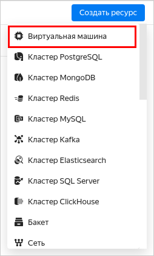
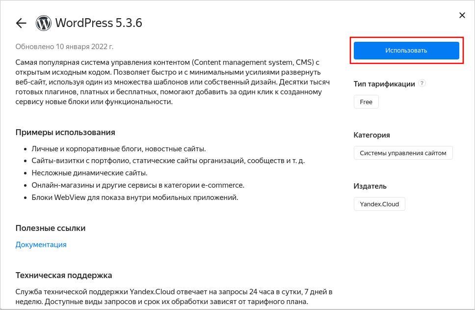
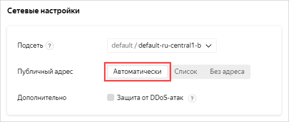

# Создание сайта на WordPress

Создайте и настройте веб-сайт на базе CMS WordPress с помощью специального образа виртуальной машины.

Чтобы настроить веб-сайт на WordPress:
1. [Создайте группу безопасности](#create-security-group).
1. [Создайте ВМ для WordPress](#create-vm).
1. [Настройте DNS](#configure-dns).
1. [Настройте WordPress](#wordpress-setup).

Если сайт вам больше не нужен, [удалите ВМ с ним](#clear-out).

Также инфраструктуру для веб-сайта на базе CMS WordPress можно развернуть через {{ TF }} с помощью [готового файла конфигурации](#terraform).

## Подготовьте облако к работе {#before-you-begin}



Убедитесь, что в выбранном каталоге есть облачная сеть с подсетью хотя бы в одной зоне доступности. Для этого на странице каталога выберите сервис **{{ vpc-short-name }}**. Если в списке есть сеть — нажмите на нее, чтобы увидеть список подсетей. Если нужных подсетей или сети нет, [создайте их](../../vpc/quickstart.md).



### Необходимые платные ресурсы {#paid-resources}

В стоимость поддержки веб-сайта на WordPress входит:
* плата за постоянно запущенную ВМ (см. [тарифы {{ compute-full-name }}](../../compute/pricing.md));
* плата за использование динамического или статического внешнего IP-адреса (см. [тарифы {{ vpc-full-name }}](../../vpc/pricing.md)).



## Создайте группу безопасности {#create-security-group}



Чтобы создать группу безопасности:



- Консоль управления

  1. В [консоли управления]({{ link-console-main }}) выберите сервис **{{ vpc-name }}**.
  1. Откройте вкладку **Группы безопасности**.
  1. Нажмите кнопку **Создать группу**.
  1. Укажите **Имя** группы: `wordpress`.
  1. Выберите **Сеть**.
  1. В блоке **Правила** создайте следующие правила по инструкции под таблицей:
  
       | Направление трафика | Описание  | Диапазон портов | Протокол | Тип источника / назначения | Источник / назначение |
       |-------------------------|-----------|---------------------|----------|--------------------------------|---------------------------|
       | Исходящий               | any       | Весь                | Любой    | CIDR                           | 0.0.0.0/0                 |
       | Входящий                | ext-http  | 80                  | TCP      | CIDR                           | 0.0.0.0/0                 |
       | Входящий                | ext-https | 443                 | TCP      | CIDR                           | 0.0.0.0/0                 |

       1. Выберите вкладку **Исходящий трафик** или **Входящий трафик**.
       1. Нажмите кнопку **Добавить правило**.
       1. В открывшемся окне в поле **Диапазон портов** укажите порт, куда будет поступать трафик. Для исходящего трафика не указывайте ничего. 
       1. В поле **Протокол** укажите нужный протокол. Для исходящего трафика оставьте **Любой**, чтобы разрешить передачу трафика по всем протоколам.
       1. В поле **Назначение** или **Источник** выберите **CIDR** — правило будет применено к диапазону IP-адресов. В поле **CIDR блоки** укажите `0.0.0.0/0`.
       1. Нажмите кнопку **Сохранить**. Таким образом создайте все правила из таблицы.
   
   1. Нажмите кнопку **Сохранить**.

- {{ TF }}

  См. раздел [Как создать инфраструктуру с помощью {{ TF }}](#terraform).



## Создайте виртуальную машину для WordPress {#create-vm}

Чтобы создать ВМ:



- Консоль управления

  1. На странице каталога в [консоли управления]({{ link-console-main }}) нажмите кнопку **Создать ресурс** и выберите **Виртуальная машина**.

     

  1. В поле **Имя** введите имя ВМ: `wordpress`.

     

  1. Выберите [зону доступности](../../overview/concepts/geo-scope.md), в которой будет находиться ВМ.
  1. В блоке **Выбор образа/загрузочного диска** перейдите на вкладку **{{ marketplace-name }}** и выберите публичный образ [WordPress](/marketplace/products/yc/wordpress).

     

  1. В блоке **Вычислительные ресурсы**:
     * Выберите [платформу](../../compute/concepts/vm-platforms.md).
     * Укажите необходимое количество vCPU и объем RAM.

     Для тестирования хватит минимальной конфигурации:
     * **Платформа** — Intel Ice Lake.
     * **vCPU** — 2.
     * **Гарантированная доля vCPU** — 20%.
     * **RAM** — 1 ГБ.

  1. В блоке **Сетевые настройки** выберите, к какой подсети необходимо подключить ВМ при создании.
  1. В пункте **Публичный адрес** выберите **Автоматически**.

     

  1. В пункте **Группа безопасности** выберите группу `wordpress`.
  1. Укажите данные для доступа на ВМ:
     * В поле **Логин** введите имя пользователя.
     * В поле **SSH ключ** вставьте содержимое файла открытого ключа.

       Пару ключей для подключения по SSH необходимо создать самостоятельно. Подробнее см. [{#T}](../../compute/operations/vm-connect/ssh.md).

  1. Нажмите кнопку **Создать ВМ**.

  Создание ВМ может занять несколько минут. Когда ВМ перейдет в статус `RUNNING`, вы можете начать настраивать сайт.

  При создании ВМ назначается публичный IP-адрес и имя хоста (FQDN). Эти данные можно использовать при настройке DNS и для доступа по SSH.

- {{ TF }}

  См. раздел [Как создать инфраструктуру с помощью {{ TF }}](#terraform).



## Настройте DNS (если есть доменное имя) {#configure-dns}

Если у вас есть зарегистрированное доменное имя, воспользуйтесь сервисом {{ dns-name }} для управления доменом.

Также настроить DNS можно с помощью {{ TF }}, подробнее см. в разделе [Как создать инфраструктуру с помощью {{ TF }}](#terraform).



## Настройка WordPress {#wordpress-setup}

После того как ВМ `wordpress` перейдет в статус `RUNNING`, выполните:
1. В блоке **Сеть** на странице ВМ в [консоли управления]({{ link-console-main }}) найдите публичный IP-адрес ВМ и внесите в ресурсную запись типа А, созданную ранее.

   

1. Перейдите по доменному имени, которое вы настроили, или по адресу ВМ в браузере.
1. Выберите язык и нажмите кнопку **Продолжить**.

   

1. Заполните информацию для доступа к сайту:
   1. Укажите любое название сайта, например, `yc-wordpress`.
   1. Укажите имя пользователя, которое будет использоваться для входа в административную панель, например, `yc-user`.
   1. Укажите пароль, который будет использоваться для входа в административную панель.
   1. Укажите вашу электронную почту.

   

1. Нажмите кнопку **Установить WordPress**.
1. Если установка прошла успешно, нажмите кнопку **Войти**.

   

1. Войдите на сайт, используя указанные на прошлых шагах имя пользователя и пароль. После этого откроется административная панель, в которой можно приступать к работе с вашим сайтом.
1. Убедитесь, что сайт доступен, открыв публичный IP-адрес ВМ в браузере.

## Как удалить созданные ресурсы {#clear-out}

Чтобы перестать платить за развернутый сервер, достаточно [удалить](../../compute/operations/vm-control/vm-delete.md) ВМ `wordpress`.

Если вы зарезервировали статический публичный IP-адрес специально для этой ВМ:
1. Выберите сервис **{{ vpc-short-name }}** в вашем каталоге.
1. Перейдите на вкладку **IP-адреса**.
1. Найдите нужный адрес, нажмите значок  и выберите пункт **Удалить**.

## Как создать инфраструктуру с помощью {{ TF }} {#terraform}



Чтобы разместить веб-сайт на базе CMS WordPress с помощью {{ TF }}:

1. [Установите {{ TF }}](../../tutorials/infrastructure-management/terraform-quickstart.md#install-terraform), [получите данные для аутентификации](../../tutorials/infrastructure-management/terraform-quickstart.md#get-credentials) и укажите источник для установки провайдера {{ yandex-cloud }} (раздел [{#T}](../../tutorials/infrastructure-management/terraform-quickstart.md#configure-provider), шаг 1).
1. Подготовьте файлы с описанием инфраструктуры:
   
   В руководстве используются [группы безопасности](#create-security-groups). Если они вам недоступны, то запросите доступ в поддержке или уберите из файла конфигурации блок `yandex_vpc_security_group` и другие упоминания `security_group`.

   
   
   - Готовый архив
 
     1. Создайте папку для файлов.
     1. Скачайте [архив](https://{{ s3-storage-host }}/www.example.com/doc-files/wordpress.zip) (1 КБ).
     1. Разархивируйте архив в папку. В результате в ней должен появиться конфигурационный файл `wordpress.tf`.

   - Создание вручную

     1. Создайте папку для файлов.
     1. Создайте в папке конфигурационный файл `wordpress.tf`:
  
          
     
          
     
          

   

   Более подробную информацию о параметрах используемых ресурсов в {{ TF }} см. в документации провайдера:

   * [yandex_compute_instance]({{ tf-provider-link }}/compute_instance)
   * [yandex_vpc_security_group]({{ tf-provider-link }}/yandex_vpc_security_group)
   * [yandex_vpc_network]({{ tf-provider-link }}/vpc_network)
   * [yandex_vpc_subnet]({{ tf-provider-link }}/vpc_subnet)
   * [yandex_dns_zone]({{ tf-provider-link }}/dns_zone)
   * [yandex_dns_recordset]({{ tf-provider-link }}/dns_recordset)

1. В блоке `metadata` укажите метаданные для создания виртуальной машины `<имя_пользователя>:<содержимое_SSH-ключа>`. Указанное имя пользователя не играет роли, ключ будет присвоен пользователю, который задан в конфигурации образа WordPress. В разных образах это разные пользователи. Подробнее см. в разделе [{#T}](../../compute/concepts/vm-metadata.md#keys-processed-in-public-images).

1. Создайте ресурсы:

   

1. [Настройте WordPress](#wordpress-setup).
