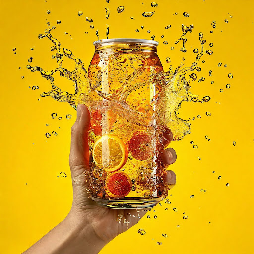

# Визуальный образ компании

## Параметры запроса {#params}

* **Промпт**: Банка освежающей газировки в руке, предметная съемка, контрастный жёлтый фон, рекламная съемка, брызги, свежесть.
* **Зерно**: `12`
* **Результат**:



## Структура запроса {#structure}

```json
{
  "modelUri": "art://<идентификатор_каталога>/yandex-art/latest",
  "generationOptions": {
    "seed": 12
  },
  "messages": [
    {
      "text": "Банка освежающей газировки в руке, предметная съемка, контрастный жёлтый фон, рекламная съемка, брызги, свежесть"
    }
  ]
}
```





- cURL {#curl}

  



## Получение результата {#result}


