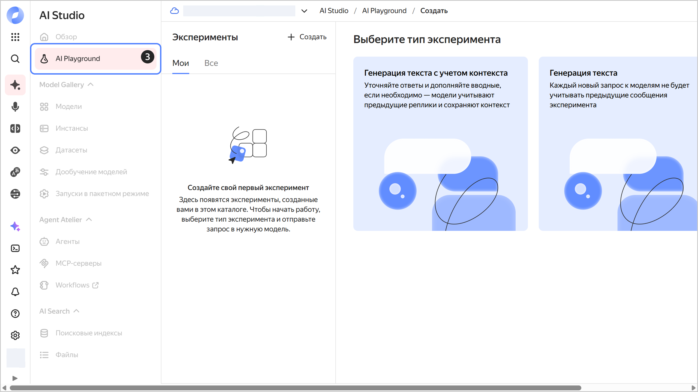
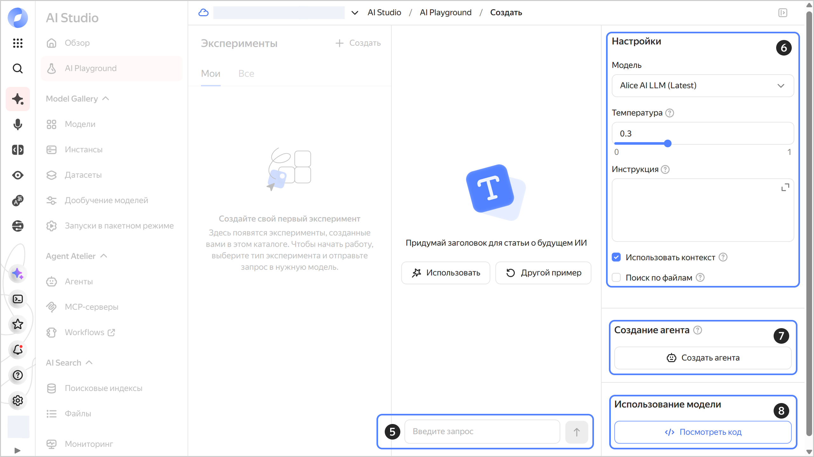

# Как начать работать с моделями {{ model-gallery-name }}

В этом разделе вы научитесь использовать нейросеть {{ yagpt-name }} для генерации текста в [синхронном режиме](../concepts/generation/index.md#working-mode). Другие примеры см. в разделе [Инструкции для работы с {{ foundation-models-full-name }}](../operations/index.md#yandexgpt-api).

О стоимости использования {{ foundation-models-full-name }} читайте в разделе [{#T}](../pricing.md).

## Перед началом работы {#before-begin}

Чтобы начать работать в {{ yandex-cloud }}:

1. Войдите в [консоль управления]({{ link-console-main }}). Если вы еще не зарегистрированы, перейдите в консоль управления и следуйте инструкциям.
1. В [сервисе {{ billing-name }}]({{ link-console-billing }}) убедитесь, что у вас подключен [платежный аккаунт](../../billing/concepts/billing-account.md), и он находится в [статусе](../../billing/concepts/billing-account-statuses.md) `ACTIVE` или `TRIAL_ACTIVE`. Если платежного аккаунта нет, [создайте его](../../billing/quickstart/index.md#create_billing_account).
1. Если у вас еще нет [каталога](../../resource-manager/concepts/resources-hierarchy.md#folder), [создайте его](../../resource-manager/operations/folder/create.md).



- Консоль управления {#console}

  Для работы из консоли управления подготовительные действия не требуются.

- SDK {#sdk}

  Чтобы воспользоваться примерами запросов с использованием SDK:

  



## Сгенерируйте текст {#generate-text}





- Консоль управления {#console}

  1. В [консоли управления]({{ link-console-main }}) выберите каталог, на который у вашего аккаунта есть роль `ai.playground.user` или выше.
  1. На панели слева нажмите  **{{ ui-key.yacloud.iam.folder.dashboard.label_products }}** и выберите **{{ ui-key.yacloud.iam.folder.dashboard.label_ai-studio }}** или найдите его с помощью строки поиска на дашборде.
  1. На открывшейся панели нажмите  **{{ ui-key.yacloud.yagpt.playground }}**.

     

  1. Выберите тип генерации:

      * **{{ ui-key.yacloud.yagpt.YaGPT.CreateExperiment.foundation-models_playground_text-generation-with-context_title_uYBhM }}** — модель будет генерировать ответы с учетом истории диалога. Это позволит уточнить результат в процессе общения.
      * **{{ ui-key.yacloud.yagpt.YaGPT.CreateExperiment.foundation-models_playground_text-generation_title_xpmcC }}** —  модель будет генерировать ответы только на основе вашего последнего сообщения и инструкции.

  1. Напишите запрос в поле ввода снизу и нажмите  или **Enter**. Вы также можете воспользоваться примерами запроса, предлагаемыми сверху.

     Созданные диалоги сохраняются на панели **{{ ui-key.yacloud.yagpt.experiments-page-subtitle }}** справа. Нажмите  возле нужного диалога, чтобы переименовать или удалить его.

  1. В блоке **{{ ui-key.yacloud.yagpt.settings }}** укажите параметры генерации:

     * Выберите [модель](../concepts/generation/models.md) генерации.
     * **{{ ui-key.yacloud.yagpt.label_temperature-text }}** — укажите значение от `0` до `1`, которое определяет вариативность ответа модели. Чем выше значение, тем более непредсказуемым будет результат выполнения запроса.
     * **{{ ui-key.yacloud.yagpt.instruction }}** — опишите требуемую задачу, стиль письма, лимиты и другие предписания для модели. Рекомендации для повышения качества генераций собраны в разделе [{#T}](../gpt-prompting-guide/about.md).
     * **{{ ui-key.yacloud.yagpt.use-context }}** — измените тип генерации.
     * **{{ ui-key.yacloud.yagpt.use-assistant }}** — если опция включена, {{ ai-playground }} будет работать на основе [{{ assistant-api }}](../concepts/assistant/index.md).

  1. Нажмите  **{{ ui-key.yacloud.yagpt.train-modal }}**, если нужно [научить модель](../concepts/tuning/index.md) следовать сложному формату ответов.
  1. В блоке **{{ ui-key.yacloud.yagpt.model-using }}** нажмите  **Посмотреть код**, чтобы получить код запроса к модели через ML SDK для Python или [cURL](https://curl.haxx.se).

     

- SDK {#sdk}

  



#### Что дальше {#what-is-next}

* [Узнайте подробнее о сервисе](../concepts/index.md)
* [Прочитайте про способы аутентификации в API](../api-ref/authentication.md)
* [Посмотрите библиотеку промтов](../prompts/yandexgpt/index.md)