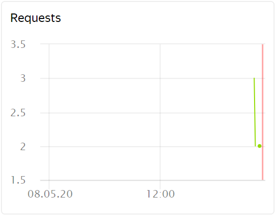
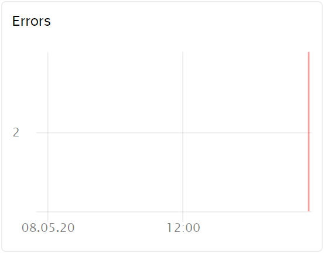

# Просмотр графиков мониторинга

Вы можете посмотреть графики для следующих показателей:  
- [Количество запросов к API-шлюзу](#requests)
- [Количество ошибок, возникших при обращении к API-шлюзу](#errors)

## Количество обращений к API-шлюзу {#requests}

Чтобы посмотреть график:
1. Откройте раздел **{{ api-gw-name }}** в каталоге с API-шлюзом, информацию о котором вы хотите получить.
1. В открывшемся окне выберите API-шлюз, графики мониторинга которого вы хотите посмотреть.
1. Перейдите на вкладку **Мониторинг**.
1. Выберите период, за который необходимо отобразить информацию на графике. Вы можете выбрать заранее заданный интервал (час, день, неделя, месяц) или ввести произвольный период, изменив поля с датами.
1. Количество обращений к API-шлюзу отображается на графике **Requests**:
    
    
 
## Количество ошибок, возникших при обращении к API-шлюзу {#errors}

Чтобы посмотреть график:
1. Откройте раздел **{{ api-gw-name }}** в каталоге с API-шлюзом, информацию о котором вы хотите получить.
1. В открывшемся окне выберите API-шлюз, графики мониторинга которого вы хотите посмотреть.
1. Перейдите на вкладку **Мониторинг**.
1. Выберите период, за который необходимо отобразить информацию на графике. Вы можете выбрать заранее заданный интервал (час, день, неделя, месяц) или ввести произвольный период, изменив поля с датами.
1. Количество ошибок, возникших при обращении к API-шлюзу, отображается на графике **Errors**:
    
    