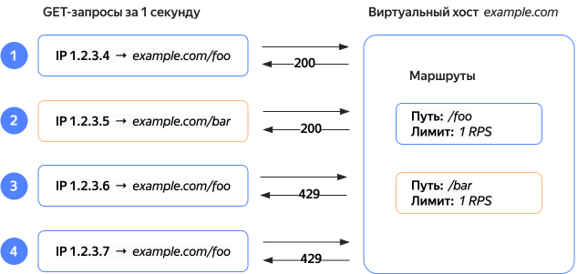
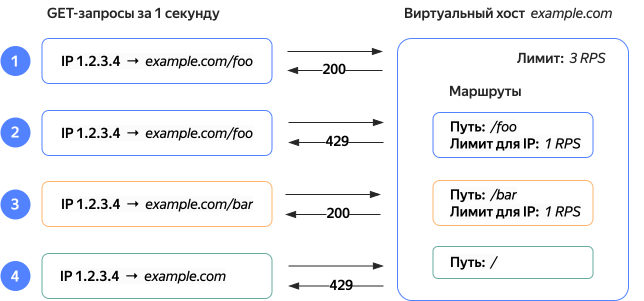

# Настройка лимитов на количество запросов с помощью модуля Global RateLimit



Global RateLimit позволяет задать лимит на количество запросов HTTP и gRPC к виртуальному хосту. Ограничение можно задать для виртуального хоста в целом или для отдельного маршрута на виртуальном хосте.



Также ограничение запросов можно настроить в сервисе [{{ sws-full-name }}](../../smartwebsecurity/concepts/arl.md). Рекомендуем настраивать ограничение запросов только в одном сервисе — либо в {{ alb-name }}, либо в {{ sws-name }}. Дублирование настроек может усложнить мониторинг и поддержку ваших приложений.



Ограничение входящего трафика помогает:

* Защитить хост от перегрузок, поскольку вы можете указать ограничение в соответствии с возможностями системы.
* Более равномерно распределить ресурсы приложения среди клиентов, поскольку можно устанавливать ограничение на запросы по IP-адресу.

В Global RateLimit можно настроить:

* Лимит на количество запросов в секунду (RPS) или в минуту (RPM).
* Способ учета количества запросов: 
  * `all-requests` — единый лимит на все входящие запросы.
  * `requests-per-ip` — лимит для каждого IP-адреса в отдельности. То есть в единицу времени для каждого IP-адреса разрешено принять указанное количество запросов.

Коды ответов, которые возвращает RateLimit при блокировке запросов:

* Для HTTP — `429`.
* Для gRPC — `UNAVAILABLE`.

## Особенности работы Global RateLimit {#grl-specific}

* Когда модуль RateLimit недоступен, ограничения не действуют — режим _Fail Open_.
* Если нагрузка резко возрастает или возникают задержки в синхронизации данных между узлами балансировщика, количество маршрутизируемых запросов может превысить лимиты. Запросы, разрешенные сверх лимита, будут учтены в следующих временных интервалах.
   
> Например, установлен лимит на 50 запросов в секунду — `50 RPS`. За первую секунду было маршрутизировано 52 запроса, что превышает лимит. Значит в следующую секунду будут маршрутизированы только 48 запросов.

## Маршрутизация запросов при использовании лимитов {#routing-requests-with-limits}

В примерах ниже _разрешенные запросы_ — это запросы, которые балансировщик маршрутизировал на виртуальный хост. Если у вас настроен [профиль безопасности](../../smartwebsecurity/concepts/profiles.md), запрос может быть заблокирован сервисом {{ sws-full-name }}.

### Лимиты для отдельных маршрутов виртуального хоста {#routes-limits}

Рассмотрим пример, в котором настроены лимиты без учета IP-адреса для двух маршрутов виртуального хоста.

В этом примере запросы будут обработаны следующим образом:

* Запрос `1` — разрешен, поскольку не превышает лимит для `/foo`.
* Запрос `2` — разрешен, поскольку не превышает лимит для `/bar`.
* Запросы `3` и `4` — отклонены, поскольку превышают ограничение для `/foo`.

### Лимиты по IP-адресам для отдельных маршрутов виртуального хоста {#routes-limits-per-ip}

Рассмотрим пример, в котором настроены лимиты по IP-адресам для двух маршрутов виртуального хоста.

В этом примере запросы будут обработаны следующим образом:

* Запрос `1` — разрешен, поскольку не превышает лимит для `/foo` для IP `1.2.3.4`.
* Запрос `2` — отклонен, поскольку превышает лимит для `/foo` для IP `1.2.3.4`.
* Запрос `3` — разрешен, поскольку не превышает лимит для `/foo` для IP `1.2.3.5`.
* Запрос `4` — разрешен, поскольку не превышает лимит для `/bar` для IP `1.2.3.4`.

### Лимиты для отдельных маршрутов и для виртуального хоста в целом {#routes-and-hosts-limits}

В этом примере настроены лимиты для виртуального хоста и отдельных маршрутов без учета IP-адреса. Аналогично работают лимиты для виртуального хоста и лимиты маршрутов с учетом IP-адреса.

* Запрос `1` — разрешен, поскольку не превышает лимит для `/foo` для IP `1.2.3.4`.
 
   Счетчик запросов виртуального хоста — 1.
* Запрос `2` — отклонен, поскольку превышает лимит для `/foo` для IP `1.2.3.4`.

   Счетчик запросов виртуального хоста — 2.
* Запрос `3` — разрешен, поскольку не превышает лимит для `/bar` для IP `1.2.3.4`.

   Счетчик запросов виртуального хоста — 3.
* Запрос `4` — отклонен, поскольку превышает лимит запросов для виртуального хоста.

## Рекомендации по настройке лимита {#limits-recommendations}

Чтобы определить оптимальную скорость запросов:

1. Проанализируйте текущий объем трафика, возможности инфраструктуры и особенности приложения. 
1. Начните настройку RateLimit с минимального лимита, который не вызывает перегрузок. 
1. Постепенно увеличивайте лимит, отслеживая производительность и стабильность системы.
   
Так вы сможете настроить скорость запросов в соответствии с реальными потребностями и возможностями системы.

## Мониторинг {#monitoring}

Отслеживать работу Global RateLimit можно в разделе **{{ ui-key.yacloud.common.monitoring }}** соответствующего балансировщика или в сервисе [{{ monitoring-full-name }}]({{ link-monitoring }}).

Для этого есть два преднастроенных графика:

* **RPS** — количество запросов в секунду, которые маршрутизировал балансировщик.
* **4XX** — количество запросов, которым возвращен код ответа из класса `4XX`.

В сервисе {{ monitoring-name }} можно настроить дополнительные графики с более подробной информацией. Например, чтобы настроить график с количеством запросов, которым возвращен код ответа `429`, используйте такие настройки [токенов](../../monitoring/concepts/visualization/query-string.md):

* `service` = `Application Load Balancer`.
* `name` = `load_balancer.requests_count_per_second`.
* `load_balancer` = `<идентификатор_балансировщика>`.
* `http_router` = `*`.
* `virtual_host` = `*`.
* `route` = `*`.
* `backend_group` = `*`.
* `backend` = `*`.
* `zone` = `*`.
* `code` = `429`.



Выборка метрик по параметрам `backend_group`, `virtual_host`, `route` и другим недоступна для запросов, которые были отклонены модулем RateLimit.

