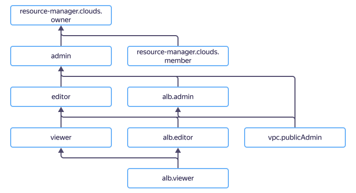

# Управление доступом в {{ alb-name }}

В этом разделе вы узнаете:
* [на какие ресурсы можно назначить роль](#resources);
* [какие роли действуют в сервисе](#roles-list);
* [какие роли необходимы](#required-roles) для того или иного действия.



## На какие ресурсы можно назначить роль {#resources}



## Какие роли действуют в сервисе {#roles-list}

На диаграмме показано, какие роли есть в сервисе и как они наследуют разрешения друг друга. Например, в `editor` входят все разрешения `viewer`. После диаграммы дано описание каждой роли.

Роли, действующие в сервисе:

* Сервисные роли:
    * 
    * 
    * 
    * 
    * 

    

    Чтобы к новому или существующему L7-балансировщику можно было подключить публичный IP-адрес, помимо роли `alb.editor` или `alb.admin` также требуется роль `vpc.publicAdmin` на сеть, в которой находится балансировщик.

    

* Примитивные роли:
    * 
    * 
    * 

## Какие роли мне необходимы {#required-roles}

В таблице ниже перечислено, какие роли нужны для выполнения указанного действия. Вы всегда можете назначить роль, которая дает более широкие разрешения, нежели указанная. Например, назначить `editor` вместо `viewer`.

Действие | Методы | Необходимые роли
----- | ----- | -----
**Просмотр информации** | |
Просмотр информации о любом ресурсе | `get`, `list`, `listOperations` | `alb.viewer` на этот ресурс
**Управление L7-балансировщиками** | |
[Создание](../operations/application-load-balancer-create.md) и [изменение](../operations/application-load-balancer-update.md) L7-балансировщиков с публичным IP-адресом | `create` | `alb.editor` и `vpc.publicAdmin` на сеть, в которой находится балансировщик
Создание и изменение L7-балансировщиков без публичного IP-адреса | `create` | `alb.editor`
[Удаление L7-балансировщиков](../operations/application-load-balancer-delete.md) | `update`, `delete` | `alb.editor`
Получение состояний целевых групп | `getTargetStates` | `alb.viewer`
Добавление, изменение и удаление обработчиков | `addListener`, `updateListener`, `removeListener` | `alb.editor`
Добавление, изменение и удаление SNI-обработчиков | `addSniMatch`, `updateSniMatch`, `removeSniMatch` | `alb.editor`
Остановка и запуск L7-балансировщика | `stop`, `start` | `alb.editor`
**Управление HTTP-роутерами** | |
[Создание HTTP-роутера](../operations/http-router-create.md) | `create` | `alb.editor`
[Изменение HTTP-роутера](../operations/http-router-update.md) | `update` | `alb.editor`
[Удаление HTTP-роутера](../operations/http-router-delete.md) | `delete` | `alb.editor`
**Управление группами бэкендов** | |
[Создание](../operations/backend-group-create.md) и [изменение](../operations/backend-group-update.md) групп бэкендов | `create`, `update`, `updateBackend` | `alb.editor`
[Удаление групп бэкендов](../operations/backend-group-delete.md) | `delete` | `alb.editor`
Добавление ресурсов в группе бэкендов | `addBackend` | `alb.editor`
Удаление ресурсов в группе бэкендов | `removeBackend` | `alb.editor`
**Управление целевыми группами** | |
[Создание](../operations/target-group-create.md) и [изменение](../operations/target-group-update.md) целевых групп в каталоге | `create`, `update` | `alb.editor`
[Удаление целевых групп](../operations/target-group-delete.md) | `delete` | `alb.editor`
Добавление ресурсов в целевой группе | `addTargets` | `alb.editor`
Удаление ресурсов в целевой группе | `removeTargets` | `alb.editor`
**Управление доступом к ресурсам** | |
[Назначение роли](../../iam/operations/roles/grant.md), [отзыв роли](../../iam/operations/roles/revoke.md) и просмотр назначенных ролей на ресурс | `setAccessBindings`, `updateAccessBindings`, `listAccessBindings` | `admin` на этот ресурс

#### Что дальше

* [Как назначить роль](../../iam/operations/roles/grant.md).
* [Как отозвать роль](../../iam/operations/roles/revoke.md).
* [Подробнее об управлении доступом в {{ yandex-cloud }}](../../iam/concepts/access-control/index.md).
* [Подробнее о наследовании ролей](../../resource-manager/concepts/resources-hierarchy.md#access-rights-inheritance).
