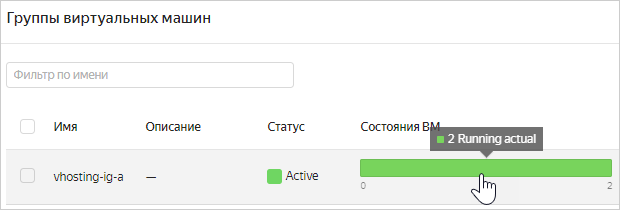

# Организация виртуального хостинга

Сценарий описывает организацию виртуального хостинга — размещение нескольких веб-сайтов с разными доменными именами по одному IP-адресу — с помощью {{ alb-full-name }}. 

В качестве примеров в сценарии будут использоваться три доменных имени: `site-a.com`, `site-b.com` и `default.com`.

Чтобы создать виртуальный хостинг:
1. [Подготовьте облако к работе](#before-begin).
1. [Создайте облачную сеть](#create-network).
1. [Зарезервируйте статический публичный IP-адрес](#reserve-ip).
1. [Создайте группы безопасности](#create-security-groups).
1. [Импортируйте TLS-сертификаты сайтов в {{ certificate-manager-name }}](#import-certificates).
1. [Создайте группы ВМ для сайтов](#create-vms).
1. [Загрузите файлы сайтов на ВМ](#upload-sites-files).
1. [Создайте группы бэкендов](#create-backend-groups).
1. [Создайте и настройте HTTP-роутеры](#create-http-routers).
1. [Создайте L7-балансировщик](#create-l7-balancer).
1. [Настройте DNS для сайтов](#configure-dns).
1. [Проверьте работу хостинга](#test).

Если созданные ресурсы вам больше не нужны, [удалите их](#clear-out).

## Подготовьте облако к работе {#before-begin}




### Необходимые платные ресурсы {#paid-resources}

В стоимость поддержки виртуального хостинга входят:

* плата за постоянно запущенные виртуальные машины (см. [тарифы {{ compute-full-name }}](../../compute/pricing.md));
* плата за использование публичного статического IP-адреса (см. [тарифы {{ vpc-full-name }}](../../vpc/pricing.md)).


## Создайте облачную сеть {#create-network}

Все ресурсы, созданные в сценарии, будут относиться к одной [облачной сети](../../vpc/concepts/network.md).

Чтобы создать сеть:



- Консоль управления 

    1. В [консоли управления]({{ link-console-main }}) выберите сервис **{{ vpc-name }}**.
    1. Нажмите кнопку **Создать сеть**.
    1. Укажите **Имя** сети: `vhosting-network`.
    1. В поле **Дополнительно** выберите опцию **Создать подсети**.
    1. Нажмите кнопку **Создать сеть**.
    


## Зарезервируйте статический публичный IP-адрес {#reserve-ip}

Для работы виртуального хостинга потребуется статический публичный IP-адрес, который будет назначен L7-балансировщику.

Чтобы зарезервировать адрес:



- Консоль управления 

    1. В [консоли управления]({{ link-console-main }}) выберите сервис **{{ vpc-name }}**.
    1. Откройте вкладку **IP-адреса**. Нажмите кнопку **Зарезервировать адрес**.
    1. В открывшемся окне выберите зону доступности `{{ region-id }}-a`. Нажмите кнопку **Зарезервировать**.



## Создайте группы безопасности {#create-security-groups}



[Группы безопасности](../concepts/application-load-balancer.md#security-groups) содержат правила, которые разрешают балансировщику получать входящий трафик и отправлять его на ВМ, а ВМ — получать этот трафик. В сценарии будут созданы две группы безопасности: для балансировщика и для всех ВМ.

Чтобы создать группы безопасности:



- Консоль управления 

  1. В [консоли управления]({{ link-console-main }}) выберите сервис **{{ vpc-name }}**.
  1. Откройте вкладку **Группы безопасности**.
  1. Создайте группу безопасности для балансировщика:
     
     1. Нажмите кнопку **Создать группу**.
     1. Укажите **Имя** группы: `vhosting-sg-balancer`.
     1. Выберите **Сеть** `vhosting-network`.
     1. В блоке **Правила** создайте следующие правила по инструкции под таблицей:
   
        | Направление<br/>трафика | Описание | Диапазон<br/>портов | Протокол | Тип источника /<br/>назначения | Источник /<br/>назначение |
        | --- | --- | --- | --- | --- | --- |
        | Исходящий | any | Весь | Любой | CIDR | 0.0.0.0/0 |
        | Входящий | ext-http | 80 | TCP | CIDR | 0.0.0.0/0 |
        | Входящий | ext-https | 443 | TCP | CIDR | 0.0.0.0/0 |
        | Входящий | healthchecks | 30080 | TCP | CIDR | 198.18.235.0/24<br/>198.18.248.0/24 |
      
        1. Выберите вкладку **Исходящий трафик** или **Входящий трафик**.
        1. Нажмите кнопку **Добавить правило**.
        1. В открывшемся окне в поле **Диапазон портов** укажите один порт или диапазон портов, куда или откуда будет поступать трафик.
        1. В поле **Протокол** укажите нужный протокол или оставьте **Любой**, чтобы разрешить передачу трафика по всем протоколам.
        1. В поле **Назначение** или **Источник** выберите назначение правила:
      
           * **CIDR** — правило будет применено к диапазону IP-адресов. В поле **CIDR блоки** укажите CIDR и маски подсетей, в которые или из которых будет поступать трафик. Чтобы добавить несколько CIDR, нажимайте кнопку **Добавить CIDR**.
           * **Группа безопасности** — правило будет применено к ВМ из текущей группы или из выбранной группы безопасности.
         
        1. Нажмите кнопку **Сохранить**. Таким образом создайте все правила из таблицы.
   
     1. Нажмите кнопку **Сохранить**.

  1. Аналогично создайте группу безопасности для ВМ с именем `vhosting-sg-vms`, той же сетью `vhosting-network` и следующими правилами:
      
     | Направление<br/>трафика | Описание | Диапазон<br/>портов | Протокол | Тип источника | Источник |
     | --- | --- | --- | --- | --- | --- |
     | Входящий | balancer | 80 | TCP | Группа безопасности | `vhosting-sg-balancer` |
     | Входящий | ssh | 22 | TCP | CIDR | 0.0.0.0/0 |
     


## Импортируйте TLS-сертификаты сайтов в {{ certificate-manager-name }} {#import-certificates}

Чтобы пользователи могли обращаться к сайтам по защищенному протоколу HTTPS (HTTP over TLS), для них должны быть выпущены TLS-сертификаты. Для использования в L7-балансировщике сертификаты нужно импортировать в {{ certificate-manager-name }}.

Если у ваших сайтов нет сертификатов, вы можете [получить в {{ certificate-manager-name }} сертификаты от Let's Encrypt<sup>®</sup>](../../certificate-manager/operations/managed/cert-create.md). В этом случае дополнительных действий после создания сертификатов не требуется: они импортируются автоматически.

Чтобы импортировать уже имеющийся сертификат для сайта `site-a.com`:



- Консоль управления 

  1. В [консоли управления]({{ link-console-main }}) выберите сервис **{{ certificate-manager-name }}**.
  1. Нажмите кнопку **Добавить сертификат** и выберите пункт **Пользовательский сертификат**.
  1. Укажите **Имя** сертификата: `vhosting-cert-a`.
  1. В поле **Сертификат** нажмите кнопку **Добавить сертификат**. Загрузите **Файл** с вашим сертификатом или укажите его **Содержимое** и нажмите кнопку **Добавить**.
  1. Если ваш сертификат выпущен сторонним центром сертификации, в поле **Цепочка промежуточных сертификатов** нажмите кнопку **Добавить цепочку**. Загрузите **Файл** с цепочкой сертификатов или укажите его **Содержимое** и нажмите кнопку **Добавить**.
  1. В поле **Приватный ключ** нажмите кнопку **Добавить приватный ключ**. Загрузите **Файл** с ключом или укажите его **Содержимое** и нажмите кнопку **Добавить**.
  1. Нажмите кнопку **Создать**.



Аналогично импортируйте сертификаты для сайтов `site-b.com` и `default.com` с именами `vhosting-cert-b` и `vhosting-cert-default`.

## Создайте группы ВМ для сайтов {#create-vms}

В качестве веб-серверов для двух сайтов будут выступать виртуальные машины {{ compute-name }} — по одной [группе](../../compute/concepts/instance-groups/index.md) из нескольких одинаковых ВМ на каждый сайт. В этом сценарии серверы будут реализованы на LEMP-стеке (Linux, nginx, MySQL, PHP; подробнее см. в сценарии использования [Веб-сайт на LAMP- или LEMP-стеке](../../tutorials/web/lamp-lemp.md)).

Чтобы создать группу ВМ для сайта `site-a.com`:



- Консоль управления

  1. В [консоли управления]({{ link-console-main }}) выберите сервис **{{ compute-name }}**.
  1. Откройте вкладку **Группы виртуальных машин**. Нажмите кнопку **Создать группу**.
  1. Укажите имя группы ВМ: `vhosting-ig-a`.
  1. В блоке **Распределение** выберите несколько зон доступности, чтобы обеспечить отказоустойчивость хостинга.
  1. В блоке **Шаблон виртуальной машины** нажмите кнопку **Задать**.
  1. В блоке **Выбор образа/загрузочного диска** откройте вкладку **{{ marketplace-name }}** и нажмите кнопку **Посмотреть больше**. Выберите продукт [LEMP](/marketplace/products/yc/lemp) и нажмите кнопку **Использовать**.
  1. В блоке **Вычислительные ресурсы**:
     
     - Выберите [платформу](../../compute/concepts/vm-platforms.md) виртуальной машины.
     - Укажите необходимое количество vCPU и объем RAM.
  
     Для функционального тестирования сайта хватит минимальной конфигурации:
     * **Платформа** — Intel Ice Lake.
     * **Гарантированная доля vCPU** — 20%.
     * **vCPU** — 2.
     * **RAM** — 1 ГБ.
  
  1. В блоке **Сетевые настройки** выберите **Сеть** `vhosting-network`, [созданную ранее](#create-network), и ее подсети.
  1. В поле **Публичный адрес** выберите **Автоматически**. 
  1. Выберите группу безопасности `vhosting-sg-vms`, [созданную ранее](#create-security-groups).
  1. Укажите данные для доступа на виртуальную машину:
     - В поле **Логин** введите имя пользователя.
     - В поле **SSH-ключ** вставьте содержимое файла открытого ключа.
        
       Пару ключей для подключения по SSH необходимо создать самостоятельно, см. [раздел о подключении к виртуальным машинам по SSH](../../compute/operations/vm-connect/ssh.md).
        
     
      
     IP-адрес и имя хоста (FQDN) для подключения к машине назначатся ей при создании. Если вы выбрали вариант **Без адреса** в поле **Публичный адрес**, вы не сможете обращаться к ВМ из интернета.
      
     
     
  1. Нажмите кнопку **Сохранить**.
  1. В блоке **Масштабирование** укажите **Размер** группы ВМ — 2.
  1. В блоке **Интеграция с Application Load Balancer** выберите опцию **Создать целевую группу** и укажите имя группы — `vhosting-tg-a`. [Подробнее о целевых группах](../concepts/target-group.md).
  1. Нажмите кнопку **Создать**.
  

  
Аналогично создайте для сайта `site-b.com` вторую группу ВМ с именем `vhosting-ig-b` и целевую группу с именем `vhosting-tg-b`.

Создание группы ВМ может занять несколько минут. Когда группа перейдет в [статус](../../compute/concepts/instance-groups/statuses.md#group-statuses) `RUNNING`, а все ВМ в ней — в [статус](../../compute/concepts/instance-groups/statuses.md#vm-statuses) `RUNNING_ACTUAL`, вы можете [загрузить на них файлы веб-сайта](#upload-sites-files).



## Загрузите файлы сайтов на ВМ {#upload-sites-files}

Чтобы проверить работу веб-серверов, загрузите на виртуальные машины файлы `index.html`: на ВМ из группы `vhosting-ig-a` — с одним содержанием, а на ВМ из группы `vhosting-ig-b` — с другим.



```html
<!DOCTYPE html>
<html>
  <head>
    <title>Site A</title>
  </head>
  <body>
    <p>This is site A</p>
  </body>
</html>
```





```html
<!DOCTYPE html>
<html>
  <head>
    <title>Site B</title>
  </head>
  <body>
    <p>This is site B</p>
  </body>
</html>
```



Чтобы загрузить файл на ВМ:



Повторите этот процесс с нужными файлами для каждой ВМ из групп `vhosting-ig-a` и `vhosting-ig-b`.

## Создайте группы бэкендов {#create-backend-groups}

Целевые группы, созданные вместе с группами ВМ, нужно привязать к [группам бэкендов](../concepts/backend-group.md) с настройками распределения трафика.

Для бэкендов в группах будут созданы [проверки состояния](../concepts/backend-group.md#health-checks): балансировщик будет периодически отправлять проверочные запросы к ВМ и ожидать ответа в течение определенного периода.

Чтобы создать группу бэкендов для сайта `site-a.com`:

1. В [консоли управления]({{ link-console-main }}) выберите сервис **{{ alb-name }}**.
1. Откройте вкладку **Группы бэкендов**. Нажмите кнопку **Создать группу бэкендов**.
1. Укажите **Имя** группы бэкендов: `vhosting-bg-a`.
1. В блоке **Бэкенды** нажмите кнопку **Добавить**.
1. Укажите **Имя** бэкенда: `vhosting-backend-a`.
1. В поле **Целевая группа** выберите группу `vhosting-tg-a`.
1. Укажите **Порт**, на котором ВМ бэкенда будут принимать входящий трафик от балансировщика: `80`.
1. Нажмите кнопку **Добавить проверку состояния**.
1. Укажите **Порт**, на котором ВМ бэкенда будут принимать проверочные соединения: `80`.
1. Укажите **Путь**, к которому будет обращаться балансировщик при проверке состояния: `/`.
1. Нажмите кнопку **Создать**.

Аналогично создайте для сайта `site-b.com` вторую группу бэкендов `vhosting-bg-b`, в ней — бэкенд `vhosting-backend-b` и привяжите к нему целевую группу `vhosting-tg-b`.

## Создайте и настройте HTTP-роутеры {#create-http-routers}

Группы бэкендов нужно привязать к [HTTP-роутерам](../concepts/http-router.md) с правилами маршрутизации HTTP-запросов. В сценарии будут созданы два роутера для «основных» сайтов `site-a.com` и `site-b.com` и роутер «по умолчанию» для сайта `default.com`, который будет отвечать на каждый запрос HTTP-кодом состояния `404 Not Found`.

### Создайте HTTP-роутеры для сайтов {#create-http-routers-sites}

Чтобы создать HTTP-роутер для сайта `site-a.com`:



- Консоль управления 

  1. В [консоли управления]({{ link-console-main }}) выберите сервис **{{ alb-name }}**.
  1. Откройте вкладку **HTTP-роутеры**. Нажмите кнопку **Создать HTTP-роутер**.
  1. Укажите **Имя** HTTP-роутера: `vhosting-router-a`.
  1. Нажмите кнопку **Добавить виртуальный хост**.
  1. Укажите **Имя** виртуального хоста: `vhosting-host-a`.
  1. В поле **Authority** укажите доменное имя сайта: `site-a.com`.
  1. Нажмите кнопку **Добавить маршрут**.
  1. Укажите **Имя** маршрута: `vhosting-route-a`.
  1. В поле **Группа бэкендов** выберите группу `vhosting-bg-a`.
  1. Нажмите кнопку **Создать**.



Аналогично создайте для сайта `site-b.com` HTTP-роутер `vhosting-router-b` и привяжите к нему группу бэкендов `vhosting-bg-b`.

### Создайте HTTP-роутер «по умолчанию» {#create-http-routers-default}

Чтобы создать HTTP-роутер для сайта `default.com`:



- Консоль управления 

  1. В [консоли управления]({{ link-console-main }}) выберите сервис **{{ alb-name }}**.
  1. Откройте вкладку **HTTP-роутеры**. Нажмите кнопку **Создать HTTP-роутер**.
  1. Укажите **Имя** HTTP-роутера: `vhosting-router-default`.
  1. Нажмите кнопку **Добавить виртуальный хост**.
  1. Укажите **Имя** виртуального хоста: `vhosting-host-default`.
  1. В поле **Authority** укажите доменное имя сайта: `default.com`.
  1. Нажмите кнопку **Добавить маршрут**.
  1. Укажите **Имя** маршрута: `vhosting-route-a`.
  1. В поле **Действие** выберите **Ответ**.
  1. В поле **Код состояния HTTP** выберите `404 Not Found`.
  1. В поле **Тело ответа** нажмите кнопку **Выбрать**. Выберите способ **Текст** и в поле **Содержимое** укажите:

     ```
     404 Not Found
     
     This is the default site.
     ```
   
     Нажмите кнопку **Добавить**.
  1. Нажмите кнопку **Создать**.



## Создайте L7-балансировщик {#create-l7-balancer}

Чтобы создать балансировщик:



- Консоль управления 

  1. В [консоли управления]({{ link-console-main }}) выберите сервис **{{ alb-name }}**.
  1. Нажмите кнопку **Создать L7-балансировщик**.
  1. Укажите **Имя** балансировщика: `vhosting-alb`.
  1. В блоке **Сетевые настройки** выберите группу безопасности `vhosting-sg-balancer`, [созданную ранее](#create-security-groups).
  1. Создайте обработчик для перенаправления HTTP-запросов на HTTPS:
   
     1. В блоке **Обработчики** нажмите кнопку **Добавить обработчик**.
     1. Укажите **Имя** обработчика: `vhosting-listener-http`.
     1. В блоке **Настройки публичного IP-адреса** выберите тип **Список** и IP-адрес, [зарезервированный ранее](#reserve-ip).
     1. В поле **Протокол** выберите пункт **Перенаправлять на HTTPS**.
   
  1. Создайте обработчик HTTPS-запросов: 
   
     1. Снова нажмите кнопку **Добавить обработчик**.
     1. Укажите **Имя** обработчика: `vhosting-listener-https`.
     1. В блоке **Настройки публичного IP-адреса** выберите тип **Список** и IP-адрес, [зарезервированный ранее](#reserve-ip).
     1. В поле **Протокол** выберите пункт **HTTPS**.
     1. В блоке **Основной обработчик** выберите сертификат `vhosting-cert-default` и HTTP-роутер `vhosting-router-default`.
     1. Добавьте обработчик SNI для сайта `site-a.com`: 
   
        1. Нажмите кнопку **Добавить обработчик SNI**.
        1. Укажите **Имя** обработчика SNI: `vhosting-sni-a`.
        1. В поле **Имена серверов** укажите `site-a.com`.
        1. Выберите сертификат `vhosting-cert-a` и HTTP-роутер `vhosting-router-a`.
      
     1. Аналогично добавьте обработчик SNI для сайта `site-b.com` — с именем `vhosting-sni-b`, именем сервера `site-b.com`, сертификатом `vhosting-cert-b` и HTTP-роутером `vhosting-router-b`. 
   
  1. Нажмите кнопку **Создать**.



## Настройте DNS для сайтов {#configure-dns}

Доменные имена `site-a.com`, `site-b.com` и `default.com` должны быть связаны с IP-адресом L7-балансировщика с помощью записей DNS.

Чтобы настроить DNS для сайта `site-a.com`:

1. В [консоли управления]({{ link-console-main }}) выберите сервис **{{ alb-name }}**.
1. Скопируйте IP-адрес созданного балансировщика.
1. На сайте компании, которая предоставляет вам услуги DNS-хостинга, перейдите в настройки DNS.
1. Создайте или измените A-запись для `site-a.com` таким образом, чтобы она указывала на скопированный IP-адрес:

   ```
   site-a.com. A <IP-адрес L7-балансировщика> 
   ```
   
   Если вы пользуетесь {{ dns-name }}, настройте запись по следующей инструкции:
   
   
   
   
   
   - Консоль управления 
   
     1. В [консоли управления]({{ link-console-main }}) выберите сервис **{{ dns-name }}**.
     1. Если у вас нет публичной зоны DNS, создайте ее:
   
        1. Нажмите кнопку **Создать зону**.
        1. Укажите **Имя** зоны: `vhosting-dns-a`.
        1. В поле **Зона** укажите доменное имя сайта с точкой в конце: `site-a.com.`
        1. Выберите **Тип** зоны — **Публичная**.
        1. Нажмите кнопку **Создать**.
      
     1. Создайте запись в зоне:
   
        1. В списке зон нажмите на зону `vhosting-dns-a`.
        1. Нажмите кнопку **Создать запись**.
        1. Поле **Имя** оставьте пустым, чтобы запись соответствовала доменному имени `site-a.com` (а не имени с субдоменом, например `www.site-a.com`).
        1. Выберите **Тип** записи — **A**.
        1. В поле **Значение** вставьте скопированный IP-адрес балансировщика.
        1. Нажмите кнопку **Создать**.
        
   
   
   

Аналогично настройте DNS для сайтов `site-b.com` и `default.com`, используя тот же IP-адрес.

Через 15–20 минут после настройки DNS вы сможете проверить работу сайтов.

## Проверьте работу хостинга {#test}

Чтобы проверить работу хостинга, откройте каждый из трех сайтов в браузере:

* `https://site-a.com` и `https://site-b.com` — должны отобразиться страницы, [загруженные на ВМ](#upload-sites-files);
* `https://default.com` — должна отобразиться страница с ошибкой `404 Not Found`, настроенная при [создании HTTP-роутера](#create-http-routers-default).

## Удалите созданные ресурсы {#clear-out}

Чтобы остановить работу хостинга и перестать платить за созданные ресурсы: 

1. Удалите нетарифицируемые ресурсы, которые блокируют удаление тарифицируемых ресурсов:
   
   1. [Удалите](../operations/application-load-balancer-delete.md) L7-балансировщик `vhosting-alb`.
   1. [Удалите](../operations/http-router-delete.md) HTTP-роутеры `vhosting-router-a`, `vhosting-router-b` и `vhosting-router-default`.
   1. [Удалите](../operations/backend-group-delete.md) группы бэкендов `vhosting-bg-a` и `vhosting-bg-b`.
   
1. [Удалите](../../compute/operations/instance-groups/delete.md) группы виртуальных машин `vhosting-ig-a` и `vhosting-ig-b`.
1. [Удалите](../../vpc/operations/address-delete.md) зарезервированный статический публичный адрес. 
