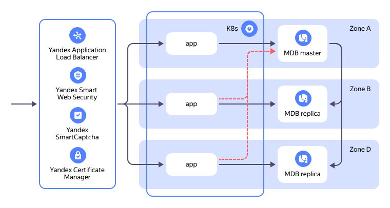
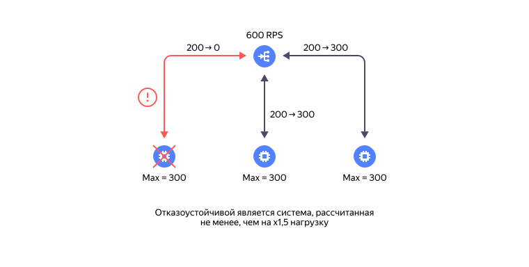

# Рекомендации по отказоустойчивости в {{ yandex-cloud }}

Отказоустойчивость — это способность системы продолжать работать при отказе одного или нескольких компонентов. 
Отказы могут быть как полными, так и частичными. Частичный отказ является промежуточным состянием между состоянием исправности и полного отказа и выражается в частичной (не полной) потере способности системы выполнять свои функции. Пример: 50-процентная потеря сетевых пакетов при передаче по каналам связи является частичным отказом. 

Далее приведены рекомендации по проектированию отказоустойчивой инфраструктуры в {{ yandex-cloud }}.

## Введение { #introduction }

Инфраструктура {{ yandex-cloud }} разделена на [регионы](../overview/concepts/region) и [зоны доступности](../overview/concepts/geo-scope). Зона доступности — это изолированная часть инфраструктуры, которая защищена от сбоев в других зонах. Зоны доступности организованы по территориальному признаку и расположены на расстоянии около 300 км друг от друга.

На данный момент в {{ yandex-cloud }} доступны следующие регионы:

* **Россия** (ru-central1): зоны доступности `ru-central1-a`, `ru-central1-b` и `ru-central1-d`;
* **Казахстан** (kz1): зона доступности `kz1-a`.

Внутри региона обеспечивается прямая сетевая (IP) связность между зонами доступности, общие [API](../overview/api), [SLA](../overview/sla) и единые [тарифы](../../prices) на облачные услуги.

Возможные отказы {{ yandex-cloud }}, которые рассматриваются в этом документе:

1. Кратковременный (часы) полный или частичный выход **одной** зоны доступности из строя.
1. Кратковременный частичный отказ API сервисов облака.

Для построения отказоустойчивых сервисов в {{ yandex-cloud }} необходимо учитывать архитектурные особенности платформы: наличие зон доступности и особенности облачных инструментов построения отказоустойчивых систем.

## Размещение ресурсов { #resource-placement }

Для обеспечения отказоустойчивости сервисы должны быть развернуты **в нескольких зонах доступности**. Оптимальным является размещение **в трех зонах**, что обеспечивает работу кворумных алгоритмов, используемых в таких сервисах, как управляемые базы данных (MDB) и {{ managed-k8s-name }} (mK8s).



Продуктивные окружения с высокими требованиями по скорости восстановления при отказе необходимо размещать именно в трех зонах доступности.



### Схемы резервирования { #reservation-schemes }

В зависимости от требований к времени восстановления после сбоя, существует две основные схемы резервирования:

1. **Холодный резерв (Active-Passive)**:
   *  Основная нагрузка обрабатывается в одной зоне;
   *  В другой зоне размещается минимальный набор ресурсов (например, реплики БД) для быстрого запуска в случае отказа основной зоны;
   *  Простота и более низкая стоимость, так как не требует постоянного дублирования всех ресурсов;
   *  Не обеспечивает гарантию непрерывного предоставления сервиса из-за существенного времени переключения на резервную инфраструктуру.

1. **Распределение нагрузки (Active-Active)**:
   * Нагрузка распределяется между несколькими зонами (см. схему далее); 
   * Требует адаптации ПО и решения проблемы минимизации сетевых задержек между зонами (например, локализация трафика);
   * Высокая отказоустойчивость и минимальное время восстановления.

   Тема минимизации задержек подробно обсуждается в вебинаре [Охотимся на микросекунды: оптимизация работы сервисов в облаке](https://yandex.cloud/ru/events/935).




### Обработка отказов { #failure-handling }

При развертывании отказоустойчивых сервисов рекомендуется использовать балансировщики нагрузки. В {{ yandex-cloud }}балансировщики нагрузки являются ключевыми элементами, позволяющими снижать и даже полностью исключать влияния отказов на работу сервисов. Балансировщики нагрузки состоят из двух основных частей:

* **Обработчика** — элемента, принимающего трафик и распределяющего его между целевыми ресурсами;
* **Целевых ресурсов** — группы ресурсов, принимающих трафик от обработчика.

Для обеих схем резервирования, рассмотренных выше, минимальное время обработки отказа может быть обеспечено только автоматикой, которая отслеживает состояние целевых ресурсов и перенаправляет запросы пользователей от обработчика только в те целевые ресурсы, которые готовы эти запросы обработать. Готовность целевого ресурса принимать запросы определяется с помощью механизма Health Check. Основная трудность настройки заключается в подборе релевантных значений проверок и корректной реализации проверок готовности на стороне целевого ресурса.

Также следует учитывать, что автоматика проверок доступности может не срабатывать в случае частичных отказов в зоне доступности. Для восстановления работоспособности сервиса при таких отказах необходимо предусмотреть механизм ручного перераспределения нагрузки из отказавшей зоны в исправные зоны.

Для минимизации времени обработки отказов, особенно в случае отказов API, важно обеспечить запас вычислительных ресурсов в каждой зоне. Это позволит, в случае выхода одной зоны доступности из строя, использовать мощности оставшихся исправных зон для обслуживания расчетной нагрузки. Рекомендуется иметь запас минимум +50% от расчетной нагрузки по ресурсам в каждой зоне (см. схему ниже).


## Инструменты обеспечения отказоустойчивости { #ha-tools }

* Балансировщики нагрузки: 
   * [Сетевой балансировщик нагрузки ({{network-load-balancer-name}})](../network-load-balancer/concepts/);
   * [Балансировщик нагрузки уровня приложения ({{ alb-name }})](../application-load-balancer/concepts/);

* Платформенные сервисы: 
   * управляемые базы данных (MDB);
   * [{{ managed-k8s-name }}](../managed-kubernetes/) в отказоустойчивой конфигурации;

* Нативно отказоустойчивые облачные сервисы: 
   * [{{ objstorage-name }}](../storage);
   * [{{ container-registry-name }}](../container-registry/);
   * [Serverless Functions](../functions/);
   * [Egress NAT](../vpc/concepts/gateways);

* Средства автоматического масштабирования: 
   * [Группы виртуальных машин](../compute/concepts/instance-groups/) 
   * [Группы узлов {{ k8s }}](../managed-kubernetes/concepts/node-group/cluster-autoscaler).

## Балансировщики нагрузки ({{network-load-balancer-name}}, {{ alb-name }}) { #load-balancers }

### Сетевой балансировщик нагрузки ({{network-load-balancer-name}}) { #nlb }

Основным средством для построения отказоустойчивых решений в {{ yandex-cloud }} является [сетевой балансировщик нагрузки ({{network-load-balancer-name}})](../network-load-balancer/concepts/). {{network-load-balancer-name}} распределяет TCP-соединения между целевыми ресурсами. Он может быть внешним, для обработки трафика из интернета (обработчик с публичным IP-адресом), и внутренним (обработчик с приватным IP-адресом), для обработки внутреннего сетевого трафика. Health Checks используются для проверки готовности целевых ресурсов. В настоящее время {{network-load-balancer-name}} не поддерживает отключение трафика в конкретной зоне.

[Пример](../tutorials/web/load-balancer-website/) создания отказоустойчивого сайта с балансировкой нагрузки через {{network-load-balancer-name}} между двумя зонами доступности, защищенный от сбоев в одной зоне.

### Балансировщик нагрузки уровня приложения ({{ alb-name }}) { #alb }

[{{ alb-name }}](../application-load-balancer/) является более интеллектуальным, но вместе с тем и более затратным инструментом балансировки. Поддерживает интеграцию с сервисами защиты, такими как [{{ sws-name }}](../smartwebsecurity/), [ARL](../smartwebsecurity/concepts/arl), [WAF](../smartwebsecurity/concepts/waf), [{{ captcha-name }}](../smartcaptcha/). {{ alb-name }} позволяет отключать ресурсы в конкретной зоне и [локализовать трафик внутри зоны доступности](../application-load-balancer/concepts/backend-group#locality). 

[Пример](../tutorials/web/application-load-balancer-website) создания отказоустойчивого сайта с балансировкой нагрузки через {{ alb-name }} между тремя зонами доступности, защищенный от сбоев в одной зоне.

## Отказоустойчивость платформенных сервисов { #platform-services-ha }

Размещение хостов платформенных сервисов в разных зонах доступности является основным способом достижения отказоустойчивости.

### Отказоустойчивость управляемых баз данных (MDB) { #mdb-ha }

Согласно [SLA](https://yandex.ru/legal/cloud_sla_mdb/), отказоустойчивой считается конфигурация `Кластера БД, состоящего из двух или более Хостов БД, расположенных в различных зонах доступности`. Оптимальным является размещение узлов кластера БД в трех зонах доступности, так как для обеспечения отказоустойчивости используются системы на базе кворумных алгоритмов.



Продуктивные окружения с высокими требованиями по скорости восстановления при отказе необходимо размещать именно в трех зонах доступности.



В случае отказа мастера БД автоматика сервиса инициирует переключение на другой хост. В ряде случаев во время отказа автоматика сервиса БД не может инициировать переключение мастера. В такой ситуации переключение необходимо выполнить вручную, например, с помощью команды `yc`. Пример для кластера {{ PG }}: 

```bash
   yc managed-postgresql cluster start-failover <имя_кластера> --host <имя_хоста>
```

Для того, чтобы клиент имел возможность всегда подключаться к текущему мастеру БД, не обращаясь к API за состоянием кластера, в {{ yandex-cloud }} существует механизм [особых FQDN](../managed-postgresql/operations/connect#special-fqdns). Подключение через [особый FQDN](../managed-postgresql/operations/connect#special-fqdns) упрощает написание приложений, но не гарантирует быстрое переключение на новый мастер в случае его смены. Для быстрого переключения на мастер необходима реализация на стороне приложения отслеживания факта смены мастера и переподключения к нему.

На текущий момент в {{ yandex-cloud }} нет сервиса, который автоматически балансирует читающую нагрузку между узлами кластера БД. Способы такой балансировки подробно обсуждаются на вебинаре [Охотимся на микросекунды: оптимизация работы сервисов в облаке](https://yandex.cloud/ru/events/935).

### Отказоустойчивость {{ managed-k8s-name }} { #mk8s-ha }

Кластеры {{ k8s }}, согласно [SLA](https://yandex.ru/legal/cloud_sla_kb/) считаются отказоустойчивыми только в том случае, когда `Мастер с настройками отказоустойчивости в трех зонах доступности (в каждой зоне по одному хосту)`.

Для построения отказоустойчивой инфраструктуры, помимо самого кластера, необходимо:
   * Разместить рабочие узлы кластера в нескольких зонах доступности;
   * Распределить служебные сервисы (например, CoreDNS) и сервисы приложения также по нескольким зонам доступности.

Чтобы минимизировать влияние отказа узлов кластера, необходимо обеспечить равномерное распределение нагрузки. Для этого рекомендуется использовать такие механизмы, как:
   * `topologySpreadConstraints` — для распределения подов по зонам доступности;
   * `podAntiAffinity` — для предотвращения размещения подов на одном узле.

Для снижения времени недоступности сервиса во время обновлений кластера необходимо настроить политики `podDisruptionBudget`.

## Средства автоматического масштабирования { #auto-scaling }

В случае отказа одной из зон доступности необходимо перераспределить нагрузку на оставшиеся зоны. Если отказоустойчивость организована по принципу `Холодный резерв (Active-Passive)`, время восстановления работоспособности можно сократить за счет автоматизации масштабирования ресурсов.

Основной инструмент масштабирования в {{ yandex-cloud }} — это [группы виртуальных машин](../compute/concepts/instance-groups/). Группа виртуальных машин включает:

   * Шаблон виртуальной машины;
   * Политику масштабирования (ручную или автоматическую);
   * Механизм масштабирования.

[Пример](../tutorials/infrastructure-management/vm-autoscale/) развертывания группы ВМ с политикой автоматического масштабирования при превышении допустимой нагрузки.

Для автоматического масштабирования, помимо базового параметра — нагрузки на CPU, — можно использовать любой параметр из {{ yandex-cloud }} {{ monitoring-name }}.

Рекомендации по обеспечению устойчивости к отказам зон:
   1. Используйте отдельные группы виртуальных машин для каждой зоны доступности. Не рекомендуется использовать одну группу виртуальных машин для создания виртуальных машин в разных зонах доступности, так как это может затруднить управление при отказе одной из зон.
   1. Для масштабирования групп узлов кластера {{ k8s }} применяется аналогичная механика, основанная на базе механики групп виртуальных машин.



Не вся функциональность групп виртуальных машин доступна для групп узлов кластера {{ k8s }}.





При проектировании отказоустойчивой облачной инфраструктуры учитывайте, что в случае отказа одной из зон доступности свободные ресурсы в остальных зонах будут исчерпываться значительно быстрее.



## Отказоустойчивость клиентских сервисов { #client-service-ha }

Для обеспечения отказоустойчивости и скорости отработки отказов приложений в {{ managed-k8s-name }} необходимо:

   1. Выделить сервису достаточное количество ресурсов (CPU, RAM);
   1. Минимизировать или исключить переподписку ресурсов на рабочих узлах кластера {{ managed-k8s-name }}, особенно RAM;
   1. Настроить корректные Health Checks;
   1. Использовать политику повторных попыток (retry policy) к сервисам провайдера;
   1. Настроить автомасштабирование рабочих узлов кластера для автоматического перераспределения ресурсов в случае неожиданного повышения нагрузки или отказа одной из зон доступности.

## Как уводить нагрузку из зоны доступности { #traffic-shifting }

Для {{ alb-name }} существует возможность вручную [отключить трафик в конкретной зоне](../application-load-balancer/concepts/application-load-balancer#lb-location). 
Для {{network-load-balancer-name}} убрать трафик из зоны можно только путем отключения проверок доступности (Health Checks) для целевых ресурсов в проблемной зоне. Это можно сделать одним из следующих способов:

   * На уровне инфраструктуры — заблокировать проверки на уровне сетевых групп безопасности;
   * Отключить виртуальные машины, которые обрабатывают запросы в проблемной зоне;
   * На уровне операционной системы — закрыть доступ к проверкам с помощью межсетевого экрана;
   * На уровне приложения — настроить приложение так, чтобы оно не отвечало на проверки доступности.

Рекомендуемый способ — использование сетевых групп безопасности. Для этого необходимо настроить отдельные разрешающие правила для прохождения проверок доступности до целевых ресурсов в каждой зоне доступности. Удаление соответствующего правила позволяет отключить трафик в определенной зоне. Такая конфигурация также позволяет использовать сетевые группы безопасности для тестирования отказоустойчивости.

Остальные способы следует учитывать на случай недоступности API {{ yandex-cloud }}.

## Мониторинг и эскалация { #monitoring-escalation }

Ключевым инструментом обеспечения отказоустойчивости являются [мониторинг](../monitoring/concepts/) и [система предупреждений (alerts)](../monitoring/concepts/alerting/alert). Помимо базовых средств мониторинга, которые предоставляются вместе с сервисами облака, важно настроить мониторинг бизнес-метрик. Например, отслеживание количества пользователей сервиса за последние минуты позволяет выявить проблемы на высоком уровне, даже если их источник в инфраструктуре не отслеживается. 
Для оперативного оповещения о проблемах, в дополнение к сервису мониторинга, необходимо настроить [политику эскалации](../monitoring/concepts/alerting/escalations) (в настоящее время находится на стадии [Preview](../overview/concepts/launch-stages.md)).

## План действий { #action-plan }

Для быстрого восстановления сервиса необходимо иметь заранее подготовленные планы действий на случай отказов, такие как ручное переключение мастера БД или отключение зоны доступности.

## Тестирование отказоустойчивости { #ha-testing }

Любые решения по обеспечению отказоустойчивости требуют регулярного тестирования в различных сценариях отказов. Подробнее о тестировании отказоустойчивости в облаке можно узнать из вебинара: [Отключаем ЦОД, или как тестировать отказоустойчивость в облаке](https://yandex.cloud/ru/events/841).

## Смотрите также { #see-also }

* [{#T}](../tutorials/infrastructure-management/fault-tolerance.md).