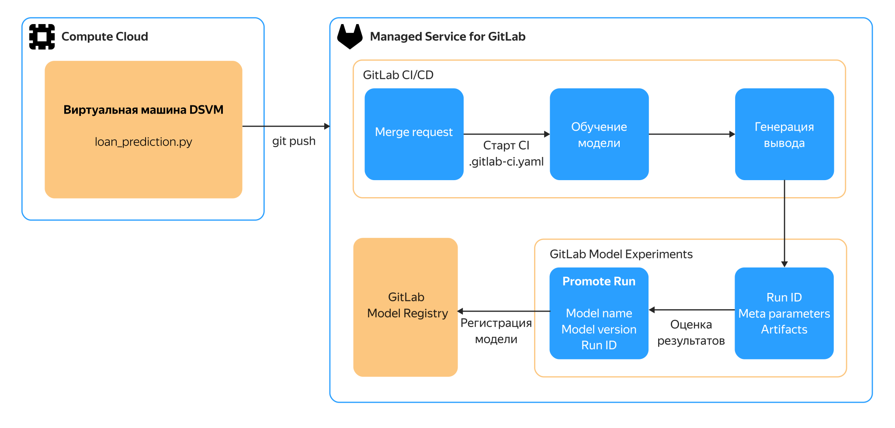

# Управление жизненным циклом MLOps с помощью ML Registry в {{ mgl-full-name }}

В течение жизненного цикла модели машинного обучения выполняются разработка, обучение модели, оценка качества и внедрение модели. В данном руководстве рассматриваются возможности платформы {{ GL }} для хранения и версионирования ML‑артефактов, которые возникают при экспериментах с ML-моделью, в инфраструктуре {{ yandex-cloud }}. В экспериментах меняются гиперпараметры модели — настройки, которые задаются до начала обучения модели и определяют ее архитектуру, стратегию обучения и общее поведение. В отличие от параметров модели (весов, коэффициентов), которые подбираются в процессе обучения на данных, гиперпараметры не изменяются автоматически — их выбирает исследователь или ML-инженер.

Жизненный цикл разработки и тестирования модели в среде {{ GL }} отображен на схеме:



В качестве среды разработки и тестирования используется виртуальная машина DSVM. Масштабируемый управляемый сервис [{{ mgl-full-name }}](../managed-gitlab/index.yaml) обеспечивает работу инстанса {{ GL }} с предустановленным пакетом [ML Registry]({{ gl.docs }}/user/project/ml/model_registry/). Благодаря этому вы можете пользоваться следующими инструментами MLOps:

* Реестр моделей (Model Registry) для логирования метрик, анализа экспериментов по применению модели и оценки качества.
* Каталог экспериментов (Model Experiments) для управления хранением и версионированием модели.

Для интеграции модели с ML Registry используется [библиотека Python API](https://mlflow.org/docs/latest/api_reference/python_api/index.html) платформы MLFlow.

Кроме сервиса {{ mgl-name }}, для работы с исходным кодом модели используется сервис [{{ compute-full-name }}](../compute/index.yaml), а для сетевой инфраструктуры — [{{ vpc-full-name }}](../vpc/index.yaml).

## Системная архитектура {#architecture}

### Сеть {#network}

В инфраструктуре решения создается [облачная сеть](../vpc/concepts/network.md#network) {{ vpc-name }} `net-gitlab`.

#### Подсети {#subnets}

В сети `net-gitlab` создается [подсеть](../vpc/concepts/network.md#subnet) в выбранной [зоне доступности](../overview/concepts/geo-scope.md) для размещения инстанса {{ mgl-name }} и ВМ.

#### Группы безопасности {#security-groups}

Сетевой доступ к ресурсам инфраструктуры разграничен с помощью [группы безопасности](../vpc/concepts/security-groups.md). [Подробнее о настройке правил группы безопасности для {{ mgl-name }}](../managed-gitlab/operations/configure-security-group.md).

#### Адреса ресурсов {#addresses}

В создаваемой инфраструктуре используются [публичный IP-адрес](../vpc/concepts/address.md#public-addresses) для создаваемой ВМ и URL-адрес инстанса {{ GL }} в домене `gitlab.yandexcloud.net`.

### {{ mgl-name }} {#gitlab}

[Инстанс {{ GL }}](../managed-gitlab/concepts/) развертывается в ВМ под управлением [сервиса {{ mgl-name }}](../managed-gitlab/index.yaml). Доступ к инстансу осуществляется по его адресу через стандартный веб-интерфейс {{ GL }}.

Чтобы выполнять задания {{ GL }} CI/CD, для инстанса {{ mgl-name }} создается и настраивается {{ GLR }}.

### {{ compute-name }} {#compute}

Для локального тестирования и загрузки изменений в репозиторий с исходным кодом модели используется виртуальная машина [{{ dsvm-name }}](../compute/operations/dsvm/index.md). Отдельная ВМ может использоваться для развертывания {{ GLR }}.

## Тестовая модель {#sample-ml}

Тестовая ML-модель, развертываемая в этом руководстве, симулирует цикл разработки и версионирования модели кредитного конвейера. Модель адаптирована для использования в облачной инфраструктуре.

Чтобы развернуть среду разработки модели в облачной среде {{ yandex-cloud }}:

1. [Подготовьте облако к работе](#before-you-begin).
1. [Создайте инфраструктуру](#deploy).
1. [Создайте проект и настройте окружение](#project).
1. [Создайте эксперимент и версию модели](#experiment).

Если созданные ресурсы вам больше не нужны, [удалите их](#clear-out).

## Подготовьте облако к работе {#before-you-begin}



### Необходимые платные ресурсы {#paid-resources}

* Сервис {{ mgl-name }}: использование вычислительных ресурсов инстанса (виртуальной машины) и объем хранилища данных инстанса (см. [тарифы {{ mgl-name }}](../managed-gitlab/pricing.md)). В зависимости от того, где развернут {{ GLR }}, может тарифицироваться ВМ {{ compute-name }} для установки {{ GLR }}.
* Виртуальные машины: использование вычислительных ресурсов, хранилища, публичного IP-адреса и операционной системы (см. [тарифы {{ compute-name }}](../compute/pricing.md)).
* Сервис {{ objstorage-name }}: использование для хранения резервных копий {{ mgl-name }} (см. [тарифы {{ objstorage-name }}](../storage/pricing.md)).

## Создайте инфраструктуру {#deploy}



Прежде чем приступать к созданию инфраструктуры, [убедитесь](../quota-manager/operations/list-quotas.md), что в вашем [облаке](../resource-manager/concepts/resources-hierarchy.md#cloud) достаточно свободных [квот](../quota-manager/concepts/index.md) на ресурсы.





- Вручную {#manual}

  1. [Создайте сеть](../vpc/operations/network-create.md) с именем `net-gitlab`. При создании сети отключите опцию **{{ ui-key.yacloud.vpc.networks.create.field_is-default }}**.
  1. В сети `net-gitlab` [создайте](../vpc/operations/subnet-create.md) подсеть в зоне доступности `{{ region-id }}-a` со следующими параметрами:
      * **{{ ui-key.yacloud.vpc.subnetworks.create.field_name }}** — `subnet-gitlab-a`.
      * **{{ ui-key.yacloud.vpc.subnetworks.create.field_zone }}** — `{{ region-id }}-a`.
      * **{{ ui-key.yacloud.vpc.subnetworks.create.field_ip }}** — `10.16.0.0/24`.
  1. В сети `net-gitlab` [создайте группу безопасности](../vpc/operations/security-group-create.md) с именем `gitlab-sg` для работы [инстанса {{ mgl-name }}](../managed-gitlab/concepts/index.md#instance) и ВМ. Настройте правила в этой группе безопасности [по инструкции](../managed-gitlab/operations/configure-security-group.md).
  1. [Создайте](../iam/operations/sa/create.md) сервисный аккаунт `gitlab-sa` и [назначьте](../iam/operations/sa/assign-role-for-sa.md) ему [роли](../iam/concepts/access-control/roles.md) `compute.admin`, `{{ roles-vpc-admin }}` и `iam.serviceAccounts.user`.
  1. [Создайте и активируйте инстанс {{ GL }}](../managed-gitlab/operations/instance/instance-create.md) любой подходящей конфигурации. При создании инстанса укажите созданные ранее подсеть и группу безопасности.
  1. [Создайте ВМ из образа {{ dsvm-short-name }}](../compute/operations/dsvm/quickstart.md) с именем `vm-mlops` в зоне доступности `{{ region-id }}-a` и созданной ранее подсети. При создании ВМ укажите созданную ранее группу безопасности.

- {{ TF }} {#tf}

    1. 
    1. 
    1. 
    1. 

    1. Скачайте в ту же рабочую директорию файл конфигурации [ml-ops-managed-gitlab.tf](https://github.com/yandex-cloud-examples/yc-ml-ops-managed-gitlab/blob/main/ml-ops-managed-gitlab.tf).

        В этом файле описаны:

        * [сеть](../vpc/concepts/network.md#network);
        * [подсеть](../vpc/concepts/network.md#subnet);
        * [группа безопасности](../vpc/concepts/security-groups.md) и правила, необходимые для работы инстанса {{ mgl-name }};
        * инстанс {{ mgl-name }};
        * ВМ с образом [DSVM](/marketplace/products/yc/dsvm);
        * сервисный аккаунт.

    1. Укажите в файле `ml-ops-managed-gitlab.tf` значения параметров:

        * `instance_name` — название инстанса {{ GL }};
        * `instance_login` — логин администратора инстанса {{ GL }};
        * `instance_email` — адрес электронной почты администратора;
        * `instance_domain` — доменное имя инстанса в формате `<имя>.gitlab.yandexcloud.net`.
        * `vm_username` и `vm_public_key` — логин и абсолютный путь к [публичному ключу](../compute/operations/vm-connect/ssh.md#creating-ssh-keys), которые будут использоваться для доступа к ВМ.
        * `sa_folder_id` — идентификатор каталога, в котором создается сервисный аккаунт.

    1. Проверьте корректность файлов конфигурации {{ TF }} с помощью команды:

        ```bash
        terraform validate
        ```

        Если в файлах конфигурации есть ошибки, {{ TF }} на них укажет.

    1. Создайте необходимую инфраструктуру:

        

        



## Создайте проект и настройте окружение {#project}

1. [Создайте проект {{ GL }}]({{ gl.docs }}/ee/user/project/), выберите на стартовой странице **Import project** и укажите настройки импорта:

   * **Import project from** — **Repository by URL**.
   * **Git Repository URL** — `https://github.com/yandex-cloud-examples/yc-ml-ops-managed-gitlab.git`
   * **Project name** — `gitlab-mlflow`.

1. Разверните [раннер](../managed-gitlab/concepts/index.md#runners) для созданного проекта {{ GL }} с помощью [инструкции](../managed-gitlab/tutorials/install-gitlab-runner.md). При развертывании укажите [созданные ранее](#deploy) компоненты инфраструктуры:

   * Если вы устанавливаете раннер на ВМ вручную, при создании ВМ выберите подсеть `subnet-gitlab-a` и группу безопасности `gitlab-sg`.
   * При создании раннера с помощью Консоли управления укажите сервисный аккаунт `gitlab-sa` и группу безопасности `gitlab-sg`.

### Настройте переменные окружения {#variables}

1. Откройте проект {{ GL }} `gitlab-mlflow`.
1. На панели слева перейдите в раздел **Settings** и во всплывающем списке выберите пункт **Access Tokens**.
1. Задайте параметры нового токена:
   * **Token name** — `mlflow`.
   * **Select a role** — `Maintainer`.
   * **Select scopes** — `api`, `manage_runner`, `read_repository`, `write_repository`.
1. Нажмите кнопку **Create project access token**.
1. Скопируйте значение созданного токена.
1. Выберите слева вкладку **Settings**, а во всплывающем списке — **CI/CD**.
1. В разделе **Variables** нажмите кнопку **Expand**.
1. Добавьте переменные окружения:
      * `MLFLOW_TRACKING_TOKEN` — созданный токен.
      * `MLFLOW_TRACKING_URI` — `https://<адрес_инстанса_{{ GL }}>.gitlab.yandexcloud.net/api/v4/projects/4/ml/mlflow`.
      * `REPO_TOKEN` — созданный токен.

      Для добавления переменной:
      * Нажмите кнопку **Add variable**.
      * В появившемся окне в поле **Key** укажите имя переменной, в поле **Value** — значение переменной.
      * Нажмите кнопку **Add variable**.

## Создайте эксперимент и версию модели {#experiment}

1. [Подключитесь](../compute/operations/vm-connect/ssh.md) к ВМ `vm-mlops` по [SSH](https://yandex.cloud/ru/docs/glossary/ssh-keygen).
1. [Добавьте](https://docs.gitlab.com/user/ssh/) SSH-ключ для безопасного доступа к {{ GL }}.
1. [Склонируйте](https://docs.gitlab.com/topics/git/clone/) репозиторий проекта `gitlab-mlflow` с помощью SSH.

1. Перейдите в директорию с репозиторием и создайте ветку `mlops-experiment-1`:

   ```bash
   git checkout -b mlops-experiment-1
   ```

1. Внесите изменения в параметры модели в файле `loan_prediction.py`, например поменяйте параметр `RANDOM_SEED`.
1. Загрузите изменения на {{ GL }}:

   ```bash
   git add -A
   git commit -m "Change model parameter"
   git push
   ```

1. Откройте проект {{ GL }} `gitlab-mlflow` и [создайте мерж-реквест]({{ gl.docs }}/user/project/merge_requests/creating_merge_requests/) из созданной ветки. Автоматически будет создан сценарий обучения и тестирования измененной модели.

1. Запустите сценарий:
    1. На панели слева выберите пункт **Build**.
    1. В выпадающем списке выберите пункт **Pipelines**.
    1. Нажмите кнопку  в колонке **Actions** и выберите **trigger_train**.

    Дождитесь завершения работы сценария.

1. Создайте реестр версий модели:
   1. На панели слева выберите пункт **Deploy**.
   1. В выпадающем списке выберите пункт **Model Registry**.
   1. Нажмите кнопку **Create/import model** и выберите **Create new model**.
   1. Укажите имя модели `loan-prediction-demo` и нажмите кнопку **Create**.

1. Проверьте результаты эксперимента:
   1. На панели слева выберите пункт **Analyze**.
   1. В выпадающем списке выберите пункт **Model Experiments**.
   1. Выберите в списке справа эксперимент `Loan_prediction` и перейдите на вкладку **Runs**. В списке отображаются все методы для обучения модели, их параметры и результаты обучения.
   1. Нажмите на элемент списка в колонке **Name**. На вкладке **Artifacts** отображаются артефакты обучения выбранного метода модели.
   1. Нажмите кнопку **Promote run** для регистрации версии модели. Выберите в поле **Model** модель `loan-prediction-demo` из выпадающего списка, укажите в поле **Version** версию `0.0.1` и нажмите кнопку **Promote**. В реестр версий будет добавлена новая версия и все артефакты ее обучения.

## Удалите созданные ресурсы {#clear-out}

Некоторые ресурсы платные. Чтобы за них не списывалась плата, удалите ресурсы, которые вы больше не будете использовать:



- Вручную {#manual}

    1. [Удалите инстанс {{ GL}}](../managed-gitlab/operations/instance/instance-delete.md).
    1. [Удалите ВМ](../compute/operations/vm-control/vm-delete.md).

- {{ TF }} {#tf}

    



## См. также {#see-also}

* [Machine Learning Model Experiments]({{ gl.docs }}/user/project/ml/experiment_tracking/)
* [Model Registry]({{ gl.docs }}/user/project/ml/model_registry/)
