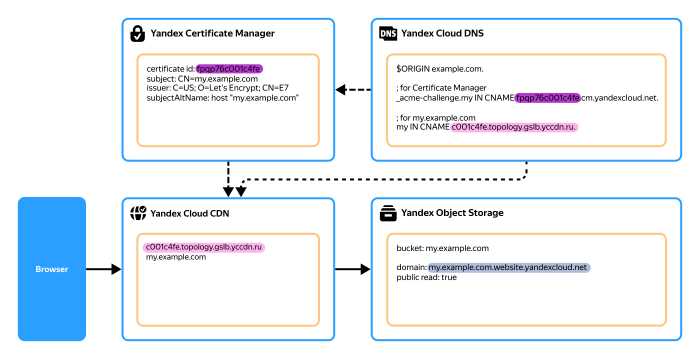

# Развертывание статического веб-сайта в отказоустойчивой конфигурации в {{ yandex-cloud }}

Это руководство содержит несколько вариантов решений по развертыванию в инфраструктуре {{ yandex-cloud }} статического веб-сайта с динамическими элементами, например формой регистрации или сбора заявок, в отказоустойчивой конфигурации.

Предлагаемые решения позволяют оптимизировать расходы, а также обеспечивают высокую скорость загрузки сайта на стороне конечных пользователей.

## Общая архитектура решений {#architecture}

В основе инфраструктуры, используемой всеми рассматриваемыми решениями, лежат сервисы [{{ objstorage-full-name }}](../storage/index.yaml) и [{{ vpc-full-name }}](../vpc/index.yaml). Для ускорения загрузки контента у конечных пользователей используются ресурсы сервиса [{{ cdn-full-name }}](../cdn/index.yaml). Кроме этого, разные варианты решений используют различные комбинации вспомогательных [сервисов](../overview/concepts/services.md) экосистемы {{ yandex-cloud }}: [{{ dns-full-name }}](../dns/index.yaml), [{{ certificate-manager-full-name }}](../certificate-manager/index.yaml), [{{ api-gw-full-name }}](../api-gateway/index.yaml), [{{ alb-full-name }}](../application-load-balancer/index.yaml), [{{ postbox-full-name }}](../postbox/index.yaml) и [{{ sf-full-name }}](../functions/index.yaml).

Отказоустойчивость рассматриваемых решений обеспечивается за счет автоматической репликации данных, сохраняемых в [бакетах](../storage/concepts/bucket.md) {{ objstorage-name }}, а также за счет опциональной возможности включения [версионирования](../storage/concepts/versioning.md).

Плюсы предлагаемых решений:

* не нужно проектировать отказоустойчивое размещение сайта одновременно в нескольких [зонах доступности](../overview/concepts/geo-scope.md), так как используемые сервисы изначально обеспечивают надежность и отказоустойчивость;
* относительная простота архитектуры;
* относительно невысокая стоимость решений по сравнению с другими способами размещения, а также возможность [нетарифицируемого использования](../billing/concepts/serverless-free-tier.md) (`free tier`), позволяющая практически бесплатно получить решения для проектов с небольшим объемом данных и малым количеством посетителей.

### Автоматическое развертывание инфраструктуры {#automation}

В дополнительных материалах к руководству содержатся примеры конфигурации [{{ TF }}](../terraform/index.yaml), которые позволяют развернуть необходимую облачную инфраструктуру максимально быстро и содержат примеры решения типовых задач, таких как:

* загрузка и обновление файлов статического сайта в {{ objstorage-name }};
* создание [сертификата](../certificate-manager/concepts/managed-certificate.md) от Let's Encrypt для сайта в {{ certificate-manager-name }};
* настройка сервиса {{ postbox-name }} для отправки транзакционных писем;
* внедрение на сайт [функции](../functions/concepts/function.md) {{ sf-name }} для отправки писем и пример такой функции для среды [Node.js](https://nodejs.org/en/docs/).

Дополнительные материалы к руководству доступны в репозитории [ **yc-object-storage-cdn-static-site**](https://github.com/yandex-cloud-examples/yc-object-storage-cdn-static-site) на GitHub.

## Обзор вариантов решений {#solutions}

В зависимости от требований, предъявляемых к сайту, системная архитектура решений может существенно различаться. При этом для всех вариантов размещения необходимо собственное доменное имя сайта, корректно настроенный DNS для домена, а также SSL-сертификат.

В этом обзоре рассматриваются следующие варианты решений по размещению статического сайта в инфраструктуре {{ yandex-cloud }}:

* [{#T}](#simple-bucket)
* [{#T}](#bucket-cdn)
* [{#T}](#bucket-cdn-api-gateway)
* [{#T}](#bucket-alb)

## Бакет {{ objstorage-full-name }} с публичным доступом {#simple-bucket}

В бакетах {{ objstorage-full-name }} предусмотрен специальный [режим {{ ui-key.yacloud.storage.bucket.website.switch_hosting }}](../storage/concepts/hosting.md), являющийся одним из самых простых и доступных способов размещения статического сайта в {{ yandex-cloud }}. Для небольших проектов дополнительным плюсом такого размещения является возможность нетарифицируемого использования (`free tier`). Подробнее о нетарифицируемом использовании сервиса {{ objstorage-name }} читайте в [документации {{ billing-name }}](../billing/concepts/serverless-free-tier.md#objstorage).

Схема работы решения:


### Необходимые ресурсы {#simple-bucket-resources}

Чтобы разместить статический сайт в этом варианте решения, потребуются:

* бакет {{ objstorage-name }} с включенным режимом `{{ ui-key.yacloud.storage.bucket.website.switch_hosting }}`;
* доменное имя и SSL-сертификат, выпущенный для этого доменного имени;
* настроенная [публичная зона](../dns/concepts/dns-zone.md#public-zones) DNS для домена и [ресурсная запись](../dns/concepts/resource-record.md), связывающая бакет и доменное имя.



Для того чтобы к сайту можно было обращаться по доменному имени, [имя бакета](../storage/concepts/bucket.md#naming) должно совпадать с этим доменным именем. Например: `my.example.com`.



Пошагово процесс настройки статического сайта с использованием бакета {{ objstorage-name }} с публичным доступом и включенным режимом `{{ ui-key.yacloud.storage.bucket.website.switch_hosting }}` описан в разделе [{#T}](../tutorials/web/static/index.md).

### Преимущества и недостатки этого варианта решения {#simple-bucket-advantages-drawbacks}

#|
|| **Преимущества**  | **Недостатки**  ||
|| 
* Отказоустойчивость за счет автоматической репликации данных в бакетах {{ objstorage-name }}.
* Относительная простота архитектуры.
* Для больших проектов — относительно невысокая стоимость.
* Для небольших проектов — возможность нетарифицируемого использования.
|
* Невозможность разделить сайт на публичную и закрытую части, так как для всего бакета должен быть открыт [публичный доступ](../storage/concepts/bucket.md#bucket-access) на чтение.
* Невозможность настроить специальное перенаправление запросов (например, для сайтов, построенных по технологии [SPA](https://ru.wikipedia.org/wiki/Одностраничное_приложение)), так как в {{ objstorage-name }} в частности нет аналога инструкции [nginx](https://nginx.org/) `try_files $uri $uri/ /index.html =404;`.
* Конкуренция в поисковых системах между основным доменом сайта и служебными доменами бакета. [Подробнее](#simple-bucket-troubleshooting) о проблеме и способах ее решения.
* Невозможность настроить правила переадресации для существующих [объектов](../storage/concepts/object.md) в бакете (можно настроить только для несуществующих объектов).
* Необходимость настраивать параметры кеширования для клиента отдельно в отношении каждого объекта.
* Тарификация исходящего трафика по [тарифам](../vpc/pricing.md) {{ vpc-full-name }}.
* Потенциально высокие расходы на запросы к объектам, если сайт состоит из большого количества объектов: в {{ objstorage-name }} [тарифицируется](../storage/pricing.md) не только хранение объектов, но и запросы к ним.
||
|#

Избавиться от указанных выше недостатков позволяют [другие варианты](#solutions) развертывания.

### Нюансы при реализации решения {#simple-bucket-details}

При развертывании сайта учитывайте следующие нюансы:

* Тип ресурсной DNS-записи, связывающей доменное имя и бакет, зависит от уровня домена:

    * Для доменов второго уровня (например, `example.com`) создайте [ресурсную запись ANAME](../dns/concepts/resource-record.md#aname).
    * Для доменов третьего уровня и выше (например, `my.example.com`, `my.other.example.com` и т.д.) создайте [ресурсную запись CNAME](../dns/concepts/resource-record.md#cname).

    

    Ресурсная запись в любом случае должна указывать на [служебный домен](../storage/concepts/hosting.md#bucket-url) бакета.

    Например, для домена `my.example.com` в публичной DNS-зоне `example.com` создайте CNAME-запись `my`, указывающую на `my.example.com.{{ s3-web-host }}.`
    
    Точка в конце целевого доменного имени обязательна, ее отсутствие приведет к неработоспособности сайта.

    

    Подробнее о том, как создать ресурсную запись, читайте в разделе [{#T}](../dns/operations/resource-record-create.md).

* Сервис {{ objstorage-name }} интегрирован с сервисом {{ certificate-manager-name }}, который поддерживает работу как с [пользовательскими сертификатами](../certificate-manager/concepts/imported-certificate.md), так и с сертификатами от Let's Encrypt.

    При создании сертификата от Let's Encrypt пройдите [проверку прав на домен](../certificate-manager/concepts/challenges.md). Наиболее надежным и удобным способом проверки является DNS-проверка с использованием CNAME-записи. [Такая проверка](../certificate-manager/concepts/challenges.md#cname) выполняется один раз и в дальнейшем не требует участия пользователя для перевыпуска сертификата.

    Подробнее о том, как пройти проверку прав владения доменом, читайте в разделе [{#T}](../certificate-manager/operations/managed/cert-validate.md).
* Работа в режиме `{{ ui-key.yacloud.storage.bucket.website.switch_hosting }}` требует включения публичного доступа к бакету и предоставляет ряд дополнительных возможностей.

    

    * Запросы к пути `/` возвращают содержимое файла, заданного в параметре **{{ ui-key.yacloud.storage.bucket.website.field_index }}**.
    * Запросы к несуществующим объектам возвращают содержимое файла, заданного в параметре **{{ ui-key.yacloud.storage.bucket.website.field_error }}**.
    * Доступна дополнительная функциональность переадресации запросов.
    * Служебный домен настраивается для обработки запросов к основному домену по протоколу `https`.
    * Служебный домен бакета с включенным режимом `{{ ui-key.yacloud.storage.bucket.website.switch_hosting }}` — `{{ s3-web-host }}`.

        

        Если режим `{{ ui-key.yacloud.storage.bucket.website.switch_hosting }}` выключен, то служебный домен бакета — `{{ s3-storage-host }}`.

        

    

* Если в качестве имени бакета используется доменное имя с точками, обращение к служебному домену бакета в формате `<доменное_имя>.{{ s3-web-host }}` по протоколу `https` невозможно. Это связано с тем, что служебный домен в этом формате использует [wildcard-сертификат](../glossary/ssl-certificate.md#wildcard-certificate) SSL, который подходит только для доменов четвертого уровня `*.{{ s3-web-host }}`.

    Поэтому в таких случаях для обращения к служебному домену бакета по протоколу `https` используйте URL в формате `https://{{ s3-web-host }}/<доменное_имя>`.

    Например: `https://{{ s3-web-host }}/my.example.com`.
* Доступ к содержимому бакета может быть ограничен с помощью [политик доступа](../storage/concepts/policy.md). Но такие политики не всегда позволяют легко решать практические задачи. Например, можно ограничить доступ к содержимому бакета для определенного диапазона IP-адресов, но нельзя задать такие ограничения для доменных имен.

    Подробнее о том, как настроить политику доступа для бакета, читайте в разделе [{#T}](../storage/operations/buckets/policy.md).
* При загрузке объектов в бакет можно задать ряд заголовков, позволяющих управлять обработкой контента. Например, заголовок `Content-Type` позволяет [задать](#simple-bucket-troubleshooting) MIME-тип содержимого.

    Также существует еще ряд заголовков, которые можно установить для объектов в бакете {{ objstorage-name }} и которые позволяют управлять обработкой контента в браузере.

    

    * `Content-Type` — позволяет задать MIME-тип содержимого объекта в бакете.
    * `Cache-Control` — управляет кешированием на клиенте и промежуточных кеширующих серверах. Иногда установка параметров кеширования на клиенте позволяет значительно ускорить загрузку страниц и снизить потребление трафика.

        

        С осторожностью используйте заголовок `Cache-Control` для установки параметров кеширования, особенно в отношении HTML-страниц. Клиент может на длительный срок закешировать ошибочную страницу, в результате чего браузер будет отображать пользователю неверную информацию до тех пор, пока не истечет срок кеширования или пользователь вручную не очистит кеш браузера.

        

    * `Content-Disposition` — сообщает браузеру, что объект должен сохраняться как файл, и задает конкретное имя файла.
    * `Content-Encoding` — указывает метод, которым закодирован файл (например, сжатие `gzip`).

    

    Подробнее о том, как задать заголовки для объектов в бакете, читайте в разделе [Решение проблем](#simple-bucket-troubleshooting).

### Решение проблем {#simple-bucket-troubleshooting}



- Возникновение поисковой конкуренции между основным доменом сайта и служебными доменами бакета

  Из-за особенностей работы {{ objstorage-name }} содержимое сайта будет доступно не только по основному адресу `my.example.com`, но и через служебные домены {{ objstorage-name }}:

  * `my.example.com.{{ s3-web-host }}`;
  * `{{ s3-web-host }}/my.example.com`;
  * `{{ s3-storage-host }}/my.example.com`.

  С точки зрения алгоритмов поисковых систем между этими адресами может возникнуть конкуренция, что негативно скажется на ранжировании сайта в поисковой выдаче.

  Подробнее об этой проблеме и о том, как ее решить, читайте в [документации к сервису Яндекс Вебмастер](https://yandex.ru/support/webmaster/ru/yandex-indexing/site-addresses).

- При обращении к сайту страницы не открываются на экране, а скачиваются в виде файлов, либо не работают скрипты JavaScript, расположенные в отдельных файлах

  Такое поведение может быть вызвано некорректным заголовком `Content-Type` в метаданных проблемных объектов в бакете. Если при загрузке объекта в бакет не задать значение этого заголовка явным образом, {{ objstorage-name }} попытается самостоятельно определить тип загружаемого контента. Значение заголовка `Content-Type`, определенное сервисом автоматически, иногда может не соответствовать ожиданиям пользователя.

  Рекомендуем явно задавать значение для заголовка `Content-Type` при загрузке файлов статического сайта в бакет:

  * Чтобы страница сайта открывалась, а не скачивалась, заголовок должен иметь значение `text/html`.
  * Чтобы скрипт `JavaScript` запускался, заголовок должен иметь значение `application/javascript`.

  

  ```bash
  yc storage s3api put-object \
    --bucket my.example.com \
    --key index.html \
    --body /path/to/my/index.html \
    --content-type 'text/html'
  ```

  

  

  ```hcl
  variable "site_source_dir" {
    type        = string
    description = "Site source directory" # Локальная директория с файлами сайта
    default     = "~/path/to/my/site"     # Используйте функцию pathexpand() для обработки ~ и других специальных символов 
  }

  locals {
    site_mime_types = jsondecode(file("mime.json")) # Файл с таблицей сопоставления расширений файлов с Mime-типом
  }

  resource "yandex_storage_object" "files" {
    for_each     = var.site_source_dir == null ? toset([]) : fileset(pathexpand(var.site_source_dir), "**") # рекурсивный перебор всех файлов в каталоге
    bucket       = "my.example.com"
    key          = each.key
    source       = pathexpand("${var.site_source_dir}/${each.key}")
    source_hash  = filemd5(pathexpand("${var.site_source_dir}/${each.key}")) # Хранение дайджеста файла в стейте, чтобы файл перезагружался после изменения
    content_type = lookup(local.site_mime_types, regex("\\.[^.]+$", each.key), null) # Выставление Content-Type для файла в зависимости от его расширения
  }
  ```

  Пример содержимого файла `mime.json`:

  ```json
  {
    ".html": "text/html",
    ".htm": "text/html",
    ".shtml": "text/html",
    ".css": "text/css",
    ".xml": "text/xml",
    ".gif": "image/gif",
    ...
  }
  ```

  

  О том, как изменить тип контента для группы уже загруженных в бакет объектов, читайте в разделе [Устранение проблем с некорректным MIME-типом объектов при их загрузке в {{ objstorage-short-name }}](../troubleshooting/storage/known-issues/incorrect-mime-type.md).



## Бакет {{ objstorage-full-name }} с публичным доступом и раздачей контента через {{ cdn-full-name }} {#bucket-cdn}

В этом варианте решения бакет в режиме хостинга используется в качестве [источника](../cdn/concepts/origins.md) для [CDN-ресурса](../cdn/concepts/resource.md) {{ cdn-name }}. Доменное имя сайта связывается с помощью ресурсной записи CNAME со специальным доменным именем CDN-провайдера, которое присваивается [каталогу](../resource-manager/concepts/resources-hierarchy.md#folder) пользователя в [облаке](../resource-manager/concepts/resources-hierarchy.md#cloud) {{ yandex-cloud }}.

CDN-ресурс кеширует запросы конечных пользователей на своих серверах, а к бакету-источнику обращается только в том случае, когда нужного файла нет в кеше.

Основное преимущество CDN — геораспределенность. [Точки присутствия](../cdn/concepts/points-of-presence.md) CDN расположены в больших городах, максимально близко к основным потребителям контента. За счет кеширования и сокращения расстояния между клиентом и CDN-сервером сайт быстрее загружается в браузере конечного пользователя.



Схема работы решения для полностью статического сайта:



### Необходимые ресурсы {#bucket-cdn-resources}

Чтобы разместить статический сайт в этом варианте решения, потребуются:

* бакет {{ objstorage-name }} с включенным режимом `{{ ui-key.yacloud.storage.bucket.website.switch_hosting }}`;
* CDN-ресурс {{ cdn-name }};
* доменное имя и SSL-сертификат, выпущенный для этого доменного имени;
* настроенная публичная зона DNS для домена и ресурсная запись, связывающая CDN-ресурс и доменное имя.

Подробнее о том, как создать CDN-ресурс, читайте в разделе [{#T}](../cdn/operations/resources/create-resource.md).

### Преимущества и недостатки этого варианта решения {#bucket-cdn-advantages-drawbacks}

#|
|| **Преимущества**  | **Недостатки**  ||
|| 
* Геораспределенность и кеширование контента.
* Возможность [ограничить доступ к бакету-источнику](#bucket-cdn-troubleshooting), сохранив его только для хостов {{ cdn-name }}.
* Возможность настроить перенаправление запросов внутри сайта и базовую переадресацию, например, с `http://` на `https://`.
* Возможность [задать разные настройки](#bucket-cdn-troubleshooting) для объектов сайта в зависимости от пути.
* Возможность создать сайт, содержащий [динамические разделы](#bucket-cdn-troubleshooting).
* Отказоустойчивость за счет автоматической репликации данных в бакетах {{ objstorage-name }}.
* Возможность дополнительно [повысить отказоустойчивость](#bucket-cdn-troubleshooting) за счет использования [групп источников](../cdn/concepts/origins.md#groups).
* Экономия за счет сокращения количества запросов к объектам в бакете (в {{ objstorage-name }} [тарифицируется](../storage/pricing.md) не только хранение объектов, но и запросы к ним).
* Экономия на трафике: сетевой трафик от {{ cdn-name }} к конечному пользователю тарифицируется в соответствии с [тарифами {{ cdn-name }}](../cdn/pricing.md), которые существенно ниже [тарифов {{ vpc-name }}](../vpc/pricing.md). При этом трафик между {{ objstorage-name }} и {{ cdn-name }} не тарифицируется.
|
* Невозможность разделить сайт на публичную и закрытую части, так как для всего бакета должен быть открыт публичный доступ на чтение.
||
|#

Таким образом, если содержимое сайта подходит для кеширования (а статические сайты, как правило, хорошо для этого подходят) и при настройке учитываются особенности работы с поисковыми системами, то появляется возможность добиться существенной экономии в расходах на доставку трафика, повысить доступность сайта для конечных пользователей и, как следствие, значительно улучшить клиентский опыт.

### Решение проблем {#bucket-cdn-troubleshooting}



- Как ограничить доступ к бакету-источнику?

  Предлагаемое решение позволяет ограничить доступ к бакету, разрешив его только для хостов {{ cdn-name }}. Это запретит индексацию сайта поисковыми системами по служебным доменам бакета.

  Предоставить доступ к бакету только для хостов {{ cdn-name }} можно несколькими способами:

  * С помощью политик доступа открыть доступ к бакету только из подсетей {{ cdn-name }}.

      Актуальный список таких подсетей доступен [публично](https://tech.cdn.yandex.net/prefixes/yc.json).
      
      

      Список подсетей {{ cdn-name }} может изменяться, поэтому при использовании этого способа ограничения доступа к бакету отслеживайте такие изменения и своевременно вносите изменения в разрешающие правила доступа.

      Подробнее читайте в разделе [{#T}](../troubleshooting/storage/how-to/permit-bucket-access-only-to-cdn-networks.md).

      

  * Чтобы избежать необходимости постоянно отслеживать изменения в списке подсетей {{ cdn-name }}, можно использовать [экранирование источников](../cdn/concepts/origins-shielding.md), при этом с помощью политик доступа нужно предоставить доступ к бакету только для подсетей, которые используются для экранирования источников:

      * `188.72.110.0/24`;
      * `188.72.111.0/24`.

      Список этих подсетей более стабилен и менее подвержен изменениям.

      Подробнее о том, как настроить политику доступа для бакета, читайте в разделе [{#T}](../storage/operations/buckets/policy.md).

- Как задать разные настройки для объектов сайта в зависимости от пути?

  Предлагаемое решение позволяет устанавливать в рамках одного домена разные источники данных, параметры кеширования и другие настройки в зависимости от пути к запрашиваемому объекту, в том числе по маске. Для этого используются [локационные правила](../cdn/concepts/location-rules.md).

  Правила обработки запросов задаются с помощью регулярных выражений, на соответствие которым проверяется путь запрашиваемого объекта. Для каждого правила можно указать:

  * источник контента — бакет, [L7-балансировщик](../application-load-balancer/concepts/application-load-balancer.md) или произвольный сервер;
  * параметры хранения контента в CDN и параметры кеширования для клиента;
  * правила модификации и перенаправления запросов;
  * значения заголовков [CORS](../cdn/concepts/cors.md).

  Правила обработки запросов позволяют настраивать также и другие параметры. Подробнее читайте в разделах [{#T}](../cdn/concepts/location-rules.md) и [{#T}](../cdn/operations/resources/location-rules.md).
 
- Как создать сайт с динамическими элементами?

  Задачей статических сайтов зачастую является привлечение пользователей с тем, чтобы они совершали на этих сайтах определенные целевые действия — переход по ссылке или заполнение регистрационной формы.

  Используя локационные правила, можно создать достаточно сложный сайт, содержащий как статические, так и динамические разделы (например, регистрационные формы).

  

  По умолчанию в {{ cdn-name }} HTTP-методы `POST`, `PUT`, `PATCH` и `DELETE` недоступны в запросах клиентов. Чтобы получить возможность их использования, [создайте обращение]({{ link-console-support }}) в службу технической поддержки.

  

  Нагрузка на обработчик данных регистрационных форм обычно носит неравномерный характер и может варьироваться от периодов длительного простоя до необходимости обрабатывать сотни запросов в секунду.

  В таких обстоятельствах удобным инструментом обработки запросов являются функции {{ sf-full-name }}. Вызывать функции со страниц сайта можно с помощью [API-шлюза](../api-gateway/concepts/index.md) {{ api-gw-full-name }}.

  

  Схема работы решения для статического сайта с динамическими элементами:

  

  Подробнее о том, как создать функцию {{ sf-name }}, читайте в разделах [{#T}](../functions/operations/function/function-create.md) и [{#T}](../functions/operations/function/version-manage.md).

  Подробнее о том, как создать API-шлюз, читайте в разделе [{#T}](../api-gateway/operations/api-gw-create.md).

- Как повысить отказоустойчивость решения?

  Сервис {{ cdn-full-name }} можно использовать как глобальный балансировщик нагрузки для реализации отказоустойчивых сценариев. Так, с помощью групп источников можно организовать распределение запросов между несколькими источниками, размещенными у разных провайдеров, или настроить резервный источник на случай выхода из строя основного источника.

  Подробнее о том, как работать с группами источников, читайте в разделе [{#T}](../cdn/operations/index.md#origin-groups).




## Бакет {{ objstorage-full-name }} без публичного доступа с {{ api-gw-full-name }} и раздачей контента через {{ cdn-full-name }} {#bucket-cdn-api-gateway}

Для реализации некоторых сценариев необходимо ограничить доступ к бакету или к части бакета. Например, для сайтов, которые должны содержать как публичный раздел, доступный любому посетителю, так и приватный, доступный только авторизованным пользователям.

Одним из способов реализовать такой сценарий является использование сервиса {{ api-gw-name }} и его [расширений](../api-gateway/concepts/extensions/index.md).

Схема работы решения:


### Необходимые ресурсы {#bucket-cdn-api-gateway-resources}

Чтобы разместить статический сайт в этом варианте решения, потребуются:

* бакет {{ objstorage-name }} с отключенным режимом `{{ ui-key.yacloud.storage.bucket.website.switch_hosting }}`;
* API-шлюз {{ api-gw-name }};
* CDN-ресурс {{ cdn-name }};
* доменное имя и SSL-сертификат, выпущенный для этого доменного имени;
* настроенная публичная зона DNS для домена и ресурсная запись, связывающая служебный домен API-шлюза и доменное имя.

В этом варианте решения не нужно присваивать бакету имя, соответствующее имени домена. Конечные пользователи будут обращаться не напрямую к бакету, а к API-шлюзу, с которым будет связано доменное имя.

Подробнее о том, как создать API-шлюз, читайте в разделе [{#T}](../api-gateway/operations/api-gw-create.md).

### Преимущества и недостатки этого варианта решения {#bucket-cdn-api-gateway-advantages-drawbacks}

#|
|| **Преимущества**  | **Недостатки**  ||
|| 
* Возможность использовать [сервисный аккаунт](../iam/concepts/users/service-accounts.md) для организации доступа к бакету с выключенным публичным доступом.
* Возможность гибко управлять доступом к разделам бакета.
* Возможность авторизовывать пользователя по [JWT-токену](../glossary/jwt.md).
* Возможность модифицировать и перенаправлять запросы пользователей.
* Геораспределенность и кеширование контента.
* Отказоустойчивость за счет автоматической репликации данных в бакетах {{ objstorage-name }}.
* Возможность дополнительно повысить отказоустойчивость за счет использования групп источников.
* Возможность создать сайт, содержащий [динамические разделы](#bucket-cdn-api-gateway-troubleshooting).
* Экономия за счет сокращения количества запросов к объектам в бакете (в {{ objstorage-name }} [тарифицируется](../storage/pricing.md) не только хранение объектов, но и запросы к ним).
* Экономия на трафике: сетевой трафик от {{ cdn-name }} к конечному пользователю тарифицируется в соответствии с [тарифами {{ cdn-name }}](../cdn/pricing.md), которые существенно ниже [тарифов {{ vpc-name }}](../vpc/pricing.md). При этом трафик между {{ objstorage-name }} и {{ cdn-name }} не тарифицируется.
|
* Настроить переадресацию запросов с домена по умолчанию на основной домен сайта в настоящий момент невозможно, так как определение поля `servers` поддерживается только на уровне всего шлюза и не поддерживается на уровне путей и методов.
* Дополнительные расходы в связи с [тарификацией](../api-gateway/pricing.md) запросов, проходящих через API-шлюз.
||
|#

Этот вариант размещения статического сайта не подходит для организации приватного корпоративного портала с доступом через [VPN](../glossary/vpn.md) или [{{ interconnect-full-name }}](../interconnect/index.yaml), так как API-шлюз всегда имеет [публичный IP-адрес](../vpc/concepts/address.md#public-addresses) и для него отсутствуют встроенные средства ограничения доступа по IP-адресам.



Ограничить доступ к {{ api-gw-name }} можно, только подключив [профиль безопасности](../smartwebsecurity/concepts/profiles.md) {{ sws-full-name }} и настроив ограничения доступа с помощью базовых правил. Для реализации сценария приватного корпоративного портала лучше подходит вариант размещения [{#T}](#bucket-alb).



### Нюансы при реализации решения {#bucket-cdn-api-gateway-details}

Так как для бакета с выключенным публичным доступом нельзя включить режим {{ ui-key.yacloud.storage.bucket.website.switch_hosting }}, настройте перенаправление запросов. В том числе обязательно настройте обработку запросов к корневой странице `/` так, чтобы в ответ на такой запрос пользователю возвращалось содержимое главной страницы сайта (чаще всего это файл `index.html`). Кроме того, настройте страницу с сообщением об ошибке, которая будет возвращаться вместе с ответом, содержащим код `4xx`.



```yaml
openapi: "3.0.0"
info:
  version: 1.0.0
  title: Mailer API
servers:
- url: https://d5dglu90r7y0********.wm******.apigw.yandexcloud.net
- url: https://my.example.com
paths:
  /:
    get:
      summary: Serve root page
      parameters:
        - name: file
          in: path
          required: true
          schema:
            type: string
      x-yc-apigateway-integration:
        type: object_storage
        bucket: mysecretbucket0x7adfbu
        object: index.html
        error_object: 
          object: 404.html
          statusCode: 404
        service_account_id: ajebg5lgngy0********
  /{file+}:
    get:
      summary: Serve static site content
      parameters:
        - name: file
          in: path
          required: true
          schema:
            type: string
      x-yc-apigateway-integration:
        type: object_storage
        bucket: mysecretbucket0x7adfbu
        object: '{file}'
        error_object: 
          object: 404.html
          statusCode: 404
        service_account_id: ajebg5lgngy0********
```

Сервисному аккаунту с идентификатором `ajebg5lgngy0********` должна быть выдана [роль](../storage/security/index.md#roles-list), разрешающая чтение из бакета `mysecretbucket0x7adfbu`.



Подробнее о том, как изменить настройки API-шлюза, читайте в разделе [{#T}](../api-gateway/operations/api-gw-update.md).

### Решение проблем {#bucket-cdn-api-gateway-troubleshooting}



- Сайт возвращает ошибку `429 Too Many Requests`

  Производительность API-шлюза позволяет обрабатывать значительное, но не бесконечное количество запросов в секунду. После достижения порога шлюз начнет возвращать ошибку `429 Too Many Requests`.

  Чтобы этого избежать, а также чтобы повысить доступность сайта под нагрузкой и снизить расходы, настройте CDN-ресурс, позволяющий кешировать запросы к сайту.

  

  Дополнительно повысить производительность решения за счет использования еще одного кеширующего слоя позволит экранирование источников CDN-ресурса.

  

  Подробнее о том, как создать CDN-ресурс, читайте в разделе [{#T}](../cdn/operations/resources/create-resource.md).

- Как создать сайт с динамическими разделами?

  

  

  Схема работы решения с вызовом функции через API-шлюз:

  

  Подробнее о том, как создать функцию {{ sf-name }}, читайте в разделах [{#T}](../functions/operations/function/function-create.md) и [{#T}](../functions/operations/function/version-manage.md).



## Бакет {{ objstorage-full-name }} без публичного доступа с {{ alb-full-name }} {#bucket-alb}

Чтобы создать статический сайт на основе бакета {{ objstorage-name }} без публичного доступа, вы можете использовать балансировщик нагрузки уровня приложений (L7-балансировщик).

L7-балансировщики при повышении нагрузки автоматически масштабируются, создавая новые [ресурсные единицы](../application-load-balancer/concepts/application-load-balancer.md#lcu-scaling), что позволяет им обеспечить существенно большую производительность, чем у API-шлюзов {{ api-gw-name }}.

### Необходимые ресурсы {#bucket-alb-resources}

Чтобы разместить статический сайт в этом варианте решения, потребуются:

* бакет {{ objstorage-name }} с отключенным режимом `{{ ui-key.yacloud.storage.bucket.website.switch_hosting }}`;
* L7-балансировщик нагрузки {{ alb-name }};
* доменное имя и SSL-сертификат, выпущенный для этого доменного имени;
* настроенная публичная зона DNS для домена и ресурсная запись, связывающая IP-адрес обработчика L7-балансировщика и доменное имя.

В этом варианте решения не нужно присваивать бакету имя, соответствующее имени домена. Конечные пользователи будут обращаться не напрямую к бакету, а к L7-балансировщику, с которым будет связано доменное имя.

Подробнее о том, как создать L7-балансировщик нагрузки, читайте в разделе [{#T}](../application-load-balancer/operations/application-load-balancer-create.md).

### Преимущества и недостатки этого варианта решения {#bucket-alb-advantages-drawbacks}

#|
|| **Преимущества**  | **Недостатки**  ||
||
* Возможность организовать доступ к бакету без публичного доступа.
* Высокая производительность.
* Возможность работать с различными протоколами как на уровне приложений (`HTTP`, `TLS`, `WebSocket` и др.), так и на транспортном уровне (`TCP`, `Stream`).
* Возможность модифицировать и перенаправлять запросы пользователей.
* Возможность модифицировать заголовки запросов пользователей.
* Расширенные возможности по балансировке нагрузки: различные [алгоритмы балансировки](../application-load-balancer/concepts/backend-group.md#balancing-mode), [локализация трафика](../application-load-balancer/concepts/backend-group.md#locality) в зоне доступности, Zonal Shift и др.
* Возможность по-разному обрабатывать запросы в зависимости от домена, на который они поступают.
* Возможность иметь только [внутренний IP-адрес](../vpc/concepts/address.md#internal-addresses), доступный исключительно из [облачной сети](../vpc/concepts/network.md#network) {{ vpc-full-name }}, через VPN или {{ interconnect-full-name }}.
* Отказоустойчивость за счет автоматической репликации данных в бакетах {{ objstorage-name }}.
* Возможность создать сайт, содержащий [динамические разделы](#bucket-alb-troubleshooting).
|
* Невозможность организовать доступ к бакету от имени сервисного аккаунта или использовать авторизацию по JWT-токену.
* Сравнительно высокая [стоимость](../application-load-balancer/pricing.md) использования L7-балансировщика нагрузки, в том числе тарификация запросов, проходящих через балансировщик.
||
|#

### Нюансы при реализации решения {#bucket-alb-details}

L7-балансировщик {{ alb-name }} обладает рядом особенностей, которые следует учитывать при реализации сценария:

* При использовании балансировщика тарифицируются ресурсные единицы. При увеличении нагрузки на сайт количество ресурсных единиц может увеличиваться в соответствии с правилами масштабирования, что ведет к увеличению расходов.

    

    Чтобы сократить издержки, при размещении публичного сайта подключите CDN-ресурс, позволяющий кешировать запросы к сайту. Дополнительно повысить производительность решения за счет использования еще одного кеширующего слоя позволит экранирование источников CDN-ресурса.

    Для внутреннего балансировщика использовать кеширование {{ cdn-full-name }} нельзя.

    

    Подробнее о том, как создать CDN-ресурс, читайте в разделе [{#T}](../cdn/operations/resources/create-resource.md).

* Так как для бакета с выключенным публичным доступом или с доступом через сервисное подключение нельзя включить режим {{ ui-key.yacloud.storage.bucket.website.switch_hosting }}, на стороне балансировщика настройте обработку запросов к корневой странице `/` так, чтобы в ответ на такой запрос пользователю возвращалось содержимое главной страницы сайта (чаще всего это файл `index.html`).

    Подробнее о том, как настроить обработку запросов в балансировщике, читайте в разделе [{#T}](../application-load-balancer/operations/http-router-update.md).
* L7-балансировщик не создает дополнительных (служебных) доменов.

### Решение проблем {#bucket-alb-troubleshooting}



- Как ограничить доступ к данным в бакете?

  Ограничить доступ к данным бакета с использованием L7-балансировщика можно, заменив заголовок `Referer` на секретное слово и настроив для бакета политику доступа, которая разрешает доступ к контенту только при наличии у входящих запросов этого секретного слова в этом заголовке. Разрешить доступ к бакету только для ресурсных единиц {{ alb-name }} нельзя, так как {{ alb-name }} взаимодействует с бакетом через внутреннюю сервисную сеть.

  Еще один способ ограничить доступ к данным бакета — использовать бакеты с доступом через [сервисное подключение](../vpc/concepts/private-endpoint.md). Сервисные подключения позволяют создавать бакеты, доступные только по внутренним IP-адресам {{ vpc-full-name }} и недоступные через интернет. Этот способ подходит в случаях, когда к безопасности хранения данных предъявляются повышенные требования.

  Подробнее о том, как настроить политику доступа для бакета, читайте в разделе [{#T}](../storage/operations/buckets/policy.md).

- Как создать сайт с динамическими разделами?

  

  [Вызов](../functions/concepts/function-invoke.md#http) функции осуществляется по специальному URL функции `https://{{ sf-url }}/<идентификатор_функции>`. При этом попытка прямого вызова функции со страницы сайта в браузере завершится ошибкой: браузер заблокирует запрос, поскольку у URL функции и у сайта разные источники.

  Чтобы вызов функции выполнился успешно, функция должна поддерживать предварительный ([preflight](https://en.wikipedia.org/wiki/Cross-origin_resource_sharing#Preflight_example)) запрос и возвращать ответ с корректными заголовками [CORS](../glossary/cors.md).

  Реализовать обработку preflight-запросов можно в функции {{ sf-name }}.

  Подробнее о том, как создать функцию {{ sf-name }}, читайте в разделах [{#T}](../functions/operations/function/function-create.md) и [{#T}](../functions/operations/function/version-manage.md).


