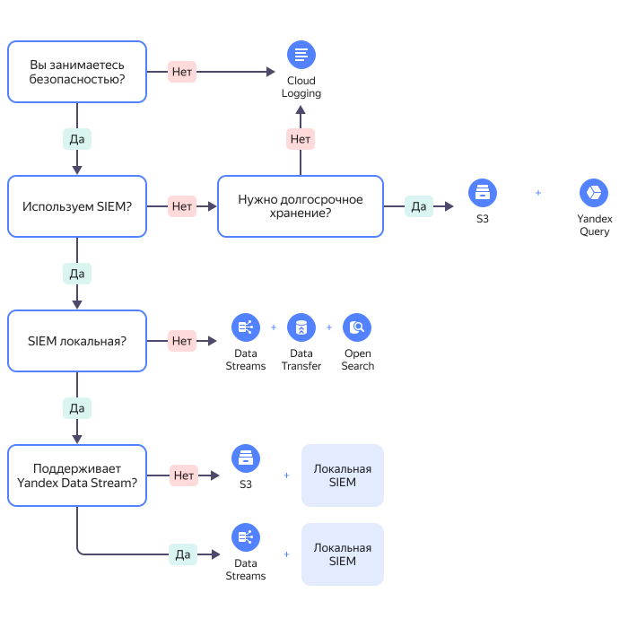

# Экспорт аудитных логов в SIEM

Файлы аудитного лога доступны для экспорта в SIEM.

Команда {{ yandex-cloud }} подготовила комплект решений для экспорта аудитных логов для нескольких SIEM. Файлы решений приведены в соответствующих разделах [репозитория {{ yandex-cloud }} Security Solution Library](https://github.com/yandex-cloud-examples/yc-security-solutions-library).

[{{ yandex-cloud }} Security Solution Library](/solutions/security-solution-library) — это набор примеров и рекомендаций по построению безопасной инфраструктуры в {{ yandex-cloud }}, собранных в публичном репозитории на GitHub.

<small>Схема принятия решения по выбору архитектуры</small>

В настоящее время подготовлены решения для следующих SIEM:
* [{{ mos-full-name }}](../tutorials/trails-logs-opensearch.md).
* [ArcSight](../tutorials/export-logs-to-arcsight.md).
* [Splunk](../tutorials/export-logs-to-splunk.md).
* [MaxPatrol SIEM](../tutorials/maxpatrol.md).

Все решения обеспечивают непрерывную доставку файлов аудитных логов из бакетов в SIEM, а также содержат правила корреляции, дашборды и запросы для поиска важных событий безопасности. Команда {{ yandex-cloud }} поддерживает и регулярно обновляет все решения.
