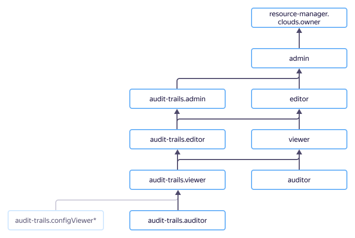

# Управление доступом {{ at-name }}

В этом разделе вы узнаете:

* [на какие ресурсы можно назначить роль](#resources);
* [какие роли действуют в сервисе](#roles-list).



Назначать роли на ресурс могут пользователи, у которых на этот ресурс есть роль `audit-trails.admin` или одна из следующих ролей:



## На какие ресурсы можно назначить роль {#resources}



На [трейл](../concepts/trail.md) роль можно назначить через YC CLI или API {{ yandex-cloud }}.

## Какие роли действуют в сервисе {#roles-list}



<small>\* deprecated</small>

### Сервисные роли {#service-roles}

#### audit-trails.auditor {#at-auditor}



#### audit-trails.viewer {#at-viewer}



#### audit-trails.editor {#at-editor}



#### audit-trails.admin {#at-admin}



#### audit-trails.configViewer {#at-configviewer}



### Примитивные роли {#primitive-roles}





## Какие роли мне необходимы {#choosing-roles}

В таблице сопоставлены действия и минимальные необходимые для их выполнения роли. Вы всегда можете назначить роль, которая дает более широкие права, чем указанная в таблице. Например, вместо `audit-trails.configViewer` можно выдать роль `audit-trails.editor`.

Действие | Роль
----- | -----
Просмотр информации о трейле | `audit-trails.auditor` 
Сбор и просмотр аудитных событий в трейле | `audit-trails.viewer` 
Создание трейла | `audit-trails.editor` 
Редактирование трейла | `audit-trails.editor` 
Удаление трейла | `audit-trails.editor` 
Управление ролями других пользователей на трейл | `audit-trails.admin`

## Что дальше {#whats-next}

* Ознакомьтесь со структурой [аудитного лога](../concepts/format.md).
* Ознакомьтесь с примером [загрузки аудитных логов в {{ cloud-logging-name }}](../operations/export-cloud-logging.md).
