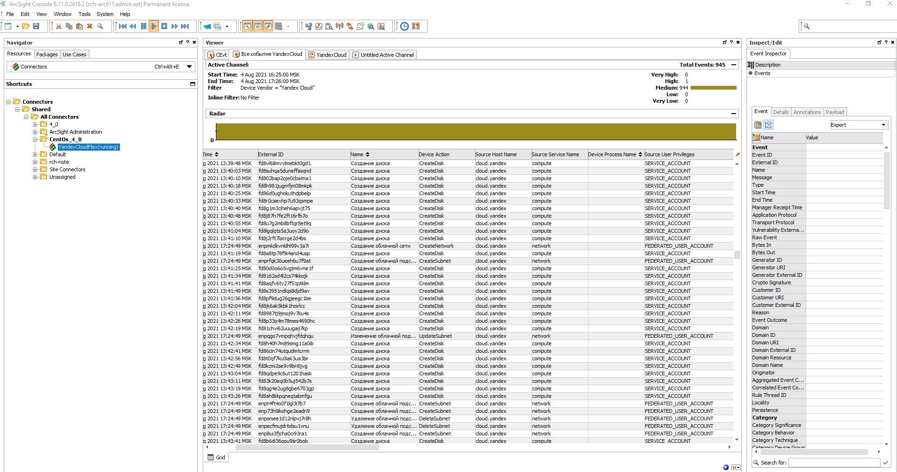

# Загрузка аудитных логов в SIEM ArcSight

Создайте трейл, который будет загружать аудитные логи ресурсов отдельного каталога в бакет {{ objstorage-full-name }} с включенным шифрованием. Затем настройте непрерывную доставку логов в SIEM ArcSight.

Для успешного прохождения руководства у вас должен быть установлен экземпляр ArcSight.

Решение, которое описано в руководстве, работает по следующей схеме:
1. [Трейл](../concepts/trail.md) загружает логи в бакет {{ objstorage-name }}.
1. [Бакет](../../storage/concepts/bucket.md) монтируется через [FUSE](https://ru.wikipedia.org/wiki/FUSE_(модуль_ядра))-интерфейс к папке на промежуточной ВМ.
1. [SmartConnector](https://www.microfocus.com/documentation/arcsight/arcsight-smartconnectors/AS_SmartConn_getstart_HTML/) забирает логи из папки и передает их в ArcSight для анализа.

Подробнее о сценариях загрузки аудитных логов в ArcSight смотрите в [{{ yandex-cloud }} Security Solution Library](https://github.com/yandex-cloud/yc-solution-library-for-security/tree/master/auditlogs/export-auditlogs-to-ArcSight#two-log-shipping-scenarios).



Чтобы настроить доставку файлов аудитных логов в ArcSight:

1. [Подготовьте облако к работе.](#before-begin)
1. [Подготовьте окружение.](#prepare-environment)
1. [Назначьте роли сервисным аккаунтам.](#add-roles)
1. [Создайте трейл.](#create-trail)
1. [Смонтируйте бакет.](#mount-bucket)
1. [Подключите ArcSight SmartConnector.](#configure-arcsight)

Если созданные ресурсы вам больше не нужны, [удалите их](#clear-out).

## Перед началом работы {#before-begin}







### Необходимые платные ресурсы {#paid-resources}

В стоимость поддержки инфраструктуры входит:

* использование виртуальных машин (см. [тарифы {{ compute-short-name }}](../../compute/pricing));
* плата за хранение данных в бакете (см. [тарифы {{ objstorage-name }}](../../storage/pricing#prices-storage));
* плата за операции с данными (см. [тарифы {{ objstorage-name }}](../../storage/pricing#prices-operations));
* плата за использование ключей {{ kms-short-name }} (см. [тарифы {{ kms-name }}](../../kms/pricing#prices)).

## Подготовьте окружение {#prepare-environment}

### Подготовьте промежуточную ВМ {#setup-vm}

Вы можете использовать готовую ВМ, у которой есть доступ к экземпляру ArcSight, или создать новую:

1. [Создайте ВМ](../../compute/operations/vm-create/create-linux-vm.md) из образа Linux с операционной системой Ubuntu 20.04.
1. [Подключитесь к ВМ](../../compute/operations/vm-connect/ssh.md#vm-connect) по SSH.

### Создайте бакет для аудитных логов {#create-backet}



- Консоль управления

  1. В [консоли управления]({{ link-console-main }}) перейдите в каталог, в котором хотите создать бакет, например, `example-folder`.
  1. Выберите сервис **{{ objstorage-name }}**.
  1. Нажмите **Создать бакет**.
  1. На странице создания бакета:
      1. Введите имя бакета в соответствии с [правилами именования](../../storage/concepts/bucket.md#naming), например, `arcsight-bucket`.
      1. При необходимости ограничьте максимальный размер бакета.

         

      1. Выберите тип [доступа](../../storage/concepts/bucket.md#bucket-access) `Ограниченный`.
      1. Выберите [класс хранилища](../../storage/concepts/storage-class.md) по умолчанию.
      1. Нажмите **Создать бакет**.



### Создайте ключ шифрования в сервисе {{ kms-name }} {#create-key}



- Консоль управления

  1. В [консоли управления]({{ link-console-main }}) перейдите в каталог `example-folder`.
  1. Выберите сервис **{{ kms-name }}**.
  1. Нажмите **Создать** и укажите:
     * **Имя** — `arcsight-kms`.
     * **Алгоритм шифрования** — `AES-256`.
     * Для остальных параметров оставьте значения по умолчанию.
  1. Нажмите **Создать**.



### Включите шифрование бакета {#backet-encoding}



- Консоль управления

  1. В [консоли управления]({{ link-console-main }}) перейдите в бакет `arcsight-bucket`.
  1. На панели слева выберите **Шифрование**.
  1. В поле **Ключ {{ kms-short-name }}** выберите ключ `arcsight-kms`.
  1. Нажмите **Сохранить**.



### Создайте сервисные аккаунты {#create-sa}

Необходимо создать два аккаунта — отдельно для трейла и бакета.

Создайте сервисный аккаунт `sa-arcsight`:



- Консоль управления

  1. В [консоли управления]({{link-console-main}}) перейдите в каталог `example-folder`.
  1. Перейдите на вкладку **Сервисные аккаунты**.
  1. Нажмите **Создать сервисный аккаунт**.
  1. Введите имя сервисного аккаунта в соответствии с [правилами именования](../../_includes/name-format.md), например, `sa-arcsight`.
  1. Нажмите **Создать**.
  


Аналогично создайте сервисный аккаунт с именем `sa-arcsight-bucket`.

### Создайте статический ключ {#create-access-key}

Идентификатор ключа и секретный ключ понадобятся вам на этапе монтирования бакета.



- Консоль управления

  1. В [консоли управления]({{ link-console-main }}) перейдите в каталог `example-folder`.
  1. Перейдите на вкладку **Сервисные аккаунты**.
  1. Выберите сервисный аккаунт `sa-arcsight-bucket` и нажмите на строку с его именем.
  1. Нажмите **Создать новый ключ** на верхней панели.
  1. Выберите **Создать статический ключ доступа**.
  1. Задайте описание ключа и нажмите **Создать**.
  1. Сохраните идентификатор и секретный ключ.

      

      После закрытия диалога значение ключа будет недоступно.

      

- CLI

  1. Создайте ключ доступа для сервисного аккаунта `sa-arcsight-bucket`:

      ```bash
      yc iam access-key create --service-account-name sa-arcsight-bucket
      ```

      Результат:

      ```
      access_key:
        id: aje*******k2u
        service_account_id: aje*******usm
        created_at: "2022-09-22T14:37:51Z"
        key_id: 0n8*******0YQ
      secret: JyT*******zMP1
      ```

  1. Сохраните идентификатор `key_id` и секретный ключ `secret`. Получить значение ключа снова будет невозможно.



## Назначьте роли сервисным аккаунтам {#add-roles}

Назначьте сервисному аккаунту `sa-arcsight` роли `audit-trails.viewer`, `storage.uploader` и `kms.keys.encrypterDecrypter`:



- CLI 

  1. [Роль](../../audit-trails/security/#roles) `audit-trails.viewer` на каталог:
     
      ```
      yc resource-manager folder add-access-binding \
      --role audit-trails.viewer \
      --id <идентификатор_каталога_example-folder> \
      --service-account-id <идентификатор_сервисного_аккаунта_sa-arcsight>
      ```
      
      Где:
  
      * `role` — назначаемая роль;
      * `id` — идентификатор каталога `example-folder`;
      * `service-account-id` — идентификатор сервисного аккаунта `sa-arcsight`.

      Подробнее о команде `yc resource-manager folder add-access-binding` см. в [справочнике CLI](../../cli/cli-ref/managed-services/resource-manager/folder/add-access-binding.md).
  
  1. [Роль](../../storage/security/#storage-uploader) `storage.uploader` на каталог с бакетом:
     
      ```
      yc resource-manager folder add-access-binding \
      --role storage.uploader \
      --id <идентификатор_каталога_example-folder> \
      --service-account-id <идентификатор_сервисного_аккаунта_sa-arcsight>
      ```
  
      Где:
  
      * `role` — назначаемая роль;
      * `id` — идентификатор каталога `example-folder`;
      * `service-account-id` — идентификатор сервисного аккаунта `sa-arcsight`.

  1. [Роль](../../kms/security/#service) `kms.keys.encrypterDecrypter` на ключ шифрования `arcsight-kms`:
  
      ```
      yc kms symmetric-key add-access-binding \
      --role kms.keys.encrypterDecrypter \
      --id <идентификатор_KMS_ключа_arcsight-kms> \
      --service-account-id <идентификатор_сервисного_аккаунта_sa-arcsight>
      ```
  
      Где:
  
      * `role` — назначаемая роль;
      * `id` — идентификатор {{ kms-short-name }}-ключа `arcsight-kms`;
      * `service-account-id` — идентификатор сервисного аккаунта `sa-arcsight`.



Назначьте сервисному аккаунту `sa-arcsight-bucket` роли `storage.viewer` и `kms.keys.encrypterDecrypter`:



- CLI

  1. Роль `storage.viewer` на каталог:
     
      ```
      yc resource-manager folder add-access-binding \
      --id <идентификатор_каталога_example-folder> \
      --role storage.viewer \
      --service-account-id <идентификатор_сервисного_аккаунта_sa-arcsight-bucket>  
      ```

      Где:
  
      * `role` — назначаемая роль;
      * `id` — идентификатор каталога `example-folder`;
      * `service-account-id` — идентификатор сервисного аккаунта `sa-arcsight-bucket`.
  
  1. Роль `kms.keys.encrypterDecrypter` на ключ шифрования `arcsight-kms`:
  
      ```
      yc kms symmetric-key add-access-binding \
      --role kms.keys.encrypterDecrypter \
      --id <идентификатор_ключа_arcsight-kms> \
      --service-account-id <идентификатор_сервисного_аккаунта_sa-arcsight-bucket>
      ```
  
      Где:
  
      * `role` — назначаемая роль;
      * `id` — идентификатор {{ kms-short-name }}-ключа `arcsight-kms`;
      * `service-account-id` — идентификатор сервисного аккаунта `sa-arcsight-bucket`.
  


## Создайте трейл {#create-trail}



- Консоль управления

  1. В [консоли управления]({{ link-console-main }}) перейдите в каталог `example-folder`.
  2. Выберите сервис **{{ at-name }}**.
  3. Нажмите **Создать трейл** и укажите:

     * **Имя** — имя создаваемого трейла, например, `arcsight-trail`.
     * **Описание** — описание трейла, необязательный параметр.

  4. В блоке **Фильтр** задайте параметры области сбора аудитных логов:

     * **Ресурс** — выберите `Каталог`.
     * **Каталог** — не требует заполнения, содержит имя текущего каталога.

  5. В блоке **Назначение** задайте параметры объекта назначения:

     * **Назначение** — `{{ objstorage-name }}`.
     * **Бакет** — `arcsight-bucket`.
     * **Префикс объекта** — необязательный параметр, участвует в [полном имени](../../audit-trails/concepts/format#log-file-name) файла аудитного лога.
  
     
  
     Используйте [префикс](../../storage/concepts/object#key), если вы храните аудитные логи и сторонние данные в одном и том же бакете. Не используйте одинаковый префикс для логов и других объектов в бакете, так как в этом случае логи и сторонние объекты могут перезаписать друг друга.
  
     
  
  6. В блоке **Сервисный аккаунт** выберите `sa-arcsight`.
  7. Нажмите **Создать**.

  
  
  Решение будет удалять логи из бакета после экспорта в ArcSight. Если вам нужно хранить логи в бакете, создайте отдельные бакет и трейл.
  
  



## Смонтируйте бакет {#mount-bucket}

Бакет монтируется на промежуточной ВМ, на нее же устанавливается ArcSight SmartConnector.
Чтобы смонтировать бакет, создайте файл со статическим ключом доступа сервисного аккаунта `sa-arcsight-bucket`.

1. На промежуточной ВМ создайте файл со статическим ключом доступа:

   ```bash
   echo <идентифекатор_ключа_доступа>:<секретный_ключ_доступа> > ${HOME}/.passwd-s3fs
   chmod 600 ${HOME}/.passwd-s3fs
   ```

1. Установите [s3fs](https://github.com/s3fs-fuse/s3fs-fuse):

   ```bash
   sudo apt install s3fs
   ```

1. Создайте директорию, к которой будет монтироваться бакет, например, `mybucket` в домашней директории:

   ```bash
   sudo mkdir ${HOME}/mybucket
   ```

1. Смонтируйте бакет:

   ```bash
   s3fs arcsight-bucket ${HOME}/mybucket -o passwd_file=${HOME}/.passwd-s3fs -o url=https://storage.yandexcloud.net -o use_path_request_style
   ```

1. Проверьте, что бакет смонтирован:

   ```bash
   ls ${HOME}/mybucket
   ```

## Установите и настройте ArcSight SmartConnector {#configure-arcsight}



Для выполнения этого этапа руководства вам нужен дистрибутив ArcSight SmartConnector и доступ к экземпляру ArcSight.



1. На промежуточной ВМ [установите](https://www.microfocus.com/documentation/arcsight/arcsight-smartconnectors/AS_smartconn_install/) `ArcSight SmartConnector`:
    1. При установке выберите **ArcSight FlexConnector JSON Folder Follower** и укажите путь к папке `mybucket`.
    1. Укажите **JSON configuration filename prefix**: `yc`.
1. [Скачайте](https://github.com/yandex-cloud/yc-solution-library-for-security/tree/master/auditlogs/export-auditlogs-to-ArcSight/arcsight_content) файлы `arcsight_content`.
1. Скопируйте файл `yc.jsonparser.properties` из папки `flex` в папку с адресом `<папка_установки_агента>/current/user/agent/flexagent`.
1. Скопируйте файл `map.0.properties` из папки `flex` в папку с адресом `<папка_установки_агента>/current/user/agent/map`.
1. Отредактируйте файл `<папка_установки_агента>/current/user/agent/agent.properties`:

    ```bash
    agents[0].mode=DeleteFile
    agents[0].proccessfoldersrecursively=true
    ```

1. Запустите коннектор и убедитесь, что события поступают в ArcSight:

   

## Как удалить созданные ресурсы {#clear-out}

1. [Удалите](../../storage/operations/buckets/delete) бакет {{ objstorage-name }}.
1. [Удалите](../../kms/operations/key#delete) ключ {{ kms-name }}.
1. [Удалите](../../compute/operations/vm-control/vm-delete.md) промежуточную ВМ, если вы создали ее в {{ compute-short-name }}.
