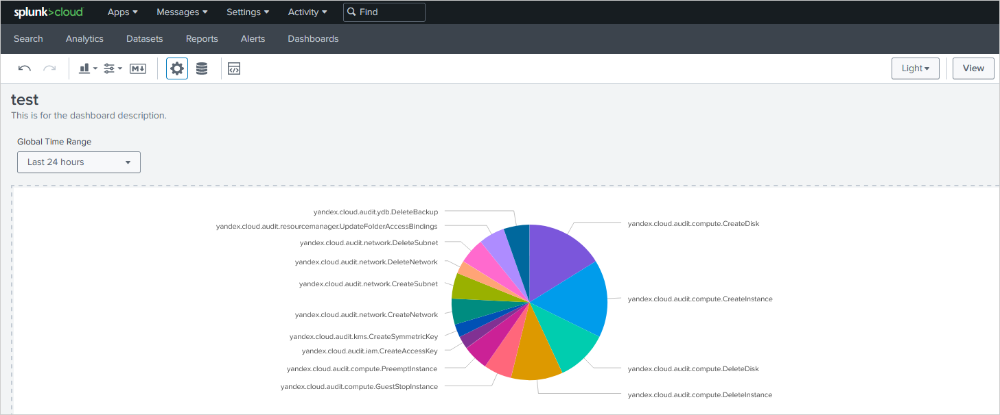

# Загрузка аудитных логов в SIEM Splunk

Создайте трейл, который будет загружать аудитные логи уровня конфигурации (Control Plane) ресурсов отдельного каталога в бакет {{ objstorage-full-name }} с включенным шифрованием. Затем настройте непрерывную доставку логов в SIEM Splunk.

Решение, которое описано в руководстве, работает по следующей схеме:
1. [Трейл](../concepts/trail.md) загружает логи в бакет {{ objstorage-name }}.
1. Бакет смонтирован как часть [файловой системы](https://ru.wikipedia.org/wiki/FUSE_(%D0%BC%D0%BE%D0%B4%D1%83%D0%BB%D1%8C_%D1%8F%D0%B4%D1%80%D0%B0)) в промежуточной [ВМ](../../glossary/vm.md).
1. На промежуточной ВМ работает скрипт, который по расписанию забирает логи из бакета и отправляет их в Splunk.

Чтобы настроить доставку файлов аудитных логов из бакета в Splunk:

1. [Подготовьте облако к работе](#before-begin).
1. [Подготовьте окружение](#prepare-environment).
1. [Назначьте роли сервисному аккаунту](#add-roles).
1. [Создайте трейл](#create-trail).
1. [Подготовьте Splunk к импорту](#prepare-splunk).
1. [Включите NAT в интернет для подсети с промежуточной ВМ](#enable-nat).
1. [Создайте промежуточную ВМ](#create-vm).
1. [Визуализируйте данные в Splunk](#splunk-visualization).

Часть шагов выполняется в {{ TF }}.

Если созданные ресурсы вам больше не нужны, [удалите их](#clear-out).

## Перед началом работы {#before-begin}







Для успешного прохождения руководства у вас должен быть экземпляр Splunk, доступный для промежуточной ВМ по порту `8080`.

### Необходимые платные ресурсы {#paid-resources}

В стоимость поддержки инфраструктуры входит:

* использование виртуальных машин (см. [тарифы {{ compute-short-name }}](../../compute/pricing.md));
* плата за хранение данных в бакете (см. [тарифы {{ objstorage-name }}](../../storage/pricing.md#prices-storage));
* плата за операции с данными (см. [тарифы {{ objstorage-name }}](../../storage/pricing.md#prices-operations));
* плата за использование ключей KMS (см. [тарифы {{ kms-name }}](../../kms/pricing.md#prices)).

## Подготовьте окружение {#prepare-environment}

### Создайте новый бакет для загрузки в него аудитных логов {#create-backet}



- Консоль управления {#console}

  1. В [консоли управления]({{ link-console-main }}) перейдите в каталог, в котором хотите создать [бакет](../../storage/concepts/bucket.md).
  1. Выберите сервис **{{ ui-key.yacloud.iam.folder.dashboard.label_storage }}**.
  1. Нажмите кнопку **{{ ui-key.yacloud.storage.buckets.button_empty-create }}**.
  1. На странице создания бакета:
      1. Введите имя бакета в соответствии с [правилами именования](../../storage/concepts/bucket.md#naming).

         По умолчанию бакет с точкой в имени доступен только по протоколу HTTP. Чтобы поддержать для бакета протокол HTTPS, [загрузите собственный сертификат безопасности](../../storage/operations/hosting/certificate.md) в {{ objstorage-name }}.

      1. При необходимости ограничьте максимальный размер бакета.

         

      1. В полях **{{ ui-key.yacloud.storage.bucket.settings.field_access-read }}**, **{{ ui-key.yacloud.storage.bucket.settings.field_access-list }}** и **{{ ui-key.yacloud.storage.bucket.settings.field_access-config-read }}** выберите `{{ ui-key.yacloud.storage.bucket.settings.access_value_private }}`.
      1. Выберите [класс хранилища](../../storage/concepts/storage-class.md) по умолчанию.
      1. Нажмите кнопку **{{ ui-key.yacloud.storage.buckets.create.button_create }}** для завершения операции.



### Создайте ключ шифрования в сервисе {{ kms-name }} {#create-key}



- Консоль управления {#console}

  1. В [консоли управления]({{ link-console-main }}) перейдите в каталог с бакетом.
  1. Выберите сервис **{{ ui-key.yacloud.iam.folder.dashboard.label_kms }}**.
  1. Нажмите кнопку **{{ ui-key.yacloud.kms.symmetric-keys.button_empty-create }}** и задайте атрибуты ключа:

     * Имя и опциональное описание в свободной форме.
     * Алгоритм шифрования, например AES-256.
     * Период [ротации](../../kms/concepts/index.md#rotation) (частота смены версии ключа по умолчанию).
     * Нажмите кнопку **{{ ui-key.yacloud.common.create }}**.

  Вместе с ключом создается его первая версия: нажмите на ключ в списке, чтобы открыть страницу с его атрибутами.



### Включите шифрование бакета {#backet-encoding}



- Консоль управления {#console}

  1. В [консоли управления]({{ link-console-main }}) перейдите в бакет, для которого хотите настроить шифрование.
  1. На панели слева выберите **{{ ui-key.yacloud.storage.bucket.switch_encryption }}**.
  1. В поле **{{ ui-key.yacloud.storage.bucket.encryption.field_key }}** выберите ключ или создайте новый:

     

  1. Нажмите кнопку **{{ ui-key.yacloud.storage.bucket.encryption.button_save }}**.



### Создайте сервисный аккаунт {#create-sa}



- Консоль управления {#console}

  1. В [консоли управления]({{ link-console-main }}) перейдите в каталог, в котором вы хотите создать сервисный аккаунт.
  1. В верхней части экрана перейдите на вкладку **{{ ui-key.yacloud.iam.folder.switch_service-accounts }}**.
  1. Нажмите кнопку **{{ ui-key.yacloud.iam.folder.service-accounts.button_add }}**.
  1. Введите имя сервисного аккаунта. Требования к имени:

      

  1. Нажмите кнопку **{{ ui-key.yacloud.iam.folder.service-account.popup-robot_button_add }}**.



## Назначьте роли сервисному аккаунту {#add-roles}



- CLI {#cli}

  1. Назначьте роль [audit-trails.viewer](../../audit-trails/security/#roles) на каталог, с ресурсов которого будут собираться аудитные логи:
     
      ```
      yc resource-manager folder add-access-binding \
      --role audit-trails.viewer \
      --id <идентификатор_каталога> \
      --service-account-id <идентификатор_сервисного_аккаунта>
      ```
  
      Где:
  
      * `--role` — назначаемая роль.
      * `--id` — идентификатор каталога, с которого будут собираться аудитные логи.
      * `--service-account-id` — идентификатор сервисного аккаунта.
  
  1. Назначьте роль [storage.uploader](../../storage/security/#storage-uploader) на каталог, в котором будет находиться трейл:
     
      ```
      yc resource-manager folder add-access-binding \
      --role storage.uploader \
      --id <идентификатор_каталога> \
      --service-account-id <идентификатор_сервисного_аккаунта>
      ```
  
      Где:
  
      * `--role` — назначаемая роль.
      * `--id` — идентификатор каталога, в котором будет находиться трейл.
      * `--service-account-id` — идентификатор сервисного аккаунта.
  
  1. Назначьте роль [kms.keys.encrypterDecrypter](../../kms/security/#service) на ключ шифрования:
  
      ```
      yc kms symmetric-key add-access-binding \
      --role kms.keys.encrypterDecrypter \
      --id <идентификатор_KMS-ключа> \
      --service-account-id <идентификатор_сервисного_аккаунта>
      ```
  
      Где:
  
      * `--role` — назначаемая роль.
      * `--id` — идентификатор KMS-ключа.
      * `--service-account-id` — идентификатор сервисного аккаунта.
  


## Создайте трейл {#create-trail}

Чтобы создать трейл, убедитесь, что у вас есть роли:

   * `iam.serviceAccounts.user` на сервисный аккаунт;
   * `audit-trails.editor` на каталог, где будет находиться трейл;
   * `audit-trails.viewer` на каталог, с которого будут собираться аудитные логи;
   * `storage.viewer` на бакет или каталог.



- Консоль управления {#console}

  1. В [консоли управления]({{ link-console-main }}) перейдите в каталог, в котором вы хотите создать трейл.
  1. Выберите сервис **{{ ui-key.yacloud.iam.folder.dashboard.label_audit-trails }}**.
  1. Нажмите кнопку **{{ ui-key.yacloud.audit-trails.button_create-trail }}** и укажите:

     * **{{ ui-key.yacloud.common.name }}** — имя создаваемого трейла.
     * **{{ ui-key.yacloud.common.description }}** — описание трейла, необязательный параметр.

  1. В блоке **{{ ui-key.yacloud.audit-trails.label_destination }}** задайте параметры объекта назначения:

     * **{{ ui-key.yacloud.audit-trails.label_destination }}** — `{{ ui-key.yacloud.audit-trails.label_objectStorage }}`.
     * **{{ ui-key.yacloud.audit-trails.label_bucket }}** — имя [бакета](../../storage/operations/buckets/create.md), в который будут загружаться аудитные логи.
     * **{{ ui-key.yacloud.audit-trails.label_object-prefix }}** — необязательный параметр, участвует в [полном имени](../../audit-trails/concepts/format.md#log-file-name) файла аудитного лога.
  
     

      * **{{ ui-key.yacloud.audit-trails.title_kms-key }}** — укажите ключ шифрования, которым [зашифрован](../../storage/concepts/encryption.md) бакет.
  
  1. В блоке **{{ ui-key.yacloud.audit-trails.label_service-account }}** выберите сервисный аккаунт, от имени которого трейл будет загружать файлы аудитного лога в бакет.

  1. В блоке **{{ ui-key.yacloud.audit-trails.label_path-filter-section }}** задайте параметры сбора аудитных логов уровня конфигурации:

     * **{{ ui-key.yacloud.audit-trails.label_collecting-logs }}** — выберите `{{ ui-key.yacloud.common.enabled }}`.
     * **{{ ui-key.yacloud.audit-trails.label_resource-type }}** — выберите `{{ ui-key.yacloud.audit-trails.label_resource-manager.folder }}`.
     * **{{ ui-key.yacloud.audit-trails.label_resource-manager.folder }}** — не требует заполнения, содержит имя текущего каталога.

  1. В блоке **{{ ui-key.yacloud.audit-trails.label_event-filter-section }}** в поле **{{ ui-key.yacloud.audit-trails.label_collecting-logs }}** выберите `{{ ui-key.yacloud.common.disabled }}`.

  1. Нажмите кнопку **{{ ui-key.yacloud.common.create }}**.

  
  
  Решение будет удалять логи из бакета после экспорта в Splunk. Если вам нужно хранить логи в бакете, создайте отдельные бакет и трейл.
  
  



## Подготовьте Splunk к импорту {#prepare-splunk}

Включите `HTTPEventCollector` и получите токен `Event Collector` по [инструкции](https://docs.splunk.com/Documentation/SplunkCloud/8.2.2105/Data/UsetheHTTPEventCollector#Configure_HTTP_Event_Collector_on_Splunk_Cloud_Platform).

## Настройте NAT-шлюз для подсети с промежуточной ВМ {#enable-nat}



- Консоль управления {#console}

  1. Создайте NAT-шлюз:
      1. В [консоли управления]({{ link-console-main }}) перейдите в каталог с подсетью для промежуточной ВМ.
      1. В списке сервисов выберите **{{ ui-key.yacloud.iam.folder.dashboard.label_vpc }}**.
      1. На панели слева выберите **{{ ui-key.yacloud.vpc.switch_gateways }}**.
      1. Нажмите кнопку **{{ ui-key.yacloud.common.create }}**.
      1. Задайте имя шлюза. Требования к имени:

          
   
      1. По умолчанию выбран тип шлюза `{{ ui-key.yacloud.vpc.gateways.value_gateway-type-egress-nat }}`.
      1. Нажмите кнопку **{{ ui-key.yacloud.common.save }}**.
  1. Создайте таблицу маршрутизации:
      1. На панели слева выберите  **{{ ui-key.yacloud.vpc.network.switch_route-table }}**.
      1. Нажмите кнопку **{{ ui-key.yacloud.common.create }}**, чтобы [создать](../../vpc/operations/static-route-create.md) новую таблицу или выберите одну из существующих.
      1. Нажмите кнопку **{{ ui-key.yacloud.vpc.route-table-form.label_add-static-route }}**.
      1. В открывшемся окне в поле **{{ ui-key.yacloud.vpc.add-static-route.field_next-hop-address }}** выберите `{{ ui-key.yacloud.vpc.add-static-route.value_gateway }}`.
      1. В поле **{{ ui-key.yacloud.vpc.add-static-route.value_gateway }}** выберите созданный NAT-шлюз. Префикс назначения заполнится автоматически.
      1. Нажмите кнопку **{{ ui-key.yacloud.vpc.add-static-route.button_add }}**.
      1. Нажмите кнопку **{{ ui-key.yacloud.vpc.route-table.edit.button_edit }}**. 
  1. Привяжите таблицу маршрутизации к подсети, в которой будет развернута промежуточная ВМ, чтобы направить трафик из нее через NAT-шлюз:
      1. На панели слева выберите  **{{ ui-key.yacloud.vpc.switch_networks }}**.
      1. В строке нужной подсети нажмите кнопку .
      1. В открывшемся меню выберите пункт **{{ ui-key.yacloud.vpc.subnetworks.button_action-add-route-table }}**.
      1. В открывшемся окне выберите созданную таблицу в списке.
      1. Нажмите кнопку **{{ ui-key.yacloud.vpc.subnet.add-route-table.button_add }}**.



## Создайте ВМ для непрерывной доставки логов в Splunk {#create-vm}



- {{ TF }} {#tf}

  1. 
  1. Склонируйте [репозиторий](https://github.com/yandex-cloud-examples/yc-export-auditlogs-to-splunk) из [{{ yandex-cloud }} Security Solution Library](https://github.com/yandex-cloud-examples/yc-security-solutions-library):
  
     ```
     git clone https://github.com/yandex-cloud-examples/yc-export-auditlogs-to-splunk.git
     ```
  
  1. Создайте подкаталог в каталоге `/yc-export-auditlogs-to-splunk/terraform/` и перейдите в него.
  1. Создайте конфигурационный файл с вызовом модуля `yc-splunk-trail`:
  
     ```
     module "yc-splunk-trail" {
        source = "../modules/yc-splunk-trail/"
        folder_id = <идентификатор_каталога>
        splunk_token = <токен_Event_Collector>
        splunk_server = <адрес_вашего_сервера_Splunk>:8088 
        bucket_name = <имя_бакета>
        bucket_folder = <имя_корневой_папки_в_бакете>
        sa_id = <идентификатор_сервисного_аккаунта>
        coi_subnet_id = <идентификатор_подсети>
     }
     ```
     Где:
  
     * `folder_id` — идентификатор каталога.
     * `splunk_token` — токен Event Collector, полученный в Splunk.
     * `splunk_server` — адрес вашего сервера Splunk в формате `https://<имя_или_адрес_хоста>`.
     * `bucket_name` — имя бакета.
     * `bucket_folder` — имя корневой папки в бакете.
     * `sa_id` — идентификатор сервисного аккаунта.
     * `coi_subnet_id` — идентификатор подсети с настроенным NAT-шлюзом.
  
  1. Проверьте корректность конфигурационных файлов:
  
     ```
     terraform plan
     ```
  
     Если конфигурация описана верно, в терминале отобразится список создаваемых ресурсов и их параметров. Если в конфигурации есть ошибки, {{ TF }} на них укажет.
  
  1. Разверните облачные ресурсы.
     1. Если в конфигурации нет ошибок, выполните команду:
  
        ```
        terraform apply
        ```
  
     1. Подтвердите создание ресурсов: в терминале введите `yes` и нажмите **Enter**.



## Визуализируйте данные в Splunk {#splunk-visualization}

1. Перейдите в Splunk и выполните поиск событий, созданных сервисным аккаунтом:

   ```
   index="main" authentication.subject_type="SERVICE_ACCOUNT" | stats count by event_type
   ```

1. Для визуализации результатов, перейдите на вкладку **Visualization** и выберите удобный формат (`LineChart`, `PieChart` и т. д.):

   Пример визуализации данных:

   

## Как удалить созданные ресурсы {#clear-out}

Некоторые ресурсы платные. Чтобы за них не списывалась плата, удалите ресурсы, которые вы больше не будете использовать:

1. Чтобы удалить ресурсы, созданные с помощью {{ TF }}:

   1. Выполните команду:
      ```
      terraform destroy
      ```

      

      {{ TF }} удалит все ресурсы, созданные в текущей конфигурации: сети, подсети, виртуальные машины и т. д.

      


      После выполнения команды в терминал будет выведен список удаляемых ресурсов.

   1. Для подтверждения удаления введите `yes` и нажмите **Enter**.

1. [Удалите](../../storage/operations/buckets/delete.md) бакет {{ objstorage-name }}.

1. [Удалите](../../kms/operations/key.md#delete) ключ {{ kms-name }}.
