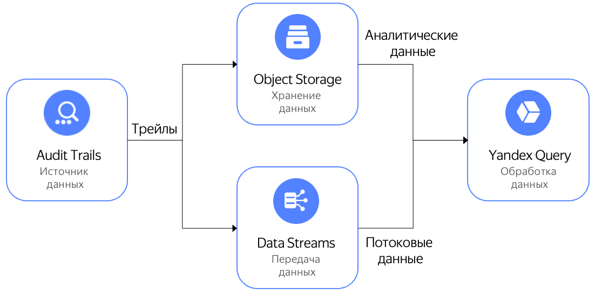

# Поиск событий {{ yandex-cloud }} в {{ yq-full-name }}

В [{{ yq-full-name }}](../../query/index.yaml) интегрирована поддержка {{ at-name }}. Вы можете анализировать события ресурсов {{ yandex-cloud }}, выполняя [аналитические](../../query/concepts/batch-processing.md) и [потоковые](../../query/concepts/stream-processing.md) запросы на языке {{ yql-short-name }}.

Аналитические запросы можно выполнять для логов, которые хранятся [в бакете](../operations/export-organization-bucket.md), а потоковые — для логов [в потоке данных](../operations/export-organization-bucket.md) {{ yds-full-name }}.



Чтобы подключить бакет с [аудитными логами](../concepts/events.md) к {{ yq-full-name }} и выполнить запросы на языке [{{ yql-short-name }}](../../query/yql-tutorials/index.md):

1. [Подготовьте окружение.](#prepare-environment)
1. [Создайте соединение между трейлом и {{ yq-short-name }}.](#trail-yq)
1. [Выполните запрос к логам в {{ objstorage-name }}.](#perform-request)

Если созданные ресурсы вам больше не нужны, [удалите их](#clear-out).


## Перед началом работы {#before-begin}








## Необходимые платные ресурсы {#paid-resources}

В стоимость поддержки инфраструктуры входит плата за использование бакета (см. [тарифы {{ objstorage-name }}](../../storage/pricing.md)).




## Подготовьте окружение {#prepare-environment}


### Создайте бакет для аудитных логов {#create-backet}



- Консоль управления

    1. В [консоли управления]({{ link-console-main }}) перейдите в каталог, в котором хотите создать [бакет](../../storage/concepts/bucket.md), например `example-folder`.
    1. Выберите сервис **{{ objstorage-name }}**.
    1. Нажмите **Создать бакет**.
    1. На странице создания бакета:
        * укажите **Имя** — `bucket-yq`;
        * для остальных параметров оставьте значения по умолчанию.
    1. Нажмите **Создать бакет**.




### Создайте сервисные аккаунты {#create-sa}

Создайте сервисный аккаунт `trail-sa`:



- Консоль управления

    1. В [консоли управления]({{link-console-main}}) перейдите в каталог `example-folder`.
    1. Перейдите на вкладку **Сервисные аккаунты**.
    1. Нажмите **Создать сервисный аккаунт**.
    1. Укажите **Имя** — `trail-sa`.
    1. Нажмите кнопку **Создать**.



Аналогично создайте сервисный аккаунт с именем `bucket-yq-sa`.


### Назначьте права сервисным аккаунтам {#grant-roles}

Назначьте сервисному аккаунту `trail-sa` роли `audit-trails.viewer` и `storage.uploader`:



- CLI
  
    1. Роль `audit-trails.viewer` на организацию:

        ```bash
        yc organization-manager organization add-access-binding \
        --role audit-trails.viewer \
        --id <идентификатор_организации> \
        --service-account-id <идентификатор_сервисного_аккаунта_trail-sa>
        ```

        Результат:

        ```text
        done (1s)
        ```

        Подробнее о команде `yc organization-manager organization add-access-binding` см. в [справочнике CLI](../../cli/cli-ref/managed-services/organization-manager/organization/add-access-binding.md).

    1. Роль `storage.uploader` на каталог `example-folder`:

        ```bash
        yc resource-manager folder add-access-binding example-folder \
            --role storage.uploader \
            --subject serviceAccount:<идентификатор_сервисного_аккаунта_trail-sa>
        ```

        Результат:

        ```text
        done (1s)
        ```

        Подробнее о команде `yc resource-manager folder add-access-binding` см. в [справочнике CLI](../../cli/cli-ref/managed-services/resource-manager/folder/add-access-binding.md).



Назначьте сервисному аккаунту `bucket-yq-sa` роль `storage.viewer` на каталог `example-folder`:



- CLI
  
    ```bash
    yc resource-manager folder add-access-binding example-folder \
        --role storage.viewer \
        --subject serviceAccount:<идентификатор_сервисного_аккаунта_bucket-yq-sa>
    ```

    Результат:

    ```text
    done (1s)
    ```

    Подробнее о команде `yc resource-manager folder add-access-binding` см. в [справочнике CLI](../../cli/cli-ref/managed-services/resource-manager/folder/add-access-binding.md).




## Создайте трейл {#create-trail}



- Консоль управления

  1. В [консоли управления]({{ link-console-main }}) выберите каталог `example-folder`.
  1. Выберите сервис **{{ at-name }}**.
  1. Нажмите **Создать трейл** и укажите:
      * **Имя** — `logsyq`;
      * **Ресурс** — выберите `Организация`;
      * **Организация** — не требует заполнения, содержит имя текущей организации;
      * **Назначение** —  `{{ objstorage-name }}`;
      * **Бакет** — `bucket-yq`;
      * **Сервисный аккаунт** — `trail-sa`;
      * Для остальных параметров оставьте значения по умолчанию.
  1. Нажмите кнопку **Создать**.




## Создайте соединение между трейлом и {{ yq-short-name }} {#trail-yq}

Соединение необходимо создать только при первом подключении трейла к {{ yq-short-name }}.



- Консоль управления

    1. В [консоли управления]({{ link-console-main }}) выберите каталог `example-folder`.
    1. Выберите сервис **{{ at-name }}**.
    1. Выберите трейл `logsyq`.
    1. Нажмите **Обработать в {{ yq-short-name }}**.
    1. Создайте соединение:
        * выберите **Сервисный аккаунт** `bucket-yq-sa`;
        * для остальных параметров оставьте значения по умолчанию.
    1. Нажмите **Создать**.
    1. В окне с параметрами привязки к данным нажмите **Создать**.

  Вы перейдете на страницу создания запроса к логам трейла.




## Выполните запрос к логам в {{ objstorage-name }} {#perform-request}

Откройте страницу создания аналитического запроса к логам {{ at-name }}:



- Консоль управления

    1. В [консоли управления]({{ link-console-main }}) выберите каталог с трейлом.
    1. В списке сервисов выберите **{{ at-name }}**.
    1. Выберите трейл, для которого настроено [соединение с {{ yq-short-name }}](#trail-yq).
    1. Нажмите **Обработать в {{ yq-short-name }}**, чтобы перейти на страницу выполнения аналитического запроса.



Выполните запросы событий для привязки `audit-trails-logsyq-object_storage`:

1. Удаление каталога:

    1. Выберите в списке запрос **1. Найти, кто удалил каталог**.
    1. Отредактируйте запрос, указав идентификатор каталога:

        ```SQL
        SELECT * FROM bindings.`audit-trails-logsyq-object_storage`
        WHERE
            JSON_VALUE(data, "$.event_type") = 'yandex.cloud.audit.resourcemanager.DeleteFolder' 
            and JSON_VALUE(data, "$.details.folder_name") = '<идентификатор_каталога>' 
            LIMIT 100;
        ```

    1. Нажмите **Выполнить**.

1. Включение доступа по серийной консоли:

    1. Выберите в списке запрос **6. Изменение ВМ — добавление доступа к серийной консоли**.
    1. Отредактируйте запрос, указав количество отображаемых записей:

        ```SQL
        SELECT * FROM bindings.`<audit-trails-logsyq-object_storage>`
        WHERE
            JSON_VALUE(data, "$.event_type") = 'yandex.cloud.audit.compute.UpdateInstance' 
            and JSON_VALUE(data, "$.details.metadata_serial_port_enable") = '1' 
            LIMIT <количество_записей>;
        ```

    1. Нажмите **Выполнить**.

1. Изменение прав доступ к бакету {{ objstorage-name }}:

    1. Выберите в списке запрос **11. Подозрительные действия с хранилищем логов {{ at-name }} ({{ objstorage-name }} Bucket)**.
    1. Отредактируйте запрос, указав количество отображаемых записей:

        ```SQL
        SELECT * FROM bindings.`audit-trails-logsyq-object_storage`
        WHERE
            (JSON_VALUE(data, "$.event_type") = 'yandex.cloud.audit.storage.BucketAclUpdate' 
            or JSON_VALUE(data, "$.event_type") = 'yandex.cloud.audit.storage.BucketPolicyUpdate') 
            LIMIT <количество_записей>;
        ```

    1. Нажмите **Выполнить**.

1. Назначение права администратора:

    1. Выберите в списке запрос **20. Назначение прав admin (на ресурсы: folder, cloud)**.
    1. Отредактируйте запрос, указав количество отображаемых записей:

        ```SQL
        SELECT * FROM bindings.`audit-trails-logsyq-object_storage`
        WHERE
            JSON_VALUE(data, "$.details.access_binding_deltas.access_binding.role_id") = 'admin' 
            LIMIT <количество_записей>;
        ```

    1. Нажмите **Выполнить**.


## Как удалить созданные ресурсы {#clear-out}

Если для выполнения руководства вы создали отдельный бакет, вы можете [удалить его](../../storage/operations/buckets/delete.md), чтобы перестать платить за [использование бакета](../../storage/pricing.md).
