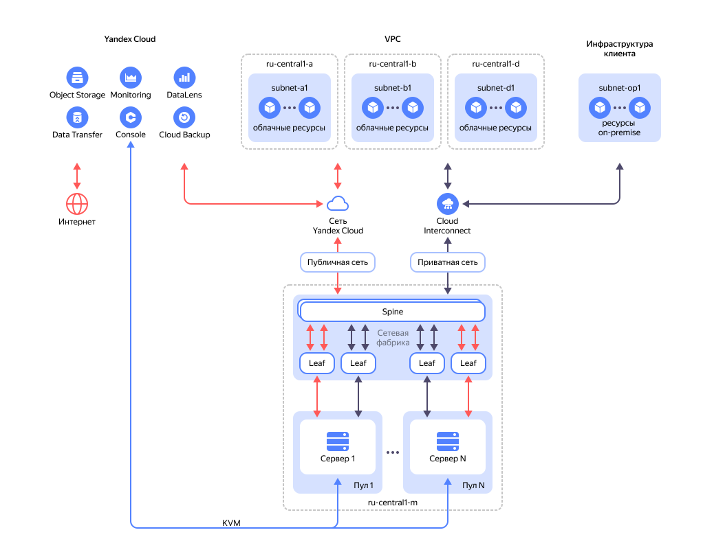

# Сеть

.



Возможность использования {{ interconnect-name }} с серверами  {{ baremetal-name }} появится в апреле 2025.



## Публичная сеть {#public-network}

Сеть c доступом в интернет, к которой физически подключены все серверы. Сетевой трафик между приватной сетью и интернетом на [некоторых](./traffic-restrictions.md) TCP- и UDP-портах ограничен.

## Приватная сеть {#private-network}

Локальная сеть к которой подключены все серверы. Логически объединяет серверы в изолированные пользовательские сети.

### Приватная подсеть {#private-subnet}

Сеть, физически ограниченная сетевым оборудованием одного пула, изолированная как от интернета, так и от сетей других пользователей.

В рамках одного пула между арендованными серверами возможна L2-связность (VLAN) и L3-связность (VRF).  Между серверами, физически размещенными в разных пулах, доступна только L3-связность.

Чтобы настроить сетевое взаимодействие между серверами из разных [пулов](./servers.md), для соответствующих подсетей в блоке **Настройки для маршрутизации** необходимо выбрать одинаковый [VRF](#vrf-segment).



### Виртуальный сегмент сети (VRF) {#vrf-segment}

Для обеспечения L3-маршрутизации приватные подсети, в которых настроена маршрутизация, объединяются в виртуальные сегменты сети (VRF).

Серверы из одного или разных пулов, подключенные к разным приватным подсетям, объединенным в VRF, смогут поддерживать между собой сетевой обмен по L3.

### Приватное соединение с облачными сетями {#private-connection-to-vpc}

Сетевая связность между [серверами](./servers.md) {{ baremetal-name }}, приватными [подсетями](../../vpc/concepts/network.md#subnet) {{ vpc-full-name }} в облачной инфраструктуре и приватными подсетями в on-prem инфраструктуре настраивается с использованием сервиса [{{ interconnect-full-name }}](../../interconnect/concepts/priv-con.md).

#### См. также {#see-also}

* [{#T}](./traffic-restrictions.md)