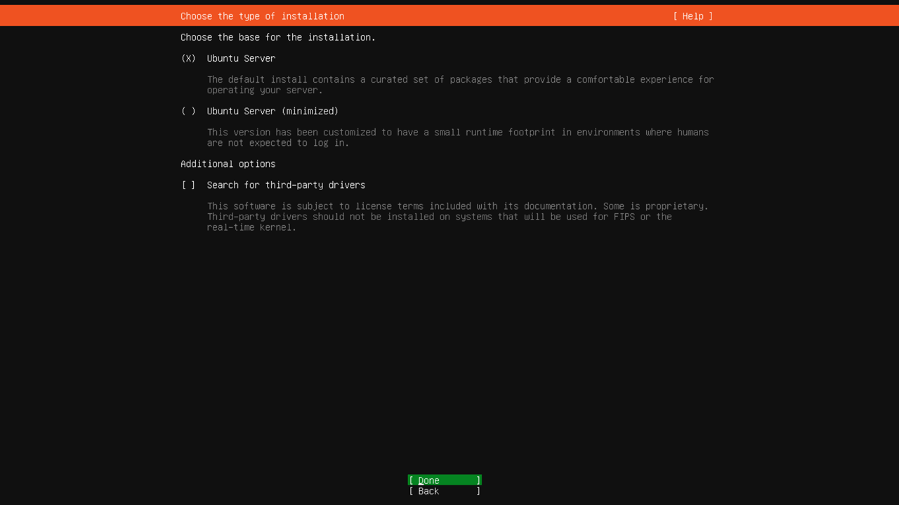
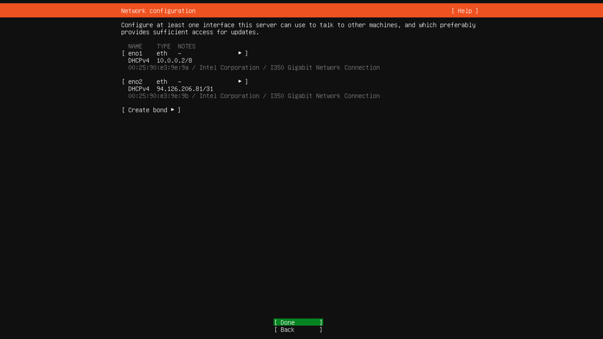
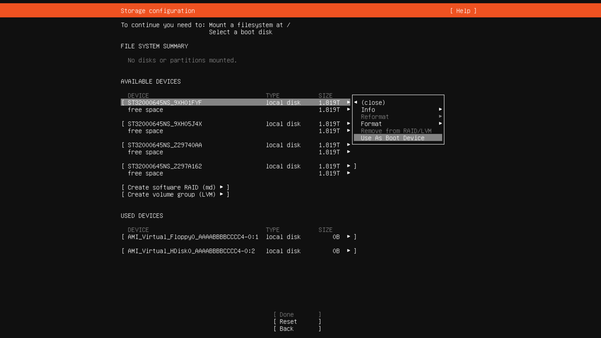
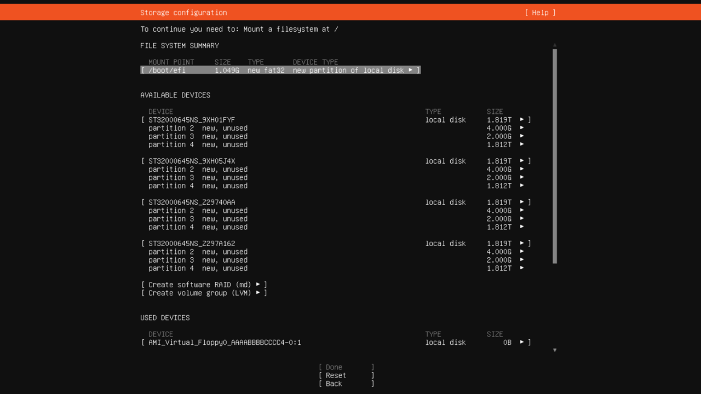
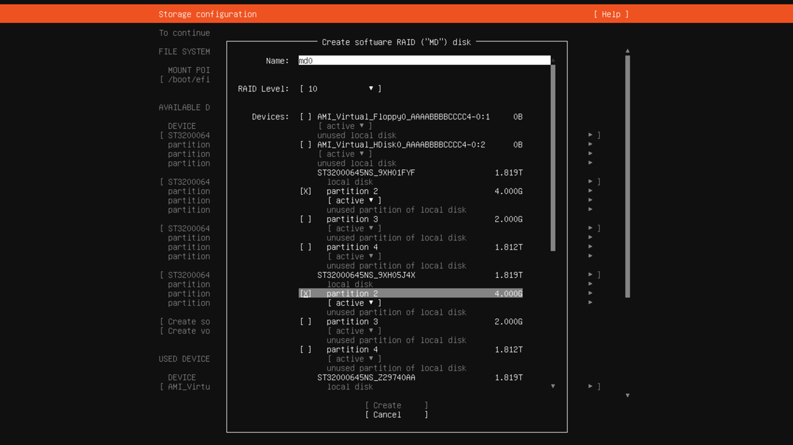
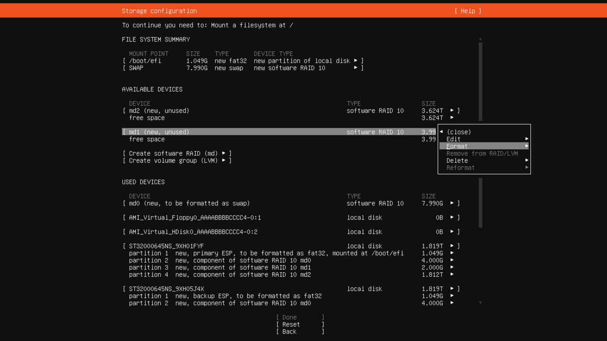
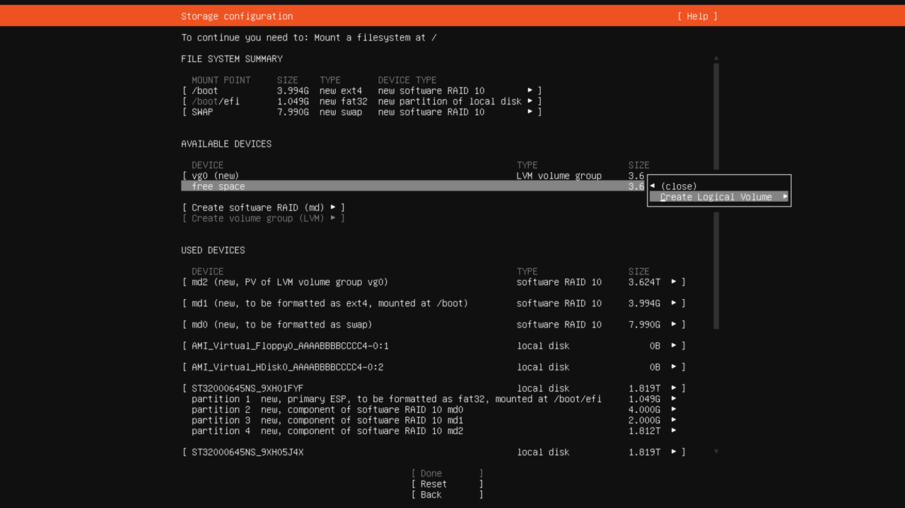
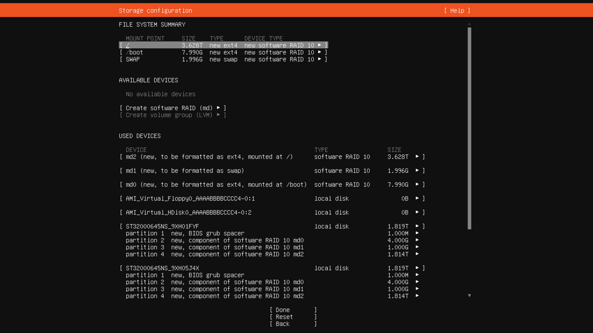
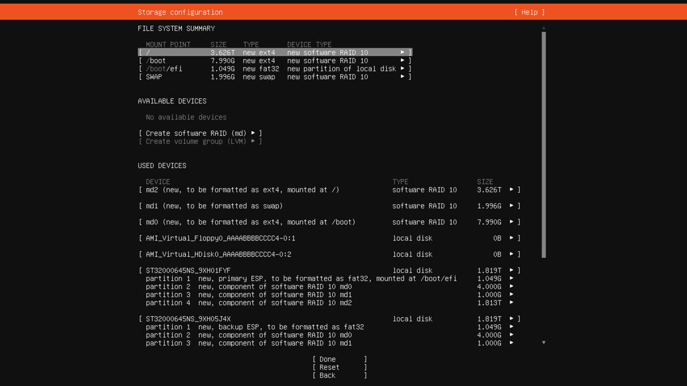
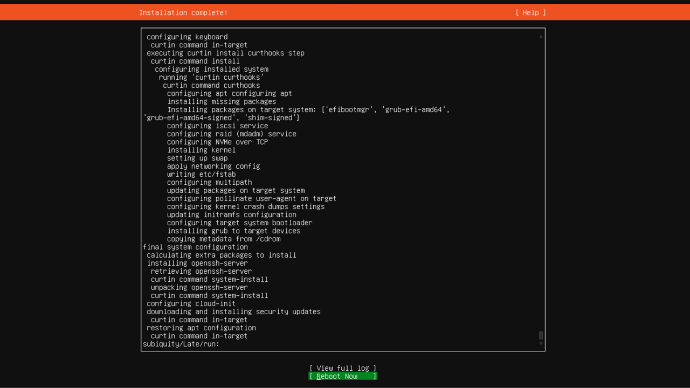

# Переустановить операционную систему из своего ISO-образа

{{ baremetal-full-name }} позволяет пользователям устанавливать и переустанавливать операционную систему сервера из собственных ISO-образов. Таким способом вы можете установить на сервер операционные системы семейств [Linux](https://ru.wikipedia.org/wiki/Linux) или [Windows](https://ru.wikipedia.org/wiki/Windows). При этом, если устанавливаемая ОС требует лицензии, пользователь должен использовать собственную лицензию.

При установке или переустановке ОС из [своего ISO-образа](../../concepts/images.md#user-images) вы можете произвольным образом [перераспределять](../../concepts/server-advanced-settings.md#storage-management) дисковое пространство, доступное на сервере.

Создание отказоустойчивой дисковой разметки требует опыта и понимания технологий [RAID](https://ru.wikipedia.org/wiki/RAID) и/или [LVM](https://ru.wikipedia.org/wiki/LVM), поэтому рекомендуется использовать установку ОС из публичного образа {{ marketplace-short-name }}, а приведенный в этой инструкции способ установки использовать только при необходимости внесения существенных изменений, недоступных при установке из {{ marketplace-short-name }}.

Например, установка из своего ISO-образа может потребоваться, если нужная ОС недоступна в {{ marketplace-short-name }}, либо если требуется нестандартная конфигурация разметки дисков, режим [UEFI](../../concepts/server-advanced-settings#install-os-uefi)/[SecureBoot](https://ru.wikipedia.org/wiki/Secure_Boot), шифрование корневой системы или другие настройки, недоступные при установке из образа {{ marketplace-short-name }}.



Неправильная разметка дисков или конфигурация RAID может привести к снижению или отсутствию отказоустойчивости, преждевременному исчерпанию свободного места на разделах или невозможности запустить сервер.



В этой инструкции приведен пример установки на [сервер BA-i201-H](../../concepts/server-configurations.md) с четырьмя HDD операционной системы [Ubuntu](https://ru.wikipedia.org/wiki/История_версий_Ubuntu) 24.04 в режиме UEFI из своего ISO-образа в дисковой конфигурации [RAID10](https://ru.wikipedia.org/wiki/RAID#RAID_10_(RAID_1+0)) с LVM.

## Запустите сервер с собственного ISO-образа в режиме UEFI {#boot-from-image}

Чтобы создать из вашего ISO-образа образ {{ baremetal-name }} и запустить с него сервер:

1. [Скачайте](https://releases.ubuntu.com/) на ваш локальный компьютер нужный образ операционной системы.
1. 
1. [Создайте](../image-upload.md#create-image) из загруженного ISO-образа образ {{ baremetal-name }}:

    

    - Консоль управления {#console}

      1. В [консоли управления]({{ link-console-main }}) выберите каталог, в котором хотите создать образ.
      1. В списке сервисов выберите **{{ ui-key.yacloud.iam.folder.dashboard.label_baremetal }}**.
      1. На панели слева выберите  **{{ ui-key.yacloud.baremetal.label_images }}**.
      1. Нажмите кнопку **Загрузить образ**.
      1. Введите имя образа. Требования к имени:

           

      1. (Опционально) Добавьте описание образа.
      1. Вставьте ссылку на образ, полученную в {{ objstorage-name }} на предыдущем шаге.
      1. Нажмите кнопку **{{ ui-key.yacloud.baremetal.label_create-image }}**.

    - CLI {#cli}

       1. Выполните команду:

          ```bash
          yc baremetal boot-image create \
            --name <имя_образа> \
            --uri "<ссылка_на_образ>"
          ```

          Где:
          * `--name` — имя образа. Требования к имени:
            
              

          * `--uri` — ссылка на образ, полученная в {{ objstorage-name }} на предыдущем шаге.

    

1. [Подключитесь](./server-kvm.md) к KVM-консоли сервера.

    

    Все дальнейшие действия будут выполняться в окне KVM-консоли.

    

1. В окне KVM-консоли в верхнем меню выберите **Media** → **Virtual Media Wizard...** или нажмите на значок с изображением CD-диска. В открывшемся окне:

    1. В секции **CD/DVD Media1** нажмите кнопку **Browse** и в директории `user-iso` выберите [загруженный ранее](../image-upload.md) ISO-образ операционной системы.
    1. Нажмите кнопку **Connect CD/DVD**.
    1. Убедитесь, что в секции **Status** для устройства **Virtual CD 1** значение поля **Connected To** изменилось на путь к выбранному ISO-образу, и нажмите кнопку **Close**.

    В зависимости от настроек сервера может потребоваться принудительно выбрать загрузочный носитель или режим `UEFI` в [BIOS](https://ru.wikipedia.org/wiki/BIOS). В частности, на сервере с конфигурацией `BA-i201-H`, чтобы установить операционную систему в режиме UEFI, необходимо загрузиться с CD-дисковода в режиме UEFI.
1. Чтобы запустить сервер с выбранного ISO-образа:

    1. В правом верхнем углу KVM-консоли нажмите кнопку **Reboot to cdrom**.
    1. В процессе загрузки сервера на экране [POST](https://ru.wikipedia.org/wiki/POST_(аппаратное_обеспечение)) нажмите клавишу **F11** или **Del**. На экране появится сообщение `Entering Setup...`.
    1. Дождитесь, когда откроется системное меню BIOS, и с помощью клавиш **←** и **→** перейдите в раздел **Save & Exit**.
    1. С помощью клавиш **↑** и **↓** в секции **Boot Override** выберите `UEFI: AMI Virtual CDROM0 1.00` и нажмите **Enter**.

        Если в секции **Boot Override** нет такого пункта, перейдите в раздел настроек **Boot** и в разделе **UEFI Boot Drive BBS Priorities** добавьте его.

    Сервер еще раз перезапустится и будет загружен с виртуального CD-дисковода в режиме `UEFI`.

    

## Выполните базовые настройки операционной системы {#basic-setup}

На этом этапе вы выполните базовые настройки устанавливаемой операционной системы. Все указанные действия выполняйте в окне терминала KVM-консоли:

1. В меню загрузчика [GRUB](https://ru.wikipedia.org/wiki/GNU_GRUB) выберите пункт **Try or Install Ubuntu Server** и нажмите клавишу **Enter**.
1. Выберите язык системы:

    

    Навигация по пунктам меню осуществляется клавишами **↑** и **↓**.
1. Выберите раскладку клавиатуры, переместите курсор на **Done** и нажмите **Enter**. В зависимости от выбранной раскладки может потребоваться задать сочетание клавиш для переключения языка ввода.
1. Выберите вариант установки сервера: полный или минимальный:

    

1. Задайте настройки сетевых интерфейсов. По умолчанию для всех интерфейсов достаточно оставить [DHCP](https://ru.wikipedia.org/wiki/DHCP):

    

1. При необходимости настройте прокси и адрес зеркала репозиториев для установки пакетов ОС.

    Например, для Ubuntu можно указать адрес зеркала `http://mirror.yandex.ru/ubuntu`. При этом обычно вносить правки необязательно.

1. Выберите вариант разметки дисков **Custom storage layout**. Для этого переместите курсор на этот пункт меню и нажмите клавишу **Пробел**.

    

    Использовать предлагаемый установщиком Ubuntu по умолчанию вариант с установкой системы на единственный накопитель не рекомендуется. Такой вариант не обеспечивает отказоустойчивости, и в случае выхода из строя выбранного под системные файлы диска, как минимум, потребуется переустановка операционной системы.

## Выполните разметку дисков и сформируйте массивы RAID10 {#setup-storage}



При разметке дисков разделы будут отформатированы. Это приведет к потере всех данных, хранящихся на дисках. Прежде чем продолжить, убедитесь, что у вас имеется резервная копия всех важных файлов, хранящихся на сервере.



Разметка дисков — наиболее ответственный этап установки операционной системы. От правильной разметки и выбора конфигурации разделов зависит производительность дисковой подсистемы, надежность хранения данных, отказоустойчивость сервера и скорость восстановления избыточности в случае сбоев.

На этом этапе вы можете создать любую дисковую конфигурацию, начиная от повторения разметки, предлагаемой при установке ОС из образа {{ marketplace-short-name }}, и заканчивая настройкой LVM с шифрованием.

Для продолжения установки операционной системы вы создадите следующие разделы:

* `/` — корневой раздел операционной системы;
* `/boot` — раздел для загрузочных файлов операционной системы;
* `swap` — раздел подкачки;
* `/home` — раздел для домашних каталогов пользователей;
* `/srv` — раздел для сервисных данных;
* `ESP` — системный раздел `UEFI` размером `1` ГБ.

    В случае загрузки сервера в режиме `Legacy` вместо раздела `ESP` будет создан системный раздел `BIOS grub spacer` размером `300` МБ.
    
    

    Вручную создавать системные разделы `ESP` и `BIOS grub spacer` не нужно: они появляются на диске автоматически при выборе диска в качестве основного или дополнительного загрузочного устройства.

    

Для создания отказоустойчивого дискового массива уровня `RAID10` требуется как минимум четыре диска или дисковых раздела. Обычно RAID-массивы создаются из разделов дисковых устройств, поэтому сначала необходимо переразметить все диски и создать на каждом из них таблицу разделов:

1. Если на сервере уже была установлена операционная система и диски уже размечены, удалите текущую разметку. Если сервер был арендован без операционной системы и ОС на нем еще не устанавливалась, пропустите этот шаг и переходите к следующему.

    1. В секции **AVAILABLE DEVICES** удалите все разделы дисков и RAID-массивы, имеющиеся на сервере.

        Для этого с помощью клавиш **↑** и **↓** выберите раздел или RAID-массив, нажмите **Enter**, в появившемся меню выберите `DELETE` и подтвердите удаление.

        Чтобы удалить все разделы на диске, переместите курсор на строку с именем этого диска, нажмите **Enter**, выберите `Reformat` и подтвердите удаление.
    1. Повторите предыдущее действие для всех разделов, дисков и RAID-массивов, отображающихся в секции **AVAILABLE DEVICES**.

        В результате в секции **AVAILABLE DEVICES** у вас должны остаться только дисковые устройства с нераспределенным дисковым пространством (`free space`):

        
1. Выберите загрузочные диски:

    1. С помощью клавиш **↑** и **↓** выберите любой диск и нажмите **Enter**.
    1. В появившемся справа дополнительном меню выберите `Use As Boot Device` и нажмите **Enter**.

        

        Для установки загрузчика обязательно отметить загрузочным один диск, но для обеспечения отказоустойчивости рекомендуется выбрать как минимум два загрузочных диска.

    1. Выберите еще один диск, нажмите **Enter** и выберите `Add As Another Boot Device`.
1. Создайте на каждом из дисков одинаковый набор разделов, исходя из предполагаемого потребления дискового пространства. В приведенном примере на дисках создается по три отдельных раздела:

    1. Разметьте первый диск:

        1. Выберите строку **free space** первого диска в списке, нажмите **Enter** и в появившемся дополнительном меню выберите `Add GPT Partition`.
        1. В открывшейся форме в поле **Size:** задайте размер первого из создаваемых разделов — `4G`.
        1. В поле **Format:** выберите значение `Leave unformatted`.
        1. Переведите курсор на **Create** и нажмите **Enter**.
        1. Повторите предыдущие действия, чтобы создать на первом диске еще два раздела: один — размером `2 ГБ`, другой — занимающий все пространство, оставшееся после первых двух разделов.
    1. Точно так же разметьте оставшиеся три диска сервера: размеры разделов на всех четырех дисках должны совпадать.

    
1. Из созданных на предыдущем шаге разделов соберите RAID-массивы:

    1. Переведите курсор в пункт меню **Create software RAID (md)** и нажмите **Enter**. В открывшейся форме:

        1. В поле **RAID Level:** выберите `10`.
        1. С помощью клавиши **Пробел** отметьте разделы размером `4 ГБ` на всех четырех дисках.
        1. Переведите курсор на **Create** и нажмите **Enter**.

        

    1. Аналогичным образом создайте RAID-массив уровня `10` из разделов размером `2 ГБ`, затем — RAID-массив уровня `10` из самых больших разделов.
1. Создайте в полученных RAID-массивах разделы для файловой системы сервера:

    1. Создайте раздел `swap`:

        1. Переведите курсор на RAID-массив `md0` размером `8 ГБ`, нажмите **Enter** и в появившемся меню выберите `Format`.
        1. В открывшейся форме в поле **Format:** выберите `swap`.
        1. Переместите курсор на **Done** и нажмите **Enter**.

    1. Создайте раздел `/boot`:

        1. Переведите курсор на RAID-массив `md1` размером `4 ГБ`, нажмите **Enter** и в появившемся меню выберите `Format`.
        1. В открывшейся форме в поле **Format:** оставьте `ext4`, а в поле **Mount:** выберите `/boot`.
        1. Переместите курсор на **Done** и нажмите **Enter**.

        

1. Из RAID-массива `md2`, собранного из самых больших разделов, создайте LVM-группу `vg0`:

    1. Создайте LVM-группу:

        1. Переведите курсор в пункт меню **Create volume group (LVM)** и нажмите **Enter**.
        1. В открывшейся форме в поле **Devices:** с помощью клавиши **Пробел** отметьте массив `md2`.
        1. Переведите курсор на **Create** и нажмите **Enter**.
    1. Создайте логический том `lv-root` для корневого раздела:

        

        1. В секции устройств **AVAILABLE DEVICES** в блоке с устройством `vg0` переведите курсор на строку **free space**, нажмите **Enter** и в открывшемся меню выберите `Create Logical Volume`.
        1. В поле **Name:** введите `lv-root`.
        1. В поле **Size:** задайте размер тома `100G`.
        1. В поле **Format:** оставьте значение `ext4`, а в поле **Mount:** — `/`.
        1. Переведите курсор на **Create** и нажмите **Enter**.

        

    1. Аналогичным образом создайте логические тома:
        * `lv-home` размером `512 ГБ` с точкой монтирования `/home` для домашних каталогов пользователей.
        * `lv-srv` размером `1 ТБ` с точкой монтирования `/srv` для сервисных данных.
    
        

    Оставшееся нераспределенным в LVM-группе `vg0` пространство может позднее быть использовано для расширения уже имеющихся логических томов, либо для создания новых. 

### Альтернативные варианты разметки дисков {#alternative-partitioning}

Приведенный выше вариант разметки дисков является примерным. В каждом конкретном случае размечать дисковое пространство необходимо, исходя из прогнозируемых сценариев использования сервера. Кроме того, разметка дисков будет различаться в зависимости от установленного на сервере режима загрузки: `Legacy` или `UEFI`.

Вот несколько других возможных конфигураций разметки дисков сервера:



- Вариант 1

  Разметка, аналогичная создаваемой установщиком {{ baremetal-name }} из образа {{ marketplace-short-name }} (режим загрузки `Legacy`):

  

- Вариант 2

  Разметка, аналогичная создаваемой установщиком {{ baremetal-name }} из образа {{ marketplace-short-name }} (режим загрузки `UEFI`):

  

- Вариант 3

  Разметка с корневым разделом в LVM-группе с шифрованием, созданной в массиве `RAID10`:

  

  

  Шифрование разделов может иметь ряд негативных последствий, таких как снижение производительности сервера, необходимость ввода ключа шифрования при каждом перезапуске (либо наличие в сервере корректно настроенного модуля [TPM](https://ru.wikipedia.org/wiki/TPM_(спецификация))), а также безвозвратную потерю данных при утере ключа.

  



## Установка системных файлов {#installation}

После того как вы создали на вашем сервере необходимую разметку дисков, можно приступать к установке системных файлов.



До этого момента физически вы еще не внесли никаких изменений в структуру дисков сервера, и процесс установки ОС можно отменить без потерь. Продолжение установки приведет к удалению всех имеющихся на дисках данных и физическому созданию новых разделов.



1. Чтобы продолжить установку, переведите курсор на **Done** и нажмите **Enter**.

    В появившейся форме **Сonfirm destructive action** нажмите **Continue**, чтобы подтвердить свое согласие на форматирование дисков.
1. Задайте имя хоста, создайте первого пользователя, при необходимости настройте SSH и установите дополнительное ПО:

    

    Дождитесь завершения установки файлов операционной системы на сервер.

1. 
1. Чтобы перезапустить сервер в новую ОС, переместите курсор на **Reboot Now** и нажмите **Enter**:

    
1. Настройте загрузку сервера в режиме UEFI:

    1. В процессе загрузки сервера на экране POST нажмите клавишу **F11** или **Del**. На экране появится сообщение `Entering Setup...`.
    1. Дождитесь, когда откроется системное меню BIOS, и с помощью клавиш **←** и **→** перейдите в раздел **Boot**.
    1. Выберите опцию **1st Boot Device**, нажмите **Enter** и выберите вариант `UEFI: Built-in EFI Shell`.
    1. Выберите опцию **UEFI Boot Drive BBS Priorities**, нажмите **Enter** и в открывшемся меню:

        1. В поле **1st Device** нажмите **Enter** и выберите любое из полей `UEFI OS`.
        1. Нажмите клавишу **Esc**, чтобы вернуться в предыдущее меню.
    1. Убедитесь, что в поле **1st Boot Device** значение сменилось на `UEFI OS`.
    1. C помощью клавиш **←** и **→** перейдите в раздел **Save & Exit**.
    1. Выберите пункт **Save Changes and Reset**, нажмите **Enter** и подтвердите действие, нажав **Yes**.

В результате сервер запустится в новую операционную систему в режиме UEFI.