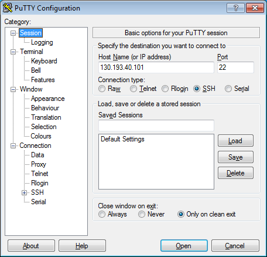
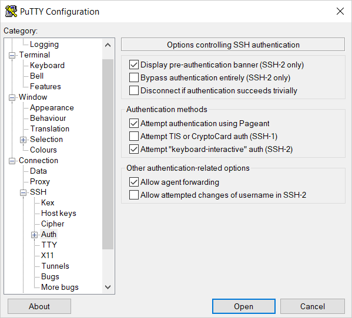
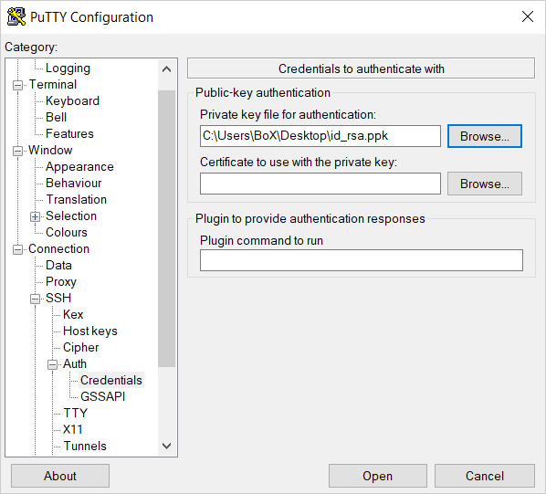
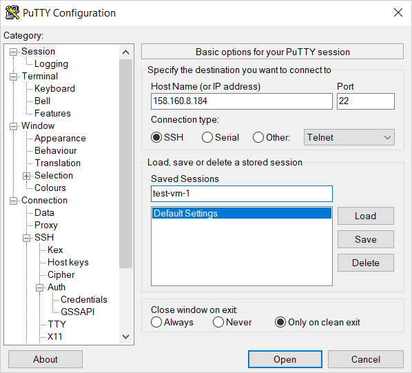
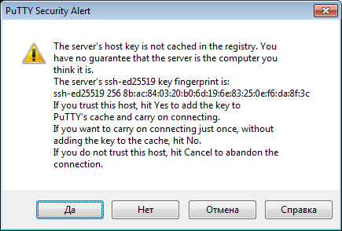
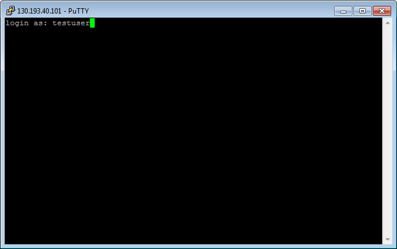

# Как начать работать с {{ baremetal-full-name }}



Сервис находится на стадии [Preview](../overview/concepts/launch-stages.md).



Арендуйте свой первый физический сервер и подключитесь к нему. Все ресурсы арендованного сервера выделяются только вам и могут обеспечить лучшую производительность, чем аналогичная [виртуальная машина](../glossary/vm.md).

## Перед началом работы {#before-you-begin}



## Арендуйте сервер {#server-lease}



- Консоль управления {#console}

  1. В [консоли управления]({{ link-console-main }}) выберите каталог, в котором хотите арендовать сервер.
  1. В списке сервисов выберите **{{ baremetal-name }}**.
  1. Нажмите кнопку **Заказать сервер**.
  1. Выберите [зону доступности](../overview/concepts/geo-scope.md) `{{ region-id }}-m`.
  1. Выберите пул `{{ region-id }}-m3`.
  1. В блоке **{{ ui-key.yacloud.baremetal.title_section-server-config }}**:

     1. Выберите конфигурацию сервера `BA-i103-S-10G`.
     1. (Опционально) Настройте разметку диска:

        1. Нажмите кнопку **{{ ui-key.yacloud.baremetal.action_disk-layout-settings }}**.
        1. Укажите параметры разметки и нажмите кнопку **{{ ui-key.yacloud.common.save }}**.

  1. В блоке **{{ ui-key.yacloud.baremetal.title_section-server-product }}** выберите образ `Ubuntu 22.04 LTS`.
  1. В блоке **{{ ui-key.yacloud.baremetal.title_section-lease-conditions }}** укажите:

     1. **{{ ui-key.yacloud.baremetal.field_server-count }}** — `1`.
     1. **{{ ui-key.yacloud.baremetal.field_server-lease-duration }}** — `{{ ui-key.yacloud.baremetal.label_one-month-duration }}`.

  1. В блоке **{{ ui-key.yacloud.baremetal.title_section-server-network-settings }}**:

     1. В поле **Приватная подсеть** нажмите кнопку **{{ ui-key.yacloud.common.create }}**.
     1. Введите имя подсети `bm-subnetwork` и нажмите кнопку **Создать подсеть**.
     1. В поле **{{ ui-key.yacloud.baremetal.field_needed-public-ip }}** выберите `{{ ui-key.yacloud.baremetal.label_public-ip-auto }}`.

  1. В блоке **{{ ui-key.yacloud.baremetal.title_server-access }}**:

      

  1. В блоке **{{ ui-key.yacloud.baremetal.title_section-server-info }}** введите **{{ ui-key.yacloud.baremetal.field_name }}** сервера — `bm-server`.
  1. Нажмите кнопку **Заказать сервер**.



## Подключитесь к серверу {#server-connect}



- KVM-консоль {#console}

  1. В [консоли управления]({{ link-console-main }}) выберите каталог, которому принадлежит сервер.
  1. В списке сервисов выберите **{{ baremetal-name }}**.
  1. В строке с нужным сервером нажмите значок  и выберите **KVM-консоль**.

- Linux/macOS {#linux-macos}
   
  Для подключения к серверу необходимо указать его публичный IP-адрес, который можно узнать в консоли управления, в поле **{{ ui-key.yacloud.baremetal.field_needed-public-ip }}** блока **{{ ui-key.yacloud.baremetal.title_section-server-network-settings }}** на странице сервера.

  В терминале выполните команду:

  ```bash
  ssh root@<публичный_IP-адрес_сервера>
  ```

  При первом подключении к серверу появится предупреждение о неизвестном хосте:

  ```text
  The authenticity of host '51.250.83.243 (51.250.83.243)' can't be established.
  ED25519 key fingerprint is SHA256:6Mjv93NJDCaf/vu3NYwiLQK4tKI+4cfLtkd********.
  This key is not known by any other names.
  Are you sure you want to continue connecting (yes/no/[fingerprint])?
  ```

  Введите в терминале слово `yes` и нажмите **Enter**.

- Windows 10/11 {#windows}

  Для подключения к серверу необходимо указать его публичный IP-адрес, который можно узнать в консоли управления, в поле **{{ ui-key.yacloud.baremetal.field_needed-public-ip }}** блока **{{ ui-key.yacloud.baremetal.title_section-server-network-settings }}** на странице сервера.

  Убедитесь, что учетная запись Windows обладает правами на чтение файлов в папке с ключами.

  Для подключения к серверу в командной строке выполните команду:

  ```shell
  ssh root@<публичный_IP-адрес_сервера>
  ```

  При первом подключении к серверу появится предупреждение о неизвестном хосте:

  ```text
  The authenticity of host '89.169.132.223 (89.169.132.223)' can't be established.
  ECDSA key fingerprint is SHA256:DfjfFB+in0q0MGi0HnqLNMdHssLfm1yRanB********.
  Are you sure you want to continue connecting (yes/no/[fingerprint])?
  ```

  Введите в командной строке `yes` и нажмите **Enter**.

- Windows 7/8 {#windows7-8}

  Для подключения к серверу необходимо указать его публичный IP-адрес, который можно узнать в консоли управления, в поле **{{ ui-key.yacloud.baremetal.field_needed-public-ip }}** блока **{{ ui-key.yacloud.baremetal.title_section-server-network-settings }}** на странице сервера.

  Установите соединение с помощью приложения PuTTY:

  1. Запустите приложение Pageant.
     1. Нажмите правой кнопкой мыши на значок Pageant на панели задач.
     1. В контекстном меню выберите пункт **Add key**.
     1. Выберите сгенерированный PuTTY приватный ключ в формате `.ppk`. Если для ключа задан пароль, введите его.
  1. Запустите приложение PuTTY.
     1. В поле **Host Name (or IP address)** введите публичный IP-адрес сервера, к которому вы хотите подключиться. Укажите порт `22` и тип соединения **SSH**.

        

     1. Откройте в дереве слева пункт **Connection** → **SSH** → **Auth**.
     1. Установите флаг **Allow agent forwarding**.

        

     1. Откройте в дереве слева пункт **Connection** → **SSH** → **Auth** → **Credentials**.
     1. В поле **Private key file for authentication** выберите файл с приватным ключом.

        

     1. Вернитесь в меню **Sessions**. В поле **Saved sessions** введите любое название для сессии и нажмите кнопку **Save**. Настройки сессии сохранятся под указанным именем. Вы сможете использовать этот профиль сессии для подключения с помощью Pageant.

        

     1. Нажмите кнопку **Open**. Если вы подключаетесь к серверу в первый раз, может появиться предупреждение о неизвестном хосте:

        

        Нажмите кнопку **Accept**. Откроется окно терминала с предложением ввести логин пользователя, от имени которого устанавливается соединение. Введите имя пользователя `root`.

        Если все настроено верно, будет установлено соединение с сервером.

        

  Если вы сохранили профиль сессии в PuTTY, в дальнейшем для установки соединения можно использовать Pageant:

  1. Нажмите правой кнопкой мыши на значок Pageant на панели задач.
  1. Выберите пункт меню **Saved sessions**.
  1. В списке сохраненных сессий выберите нужную сессию.


