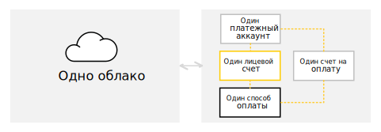

# Счет на оплату

Счет — документ на оплату потребленных ресурсов. Счет выставляется в рамках [платежного аккаунта](billing-account.md) и содержит агрегированные данные по всем используемым сервисам в рамках одного облака.

Взаимосвязь между счетом, платежным аккаунтом и облаком представлена на схеме ниже.

## Выставление счета {#agregate}

[!INCLUDE [bill-note](../_includes/bill-note.md)]  

## Сумма счета {#payment-amount}

[!INCLUDE [bill-amount](../_includes/bill-amount.md)]  
 
 

[!INCLUDE [bill-amount-examples](../_includes/bill-amount-examples.md)]  

  
  
## Оплата счета {#payment}

[!INCLUDE [how-to-pay](../_includes/how-to-pay.md)]  

[!INCLUDE [payment-bill-note](../_includes/payment-bill-note.md)]  
 
## Реквизиты счета {#parameters}

Название | Описание
----- | -----
Номер счета | Уникальный идентификатор счета
Дата счета | Дата формирования счета в бухгалтерской системе Яндекса
Заказчик | Владелец платежного аккаунта
Телефон | Телефон владельца платежного аккаунта
Наименование товара, работы, услуги | Информация об оказанных услугах
Итого | Итоговая сумма по всем строчкам счета без учета НДС, в рублях
Итого НДС % | Сумма начисленных налогов по всем строчкам счета, в рублях
Всего к оплате | Итоговая сумма по всем строчкам счета с учетом НДС, в рублях
К оплате | Итоговая сумма по всем строчкам счета с учетом НДС, в рублях

## Учет НДС {#nds}

[!INCLUDE [nds](../_includes/nds.md)]

