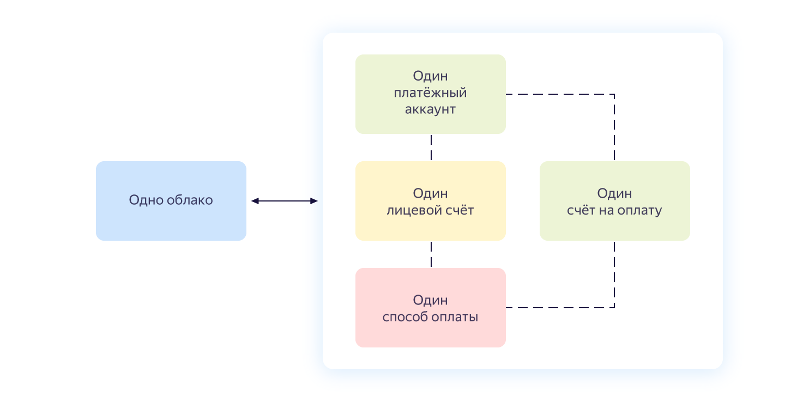
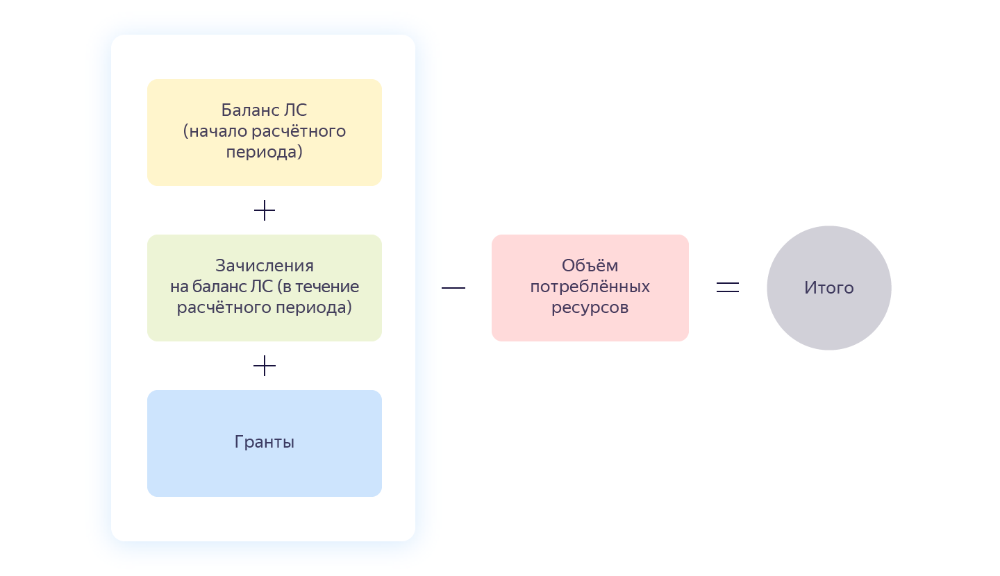

# Счет на оплату

Счет — документ на оплату потребленных ресурсов. Счет выставляется в рамках [платежного аккаунта](billing-account.md) и содержит агрегированные данные по всем используемым сервисам в рамках одного облака.

Взаимосвязь между счетом, платежным аккаунтом и облаком представлена на схеме ниже.

## Выставление счета {#agregate}

Счет формируется автоматически и выставляется в начале следующего отчетного периода при выполнении следующих условий:
* Выбран способ оплаты [Перевод с расчетного счета](../payment/payment-methods-business.md).
* [Итоговая сумма счета](#payment-amount) больше нуля.

Счет высылается только на адрес электронной почты владельца [платежного аккаунта](billing-account.md). Изменить адрес нельзя, но можно настроить пересылку писем на другой адрес. Подробнее см. в [Справке Яндекс Почты](https://yandex.ru/support/mail/web/preferences/filters/forwarding.html).



{{ yandex-cloud }} оставляет за собой право выставить счет на оплату в течение текущего отчетного периода, если вы превысите установленный порог оплаты.



По условиям [оферты]({{ billing-oferta-url }}) (Раздел 6) Клиент, являющийся юридическим лицом, не использующий привязанную корпоративную карту для пополнения лицевого счета, самостоятельно [формирует счет на оплату](../operations/pay-the-bill.md#legal-entities) через Консоль управления.

Счет на оплату не является первичным учетным документом. Специальных требований к составлению этого документа со стороны законодательства нет. Корректное начисление услуг в бухгалтерском учете происходит по акту и счету-фактуре, в которых указываются все необходимые реквизиты. Счет формируется автоматически без возможности изменить данные клиента.

## Сумма счета {#payment-amount}





- Пример 1

  Баланс ЛС на начало отчетного периода — 0 рублей.
  В течение всего отчетного периода на баланс ЛС поступило 0 рублей.
  Сумма гранта — 1 000 рублей.
  Порог оплаты — 1 000 рублей.
  На конец отчетного периода порог оплаты не достигнут и объем потребленных ресурсов составил 1 400 рублей.
  Итоговая сумма: 1 400 - (0 + 0 + 1 000) = 400 рублей.
  В начале следующего отчетного периода вам будет выставлен [счет](../operations/spell-out-bill.md) на фактически израсходованную сумму — 400 рублей.

- Пример 2

  Баланс ЛС на начало отчетного периода — 0 рублей.
  В течение всего отчетного периода на баланс ЛС поступило 0 рублей.
  Сумма гранта — 1 000 рублей.
  Порог оплаты не подключен.
  На конец отчетного периода объем потребленных ресурсов составил 800 рублей.
  Размер гранта на конец отчетного периода составляет 200 рублей. Баланс ЛС не изменился.
  В начале следующего расчетного месяца счет на оплату не будет сформирован.

- Пример 3

  Баланс ЛС на начало отчетного периода — 0 рублей.
  В течение всего отчетного периода на баланс ЛС поступило 0 рублей.
  Сумма гранта — 1 000 рублей.
  Порог оплаты — 1 000 рублей.
  В середине отчетного периода достигнут порог оплаты и объем потребленных ресурсов составил 2 000 рублей.
  Итоговая сумма: 2 000 - (0 + 0 + 1 000) = 1 000 рублей.
  В середине отчетного периода вам будет выставлен счет на фактически израсходованную сумму — 1 000 рублей.



## Оплата счета {#payment}

Оплатить счет необходимо в сроки, предусмотренные [договором](../concepts/contract.md). Оплата производится с помощью банковского перевода. Подробную информацию см. в разделе [Способы оплаты для юридических лиц](../payment/payment-methods-business.md).



## Реквизиты счета {#parameters}



## Учет налогов и сборов {#nds}


