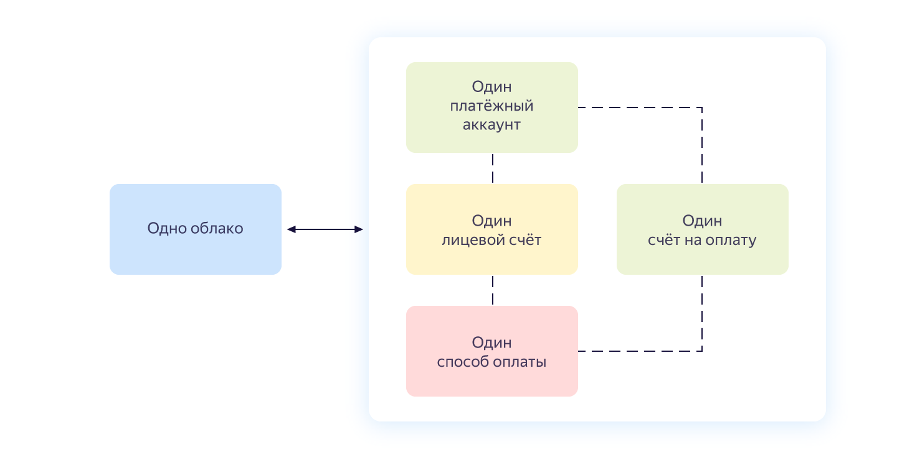
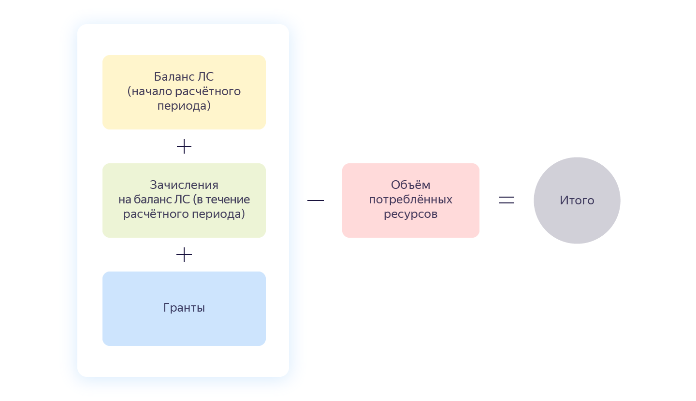

# Счет на оплату

Счет — документ на оплату потребленных ресурсов. Счет выставляется в рамках [платежного аккаунта](billing-account.md) и содержит агрегированные данные по всем используемым сервисам в рамках одного облака.

Взаимосвязь между счетом, платежным аккаунтом и облаком представлена на схеме ниже.

## Выставление счета {#agregate}

Выставление счета зависит от нескольких факторов: 
- Выбранного способа оплаты: счет может быть выставлен только для способа **Перевод с расчетного счета**.
- Использования [кредитного лимита](../concepts/credit-limit.md).
- [Итоговой суммы счета](#payment-amount).
 
[!INCLUDE [bill-note](../_includes/bill-note.md)]  

## Сумма счета {#payment-amount}

[!INCLUDE [bill-amount](../_includes/bill-amount.md)]  
 
 

  ---  
      
 **[!TAB Пример 1]**
 
 Баланс ЛС на начало расчетного периода — 0 рублей. 
 В течение всего расчетного периода на баланс ЛС поступило 0 рублей.
 Сумма гранта — 1 000 рублей. 
 Кредитный лимит — 1 000 рублей. 
 На конец расчетного периода порог кредитного лимита не достигнут и объем потребленных ресурсов составил 1 400 рублей.
 Итоговая сумма: 1 400 - (0 + 0 + 1 000) = 400 рублей. 
 В начале следующего расчетного периода вам будет выставлен счет на фактически израсходованную сумму — 400 рублей.
        
 **[!TAB Пример 2]**
 
 Баланс ЛС на начало расчетного периода — 0 рублей. 
 В течение всего расчетного периода на баланс ЛС поступило 0 рублей.
 Сумма гранта — 1 000 рублей. 
 Кредитный лимит не подключен.
 На конец расчетного периода объем потребленных ресурсов составил 800 рублей.
 Размер гранта на конец расчетного периода составляет 200 рублей. Баланс ЛС не изменился.
 В начале следующего расчетного месяца счет на оплату не будет сформирован.    

 **[!TAB Пример 3]**
 
 Баланс ЛС на начало расчетного периода — 0 рублей. 
 В течение всего расчетного периода на баланс ЛС поступило 0 рублей.
 Сумма гранта — 1 000 рублей. 
 Кредитный лимит — 1 000 рублей. 
 В середине расчетного периода достигнут порог кредитного лимита и объем потребленных ресурсов составил 2 000 рублей.
 Итоговая сумма: 2 000 - (0 + 0 + 1 000) = 1 000 рублей. 
 В середине расчетного периода вам будет выставлен счет на фактически израсходованную сумму — 1 000 рублей.
       
  ---    

  
  
## Оплата счета {#payment}

Оплатить счет необходимо в сроки, предусмотренные [договором](../concepts/contract.md). Оплата производится с помощью банковского перевода. Подробную информацию см. в разделе [Способы оплаты для юридических лиц](../payment/payment-methods-business.md).

[!INCLUDE [payment-bill-note](../_includes/payment-bill-note.md)]  
 
## Реквизиты счета {#parameters}

Название | Описание
----- | -----
Номер счета | Уникальный идентификатор счета
Дата счета | Дата формирования счета в бухгалтерской системе Яндекса
Заказчик | Владелец платежного аккаунта
Телефон | Телефон владельца платежного аккаунта
Наименование товара, работы, услуги | Информация об оказанных услугах
Итого | Итоговая сумма по всем строчкам счета без учета НДС, в рублях
Итого НДС % | Сумма начисленных налогов по всем строчкам счета, в рублях
Всего к оплате | Итоговая сумма по всем строчкам счета с учетом НДС, в рублях
К оплате | Итоговая сумма по всем строчкам счета с учетом НДС, в рублях

## Учет НДС {#nds}

[!INCLUDE [nds](../_includes/nds.md)]

