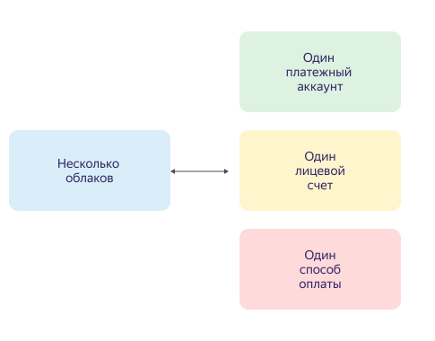

# Платежный аккаунт

Платежный аккаунт используется для идентификации пользователя, оплачивающего ресурсы в {{ yandex-cloud }}.

Платежный аккаунт может быть привязан к нескольким облакам и только к одному [лицевому счету](personal-account.md). В рамках лицевого счета можно использовать только тот способ оплаты, который соответствует типу платежного аккаунта и [договору](contract.md).

Взаимосвязь между облаками, платежным аккаунтом, лицевым счетом и способом оплаты представлена на схеме ниже.





Платежный аккаунт не используется для управления ресурсами {{ yandex-cloud }}.



Чтобы открыть список платежных аккаунтов, перейдите в сервис [**{{ billing-name }}**]({{ link-console-billing }}).

## Типы платежных аккаунтов {#ba-types}



 - Личный аккаунт {#individual}
  
   * Предназначен для резидентов Российской Федерации или Республики Казахстан.
   * Аккаунт создается с платным потреблением.
   * Для оплаты потребленных ресурсов используется [банковская карта](../payment/payment-methods-individual.md).
   * Средства за потребленные ресурсы списываются автоматически. Подробнее см. раздел [Цикл оплаты для физических лиц](../payment/billing-cycle-individual.md).
   * После списания средств с банковской карты на электронную почту высылается [чек об оплате](individual-bill.md).
  
 - Бизнес-аккаунт {#business}
  
   * Предназначен для резидентов Российской Федерации, резидентов Республики Казахстан и нерезидентов РФ и РК.
   * Для оплаты потребленных ресурсов используется банковский перевод с [расчетного счета организации](../payment/payment-methods-business.md) или оплата [банковской картой](../payment/payment-methods-card-business.md).
   * Потребленные ресурсы оплачиваются либо на основании [договора](../concepts/contract.md) и [счета](bill.md), либо списываются автоматически с привязанной банковской карты. Подробнее см. раздел [Цикл оплаты для юридических лиц](../payment/billing-cycle-business.md).
   * Акт на оказанные услуги (для резидентов РФ и РК) и счет-фактура (только для резидентов РФ) высылаются на электронную почту в начале следующего расчетного периода. Счет-фактура для резидентов РК формируется в электронном виде. Подробнее см. раздел [Финансовые документы](../payment/documents.md).
   * Для новых клиентов доступен [пробный период](trial-period.md).
  


## Срок действия {#dates}

Срок действия у платежного аккаунта отсутствует.

Однако если использование сервисов {{ yandex-cloud }} было приостановлено из-за наличия задолженности, и вы не оплатили эту задолженность в течение 60 дней после приостановки, то все ваши данные, включая платежный аккаунт, будут заблокированы и удалены без возможности восстановления.

Вы можете [удалить платежный аккаунт](../operations/delete-account.md), если больше не планируете пользоваться сервисами {{ yandex-cloud }}.

## Идентификатор платежного аккаунта {#billing-account-id}

У каждого платежного аккаунта есть идентификатор. Чтобы узнать идентификатор платежного аккаунта:



## Количество платежных аккаунтов {#restrictions}








