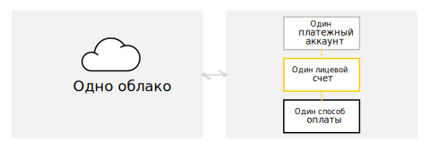

# Платежный аккаунт

Платежный аккаунт используется для идентификации пользователя, оплачивающего ресурсы в Яндекс.Облаке.

Платежный аккаунт может быть привязан только к одному [лицевому счету](personal-account.md) и к одному облаку. В рамках лицевого счета можно использовать только тот способ оплаты, который соответствует типу платежного аккаунта и [договору](contract.md).

Взаимосвязь между облаком, платежным аккаунтом, лицевым счетом и способом оплаты представлена на схеме ниже.

> [!NOTE]
>
> Платежный аккаунт не используется для управления ресурсами Яндекс.Облака.

## Типы платежных аккаунтов {#ba-types}

Тип платежного аккаунта определяет [способ оплаты](../payment/payment-methods.md) ресурсов в Яндекс.Облаке.

Описание типов представлено в таблице ниже.
Тип аккаунта | Описание
----- | -----
Личный аккаунт | - Предназначен для резидентов РФ.  - Для оплаты потребленных ресурсов используется банковская карта. - Средства за потребленные ресурсы списываются автоматически. Подробнее см. раздел [Цикл оплаты для физических лиц](../payment/billing-cycle-individual.md). - После списания средств с банковской карты на электронную почту высылается [чек об оплате](individual-bill.md).
Бизнес-аккаунт | - Предназначен для резидентов РФ. - Для оплаты потребленных ресурсов используется банковский перевод с расчетного счета организации или перевод с корпоративной банковской карты. - Потребленные ресурсы оплачиваются на основании [договора](../concepts/contract.md) и [счета](bill.md). Подробнее см. раздел [Цикл оплаты для юридических лиц](../payment/billing-cycle-business.md). - Акт на оказанные услуги и счет-фактура высылаются на электронную почту в начале следующего расчетного периода. Подробнее см. раздел [Финансовые документы](../payment/documents.md).

## Срок действия  {#dates}

Срок действия у платежного аккаунта отсутствует.

Однако если использование сервисов Яндекс.Облака было приостановлено из-за наличия задолженности и вы не оплатили эту задолженность в течение шестидесяти дней после приостановки, то все ваши данные, включая платежный аккаунт, будут заблокированы и удалены без возможности восстановления.

## Количество платежных аккаунтов {#restrictions}

Один клиент может создать только один платежный аккаунт.

## Статус аккаунта {#conditions}

Статус платежного аккаунта зависит от наличия или отсутствия задолженности по оплате потребленных ресурсов.

Описание статусов представлено в таблице ниже.

Статус | Баланс | Причина | Описание
----- | ----- | ----- | -----
Активный | Положительный | Отсутствует задолженность по оплате потребленных ресурсов. | Статус сохраняется до тех пор, пока не появилась задолженность.
Приостановлен | Отрицательный | Имеется задолженность по оплате потребленных ресурсов в установленные сроки. | Использование сервисов Яндекс.Облака приостановлено. В период приостановки также взимается плата за услуги хранения данных и пени за неуплату.  Максимальный срок хранения данных после приостановки — шестьдесят календарных дней.  Если в течение шестидесяти календарных дней с момента приостановки вы оплатите полную сумму задолженности, возможность потреблять ресурсы восстановится в течение суток.
Заблокирован | Отрицательный | Просрочены сроки оплаты задолженности более чем на шестьдесят календарных дней. | Использование сервисов Яндекс.Облака заблокировано.  В течение шестидесяти календарных дней с момента приостановки проверяется оплата:   - если вы оплатите полную сумму задолженности, возможность потреблять ресурсы восстановится в течение суток;   - если вы не оплатите полную сумму задолженности, все ваши данные, включая платежный аккаунт, будут заблокированы и удалены без возможности восстановления.

Дополнительную информацию см. в разделе [Цикл оплаты](../payment/billing-cycle.md).